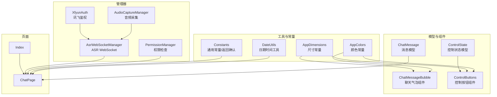
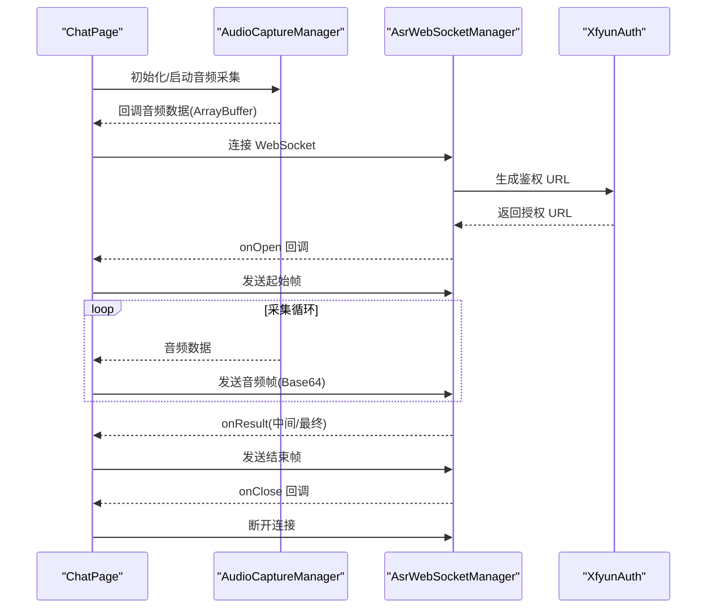
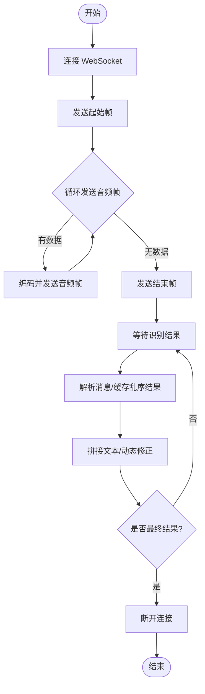
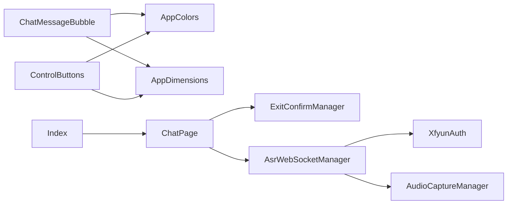

# 工具类和实用程序

<cite>
**本文引用的文件**
- [DateUtils.ets](file://entry/src/main/ets/utils/DateUtils.ets)
- [AppColors.ets](file://entry/src/main/ets/constants/AppColors.ets)
- [AppDimensions.ets](file://entry/src/main/ets/constants/AppDimensions.ets)
- [Constants.ets](file://entry/src/main/ets/common/Constants.ets)
- [PermissionManager.ets](file://entry/src/main/ets/managers/PermissionManager.ets)
- [AsrWebSocketManager.ets](file://entry/src/main/ets/managers/AsrWebSocketManager.ets)
- [AudioCaptureManager.ets](file://entry/src/main/ets/managers/AudioCaptureManager.ets)
- [XfyunAuth.ets](file://entry/src/main/ets/managers/XfyunAuth.ets)
- [ChatMessage.ets](file://entry/src/main/ets/models/ChatMessage.ets)
- [ControlState.ets](file://entry/src/main/ets/models/ControlState.ets)
- [ChatMessageBubble.ets](file://entry/src/main/ets/components/chat/ChatMessageBubble.ets)
- [ControlButtons.ets](file://entry/src/main/ets/components/control/ControlButtons.ets)
- [ChatPage.ets](file://entry/src/main/ets/pages/ChatPage.ets)
- [Index.ets](file://entry/src/main/ets/pages/Index.ets)
</cite>

## 目录
1. [简介](#简介)
2. [项目结构](#项目结构)
3. [核心组件](#核心组件)
4. [架构总览](#架构总览)
5. [详细组件分析](#详细组件分析)
6. [依赖关系分析](#依赖关系分析)
7. [性能考虑](#性能考虑)
8. [故障排查指南](#故障排查指南)
9. [结论](#结论)
10. [附录](#附录)

## 简介
本文件聚焦于项目中的工具类与实用程序，涵盖以下方面：
- 日期时间工具：格式化、当前时间获取
- 颜色常量：色彩系统、主题适配与动态切换思路
- 尺寸常量：响应式单位、屏幕适配与设计系统
- 性能分析与调试：网络语音识别链路的连接、消息处理与资源释放
- 通用工具函数：权限检查、音频采集、鉴权与 WebSocket 管理
- 扩展与自定义：新增功能与优化建议
- 最佳实践与注意事项

## 项目结构
该工程采用按功能域分层组织，工具与实用程序主要分布在 constants、utils、managers、models、components、pages 等目录中。核心工具类与实用程序如下：
- 日期时间工具：utils/DateUtils.ets
- 颜色常量：constants/AppColors.ets
- 尺寸常量：constants/AppDimensions.ets
- 通用常量与返回确认管理：common/Constants.ets
- 权限管理：managers/PermissionManager.ets
- ASR 语音识别链路：managers/AsrWebSocketManager.ets、managers/XfyunAuth.ets、managers/AudioCaptureManager.ets
- 数据模型：models/ChatMessage.ets、models/ControlState.ets
- 组件使用示例：components/chat/ChatMessageBubble.ets、components/control/ControlButtons.ets
- 页面集成示例：pages/ChatPage.ets、pages/Index.ets

图表来源
- [DateUtils.ets:1-28](file://entry/src/main/ets/utils/DateUtils.ets#L1-L28)
- [AppColors.ets:1-47](file://entry/src/main/ets/constants/AppColors.ets#L1-L47)
- [AppDimensions.ets:1-40](file://entry/src/main/ets/constants/AppDimensions.ets#L1-L40)
- [Constants.ets:1-82](file://entry/src/main/ets/common/Constants.ets#L1-L82)
- [PermissionManager.ets:1-28](file://entry/src/main/ets/managers/PermissionManager.ets#L1-L28)
- [AudioCaptureManager.ets:1-80](file://entry/src/main/ets/managers/AudioCaptureManager.ets#L1-L80)
- [XfyunAuth.ets:1-34](file://entry/src/main/ets/managers/XfyunAuth.ets#L1-L34)
- [AsrWebSocketManager.ets:1-271](file://entry/src/main/ets/managers/AsrWebSocketManager.ets#L1-L271)
- [ChatMessage.ets:1-9](file://entry/src/main/ets/models/ChatMessage.ets#L1-L9)
- [ControlState.ets:1-67](file://entry/src/main/ets/models/ControlState.ets#L1-L67)
- [ChatMessageBubble.ets:1-38](file://entry/src/main/ets/components/chat/ChatMessageBubble.ets#L1-L38)
- [ControlButtons.ets:1-48](file://entry/src/main/ets/components/control/ControlButtons.ets#L1-L48)
- [ChatPage.ets:1-76](file://entry/src/main/ets/pages/ChatPage.ets#L1-L76)
- [Index.ets:1-115](file://entry/src/main/ets/pages/Index.ets#L1-L115)

章节来源
- [DateUtils.ets:1-28](file://entry/src/main/ets/utils/DateUtils.ets#L1-L28)
- [AppColors.ets:1-47](file://entry/src/main/ets/constants/AppColors.ets#L1-L47)
- [AppDimensions.ets:1-40](file://entry/src/main/ets/constants/AppDimensions.ets#L1-L40)
- [Constants.ets:1-82](file://entry/src/main/ets/common/Constants.ets#L1-L82)
- [PermissionManager.ets:1-28](file://entry/src/main/ets/managers/PermissionManager.ets#L1-L28)
- [AudioCaptureManager.ets:1-80](file://entry/src/main/ets/managers/AudioCaptureManager.ets#L1-L80)
- [XfyunAuth.ets:1-34](file://entry/src/main/ets/managers/XfyunAuth.ets#L1-L34)
- [AsrWebSocketManager.ets:1-271](file://entry/src/main/ets/managers/AsrWebSocketManager.ets#L1-L271)
- [ChatMessage.ets:1-9](file://entry/src/main/ets/models/ChatMessage.ets#L1-L9)
- [ControlState.ets:1-67](file://entry/src/main/ets/models/ControlState.ets#L1-L67)
- [ChatMessageBubble.ets:1-38](file://entry/src/main/ets/components/chat/ChatMessageBubble.ets#L1-L38)
- [ControlButtons.ets:1-48](file://entry/src/main/ets/components/control/ControlButtons.ets#L1-L48)
- [ChatPage.ets:1-76](file://entry/src/main/ets/pages/ChatPage.ets#L1-L76)
- [Index.ets:1-115](file://entry/src/main/ets/pages/Index.ets#L1-L115)

## 核心组件
- 日期时间工具：提供日期时间格式化与当前时间获取能力，便于日志与界面显示。
- 颜色常量：集中定义主背景、文字、状态、控件、滑块、分隔线、圆环图与阴影等颜色，统一主题风格。
- 尺寸常量：统一间距、圆角、字体大小、高度、滑块尺寸与图片尺寸，支撑设计系统与响应式布局。
- 通用常量与返回确认：封装采样率、通道数、缓冲区大小以及“再按一次退出”逻辑。
- 权限管理：封装麦克风与网络权限检查与申请流程。
- 音频采集：封装音频捕获初始化、启动、停止与释放。
- 讯飞鉴权：生成 WebSocket 连接所需的鉴权 URL。
- ASR WebSocket 管理：负责连接建立、消息解析、结果拼接、动态修正、断开清理。

章节来源
- [DateUtils.ets:10-27](file://entry/src/main/ets/utils/DateUtils.ets#L10-L27)
- [AppColors.ets:5-47](file://entry/src/main/ets/constants/AppColors.ets#L5-L47)
- [AppDimensions.ets:5-40](file://entry/src/main/ets/constants/AppDimensions.ets#L5-L40)
- [Constants.ets:4-14](file://entry/src/main/ets/common/Constants.ets#L4-L14)
- [Constants.ets:19-82](file://entry/src/main/ets/common/Constants.ets#L19-L82)
- [PermissionManager.ets:8-27](file://entry/src/main/ets/managers/PermissionManager.ets#L8-L27)
- [AudioCaptureManager.ets:11-79](file://entry/src/main/ets/managers/AudioCaptureManager.ets#L11-L79)
- [XfyunAuth.ets:7-24](file://entry/src/main/ets/managers/XfyunAuth.ets#L7-L24)
- [AsrWebSocketManager.ets:82-271](file://entry/src/main/ets/managers/AsrWebSocketManager.ets#L82-L271)

## 架构总览
下图展示了从页面到工具与管理器的整体调用关系，重点体现 ASR 语音识别链路的端到端流程。

图表来源
- [ChatPage.ets:1-76](file://entry/src/main/ets/pages/ChatPage.ets#L1-L76)
- [AudioCaptureManager.ets:36-53](file://entry/src/main/ets/managers/AudioCaptureManager.ets#L36-L53)
- [AsrWebSocketManager.ets:92-144](file://entry/src/main/ets/managers/AsrWebSocketManager.ets#L92-L144)
- [XfyunAuth.ets:7-24](file://entry/src/main/ets/managers/XfyunAuth.ets#L7-L24)

## 详细组件分析

### 日期时间工具（DateUtils）
- 功能要点
  - 格式化日期时间：输出 yyyy/M/d HH:mm:ss 格式字符串
  - 获取当前时间：基于 formatDateTime 包装
- 使用建议
  - 在日志记录、事件显示、数据导出等场景统一使用
  - 如需国际化与时区转换，可扩展为带 locale 与 timezone 参数的版本
- 复杂度
  - 时间复杂度 O(1)，空间复杂度 O(1)

章节来源
- [DateUtils.ets:10-27](file://entry/src/main/ets/utils/DateUtils.ets#L10-L27)

### 颜色常量（AppColors）
- 设计原则
  - 分类明确：主背景、文字、状态、控件、滑块、分隔线、圆环图、阴影
  - 语义化命名：如 PRIMARY_BG、TEXT_PRIMARY、SUCCESS、BUTTON_HOVER 等
  - 统一入口：组件通过常量引用，便于主题切换与批量修改
- 主题适配与动态切换
  - 可引入主题上下文或状态管理，将 AppColors 封装为可变主题对象
  - 在暗/亮主题之间切换时，更新主题变量并触发 UI 重新渲染
- 使用示例
  - 组件中直接引用常量进行背景、文字、边框等样式设置

章节来源
- [AppColors.ets:5-47](file://entry/src/main/ets/constants/AppColors.ets#L5-L47)
- [ChatMessageBubble.ets:10-37](file://entry/src/main/ets/components/chat/ChatMessageBubble.ets#L10-L37)
- [ControlButtons.ets:17-47](file://entry/src/main/ets/components/control/ControlButtons.ets#L17-L47)

### 尺寸常量（AppDimensions）
- 设计原则
  - 间距、圆角、字体、高度、滑块与图片尺寸统一管理
  - 基于设计系统，保证视觉一致性与可维护性
- 响应式与屏幕适配
  - 可结合设备密度与屏幕尺寸动态调整常量值
  - 在组件中优先使用常量，避免硬编码数值
- 使用示例
  - 组件内统一使用 SPACING、FONT_SIZE、RADIUS 等常量

章节来源
- [AppDimensions.ets:5-40](file://entry/src/main/ets/constants/AppDimensions.ets#L5-L40)
- [ControlButtons.ets:18-46](file://entry/src/main/ets/components/control/ControlButtons.ets#L18-L46)

### 通用常量与返回确认（Constants）
- 通用常量
  - 音频采样率、通道数、缓冲区大小
  - 讯飞 ASR 相关配置（APP ID、API Key/Secret、主机与 URL）
- 返回确认管理
  - 提供 handleBackPress、terminateApp、reset 等方法
  - 支持“再按一次退出”的交互逻辑与进程终止

章节来源
- [Constants.ets:4-14](file://entry/src/main/ets/common/Constants.ets#L4-L14)
- [Constants.ets:19-82](file://entry/src/main/ets/common/Constants.ets#L19-L82)
- [ChatPage.ets:68-74](file://entry/src/main/ets/pages/ChatPage.ets#L68-L74)

### 权限管理（PermissionManager）
- 职责
  - 检查与请求麦克风与网络权限
  - 统一错误处理与返回布尔结果
- 使用建议
  - 在需要录音或网络访问的页面/功能前调用
  - 结合用户引导与权限说明，提升通过率

章节来源
- [PermissionManager.ets:8-27](file://entry/src/main/ets/managers/PermissionManager.ets#L8-L27)

### 音频采集（AudioCaptureManager）
- 职责
  - 初始化音频捕获器，配置采样率、通道、采样格式与编码
  - 启动/停止/释放音频流，并在回调中传递原始音频数据
- 注意事项
  - 需先获得麦克风权限
  - 在页面销毁时及时释放资源，避免内存泄漏

章节来源
- [AudioCaptureManager.ets:11-79](file://entry/src/main/ets/managers/AudioCaptureManager.ets#L11-L79)

### 讯飞鉴权（XfyunAuth）
- 职责
  - 生成符合讯飞要求的 WebSocket 鉴权 URL
  - 使用 HMAC-SHA256 生成签名并 Base64 编码
- 安全建议
  - 密钥与签名生成过程应在服务端完成，客户端仅做 URL 拼接与传输

章节来源
- [XfyunAuth.ets:7-24](file://entry/src/main/ets/managers/XfyunAuth.ets#L7-L24)

### ASR WebSocket 管理（AsrWebSocketManager）
- 职责
  - 连接建立、消息接收与解析、结果拼接与动态修正、断开清理
  - 将音频数据编码为 Base64 并发送
- 关键流程
  - 连接：生成 URL -> 创建 WebSocket -> 监听 open/message/error/close
  - 发送：起始帧 -> 音频帧 -> 结束帧
  - 结果：缓存乱序结果、动态修正、拼接文本、区分中间/最终结果
- 性能与稳定性
  - 使用数组缓存结果，按序列号拼接，减少 UI 抖动
  - 异常分支清晰，错误日志完整

图表来源
- [AsrWebSocketManager.ets:92-144](file://entry/src/main/ets/managers/AsrWebSocketManager.ets#L92-L144)
- [AsrWebSocketManager.ets:167-189](file://entry/src/main/ets/managers/AsrWebSocketManager.ets#L167-L189)
- [AsrWebSocketManager.ets:197-254](file://entry/src/main/ets/managers/AsrWebSocketManager.ets#L197-L254)

章节来源
- [AsrWebSocketManager.ets:82-271](file://entry/src/main/ets/managers/AsrWebSocketManager.ets#L82-L271)

### 数据模型（ChatMessage、ControlState）
- ChatMessage：描述消息标识、类型（用户/系统）、内容与时间戳
- ControlState：描述控制模式、按钮类型、指示灯与风扇状态、执行器占用与联动比例等

章节来源
- [ChatMessage.ets:4-9](file://entry/src/main/ets/models/ChatMessage.ets#L4-L9)
- [ControlState.ets:28-67](file://entry/src/main/ets/models/ControlState.ets#L28-L67)

### 组件使用示例（ChatMessageBubble、ControlButtons）
- ChatMessageBubble：根据消息类型（系统/用户）设置不同背景与对齐方式
- ControlButtons：使用 AppColors 与 AppDimensions 实现统一风格的按钮组，支持单选与点击回调

章节来源
- [ChatMessageBubble.ets:10-37](file://entry/src/main/ets/components/chat/ChatMessageBubble.ets#L10-L37)
- [ControlButtons.ets:17-47](file://entry/src/main/ets/components/control/ControlButtons.ets#L17-L47)

### 页面集成示例（ChatPage、Index）
- ChatPage：展示消息列表、底部语音输入区，集成返回确认逻辑
- Index：底部导航与路由栈管理，承载子页面

章节来源
- [ChatPage.ets:1-76](file://entry/src/main/ets/pages/ChatPage.ets#L1-L76)
- [Index.ets:1-115](file://entry/src/main/ets/pages/Index.ets#L1-L115)

## 依赖关系分析
- 组件依赖常量：ChatMessageBubble、ControlButtons 依赖 AppColors 与 AppDimensions
- 页面依赖管理器：ChatPage 依赖 ExitConfirmManager；Index 管理路由
- ASR 链路：AudioCaptureManager 采集音频，XfyunAuth 生成 URL，AsrWebSocketManager 负责连接与消息处理
- 权限前置：PermissionManager 在音频采集与网络访问前调用

图表来源
- [ChatMessageBubble.ets:1-38](file://entry/src/main/ets/components/chat/ChatMessageBubble.ets#L1-L38)
- [ControlButtons.ets:1-48](file://entry/src/main/ets/components/control/ControlButtons.ets#L1-L48)
- [ChatPage.ets:1-76](file://entry/src/main/ets/pages/ChatPage.ets#L1-L76)
- [Index.ets:1-115](file://entry/src/main/ets/pages/Index.ets#L1-L115)
- [AsrWebSocketManager.ets:1-271](file://entry/src/main/ets/managers/AsrWebSocketManager.ets#L1-L271)
- [XfyunAuth.ets:1-34](file://entry/src/main/ets/managers/XfyunAuth.ets#L1-L34)
- [AudioCaptureManager.ets:1-80](file://entry/src/main/ets/managers/AudioCaptureManager.ets#L1-L80)
- [Constants.ets:1-82](file://entry/src/main/ets/common/Constants.ets#L1-L82)

## 性能考虑
- WebSocket 连接与消息处理
  - 使用缓存数组按序列号拼接结果，避免频繁 UI 更新
  - 在收到最终结果后主动断开连接，释放资源
- 音频采集
  - 合理设置采样率与缓冲区大小，平衡延迟与质量
  - 在页面销毁或不再使用时及时 stop 与 release
- 权限检查
  - 避免重复请求权限，先检查再请求
- 日志与调试
  - 在关键路径打印日志，便于定位问题
  - 使用 try/catch 包裹异步操作，防止未捕获异常导致崩溃

## 故障排查指南
- WebSocket 连接失败
  - 检查鉴权 URL 生成是否正确，Host、Date、Authorization 是否完整
  - 查看 open/error/close 回调日志，定位具体错误码
- 音频无法采集
  - 确认麦克风权限已授予
  - 检查采样率、通道与编码配置是否匹配
- 识别结果异常
  - 观察动态修正（rpl）逻辑是否被触发
  - 确保 Base64 编码与 UTF-8 解码正确
- 返回确认无效
  - 确认 handleBackPress 返回值与定时器状态
  - 在切换 Tab 时调用 reset 清理状态

章节来源
- [AsrWebSocketManager.ets:92-144](file://entry/src/main/ets/managers/AsrWebSocketManager.ets#L92-L144)
- [AsrWebSocketManager.ets:197-254](file://entry/src/main/ets/managers/AsrWebSocketManager.ets#L197-L254)
- [AudioCaptureManager.ets:36-79](file://entry/src/main/ets/managers/AudioCaptureManager.ets#L36-L79)
- [PermissionManager.ets:8-27](file://entry/src/main/ets/managers/PermissionManager.ets#L8-L27)
- [Constants.ets:19-82](file://entry/src/main/ets/common/Constants.ets#L19-L82)

## 结论
本项目的工具类与实用程序围绕“统一常量、清晰职责、可扩展性”展开。日期时间工具、颜色与尺寸常量为界面一致性提供基础；权限、音频采集与 ASR 管理器构成完整的语音识别链路。建议后续在以下方向持续演进：
- 引入主题上下文与动态切换机制
- 扩展日期工具的国际化与时区支持
- 增加性能监控埋点与内存使用统计
- 完善错误分类与统一提示策略

## 附录
- 扩展与自定义建议
  - 新增颜色：在 AppColors 中按类别补充，组件中统一引用
  - 新增尺寸：在 AppDimensions 中按类别补充，组件中统一引用
  - 新增工具函数：遵循单一职责，提供清晰的输入输出与错误处理
  - 优化现有功能：在 ASR 链路中增加重连策略与退避算法
- 最佳实践
  - 常量集中管理，避免硬编码
  - 组件样式与布局尽量依赖常量
  - 管理器生命周期与资源释放要成对出现
  - 异步流程统一错误处理与日志记录