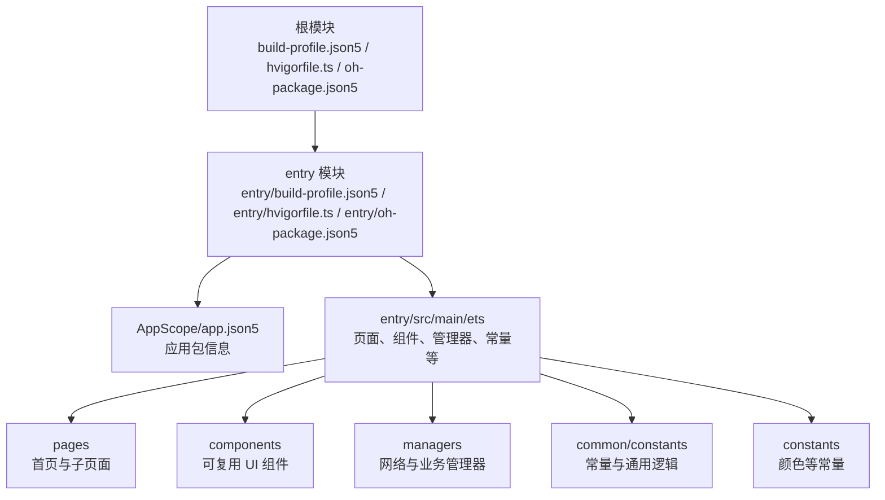
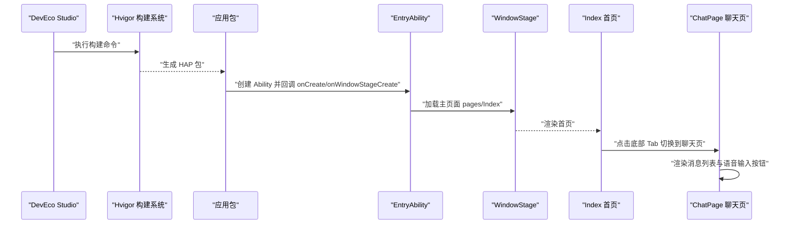
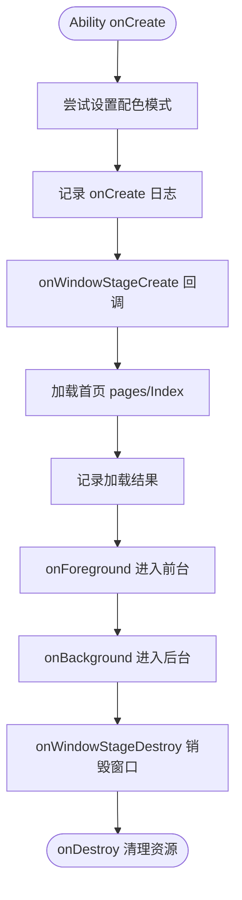
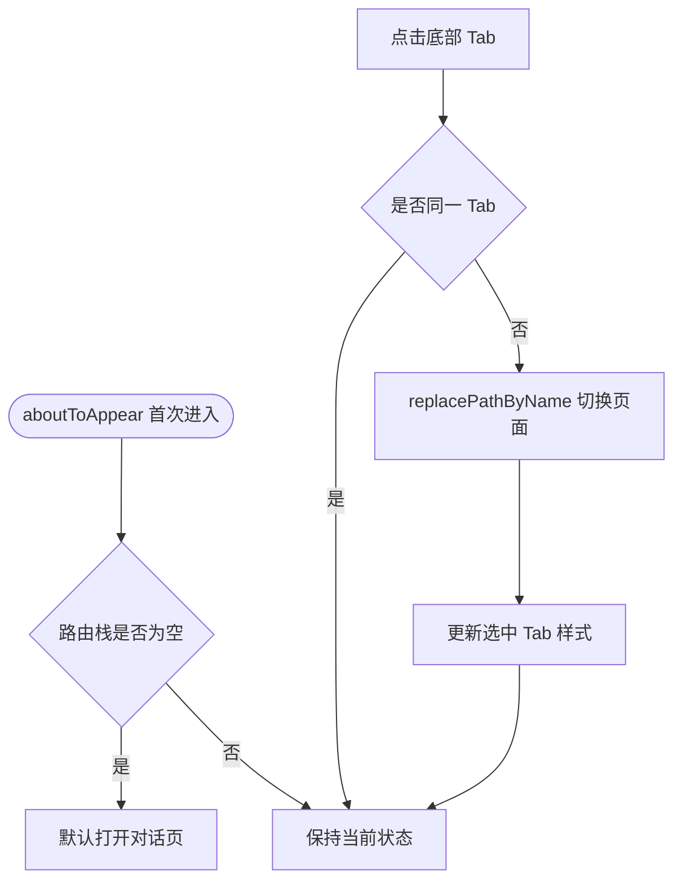
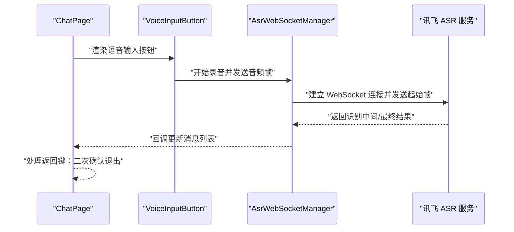
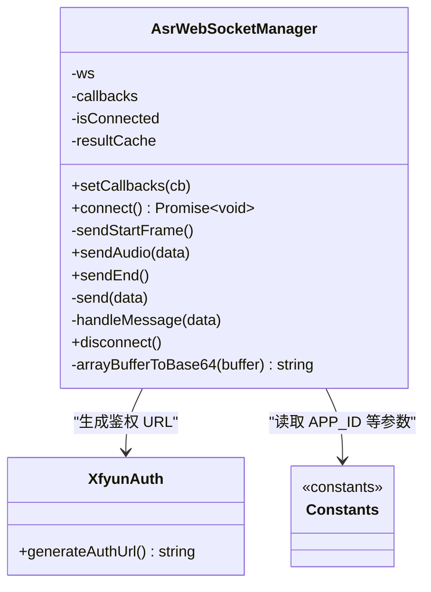
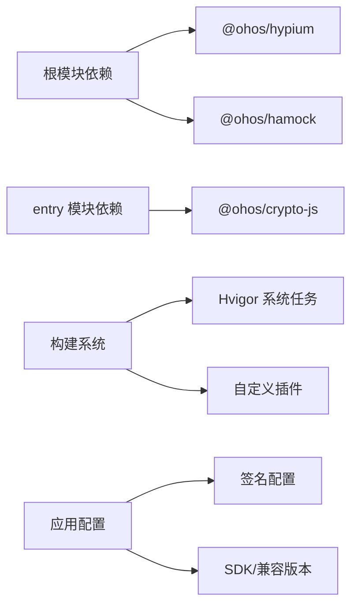

# 快速开始

<cite>
**本文引用的文件**
- [build-profile.json5](file://build-profile.json5)
- [entry/build-profile.json5](file://entry/build-profile.json5)
- [hvigorfile.ts](file://hvigorfile.ts)
- [entry/hvigorfile.ts](file://entry/hvigorfile.ts)
- [oh-package.json5](file://oh-package.json5)
- [entry/oh-package.json5](file://entry/oh-package.json5)
- [AppScope/app.json5](file://AppScope/app.json5)
- [entry/src/main/ets/entryability/EntryAbility.ets](file://entry/src/main/ets/entryability/EntryAbility.ets)
- [entry/src/main/ets/pages/Index.ets](file://entry/src/main/ets/pages/Index.ets)
- [entry/src/main/ets/pages/ChatPage.ets](file://entry/src/main/ets/pages/ChatPage.ets)
- [entry/src/main/ets/components/chat/ChatMessageBubble.ets](file://entry/src/main/ets/components/chat/ChatMessageBubble.ets)
- [entry/src/main/ets/managers/AsrWebSocketManager.ets](file://entry/src/main/ets/managers/AsrWebSocketManager.ets)
- [entry/src/main/ets/common/Constants.ets](file://entry/src/main/ets/common/Constants.ets)
- [entry/src/main/ets/constants/AppColors.ets](file://entry/src/main/ets/constants/AppColors.ets)
- [hvigor/hvigor-config.json5](file://hvigor/hvigor-config.json5)
</cite>

## 目录
1. [简介](#简介)
2. [项目结构](#项目结构)
3. [核心组件](#核心组件)
4. [架构总览](#架构总览)
5. [详细组件分析](#详细组件分析)
6. [依赖分析](#依赖分析)
7. [性能考虑](#性能考虑)
8. [故障排查指南](#故障排查指南)
9. [结论](#结论)
10. [附录](#附录)

## 简介
本指南面向初学者，帮助你在 OpenHarmony 生态中快速搭建 SmartController 项目的开发环境，并完成首次构建与运行。你将学会：
- 安装与配置 OpenHarmony 开发生态（含 DevEco Studio、SDK、工具链）
- 克隆仓库、安装依赖、执行构建
- 理解项目目录结构与关键配置文件
- 排查常见环境问题
- 实现第一个功能：在聊天页发起语音输入并通过 WebSocket 与服务端交互

## 项目结构
SmartController 采用多模块结构，根模块负责应用级配置，entry 模块承载 UI 页面与业务逻辑。

图表来源
- [build-profile.json5:26-35](file://build-profile.json5#L26-L35)
- [entry/build-profile.json5:25-32](file://entry/build-profile.json5#L25-L32)
- [hvigorfile.ts:3-6](file://hvigorfile.ts#L3-L6)
- [entry/hvigorfile.ts:3-6](file://entry/hvigorfile.ts#L3-L6)
- [oh-package.json5:1-10](file://oh-package.json5#L1-L10)
- [entry/oh-package.json5:1-13](file://entry/oh-package.json5#L1-L13)
- [AppScope/app.json5:1-2](file://AppScope/app.json5#L1-L2)

章节来源
- [build-profile.json5:1-73](file://build-profile.json5#L1-L73)
- [entry/build-profile.json5:1-33](file://entry/build-profile.json5#L1-L33)
- [hvigorfile.ts:1-6](file://hvigorfile.ts#L1-L6)
- [entry/hvigorfile.ts:1-6](file://entry/hvigorfile.ts#L1-L6)
- [oh-package.json5:1-10](file://oh-package.json5#L1-L10)
- [entry/oh-package.json5:1-13](file://entry/oh-package.json5#L1-L13)
- [AppScope/app.json5:1-2](file://AppScope/app.json5#L1-L2)

## 核心组件
- 应用入口 Ability：负责窗口生命周期与主页面加载
- 首页 Index：底部导航与子页面路由
- 聊天页 ChatPage：消息列表与语音输入按钮
- 语音识别 WebSocket 管理器：连接讯飞 ASR 服务并解析结果
- 常量与颜色：统一配置采样率、URL、颜色主题等

章节来源
- [entry/src/main/ets/entryability/EntryAbility.ets:1-48](file://entry/src/main/ets/entryability/EntryAbility.ets#L1-L48)
- [entry/src/main/ets/pages/Index.ets:1-115](file://entry/src/main/ets/pages/Index.ets#L1-L115)
- [entry/src/main/ets/pages/ChatPage.ets:1-83](file://entry/src/main/ets/pages/ChatPage.ets#L1-L83)
- [entry/src/main/ets/managers/AsrWebSocketManager.ets:1-271](file://entry/src/main/ets/managers/AsrWebSocketManager.ets#L1-L271)
- [entry/src/main/ets/common/Constants.ets:1-82](file://entry/src/main/ets/common/Constants.ets#L1-L82)
- [entry/src/main/ets/constants/AppColors.ets:1-47](file://entry/src/main/ets/constants/AppColors.ets#L1-L47)

## 架构总览
从启动到页面渲染，再到语音识别流程的关键路径如下：

图表来源
- [entry/src/main/ets/entryability/EntryAbility.ets:21-32](file://entry/src/main/ets/entryability/EntryAbility.ets#L21-L32)
- [entry/src/main/ets/pages/Index.ets:13-32](file://entry/src/main/ets/pages/Index.ets#L13-L32)
- [entry/src/main/ets/pages/ChatPage.ets:13-20](file://entry/src/main/ets/pages/ChatPage.ets#L13-L20)

## 详细组件分析

### 组件一：应用入口与窗口生命周期
- 职责：初始化能力上下文、设置配色模式、加载首页内容
- 关键点：通过窗口阶段回调加载首页，记录日志便于调试

图表来源
- [entry/src/main/ets/entryability/EntryAbility.ets:7-47](file://entry/src/main/ets/entryability/EntryAbility.ets#L7-L47)

章节来源
- [entry/src/main/ets/entryability/EntryAbility.ets:1-48](file://entry/src/main/ets/entryability/EntryAbility.ets#L1-L48)

### 组件二：首页导航与路由
- 职责：提供底部三栏导航，维护路由栈并在子页面间切换
- 关键点：通过导航模式与路由映射注入子页面，保持栈深度为 1

图表来源
- [entry/src/main/ets/pages/Index.ets:28-48](file://entry/src/main/ets/pages/Index.ets#L28-L48)

章节来源
- [entry/src/main/ets/pages/Index.ets:1-115](file://entry/src/main/ets/pages/Index.ets#L1-L115)

### 组件三：聊天页与语音输入
- 职责：展示消息列表、渲染语音输入按钮、处理返回键退出确认
- 关键点：根据消息类型区分左右气泡样式；支持返回键二次确认退出

图表来源
- [entry/src/main/ets/pages/ChatPage.ets:10-11](file://entry/src/main/ets/pages/ChatPage.ets#L10-L11)
- [entry/src/main/ets/managers/AsrWebSocketManager.ets:92-144](file://entry/src/main/ets/managers/AsrWebSocketManager.ets#L92-L144)

章节来源
- [entry/src/main/ets/pages/ChatPage.ets:1-83](file://entry/src/main/ets/pages/ChatPage.ets#L1-L83)
- [entry/src/main/ets/components/chat/ChatMessageBubble.ets:1-38](file://entry/src/main/ets/components/chat/ChatMessageBubble.ets#L1-L38)
- [entry/src/main/ets/managers/AsrWebSocketManager.ets:1-271](file://entry/src/main/ets/managers/AsrWebSocketManager.ets#L1-L271)

### 组件四：语音识别 WebSocket 管理器
- 职责：封装 WebSocket 连接、发送起始帧与音频帧、解析识别结果、断开连接
- 关键点：严格遵循讯飞接口的数据结构；乱序结果缓存与拼接；最终结果后自动断开

图表来源
- [entry/src/main/ets/managers/AsrWebSocketManager.ets:82-271](file://entry/src/main/ets/managers/AsrWebSocketManager.ets#L82-L271)
- [entry/src/main/ets/common/Constants.ets:4-14](file://entry/src/main/ets/common/Constants.ets#L4-L14)

章节来源
- [entry/src/main/ets/managers/AsrWebSocketManager.ets:1-271](file://entry/src/main/ets/managers/AsrWebSocketManager.ets#L1-L271)
- [entry/src/main/ets/common/Constants.ets:1-82](file://entry/src/main/ets/common/Constants.ets#L1-L82)

## 依赖分析
- 根模块依赖：测试框架与模拟库（hypium、hamock）
- entry 模块依赖：加密库 crypto-js
- 构建系统：Hvigor 默认任务与插件扩展点
- 运行时：OpenHarmony SDK 版本与签名配置

图表来源
- [oh-package.json5:5-8](file://oh-package.json5#L5-L8)
- [entry/oh-package.json5:8-10](file://entry/oh-package.json5#L8-L10)
- [hvigorfile.ts:3-6](file://hvigorfile.ts#L3-L6)
- [entry/hvigorfile.ts:3-6](file://entry/hvigorfile.ts#L3-L6)
- [build-profile.json5:30-35](file://build-profile.json5#L30-L35)
- [build-profile.json5:44-57](file://build-profile.json5#L44-L57)

章节来源
- [oh-package.json5:1-10](file://oh-package.json5#L1-L10)
- [entry/oh-package.json5:1-13](file://entry/oh-package.json5#L1-L13)
- [hvigorfile.ts:1-6](file://hvigorfile.ts#L1-L6)
- [entry/hvigorfile.ts:1-6](file://entry/hvigorfile.ts#L1-L6)
- [build-profile.json5:1-73](file://build-profile.json5#L1-L73)

## 性能考虑
- 构建优化：可通过 Hvigor 配置启用并行编译、增量编译等策略（已在配置文件中预留开关）
- 类型检查：可按需开启类型检查以提升开发体验
- 日志级别：在调试阶段可调整日志等级以便定位问题

章节来源
- [hvigor/hvigor-config.json5:5-23](file://hvigor/hvigor-config.json5#L5-L23)

## 故障排查指南
- 构建失败（签名相关）
  - 现象：构建时报签名文件或密码错误
  - 排查：检查签名配置字段与证书路径是否正确
  - 参考：[build-profile.json5:44-57](file://build-profile.json5#L44-L57)
- 无法加载首页
  - 现象：窗口创建后无法显示首页
  - 排查：确认首页路径与窗口回调是否正确；查看日志输出
  - 参考：[entry/src/main/ets/entryability/EntryAbility.ets:25-31](file://entry/src/main/ets/entryability/EntryAbility.ets#L25-L31)
- 语音识别无响应
  - 现象：点击语音按钮无结果
  - 排查：检查 WebSocket 连接回调、鉴权 URL 生成、音频帧发送
  - 参考：[entry/src/main/ets/managers/AsrWebSocketManager.ets:92-144](file://entry/src/main/ets/managers/AsrWebSocketManager.ets#L92-L144)
- 返回键退出异常
  - 现象：返回键未触发二次确认退出
  - 排查：确认 onBackPressed 回调与退出管理器状态重置
  - 参考：[entry/src/main/ets/pages/ChatPage.ets:75-81](file://entry/src/main/ets/pages/ChatPage.ets#L75-L81), [entry/src/main/ets/common/Constants.ets:19-82](file://entry/src/main/ets/common/Constants.ets#L19-L82)

## 结论
通过本指南，你已经完成了 SmartController 项目的环境搭建、依赖安装与首次构建，并理解了应用入口、首页导航、聊天页与语音识别管理器的核心工作方式。建议在本地设备或模拟器上运行应用，逐步熟悉各页面与组件的交互，再基于现有结构扩展新功能。

## 附录

### A. 开发环境搭建步骤（概览）
- 安装 DevEco Studio 并配置 OpenHarmony SDK
- 准备签名文件与证书（参考签名配置）
- 打开项目，执行构建命令生成 HAP 包
- 将 HAP 安装到目标设备并运行

章节来源
- [build-profile.json5:44-57](file://build-profile.json5#L44-L57)
- [hvigorfile.ts:3-6](file://hvigorfile.ts#L3-L6)
- [entry/hvigorfile.ts:3-6](file://entry/hvigorfile.ts#L3-L6)

### B. 项目结构与关键配置文件说明
- 根配置
  - 构建产品与签名：[build-profile.json5:26-57](file://build-profile.json5#L26-L57)
  - Hvigor 入口：[hvigorfile.ts:3-6](file://hvigorfile.ts#L3-L6)
  - 依赖声明：[oh-package.json5:5-8](file://oh-package.json5#L5-L8)
- entry 模块
  - 构建选项与目标：[entry/build-profile.json5:1-33](file://entry/build-profile.json5#L1-L33)
  - Hvigor 入口：[entry/hvigorfile.ts:3-6](file://entry/hvigorfile.ts#L3-L6)
  - 依赖声明：[entry/oh-package.json5:8-10](file://entry/oh-package.json5#L8-L10)
- 应用包信息
  - 包名、图标、标签等：[AppScope/app.json5:1-2](file://AppScope/app.json5#L1-L2)

章节来源
- [build-profile.json5:1-73](file://build-profile.json5#L1-L73)
- [hvigorfile.ts:1-6](file://hvigorfile.ts#L1-L6)
- [entry/build-profile.json5:1-33](file://entry/build-profile.json5#L1-L33)
- [entry/hvigorfile.ts:1-6](file://entry/hvigorfile.ts#L1-L6)
- [oh-package.json5:1-10](file://oh-package.json5#L1-L10)
- [entry/oh-package.json5:1-13](file://entry/oh-package.json5#L1-L13)
- [AppScope/app.json5:1-2](file://AppScope/app.json5#L1-L2)

### C. 第一个功能：实现语音输入与识别
- 步骤
  - 在聊天页引入语音输入组件并绑定事件
  - 初始化 WebSocket 管理器并连接服务端
  - 录制音频并发送起始帧与音频帧，接收识别结果并更新界面
- 参考
  - 聊天页集成：[entry/src/main/ets/pages/ChatPage.ets:10-11](file://entry/src/main/ets/pages/ChatPage.ets#L10-L11)
  - WebSocket 管理器：[entry/src/main/ets/managers/AsrWebSocketManager.ets:92-144](file://entry/src/main/ets/managers/AsrWebSocketManager.ets#L92-L144)
  - 常量配置：[entry/src/main/ets/common/Constants.ets:4-14](file://entry/src/main/ets/common/Constants.ets#L4-L14)

章节来源
- [entry/src/main/ets/pages/ChatPage.ets:1-83](file://entry/src/main/ets/pages/ChatPage.ets#L1-L83)
- [entry/src/main/ets/managers/AsrWebSocketManager.ets:1-271](file://entry/src/main/ets/managers/AsrWebSocketManager.ets#L1-L271)
- [entry/src/main/ets/common/Constants.ets:1-82](file://entry/src/main/ets/common/Constants.ets#L1-L82)