# 数据模型设计

<cite>
**本文引用的文件**
- [ControlState.ets](file://entry/src/main/ets/models/ControlState.ets)
- [ChatMessage.ets](file://entry/src/main/ets/models/ChatMessage.ets)
- [Constants.ets](file://entry/src/main/ets/common/Constants.ets)
- [AppColors.ets](file://entry/src/main/ets/constants/AppColors.ets)
- [AppDimensions.ets](file://entry/src/main/ets/constants/AppDimensions.ets)
- [DateUtils.ets](file://entry/src/main/ets/utils/DateUtils.ets)
- [AsrWebSocketManager.ets](file://entry/src/main/ets/managers/AsrWebSocketManager.ets)
- [AudioCaptureManager.ets](file://entry/src/main/ets/managers/AudioCaptureManager.ets)
- [XfyunAuth.ets](file://entry/src/main/ets/managers/XfyunAuth.ets)
- [ControlConsole.ets](file://entry/src/main/ets/components/control/ControlConsole.ets)
- [ControlButtons.ets](file://entry/src/main/ets/components/control/ControlButtons.ets)
- [StatusIndicator.ets](file://entry/src/main/ets/components/control/StatusIndicator.ets)
- [ChatPage.ets](file://entry/src/main/ets/pages/ChatPage.ets)
- [ChatMessageBubble.ets](file://entry/src/main/ets/components/chat/ChatMessageBubble.ets)
- [get_data.ets](file://entry/src/main/ets/pages/get_data.ets)
- [ActuatorOccupancy.ets](file://entry/src/main/ets/components/actuator/ActuatorOccupancy.ets)
- [IndustrialSensorCard.ets](file://entry/src/main/ets/components/sensor/IndustrialSensorCard.ets)
- [TrendChartCard.ets](file://entry/src/main/ets/pages/TrendChartCard.ets)
- [DataHomePage.ets](file://entry/src/main/ets/pages/DataHomePage.ets)
- [network_connect.ets](file://entry/src/main/ets/pages/network_connect.ets)
</cite>

## 更新摘要
**变更内容**
- 新增完整的实时数据模型设计，包括 ApiResponse 接口和传感器数据结构
- 添加执行器配置数据模型，支持设备状态监控
- 增强数据验证和类型安全机制
- 扩展数据模型之间的关系映射和业务规则约束
- 完善数据模型的扩展和版本管理策略

## 目录
1. [简介](#简介)
2. [项目结构](#项目结构)
3. [核心数据模型](#核心数据模型)
4. [实时数据模型](#实时数据模型)
5. [架构总览](#架构总览)
6. [详细组件分析](#详细组件分析)
7. [依赖关系分析](#依赖关系分析)
8. [性能考量](#性能考量)
9. [故障排查指南](#故障排查指南)
10. [结论](#结论)
11. [附录](#附录)

## 简介
本文件系统性梳理并阐释本项目的"数据模型设计"，重点覆盖以下方面：
- 控制状态数据模型的设计理念：状态字段定义、数据类型选择、业务规则约束与默认值策略
- 实时数据模型：API响应结构、传感器数据格式、执行器配置管理
- 聊天消息数据模型：消息结构、元数据管理与序列化机制
- 常量配置管理：配置项定义、默认值设置与动态更新策略
- 数据模型间的关系映射：实体关联、外键约束与级联操作
- 数据验证与业务规则：输入校验、格式检查与逻辑约束
- 数据模型的扩展与版本管理策略
- 新增与修改数据模型的开发指导

## 项目结构
本项目采用按职责分层的组织方式，数据模型位于 models 目录，实时数据模型位于 pages 目录，常量与工具位于 common、constants、utils，业务组件位于 components，页面位于 pages，管理器位于 managers。

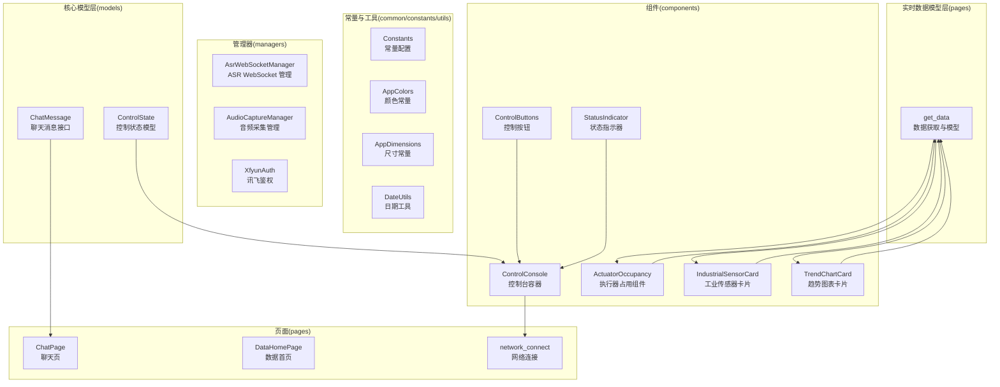

**图表来源**
- [ControlState.ets:28-67](file://entry/src/main/ets/models/ControlState.ets#L28-L67)
- [ChatMessage.ets:4-9](file://entry/src/main/ets/models/ChatMessage.ets#L4-L9)
- [get_data.ets:5-65](file://entry/src/main/ets/pages/get_data.ets#L5-L65)
- [ActuatorOccupancy.ets:14-191](file://entry/src/main/ets/components/actuator/ActuatorOccupancy.ets#L14-L191)
- [IndustrialSensorCard.ets:20-109](file://entry/src/main/ets/components/sensor/IndustrialSensorCard.ets#L20-109)
- [TrendChartCard.ets:8-106](file://entry/src/main/ets/pages/TrendChartCard.ets#L8-L106)
- [ControlConsole.ets:14-276](file://entry/src/main/ets/components/control/ControlConsole.ets#L14-L276)
- [Constants.ets:4-14](file://entry/src/main/ets/common/Constants.ets#L4-L14)
- [AppColors.ets:5-47](file://entry/src/main/ets/constants/AppColors.ets#L5-L47)
- [AppDimensions.ets:5-40](file://entry/src/main/ets/constants/AppDimensions.ets#L5-L40)
- [AsrWebSocketManager.ets:82-271](file://entry/src/main/ets/managers/AsrWebSocketManager.ets#L82-L271)
- [AudioCaptureManager.ets:6-80](file://entry/src/main/ets/managers/AudioCaptureManager.ets#L6-L80)
- [XfyunAuth.ets:6-34](file://entry/src/main/ets/managers/XfyunAuth.ets#L6-L34)
- [ChatPage.ets:1-76](file://entry/src/main/ets/pages/ChatPage.ets#L1-L76)
- [DataHomePage.ets:8-62](file://entry/src/main/ets/pages/DataHomePage.ets#L8-L62)
- [network_connect.ets:43-45](file://entry/src/main/ets/pages/network_connect.ets#L43-L45)

**章节来源**
- [ControlState.ets:1-67](file://entry/src/main/ets/models/ControlState.ets#L1-L67)
- [ChatMessage.ets:1-9](file://entry/src/main/ets/models/ChatMessage.ets#L1-L9)
- [get_data.ets:1-105](file://entry/src/main/ets/pages/get_data.ets#L1-L105)
- [ActuatorOccupancy.ets:1-191](file://entry/src/main/ets/components/actuator/ActuatorOccupancy.ets#L1-L191)
- [IndustrialSensorCard.ets:1-109](file://entry/src/main/ets/components/sensor/IndustrialSensorCard.ets#L1-L109)
- [TrendChartCard.ets:1-106](file://entry/src/main/ets/pages/TrendChartCard.ets#L1-L106)
- [ControlConsole.ets:1-276](file://entry/src/main/ets/components/control/ControlConsole.ets#L1-L276)
- [Constants.ets:1-82](file://entry/src/main/ets/common/Constants.ets#L1-L82)
- [AppColors.ets:1-47](file://entry/src/main/ets/constants/AppColors.ets#L1-L47)
- [AppDimensions.ets:1-40](file://entry/src/main/ets/constants/AppDimensions.ets#L1-L40)
- [DateUtils.ets:1-28](file://entry/src/main/ets/utils/DateUtils.ets#L1-L28)
- [AsrWebSocketManager.ets:1-271](file://entry/src/main/ets/managers/AsrWebSocketManager.ets#L1-L271)
- [AudioCaptureManager.ets:1-80](file://entry/src/main/ets/managers/AudioCaptureManager.ets#L1-L80)
- [XfyunAuth.ets:1-34](file://entry/src/main/ets/managers/XfyunAuth.ets#L1-L34)
- [ChatPage.ets:1-76](file://entry/src/main/ets/pages/ChatPage.ets#L1-L76)
- [DataHomePage.ets:1-62](file://entry/src/main/ets/pages/DataHomePage.ets#L1-L62)
- [network_connect.ets:43-45](file://entry/src/main/ets/pages/network_connect.ets#L43-L45)

## 核心数据模型
本节聚焦两类核心数据模型：控制状态模型与聊天消息模型，并阐述其设计理念、字段语义、数据类型与默认值策略。

- 控制状态模型（ControlState）
  - 字段与类型
    - 枚举型字段：控制模式、按钮类型
    - 布尔型字段：蜂鸣器、绿灯、黄灯、红灯状态
    - 数值型字段：小灯亮度、风扇转速、执行器联动相关计数
  - 默认值策略
    - 提供构造函数与属性初始化双重默认值，确保实例化即可用
    - 关键参数如亮度与转速采用工程上常用的中位值作为初始默认
  - 业务规则约束
    - 数值范围约束：亮度与转速均限定在 0-100 的百分比区间
    - 执行器联动占比由激活数与总数派生计算，需满足非负且不超过 100 的逻辑约束
    - 按钮类型与控制模式之间存在互斥与组合关系，通过按钮点击事件同步更新
  - 设计要点
    - 使用枚举提升可读性与可维护性
    - 将状态与 UI 组件解耦，通过状态变更回调驱动界面刷新

- 聊天消息模型（ChatMessage）
  - 字段与类型
    - 标识符：字符串型 id
    - 类型：联合类型限定为用户或系统两类
    - 内容：字符串型文本
    - 时间戳：字符串型（建议统一为 ISO 或自定义格式）
  - 元数据管理
    - id 用于消息去重与定位
    - type 用于 UI 渲染差异化样式
    - timestamp 用于排序与日志记录
  - 序列化机制
    - 该接口未定义序列化方法，通常通过外部工具或网络层进行 JSON 序列化/反序列化
    - 建议在写入与读取时统一格式，避免解析歧义

**章节来源**
- [ControlState.ets:28-67](file://entry/src/main/ets/models/ControlState.ets#L28-L67)
- [ChatMessage.ets:4-9](file://entry/src/main/ets/models/ChatMessage.ets#L4-L9)

## 实时数据模型
本节介绍新增的实时数据模型设计，包括 API 响应结构、传感器数据格式和执行器配置管理。

- API 响应模型（ApiResponse）
  - 根接口结构：包含 success 状态、meta 元数据、sensor 传感器数据、actuators 执行器配置
  - 类型安全：使用 TypeScript 接口确保数据结构的一致性和完整性
  - 实时性：支持从远程服务器获取最新数据，提供数据更新时间戳

- 传感器数据模型（sensor）
  - 在线状态：boolean 类型表示传感器连接状态
  - 数值数组：包含 10 个传感器测量值的数组
  - 格式化数据：pretty 数组提供人类可读的传感器信息，包含标签、数值、单位和缩放因子
  - 更新时间：updated_at 字段记录数据最后更新时间
  - 数据源：last_source 标识数据来源

- 执行器配置模型（actuators）
  - 线圈状态：coils 对象包含蜂鸣器、绿灯、黄灯、红灯的状态
  - 线圈标签：coil_labels 提供中文标签映射
  - 百分比控制：brightness_percent 和 fan_percent 表示亮度和风扇转速的百分比
  - 更新时间：updated_at 记录执行器状态最后更新时间
  - 数据源：last_source 标识状态来源

- 数据获取与管理（setting）
  - 观察者模式：@ObservedV2 装饰器确保数据变化时自动更新 UI
  - 异步获取：fetchSensorData 方法异步获取远程数据
  - 类型转换：使用强类型断言确保 JSON 解析后的数据类型安全
  - 缓存机制：@Trace 装饰器提供数据追踪功能

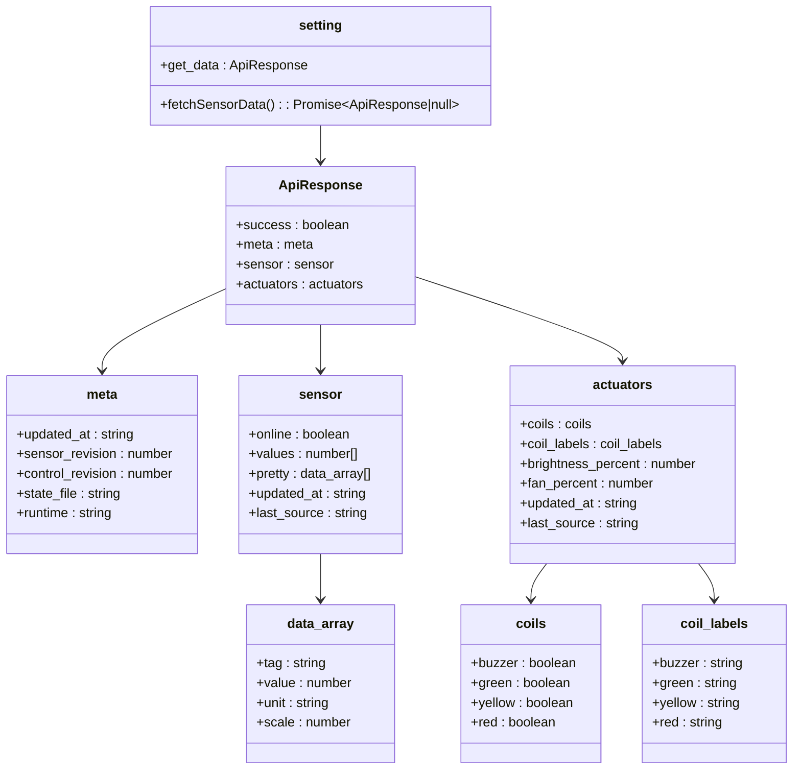

**图表来源**
- [get_data.ets:5-65](file://entry/src/main/ets/pages/get_data.ets#L5-L65)
- [get_data.ets:67-104](file://entry/src/main/ets/pages/get_data.ets#L67-L104)

**章节来源**
- [get_data.ets:5-65](file://entry/src/main/ets/pages/get_data.ets#L5-L65)
- [get_data.ets:67-104](file://entry/src/main/ets/pages/get_data.ets#L67-L104)

## 架构总览
下图展示了数据模型与各层组件的交互关系，强调模型驱动 UI、常量与工具支撑、管理器负责外部集成的架构风格。

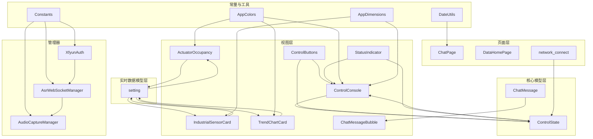

**图表来源**
- [ControlConsole.ets:14-276](file://entry/src/main/ets/components/control/ControlConsole.ets#L14-L276)
- [ControlButtons.ets:10-48](file://entry/src/main/ets/components/control/ControlButtons.ets#L10-L48)
- [StatusIndicator.ets:8-44](file://entry/src/main/ets/components/control/StatusIndicator.ets#L8-L44)
- [ActuatorOccupancy.ets:14-191](file://entry/src/main/ets/components/actuator/ActuatorOccupancy.ets#L14-L191)
- [IndustrialSensorCard.ets:20-109](file://entry/src/main/ets/components/sensor/IndustrialSensorCard.ets#L20-L109)
- [TrendChartCard.ets:8-106](file://entry/src/main/ets/pages/TrendChartCard.ets#L8-L106)
- [ChatMessageBubble.ets:1-38](file://entry/src/main/ets/components/chat/ChatMessageBubble.ets#L1-L38)
- [ControlState.ets:28-67](file://entry/src/main/ets/models/ControlState.ets#L28-L67)
- [ChatMessage.ets:4-9](file://entry/src/main/ets/models/ChatMessage.ets#L4-L9)
- [get_data.ets:67-104](file://entry/src/main/ets/pages/get_data.ets#L67-L104)
- [Constants.ets:4-14](file://entry/src/main/ets/common/Constants.ets#L4-L14)
- [AppColors.ets:5-47](file://entry/src/main/ets/constants/AppColors.ets#L5-L47)
- [AppDimensions.ets:5-40](file://entry/src/main/ets/constants/AppDimensions.ets#L5-L40)
- [AsrWebSocketManager.ets:82-271](file://entry/src/main/ets/managers/AsrWebSocketManager.ets#L82-L271)
- [AudioCaptureManager.ets:6-80](file://entry/src/main/ets/managers/AudioCaptureManager.ets#L6-L80)
- [XfyunAuth.ets:6-34](file://entry/src/main/ets/managers/XfyunAuth.ets#L6-L34)
- [DateUtils.ets:4-28](file://entry/src/main/ets/utils/DateUtils.ets#L4-L28)
- [ChatPage.ets:1-76](file://entry/src/main/ets/pages/ChatPage.ets#L1-L76)
- [DataHomePage.ets:8-62](file://entry/src/main/ets/pages/DataHomePage.ets#L8-L62)
- [network_connect.ets:43-45](file://entry/src/main/ets/pages/network_connect.ets#L43-L45)

## 详细组件分析

### 控制状态模型（ControlState）分析
- 设计模式
  - 使用类封装状态字段，配合枚举类型表达离散业务状态
  - 提供构造函数与属性初始化，保证实例化即具备合理默认值
- 字段与约束
  - 数值型字段（亮度、转速）默认值与范围约束明确
  - 执行器联动相关字段（激活数、总数、占比）体现业务一致性
- 与 UI 的交互
  - 控制台组件持有状态实例，按钮与滑块组件通过回调更新状态
  - 状态变更通过回调通知父组件，实现数据驱动的 UI 刷新

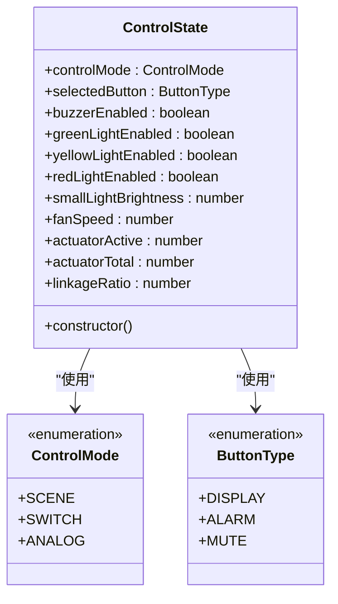

**图表来源**
- [ControlState.ets:4-11](file://entry/src/main/ets/models/ControlState.ets#L4-L11)
- [ControlState.ets:16-23](file://entry/src/main/ets/models/ControlState.ets#L16-L23)
- [ControlState.ets:28-67](file://entry/src/main/ets/models/ControlState.ets#L28-L67)

**章节来源**
- [ControlState.ets:28-67](file://entry/src/main/ets/models/ControlState.ets#L28-L67)
- [ControlConsole.ets:14-172](file://entry/src/main/ets/components/control/ControlConsole.ets#L14-L172)
- [ControlButtons.ets:10-48](file://entry/src/main/ets/components/control/ControlButtons.ets#L10-L48)
- [StatusIndicator.ets:8-44](file://entry/src/main/ets/components/control/StatusIndicator.ets#L8-L44)

### 实时数据获取与管理（setting）分析
- 数据获取流程
  - HTTP 请求：使用 @ohos.net.http 模块发起 GET 请求
  - 异步处理：fetchSensorData 方法返回 Promise，支持 await 操作
  - 类型转换：使用强类型断言确保 JSON 解析后的数据符合 ApiResponse 接口
- 状态管理
  - 观察者模式：@ObservedV2 装饰器确保数据变化时自动更新 UI
  - 缓存机制：@Trace 装饰器提供数据追踪功能
- 错误处理
  - 网络异常：捕获 BusinessError 并记录错误信息
  - 状态码检查：验证 HTTP 响应状态码
  - 数据解析：JSON.parse 方法的安全使用

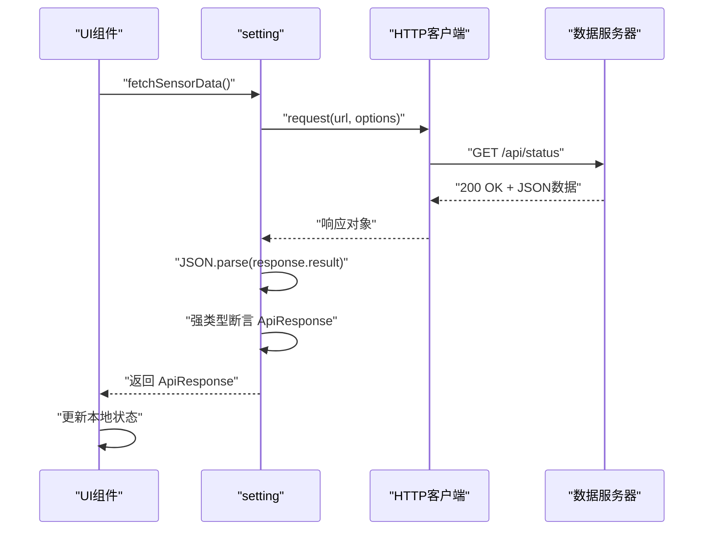

**图表来源**
- [get_data.ets:71-100](file://entry/src/main/ets/pages/get_data.ets#L71-L100)

**章节来源**
- [get_data.ets:67-104](file://entry/src/main/ets/pages/get_data.ets#L67-L104)

### 执行器占用组件（ActuatorOccupancy）分析
- 数据绑定
  - 从实时数据模型获取执行器状态：smallLightBrightnessPercent、fanSpeedPercent
  - 动态计算执行器联动占比：linkageRatio、actuatorActive
- 组件结构
  - 三列布局：左侧参数指标、中央环形图、右侧统计卡片
  - 图例系统：区分已激活和未激活状态
- 数据更新机制
  - 生命周期：aboutToAppear 钩子中自动更新执行器参数
  - 手动刷新：refreshActuatorData 方法支持手动数据刷新
  - 状态统计：countActiveActuators 方法统计激活的执行器数量

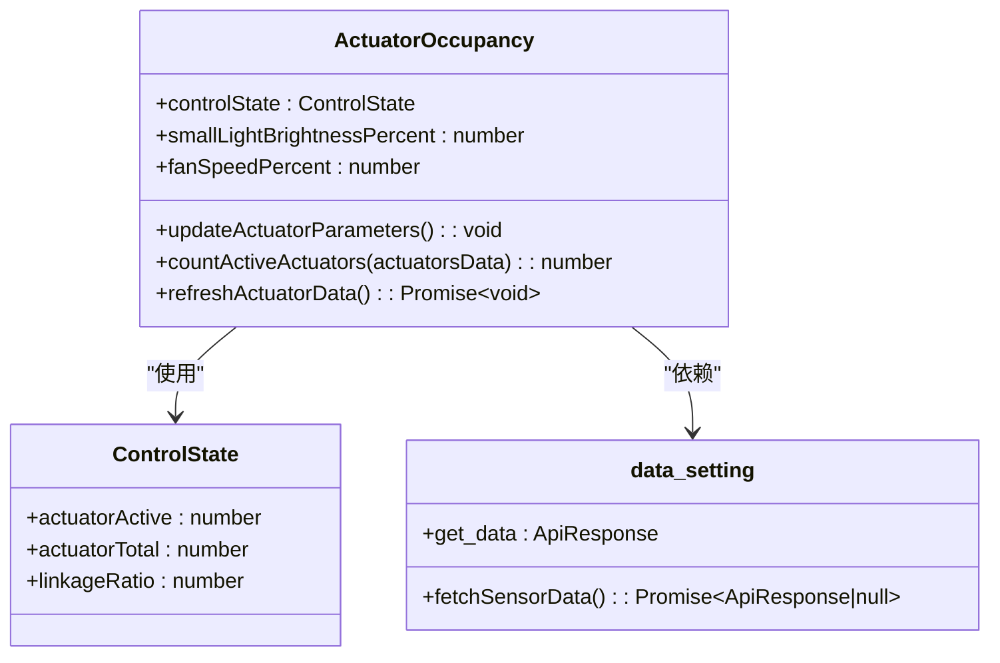

**图表来源**
- [ActuatorOccupancy.ets:14-191](file://entry/src/main/ets/components/actuator/ActuatorOccupancy.ets#L14-L191)
- [get_data.ets:67-104](file://entry/src/main/ets/pages/get_data.ets#L67-L104)

**章节来源**
- [ActuatorOccupancy.ets:14-191](file://entry/src/main/ets/components/actuator/ActuatorOccupancy.ets#L14-L191)
- [get_data.ets:67-104](file://entry/src/main/ets/pages/get_data.ets#L67-L104)

### 工业传感器卡片（IndustrialSensorCard）分析
- 数据结构
  - SensorItem 接口：name、value、unit 字段定义单个传感器数据项
  - 传感器列表：sensorItems 数组支持动态渲染多个传感器数据
- UI 组件
  - 标题区域：工业现场十合一传感器标题，带装饰图标
  - 数据展示：ForEeach 循环渲染每个传感器数据项
  - 样式设计：深色背景配色方案，突出数值显示
- 数据处理
  - 空状态处理：当 sensorItems 为空时显示提示信息
  - 文本截断：使用 ellipsis 确保长标签的可读性
  - 响应式布局：支持不同屏幕尺寸的适配

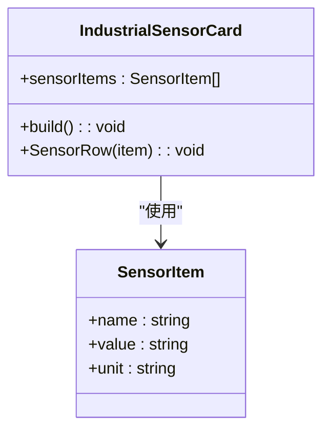

**图表来源**
- [IndustrialSensorCard.ets:20-109](file://entry/src/main/ets/components/sensor/IndustrialSensorCard.ets#L20-L109)

**章节来源**
- [IndustrialSensorCard.ets:20-109](file://entry/src/main/ets/components/sensor/IndustrialSensorCard.ets#L20-L109)

### 聊天消息模型（ChatMessage）分析
- 接口定义
  - 明确字段与类型，便于编译期约束
- 与 UI 的交互
  - 消息气泡组件直接消费该接口，根据 type 决定渲染样式
- 序列化与持久化
  - 建议在写入存储或网络传输前统一格式，避免解析差异

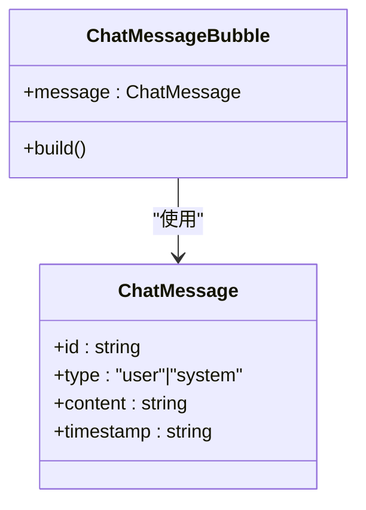

**图表来源**
- [ChatMessage.ets:4-9](file://entry/src/main/ets/models/ChatMessage.ets#L4-L9)
- [ChatMessageBubble.ets:6-38](file://entry/src/main/ets/components/chat/ChatMessageBubble.ets#L6-L38)

**章节来源**
- [ChatMessage.ets:4-9](file://entry/src/main/ets/models/ChatMessage.ets#L4-L9)
- [ChatMessageBubble.ets:1-38](file://entry/src/main/ets/components/chat/ChatMessageBubble.ets#L1-L38)
- [ChatPage.ets:1-76](file://entry/src/main/ets/pages/ChatPage.ets#L1-L76)

### 常量配置管理（Constants、AppColors、AppDimensions、DateUtils）
- 常量配置（Constants）
  - 定义音频采样率、通道数、缓冲区大小等硬件相关常量
  - 定义讯飞 ASR 的 AppId、ApiKey、ApiSecret、主机与 WebSocket URL
- 应用颜色与尺寸（AppColors、AppDimensions）
  - 统一管理主题色彩与布局尺寸，便于主题切换与一致性维护
- 日期工具（DateUtils）
  - 提供日期时间格式化与当前时间获取，便于消息与日志的时间戳生成

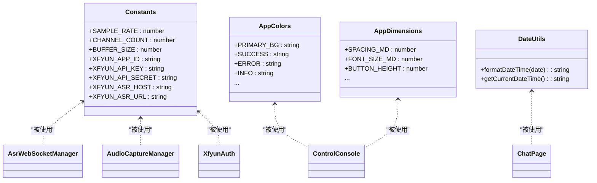

**图表来源**
- [Constants.ets:4-14](file://entry/src/main/ets/common/Constants.ets#L4-L14)
- [AppColors.ets:5-47](file://entry/src/main/ets/constants/AppColors.ets#L5-L47)
- [AppDimensions.ets:5-40](file://entry/src/main/ets/constants/AppDimensions.ets#L5-L40)
- [DateUtils.ets:4-28](file://entry/src/main/ets/utils/DateUtils.ets#L4-L28)
- [AsrWebSocketManager.ets:82-271](file://entry/src/main/ets/managers/AsrWebSocketManager.ets#L82-L271)
- [AudioCaptureManager.ets:6-80](file://entry/src/main/ets/managers/AudioCaptureManager.ets#L6-L80)
- [XfyunAuth.ets:6-34](file://entry/src/main/ets/managers/XfyunAuth.ets#L6-L34)
- [ControlConsole.ets:14-172](file://entry/src/main/ets/components/control/ControlConsole.ets#L14-L172)
- [ChatPage.ets:1-76](file://entry/src/main/ets/pages/ChatPage.ets#L1-L76)

**章节来源**
- [Constants.ets:4-14](file://entry/src/main/ets/common/Constants.ets#L4-L14)
- [AppColors.ets:5-47](file://entry/src/main/ets/constants/AppColors.ets#L5-L47)
- [AppDimensions.ets:5-40](file://entry/src/main/ets/constants/AppDimensions.ets#L5-L40)
- [DateUtils.ets:4-28](file://entry/src/main/ets/utils/DateUtils.ets#L4-L28)

### 管理器与数据模型的协作流程
- 音频采集与 ASR 流程
  - 音频采集管理器负责从麦克风读取原始音频数据
  - 讯飞鉴权管理器生成认证 URL
  - ASR WebSocket 管理器连接服务端、发送起始帧、音频帧与结束帧，并解析识别结果
- 数据流与状态更新
  - 识别结果通过回调传递给上层组件，用于更新聊天消息或控制状态

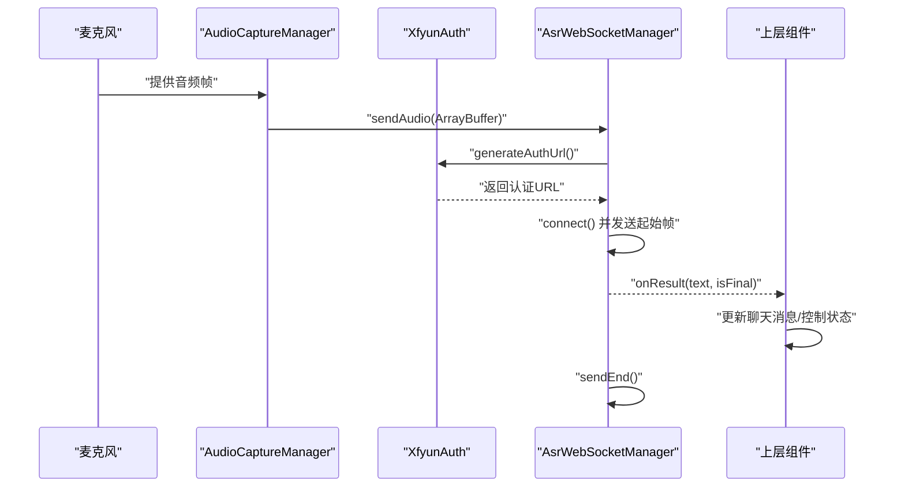

**图表来源**
- [AudioCaptureManager.ets:36-53](file://entry/src/main/ets/managers/AudioCaptureManager.ets#L36-L53)
- [XfyunAuth.ets:7-24](file://entry/src/main/ets/managers/XfyunAuth.ets#L7-L24)
- [AsrWebSocketManager.ets:92-144](file://entry/src/main/ets/managers/AsrWebSocketManager.ets#L92-L144)
- [AsrWebSocketManager.ets:167-189](file://entry/src/main/ets/managers/AsrWebSocketManager.ets#L167-L189)
- [AsrWebSocketManager.ets:197-254](file://entry/src/main/ets/managers/AsrWebSocketManager.ets#L197-L254)

**章节来源**
- [AudioCaptureManager.ets:1-80](file://entry/src/main/ets/managers/AudioCaptureManager.ets#L1-L80)
- [XfyunAuth.ets:1-34](file://entry/src/main/ets/managers/XfyunAuth.ets#L1-L34)
- [AsrWebSocketManager.ets:1-271](file://entry/src/main/ets/managers/AsrWebSocketManager.ets#L1-L271)

### 控制台与状态指示器的交互流程
- 用户点击按钮或滑块触发状态变更
- 状态变更通过回调通知父组件，父组件更新模型并驱动 UI 刷新

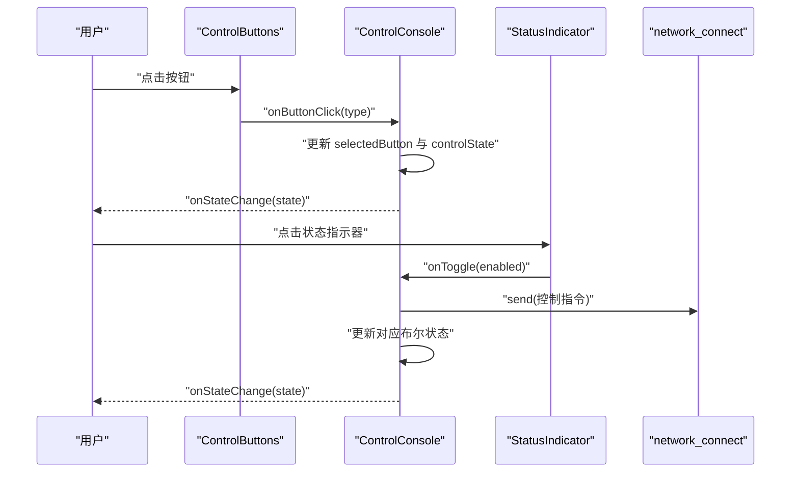

**图表来源**
- [ControlButtons.ets:27-47](file://entry/src/main/ets/components/control/ControlButtons.ets#L27-L47)
- [ControlConsole.ets:156-171](file://entry/src/main/ets/components/control/ControlConsole.ets#L156-L171)
- [StatusIndicator.ets:38-42](file://entry/src/main/ets/components/control/StatusIndicator.ets#L38-L42)
- [ControlConsole.ets:48-118](file://entry/src/main/ets/components/control/ControlConsole.ets#L48-L118)

**章节来源**
- [ControlButtons.ets:1-48](file://entry/src/main/ets/components/control/ControlButtons.ets#L1-L48)
- [ControlConsole.ets:1-172](file://entry/src/main/ets/components/control/ControlConsole.ets#L1-L172)
- [StatusIndicator.ets:1-44](file://entry/src/main/ets/components/control/StatusIndicator.ets#L1-L44)

### 聊天页面的消息渲染流程
- 页面接收消息数组，根据标记区分用户与系统消息
- 使用消息气泡组件渲染，统一颜色与圆角样式

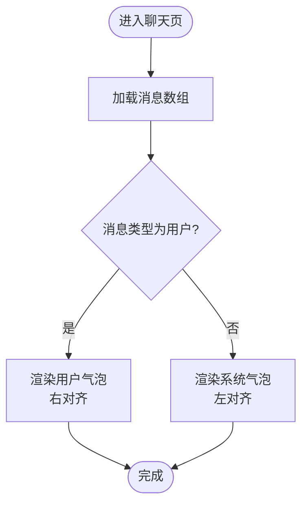

**图表来源**
- [ChatPage.ets:22-54](file://entry/src/main/ets/pages/ChatPage.ets#L22-L54)
- [ChatMessageBubble.ets:10-37](file://entry/src/main/ets/components/chat/ChatMessageBubble.ets#L10-L37)

**章节来源**
- [ChatPage.ets:1-76](file://entry/src/main/ets/pages/ChatPage.ets#L1-L76)
- [ChatMessageBubble.ets:1-38](file://entry/src/main/ets/components/chat/ChatMessageBubble.ets#L1-L38)

## 依赖关系分析
- 模型到组件
  - ControlState 被 ControlConsole、ControlButtons、StatusIndicator 直接使用
  - ChatMessage 被 ChatMessageBubble 使用
  - ApiResponse 被 ActuatorOccupancy、IndustrialSensorCard、TrendChartCard 使用
- 组件到常量与工具
  - ControlConsole 使用 AppColors 与 AppDimensions
  - ChatPage 使用 DateUtils
  - ActuatorOccupancy 使用 AppColors 与 AppDimensions
  - IndustrialSensorCard 使用 AppColors 与 AppDimensions
- 组件到管理器
  - ControlConsole 与网络层交互，间接影响控制状态
  - ASR 流程涉及 AudioCaptureManager、XfyunAuth、AsrWebSocketManager
- 数据模型到页面
  - setting 实例被 ActuatorOccupancy、IndustrialSensorCard、DataHomePage 使用
  - network_connect 与 ControlConsole 交互

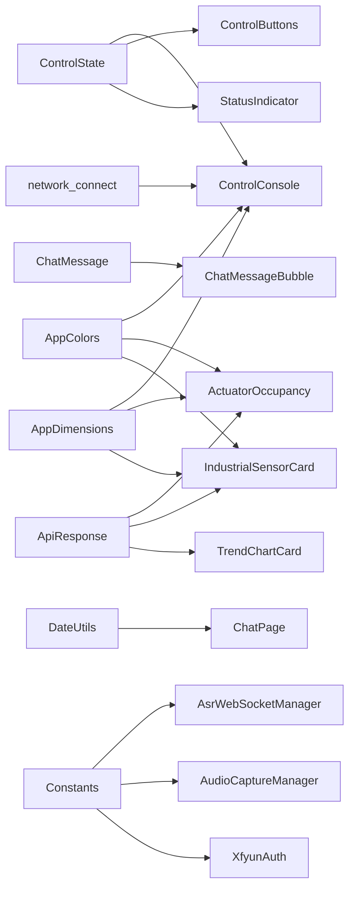

**图表来源**
- [ControlState.ets:28-67](file://entry/src/main/ets/models/ControlState.ets#L28-L67)
- [ControlConsole.ets:14-172](file://entry/src/main/ets/components/control/ControlConsole.ets#L14-L172)
- [ControlButtons.ets:10-48](file://entry/src/main/ets/components/control/ControlButtons.ets#L10-L48)
- [StatusIndicator.ets:8-44](file://entry/src/main/ets/components/control/StatusIndicator.ets#L8-L44)
- [ChatMessage.ets:4-9](file://entry/src/main/ets/models/ChatMessage.ets#L4-L9)
- [ChatMessageBubble.ets:6-38](file://entry/src/main/ets/components/chat/ChatMessageBubble.ets#L6-L38)
- [get_data.ets:5-65](file://entry/src/main/ets/pages/get_data.ets#L5-L65)
- [ActuatorOccupancy.ets:14-191](file://entry/src/main/ets/components/actuator/ActuatorOccupancy.ets#L14-L191)
- [IndustrialSensorCard.ets:20-109](file://entry/src/main/ets/components/sensor/IndustrialSensorCard.ets#L20-L109)
- [TrendChartCard.ets:8-106](file://entry/src/main/ets/pages/TrendChartCard.ets#L8-L106)
- [AppColors.ets:5-47](file://entry/src/main/ets/constants/AppColors.ets#L5-L47)
- [AppDimensions.ets:5-40](file://entry/src/main/ets/constants/AppDimensions.ets#L5-L40)
- [DateUtils.ets:4-28](file://entry/src/main/ets/utils/DateUtils.ets#L4-L28)
- [Constants.ets:4-14](file://entry/src/main/ets/common/Constants.ets#L4-L14)
- [AsrWebSocketManager.ets:82-271](file://entry/src/main/ets/managers/AsrWebSocketManager.ets#L82-L271)
- [AudioCaptureManager.ets:6-80](file://entry/src/main/ets/managers/AudioCaptureManager.ets#L6-L80)
- [XfyunAuth.ets:6-34](file://entry/src/main/ets/managers/XfyunAuth.ets#L6-L34)
- [ChatPage.ets:1-76](file://entry/src/main/ets/pages/ChatPage.ets#L1-L76)
- [network_connect.ets:43-45](file://entry/src/main/ets/pages/network_connect.ets#L43-L45)

**章节来源**
- [ControlState.ets:28-67](file://entry/src/main/ets/models/ControlState.ets#L28-L67)
- [ChatMessage.ets:4-9](file://entry/src/main/ets/models/ChatMessage.ets#L4-L9)
- [get_data.ets:5-65](file://entry/src/main/ets/pages/get_data.ets#L5-L65)
- [ActuatorOccupancy.ets:14-191](file://entry/src/main/ets/components/actuator/ActuatorOccupancy.ets#L14-L191)
- [IndustrialSensorCard.ets:20-109](file://entry/src/main/ets/components/sensor/IndustrialSensorCard.ets#L20-L109)
- [TrendChartCard.ets:8-106](file://entry/src/main/ets/pages/TrendChartCard.ets#L8-L106)
- [AppColors.ets:5-47](file://entry/src/main/ets/constants/AppColors.ets#L5-L47)
- [AppDimensions.ets:5-40](file://entry/src/main/ets/constants/AppDimensions.ets#L5-L40)
- [DateUtils.ets:4-28](file://entry/src/main/ets/utils/DateUtils.ets#L4-L28)
- [AsrWebSocketManager.ets:82-271](file://entry/src/main/ets/managers/AsrWebSocketManager.ets#L82-L271)
- [AudioCaptureManager.ets:6-80](file://entry/src/main/ets/managers/AudioCaptureManager.ets#L6-L80)
- [XfyunAuth.ets:6-34](file://entry/src/main/ets/managers/XfyunAuth.ets#L6-L34)
- [network_connect.ets:43-45](file://entry/src/main/ets/pages/network_connect.ets#L43-L45)

## 性能考量
- 控制状态模型
  - 使用简单数值与布尔字段，内存占用低，适合频繁更新
  - 建议在 UI 层仅订阅必要字段，减少不必要的重绘
- 实时数据模型
  - API 响应结构经过类型安全设计，减少运行时类型检查开销
  - @ObservedV2 装饰器提供高效的响应式更新机制
  - @Trace 装饰器支持数据追踪，便于性能分析
- 聊天消息模型
  - 字符串内容可能较大，建议在存储与传输前进行压缩或分页
  - 时间戳统一格式可降低解析成本
- 常量与工具
  - 常量集中管理，避免重复计算与魔法数
  - 工具类方法尽量无副作用，便于测试与复用
- 管理器
  - ASR 流程中音频帧与 WebSocket 消息的处理应避免阻塞主线程
  - 结果缓存与乱序处理需注意内存上限，及时清理无效缓存
- 组件渲染
  - ForEach 循环渲染大量传感器数据时应注意虚拟化优化
  - 环形图和趋势图表的 Canvas 绘制需要考虑性能优化

## 故障排查指南
- 控制状态异常
  - 检查按钮点击与滑块回调是否正确更新状态
  - 确认 onStateChange 回调是否被正确触发
- 实时数据获取异常
  - 校验网络连接状态和 API 端点可达性
  - 检查 JSON 解析和类型断言是否正确
  - 验证 @ObservedV2 装饰器是否正常工作
- 执行器状态更新异常
  - 确认 ActuatorOccupancy 组件的 aboutToAppear 生命周期钩子是否执行
  - 检查 data_setting 实例的数据获取是否成功
  - 验证联动占比计算逻辑是否正确
- 聊天消息显示异常
  - 核对消息类型与渲染逻辑是否匹配
  - 检查时间戳格式是否一致
- ASR 连接问题
  - 校验讯飞鉴权 URL 生成是否正确
  - 检查 WebSocket 连接回调与错误处理
- 音频采集问题
  - 确认采样率、通道数与编码格式与服务端一致
  - 检查权限与设备状态

**章节来源**
- [ControlConsole.ets:156-171](file://entry/src/main/ets/components/control/ControlConsole.ets#L156-L171)
- [get_data.ets:71-100](file://entry/src/main/ets/pages/get_data.ets#L71-L100)
- [ActuatorOccupancy.ets:121-154](file://entry/src/main/ets/components/actuator/ActuatorOccupancy.ets#L121-L154)
- [AsrWebSocketManager.ets:92-144](file://entry/src/main/ets/managers/AsrWebSocketManager.ets#L92-L144)
- [AsrWebSocketManager.ets:112-133](file://entry/src/main/ets/managers/AsrWebSocketManager.ets#L112-L133)
- [AudioCaptureManager.ets:11-34](file://entry/src/main/ets/managers/AudioCaptureManager.ets#L11-L34)

## 结论
本项目的数据模型设计遵循"清晰、可维护、可扩展"的原则：控制状态模型通过枚举与默认值确保易用性；实时数据模型通过 TypeScript 接口提供类型安全和数据完整性；聊天消息模型简洁明了，便于 UI 渲染与序列化；常量与工具类集中管理，提升一致性与可测试性；管理器负责与外部系统的对接，形成稳定的边界。新增的实时数据模型设计显著增强了系统的数据管理能力和类型安全性，支持设备状态监控和实时数据展示。建议在后续迭代中进一步完善数据验证、版本迁移与持久化策略，以增强系统的健壮性与演进能力。

## 附录

### 数据模型之间的关系映射
- 实体与关联
  - 控制状态模型与控制台组件强关联，通过状态驱动 UI
  - 聊天消息模型与消息气泡组件强关联，通过接口驱动渲染
  - 实时数据模型与多个组件强关联，提供数据驱动的 UI 更新
  - 执行器占用组件与实时数据模型深度绑定，实现设备状态可视化
- 外键约束与级联
  - 当前模型未体现数据库层面的外键与级联，若引入持久化，建议在迁移脚本中声明约束
- 级联更新建议
  - 若消息与用户存在关联，可在删除用户时级联删除其消息
  - 若执行器状态与控制台存在关联，可考虑级联更新相关 UI 组件

### 数据验证与业务规则
- 输入校验
  - 数值范围校验：亮度与转速应在 0-100 区间
  - 枚举值校验：控制模式与按钮类型必须属于预定义集合
  - 实时数据校验：API 响应必须包含完整的结构字段
  - 传感器数据校验：values 数组长度必须为 10，pretty 数组必须包含完整的数据项
- 格式检查
  - 时间戳格式统一为字符串，建议采用 ISO 或自定义格式
  - 执行器百分比值必须在 0-100 范围内
  - 线圈状态必须为布尔值
- 逻辑约束
  - 执行器联动占比 = 激活数 / 总数 × 100，需满足非负且不超过 100
  - 按钮类型与控制模式之间保持互斥与组合一致性
  - 传感器在线状态与数据可用性必须一致

### 数据模型的扩展与版本管理策略
- 版本号管理
  - 为模型增加版本字段，便于迁移与兼容
  - meta 接口中已包含 sensor_revision 和 control_revision 字段
- 迁移策略
  - 新增字段采用默认值回填，删除字段保留但标记废弃
  - 实时数据模型支持向后兼容的 JSON 结构
- 序列化策略
  - 引入统一的序列化/反序列化工具，支持向后兼容
  - 使用强类型断言确保数据解析的安全性
- 测试策略
  - 为新增字段与迁移逻辑编写单元测试与集成测试
  - 实时数据模型需要网络请求模拟和错误处理测试

### 创建新数据模型与修改现有模型的指导
- 创建新模型
  - 明确业务需求与字段语义，优先使用枚举与受限类型
  - 提供默认值与构造函数，确保实例化即用
  - 在组件中以接口形式消费，避免紧耦合
  - 考虑实时数据更新的需求，提供相应的状态管理机制
- 修改现有模型
  - 评估对 UI 与管理器的影响，必要时提供过渡方案
  - 更新默认值与校验规则，确保向后兼容
  - 编写迁移脚本与测试用例，保障稳定性
  - 实时数据模型修改时需考虑 API 兼容性和客户端适配