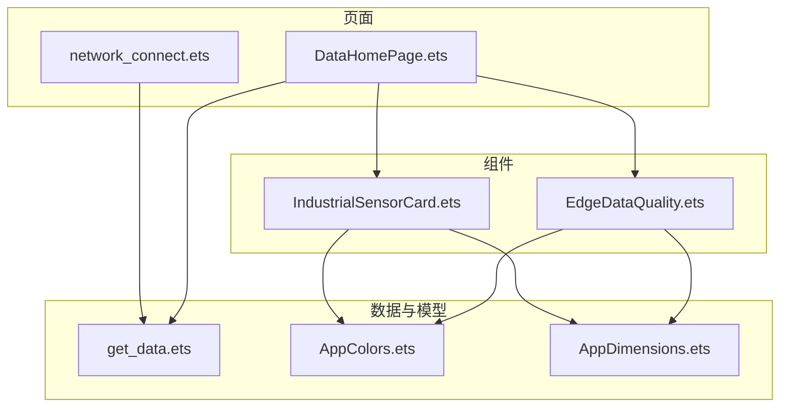
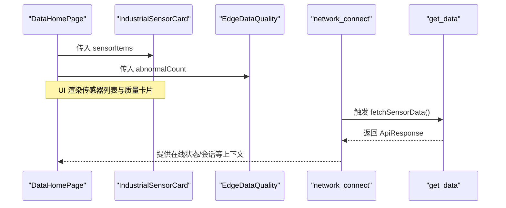
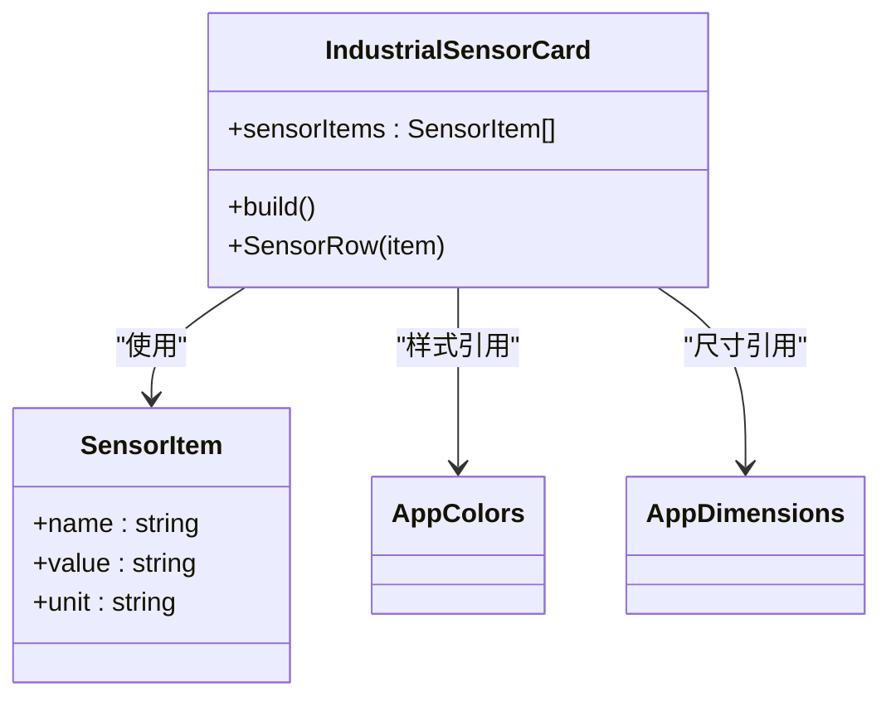
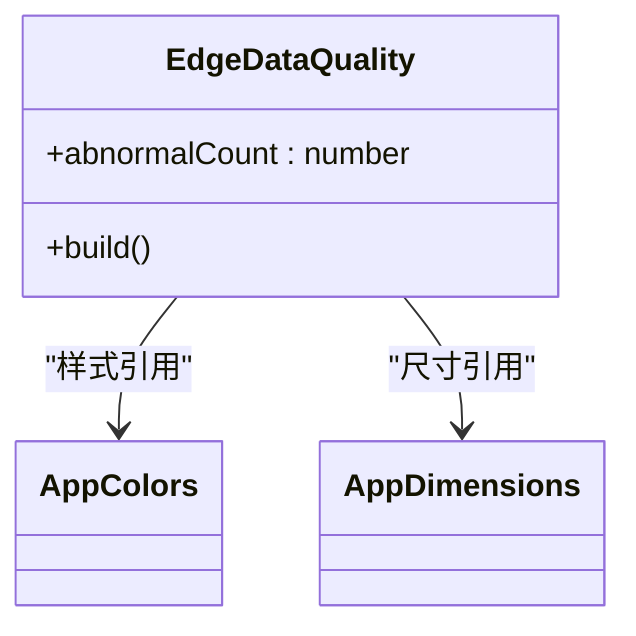
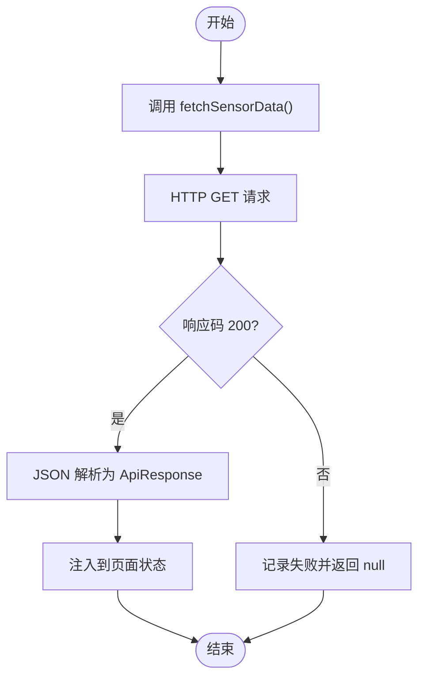
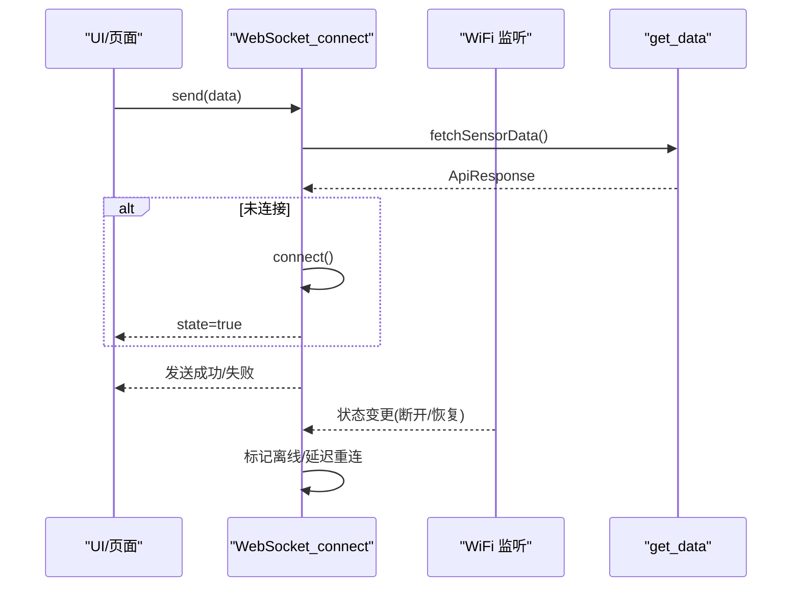
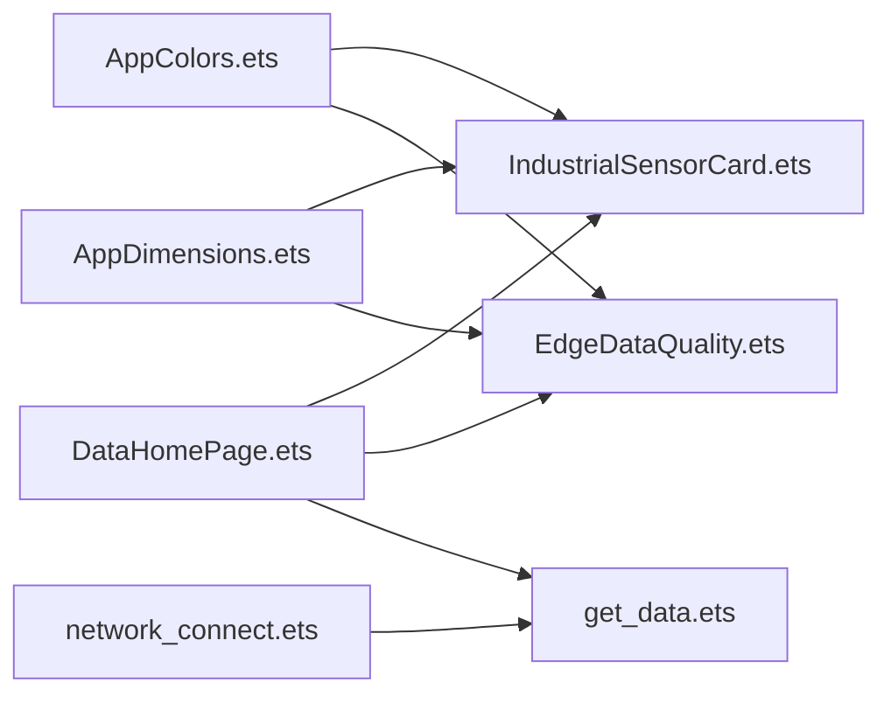

# 传感器数据处理

<cite>
**本文引用的文件**
- [IndustrialSensorCard.ets](file://entry/src/main/ets/components/sensor/IndustrialSensorCard.ets)
- [EdgeDataQuality.ets](file://entry/src/main/ets/components/sensor/EdgeDataQuality.ets)
- [get_data.ets](file://entry/src/main/ets/pages/get_data.ets)
- [DataHomePage.ets](file://entry/src/main/ets/pages/DataHomePage.ets)
- [network_connect.ets](file://entry/src/main/ets/pages/network_connect.ets)
- [AppColors.ets](file://entry/src/main/ets/constants/AppColors.ets)
- [AppDimensions.ets](file://entry/src/main/ets/constants/AppDimensions.ets)
</cite>

## 目录
1. [引言](#引言)
2. [项目结构](#项目结构)
3. [核心组件](#核心组件)
4. [架构总览](#架构总览)
5. [详细组件分析](#详细组件分析)
6. [依赖关系分析](#依赖关系分析)
7. [性能考虑](#性能考虑)
8. [故障排查指南](#故障排查指南)
9. [结论](#结论)
10. [附录](#附录)

## 引言
本技术文档围绕工业传感器数据的采集、格式标准化、预处理与可视化展示进行系统化梳理。基于仓库现有实现，重点覆盖以下方面：
- 数据采集与来源：HTTP 接口拉取与 WebSocket 实时通道
- 数据格式标准化：统一的传感器数据结构、单位与缩放因子
- 预处理与质量评估：异常指标统计与质量卡片展示
- 可视化与交互：传感器卡片与数据质量卡片的 UI 组件
- 扩展性建议：如何新增传感器类型与自定义处理逻辑

## 项目结构
本项目采用 ArkTS/ArkUI 技术栈，页面与组件分层清晰。与传感器数据处理直接相关的模块包括：
- 页面层：数据首页、网络连接页
- 组件层：传感器卡片、边缘数据质量卡片
- 常量层：颜色与尺寸常量
- 数据模型与接口：HTTP 响应结构、传感器数据结构

图表来源
- [DataHomePage.ets:1-61](file://entry/src/main/ets/pages/DataHomePage.ets#L1-L61)
- [IndustrialSensorCard.ets:1-109](file://entry/src/main/ets/components/sensor/IndustrialSensorCard.ets#L1-L109)
- [EdgeDataQuality.ets:1-64](file://entry/src/main/ets/components/sensor/EdgeDataQuality.ets#L1-L64)
- [get_data.ets:1-105](file://entry/src/main/ets/pages/get_data.ets#L1-L105)
- [network_connect.ets:1-322](file://entry/src/main/ets/pages/network_connect.ets#L1-L322)
- [AppColors.ets:1-47](file://entry/src/main/ets/constants/AppColors.ets#L1-L47)
- [AppDimensions.ets:1-40](file://entry/src/main/ets/constants/AppDimensions.ets#L1-L40)

章节来源
- [DataHomePage.ets:1-61](file://entry/src/main/ets/pages/DataHomePage.ets#L1-L61)
- [IndustrialSensorCard.ets:1-109](file://entry/src/main/ets/components/sensor/IndustrialSensorCard.ets#L1-L109)
- [EdgeDataQuality.ets:1-64](file://entry/src/main/ets/components/sensor/EdgeDataQuality.ets#L1-L64)
- [get_data.ets:1-105](file://entry/src/main/ets/pages/get_data.ets#L1-L105)
- [network_connect.ets:1-322](file://entry/src/main/ets/pages/network_connect.ets#L1-L322)
- [AppColors.ets:1-47](file://entry/src/main/ets/constants/AppColors.ets#L1-L47)
- [AppDimensions.ets:1-40](file://entry/src/main/ets/constants/AppDimensions.ets#L1-L40)

## 核心组件
- 工业传感器卡片：用于展示多路传感器的名称、数值与单位，支持空态提示与列表渲染。
- 边缘数据质量卡片：用于展示异常指标数量统计，承载质量评估结果。
- 数据获取与接口模型：定义 HTTP 响应结构、传感器数组结构与缩放因子字段。
- 网络连接与重连：封装 WebSocket 连接、事件绑定与自动重连逻辑，并在发送前触发数据刷新。

章节来源
- [IndustrialSensorCard.ets:7-109](file://entry/src/main/ets/components/sensor/IndustrialSensorCard.ets#L7-L109)
- [EdgeDataQuality.ets:9-64](file://entry/src/main/ets/components/sensor/EdgeDataQuality.ets#L9-L64)
- [get_data.ets:4-105](file://entry/src/main/ets/pages/get_data.ets#L4-L105)
- [network_connect.ets:38-322](file://entry/src/main/ets/pages/network_connect.ets#L38-L322)

## 架构总览
整体数据流从页面发起，经由网络层与数据层，最终驱动 UI 组件渲染。WebSocket 作为实时通道，HTTP 作为补充数据来源；UI 组件通过 props 接收数据并展示。

图表来源
- [DataHomePage.ets:41-43](file://entry/src/main/ets/pages/DataHomePage.ets#L41-L43)
- [IndustrialSensorCard.ets:20-62](file://entry/src/main/ets/components/sensor/IndustrialSensorCard.ets#L20-L62)
- [EdgeDataQuality.ets:8-62](file://entry/src/main/ets/components/sensor/EdgeDataQuality.ets#L8-L62)
- [network_connect.ets:263-299](file://entry/src/main/ets/pages/network_connect.ets#L263-L299)
- [get_data.ets:67-104](file://entry/src/main/ets/pages/get_data.ets#L67-L104)

## 详细组件分析

### 工业传感器卡片组件
- 结构定义：单条传感器数据项包含名称、数值字符串与单位；卡片接收传感器数组并逐行渲染。
- 渲染逻辑：当数组为空时显示“暂无传感器数据”占位；否则遍历渲染每一条数据行。
- 样式与主题：使用 AppColors 与 AppDimensions 统一配色与间距，确保视觉一致性。

图表来源
- [IndustrialSensorCard.ets:7-109](file://entry/src/main/ets/components/sensor/IndustrialSensorCard.ets#L7-L109)
- [AppColors.ets:5-47](file://entry/src/main/ets/constants/AppColors.ets#L5-L47)
- [AppDimensions.ets:5-40](file://entry/src/main/ets/constants/AppDimensions.ets#L5-L40)

章节来源
- [IndustrialSensorCard.ets:7-109](file://entry/src/main/ets/components/sensor/IndustrialSensorCard.ets#L7-L109)
- [AppColors.ets:5-47](file://entry/src/main/ets/constants/AppColors.ets#L5-L47)
- [AppDimensions.ets:5-40](file://entry/src/main/ets/constants/AppDimensions.ets#L5-L40)

### 边缘数据质量卡片组件
- 功能定位：展示异常指标数量，作为边缘数据质量的可视化入口。
- 数据来源：由页面传入 abnormalCount，当前示例中固定为 7。
- 样式设计：继承统一的颜色与尺寸常量，保证与整体主题一致。

图表来源
- [EdgeDataQuality.ets:9-64](file://entry/src/main/ets/components/sensor/EdgeDataQuality.ets#L9-L64)
- [AppColors.ets:5-47](file://entry/src/main/ets/constants/AppColors.ets#L5-L47)
- [AppDimensions.ets:5-40](file://entry/src/main/ets/constants/AppDimensions.ets#L5-L40)

章节来源
- [EdgeDataQuality.ets:9-64](file://entry/src/main/ets/components/sensor/EdgeDataQuality.ets#L9-L64)
- [AppColors.ets:5-47](file://entry/src/main/ets/constants/AppColors.ets#L5-L47)
- [AppDimensions.ets:5-40](file://entry/src/main/ets/constants/AppDimensions.ets#L5-L40)

### 数据获取与接口模型
- 接口定义：根响应包含 success、meta、sensor、actuators；sensor.pretty 为标准化后的传感器数组。
- 数据项结构：包含 tag（名称）、value（数值）、unit（单位）、scale（缩放因子）。
- 获取流程：通过 HTTP 请求获取最新数据，解析为 ApiResponse 类型并注入到页面状态。

图表来源
- [get_data.ets:71-100](file://entry/src/main/ets/pages/get_data.ets#L71-L100)

章节来源
- [get_data.ets:4-105](file://entry/src/main/ets/pages/get_data.ets#L4-L105)

### 网络连接与重连机制
- WebSocket 连接：构造连接 URL，携带设备标识与客户端标识，绑定 open/message/close/error 事件。
- 自动重连：监听 WiFi 状态变化，断开后标记离线，恢复后延迟重连；错误时最多尝试有限次重连。
- 发送流程：发送前触发数据刷新，若未连接则先建立连接；使用 requestId 管理未完成请求。

图表来源
- [network_connect.ets:149-180](file://entry/src/main/ets/pages/network_connect.ets#L149-L180)
- [network_connect.ets:182-261](file://entry/src/main/ets/pages/network_connect.ets#L182-L261)
- [network_connect.ets:263-299](file://entry/src/main/ets/pages/network_connect.ets#L263-L299)
- [get_data.ets:67-104](file://entry/src/main/ets/pages/get_data.ets#L67-L104)

章节来源
- [network_connect.ets:38-322](file://entry/src/main/ets/pages/network_connect.ets#L38-L322)
- [get_data.ets:67-104](file://entry/src/main/ets/pages/get_data.ets#L67-L104)

## 依赖关系分析
- 组件依赖：IndustrialSensorCard 与 EdgeDataQuality 依赖 AppColors 与 AppDimensions 进行样式与尺寸控制。
- 页面依赖：DataHomePage 同时依赖两个传感器组件，并向其传递数据。
- 数据依赖：页面与网络层均依赖 get_data 的接口模型与数据获取方法。

图表来源
- [AppColors.ets:5-47](file://entry/src/main/ets/constants/AppColors.ets#L5-L47)
- [AppDimensions.ets:5-40](file://entry/src/main/ets/constants/AppDimensions.ets#L5-L40)
- [IndustrialSensorCard.ets:1-3](file://entry/src/main/ets/components/sensor/IndustrialSensorCard.ets#L1-L3)
- [EdgeDataQuality.ets:1-3](file://entry/src/main/ets/components/sensor/EdgeDataQuality.ets#L1-L3)
- [DataHomePage.ets:2-2](file://entry/src/main/ets/pages/DataHomePage.ets#L2-L2)
- [network_connect.ets:1-5](file://entry/src/main/ets/pages/network_connect.ets#L1-L5)
- [get_data.ets:1-2](file://entry/src/main/ets/pages/get_data.ets#L1-L2)

章节来源
- [AppColors.ets:5-47](file://entry/src/main/ets/constants/AppColors.ets#L5-L47)
- [AppDimensions.ets:5-40](file://entry/src/main/ets/constants/AppDimensions.ets#L5-L40)
- [IndustrialSensorCard.ets:1-3](file://entry/src/main/ets/components/sensor/IndustrialSensorCard.ets#L1-L3)
- [EdgeDataQuality.ets:1-3](file://entry/src/main/ets/components/sensor/EdgeDataQuality.ets#L1-L3)
- [DataHomePage.ets:2-2](file://entry/src/main/ets/pages/DataHomePage.ets#L2-L2)
- [network_connect.ets:1-5](file://entry/src/main/ets/pages/network_connect.ets#L1-L5)
- [get_data.ets:1-2](file://entry/src/main/ets/pages/get_data.ets#L1-L2)

## 性能考虑
- 渲染优化：使用 ForEach 渲染传感器列表，建议在数据更新时保持稳定的 key，避免不必要的重渲染。
- 网络请求：HTTP 请求设置连接与读取超时，WebSocket 事件绑定需及时清理，避免内存泄漏。
- 主题与尺寸：通过常量集中管理颜色与尺寸，减少重复计算与样式切换成本。
- 数据刷新：在发送消息前触发数据刷新，确保 UI 与数据源同步，避免陈旧数据导致的重复请求。

## 故障排查指南
- HTTP 请求失败：检查响应码与异常日志，确认接口地址与网络可达性。
- WebSocket 断开：关注 close 与 error 事件日志，确认 WiFi 状态变化与自动重连策略。
- 数据为空：确认 sensorItems 是否为空，以及 get_data 中的 ApiResponse 是否正确解析。
- 样式不一致：核对 AppColors 与 AppDimensions 的值，确保主题配置正确。

章节来源
- [get_data.ets:75-100](file://entry/src/main/ets/pages/get_data.ets#L75-L100)
- [network_connect.ets:236-261](file://entry/src/main/ets/pages/network_connect.ets#L236-L261)
- [DataHomePage.ets:41-43](file://entry/src/main/ets/pages/DataHomePage.ets#L41-L43)

## 结论
本项目在传感器数据处理方面，实现了从数据采集、格式标准化到 UI 展示的闭环。通过统一的数据模型与组件化设计，具备良好的可维护性与扩展性。后续可在现有基础上引入数据质量评估算法、缓存策略与统计分析能力，以满足更复杂的工业场景需求。

## 附录

### 数据项结构定义与单位转换规则
- 数据项结构
  - 字段：名称、数值字符串、单位、缩放因子
  - 用途：统一展示与后续处理
- 单位转换规则
  - 缩放因子 scale 用于将原始值映射到标准单位，具体换算逻辑应在业务层实现
  - 建议：在数据进入 UI 前完成单位换算，UI 层仅负责展示

章节来源
- [get_data.ets:38-43](file://entry/src/main/ets/pages/get_data.ets#L38-L43)

### 边缘数据质量评估与统计
- 异常指标统计：当前以卡片形式展示异常指标数量，具体阈值与统计逻辑需在业务层实现
- 建议：在数据进入 UI 前完成异常检测与评分计算，UI 仅消费结果

章节来源
- [EdgeDataQuality.ets:9-64](file://entry/src/main/ets/components/sensor/EdgeDataQuality.ets#L9-L64)
- [DataHomePage.ets:41-43](file://entry/src/main/ets/pages/DataHomePage.ets#L41-L43)

### 扩展新传感器类型与自定义处理逻辑
- 新增传感器类型
  - 在数据模型中增加对应字段或枚举，确保与接口定义一致
  - 在 UI 组件中扩展渲染逻辑，保持与现有卡片风格一致
- 自定义处理逻辑
  - 在数据获取后增加预处理步骤，如异常检测、单位换算、统计分析
  - 将处理结果注入到页面状态，驱动 UI 更新

章节来源
- [get_data.ets:4-105](file://entry/src/main/ets/pages/get_data.ets#L4-L105)
- [IndustrialSensorCard.ets:7-109](file://entry/src/main/ets/components/sensor/IndustrialSensorCard.ets#L7-L109)