# 历史数据管理

<cite>
**本文引用的文件**
- [entry/src/main/ets/pages/DataHomePage.ets](file://entry/src/main/ets/pages/DataHomePage.ets)
- [entry/src/main/ets/pages/TrendChartCard.ets](file://entry/src/main/ets/pages/TrendChartCard.ets)
- [entry/src/main/ets/components/sensor/EdgeDataQuality.ets](file://entry/src/main/ets/components/sensor/EdgeDataQuality.ets)
- [entry/src/main/ets/components/log/EventLog.ets](file://entry/src/main/ets/components/log/EventLog.ets)
- [entry/src/main/ets/components/log/AlarmQueue.ets](file://entry/src/main/ets/components/log/AlarmQueue.ets)
- [entry/src/main/ets/pages/network_connect.ets](file://entry/src/main/ets/pages/network_connect.ets)
- [entry/src/main/ets/pages/get_data.ets](file://entry/src/main/ets/pages/get_data.ets)
- [entry/src/main/ets/utils/DateUtils.ets](file://entry/src/main/ets/utils/DateUtils.ets)
- [entry/src/main/ets/common/Constants.ets](file://entry/src/main/ets/common/Constants.ets)
- [entry/src/main/ets/managers/AsrWebSocketManager.ets](file://entry/src/main/ets/managers/AsrWebSocketManager.ets)
- [entry/src/main/ets/managers/AudioCaptureManager.ets](file://entry/src/main/ets/managers/AudioCaptureManager.ets)
</cite>

## 目录
1. [简介](#简介)
2. [项目结构](#项目结构)
3. [核心组件](#核心组件)
4. [架构总览](#架构总览)
5. [详细组件分析](#详细组件分析)
6. [依赖关系分析](#依赖关系分析)
7. [性能考量](#性能考量)
8. [故障排查指南](#故障排查指南)
9. [结论](#结论)
10. [附录](#附录)

## 简介
本技术文档围绕“历史数据管理”主题，结合仓库现有实现，系统性阐述历史数据的采集、存储、查询、可视化与维护策略。当前代码库以实时数据展示与网络通信为主，历史数据管理尚未在代码中直接体现具体持久化与查询实现。本文基于现有模块进行合理推演与扩展建议，帮助开发者在不破坏现有架构的前提下，逐步引入历史数据管理能力，并提供可落地的扩展指导。

## 项目结构
该工程采用 ArkTS/ETS 构建的前端应用，主要模块包括页面层、组件层、工具层与管理器层。与历史数据管理相关的关键路径如下：
- 页面层：数据首页、趋势图卡、网络连接与数据获取等页面组件
- 组件层：边缘数据质量、事件日志、告警队列等展示组件
- 工具层：日期时间工具
- 管理器层：语音识别 WebSocket 管理器、音频采集管理器

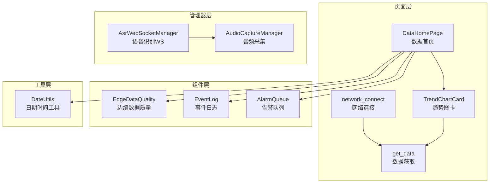

图表来源
- [entry/src/main/ets/pages/DataHomePage.ets:1-61](file://entry/src/main/ets/pages/DataHomePage.ets#L1-L61)
- [entry/src/main/ets/pages/TrendChartCard.ets:1-106](file://entry/src/main/ets/pages/TrendChartCard.ets#L1-L106)
- [entry/src/main/ets/components/sensor/EdgeDataQuality.ets:1-64](file://entry/src/main/ets/components/sensor/EdgeDataQuality.ets#L1-L64)
- [entry/src/main/ets/components/log/EventLog.ets:1-78](file://entry/src/main/ets/components/log/EventLog.ets#L1-L78)
- [entry/src/main/ets/components/log/AlarmQueue.ets:1-105](file://entry/src/main/ets/components/log/AlarmQueue.ets#L1-L105)
- [entry/src/main/ets/pages/network_connect.ets:1-296](file://entry/src/main/ets/pages/network_connect.ets#L1-L296)
- [entry/src/main/ets/pages/get_data.ets:1-104](file://entry/src/main/ets/pages/get_data.ets#L1-L104)
- [entry/src/main/ets/utils/DateUtils.ets:1-28](file://entry/src/main/ets/utils/DateUtils.ets#L1-L28)
- [entry/src/main/ets/managers/AsrWebSocketManager.ets:1-271](file://entry/src/main/ets/managers/AsrWebSocketManager.ets#L1-L271)
- [entry/src/main/ets/managers/AudioCaptureManager.ets:1-80](file://entry/src/main/ets/managers/AudioCaptureManager.ets#L1-L80)

章节来源
- [entry/src/main/ets/pages/DataHomePage.ets:1-61](file://entry/src/main/ets/pages/DataHomePage.ets#L1-L61)
- [entry/src/main/ets/pages/TrendChartCard.ets:1-106](file://entry/src/main/ets/pages/TrendChartCard.ets#L1-L106)
- [entry/src/main/ets/components/sensor/EdgeDataQuality.ets:1-64](file://entry/src/main/ets/components/sensor/EdgeDataQuality.ets#L1-L64)
- [entry/src/main/ets/components/log/EventLog.ets:1-78](file://entry/src/main/ets/components/log/EventLog.ets#L1-L78)
- [entry/src/main/ets/components/log/AlarmQueue.ets:1-105](file://entry/src/main/ets/components/log/AlarmQueue.ets#L1-L105)
- [entry/src/main/ets/pages/network_connect.ets:1-296](file://entry/src/main/ets/pages/network_connect.ets#L1-L296)
- [entry/src/main/ets/pages/get_data.ets:1-104](file://entry/src/main/ets/pages/get_data.ets#L1-L104)
- [entry/src/main/ets/utils/DateUtils.ets:1-28](file://entry/src/main/ets/utils/DateUtils.ets#L1-L28)
- [entry/src/main/ets/managers/AsrWebSocketManager.ets:1-271](file://entry/src/main/ets/managers/AsrWebSocketManager.ets#L1-L271)
- [entry/src/main/ets/managers/AudioCaptureManager.ets:1-80](file://entry/src/main/ets/managers/AudioCaptureManager.ets#L1-L80)

## 核心组件
- 数据首页：承载历史数据入口与概览信息，包含趋势图卡、边缘数据质量等展示区域
- 趋势图卡：内置多指标折线绘制逻辑，便于后续接入历史时间序列数据
- 边缘数据质量：展示异常指标统计，可作为历史数据质量评估的参考维度
- 事件日志与告警队列：记录系统事件与告警，可作为历史数据变更与异常的审计依据
- 网络连接与数据获取：负责从远端接口拉取实时传感器数据，是历史数据来源之一
- 日期时间工具：提供统一的时间格式化能力，支撑历史数据的时间轴与索引
- 语音识别与音频采集：提供语音输入与识别能力，可作为历史语音数据的采集通道

章节来源
- [entry/src/main/ets/pages/DataHomePage.ets:1-61](file://entry/src/main/ets/pages/DataHomePage.ets#L1-L61)
- [entry/src/main/ets/pages/TrendChartCard.ets:1-106](file://entry/src/main/ets/pages/TrendChartCard.ets#L1-L106)
- [entry/src/main/ets/components/sensor/EdgeDataQuality.ets:1-64](file://entry/src/main/ets/components/sensor/EdgeDataQuality.ets#L1-L64)
- [entry/src/main/ets/components/log/EventLog.ets:1-78](file://entry/src/main/ets/components/log/EventLog.ets#L1-L78)
- [entry/src/main/ets/components/log/AlarmQueue.ets:1-105](file://entry/src/main/ets/components/log/AlarmQueue.ets#L1-L105)
- [entry/src/main/ets/pages/network_connect.ets:1-296](file://entry/src/main/ets/pages/network_connect.ets#L1-L296)
- [entry/src/main/ets/pages/get_data.ets:1-104](file://entry/src/main/ets/pages/get_data.ets#L1-L104)
- [entry/src/main/ets/utils/DateUtils.ets:1-28](file://entry/src/main/ets/utils/DateUtils.ets#L1-L28)
- [entry/src/main/ets/managers/AsrWebSocketManager.ets:1-271](file://entry/src/main/ets/managers/AsrWebSocketManager.ets#L1-L271)
- [entry/src/main/ets/managers/AudioCaptureManager.ets:1-80](file://entry/src/main/ets/managers/AudioCaptureManager.ets#L1-L80)

## 架构总览
历史数据管理建议采用“采集-存储-查询-可视化-维护”的闭环架构。当前工程具备实时数据展示与网络通信能力，可作为历史数据的前置采集与展示层。建议通过以下方式扩展：

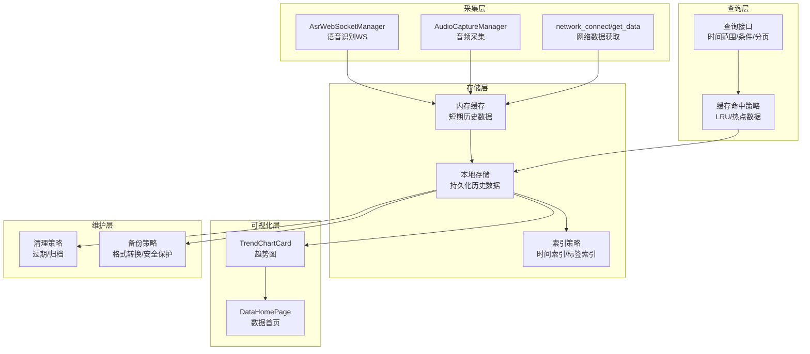

图表来源
- [entry/src/main/ets/managers/AsrWebSocketManager.ets:1-271](file://entry/src/main/ets/managers/AsrWebSocketManager.ets#L1-L271)
- [entry/src/main/ets/managers/AudioCaptureManager.ets:1-80](file://entry/src/main/ets/managers/AudioCaptureManager.ets#L1-L80)
- [entry/src/main/ets/pages/network_connect.ets:1-296](file://entry/src/main/ets/pages/network_connect.ets#L1-L296)
- [entry/src/main/ets/pages/get_data.ets:1-104](file://entry/src/main/ets/pages/get_data.ets#L1-L104)
- [entry/src/main/ets/pages/TrendChartCard.ets:1-106](file://entry/src/main/ets/pages/TrendChartCard.ets#L1-L106)
- [entry/src/main/ets/pages/DataHomePage.ets:1-61](file://entry/src/main/ets/pages/DataHomePage.ets#L1-L61)

## 详细组件分析

### 数据采集与预处理
- 语音识别与音频采集：提供语音输入与识别能力，可作为历史语音数据的采集通道
- 网络数据获取：从远端接口拉取实时传感器数据，是历史数据的重要来源

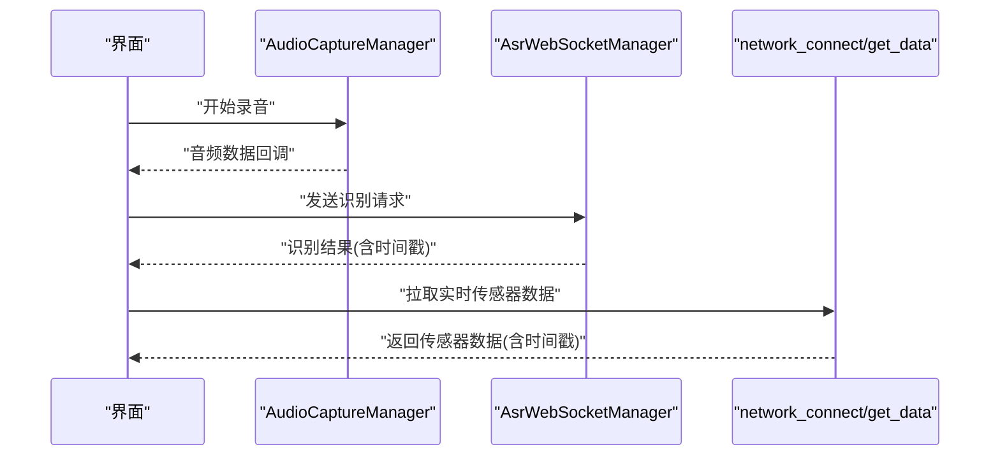

图表来源
- [entry/src/main/ets/managers/AudioCaptureManager.ets:1-80](file://entry/src/main/ets/managers/AudioCaptureManager.ets#L1-L80)
- [entry/src/main/ets/managers/AsrWebSocketManager.ets:1-271](file://entry/src/main/ets/managers/AsrWebSocketManager.ets#L1-L271)
- [entry/src/main/ets/pages/network_connect.ets:1-296](file://entry/src/main/ets/pages/network_connect.ets#L1-L296)
- [entry/src/main/ets/pages/get_data.ets:1-104](file://entry/src/main/ets/pages/get_data.ets#L1-L104)

章节来源
- [entry/src/main/ets/managers/AudioCaptureManager.ets:1-80](file://entry/src/main/ets/managers/AudioCaptureManager.ets#L1-L80)
- [entry/src/main/ets/managers/AsrWebSocketManager.ets:1-271](file://entry/src/main/ets/managers/AsrWebSocketManager.ets#L1-L271)
- [entry/src/main/ets/pages/network_connect.ets:1-296](file://entry/src/main/ets/pages/network_connect.ets#L1-L296)
- [entry/src/main/ets/pages/get_data.ets:1-104](file://entry/src/main/ets/pages/get_data.ets#L1-L104)

### 数据存储与索引策略
- 存储架构建议
  - 内存缓存：短期历史数据驻留，支持高频读写与快速聚合
  - 本地存储：持久化历史数据，支持冷数据与长周期查询
  - 索引策略：以时间戳为主索引，辅以标签/设备ID等二级索引，提升查询效率
- 数据模型设计
  - 通用字段：时间戳、设备ID、指标类别、数值、单位、质量标记
  - 扩展字段：采集来源、校验状态、归档标志
- 索引策略
  - 时间索引：支持时间范围查询与排序
  - 标签索引：支持按设备/指标维度过滤
  - 分页索引：基于游标或偏移的分页加载

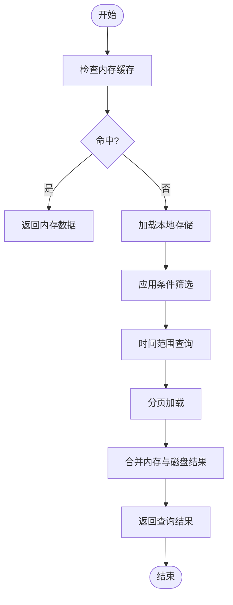

图表来源
- [entry/src/main/ets/utils/DateUtils.ets:1-28](file://entry/src/main/ets/utils/DateUtils.ets#L1-L28)

章节来源
- [entry/src/main/ets/utils/DateUtils.ets:1-28](file://entry/src/main/ets/utils/DateUtils.ets#L1-L28)

### 查询接口实现
- 时间范围查询：基于时间戳索引，支持起止时间过滤与排序
- 条件筛选：支持按设备ID、指标类别、质量标记等维度过滤
- 分页加载：支持游标或偏移分页，避免一次性加载过多数据
- 接口形态建议
  - GET /api/history/data?startTime=&endTime=&deviceId=&metric=&page=&size=
  - 返回：分页数据、总条数、下一页游标

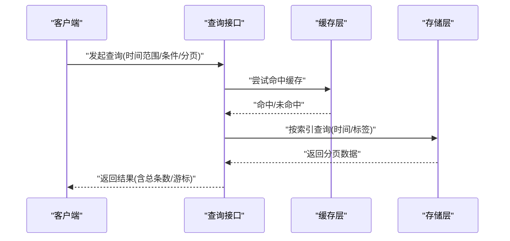

图表来源
- [entry/src/main/ets/pages/TrendChartCard.ets:1-106](file://entry/src/main/ets/pages/TrendChartCard.ets#L1-L106)
- [entry/src/main/ets/pages/DataHomePage.ets:1-61](file://entry/src/main/ets/pages/DataHomePage.ets#L1-L61)

章节来源
- [entry/src/main/ets/pages/TrendChartCard.ets:1-106](file://entry/src/main/ets/pages/TrendChartCard.ets#L1-L106)
- [entry/src/main/ets/pages/DataHomePage.ets:1-61](file://entry/src/main/ets/pages/DataHomePage.ets#L1-L61)

### 可视化与展示
- 趋势图卡：内置多指标折线绘制逻辑，可直接接入历史时间序列数据
- 数据首页：整合趋势图、边缘数据质量等组件，形成历史数据概览

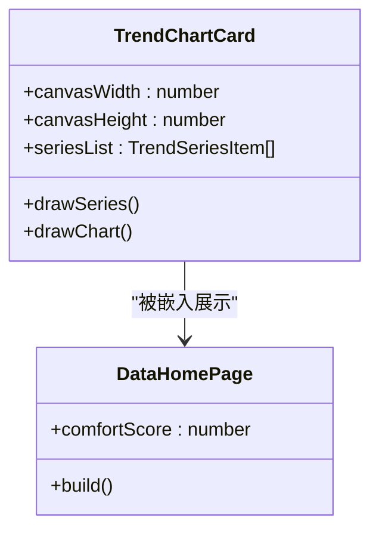

图表来源
- [entry/src/main/ets/pages/TrendChartCard.ets:1-106](file://entry/src/main/ets/pages/TrendChartCard.ets#L1-L106)
- [entry/src/main/ets/pages/DataHomePage.ets:1-61](file://entry/src/main/ets/pages/DataHomePage.ets#L1-L61)

章节来源
- [entry/src/main/ets/pages/TrendChartCard.ets:1-106](file://entry/src/main/ets/pages/TrendChartCard.ets#L1-L106)
- [entry/src/main/ets/pages/DataHomePage.ets:1-61](file://entry/src/main/ets/pages/DataHomePage.ets#L1-L61)

### 缓存机制
- 内存缓存：短期历史数据驻留，支持高频读写与快速聚合
- 本地存储：持久化历史数据，支持冷数据与长周期查询
- 缓存失效策略：基于时间窗口与容量阈值的淘汰策略，热点数据优先保留

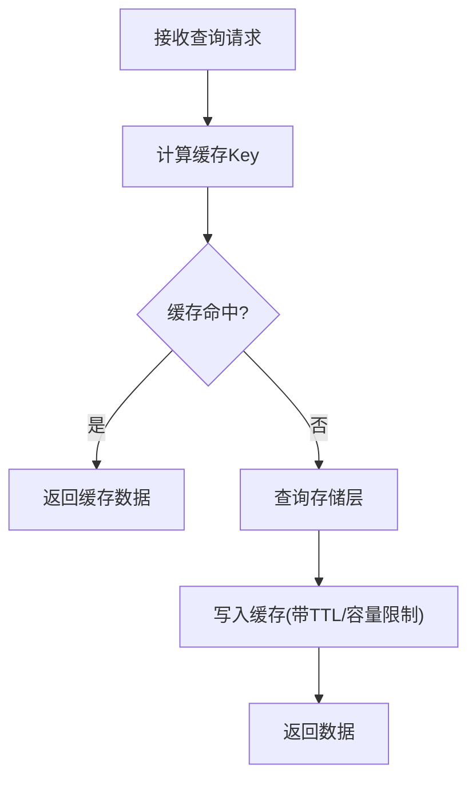

图表来源
- [entry/src/main/ets/pages/TrendChartCard.ets:1-106](file://entry/src/main/ets/pages/TrendChartCard.ets#L1-L106)

章节来源
- [entry/src/main/ets/pages/TrendChartCard.ets:1-106](file://entry/src/main/ets/pages/TrendChartCard.ets#L1-L106)

### 导出与备份
- 导出格式：CSV/JSON/Parquet 等，支持批量下载
- 批量处理：分批导出，避免阻塞主线程
- 安全保护：导出路径权限控制、敏感字段脱敏、传输加密

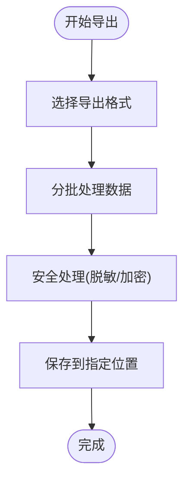

图表来源
- [entry/src/main/ets/pages/TrendChartCard.ets:1-106](file://entry/src/main/ets/pages/TrendChartCard.ets#L1-L106)

章节来源
- [entry/src/main/ets/pages/TrendChartCard.ets:1-106](file://entry/src/main/ets/pages/TrendChartCard.ets#L1-L106)

### 清理与归档
- 过期数据处理：基于时间窗口的自动清理策略
- 归档策略：将历史数据迁移到低成本存储，保留索引以便检索
- 存储空间优化：压缩存储、分区裁剪、冗余数据剔除

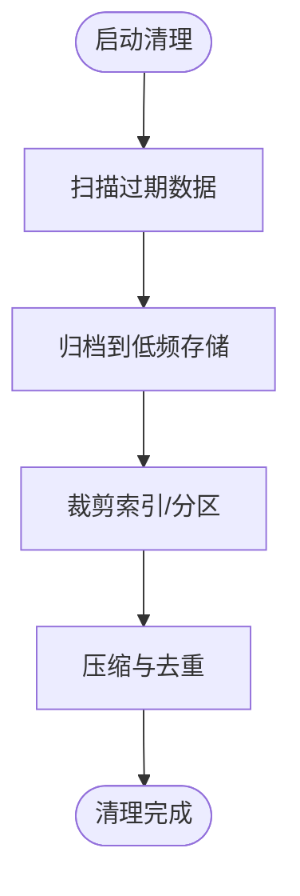

图表来源
- [entry/src/main/ets/pages/TrendChartCard.ets:1-106](file://entry/src/main/ets/pages/TrendChartCard.ets#L1-L106)

章节来源
- [entry/src/main/ets/pages/TrendChartCard.ets:1-106](file://entry/src/main/ets/pages/TrendChartCard.ets#L1-L106)

### 扩展指导
- 扩展存储后端：抽象存储接口，支持内存、SQLite、分布式KV等后端切换
- 自定义查询接口：基于索引策略实现灵活的过滤与排序，提供游标分页与增量查询
- 事件日志与告警：将历史数据变更与异常纳入审计体系，便于问题追溯

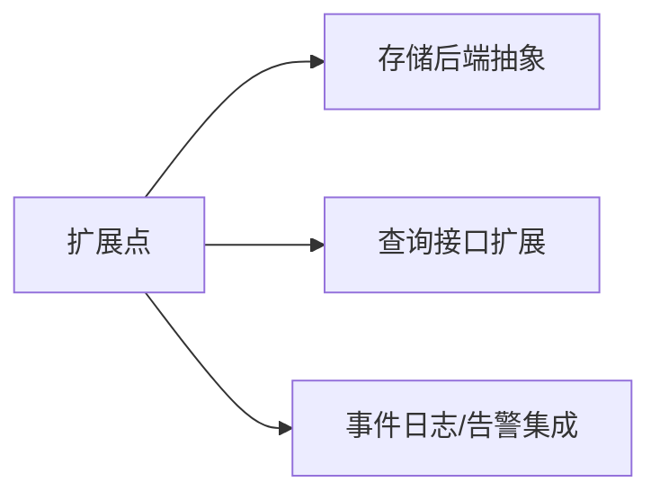

图表来源
- [entry/src/main/ets/components/log/EventLog.ets:1-78](file://entry/src/main/ets/components/log/EventLog.ets#L1-L78)
- [entry/src/main/ets/components/log/AlarmQueue.ets:1-105](file://entry/src/main/ets/components/log/AlarmQueue.ets#L1-L105)

章节来源
- [entry/src/main/ets/components/log/EventLog.ets:1-78](file://entry/src/main/ets/components/log/EventLog.ets#L1-L78)
- [entry/src/main/ets/components/log/AlarmQueue.ets:1-105](file://entry/src/main/ets/components/log/AlarmQueue.ets#L1-L105)

## 依赖关系分析
- 页面与组件：数据首页依赖趋势图卡、边缘数据质量、事件日志、告警队列等组件
- 网络与数据：网络连接与数据获取模块负责实时数据拉取，为历史数据提供来源
- 工具与常量：日期时间工具与常量定义贯穿于时间戳生成与配置使用

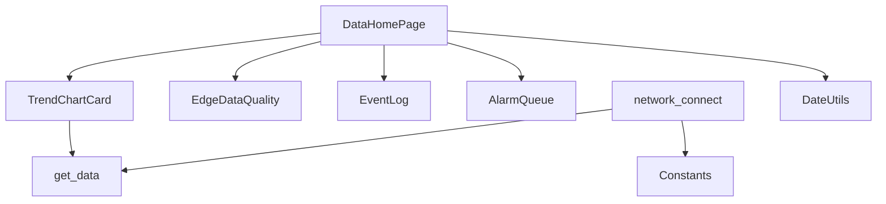

图表来源
- [entry/src/main/ets/pages/DataHomePage.ets:1-61](file://entry/src/main/ets/pages/DataHomePage.ets#L1-L61)
- [entry/src/main/ets/pages/TrendChartCard.ets:1-106](file://entry/src/main/ets/pages/TrendChartCard.ets#L1-L106)
- [entry/src/main/ets/components/sensor/EdgeDataQuality.ets:1-64](file://entry/src/main/ets/components/sensor/EdgeDataQuality.ets#L1-L64)
- [entry/src/main/ets/components/log/EventLog.ets:1-78](file://entry/src/main/ets/components/log/EventLog.ets#L1-L78)
- [entry/src/main/ets/components/log/AlarmQueue.ets:1-105](file://entry/src/main/ets/components/log/AlarmQueue.ets#L1-L105)
- [entry/src/main/ets/pages/network_connect.ets:1-296](file://entry/src/main/ets/pages/network_connect.ets#L1-L296)
- [entry/src/main/ets/pages/get_data.ets:1-104](file://entry/src/main/ets/pages/get_data.ets#L1-L104)
- [entry/src/main/ets/utils/DateUtils.ets:1-28](file://entry/src/main/ets/utils/DateUtils.ets#L1-L28)
- [entry/src/main/ets/common/Constants.ets:1-82](file://entry/src/main/ets/common/Constants.ets#L1-L82)

章节来源
- [entry/src/main/ets/pages/DataHomePage.ets:1-61](file://entry/src/main/ets/pages/DataHomePage.ets#L1-L61)
- [entry/src/main/ets/pages/TrendChartCard.ets:1-106](file://entry/src/main/ets/pages/TrendChartCard.ets#L1-L106)
- [entry/src/main/ets/components/sensor/EdgeDataQuality.ets:1-64](file://entry/src/main/ets/components/sensor/EdgeDataQuality.ets#L1-L64)
- [entry/src/main/ets/components/log/EventLog.ets:1-78](file://entry/src/main/ets/components/log/EventLog.ets#L1-L78)
- [entry/src/main/ets/components/log/AlarmQueue.ets:1-105](file://entry/src/main/ets/components/log/AlarmQueue.ets#L1-L105)
- [entry/src/main/ets/pages/network_connect.ets:1-296](file://entry/src/main/ets/pages/network_connect.ets#L1-L296)
- [entry/src/main/ets/pages/get_data.ets:1-104](file://entry/src/main/ets/pages/get_data.ets#L1-L104)
- [entry/src/main/ets/utils/DateUtils.ets:1-28](file://entry/src/main/ets/utils/DateUtils.ets#L1-L28)
- [entry/src/main/ets/common/Constants.ets:1-82](file://entry/src/main/ets/common/Constants.ets#L1-L82)

## 性能考量
- 查询性能：建立时间与标签索引，避免全表扫描；对热点指标进行缓存
- 存储性能：采用分片/分区策略，定期压缩与归档冷数据
- 可视化性能：趋势图采用Canvas绘制，避免频繁重绘；分段渲染与懒加载
- 网络性能：批量拉取与增量更新，减少请求频率

## 故障排查指南
- 网络连接异常：检查网络模块的连接状态与超时设置，确保重连机制有效
- 语音识别失败：验证鉴权URL与音频编码格式，检查WebSocket事件回调
- 数据展示异常：核对时间戳格式与组件渲染逻辑，确保数据结构一致

章节来源
- [entry/src/main/ets/pages/network_connect.ets:1-296](file://entry/src/main/ets/pages/network_connect.ets#L1-L296)
- [entry/src/main/ets/managers/AsrWebSocketManager.ets:1-271](file://entry/src/main/ets/managers/AsrWebSocketManager.ets#L1-L271)
- [entry/src/main/ets/utils/DateUtils.ets:1-28](file://entry/src/main/ets/utils/DateUtils.ets#L1-L28)

## 结论
本技术文档基于现有代码库，提出了历史数据管理的完整方案：从采集、存储、查询、可视化到维护的全链路设计。当前工程已具备实时数据展示与网络通信能力，可作为历史数据管理的坚实基础。建议按照“先可视化、后存储”的渐进式策略，逐步引入索引与缓存机制，最终实现稳定、高效的历史数据管理体系。

## 附录
- 常量定义：采样率、通道数、缓冲区大小、语音识别服务参数等
- 日期时间工具：统一时间格式化，保障历史数据时间轴一致性

章节来源
- [entry/src/main/ets/common/Constants.ets:1-82](file://entry/src/main/ets/common/Constants.ets#L1-L82)
- [entry/src/main/ets/utils/DateUtils.ets:1-28](file://entry/src/main/ets/utils/DateUtils.ets#L1-L28)