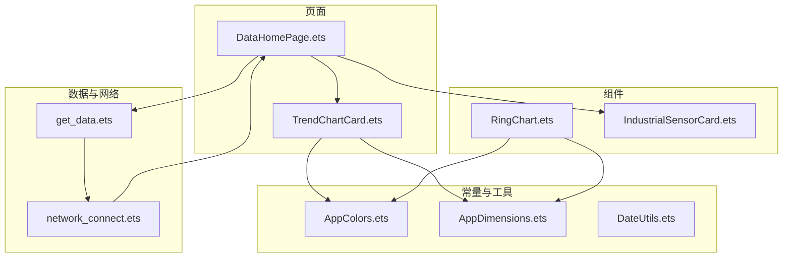
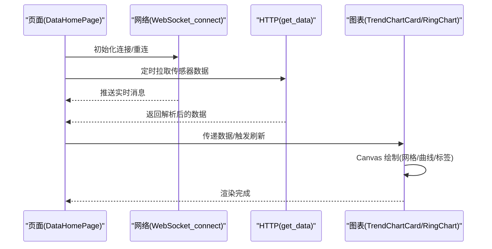
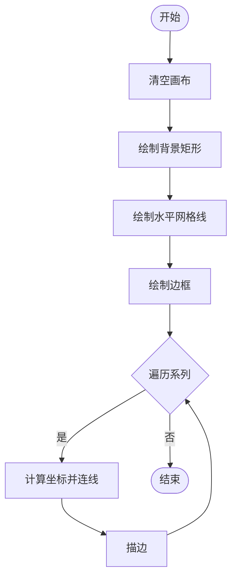
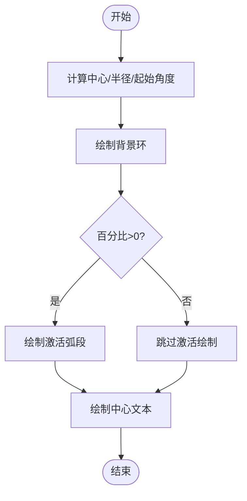
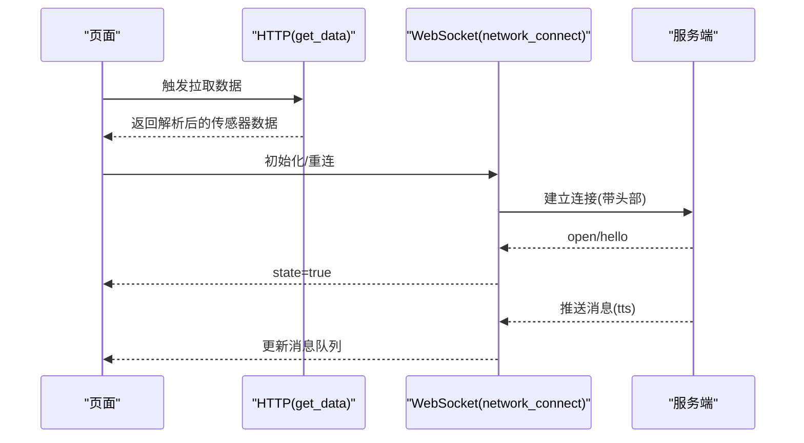
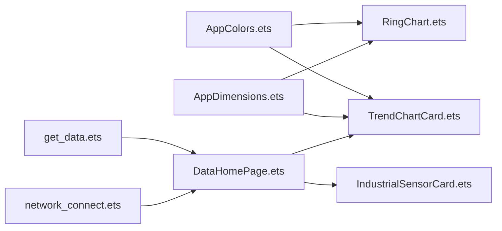

# 实时图表展示

<cite>
**本文引用的文件**
- [TrendChartCard.ets](file://entry/src/main/ets/pages/TrendChartCard.ets)
- [RingChart.ets](file://entry/src/main/ets/components/actuator/RingChart.ets)
- [AppColors.ets](file://entry/src/main/ets/constants/AppColors.ets)
- [AppDimensions.ets](file://entry/src/main/ets/constants/AppDimensions.ets)
- [get_data.ets](file://entry/src/main/ets/pages/get_data.ets)
- [network_connect.ets](file://entry/src/main/ets/pages/network_connect.ets)
- [DataHomePage.ets](file://entry/src/main/ets/pages/DataHomePage.ets)
- [IndustrialSensorCard.ets](file://entry/src/main/ets/components/sensor/IndustrialSensorCard.ets)
- [DateUtils.ets](file://entry/src/main/ets/utils/DateUtils.ets)
</cite>

## 目录
1. [简介](#简介)
2. [项目结构](#项目结构)
3. [核心组件](#核心组件)
4. [架构总览](#架构总览)
5. [详细组件分析](#详细组件分析)
6. [依赖关系分析](#依赖关系分析)
7. [性能考虑](#性能考虑)
8. [故障排查指南](#故障排查指南)
9. [结论](#结论)
10. [附录](#附录)

## 简介
本技术文档围绕实时图表展示能力展开，重点覆盖趋势图表的数据渲染机制、动态更新策略、性能优化、生命周期管理、数据绑定与状态同步、动画与交互（缩放、平移、悬停）、主题与颜色配置以及响应式布局适配。文档同时提供扩展图表类型与自定义视觉效果的实践建议，帮助开发者在 ArkTS/ArkUI 生态下构建高性能、可维护的实时可视化界面。

## 项目结构
本项目采用以页面与组件分层组织的方式，图表相关的核心文件集中在 pages 与 components 目录中，配合 constants 提供统一的颜色与尺寸规范，utils 提供通用工具方法。实时数据通过网络模块拉取并驱动图表更新。

**图表来源**
- [DataHomePage.ets:1-61](file://entry/src/main/ets/pages/DataHomePage.ets#L1-L61)
- [TrendChartCard.ets:1-106](file://entry/src/main/ets/pages/TrendChartCard.ets#L1-L106)
- [RingChart.ets:1-70](file://entry/src/main/ets/components/actuator/RingChart.ets#L1-L70)
- [IndustrialSensorCard.ets:1-109](file://entry/src/main/ets/components/sensor/IndustrialSensorCard.ets#L1-L109)
- [get_data.ets:1-105](file://entry/src/main/ets/pages/get_data.ets#L1-L105)
- [network_connect.ets:1-322](file://entry/src/main/ets/pages/network_connect.ets#L1-L322)
- [AppColors.ets:1-47](file://entry/src/main/ets/constants/AppColors.ets#L1-L47)
- [AppDimensions.ets:1-40](file://entry/src/main/ets/constants/AppDimensions.ets#L1-L40)
- [DateUtils.ets:1-28](file://entry/src/main/ets/utils/DateUtils.ets#L1-L28)

**章节来源**
- [DataHomePage.ets:1-61](file://entry/src/main/ets/pages/DataHomePage.ets#L1-L61)
- [TrendChartCard.ets:1-106](file://entry/src/main/ets/pages/TrendChartCard.ets#L1-L106)
- [RingChart.ets:1-70](file://entry/src/main/ets/components/actuator/RingChart.ets#L1-L70)
- [IndustrialSensorCard.ets:1-109](file://entry/src/main/ets/components/sensor/IndustrialSensorCard.ets#L1-L109)
- [get_data.ets:1-105](file://entry/src/main/ets/pages/get_data.ets#L1-L105)
- [network_connect.ets:1-322](file://entry/src/main/ets/pages/network_connect.ets#L1-L322)
- [AppColors.ets:1-47](file://entry/src/main/ets/constants/AppColors.ets#L1-L47)
- [AppDimensions.ets:1-40](file://entry/src/main/ets/constants/AppDimensions.ets#L1-L40)
- [DateUtils.ets:1-28](file://entry/src/main/ets/utils/DateUtils.ets#L1-L28)

## 核心组件
- 趋势图表卡片：基于 Canvas 的多系列折线图，支持双轴、网格、边框与渐变背景，具备固定画布尺寸与预设数据集，适合固定窗口内的趋势展示。
- 环形图组件：基于 Canvas 的环形进度图，支持占比绘制、圆角端帽、中心文本与颜色主题，适合占比类指标的直观展示。
- 数据页容器：提供整体布局、滚动区域与渐变背景，承载趋势图与其他传感器卡片。
- 传感器卡片：展示多路传感器的名称、数值与单位，支持空态提示与统一风格。
- 数据获取与网络：提供 HTTP 请求与 WebSocket 连接封装，支持重连、WiFi 监听与消息处理，为图表提供实时数据源。

**章节来源**
- [TrendChartCard.ets:1-106](file://entry/src/main/ets/pages/TrendChartCard.ets#L1-L106)
- [RingChart.ets:1-70](file://entry/src/main/ets/components/actuator/RingChart.ets#L1-L70)
- [DataHomePage.ets:1-61](file://entry/src/main/ets/pages/DataHomePage.ets#L1-L61)
- [IndustrialSensorCard.ets:1-109](file://entry/src/main/ets/components/sensor/IndustrialSensorCard.ets#L1-L109)
- [get_data.ets:1-105](file://entry/src/main/ets/pages/get_data.ets#L1-L105)
- [network_connect.ets:1-322](file://entry/src/main/ets/pages/network_connect.ets#L1-L322)

## 架构总览
实时图表的运行链路由“数据采集 → 网络传输 → 页面渲染 → 图表绘制”构成。页面负责布局与生命周期，网络模块负责连接与消息，数据模块负责解析与状态，图表组件负责最终渲染。

**图表来源**
- [DataHomePage.ets:1-61](file://entry/src/main/ets/pages/DataHomePage.ets#L1-L61)
- [network_connect.ets:1-322](file://entry/src/main/ets/pages/network_connect.ets#L1-L322)
- [get_data.ets:1-105](file://entry/src/main/ets/pages/get_data.ets#L1-L105)
- [TrendChartCard.ets:1-106](file://entry/src/main/ets/pages/TrendChartCard.ets#L1-L106)
- [RingChart.ets:1-70](file://entry/src/main/ets/components/actuator/RingChart.ets#L1-L70)

## 详细组件分析

### 趋势图表卡片（Canvas 折线图）
- 数据结构：Series 列表包含名称、颜色、轴位（左/右）、数值序列；默认内置四条曲线。
- 渲染流程：在 Canvas 就绪后清屏、绘制背景与网格、描边边框，随后逐条绘制折线。
- 坐标映射：根据左右轴最大值将数值映射到画布高度区间，确保不同量纲的曲线在同一画布内对齐。
- 样式与主题：背景色、网格线、边框与渐变背景均来自常量与主题色，保证一致的视觉风格。
- 生命周期：通过 Canvas 的 onReady 触发首次绘制；后续更新需在外部触发刷新并重绘。

**图表来源**
- [TrendChartCard.ets:24-80](file://entry/src/main/ets/pages/TrendChartCard.ets#L24-L80)

**章节来源**
- [TrendChartCard.ets:1-106](file://entry/src/main/ets/pages/TrendChartCard.ets#L1-L106)
- [AppColors.ets:1-47](file://entry/src/main/ets/constants/AppColors.ets#L1-L47)
- [AppDimensions.ets:1-40](file://entry/src/main/ets/constants/AppDimensions.ets#L1-L40)

### 环形图组件（Canvas 环形进度）
- 参数：百分比、尺寸、环宽，使用 Canvas 渲染。
- 绘制逻辑：先绘制背景环，再按百分比绘制激活弧段，最后在中心绘制文字与辅助文本。
- 主题适配：颜色来自 AppColors，字体大小与对齐方式统一。

**图表来源**
- [RingChart.ets:31-68](file://entry/src/main/ets/components/actuator/RingChart.ets#L31-L68)

**章节来源**
- [RingChart.ets:1-70](file://entry/src/main/ets/components/actuator/RingChart.ets#L1-L70)
- [AppColors.ets:1-47](file://entry/src/main/ets/constants/AppColors.ets#L1-L47)

### 数据页容器与布局
- 提供标题栏、滚动区域、渐变背景与阴影，作为图表与卡片的承载容器。
- 通过 Flex/Stack/LinearGradient 等布局属性实现响应式与层次感。

**章节来源**
- [DataHomePage.ets:1-61](file://entry/src/main/ets/pages/DataHomePage.ets#L1-L61)

### 传感器卡片
- 展示多路传感器的名称、数值与单位，支持空态提示与统一卡片风格。
- 与趋势图形成互补：前者展示实时指标，后者展示历史趋势。

**章节来源**
- [IndustrialSensorCard.ets:1-109](file://entry/src/main/ets/components/sensor/IndustrialSensorCard.ets#L1-L109)

### 数据获取与网络通信
- HTTP：定时拉取传感器数据，解析 ApiResponse，输出 pretty 数组等字段。
- WebSocket：建立长连接，监听 open/message/close/error，支持 WiFi 断线重连与状态标记。
- 交互：发送文本指令时携带会话 ID 与特征参数，接收服务端消息并缓存。

**图表来源**
- [get_data.ets:71-100](file://entry/src/main/ets/pages/get_data.ets#L71-L100)
- [network_connect.ets:149-180](file://entry/src/main/ets/pages/network_connect.ets#L149-L180)
- [network_connect.ets:182-261](file://entry/src/main/ets/pages/network_connect.ets#L182-L261)

**章节来源**
- [get_data.ets:1-105](file://entry/src/main/ets/pages/get_data.ets#L1-L105)
- [network_connect.ets:1-322](file://entry/src/main/ets/pages/network_connect.ets#L1-L322)

## 依赖关系分析
- 趋势图与环形图均依赖 AppColors 与 AppDimensions 进行主题与尺寸控制，降低耦合度。
- 数据页容器依赖趋势图与传感器卡片进行内容组合。
- 网络模块与数据模块为图表提供实时数据源，二者通过页面协调触发刷新。

**图表来源**
- [AppColors.ets:1-47](file://entry/src/main/ets/constants/AppColors.ets#L1-L47)
- [AppDimensions.ets:1-40](file://entry/src/main/ets/constants/AppDimensions.ets#L1-L40)
- [TrendChartCard.ets:1-106](file://entry/src/main/ets/pages/TrendChartCard.ets#L1-L106)
- [RingChart.ets:1-70](file://entry/src/main/ets/components/actuator/RingChart.ets#L1-L70)
- [DataHomePage.ets:1-61](file://entry/src/main/ets/pages/DataHomePage.ets#L1-L61)
- [IndustrialSensorCard.ets:1-109](file://entry/src/main/ets/components/sensor/IndustrialSensorCard.ets#L1-L109)
- [get_data.ets:1-105](file://entry/src/main/ets/pages/get_data.ets#L1-L105)
- [network_connect.ets:1-322](file://entry/src/main/ets/pages/network_connect.ets#L1-L322)

**章节来源**
- [AppColors.ets:1-47](file://entry/src/main/ets/constants/AppColors.ets#L1-L47)
- [AppDimensions.ets:1-40](file://entry/src/main/ets/constants/AppDimensions.ets#L1-L40)
- [TrendChartCard.ets:1-106](file://entry/src/main/ets/pages/TrendChartCard.ets#L1-L106)
- [RingChart.ets:1-70](file://entry/src/main/ets/components/actuator/RingChart.ets#L1-L70)
- [DataHomePage.ets:1-61](file://entry/src/main/ets/pages/DataHomePage.ets#L1-L61)
- [IndustrialSensorCard.ets:1-109](file://entry/src/main/ets/components/sensor/IndustrialSensorCard.ets#L1-L109)
- [get_data.ets:1-105](file://entry/src/main/ets/pages/get_data.ets#L1-L105)
- [network_connect.ets:1-322](file://entry/src/main/ets/pages/network_connect.ets#L1-L322)

## 性能考虑
- Canvas 绘制优化
  - 批量绘制：将网格、边框与曲线合并为一次绘制流程，减少上下文切换。
  - 最小化重绘：仅在数据变化或尺寸变化时触发重绘；避免频繁 onReady 回调。
  - 坐标计算复用：将 segment、比例换算等中间结果缓存，避免重复计算。
- 数据更新策略
  - 使用观察者模式（@ObservedV2/@Trace）管理状态，确保数据变化时自动触发 UI 更新。
  - 对于高频数据流，采用节流/采样策略，避免每帧都触发重绘。
- 网络与内存
  - WebSocket 断线重连需加锁避免并发重连；清理 pendingRequests，防止内存泄漏。
  - HTTP 请求设置合理的超时与错误处理，避免阻塞主线程。
- 主题与尺寸
  - 通过 AppColors 与 AppDimensions 统一管理，减少硬编码带来的维护成本与渲染差异。

[本节为通用性能建议，不直接分析具体文件，故无“章节来源”]

## 故障排查指南
- WebSocket 连接问题
  - 现象：state=false、消息无法接收。
  - 排查：检查 WiFi 监听与重连逻辑，确认 header 字段正确；查看 close/error 事件日志。
- HTTP 请求失败
  - 现象：返回非 200 或抛出异常。
  - 排查：确认目标地址可达、超时设置合理、JSON 解析类型断言正确。
- Canvas 绘制异常
  - 现象：线条不显示、坐标错乱。
  - 排查：确认 onReady 后再绘制；检查坐标映射公式与画布尺寸；验证颜色与线宽设置。
- 数据为空或格式不符
  - 现象：图表空白或报错。
  - 排查：核对 ApiResponse 结构与 pretty 字段；确保数据转换与类型断言一致。

**章节来源**
- [network_connect.ets:105-131](file://entry/src/main/ets/pages/network_connect.ets#L105-L131)
- [network_connect.ets:182-261](file://entry/src/main/ets/pages/network_connect.ets#L182-L261)
- [get_data.ets:71-100](file://entry/src/main/ets/pages/get_data.ets#L71-L100)
- [TrendChartCard.ets:24-80](file://entry/src/main/ets/pages/TrendChartCard.ets#L24-L80)

## 结论
本项目通过 Canvas 驱动的图表组件与统一的主题/尺寸常量，实现了稳定的实时趋势与占比展示。结合 HTTP/WS 的数据通道与观察者状态管理，图表具备良好的可维护性与扩展性。建议在生产环境中进一步引入节流/采样、增量更新与更细粒度的状态订阅，以提升复杂场景下的性能与用户体验。

[本节为总结性内容，不直接分析具体文件，故无“章节来源”]

## 附录

### 动画与交互实现建议
- 平滑过渡
  - 使用 Canvas 动画帧循环（requestAnimationFrame）实现曲线插值与渐变过渡，避免直接重绘导致的闪烁。
- 缩放与平移
  - 通过滑动/手势事件更新视口范围（min/max），并重绘网格与曲线；保持坐标映射一致性。
- 悬停与详情
  - 在 Canvas 上检测鼠标/触摸位置，计算最近数据点并绘制提示框；结合页面弹层展示详细信息。
- 主题与颜色
  - 通过 AppColors 新增/替换颜色常量，确保深浅主题切换时的一致性。
- 响应式布局
  - 使用 AppDimensions 的尺寸常量与 Flex/Stack 布局，使图表在不同屏幕尺寸下保持比例与可读性。

[本节为通用实现建议，不直接分析具体文件，故无“章节来源”]

### 扩展图表类型与自定义视觉
- 新增图表类型
  - 参考 TrendChartCard 的 Series 结构与 Canvas 绘制流程，新增柱状图/面积图等。
- 自定义视觉
  - 在 AppColors 与 AppDimensions 中增加新变量，统一管理颜色与尺寸；在组件内部通过 props 接受外部配置。

[本节为通用扩展建议，不直接分析具体文件，故无“章节来源”]