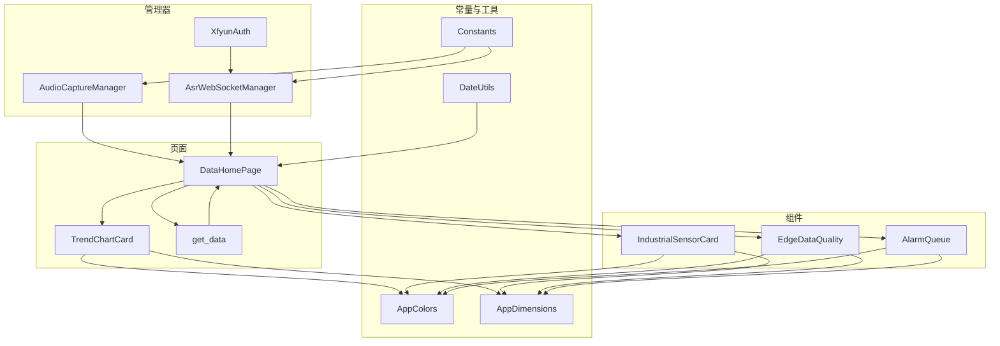
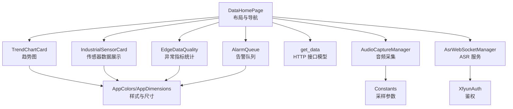
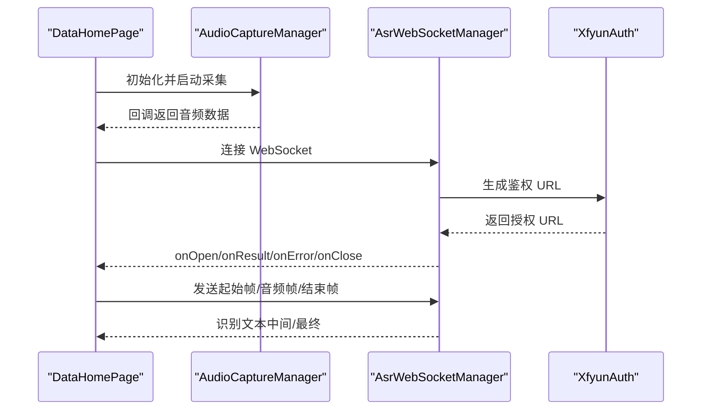
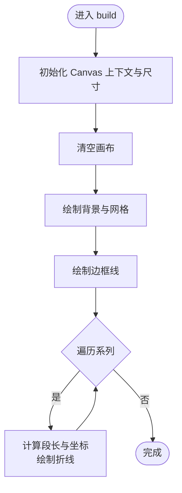
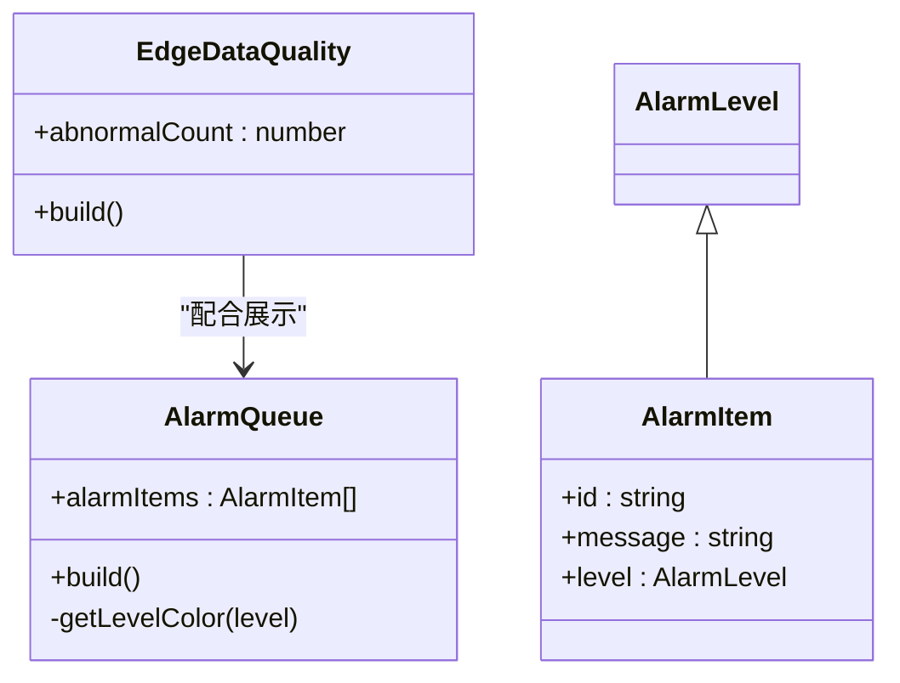
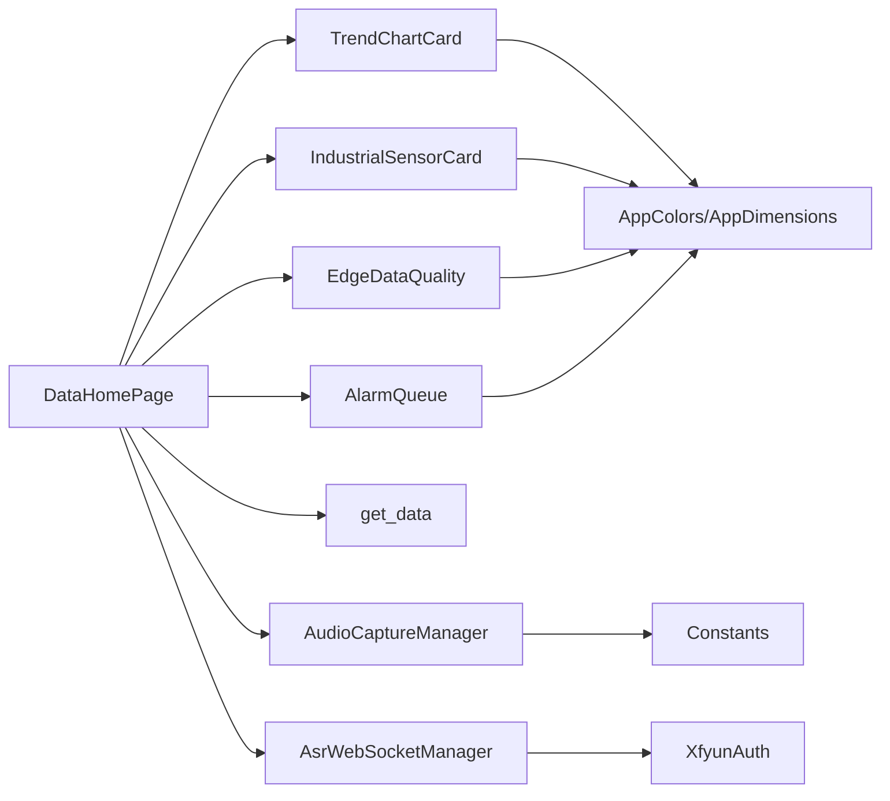

# 数据监控系统

<cite>
**本文引用的文件**
- [entry/src/main/ets/common/Constants.ets](file://entry/src/main/ets/common/Constants.ets)
- [entry/src/main/ets/pages/DataHomePage.ets](file://entry/src/main/ets/pages/DataHomePage.ets)
- [entry/src/main/ets/pages/TrendChartCard.ets](file://entry/src/main/ets/pages/TrendChartCard.ets)
- [entry/src/main/ets/components/sensor/IndustrialSensorCard.ets](file://entry/src/main/ets/components/sensor/IndustrialSensorCard.ets)
- [entry/src/main/ets/components/sensor/EdgeDataQuality.ets](file://entry/src/main/ets/components/sensor/EdgeDataQuality.ets)
- [entry/src/main/ets/components/log/AlarmQueue.ets](file://entry/src/main/ets/components/log/AlarmQueue.ets)
- [entry/src/main/ets/managers/AudioCaptureManager.ets](file://entry/src/main/ets/managers/AudioCaptureManager.ets)
- [entry/src/main/ets/managers/AsrWebSocketManager.ets](file://entry/src/main/ets/managers/AsrWebSocketManager.ets)
- [entry/src/main/ets/managers/XfyunAuth.ets](file://entry/src/main/ets/managers/XfyunAuth.ets)
- [entry/src/main/ets/constants/AppColors.ets](file://entry/src/main/ets/constants/AppColors.ets)
- [entry/src/main/ets/constants/AppDimensions.ets](file://entry/src/main/ets/constants/AppDimensions.ets)
- [entry/src/main/ets/utils/DateUtils.ets](file://entry/src/main/ets/utils/DateUtils.ets)
- [entry/src/main/ets/pages/get_data.ets](file://entry/src/main/ets/pages/get_data.ets)
</cite>

## 目录
1. [简介](#简介)
2. [项目结构](#项目结构)
3. [核心组件](#核心组件)
4. [架构总览](#架构总览)
5. [详细组件分析](#详细组件分析)
6. [依赖关系分析](#依赖关系分析)
7. [性能考量](#性能考量)
8. [故障排查指南](#故障排查指南)
9. [结论](#结论)
10. [附录](#附录)

## 简介
本技术文档面向数据监控系统，聚焦于传感器数据的采集、处理与展示，涵盖以下方面：
- 数据采集：音频采集与语音识别（ASR）通道，以及网络拉取的传感器数据。
- 数据处理：数据格式、采样频率与精度控制、异常检测与质量评分思路。
- 实时图表：Canvas 渲染、坐标轴与多系列曲线绘制、动画与交互建议。
- 数据质量监控：异常指标统计、完整性检查与质量评分设计。
- 历史数据：HTTP 接口模型、缓存与持久化建议、检索优化策略。
- 可视化设计：色彩体系、字体与间距、用户体验与无障碍。
- 性能优化：大数据量渲染、内存与 CPU 使用、后台任务与节流。
- 扩展指南：新增传感器类型、接入新数据源与模块化集成。

## 项目结构
该工程采用 ArkTS/ArkUI 架构，页面与组件分层清晰，数据来源包括本地音频采集、WebSocket 语音识别与远程 HTTP 接口。核心目录与职责如下：
- entry/src/main/ets/pages：页面级容器，负责布局与导航。
- entry/src/main/ets/components：可复用 UI 组件，如传感器卡片、告警队列、趋势图卡。
- entry/src/main/ets/managers：业务管理器，封装设备与网络能力。
- entry/src/main/ets/constants：全局样式与尺寸常量。
- entry/src/main/ets/utils：通用工具类，如日期格式化。
- entry/src/main/ets/common：通用常量与通用逻辑（如退出确认）。

**图表来源**
- [entry/src/main/ets/pages/DataHomePage.ets:1-66](file://entry/src/main/ets/pages/DataHomePage.ets#L1-L66)
- [entry/src/main/ets/pages/TrendChartCard.ets:1-106](file://entry/src/main/ets/pages/TrendChartCard.ets#L1-L106)
- [entry/src/main/ets/pages/get_data.ets:1-105](file://entry/src/main/ets/pages/get_data.ets#L1-L105)
- [entry/src/main/ets/components/sensor/IndustrialSensorCard.ets:1-109](file://entry/src/main/ets/components/sensor/IndustrialSensorCard.ets#L1-L109)
- [entry/src/main/ets/components/sensor/EdgeDataQuality.ets:1-64](file://entry/src/main/ets/components/sensor/EdgeDataQuality.ets#L1-L64)
- [entry/src/main/ets/components/log/AlarmQueue.ets:1-105](file://entry/src/main/ets/components/log/AlarmQueue.ets#L1-L105)
- [entry/src/main/ets/managers/AudioCaptureManager.ets:1-80](file://entry/src/main/ets/managers/AudioCaptureManager.ets#L1-L80)
- [entry/src/main/ets/managers/AsrWebSocketManager.ets:1-271](file://entry/src/main/ets/managers/AsrWebSocketManager.ets#L1-L271)
- [entry/src/main/ets/managers/XfyunAuth.ets:1-34](file://entry/src/main/ets/managers/XfyunAuth.ets#L1-L34)
- [entry/src/main/ets/common/Constants.ets:1-82](file://entry/src/main/ets/common/Constants.ets#L1-L82)
- [entry/src/main/ets/constants/AppColors.ets:1-47](file://entry/src/main/ets/constants/AppColors.ets#L1-L47)
- [entry/src/main/ets/constants/AppDimensions.ets:1-40](file://entry/src/main/ets/constants/AppDimensions.ets#L1-L40)
- [entry/src/main/ets/utils/DateUtils.ets:1-28](file://entry/src/main/ets/utils/DateUtils.ets#L1-L28)

**章节来源**
- [entry/src/main/ets/pages/DataHomePage.ets:1-66](file://entry/src/main/ets/pages/DataHomePage.ets#L1-L66)
- [entry/src/main/ets/pages/TrendChartCard.ets:1-106](file://entry/src/main/ets/pages/TrendChartCard.ets#L1-L106)
- [entry/src/main/ets/pages/get_data.ets:1-105](file://entry/src/main/ets/pages/get_data.ets#L1-L105)

## 核心组件
- 传感器卡片组件：用于展示多路传感器的名称、数值与单位，支持空态提示与圆角背景。
- 边缘数据质量组件：以数字形式展示异常指标数量，强调关键质量指标。
- 告警队列组件：按严重程度分级展示告警消息，支持不同边框颜色区分等级。
- 趋势图卡组件：基于 Canvas 绘制多系列曲线，包含网格、坐标轴与渐变背景。
- 数据主页：聚合舒适指数环形图、传感器卡片、数据质量卡片与趋势图卡。
- 网络数据模型：定义 HTTP 接口返回的数据结构，包含元信息、传感器值与执行器状态。
- 音频采集管理器：配置采样率、声道与编码格式，提供启动/停止/释放生命周期。
- 语音识别 WebSocket 管理器：封装讯飞 ASR 的鉴权、连接、帧发送与结果解析。
- 讯飞鉴权：生成授权 URL，使用 HMAC-SHA256 与 Base64 编码。
- 常量与工具：统一采样参数、颜色与尺寸，提供日期格式化工具。

**章节来源**
- [entry/src/main/ets/components/sensor/IndustrialSensorCard.ets:1-109](file://entry/src/main/ets/components/sensor/IndustrialSensorCard.ets#L1-L109)
- [entry/src/main/ets/components/sensor/EdgeDataQuality.ets:1-64](file://entry/src/main/ets/components/sensor/EdgeDataQuality.ets#L1-L64)
- [entry/src/main/ets/components/log/AlarmQueue.ets:1-105](file://entry/src/main/ets/components/log/AlarmQueue.ets#L1-L105)
- [entry/src/main/ets/pages/TrendChartCard.ets:1-106](file://entry/src/main/ets/pages/TrendChartCard.ets#L1-L106)
- [entry/src/main/ets/pages/DataHomePage.ets:1-66](file://entry/src/main/ets/pages/DataHomePage.ets#L1-L66)
- [entry/src/main/ets/pages/get_data.ets:1-105](file://entry/src/main/ets/pages/get_data.ets#L1-L105)
- [entry/src/main/ets/managers/AudioCaptureManager.ets:1-80](file://entry/src/main/ets/managers/AudioCaptureManager.ets#L1-L80)
- [entry/src/main/ets/managers/AsrWebSocketManager.ets:1-271](file://entry/src/main/ets/managers/AsrWebSocketManager.ets#L1-L271)
- [entry/src/main/ets/managers/XfyunAuth.ets:1-34](file://entry/src/main/ets/managers/XfyunAuth.ets#L1-L34)
- [entry/src/main/ets/common/Constants.ets:1-82](file://entry/src/main/ets/common/Constants.ets#L1-L82)
- [entry/src/main/ets/constants/AppColors.ets:1-47](file://entry/src/main/ets/constants/AppColors.ets#L1-L47)
- [entry/src/main/ets/constants/AppDimensions.ets:1-40](file://entry/src/main/ets/constants/AppDimensions.ets#L1-L40)
- [entry/src/main/ets/utils/DateUtils.ets:1-28](file://entry/src/main/ets/utils/DateUtils.ets#L1-L28)

## 架构总览
系统采用“页面容器 + 组件 + 管理器”的分层架构：
- 页面负责布局与组合，组件负责展示与交互，管理器封装底层能力。
- 数据来源包括本地音频采集与 WebSocket 语音识别，以及远程 HTTP 接口。
- 组件间通过属性传递数据，页面统一调度与状态管理。

**图表来源**
- [entry/src/main/ets/pages/DataHomePage.ets:1-66](file://entry/src/main/ets/pages/DataHomePage.ets#L1-L66)
- [entry/src/main/ets/pages/TrendChartCard.ets:1-106](file://entry/src/main/ets/pages/TrendChartCard.ets#L1-L106)
- [entry/src/main/ets/pages/get_data.ets:1-105](file://entry/src/main/ets/pages/get_data.ets#L1-L105)
- [entry/src/main/ets/managers/AudioCaptureManager.ets:1-80](file://entry/src/main/ets/managers/AudioCaptureManager.ets#L1-L80)
- [entry/src/main/ets/managers/AsrWebSocketManager.ets:1-271](file://entry/src/main/ets/managers/AsrWebSocketManager.ets#L1-L271)
- [entry/src/main/ets/managers/XfyunAuth.ets:1-34](file://entry/src/main/ets/managers/XfyunAuth.ets#L1-L34)
- [entry/src/main/ets/common/Constants.ets:1-82](file://entry/src/main/ets/common/Constants.ets#L1-L82)
- [entry/src/main/ets/constants/AppColors.ets:1-47](file://entry/src/main/ets/constants/AppColors.ets#L1-L47)
- [entry/src/main/ets/constants/AppDimensions.ets:1-40](file://entry/src/main/ets/constants/AppDimensions.ets#L1-L40)

## 详细组件分析

### 传感器数据采集与处理
- 音频采集：通过管理器配置采样率、声道与编码格式，注册读取回调，启动/停止/释放生命周期完备。
- 语音识别：通过 WebSocket 连接 ASR 服务，发送起始帧、音频帧与结束帧，解析识别结果并按序拼接。
- 网络数据：定义接口返回结构，包含元信息、传感器值数组与“美化”后的标签、单位与比例因子，便于前端直接渲染。

**图表来源**
- [entry/src/main/ets/pages/DataHomePage.ets:1-66](file://entry/src/main/ets/pages/DataHomePage.ets#L1-L66)
- [entry/src/main/ets/managers/AudioCaptureManager.ets:1-80](file://entry/src/main/ets/managers/AudioCaptureManager.ets#L1-L80)
- [entry/src/main/ets/managers/AsrWebSocketManager.ets:1-271](file://entry/src/main/ets/managers/AsrWebSocketManager.ets#L1-L271)
- [entry/src/main/ets/managers/XfyunAuth.ets:1-34](file://entry/src/main/ets/managers/XfyunAuth.ets#L1-L34)

**章节来源**
- [entry/src/main/ets/managers/AudioCaptureManager.ets:1-80](file://entry/src/main/ets/managers/AudioCaptureManager.ets#L1-L80)
- [entry/src/main/ets/managers/AsrWebSocketManager.ets:1-271](file://entry/src/main/ets/managers/AsrWebSocketManager.ets#L1-L271)
- [entry/src/main/ets/managers/XfyunAuth.ets:1-34](file://entry/src/main/ets/managers/XfyunAuth.ets#L1-L34)
- [entry/src/main/ets/common/Constants.ets:1-82](file://entry/src/main/ets/common/Constants.ets#L1-L82)

### 实时图表实现原理
- Canvas 渲染：在组件构建时创建 Canvas 上下文，设置画布尺寸与背景，绘制网格与边框。
- 多系列曲线：按时间序列长度计算段长，根据左右轴最大值映射 Y 坐标，逐点连线。
- 坐标轴与标签：左侧 CO2 使用固定刻度，右侧温湿度噪声使用独立最大值，保证多量纲对比。
- 动画与交互：当前实现为静态绘制；建议通过定时刷新与过渡动画提升体验。

**图表来源**
- [entry/src/main/ets/pages/TrendChartCard.ets:1-106](file://entry/src/main/ets/pages/TrendChartCard.ets#L1-L106)

**章节来源**
- [entry/src/main/ets/pages/TrendChartCard.ets:1-106](file://entry/src/main/ets/pages/TrendChartCard.ets#L1-L106)
- [entry/src/main/ets/constants/AppColors.ets:1-47](file://entry/src/main/ets/constants/AppColors.ets#L1-L47)
- [entry/src/main/ets/constants/AppDimensions.ets:1-40](file://entry/src/main/ets/constants/AppDimensions.ets#L1-L40)

### 数据质量监控与告警
- 异常指标统计：以卡片形式展示异常数量，便于快速定位问题。
- 告警分级：严重、警告、提示三档，分别对应不同边框颜色与语义。
- 完整性检查：结合 HTTP 接口返回的更新时间与在线状态，判断数据新鲜度与可用性。
- 质量评分：建议基于异常数量、数据缺失比例、波动幅度等维度加权计算。

**图表来源**
- [entry/src/main/ets/components/sensor/EdgeDataQuality.ets:1-64](file://entry/src/main/ets/components/sensor/EdgeDataQuality.ets#L1-L64)
- [entry/src/main/ets/components/log/AlarmQueue.ets:1-105](file://entry/src/main/ets/components/log/AlarmQueue.ets#L1-L105)

**章节来源**
- [entry/src/main/ets/components/sensor/EdgeDataQuality.ets:1-64](file://entry/src/main/ets/components/sensor/EdgeDataQuality.ets#L1-L64)
- [entry/src/main/ets/components/log/AlarmQueue.ets:1-105](file://entry/src/main/ets/components/log/AlarmQueue.ets#L1-L105)

### 历史数据查询与存储
- 接口模型：定义了返回字段与数据结构，便于前端直接消费与渲染。
- 缓存策略：建议在页面或管理器中缓存最近 N 条记录，按时间戳排序，避免重复请求。
- 持久化：可结合本地数据库或文件存储，定期清理过期数据，降低内存占用。
- 检索优化：建立索引（时间戳、传感器标签），支持范围查询与分页加载。

**章节来源**
- [entry/src/main/ets/pages/get_data.ets:1-105](file://entry/src/main/ets/pages/get_data.ets#L1-L105)

### 可视化设计原则与用户体验
- 色彩体系：统一主背景、卡片背景、文字与状态色，确保一致性与可读性。
- 尺寸规范：统一间距、圆角与字号，提升视觉节奏与可访问性。
- 无障碍：高对比度、可调整字号与颜色，避免仅靠颜色传达信息。
- 交互反馈：按钮状态、加载指示与错误提示，减少用户困惑。

**章节来源**
- [entry/src/main/ets/constants/AppColors.ets:1-47](file://entry/src/main/ets/constants/AppColors.ets#L1-L47)
- [entry/src/main/ets/constants/AppDimensions.ets:1-40](file://entry/src/main/ets/constants/AppDimensions.ets#L1-L40)

## 依赖关系分析
- 页面依赖组件与管理器：页面通过属性注入数据，组件内部不直接依赖页面。
- 组件依赖常量与工具：颜色与尺寸常量统一管理，日期工具提供时间格式化。
- 管理器依赖常量与外部能力：音频采集与 WebSocket 依赖系统能力与第三方服务。
- 管理器之间解耦：鉴权与 WebSocket 管理器职责分离，便于替换与测试。

**图表来源**
- [entry/src/main/ets/pages/DataHomePage.ets:1-66](file://entry/src/main/ets/pages/DataHomePage.ets#L1-L66)
- [entry/src/main/ets/pages/TrendChartCard.ets:1-106](file://entry/src/main/ets/pages/TrendChartCard.ets#L1-L106)
- [entry/src/main/ets/pages/get_data.ets:1-105](file://entry/src/main/ets/pages/get_data.ets#L1-L105)
- [entry/src/main/ets/managers/AudioCaptureManager.ets:1-80](file://entry/src/main/ets/managers/AudioCaptureManager.ets#L1-L80)
- [entry/src/main/ets/managers/AsrWebSocketManager.ets:1-271](file://entry/src/main/ets/managers/AsrWebSocketManager.ets#L1-L271)
- [entry/src/main/ets/managers/XfyunAuth.ets:1-34](file://entry/src/main/ets/managers/XfyunAuth.ets#L1-L34)
- [entry/src/main/ets/common/Constants.ets:1-82](file://entry/src/main/ets/common/Constants.ets#L1-L82)
- [entry/src/main/ets/constants/AppColors.ets:1-47](file://entry/src/main/ets/constants/AppColors.ets#L1-L47)
- [entry/src/main/ets/constants/AppDimensions.ets:1-40](file://entry/src/main/ets/constants/AppDimensions.ets#L1-L40)

**章节来源**
- [entry/src/main/ets/pages/DataHomePage.ets:1-66](file://entry/src/main/ets/pages/DataHomePage.ets#L1-L66)
- [entry/src/main/ets/pages/TrendChartCard.ets:1-106](file://entry/src/main/ets/pages/TrendChartCard.ets#L1-L106)
- [entry/src/main/ets/pages/get_data.ets:1-105](file://entry/src/main/ets/pages/get_data.ets#L1-L105)
- [entry/src/main/ets/managers/AudioCaptureManager.ets:1-80](file://entry/src/main/ets/managers/AudioCaptureManager.ets#L1-L80)
- [entry/src/main/ets/managers/AsrWebSocketManager.ets:1-271](file://entry/src/main/ets/managers/AsrWebSocketManager.ets#L1-L271)
- [entry/src/main/ets/managers/XfyunAuth.ets:1-34](file://entry/src/main/ets/managers/XfyunAuth.ets#L1-L34)
- [entry/src/main/ets/common/Constants.ets:1-82](file://entry/src/main/ets/common/Constants.ets#L1-L82)
- [entry/src/main/ets/constants/AppColors.ets:1-47](file://entry/src/main/ets/constants/AppColors.ets#L1-L47)
- [entry/src/main/ets/constants/AppDimensions.ets:1-40](file://entry/src/main/ets/constants/AppDimensions.ets#L1-L40)

## 性能考量
- 渲染优化
  - Canvas 绘制：尽量减少每帧绘制区域，使用局部重绘与脏矩形优化。
  - 多系列曲线：按需更新最新点，避免全量重绘；使用 requestAnimationFrame 控制刷新频率。
- 内存与 CPU
  - 音频数据：及时释放回调与资源，避免长时间驻留导致内存泄漏。
  - WebSocket：在识别结束后主动断开连接，释放句柄。
- 大数据量策略
  - 分页与虚拟滚动：仅渲染可视区域内的点与标签。
  - 降采样：对高频数据进行滑动窗口聚合，降低点数。
- 后台任务
  - 将网络请求与解析放入后台线程，避免阻塞 UI。
  - 使用节流/防抖限制高频操作（如窗口大小变化、触摸缩放）。

[本节为通用性能建议，无需特定文件引用]

## 故障排查指南
- 音频采集
  - 确认权限与设备可用性；检查采样率与声道配置是否匹配。
  - 若回调未触发，检查启动状态与错误回调日志。
- WebSocket 语音识别
  - 鉴权失败：核对 app_id、api_key、api_secret 与 host；检查时间戳与签名生成流程。
  - 连接异常：查看 onerror 与 onclose 回调，确认网络与服务器状态。
- 网络数据
  - 请求超时或状态码非 200：检查 URL 与超时配置，打印响应体辅助定位。
  - 类型转换失败：确保 JSON 结构与定义一致，必要时增加校验与兜底。

**章节来源**
- [entry/src/main/ets/managers/AudioCaptureManager.ets:1-80](file://entry/src/main/ets/managers/AudioCaptureManager.ets#L1-L80)
- [entry/src/main/ets/managers/AsrWebSocketManager.ets:1-271](file://entry/src/main/ets/managers/AsrWebSocketManager.ets#L1-L271)
- [entry/src/main/ets/pages/get_data.ets:1-105](file://entry/src/main/ets/pages/get_data.ets#L1-L105)

## 结论
本系统以组件化与管理器化为核心，实现了从数据采集、处理到可视化的完整链路。通过统一的颜色与尺寸常量、清晰的组件职责划分，以及可扩展的管理器设计，为后续接入更多传感器类型与优化性能提供了良好基础。建议在现有基础上补充数据质量评分、历史数据缓存与检索优化，并持续完善告警与异常处理机制。

[本节为总结性内容，无需特定文件引用]

## 附录

### 数据格式与采样频率
- 音频采样参数：采样率、声道数、缓冲区大小等由常量统一管理，便于集中配置与调试。
- 传感器数据：接口返回包含原始值数组与“美化”后的标签、单位与比例因子，便于前端直接渲染。

**章节来源**
- [entry/src/main/ets/common/Constants.ets:1-82](file://entry/src/main/ets/common/Constants.ets#L1-L82)
- [entry/src/main/ets/pages/get_data.ets:1-105](file://entry/src/main/ets/pages/get_data.ets#L1-L105)

### 实时图表交互与动画建议
- 交互：支持缩放、平移与悬停提示；通过手势与键盘事件增强可用性。
- 动画：使用缓动函数平滑过渡，避免频繁重绘造成卡顿。

[本节为概念性建议，无需特定文件引用]

### 扩展监控功能与新传感器类型
- 新增传感器类型：在接口模型中扩展字段，组件中新增对应卡片或指标卡。
- 接入新数据源：新增管理器封装数据源能力，页面通过属性注入数据。
- 质量监控：为新类型定义阈值与评分规则，纳入异常统计与告警队列。

[本节为概念性建议，无需特定文件引用]