# 数据质量监控

<cite>
**本文引用的文件**
- [EdgeDataQuality.ets](file://entry/src/main/ets/components/sensor/EdgeDataQuality.ets)
- [DataHomePage.ets](file://entry/src/main/ets/pages/DataHomePage.ets)
- [AlarmQueue.ets](file://entry/src/main/ets/components/log/AlarmQueue.ets)
- [get_data.ets](file://entry/src/main/ets/network/get_data.ets)
- [network_connect.ets](file://entry/src/main/ets/network/network_connect.ets)
- [IndustrialSensorCard.ets](file://entry/src/main/ets/components/sensor/IndustrialSensorCard.ets)
- [AppColors.ets](file://entry/src/main/ets/constants/AppColors.ets)
- [AppDimensions.ets](file://entry/src/main/ets/constants/AppDimensions.ets)
- [DateUtils.ets](file://entry/src/main/ets/utils/DateUtils.ets)
- [ControlState.ets](file://entry/src/main/ets/models/ControlState.ets)
- [ControlConsole.ets](file://entry/src/main/ets/components/control/ControlConsole.ets)
- [StatusIndicator.ets](file://entry/src/main/ets/components/control/StatusIndicator.ets)
</cite>

## 更新摘要
**变更内容**
- 更新文件组织结构：get_data.ets 和 network_connect.ets 已从 pages 目录移动到 network 目录
- 增强自动传感器数据获取机制：新增每秒自动获取传感器数据功能
- 完善 WebSocket 连接管理：新增连接状态管理、自动重连、WiFi 监听等高级功能
- 更新依赖关系：DataHomePage 现在正确引用 network 目录下的数据获取模块

## 目录
1. [简介](#简介)
2. [项目结构](#项目结构)
3. [核心组件](#核心组件)
4. [架构总览](#架构总览)
5. [详细组件分析](#详细组件分析)
6. [依赖关系分析](#依赖关系分析)
7. [性能考量](#性能考量)
8. [故障排查指南](#故障排查指南)
9. [结论](#结论)
10. [附录](#附录)

## 简介
本技术文档围绕"数据质量监控"能力进行系统化梳理与扩展设计，结合当前仓库中已有的边缘数据质量展示、工业传感器数据展示、告警队列以及网络连接与数据拉取能力，给出可落地的指标体系、异常检测、评分与告警机制、报告与可视化建议，并提供面向开发者的扩展指引。

## 项目结构
该工程采用 ArkTS/ArkUI 的前端页面与组件组织方式，数据来源通过 HTTP 请求与 WebSocket 连接获取，界面层以卡片组件与页面容器组合呈现。与数据质量监控直接相关的模块包括：
- 页面层：数据首页用于承载质量指标与告警展示
- 组件层：边缘数据质量卡片、工业传感器卡片、告警队列
- 数据层：HTTP 获取传感器数据、WebSocket 连接与消息收发（位于 network 目录）
- 常量与工具：颜色、尺寸、日期格式化等

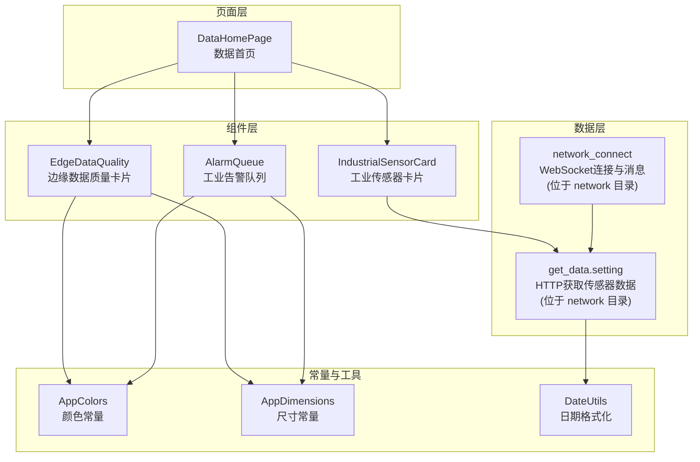

**更新** 文件组织结构已调整，数据获取相关文件现位于 network 目录而非 pages 目录

**图表来源**
- [DataHomePage.ets:1-62](file://entry/src/main/ets/pages/DataHomePage.ets#L1-L62)
- [EdgeDataQuality.ets:1-64](file://entry/src/main/ets/components/sensor/EdgeDataQuality.ets#L1-L64)
- [IndustrialSensorCard.ets:1-109](file://entry/src/main/ets/components/sensor/IndustrialSensorCard.ets#L1-L109)
- [AlarmQueue.ets:1-105](file://entry/src/main/ets/components/log/AlarmQueue.ets#L1-L105)
- [get_data.ets:1-130](file://entry/src/main/ets/network/get_data.ets#L1-L130)
- [network_connect.ets:1-321](file://entry/src/main/ets/network/network_connect.ets#L1-L321)
- [AppColors.ets:1-47](file://entry/src/main/ets/constants/AppColors.ets#L1-L47)
- [AppDimensions.ets:1-40](file://entry/src/main/ets/constants/AppDimensions.ets#L1-L40)
- [DateUtils.ets:1-28](file://entry/src/main/ets/utils/DateUtils.ets#L1-L28)

**章节来源**
- [DataHomePage.ets:1-62](file://entry/src/main/ets/pages/DataHomePage.ets#L1-L62)
- [EdgeDataQuality.ets:1-64](file://entry/src/main/ets/components/sensor/EdgeDataQuality.ets#L1-L64)
- [IndustrialSensorCard.ets:1-109](file://entry/src/main/ets/components/sensor/IndustrialSensorCard.ets#L1-L109)
- [AlarmQueue.ets:1-105](file://entry/src/main/ets/components/log/AlarmQueue.ets#L1-L105)
- [get_data.ets:1-130](file://entry/src/main/ets/network/get_data.ets#L1-L130)
- [network_connect.ets:1-321](file://entry/src/main/ets/network/network_connect.ets#L1-L321)
- [AppColors.ets:1-47](file://entry/src/main/ets/constants/AppColors.ets#L1-L47)
- [AppDimensions.ets:1-40](file://entry/src/main/ets/constants/AppDimensions.ets#L1-L40)
- [DateUtils.ets:1-28](file://entry/src/main/ets/utils/DateUtils.ets#L1-L28)

## 核心组件
- 边缘数据质量卡片：用于展示异常指标数量，作为数据质量监控的入口视图之一
- 工业传感器卡片：展示多路传感器的实时数据，是质量评估的数据源
- 告警队列：展示数值越界与联动事件等告警，体现异常检测结果
- 数据获取：通过 HTTP 获取传感器原始数据；通过 WebSocket 实时交互
- 页面容器：数据首页整合上述组件，形成统一的监控面板

**更新** 数据获取模块现位于 network 目录，包含自动定时器功能和增强的连接管理

**章节来源**
- [EdgeDataQuality.ets:1-64](file://entry/src/main/ets/components/sensor/EdgeDataQuality.ets#L1-L64)
- [IndustrialSensorCard.ets:1-109](file://entry/src/main/ets/components/sensor/IndustrialSensorCard.ets#L1-L109)
- [AlarmQueue.ets:1-105](file://entry/src/main/ets/components/log/AlarmQueue.ets#L1-L105)
- [get_data.ets:1-130](file://entry/src/main/ets/network/get_data.ets#L1-L130)
- [network_connect.ets:1-321](file://entry/src/main/ets/network/network_connect.ets#L1-L321)
- [DataHomePage.ets:1-62](file://entry/src/main/ets/pages/DataHomePage.ets#L1-L62)

## 架构总览
下图展示了从数据采集、处理、异常检测到告警与可视化的整体流程，以及与现有组件的映射关系。

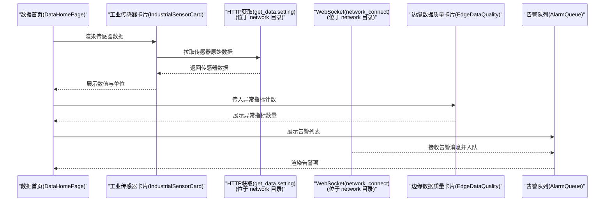

**更新** 数据获取模块已迁移至 network 目录，增强的自动获取机制和连接管理功能

**图表来源**
- [DataHomePage.ets:1-62](file://entry/src/main/ets/pages/DataHomePage.ets#L1-L62)
- [IndustrialSensorCard.ets:1-109](file://entry/src/main/ets/components/sensor/IndustrialSensorCard.ets#L1-L109)
- [get_data.ets:1-130](file://entry/src/main/ets/network/get_data.ets#L1-L130)
- [network_connect.ets:1-321](file://entry/src/main/ets/network/network_connect.ets#L1-L321)
- [EdgeDataQuality.ets:1-64](file://entry/src/main/ets/components/sensor/EdgeDataQuality.ets#L1-L64)
- [AlarmQueue.ets:1-105](file://entry/src/main/ets/components/log/AlarmQueue.ets#L1-L105)

## 详细组件分析

### 边缘数据质量卡片（EdgeDataQuality）
- 功能定位：展示异常指标数量，作为数据质量监控的直观入口
- 数据绑定：abnormalCount 属性驱动 UI 更新
- 视觉风格：深色卡片背景、强调数值与单位文案，配合全局颜色与尺寸常量

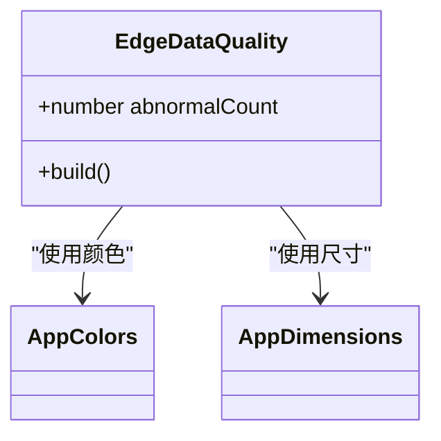

**图表来源**
- [EdgeDataQuality.ets:1-64](file://entry/src/main/ets/components/sensor/EdgeDataQuality.ets#L1-L64)
- [AppColors.ets:1-47](file://entry/src/main/ets/constants/AppColors.ets#L1-L47)
- [AppDimensions.ets:1-40](file://entry/src/main/ets/constants/AppDimensions.ets#L1-L40)

**章节来源**
- [EdgeDataQuality.ets:1-64](file://entry/src/main/ets/components/sensor/EdgeDataQuality.ets#L1-L64)
- [AppColors.ets:1-47](file://entry/src/main/ets/constants/AppColors.ets#L1-L47)
- [AppDimensions.ets:1-40](file://entry/src/main/ets/constants/AppDimensions.ets#L1-L40)

### 工业传感器卡片（IndustrialSensorCard）
- 功能定位：展示多路传感器的名称、数值与单位，为质量评估提供原始数据
- 数据结构：SensorItem 列表，支持空态提示
- 渲染策略：逐行渲染，右侧对齐数值与单位，左侧对齐名称

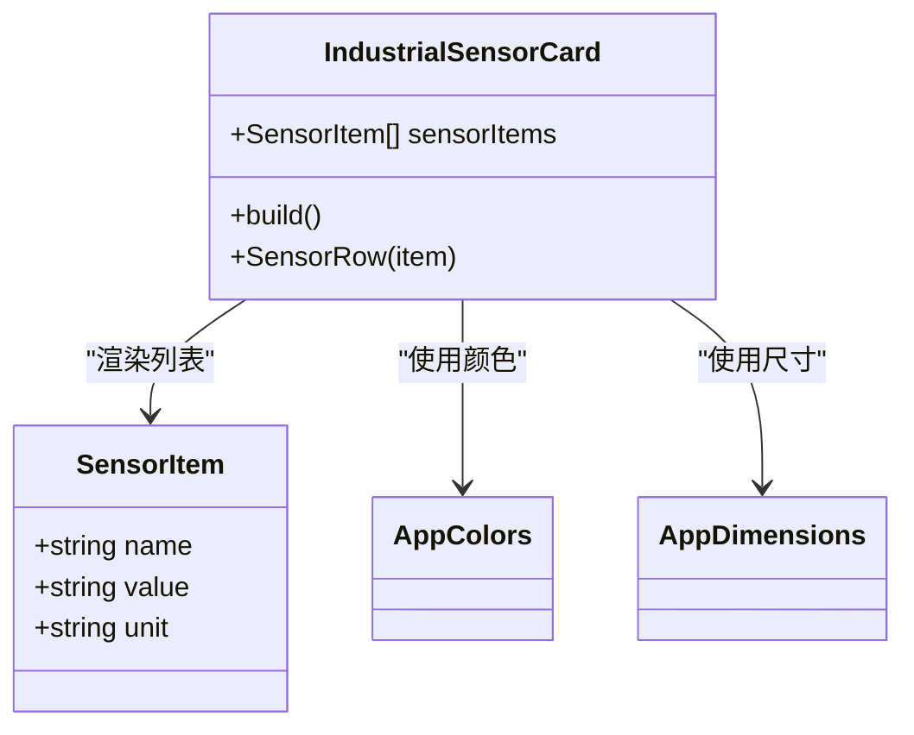

**图表来源**
- [IndustrialSensorCard.ets:1-109](file://entry/src/main/ets/components/sensor/IndustrialSensorCard.ets#L1-L109)
- [AppColors.ets:1-47](file://entry/src/main/ets/constants/AppColors.ets#L1-L47)
- [AppDimensions.ets:1-40](file://entry/src/main/ets/constants/AppDimensions.ets#L1-L40)

**章节来源**
- [IndustrialSensorCard.ets:1-109](file://entry/src/main/ets/components/sensor/IndustrialSensorCard.ets#L1-L109)
- [AppColors.ets:1-47](file://entry/src/main/ets/constants/AppColors.ets#L1-L47)
- [AppDimensions.ets:1-40](file://entry/src/main/ets/constants/AppDimensions.ets#L1-L40)

### 告警队列（AlarmQueue）
- 功能定位：展示数值触发与联动事件的告警列表，支持不同等级（严重、警告、提示）
- 数据结构：AlarmItem 包含 id、message、level；AlarmLevel 枚举定义等级
- 视觉策略：根据等级设置左侧边框颜色，空态显示"暂无告警"

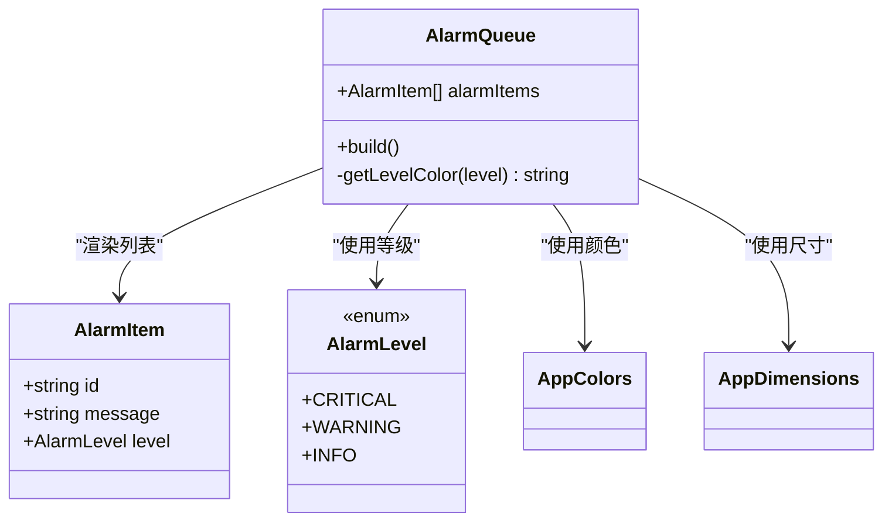

**图表来源**
- [AlarmQueue.ets:1-105](file://entry/src/main/ets/components/log/AlarmQueue.ets#L1-L105)
- [AppColors.ets:1-47](file://entry/src/main/ets/constants/AppColors.ets#L1-L47)
- [AppDimensions.ets:1-40](file://entry/src/main/ets/constants/AppDimensions.ets#L1-L40)

**章节来源**
- [AlarmQueue.ets:1-105](file://entry/src/main/ets/components/log/AlarmQueue.ets#L1-L105)
- [AppColors.ets:1-47](file://entry/src/main/ets/constants/AppColors.ets#L1-L47)
- [AppDimensions.ets:1-40](file://entry/src/main/ets/constants/AppDimensions.ets#L1-L40)

### 数据获取与网络连接
- HTTP 获取：get_data.setting 提供 fetchSensorData 方法，拉取传感器数据并缓存
- **增强功能**：新增自动定时器，每秒自动获取传感器数据，无需手动触发
- WebSocket 连接：network_connect 管理连接生命周期、事件绑定、消息收发与自动重连
- **增强功能**：集成 WiFi 状态监听，网络恢复时自动重连；支持设备信息获取与会话管理
- 交互流程：页面在需要时触发数据拉取，WebSocket 用于实时消息接收与上报

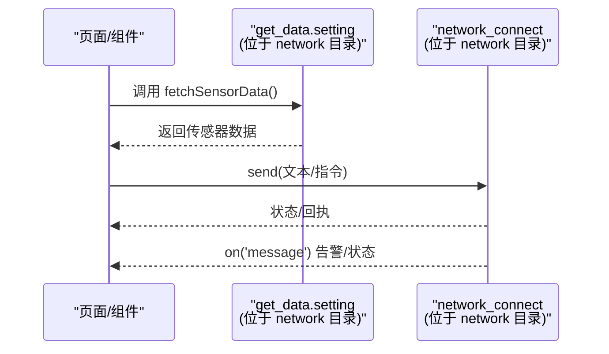

**更新** 数据获取模块已迁移至 network 目录，包含自动定时器和增强的连接管理功能

**图表来源**
- [get_data.ets:1-130](file://entry/src/main/ets/network/get_data.ets#L1-L130)
- [network_connect.ets:1-321](file://entry/src/main/ets/network/network_connect.ets#L1-L321)

**章节来源**
- [get_data.ets:1-130](file://entry/src/main/ets/network/get_data.ets#L1-L130)
- [network_connect.ets:1-321](file://entry/src/main/ets/network/network_connect.ets#L1-L321)

### 自动传感器数据获取机制
**新增功能** get_data.ets 现已包含完整的自动数据获取机制：

- **定时器管理**：类内部维护 timerId，防止重复启动
- **自动获取**：构造函数中调用 startAutoSend()，每秒自动执行 fetchSensorData()
- **生命周期管理**：destroy() 方法清理定时器，防止内存泄漏
- **数据缓存**：get_data 属性缓存最新传感器数据，供其他组件使用

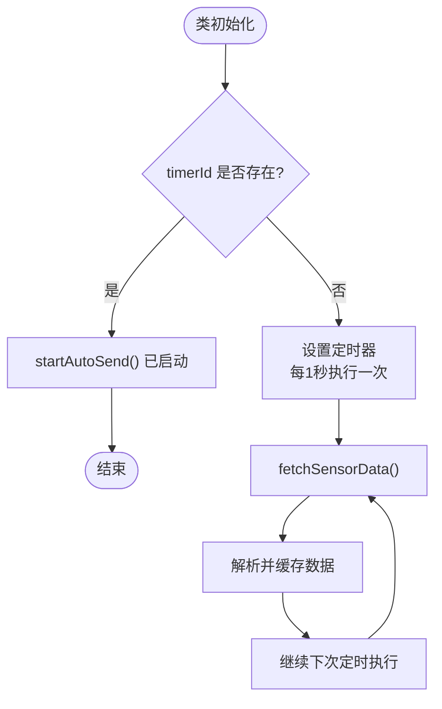

**图表来源**
- [get_data.ets:75-127](file://entry/src/main/ets/network/get_data.ets#L75-L127)

**章节来源**
- [get_data.ets:67-127](file://entry/src/main/ets/network/get_data.ets#L67-L127)

### 增强的 WebSocket 连接管理
**新增功能** network_connect.ets 现已包含完整的连接管理功能：

- **WiFi 状态监听**：自动监听 WiFi 连接状态变化，网络恢复时自动重连
- **连接状态管理**：state 属性跟踪连接状态，true 表示已连接
- **自动重连机制**：isReconnecting 锁防止并发重连，支持最大重连次数限制
- **设备信息管理**：获取设备 MAC 地址和 UUID，用于连接认证
- **会话管理**：自动提取和存储 session_id，支持消息追踪
- **错误处理**：完善的错误捕获和重连逻辑

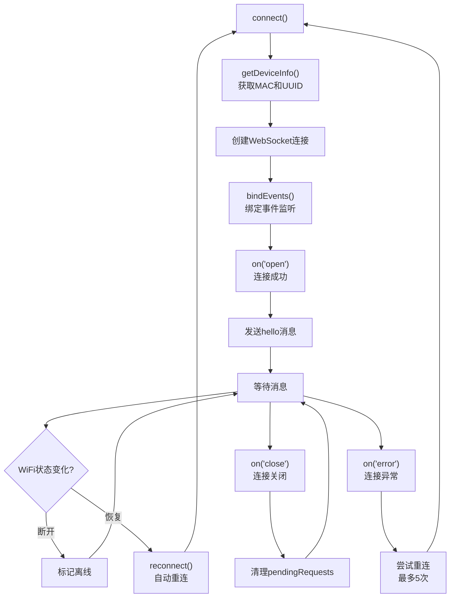

**图表来源**
- [network_connect.ets:67-321](file://entry/src/main/ets/network/network_connect.ets#L67-L321)

**章节来源**
- [network_connect.ets:38-321](file://entry/src/main/ets/network/network_connect.ets#L38-L321)

### 数据质量评估指标体系（扩展设计）
以下为基于现有数据源与组件的评估框架建议，便于在不改变现有结构的前提下扩展实现：

- 准确性
  - 定义：数值与真实值的偏差程度
  - 计算：与历史均值/标准差对比，或与业务阈值对比
  - 可视化：在工业传感器卡片中增加"偏差"列或颜色标记
- 完整性
  - 定义：缺失值比例与字段覆盖率
  - 计算：统计每条记录缺失字段数，计算完整性比率
  - 可视化：在边缘数据质量卡片中新增"缺失项"指标
- 一致性
  - 定义：跨时间/跨设备的一致性
  - 计算：滑动窗口内波动率、跨设备比对
  - 可视化：趋势图或一致性评分
- 时效性
  - 定义：数据更新延迟与超时
  - 计算：updated_at 与当前时间差，超时阈值判定
  - 可视化：在卡片中增加"延迟"状态与颜色

**章节来源**
- [IndustrialSensorCard.ets:1-109](file://entry/src/main/ets/components/sensor/IndustrialSensorCard.ets#L1-L109)
- [get_data.ets:1-130](file://entry/src/main/ets/network/get_data.ets#L1-L130)

### 异常检测算法实现（扩展设计）
- 统计方法
  - 基于均值与标准差的3σ原则
  - 基于分位数的IQR方法
- 机器学习模型
  - 无监督：孤立森林、One-Class SVM
  - 在线学习：滑动窗口内的增量模型
- 阈值判断机制
  - 动态阈值：基于历史滚动统计
  - 多级阈值：轻度/中度/重度异常分级
- 告警生成
  - 将异常事件封装为 AlarmItem，推送到 AlarmQueue

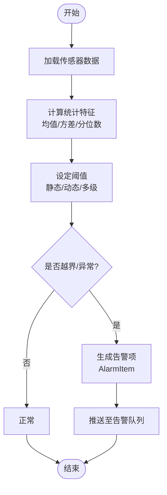

**图表来源**
- [IndustrialSensorCard.ets:1-109](file://entry/src/main/ets/components/sensor/IndustrialSensorCard.ets#L1-L109)
- [AlarmQueue.ets:1-105](file://entry/src/main/ets/components/log/AlarmQueue.ets#L1-L105)

### 数据质量评分算法（扩展设计）
- 权重分配
  - 准确性：30%
  - 完整性：25%
  - 一致性：25%
  - 时效性：20%
- 等级划分
  - 优秀：≥90
  - 良好：80-89
  - 一般：60-79
  - 较差：<60
- 趋势分析
  - 近N周期移动平均
  - 斜率与波动率评估

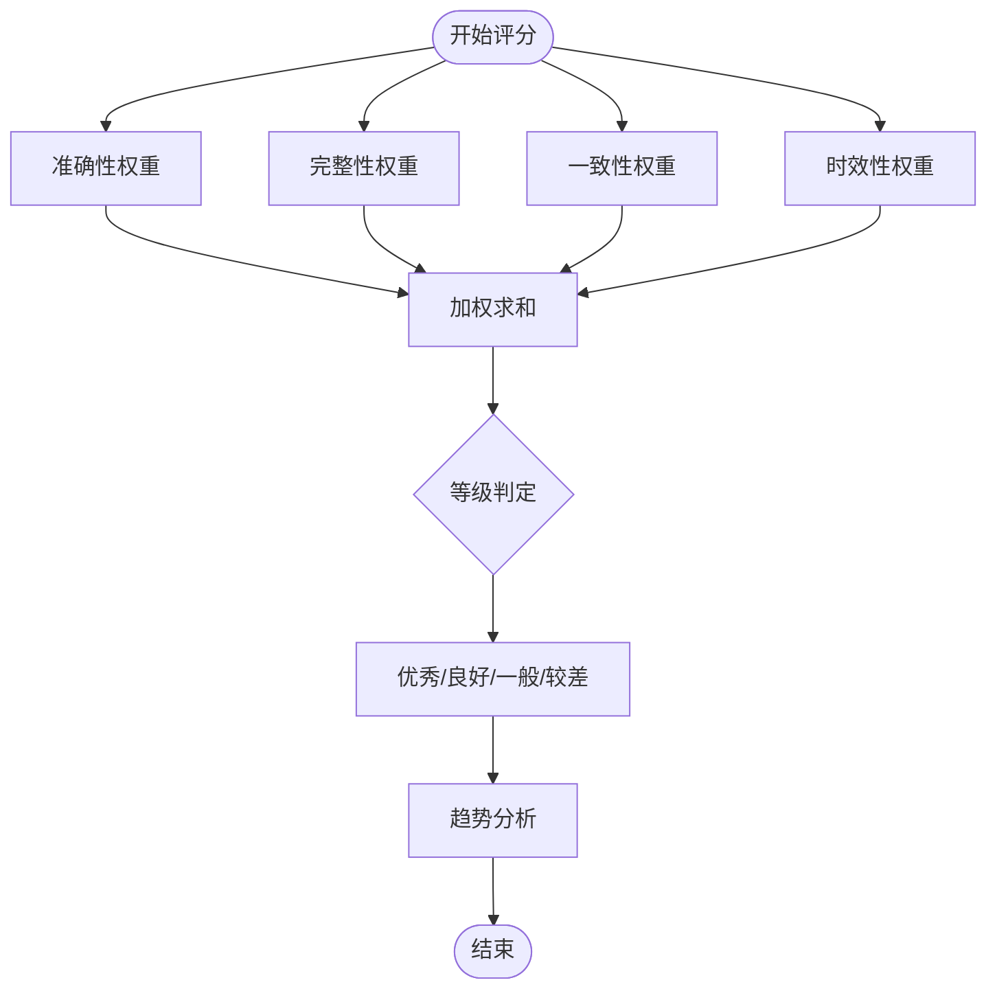

**图表来源**
- [IndustrialSensorCard.ets:1-109](file://entry/src/main/ets/components/sensor/IndustrialSensorCard.ets#L1-L109)
- [EdgeDataQuality.ets:1-64](file://entry/src/main/ets/components/sensor/EdgeDataQuality.ets#L1-L64)

### 告警机制实现方案（扩展设计）
- 告警规则配置
  - 阈值配置：每个指标独立阈值与级别
  - 时间窗：滑动窗口内连续异常触发
- 通知方式
  - UI：AlarmQueue 展示告警列表
  - 语音/震动：结合设备状态指示器与蜂鸣器
- 处理流程
  - 触发 -> 记录 -> 告警 -> 处理 -> 关闭

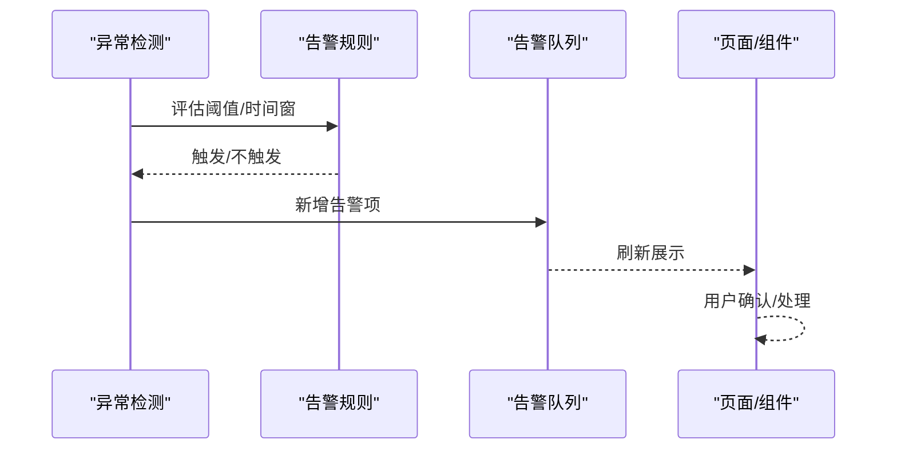

**图表来源**
- [AlarmQueue.ets:1-105](file://entry/src/main/ets/components/log/AlarmQueue.ets#L1-L105)
- [ControlConsole.ets:1-172](file://entry/src/main/ets/components/control/ControlConsole.ets#L1-L172)
- [StatusIndicator.ets:1-44](file://entry/src/main/ets/components/control/StatusIndicator.ets#L1-L44)

### 报告生成与可视化（扩展设计）
- 报告内容
  - 指标汇总：准确性、完整性、一致性、时效性
  - 异常统计：异常次数、分布、趋势
  - 告警清单：时间、等级、描述
- 可视化建议
  - 指标卡片：当前值与趋势线
  - 告警列表：按等级分组
  - 仪表盘：综合评分与等级

**章节来源**
- [EdgeDataQuality.ets:1-64](file://entry/src/main/ets/components/sensor/EdgeDataQuality.ets#L1-L64)
- [AlarmQueue.ets:1-105](file://entry/src/main/ets/components/log/AlarmQueue.ets#L1-L105)

### 自定义质量指标与评估规则的扩展指引
- 新增指标
  - 在 IndustrialSensorCard 中扩展数据列或新增卡片
  - 在 get_data.setting 中补充数据字段解析
- 新增评估规则
  - 在异常检测模块中添加新规则与阈值
  - 在 AlarmQueue 中扩展告警等级与消息模板
- 配置化
  - 使用配置文件管理阈值与权重
  - 通过页面参数控制展示维度

**章节来源**
- [IndustrialSensorCard.ets:1-109](file://entry/src/main/ets/components/sensor/IndustrialSensorCard.ets#L1-L109)
- [get_data.ets:1-130](file://entry/src/main/ets/network/get_data.ets#L1-L130)
- [AlarmQueue.ets:1-105](file://entry/src/main/ets/components/log/AlarmQueue.ets#L1-L105)

## 依赖关系分析
- 组件耦合
  - DataHomePage 依赖 EdgeDataQuality、IndustrialSensorCard、AlarmQueue
  - IndustrialSensorCard 依赖 network 目录下的 get_data.setting
  - AlarmQueue 依赖 AppColors、AppDimensions
- 外部依赖
  - HTTP 与 WebSocket 由系统能力提供
  - 网络状态变化触发重连与离线标记

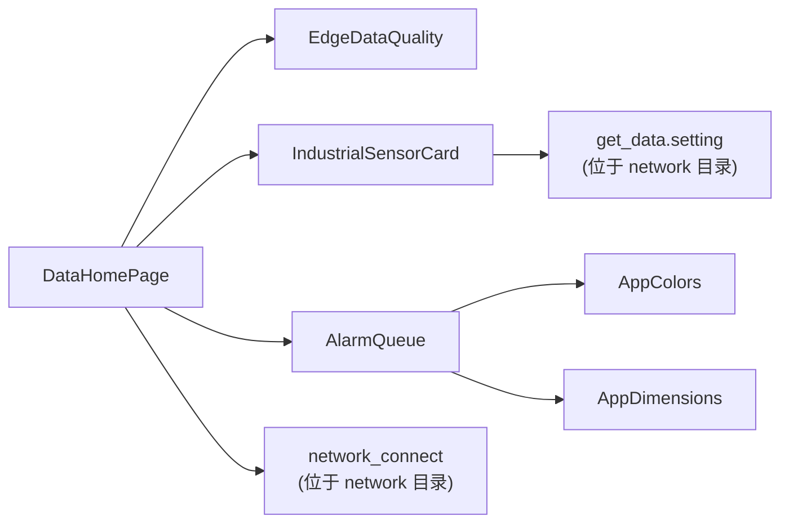

**更新** 数据获取模块已迁移至 network 目录，增强的连接管理功能

**图表来源**
- [DataHomePage.ets:1-62](file://entry/src/main/ets/pages/DataHomePage.ets#L1-L62)
- [EdgeDataQuality.ets:1-64](file://entry/src/main/ets/components/sensor/EdgeDataQuality.ets#L1-L64)
- [IndustrialSensorCard.ets:1-109](file://entry/src/main/ets/components/sensor/IndustrialSensorCard.ets#L1-L109)
- [AlarmQueue.ets:1-105](file://entry/src/main/ets/components/log/AlarmQueue.ets#L1-L105)
- [get_data.ets:1-130](file://entry/src/main/ets/network/get_data.ets#L1-L130)
- [network_connect.ets:1-321](file://entry/src/main/ets/network/network_connect.ets#L1-L321)
- [AppColors.ets:1-47](file://entry/src/main/ets/constants/AppColors.ets#L1-L47)
- [AppDimensions.ets:1-40](file://entry/src/main/ets/constants/AppDimensions.ets#L1-L40)

**章节来源**
- [DataHomePage.ets:1-62](file://entry/src/main/ets/pages/DataHomePage.ets#L1-L62)
- [get_data.ets:1-130](file://entry/src/main/ets/network/get_data.ets#L1-L130)
- [network_connect.ets:1-321](file://entry/src/main/ets/network/network_connect.ets#L1-L321)

## 性能考量
- 数据拉取
  - **自动定时器优化**：每秒自动获取数据，合理设置 HTTP 超时与重试策略，避免阻塞 UI
  - **内存管理**：定时器清理机制防止内存泄漏
- WebSocket
  - **连接状态管理**：使用连接状态标志与自动重连锁，防止并发重连
  - **WiFi 监听优化**：网络恢复时延迟重连，等待网络路由稳定
  - **消息处理优化**：对消息进行节流与去抖，减少频繁刷新
- 渲染优化
  - 列表渲染使用 ForEach 与键值索引，提升复用效率
  - 控制卡片数量与刷新频率，避免过度绘制

**更新** 新增自动定时器和 WiFi 监听优化功能

## 故障排查指南
- 网络问题
  - **WiFi 状态监听**：检查 WiFi 状态监听与重连逻辑
  - **WebSocket 连接**：观察 WebSocket on('error') 与 on('close') 日志
  - **自动重连**：确认 isReconnecting 锁和重连次数限制
- 数据异常
  - **HTTP 请求**：核对 HTTP 返回状态码与解析结果
  - **传感器数据**：检查传感器数据结构与字段映射
  - **定时器**：确认定时器是否正常启动和清理
- 告警不显示
  - 确认告警等级与颜色映射
  - 检查 AlarmQueue 列表为空时的占位文案

**更新** 新增 WiFi 监听、自动重连、定时器相关的故障排查要点

**章节来源**
- [network_connect.ets:1-321](file://entry/src/main/ets/network/network_connect.ets#L1-L321)
- [get_data.ets:1-130](file://entry/src/main/ets/network/get_data.ets#L1-L130)
- [AlarmQueue.ets:1-105](file://entry/src/main/ets/components/log/AlarmQueue.ets#L1-L105)

## 结论
当前仓库已具备数据质量监控的基础能力：传感器数据展示、异常指标统计入口与告警列表。**文件组织结构已优化**，数据获取相关模块现位于 network 目录，包含增强的自动获取机制和连接管理功能。在此基础上，可通过扩展异常检测算法、评分与告警机制、报告与可视化，构建完整的数据质量监控体系。建议优先实现统计阈值与动态阈值，逐步引入机器学习模型，并将配置化与可视化作为后续迭代重点。

## 附录
- 日期格式化工具：提供统一的时间格式化能力，可用于日志与报告时间戳
- 控制状态模型：为设备联动与告警处理提供状态支撑

**章节来源**
- [DateUtils.ets:1-28](file://entry/src/main/ets/utils/DateUtils.ets#L1-L28)
- [ControlState.ets:1-67](file://entry/src/main/ets/models/ControlState.ets#L1-L67)