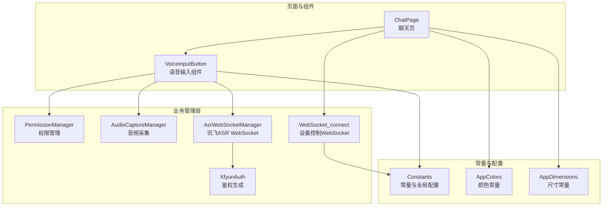
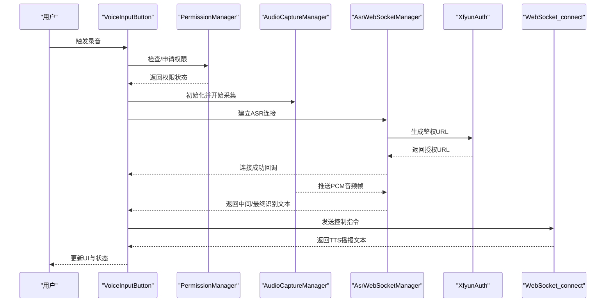
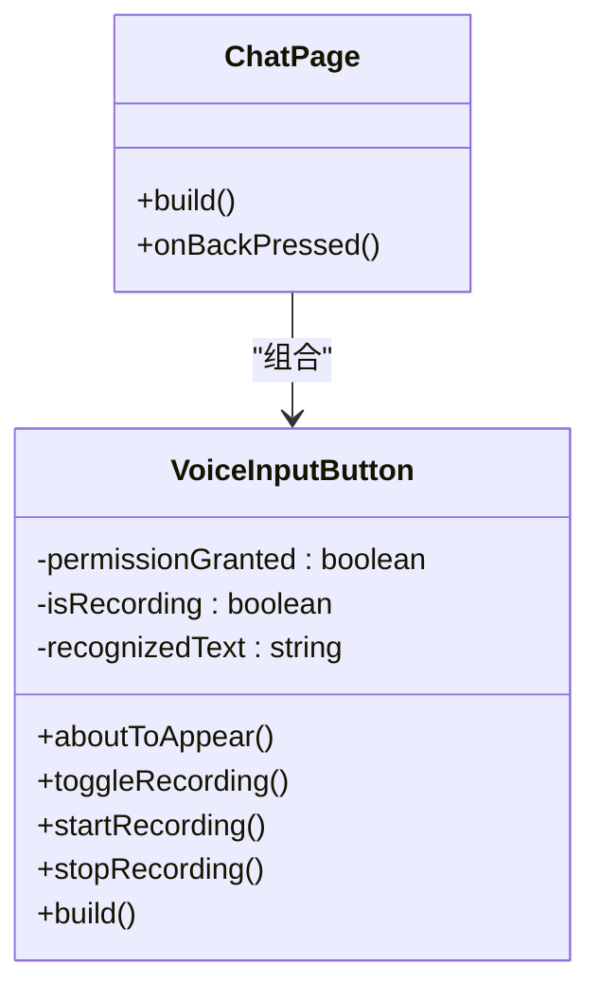
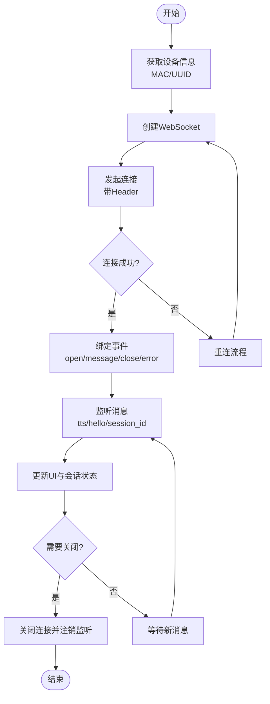
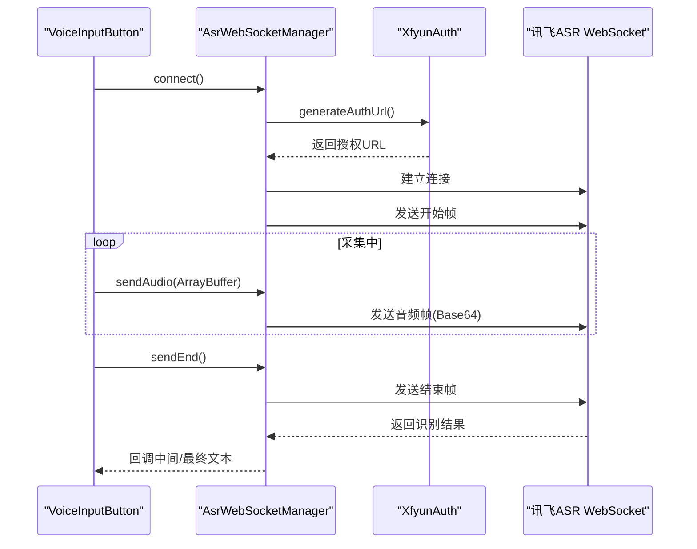
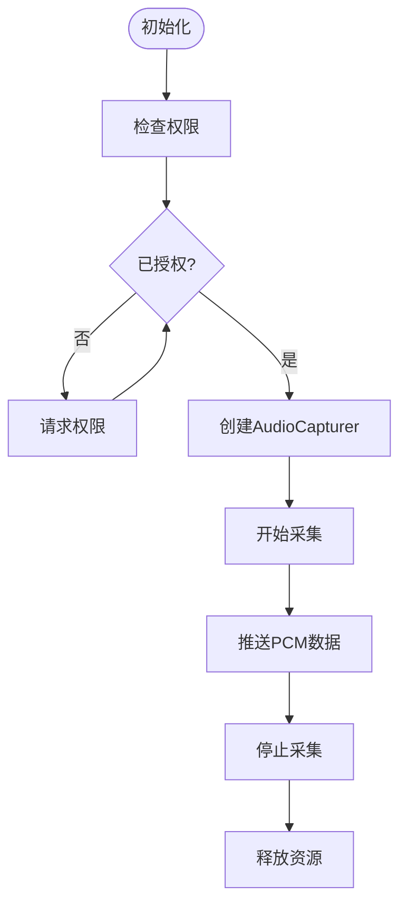
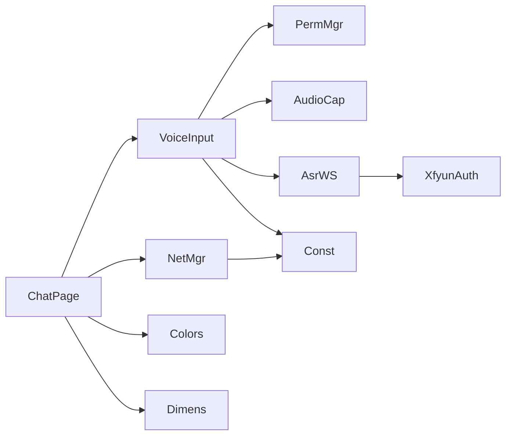

# 技术栈选型

<cite>
**本文引用的文件**
- [entry/src/main/ets/managers/AsrWebSocketManager.ets](file://entry/src/main/ets/managers/AsrWebSocketManager.ets)
- [entry/src/main/ets/managers/AudioCaptureManager.ets](file://entry/src/main/ets/managers/AudioCaptureManager.ets)
- [entry/src/main/ets/managers/XfyunAuth.ets](file://entry/src/main/ets/managers/XfyunAuth.ets)
- [entry/src/main/ets/managers/PermissionManager.ets](file://entry/src/main/ets/managers/PermissionManager.ets)
- [entry/src/main/ets/common/Constants.ets](file://entry/src/main/ets/common/Constants.ets)
- [entry/src/main/ets/pages/ChatPage.ets](file://entry/src/main/ets/pages/ChatPage.ets)
- [entry/src/main/ets/components/chat/VoiceInputButton.ets](file://entry/src/main/ets/components/chat/VoiceInputButton.ets)
- [entry/src/main/ets/pages/network_connect.ets](file://entry/src/main/ets/pages/network_connect.ets)
- [entry/build-profile.json5](file://entry/build-profile.json5)
- [oh-package.json5](file://oh-package.json5)
- [entry/src/main/ets/models/ChatMessage.ets](file://entry/src/main/ets/models/ChatMessage.ets)
- [entry/src/main/ets/utils/DateUtils.ets](file://entry/src/main/ets/utils/DateUtils.ets)
- [entry/src/main/ets/constants/AppColors.ets](file://entry/src/main/ets/constants/AppColors.ets)
- [entry/src/main/ets/constants/AppDimensions.ets](file://entry/src/main/ets/constants/AppDimensions.ets)
</cite>

## 目录
1. [简介](#简介)
2. [项目结构](#项目结构)
3. [核心组件](#核心组件)
4. [架构总览](#架构总览)
5. [详细组件分析](#详细组件分析)
6. [依赖分析](#依赖分析)
7. [性能考虑](#性能考虑)
8. [故障排查指南](#故障排查指南)
9. [结论](#结论)
10. [附录](#附录)

## 简介
本技术栈选型文档面向 SmartController 项目，系统梳理并解释项目采用的核心技术与框架选择，包括 OpenHarmony ArkUI 框架、ArkTS 语言特性、WebSocket 通信协议、讯飞语音识别服务等。文档从技术选型原因与优势出发，阐述 UI 框架、网络通信、语音处理、权限管理等模块的职责与相互关系，并给出技术兼容性说明、版本要求、架构优势与潜在限制，以及未来演进与迁移成本的讨论。

## 项目结构
项目采用基于能力（Ability）的模块化组织方式，前端 UI 使用 ArkUI + ArkTS，业务层通过 Managers 封装能力（如音频采集、ASR WebSocket、权限管理），页面与组件通过响应式状态与回调进行交互；网络层通过独立的 WebSocket 连接管理器统一处理设备控制与语音识别的双向通信。

图表来源
- [entry/src/main/ets/pages/ChatPage.ets:1-83](file://entry/src/main/ets/pages/ChatPage.ets#L1-L83)
- [entry/src/main/ets/components/chat/VoiceInputButton.ets:1-125](file://entry/src/main/ets/components/chat/VoiceInputButton.ets#L1-L125)
- [entry/src/main/ets/managers/PermissionManager.ets:1-28](file://entry/src/main/ets/managers/PermissionManager.ets#L1-L28)
- [entry/src/main/ets/managers/AudioCaptureManager.ets:1-80](file://entry/src/main/ets/managers/AudioCaptureManager.ets#L1-L80)
- [entry/src/main/ets/managers/AsrWebSocketManager.ets:1-271](file://entry/src/main/ets/managers/AsrWebSocketManager.ets#L1-L271)
- [entry/src/main/ets/managers/XfyunAuth.ets:1-34](file://entry/src/main/ets/managers/XfyunAuth.ets#L1-L34)
- [entry/src/main/ets/pages/network_connect.ets:1-321](file://entry/src/main/ets/pages/network_connect.ets#L1-L321)
- [entry/src/main/ets/common/Constants.ets:1-82](file://entry/src/main/ets/common/Constants.ets#L1-L82)
- [entry/src/main/ets/constants/AppColors.ets:1-47](file://entry/src/main/ets/constants/AppColors.ets#L1-L47)
- [entry/src/main/ets/constants/AppDimensions.ets:1-40](file://entry/src/main/ets/constants/AppDimensions.ets#L1-L40)

章节来源
- [entry/src/main/ets/pages/ChatPage.ets:1-83](file://entry/src/main/ets/pages/ChatPage.ets#L1-L83)
- [entry/src/main/ets/components/chat/VoiceInputButton.ets:1-125](file://entry/src/main/ets/components/chat/VoiceInputButton.ets#L1-L125)
- [entry/src/main/ets/pages/network_connect.ets:1-321](file://entry/src/main/ets/pages/network_connect.ets#L1-L321)
- [entry/src/main/ets/managers/AsrWebSocketManager.ets:1-271](file://entry/src/main/ets/managers/AsrWebSocketManager.ets#L1-L271)
- [entry/src/main/ets/managers/AudioCaptureManager.ets:1-80](file://entry/src/main/ets/managers/AudioCaptureManager.ets#L1-L80)
- [entry/src/main/ets/managers/XfyunAuth.ets:1-34](file://entry/src/main/ets/managers/XfyunAuth.ets#L1-L34)
- [entry/src/main/ets/managers/PermissionManager.ets:1-28](file://entry/src/main/ets/managers/PermissionManager.ets#L1-L28)
- [entry/src/main/ets/common/Constants.ets:1-82](file://entry/src/main/ets/common/Constants.ets#L1-L82)
- [entry/src/main/ets/constants/AppColors.ets:1-47](file://entry/src/main/ets/constants/AppColors.ets#L1-L47)
- [entry/src/main/ets/constants/AppDimensions.ets:1-40](file://entry/src/main/ets/constants/AppDimensions.ets#L1-L40)

## 核心组件
- ArkUI + ArkTS：负责页面布局、组件化开发、响应式状态与事件处理，提供跨设备一致的 UI 体验。
- WebSocket 通信：分别用于设备控制（本地/内网）与语音识别（云端），统一由连接管理器封装生命周期与重连策略。
- 讯飞语音识别：通过鉴权生成与 WebSocket 流式传输音频，实现端到端语音转写。
- 音频采集：基于多媒体音频能力，提供麦克风 PCM 数据采集与回调。
- 权限管理：对麦克风与网络权限进行检查与申请，保障功能可用性。
- 常量与样式：集中管理采样率、鉴权参数、颜色与尺寸等，提升可维护性与一致性。

章节来源
- [entry/src/main/ets/pages/ChatPage.ets:1-83](file://entry/src/main/ets/pages/ChatPage.ets#L1-L83)
- [entry/src/main/ets/components/chat/VoiceInputButton.ets:1-125](file://entry/src/main/ets/components/chat/VoiceInputButton.ets#L1-L125)
- [entry/src/main/ets/pages/network_connect.ets:1-321](file://entry/src/main/ets/pages/network_connect.ets#L1-L321)
- [entry/src/main/ets/managers/AsrWebSocketManager.ets:1-271](file://entry/src/main/ets/managers/AsrWebSocketManager.ets#L1-L271)
- [entry/src/main/ets/managers/AudioCaptureManager.ets:1-80](file://entry/src/main/ets/managers/AudioCaptureManager.ets#L1-L80)
- [entry/src/main/ets/managers/XfyunAuth.ets:1-34](file://entry/src/main/ets/managers/XfyunAuth.ets#L1-L34)
- [entry/src/main/ets/managers/PermissionManager.ets:1-28](file://entry/src/main/ets/managers/PermissionManager.ets#L1-L28)
- [entry/src/main/ets/common/Constants.ets:1-82](file://entry/src/main/ets/common/Constants.ets#L1-L82)
- [entry/src/main/ets/constants/AppColors.ets:1-47](file://entry/src/main/ets/constants/AppColors.ets#L1-L47)
- [entry/src/main/ets/constants/AppDimensions.ets:1-40](file://entry/src/main/ets/constants/AppDimensions.ets#L1-L40)

## 架构总览
整体架构围绕“语音输入 → 云端 ASR → 设备控制 WebSocket → UI 展示”的主链路展开，同时具备权限校验、音频采集、网络状态感知与自动重连等支撑能力。

图表来源
- [entry/src/main/ets/components/chat/VoiceInputButton.ets:1-125](file://entry/src/main/ets/components/chat/VoiceInputButton.ets#L1-L125)
- [entry/src/main/ets/managers/PermissionManager.ets:1-28](file://entry/src/main/ets/managers/PermissionManager.ets#L1-L28)
- [entry/src/main/ets/managers/AudioCaptureManager.ets:1-80](file://entry/src/main/ets/managers/AudioCaptureManager.ets#L1-L80)
- [entry/src/main/ets/managers/AsrWebSocketManager.ets:1-271](file://entry/src/main/ets/managers/AsrWebSocketManager.ets#L1-L271)
- [entry/src/main/ets/managers/XfyunAuth.ets:1-34](file://entry/src/main/ets/managers/XfyunAuth.ets#L1-L34)
- [entry/src/main/ets/pages/network_connect.ets:1-321](file://entry/src/main/ets/pages/network_connect.ets#L1-L321)

## 详细组件分析

### ArkUI + ArkTS 页面与组件
- ChatPage：承载聊天消息列表与底部语音输入区域，负责返回键拦截与退出确认逻辑。
- VoiceInputButton：封装录音流程，包含权限检查、音频采集、ASR 连接、结果回显与设备指令下发。
- 组件化设计：通过 @Component/@ComponentV2、@Prop、@Builder 等 ArkTS 特性实现响应式与可复用组件。

图表来源
- [entry/src/main/ets/pages/ChatPage.ets:1-83](file://entry/src/main/ets/pages/ChatPage.ets#L1-L83)
- [entry/src/main/ets/components/chat/VoiceInputButton.ets:1-125](file://entry/src/main/ets/components/chat/VoiceInputButton.ets#L1-L125)

章节来源
- [entry/src/main/ets/pages/ChatPage.ets:1-83](file://entry/src/main/ets/pages/ChatPage.ets#L1-L83)
- [entry/src/main/ets/components/chat/VoiceInputButton.ets:1-125](file://entry/src/main/ets/components/chat/VoiceInputButton.ets#L1-L125)

### WebSocket 通信（设备控制）
- WebSocket_connect：负责与设备控制服务建立连接，携带设备标识与客户端标识，处理消息订阅、会话 ID 维护、异常断开与自动重连。
- 网络状态感知：通过 WiFi 状态监听在断网恢复后延迟重连，避免频繁抖动。
- 请求去重与超时：通过 requestId 与 pendingRequests Map 管理请求生命周期。

图表来源
- [entry/src/main/ets/pages/network_connect.ets:1-321](file://entry/src/main/ets/pages/network_connect.ets#L1-L321)

章节来源
- [entry/src/main/ets/pages/network_connect.ets:1-321](file://entry/src/main/ets/pages/network_connect.ets#L1-L321)

### 讯飞语音识别（ASR）
- XfyunAuth：生成符合讯飞规范的 Authorization 与 Base64 编码 URL，确保 WebSocket 握手通过。
- AsrWebSocketManager：严格遵循讯飞协议的数据结构与帧序列，负责连接、发送开始帧、音频帧、结束帧与解析识别结果，支持乱序缓存与动态修正。
- 与音频采集联动：在连接成功后将 PCM 数据以 Base64 形式推送至云端。

图表来源
- [entry/src/main/ets/managers/AsrWebSocketManager.ets:1-271](file://entry/src/main/ets/managers/AsrWebSocketManager.ets#L1-L271)
- [entry/src/main/ets/managers/XfyunAuth.ets:1-34](file://entry/src/main/ets/managers/XfyunAuth.ets#L1-L34)

章节来源
- [entry/src/main/ets/managers/AsrWebSocketManager.ets:1-271](file://entry/src/main/ets/managers/AsrWebSocketManager.ets#L1-L271)
- [entry/src/main/ets/managers/XfyunAuth.ets:1-34](file://entry/src/main/ets/managers/XfyunAuth.ets#L1-L34)

### 音频采集与权限管理
- AudioCaptureManager：配置采样率、通道、编码格式，启动/停止/释放音频捕获，向回调推送原始 PCM 数据。
- PermissionManager：检查并申请麦克风与网络权限，保证录音与网络通信前置条件满足。

图表来源
- [entry/src/main/ets/managers/AudioCaptureManager.ets:1-80](file://entry/src/main/ets/managers/AudioCaptureManager.ets#L1-L80)
- [entry/src/main/ets/managers/PermissionManager.ets:1-28](file://entry/src/main/ets/managers/PermissionManager.ets#L1-L28)

章节来源
- [entry/src/main/ets/managers/AudioCaptureManager.ets:1-80](file://entry/src/main/ets/managers/AudioCaptureManager.ets#L1-L80)
- [entry/src/main/ets/managers/PermissionManager.ets:1-28](file://entry/src/main/ets/managers/PermissionManager.ets#L1-L28)

### 样式与常量
- AppColors/AppDimensions：统一颜色与尺寸规范，便于主题切换与跨页面一致性。
- Constants：集中存放采样率、鉴权参数、服务地址等全局常量，降低耦合。

章节来源
- [entry/src/main/ets/constants/AppColors.ets:1-47](file://entry/src/main/ets/constants/AppColors.ets#L1-L47)
- [entry/src/main/ets/constants/AppDimensions.ets:1-40](file://entry/src/main/ets/constants/AppDimensions.ets#L1-L40)
- [entry/src/main/ets/common/Constants.ets:1-82](file://entry/src/main/ets/common/Constants.ets#L1-L82)

## 依赖分析
- 组件内聚与解耦：各 Manager 各司其职，页面仅负责编排与状态展示，降低耦合度。
- 外部依赖：OpenHarmony 原生模块（网络、音频、权限、WiFi 管理等），以及 ArkTS 生态（ArkUI、NetworkKit、util 等）。
- 依赖方向：页面 → 组件 → Manager；Manager → OpenHarmony SDK；组件与页面 → 常量与样式。

图表来源
- [entry/src/main/ets/pages/ChatPage.ets:1-83](file://entry/src/main/ets/pages/ChatPage.ets#L1-L83)
- [entry/src/main/ets/components/chat/VoiceInputButton.ets:1-125](file://entry/src/main/ets/components/chat/VoiceInputButton.ets#L1-L125)
- [entry/src/main/ets/pages/network_connect.ets:1-321](file://entry/src/main/ets/pages/network_connect.ets#L1-L321)
- [entry/src/main/ets/managers/AsrWebSocketManager.ets:1-271](file://entry/src/main/ets/managers/AsrWebSocketManager.ets#L1-L271)
- [entry/src/main/ets/managers/XfyunAuth.ets:1-34](file://entry/src/main/ets/managers/XfyunAuth.ets#L1-L34)
- [entry/src/main/ets/managers/AudioCaptureManager.ets:1-80](file://entry/src/main/ets/managers/AudioCaptureManager.ets#L1-L80)
- [entry/src/main/ets/managers/PermissionManager.ets:1-28](file://entry/src/main/ets/managers/PermissionManager.ets#L1-L28)
- [entry/src/main/ets/common/Constants.ets:1-82](file://entry/src/main/ets/common/Constants.ets#L1-L82)
- [entry/src/main/ets/constants/AppColors.ets:1-47](file://entry/src/main/ets/constants/AppColors.ets#L1-L47)
- [entry/src/main/ets/constants/AppDimensions.ets:1-40](file://entry/src/main/ets/constants/AppDimensions.ets#L1-L40)

## 性能考虑
- 音频流控：采用固定采样率与帧长，减少转码与缓冲开销；在 UI 层仅展示最终文本，降低渲染压力。
- 连接稳定性：设备控制 WebSocket 与 ASR 连接均具备重连与异常处理，结合 WiFi 状态监听，提升弱网场景下的可用性。
- 资源释放：组件销毁时主动释放音频捕获与 WebSocket，避免资源泄漏。
- 构建优化：构建配置中保留 ArkTS 混淆开关以便后续启用，兼顾体积与安全性。

章节来源
- [entry/src/main/ets/pages/network_connect.ets:1-321](file://entry/src/main/ets/pages/network_connect.ets#L1-L321)
- [entry/src/main/ets/managers/AsrWebSocketManager.ets:1-271](file://entry/src/main/ets/managers/AsrWebSocketManager.ets#L1-L271)
- [entry/src/main/ets/managers/AudioCaptureManager.ets:1-80](file://entry/src/main/ets/managers/AudioCaptureManager.ets#L1-L80)
- [entry/build-profile.json5:1-33](file://entry/build-profile.json5#L1-L33)

## 故障排查指南
- 权限问题：若录音不可用，优先检查麦克风与网络权限是否授予，必要时重新申请。
- 音频无输出：确认 AudioCapturer 初始化成功、回调被注册且未提前停止。
- ASR 连接失败：核对鉴权参数与时间戳，检查网络可达性与 WebSocket 打开回调。
- 设备控制断连：关注 WiFi 状态变化与自动重连日志，确认 Header 参数与会话状态。
- UI 无响应：检查组件生命周期钩子（如 aboutToAppear/Disappear）与状态更新路径。

章节来源
- [entry/src/main/ets/managers/PermissionManager.ets:1-28](file://entry/src/main/ets/managers/PermissionManager.ets#L1-L28)
- [entry/src/main/ets/managers/AudioCaptureManager.ets:1-80](file://entry/src/main/ets/managers/AudioCaptureManager.ets#L1-L80)
- [entry/src/main/ets/managers/XfyunAuth.ets:1-34](file://entry/src/main/ets/managers/XfyunAuth.ets#L1-L34)
- [entry/src/main/ets/pages/network_connect.ets:1-321](file://entry/src/main/ets/pages/network_connect.ets#L1-L321)

## 结论
该技术栈以 ArkUI + ArkTS 为核心，结合 OpenHarmony 原生能力与讯飞云服务，实现了从语音输入到设备控制的完整闭环。选型的优势在于：UI 开发效率高、原生生态完善、语音识别质量稳定、权限与网络管理清晰。潜在限制主要来自第三方服务依赖与平台 API 的演进风险。建议持续关注 OpenHarmony 版本升级与 ArkTS 生态发展，适时评估迁移成本与收益。

## 附录

### 技术兼容性与版本要求
- OpenHarmony 版本：需满足 ArkTS 与相关系统模块（网络、音频、权限、WiFi）的最低版本要求（具体以工程实际目标平台为准）。
- ArkTS 与 ArkUI：采用最新稳定版以获得最佳兼容性与性能。
- SDK 与 API：确保使用的 @ohos.* 与 @kit.* 模块在目标平台上可用，注意 API 的废弃与变更。
- 构建工具：hvigor 与构建配置需与当前 IDE/CLI 版本匹配。

章节来源
- [entry/build-profile.json5:1-33](file://entry/build-profile.json5#L1-L33)
- [oh-package.json5:1-10](file://oh-package.json5#L1-L10)

### 代码级数据模型与消息格式
- 设备控制消息结构：包含类型、版本、传输方式、音频参数、会话 ID、文本等字段，用于握手与命令下发。
- 聊天消息模型：包含消息 ID、类型（用户/系统）、内容与时间戳，用于 UI 列表展示。

章节来源
- [entry/src/main/ets/pages/network_connect.ets:9-36](file://entry/src/main/ets/pages/network_connect.ets#L9-L36)
- [entry/src/main/ets/models/ChatMessage.ets:1-9](file://entry/src/main/ets/models/ChatMessage.ets#L1-L9)