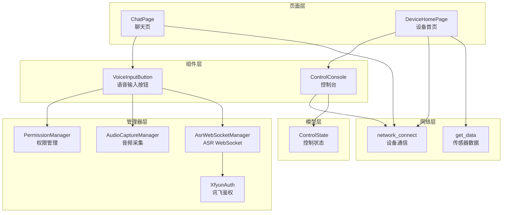
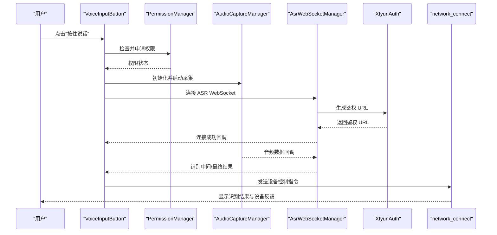
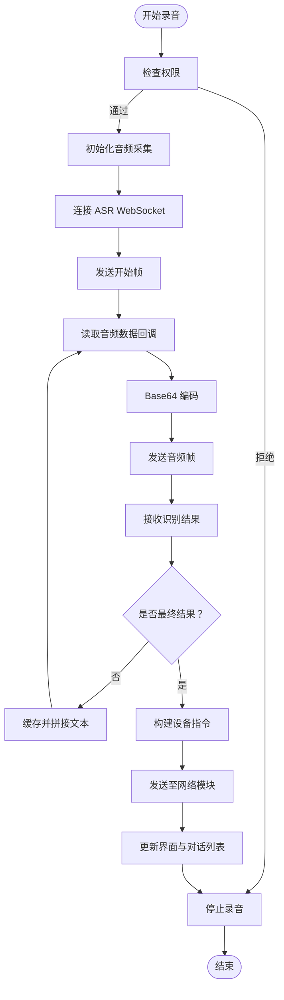
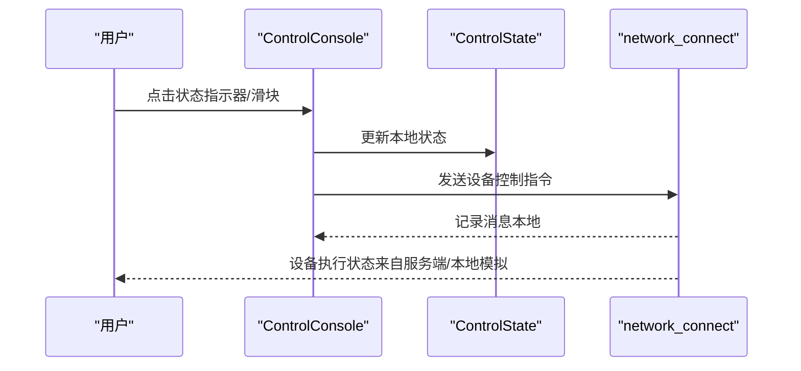
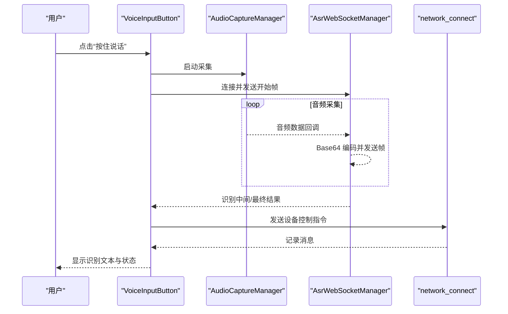
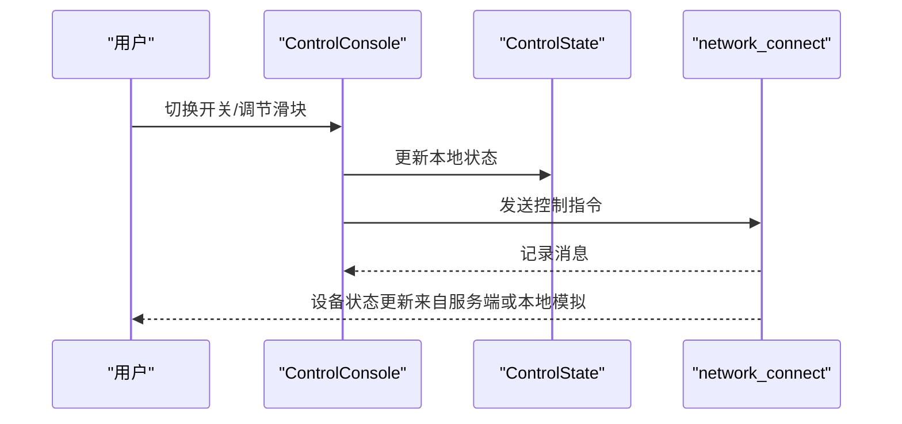
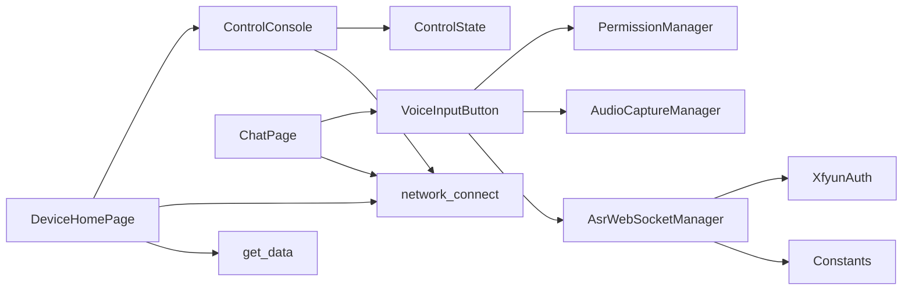

# 数据流设计

<cite>
**本文引用的文件**
- [AsrWebSocketManager.ets](file://entry/src/main/ets/managers/AsrWebSocketManager.ets)
- [AudioCaptureManager.ets](file://entry/src/main/ets/managers/AudioCaptureManager.ets)
- [XfyunAuth.ets](file://entry/src/main/ets/managers/XfyunAuth.ets)
- [Constants.ets](file://entry/src/main/ets/common/Constants.ets)
- [PermissionManager.ets](file://entry/src/main/ets/managers/PermissionManager.ets)
- [VoiceInputButton.ets](file://entry/src/main/ets/components/chat/VoiceInputButton.ets)
- [network_connect.ets](file://entry/src/main/ets/pages/network_connect.ets)
- [ControlConsole.ets](file://entry/src/main/ets/components/control/ControlConsole.ets)
- [ControlState.ets](file://entry/src/main/ets/models/ControlState.ets)
- [ChatPage.ets](file://entry/src/main/ets/pages/ChatPage.ets)
- [DeviceHomePage.ets](file://entry/src/main/ets/pages/DeviceHomePage.ets)
- [get_data.ets](file://entry/src/main/ets/pages/get_data.ets)
</cite>

## 目录
1. [简介](#简介)
2. [项目结构](#项目结构)
3. [核心组件](#核心组件)
4. [架构总览](#架构总览)
5. [详细组件分析](#详细组件分析)
6. [依赖关系分析](#依赖关系分析)
7. [性能考量](#性能考量)
8. [故障排查指南](#故障排查指南)
9. [结论](#结论)
10. [附录](#附录)

## 简介
本文件面向 SmartController 的数据流设计，系统性梳理从用户输入到设备响应的完整数据流转路径，重点覆盖以下方面：
- 语音输入数据流：麦克风采集 → 音频处理 → WebSocket 传输 → 语音识别 → 控制指令生成
- 设备控制数据流：用户操作 → 状态变更 → 命令构建 → WebSocket 发送 → 设备执行 → 状态反馈
- 数据状态管理机制：全局状态、局部状态、临时状态的定义与管理
- 数据缓存策略与持久化方案
- 关键业务场景下的数据流图与时序图
- 错误处理与异常恢复机制

## 项目结构
SmartController 采用基于 ETS 的 ArkTS 框架，页面与组件分层清晰，数据流通过页面、组件与管理器协同实现：
- 页面层：负责视图渲染与用户交互入口（如聊天页、设备首页）
- 组件层：封装可复用 UI 与交互（如语音输入按钮、控制台）
- 管理器层：封装具体能力（音频采集、ASR WebSocket、鉴权、权限）
- 模型层：定义状态与数据结构（如控制状态、聊天消息）

图表来源
- [ChatPage.ets](file://entry/src/main/ets/pages/ChatPage.ets)
- [DeviceHomePage.ets](file://entry/src/main/ets/pages/DeviceHomePage.ets)
- [VoiceInputButton.ets](file://entry/src/main/ets/components/chat/VoiceInputButton.ets)
- [ControlConsole.ets](file://entry/src/main/ets/components/control/ControlConsole.ets)
- [PermissionManager.ets](file://entry/src/main/ets/managers/PermissionManager.ets)
- [AudioCaptureManager.ets](file://entry/src/main/ets/managers/AudioCaptureManager.ets)
- [AsrWebSocketManager.ets](file://entry/src/main/ets/managers/AsrWebSocketManager.ets)
- [XfyunAuth.ets](file://entry/src/main/ets/managers/XfyunAuth.ets)
- [ControlState.ets](file://entry/src/main/ets/models/ControlState.ets)
- [network_connect.ets](file://entry/src/main/ets/pages/network_connect.ets)
- [get_data.ets](file://entry/src/main/ets/pages/get_data.ets)

章节来源
- [ChatPage.ets](file://entry/src/main/ets/pages/ChatPage.ets)
- [DeviceHomePage.ets](file://entry/src/main/ets/pages/DeviceHomePage.ets)
- [VoiceInputButton.ets](file://entry/src/main/ets/components/chat/VoiceInputButton.ets)
- [ControlConsole.ets](file://entry/src/main/ets/components/control/ControlConsole.ets)
- [PermissionManager.ets](file://entry/src/main/ets/managers/PermissionManager.ets)
- [AudioCaptureManager.ets](file://entry/src/main/ets/managers/AudioCaptureManager.ets)
- [AsrWebSocketManager.ets](file://entry/src/main/ets/managers/AsrWebSocketManager.ets)
- [XfyunAuth.ets](file://entry/src/main/ets/managers/XfyunAuth.ets)
- [ControlState.ets](file://entry/src/main/ets/models/ControlState.ets)
- [network_connect.ets](file://entry/src/main/ets/pages/network_connect.ets)
- [get_data.ets](file://entry/src/main/ets/pages/get_data.ets)

## 核心组件
- 语音输入组件：负责权限检查、音频采集、ASR WebSocket 连接与识别结果处理，并在最终识别结果出现时向设备发送控制指令。
- 设备控制组件：集中管理设备控制状态，将用户操作转换为设备命令并通过 WebSocket 发送。
- 网络通信模块：统一维护 WebSocket 连接、消息收发、会话管理与重连策略。
- 音频与识别管理：封装麦克风采集、音频帧构造、Base64 编码与 ASR WebSocket 协议对接。
- 权限与常量：统一管理所需权限与平台常量。

章节来源
- [VoiceInputButton.ets](file://entry/src/main/ets/components/chat/VoiceInputButton.ets)
- [ControlConsole.ets](file://entry/src/main/ets/components/control/ControlConsole.ets)
- [network_connect.ets](file://entry/src/main/ets/pages/network_connect.ets)
- [AudioCaptureManager.ets](file://entry/src/main/ets/managers/AudioCaptureManager.ets)
- [AsrWebSocketManager.ets](file://entry/src/main/ets/managers/AsrWebSocketManager.ets)
- [PermissionManager.ets](file://entry/src/main/ets/managers/PermissionManager.ets)
- [Constants.ets](file://entry/src/main/ets/common/Constants.ets)

## 架构总览
整体数据流分为两条主线：
- 语音输入链路：用户点击 → 权限校验 → 音频采集 → ASR WebSocket 连接与音频帧发送 → 识别结果回调 → 构建设备指令 → 发送到设备网络模块
- 设备控制链路：用户在控制台操作 → 更新本地状态 → 构建设备指令 → 通过网络模块发送至设备 → 设备执行并反馈状态

图表来源
- [VoiceInputButton.ets](file://entry/src/main/ets/components/chat/VoiceInputButton.ets)
- [PermissionManager.ets](file://entry/src/main/ets/managers/PermissionManager.ets)
- [AudioCaptureManager.ets](file://entry/src/main/ets/managers/AudioCaptureManager.ets)
- [AsrWebSocketManager.ets](file://entry/src/main/ets/managers/AsrWebSocketManager.ets)
- [XfyunAuth.ets](file://entry/src/main/ets/managers/XfyunAuth.ets)
- [network_connect.ets](file://entry/src/main/ets/pages/network_connect.ets)

## 详细组件分析

### 语音输入数据流（麦克风采集 → 音频处理 → WebSocket 传输 → 语音识别 → 控制指令生成）
- 权限管理：组件在首次出现时检查并申请麦克风与网络权限，若无权限则阻断后续流程。
- 音频采集：初始化音频流参数（采样率、通道、编码格式），启动采集回调，将原始音频数据以 ArrayBuffer 形式传递给 ASR 管理器。
- ASR 连接：生成鉴权 URL，创建 WebSocket，发送开始帧；随后将音频数据按帧发送；结束时发送结束帧。
- 识别结果：解析服务端返回的 JSON，拼接历史缓存结果，区分中间与最终结果；最终结果出现时，将识别文本写入对话列表并尝试发送设备控制指令。
- 控制指令生成：根据识别文本构建设备指令字符串，交由网络模块发送。

图表来源
- [VoiceInputButton.ets](file://entry/src/main/ets/components/chat/VoiceInputButton.ets)
- [AudioCaptureManager.ets](file://entry/src/main/ets/managers/AudioCaptureManager.ets)
- [AsrWebSocketManager.ets](file://entry/src/main/ets/managers/AsrWebSocketManager.ets)
- [XfyunAuth.ets](file://entry/src/main/ets/managers/XfyunAuth.ets)
- [network_connect.ets](file://entry/src/main/ets/pages/network_connect.ets)

章节来源
- [VoiceInputButton.ets](file://entry/src/main/ets/components/chat/VoiceInputButton.ets)
- [AudioCaptureManager.ets](file://entry/src/main/ets/managers/AudioCaptureManager.ets)
- [AsrWebSocketManager.ets](file://entry/src/main/ets/managers/AsrWebSocketManager.ets)
- [XfyunAuth.ets](file://entry/src/main/ets/managers/XfyunAuth.ets)
- [Constants.ets](file://entry/src/main/ets/common/Constants.ets)

### 设备控制数据流（用户操作 → 状态变更 → 命令构建 → WebSocket 发送 → 设备执行 → 状态反馈）
- 用户操作：在控制台组件中点击状态指示器或滑块，触发状态变更。
- 状态变更：组件内部更新本地状态对象，并将变更回调给上层页面或模块。
- 命令构建：根据当前状态与用户意图，构建设备指令字符串。
- WebSocket 发送：通过网络模块发送指令，同时将消息推入对话列表以便展示。
- 设备执行与反馈：设备侧执行指令并返回状态，网络模块接收并更新界面状态。

图表来源
- [ControlConsole.ets](file://entry/src/main/ets/components/control/ControlConsole.ets)
- [ControlState.ets](file://entry/src/main/ets/models/ControlState.ets)
- [network_connect.ets](file://entry/src/main/ets/pages/network_connect.ets)

章节来源
- [ControlConsole.ets](file://entry/src/main/ets/components/control/ControlConsole.ets)
- [ControlState.ets](file://entry/src/main/ets/models/ControlState.ets)
- [network_connect.ets](file://entry/src/main/ets/pages/network_connect.ets)

### 数据状态管理机制
- 全局状态：网络模块维护连接状态、会话 ID、消息队列等，供页面与组件共享。
- 局部状态：组件内使用本地状态（如语音按钮的录音状态、识别文本、权限状态）保障 UI 响应。
- 临时状态：音频采集与 ASR 过程中的中间结果缓存、WebSocket 请求的 pending 回调等，生命周期短且作用明确。

章节来源
- [network_connect.ets](file://entry/src/main/ets/pages/network_connect.ets)
- [VoiceInputButton.ets](file://entry/src/main/ets/components/chat/VoiceInputButton.ets)
- [AsrWebSocketManager.ets](file://entry/src/main/ets/managers/AsrWebSocketManager.ets)

### 数据缓存策略与持久化方案
- 识别结果缓存：ASR 管理器对乱序结果进行缓存与拼接，避免丢失中间片段。
- 待处理请求缓存：网络模块对未完成的请求进行 Map 缓存，连接断开时统一拒绝，保证一致性。
- 会话信息缓存：网络模块在握手阶段获取并缓存会话 ID，贯穿后续消息交互。
- 传感器数据缓存：页面级数据模块缓存传感器与执行器状态，减少重复请求。
- 持久化建议：当前代码未见本地持久化实现，建议在需要跨会话保留的状态（如用户偏好、最近指令）引入轻量存储。

章节来源
- [AsrWebSocketManager.ets](file://entry/src/main/ets/managers/AsrWebSocketManager.ets)
- [network_connect.ets](file://entry/src/main/ets/pages/network_connect.ets)
- [get_data.ets](file://entry/src/main/ets/pages/get_data.ets)

### 关键业务场景下的数据流图与时序图

#### 场景一：语音识别并发送控制指令

图表来源
- [VoiceInputButton.ets](file://entry/src/main/ets/components/chat/VoiceInputButton.ets)
- [AudioCaptureManager.ets](file://entry/src/main/ets/managers/AudioCaptureManager.ets)
- [AsrWebSocketManager.ets](file://entry/src/main/ets/managers/AsrWebSocketManager.ets)
- [network_connect.ets](file://entry/src/main/ets/pages/network_connect.ets)

#### 场景二：控制台操作与设备状态反馈

图表来源
- [ControlConsole.ets](file://entry/src/main/ets/components/control/ControlConsole.ets)
- [ControlState.ets](file://entry/src/main/ets/models/ControlState.ets)
- [network_connect.ets](file://entry/src/main/ets/pages/network_connect.ets)

## 依赖关系分析
- 组件依赖：语音输入按钮依赖权限、音频采集与 ASR WebSocket 管理器；控制台依赖控制状态模型与网络模块。
- 页面依赖：聊天页依赖网络模块与语音输入按钮；设备首页依赖网络模块与传感器数据模块。
- 管理器依赖：ASR WebSocket 管理器依赖鉴权模块与常量配置；网络模块依赖 Wi-Fi 管理器与工具库。

图表来源
- [VoiceInputButton.ets](file://entry/src/main/ets/components/chat/VoiceInputButton.ets)
- [PermissionManager.ets](file://entry/src/main/ets/managers/PermissionManager.ets)
- [AudioCaptureManager.ets](file://entry/src/main/ets/managers/AudioCaptureManager.ets)
- [AsrWebSocketManager.ets](file://entry/src/main/ets/managers/AsrWebSocketManager.ets)
- [XfyunAuth.ets](file://entry/src/main/ets/managers/XfyunAuth.ets)
- [Constants.ets](file://entry/src/main/ets/common/Constants.ets)
- [ControlConsole.ets](file://entry/src/main/ets/components/control/ControlConsole.ets)
- [ControlState.ets](file://entry/src/main/ets/models/ControlState.ets)
- [network_connect.ets](file://entry/src/main/ets/pages/network_connect.ets)
- [ChatPage.ets](file://entry/src/main/ets/pages/ChatPage.ets)
- [DeviceHomePage.ets](file://entry/src/main/ets/pages/DeviceHomePage.ets)
- [get_data.ets](file://entry/src/main/ets/pages/get_data.ets)

章节来源
- [VoiceInputButton.ets](file://entry/src/main/ets/components/chat/VoiceInputButton.ets)
- [ControlConsole.ets](file://entry/src/main/ets/components/control/ControlConsole.ets)
- [network_connect.ets](file://entry/src/main/ets/pages/network_connect.ets)
- [AudioCaptureManager.ets](file://entry/src/main/ets/managers/AudioCaptureManager.ets)
- [AsrWebSocketManager.ets](file://entry/src/main/ets/managers/AsrWebSocketManager.ets)
- [XfyunAuth.ets](file://entry/src/main/ets/managers/XfyunAuth.ets)
- [ControlState.ets](file://entry/src/main/ets/models/ControlState.ets)
- [ChatPage.ets](file://entry/src/main/ets/pages/ChatPage.ets)
- [DeviceHomePage.ets](file://entry/src/main/ets/pages/DeviceHomePage.ets)
- [get_data.ets](file://entry/src/main/ets/pages/get_data.ets)

## 性能考量
- 音频帧大小与采样率：合理的采样率与帧大小有助于降低延迟与带宽占用，当前常量定义可作为基准。
- 连接与重连策略：网络模块具备 Wi-Fi 断开重连与异常重连保护，避免并发重连导致资源浪费。
- 识别结果拼接：ASR 管理器对乱序结果进行缓存与拼接，减少丢字风险，但需注意内存占用。
- UI 更新频率：组件内局部状态更新应避免频繁重绘，结合观察者机制提升渲染效率。

## 故障排查指南
- 权限问题：若无法录音或网络异常，优先检查麦克风与网络权限是否授予。
- 音频采集失败：确认音频流参数与设备可用性，查看采集回调是否触发。
- ASR 连接失败：检查鉴权 URL 生成与 WebSocket 连接回调，关注错误码与日志。
- 网络断连：Wi-Fi 断开后模块会标记离线并尝试重连，若长时间不可用，检查服务端地址与网络可达性。
- 识别结果为空：确认音频质量与静音检测参数，检查最终帧发送是否正确。

章节来源
- [PermissionManager.ets](file://entry/src/main/ets/managers/PermissionManager.ets)
- [AudioCaptureManager.ets](file://entry/src/main/ets/managers/AudioCaptureManager.ets)
- [AsrWebSocketManager.ets](file://entry/src/main/ets/managers/AsrWebSocketManager.ets)
- [network_connect.ets](file://entry/src/main/ets/pages/network_connect.ets)

## 结论
SmartController 的数据流设计围绕“语音输入 + 设备控制”两大主线展开，通过页面、组件与管理器的协作实现了从用户输入到设备响应的闭环。语音链路强调实时性与稳定性，控制链路强调状态一致性与反馈及时性。建议在现有基础上进一步完善持久化与监控埋点，以提升用户体验与系统可观测性。

## 附录
- 常量与配置：采样率、通道数、缓冲区大小、讯飞鉴权参数等均在常量文件中集中管理，便于统一维护与调试。
- 页面与组件：聊天页承载语音输入与对话展示，设备首页承载控制台与状态展示，二者通过网络模块解耦。

章节来源
- [Constants.ets](file://entry/src/main/ets/common/Constants.ets)
- [ChatPage.ets](file://entry/src/main/ets/pages/ChatPage.ets)
- [DeviceHomePage.ets](file://entry/src/main/ets/pages/DeviceHomePage.ets)