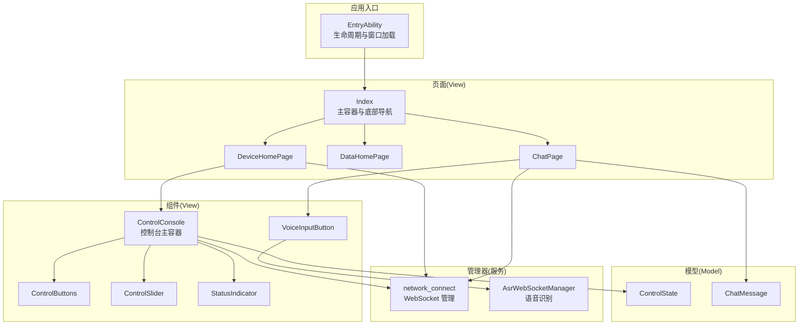
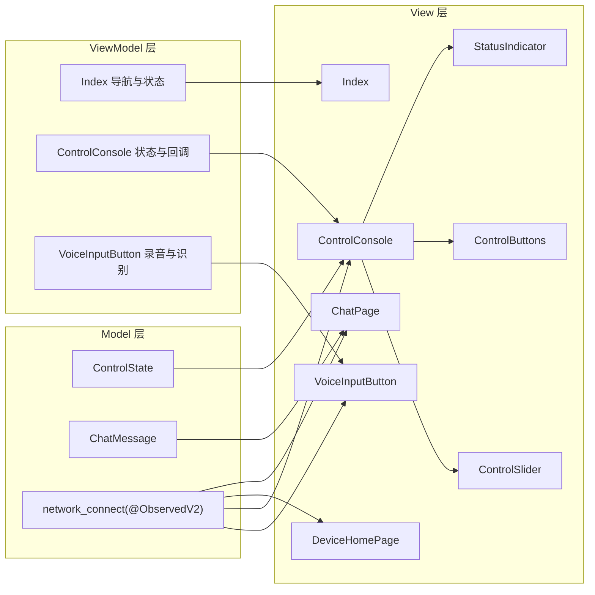
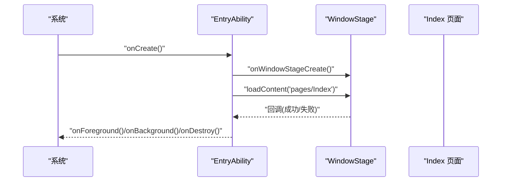
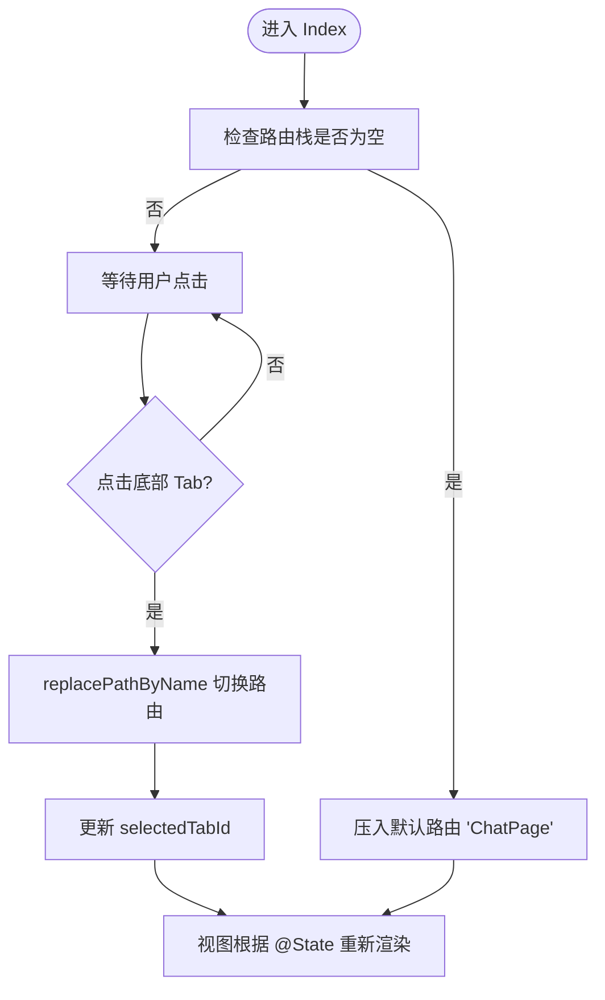
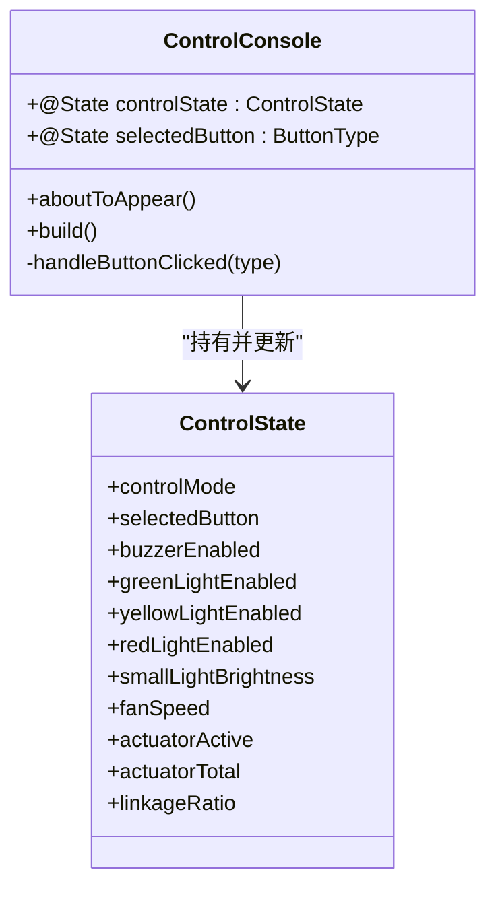
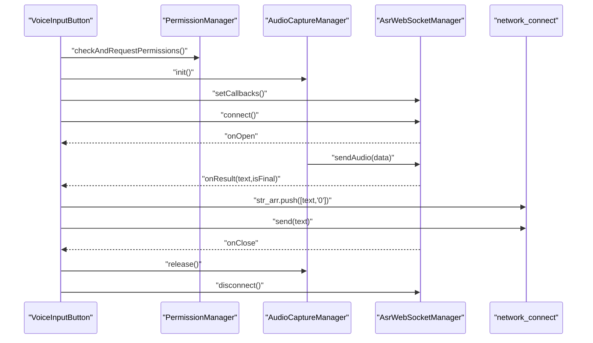
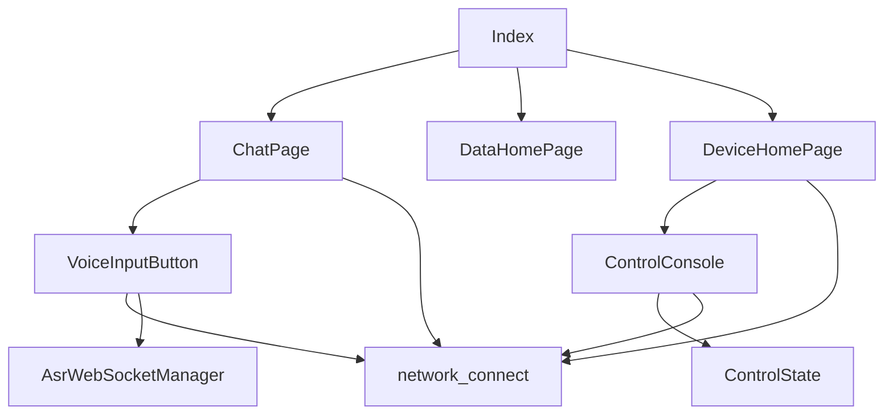

# 整体架构模式

<cite>
**本文引用的文件**
- [EntryAbility.ets](file://entry/src/main/ets/entryability/EntryAbility.ets)
- [Index.ets](file://entry/src/main/ets/pages/Index.ets)
- [ChatPage.ets](file://entry/src/main/ets/pages/ChatPage.ets)
- [DataHomePage.ets](file://entry/src/main/ets/pages/DataHomePage.ets)
- [DeviceHomePage.ets](file://entry/src/main/ets/pages/DeviceHomePage.ets)
- [network_connect.ets](file://entry/src/main/ets/pages/network_connect.ets)
- [ControlConsole.ets](file://entry/src/main/ets/components/control/ControlConsole.ets)
- [ControlButtons.ets](file://entry/src/main/ets/components/control/ControlButtons.ets)
- [ControlSlider.ets](file://entry/src/main/ets/components/control/ControlSlider.ets)
- [StatusIndicator.ets](file://entry/src/main/ets/components/control/StatusIndicator.ets)
- [VoiceInputButton.ets](file://entry/src/main/ets/components/chat/VoiceInputButton.ets)
- [AsrWebSocketManager.ets](file://entry/src/main/ets/managers/AsrWebSocketManager.ets)
- [ControlState.ets](file://entry/src/main/ets/models/ControlState.ets)
- [ChatMessage.ets](file://entry/src/main/ets/models/ChatMessage.ets)
- [Constants.ets](file://entry/src/main/ets/common/Constants.ets)
</cite>

## 目录
1. [简介](#简介)
2. [项目结构](#项目结构)
3. [核心组件](#核心组件)
4. [架构总览](#架构总览)
5. [详细组件分析](#详细组件分析)
6. [依赖分析](#依赖分析)
7. [性能考虑](#性能考虑)
8. [故障排查指南](#故障排查指南)
9. [结论](#结论)
10. [附录](#附录)

## 简介
本文件系统性阐述 SmartController 项目采用的 MVVM（Model-View-ViewModel）架构模式在 ArkTS 中的具体落地方式，覆盖以下要点：
- Model 层：数据模型与业务状态封装，如控制状态、聊天消息、网络连接状态等。
- View 层：基于 ArkTS 的 UI 组件与页面，负责渲染与用户交互。
- ViewModel 层：通过装饰器与响应式状态驱动视图更新，实现数据绑定与状态管理。
- 响应式原理：利用 @ObservedV2、@State、@Local、@Prop 等装饰器实现双向数据绑定与依赖追踪。
- 应用入口与导航：EntryAbility 生命周期管理与 Index 页面主导航控制。

## 项目结构
项目采用“页面-组件-模型-管理器”分层组织，页面作为 View 容器，组件作为可复用 UI 单元，模型承载数据与状态，管理器封装网络与权限等横切能力。

图表来源
- [EntryAbility.ets:1-48](file://entry/src/main/ets/entryability/EntryAbility.ets#L1-L48)
- [Index.ets:1-115](file://entry/src/main/ets/pages/Index.ets#L1-L115)
- [ChatPage.ets:1-76](file://entry/src/main/ets/pages/ChatPage.ets#L1-L76)
- [DataHomePage.ets:1-61](file://entry/src/main/ets/pages/DataHomePage.ets#L1-L61)
- [DeviceHomePage.ets:1-73](file://entry/src/main/ets/pages/DeviceHomePage.ets#L1-L73)
- [ControlConsole.ets:1-172](file://entry/src/main/ets/components/control/ControlConsole.ets#L1-L172)
- [ControlButtons.ets:1-48](file://entry/src/main/ets/components/control/ControlButtons.ets#L1-L48)
- [ControlSlider.ets:1-56](file://entry/src/main/ets/components/control/ControlSlider.ets#L1-L56)
- [StatusIndicator.ets:1-44](file://entry/src/main/ets/components/control/StatusIndicator.ets#L1-L44)
- [VoiceInputButton.ets:1-125](file://entry/src/main/ets/components/chat/VoiceInputButton.ets#L1-L125)
- [AsrWebSocketManager.ets:1-271](file://entry/src/main/ets/managers/AsrWebSocketManager.ets#L1-L271)
- [network_connect.ets:1-318](file://entry/src/main/ets/pages/network_connect.ets#L1-L318)
- [ControlState.ets:1-67](file://entry/src/main/ets/models/ControlState.ets#L1-L67)
- [ChatMessage.ets:1-9](file://entry/src/main/ets/models/ChatMessage.ets#L1-L9)

章节来源
- [EntryAbility.ets:1-48](file://entry/src/main/ets/entryability/EntryAbility.ets#L1-L48)
- [Index.ets:1-115](file://entry/src/main/ets/pages/Index.ets#L1-L115)

## 核心组件
- 应用入口与窗口阶段：EntryAbility 负责 Ability 生命周期与窗口加载，将 Index 页面设为主内容。
- 主容器与导航：Index 作为 @Entry 页面，维护底部 Tab 列表与路由栈，通过 Navigation 和 NavDestination 实现子页切换。
- 页面与组件：ChatPage、DataHomePage、DeviceHomePage 分别承载对话、数据、设备三大功能域；ControlConsole 及其子组件构成控制台 UI。
- 状态与模型：ControlState 描述设备控制状态；ChatMessage 描述消息条目；network_connect 提供网络连接与消息队列。
- 管理器：AsrWebSocketManager 负责语音识别 WebSocket 流程；VoiceInputButton 调用权限、录音与识别流程并与网络通信集成。

章节来源
- [EntryAbility.ets:1-48](file://entry/src/main/ets/entryability/EntryAbility.ets#L1-L48)
- [Index.ets:13-115](file://entry/src/main/ets/pages/Index.ets#L13-L115)
- [ControlState.ets:1-67](file://entry/src/main/ets/models/ControlState.ets#L1-L67)
- [ChatMessage.ets:1-9](file://entry/src/main/ets/models/ChatMessage.ets#L1-L9)
- [network_connect.ets:35-318](file://entry/src/main/ets/pages/network_connect.ets#L35-L318)
- [AsrWebSocketManager.ets:82-271](file://entry/src/main/ets/managers/AsrWebSocketManager.ets#L82-L271)

## 架构总览
MVVM 在本项目中的实现要点：
- Model：以类与接口形式存在，如 ControlState、ChatMessage、WebSocket_connect。其中 WebSocket_connect 使用 @ObservedV2 使其具备响应式能力。
- View：ArkTS 组件与页面，使用 @Component/@ComponentV2/@Entry 等装饰器声明，内部通过 @State、@Local、@Prop 等装饰器绑定数据。
- ViewModel：在本项目中主要体现为页面与组件内的状态与方法，通过装饰器驱动视图更新；部分跨页面共享状态通过全局实例（如 network_connect）传递。

图表来源
- [Index.ets:13-115](file://entry/src/main/ets/pages/Index.ets#L13-L115)
- [ControlConsole.ets:13-172](file://entry/src/main/ets/components/control/ControlConsole.ets#L13-L172)
- [VoiceInputButton.ets:8-125](file://entry/src/main/ets/components/chat/VoiceInputButton.ets#L8-L125)
- [network_connect.ets:35-318](file://entry/src/main/ets/pages/network_connect.ets#L35-L318)
- [ControlState.ets:28-67](file://entry/src/main/ets/models/ControlState.ets#L28-L67)
- [ChatMessage.ets:4-9](file://entry/src/main/ets/models/ChatMessage.ets#L4-L9)

## 详细组件分析

### 应用入口与窗口生命周期（EntryAbility）
- 职责：设置应用色阶、创建窗口阶段、加载主页面 Index、处理前后台切换与销毁日志。
- 关键点：onWindowStageCreate 中通过 windowStage.loadContent 加载 Index 页面；生命周期日志便于调试。

图表来源
- [EntryAbility.ets:7-48](file://entry/src/main/ets/entryability/EntryAbility.ets#L7-L48)

章节来源
- [EntryAbility.ets:1-48](file://entry/src/main/ets/entryability/EntryAbility.ets#L1-L48)

### 主容器与导航控制（Index）
- 职责：维护底部 Tab 列表与选中态，通过 NavPathStack 管理路由栈，NavDestination 根据路由名注入子页面。
- 关键点：aboutToAppear 首次进入时压入默认路由；switchBottomTab 替换当前路由并更新选中态；selectedTabId 控制底部图标与文字高亮。

图表来源
- [Index.ets:13-115](file://entry/src/main/ets/pages/Index.ets#L13-L115)

章节来源
- [Index.ets:13-115](file://entry/src/main/ets/pages/Index.ets#L13-L115)

### 控制台 ViewModel（ControlConsole）
- 职责：聚合控制按钮、状态指示器、滑块等子组件，统一管理 ControlState，并通过回调通知上层状态变更。
- 关键点：@State 控制状态；@Local 独立 UI 状态；handleButtonClicked 同步更新 selectedButton 与 controlState；onStateChange 回调上抛。

图表来源
- [ControlConsole.ets:13-172](file://entry/src/main/ets/components/control/ControlConsole.ets#L13-L172)
- [ControlState.ets:28-67](file://entry/src/main/ets/models/ControlState.ets#L28-L67)

章节来源
- [ControlConsole.ets:13-172](file://entry/src/main/ets/components/control/ControlConsole.ets#L13-L172)
- [ControlState.ets:1-67](file://entry/src/main/ets/models/ControlState.ets#L1-L67)

### 语音输入与识别（VoiceInputButton）
- 职责：申请权限、初始化录音、连接语音识别 WebSocket、接收识别结果并发送控制指令。
- 关键点：setupAsrCallbacks 设置 onOpen/onResult/onError/onClose；startRecording/connect 与录音流对接；识别完成后将用户消息推入 network_connect.str_arr 并尝试发送指令。

图表来源
- [VoiceInputButton.ets:8-125](file://entry/src/main/ets/components/chat/VoiceInputButton.ets#L8-L125)
- [AsrWebSocketManager.ets:82-271](file://entry/src/main/ets/managers/AsrWebSocketManager.ets#L82-L271)
- [network_connect.ets:35-318](file://entry/src/main/ets/pages/network_connect.ets#L35-L318)

章节来源
- [VoiceInputButton.ets:1-125](file://entry/src/main/ets/components/chat/VoiceInputButton.ets#L1-L125)
- [AsrWebSocketManager.ets:1-271](file://entry/src/main/ets/managers/AsrWebSocketManager.ets#L1-L271)
- [network_connect.ets:1-318](file://entry/src/main/ets/pages/network_connect.ets#L1-L318)

### 设备主页（DeviceHomePage）
- 职责：展示设备信息、快捷控制台、执行器占用、事件日志与告警队列。
- 关键点：aboutToAppear 更新时间并触发网络重连；ControlConsole 通过 onStateChange 接收状态变更；网络状态影响在线/离线提示。

章节来源
- [DeviceHomePage.ets:1-73](file://entry/src/main/ets/pages/DeviceHomePage.ets#L1-L73)

### 聊天页面（ChatPage）
- 职责：展示消息列表、底部语音输入区。
- 关键点：List + ForEach 渲染消息；network_connect.str_arr 作为消息源；VoiceInputButton 作为输入组件。

章节来源
- [ChatPage.ets:1-76](file://entry/src/main/ets/pages/ChatPage.ets#L1-L76)

### 数据主页（DataHomePage）
- 职责：展示舒适指数环形图与边缘数据质量卡片。
- 关键点：使用 ProgressRing 与自定义组件组合展示指标。

章节来源
- [DataHomePage.ets:1-61](file://entry/src/main/ets/pages/DataHomePage.ets#L1-L61)

## 依赖分析
- 页面到组件：Index 通过 NavDestination 注入子页面；DeviceHomePage 组合 ControlConsole、DeviceInfoCard、EventLog、AlarmQueue 等组件。
- 组件到模型：ControlConsole 依赖 ControlState；VoiceInputButton 依赖网络与语音识别管理器。
- 管理器到网络：network_connect 与 AsrWebSocketManager 分别封装 WebSocket 与语音识别流程。
- 共享状态：network_connect 作为 @ObservedV2 实例，被多个页面与组件共享，实现跨组件状态同步。

图表来源
- [Index.ets:13-115](file://entry/src/main/ets/pages/Index.ets#L13-L115)
- [ControlConsole.ets:13-172](file://entry/src/main/ets/components/control/ControlConsole.ets#L13-L172)
- [VoiceInputButton.ets:8-125](file://entry/src/main/ets/components/chat/VoiceInputButton.ets#L8-L125)
- [network_connect.ets:35-318](file://entry/src/main/ets/pages/network_connect.ets#L35-L318)
- [AsrWebSocketManager.ets:82-271](file://entry/src/main/ets/managers/AsrWebSocketManager.ets#L82-L271)
- [ControlState.ets:28-67](file://entry/src/main/ets/models/ControlState.ets#L28-L67)

章节来源
- [network_connect.ets:35-318](file://entry/src/main/ets/pages/network_connect.ets#L35-L318)

## 性能考虑
- 响应式更新粒度：@ObservedV2 与 @State 粒度越细，更新范围越小，但过度拆分会增加依赖追踪复杂度。
- 网络重连策略：network_connect 在 WiFi 恢复时延迟重连，避免频繁抖动；重连过程中使用 isReconnecting 锁避免并发重连。
- 语音识别：AsrWebSocketManager 缓存乱序结果并拼接，减少 UI 抖动；识别结束后主动断开连接释放资源。
- 组件复用：ControlButtons、ControlSlider、StatusIndicator 通过 @Prop 传参，降低重复渲染成本。

## 故障排查指南
- 退出确认逻辑：Constants 中的 ExitConfirmManager 提供“再按一次退出”的交互，handleBackPress 返回 true/false 控制是否拦截返回；Index 切换 Tab 时需调用 reset 重置状态。
- 网络异常：network_connect 在 error/close 时标记离线并清理未完成请求；支持自动重连与最大尝试次数控制。
- 语音识别：AsrWebSocketManager 记录错误码与数据，onError 回调中可定位问题；识别完成自动断开连接。

章节来源
- [Constants.ets:19-82](file://entry/src/main/ets/common/Constants.ets#L19-L82)
- [network_connect.ets:102-128](file://entry/src/main/ets/pages/network_connect.ets#L102-L128)
- [AsrWebSocketManager.ets:112-133](file://entry/src/main/ets/managers/AsrWebSocketManager.ets#L112-L133)

## 结论
SmartController 以 MVVM 为核心，结合 ArkTS 的装饰器体系实现了清晰的职责分离与高效的响应式更新。Index 作为主容器承担导航与状态协调，ControlConsole 作为 ViewModel 聚合控制状态并通过回调上抛，VoiceInputButton 将语音识别与网络通信无缝衔接。通过 @ObservedV2、@State、@Local、@Prop 等机制，项目在保证可维护性的同时兼顾了性能与用户体验。

## 附录
- 数据模型与消息格式：见 network_connect 中 websocketmessage 接口与 ChatMessage 接口定义。
- 退出确认管理器：见 Constants 中 ExitConfirmManager 的实现与 reset 调用时机。

章节来源
- [network_connect.ets:6-27](file://entry/src/main/ets/pages/network_connect.ets#L6-L27)
- [ChatMessage.ets:4-9](file://entry/src/main/ets/models/ChatMessage.ets#L4-L9)
- [Constants.ets:75-82](file://entry/src/main/ets/common/Constants.ets#L75-L82)