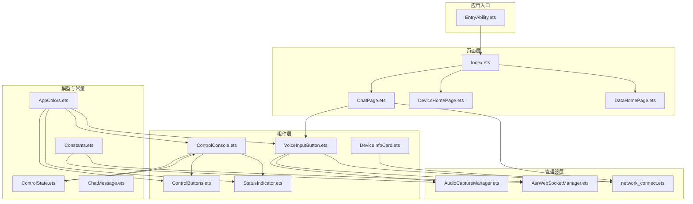
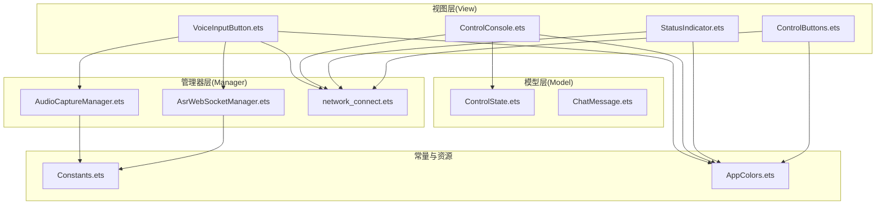
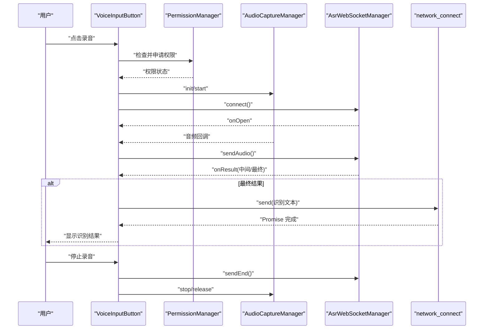
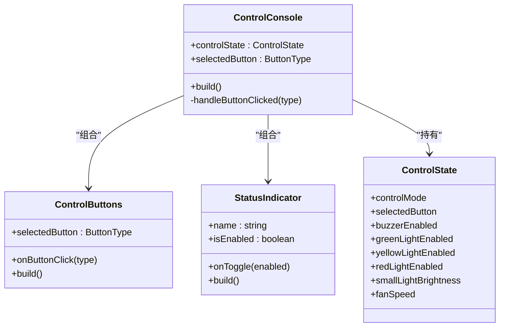
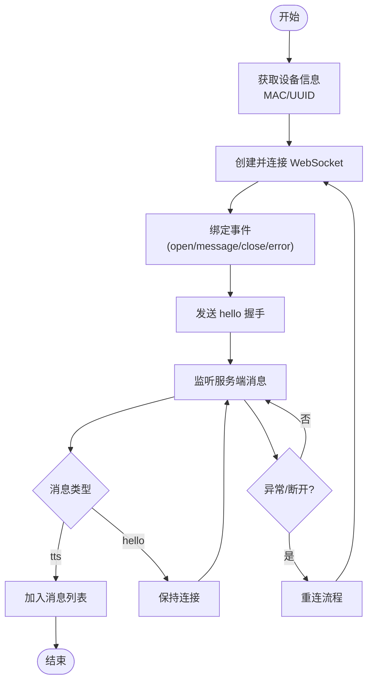
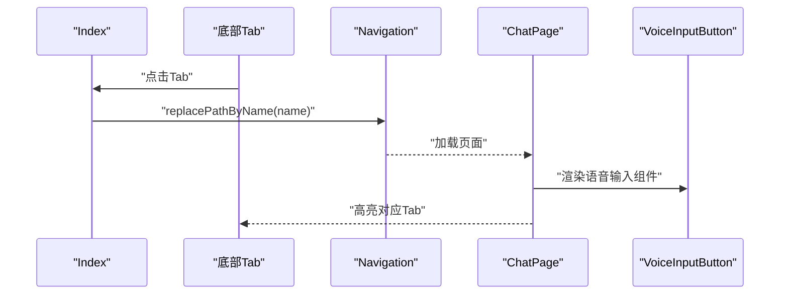
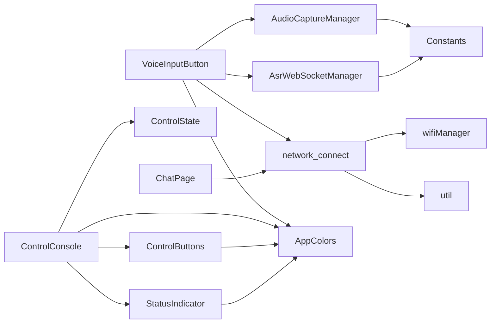

# 架构设计

<cite>
**本文引用的文件**
- [EntryAbility.ets](file://entry/src/main/ets/entryability/EntryAbility.ets)
- [Index.ets](file://entry/src/main/ets/pages/Index.ets)
- [ChatPage.ets](file://entry/src/main/ets/pages/ChatPage.ets)
- [network_connect.ets](file://entry/src/main/ets/pages/network_connect.ets)
- [VoiceInputButton.ets](file://entry/src/main/ets/components/chat/VoiceInputButton.ets)
- [ControlConsole.ets](file://entry/src/main/ets/components/control/ControlConsole.ets)
- [ControlButtons.ets](file://entry/src/main/ets/components/control/ControlButtons.ets)
- [StatusIndicator.ets](file://entry/src/main/ets/components/control/StatusIndicator.ets)
- [ControlState.ets](file://entry/src/main/ets/models/ControlState.ets)
- [AsrWebSocketManager.ets](file://entry/src/main/ets/managers/AsrWebSocketManager.ets)
- [AudioCaptureManager.ets](file://entry/src/main/ets/managers/AudioCaptureManager.ets)
- [Constants.ets](file://entry/src/main/ets/common/Constants.ets)
- [AppColors.ets](file://entry/src/main/ets/constants/AppColors.ets)
- [DeviceInfoCard.ets](file://entry/src/main/ets/components/device/DeviceInfoCard.ets)
</cite>

## 目录
1. [简介](#简介)
2. [项目结构](#项目结构)
3. [核心组件](#核心组件)
4. [架构总览](#架构总览)
5. [详细组件分析](#详细组件分析)
6. [依赖分析](#依赖分析)
7. [性能考量](#性能考量)
8. [故障排查指南](#故障排查指南)
9. [结论](#结论)
10. [附录](#附录)

## 简介
本项目采用 MVVM 架构模式，结合组件化与模块化设计，实现从语音输入到设备控制的完整数据链路。MVVM 的职责分离体现在：
- Model：数据模型与业务状态（如控制状态、聊天消息）
- View：基于 ArkTS 的声明式 UI 组件
- ViewModel：通过状态驱动的数据绑定与事件处理，协调 Manager 与 Model

系统围绕“首页导航 + 三类子页”的页面结构展开，配合统一的颜色与尺寸常量，形成可复用的 UI 组件库。组件间通过属性传递与回调事件进行通信，保证低耦合与高内聚。

## 项目结构
项目采用按功能域分层的目录组织方式：
- entryability：应用入口与窗口生命周期管理
- pages：页面级组件与业务页面
- components：可复用 UI 组件（聊天、控制、设备、传感器等）
- managers：跨页面的业务管理器（音频采集、ASR WebSocket、鉴权等）
- models：数据模型（控制状态、聊天消息）
- constants：颜色、尺寸等常量
- common：通用常量与工具（如权限、退出确认）

图表来源
- [EntryAbility.ets:1-48](file://entry/src/main/ets/entryability/EntryAbility.ets#L1-L48)
- [Index.ets:1-115](file://entry/src/main/ets/pages/Index.ets#L1-L115)
- [ChatPage.ets:1-83](file://entry/src/main/ets/pages/ChatPage.ets#L1-L83)
- [VoiceInputButton.ets:1-125](file://entry/src/main/ets/components/chat/VoiceInputButton.ets#L1-L125)
- [ControlConsole.ets:1-172](file://entry/src/main/ets/components/control/ControlConsole.ets#L1-L172)
- [ControlButtons.ets:1-48](file://entry/src/main/ets/components/control/ControlButtons.ets#L1-L48)
- [StatusIndicator.ets:1-39](file://entry/src/main/ets/components/control/StatusIndicator.ets#L1-L39)
- [ControlState.ets:1-67](file://entry/src/main/ets/models/ControlState.ets#L1-L67)
- [AudioCaptureManager.ets:1-80](file://entry/src/main/ets/managers/AudioCaptureManager.ets#L1-L80)
- [AsrWebSocketManager.ets:1-271](file://entry/src/main/ets/managers/AsrWebSocketManager.ets#L1-L271)
- [network_connect.ets:1-321](file://entry/src/main/ets/pages/network_connect.ets#L1-L321)
- [Constants.ets:1-82](file://entry/src/main/ets/common/Constants.ets#L1-L82)
- [AppColors.ets:1-47](file://entry/src/main/ets/constants/AppColors.ets#L1-L47)

章节来源
- [EntryAbility.ets:1-48](file://entry/src/main/ets/entryability/EntryAbility.ets#L1-L48)
- [Index.ets:1-115](file://entry/src/main/ets/pages/Index.ets#L1-L115)

## 核心组件
- 入口与窗口管理：负责 Ability 生命周期与主窗口加载，承载首页导航
- 导航与页面：首页 Index 提供底部 Tab 切换，承载聊天、数据、设备三个子页
- 聊天页面：展示消息列表，集成语音输入按钮
- 控制台：集中展示与操作设备状态（按钮、指示灯、滑条），并同步状态
- 管理器：音频采集、ASR WebSocket、网络连接与设备信息
- 模型：控制状态、聊天消息
- 常量：采样率、通道数、讯飞鉴权参数、颜色与尺寸

章节来源
- [ControlState.ets:1-67](file://entry/src/main/ets/models/ControlState.ets#L1-L67)
- [network_connect.ets:1-321](file://entry/src/main/ets/pages/network_connect.ets#L1-L321)
- [Constants.ets:1-82](file://entry/src/main/ets/common/Constants.ets#L1-L82)

## 架构总览
系统采用 MVVM 与组件化双轴设计：
- Model：ControlState、ChatMessage 等承载业务数据
- View：ArkTS 组件（VoiceInputButton、ControlConsole、StatusIndicator 等）
- ViewModel：通过状态与回调在组件与管理器之间传递数据与事件
- 管理器：封装跨页面的业务能力（音频、ASR、网络）

图表来源
- [VoiceInputButton.ets:1-125](file://entry/src/main/ets/components/chat/VoiceInputButton.ets#L1-L125)
- [ControlConsole.ets:1-172](file://entry/src/main/ets/components/control/ControlConsole.ets#L1-L172)
- [StatusIndicator.ets:1-39](file://entry/src/main/ets/components/control/StatusIndicator.ets#L1-L39)
- [ControlButtons.ets:1-48](file://entry/src/main/ets/components/control/ControlButtons.ets#L1-L48)
- [ControlState.ets:1-67](file://entry/src/main/ets/models/ControlState.ets#L1-L67)
- [AudioCaptureManager.ets:1-80](file://entry/src/main/ets/managers/AudioCaptureManager.ets#L1-L80)
- [AsrWebSocketManager.ets:1-271](file://entry/src/main/ets/managers/AsrWebSocketManager.ets#L1-L271)
- [network_connect.ets:1-321](file://entry/src/main/ets/pages/network_connect.ets#L1-L321)
- [Constants.ets:1-82](file://entry/src/main/ets/common/Constants.ets#L1-L82)
- [AppColors.ets:1-47](file://entry/src/main/ets/constants/AppColors.ets#L1-L47)

## 详细组件分析

### 语音输入组件（VoiceInputButton）
职责与交互：
- 权限检查与音频采集初始化
- 通过 AudioCaptureManager 捕获音频流，并实时推送到 AsrWebSocketManager
- 通过 AsrWebSocketManager 建立 WebSocket 连接，发送起始帧、音频帧与结束帧
- 监听识别结果，最终将识别文本通过 network_connect 发送设备控制指令
- 状态反馈：连接中、识别中、错误、完成等

图表来源
- [VoiceInputButton.ets:1-125](file://entry/src/main/ets/components/chat/VoiceInputButton.ets#L1-L125)
- [AudioCaptureManager.ets:1-80](file://entry/src/main/ets/managers/AudioCaptureManager.ets#L1-L80)
- [AsrWebSocketManager.ets:1-271](file://entry/src/main/ets/managers/AsrWebSocketManager.ets#L1-L271)
- [network_connect.ets:1-321](file://entry/src/main/ets/pages/network_connect.ets#L1-L321)

章节来源
- [VoiceInputButton.ets:1-125](file://entry/src/main/ets/components/chat/VoiceInputButton.ets#L1-L125)
- [AudioCaptureManager.ets:1-80](file://entry/src/main/ets/managers/AudioCaptureManager.ets#L1-L80)
- [AsrWebSocketManager.ets:1-271](file://entry/src/main/ets/managers/AsrWebSocketManager.ets#L1-L271)

### 控制台组件（ControlConsole）
职责与交互：
- 维护 ControlState，作为 ViewModel 层承载设备控制状态
- 通过 ControlButtons 与 StatusIndicator 组合，提供按钮选择与状态切换
- 滑条控件用于调节小灯亮度与风扇转速
- 状态变更通过回调通知上层，同时向网络层发送控制指令

图表来源
- [ControlConsole.ets:1-172](file://entry/src/main/ets/components/control/ControlConsole.ets#L1-L172)
- [ControlButtons.ets:1-48](file://entry/src/main/ets/components/control/ControlButtons.ets#L1-L48)
- [StatusIndicator.ets:1-39](file://entry/src/main/ets/components/control/StatusIndicator.ets#L1-L39)
- [ControlState.ets:1-67](file://entry/src/main/ets/models/ControlState.ets#L1-L67)

章节来源
- [ControlConsole.ets:1-172](file://entry/src/main/ets/components/control/ControlConsole.ets#L1-L172)
- [ControlButtons.ets:1-48](file://entry/src/main/ets/components/control/ControlButtons.ets#L1-L48)
- [StatusIndicator.ets:1-39](file://entry/src/main/ets/components/control/StatusIndicator.ets#L1-L39)
- [ControlState.ets:1-67](file://entry/src/main/ets/models/ControlState.ets#L1-L67)

### 网络连接组件（network_connect）
职责与交互：
- 管理 WebSocket 连接，包含设备信息获取、握手、消息收发、异常与重连
- 维护消息队列与会话 ID，支持二进制与文本消息处理
- 对外提供 send 方法，内部封装请求去重与回调管理
- 监听 WiFi 状态变化，自动触发重连

图表来源
- [network_connect.ets:1-321](file://entry/src/main/ets/pages/network_connect.ets#L1-L321)

章节来源
- [network_connect.ets:1-321](file://entry/src/main/ets/pages/network_connect.ets#L1-L321)

### 页面与导航（Index、ChatPage）
职责与交互：
- Index：定义底部 Tab 与页面栈，负责路由切换与高亮状态管理
- ChatPage：渲染消息列表，集成 VoiceInputButton，处理返回键与退出确认

图表来源
- [Index.ets:1-115](file://entry/src/main/ets/pages/Index.ets#L1-L115)
- [ChatPage.ets:1-83](file://entry/src/main/ets/pages/ChatPage.ets#L1-L83)
- [VoiceInputButton.ets:1-125](file://entry/src/main/ets/components/chat/VoiceInputButton.ets#L1-L125)

章节来源
- [Index.ets:1-115](file://entry/src/main/ets/pages/Index.ets#L1-L115)
- [ChatPage.ets:1-83](file://entry/src/main/ets/pages/ChatPage.ets#L1-L83)

### 设备信息组件（DeviceInfoCard）
职责与交互：
- 展示设备名称、在线状态与更新时间
- 通过 DeviceOnlineTag 组件呈现在线/离线状态

章节来源
- [DeviceInfoCard.ets:1-59](file://entry/src/main/ets/components/device/DeviceInfoCard.ets#L1-L59)

## 依赖分析
- 组件依赖：VoiceInputButton 依赖 AudioCaptureManager、AsrWebSocketManager、network_connect；ControlConsole 依赖 ControlState 与多个子组件；ChatPage 依赖 network_connect 与 VoiceInputButton
- 管理器依赖：AudioCaptureManager、AsrWebSocketManager 依赖 Constants；network_connect 依赖 wifiManager 与 util
- 常量依赖：组件与管理器共享 AppColors、Constants

图表来源
- [VoiceInputButton.ets:1-125](file://entry/src/main/ets/components/chat/VoiceInputButton.ets#L1-L125)
- [ControlConsole.ets:1-172](file://entry/src/main/ets/components/control/ControlConsole.ets#L1-L172)
- [ControlButtons.ets:1-48](file://entry/src/main/ets/components/control/ControlButtons.ets#L1-L48)
- [StatusIndicator.ets:1-39](file://entry/src/main/ets/components/control/StatusIndicator.ets#L1-L39)
- [ControlState.ets:1-67](file://entry/src/main/ets/models/ControlState.ets#L1-L67)
- [AudioCaptureManager.ets:1-80](file://entry/src/main/ets/managers/AudioCaptureManager.ets#L1-L80)
- [AsrWebSocketManager.ets:1-271](file://entry/src/main/ets/managers/AsrWebSocketManager.ets#L1-L271)
- [network_connect.ets:1-321](file://entry/src/main/ets/pages/network_connect.ets#L1-L321)
- [Constants.ets:1-82](file://entry/src/main/ets/common/Constants.ets#L1-L82)
- [AppColors.ets:1-47](file://entry/src/main/ets/constants/AppColors.ets#L1-L47)

章节来源
- [network_connect.ets:1-321](file://entry/src/main/ets/pages/network_connect.ets#L1-L321)
- [Constants.ets:1-82](file://entry/src/main/ets/common/Constants.ets#L1-L82)
- [AppColors.ets:1-47](file://entry/src/main/ets/constants/AppColors.ets#L1-L47)

## 性能考量
- 音频采集与编码：采用 16kHz 单声道、RAW 格式，降低 CPU 压力；按缓冲区大小推送，避免阻塞 UI 线程
- WebSocket 连接：握手后保持长连接，减少频繁建连开销；WiFi 断开后标记离线，避免无效重试
- 状态更新：使用 ObservedV2 与 @State/@Prop 管理响应式状态，减少不必要的重绘
- UI 组件：统一颜色与尺寸常量，提升主题一致性与渲染效率

## 故障排查指南
- 无法录音/无声音：检查麦克风权限与 AudioCaptureManager 初始化状态
- ASR 连接失败：查看 AsrWebSocketManager 的错误回调与日志，确认鉴权参数与网络连通性
- WebSocket 断开：关注 network_connect 的 error/close 事件，确认 WiFi 状态与重连策略
- 返回键行为异常：确认 ExitConfirmManager 的状态重置逻辑与 Index 的 Tab 切换时机

章节来源
- [AudioCaptureManager.ets:1-80](file://entry/src/main/ets/managers/AudioCaptureManager.ets#L1-L80)
- [AsrWebSocketManager.ets:1-271](file://entry/src/main/ets/managers/AsrWebSocketManager.ets#L1-L271)
- [network_connect.ets:1-321](file://entry/src/main/ets/pages/network_connect.ets#L1-L321)
- [Constants.ets:1-82](file://entry/src/main/ets/common/Constants.ets#L1-L82)

## 结论
本项目通过 MVVM 与组件化架构实现了清晰的职责分离与良好的可扩展性。从语音输入到设备控制的数据流路径明确，管理器层承担跨页面的复杂业务逻辑，组件层专注于 UI 表达与交互。未来可在以下方面演进：
- 引入状态管理库或轻量 Store，进一步解耦 ViewModel
- 抽象网络层为协议无关的适配器，增强多协议支持
- 增加单元测试与 UI 测试覆盖率，完善自动化质量保障
- 持续优化音频与网络的 QoS 与降噪算法，提升识别准确率与稳定性

## 附录
- 技术选型说明
  - ArkTS/ArkUI：面向多端的一致开发体验与高性能渲染
  - WebSocket：长连接与低延迟消息传输
  - 讯飞语音：云端 ASR 服务，支持中文连续语音识别
  - 音频采集：原生多媒体 API，满足实时性要求