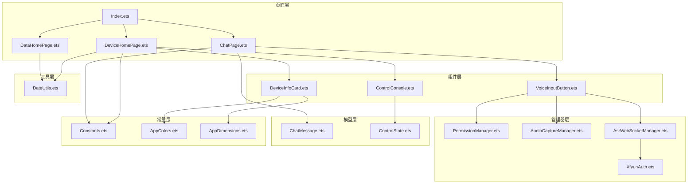
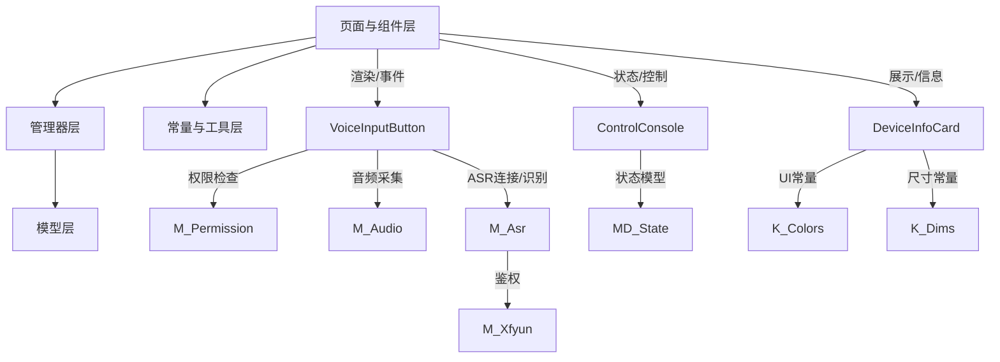
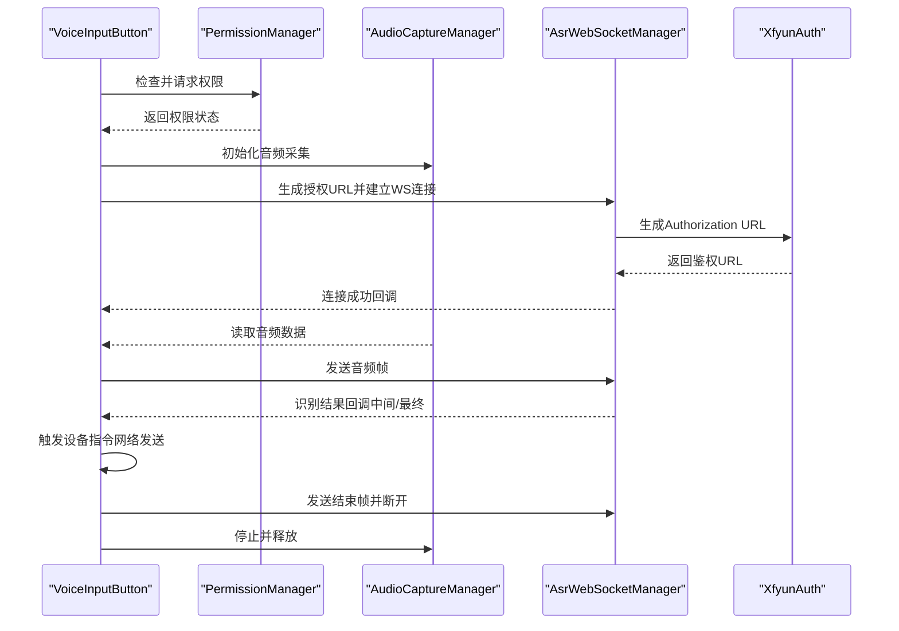
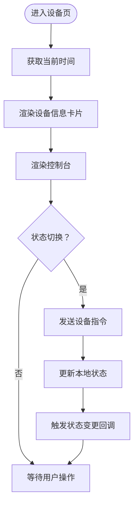
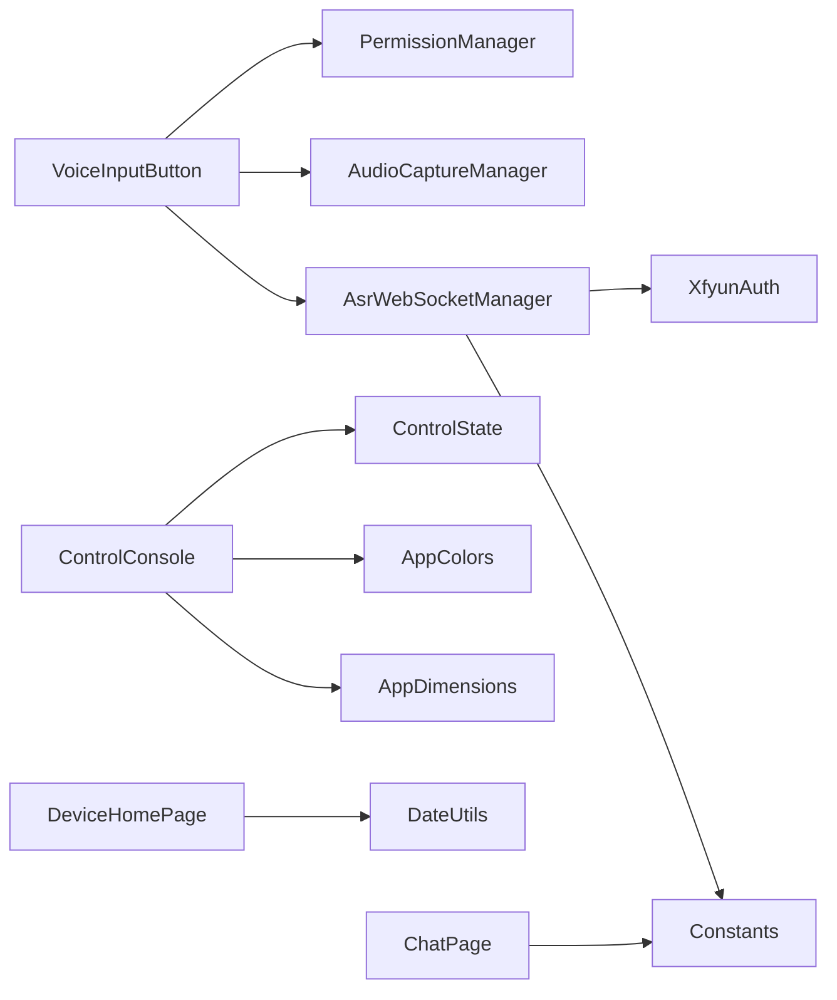

# 模块化设计原则

<cite>
**本文引用的文件**
- [EntryAbility.ets](file://entry/src/main/ets/entryability/EntryAbility.ets)
- [AsrWebSocketManager.ets](file://entry/src/main/ets/managers/AsrWebSocketManager.ets)
- [AudioCaptureManager.ets](file://entry/src/main/ets/managers/AudioCaptureManager.ets)
- [PermissionManager.ets](file://entry/src/main/ets/managers/PermissionManager.ets)
- [XfyunAuth.ets](file://entry/src/main/ets/managers/XfyunAuth.ets)
- [Constants.ets](file://entry/src/main/ets/common/Constants.ets)
- [ChatMessage.ets](file://entry/src/main/ets/models/ChatMessage.ets)
- [ControlState.ets](file://entry/src/main/ets/models/ControlState.ets)
- [DateUtils.ets](file://entry/src/main/ets/utils/DateUtils.ets)
- [AppColors.ets](file://entry/src/main/ets/constants/AppColors.ets)
- [AppDimensions.ets](file://entry/src/main/ets/constants/AppDimensions.ets)
- [Index.ets](file://entry/src/main/ets/pages/Index.ets)
- [VoiceInputButton.ets](file://entry/src/main/ets/components/chat/VoiceInputButton.ets)
- [ControlConsole.ets](file://entry/src/main/ets/components/control/ControlConsole.ets)
- [DeviceInfoCard.ets](file://entry/src/main/ets/components/device/DeviceInfoCard.ets)
- [ChatPage.ets](file://entry/src/main/ets/pages/ChatPage.ets)
- [DataHomePage.ets](file://entry/src/main/ets/pages/DataHomePage.ets)
- [DeviceHomePage.ets](file://entry/src/main/ets/pages/DeviceHomePage.ets)
</cite>

## 目录
1. [简介](#简介)
2. [项目结构](#项目结构)
3. [核心组件](#核心组件)
4. [架构总览](#架构总览)
5. [详细组件分析](#详细组件分析)
6. [依赖分析](#依赖分析)
7. [性能考虑](#性能考虑)
8. [故障排查指南](#故障排查指南)
9. [结论](#结论)
10. [附录](#附录)

## 简介
本文件面向 SmartController 的模块化设计，系统性阐述业务模块（语音控制、设备管理、数据监控）、基础设施模块（网络通信、权限管理、音频处理）、工具模块（数据模型、工具类、常量定义）的边界划分与职责分离，并解释模块间依赖关系与接口设计，如何通过抽象接口实现解耦。同时给出目录结构与命名规范建议、扩展指南以及模块间通信与数据传递方式。

## 项目结构
项目采用按“职责域”分层的组织方式：
- entry/src/main/ets/pages：页面级组件，负责路由与页面编排
- entry/src/main/ets/components：可复用 UI 组件，按功能域细分（chat、control、device、sensor、log、actuator）
- entry/src/main/ets/managers：基础设施与服务封装（网络、权限、音频、鉴权）
- entry/src/main/ets/models：领域数据模型
- entry/src/main/ets/utils：通用工具类
- entry/src/main/ets/constants：UI 常量
- entry/src/main/ets/common：全局常量与通用能力（如退出确认）

图表来源
- [Index.ets:13-115](file://entry/src/main/ets/pages/Index.ets#L13-L115)
- [ChatPage.ets:1-76](file://entry/src/main/ets/pages/ChatPage.ets#L1-L76)
- [DataHomePage.ets:1-61](file://entry/src/main/ets/pages/DataHomePage.ets#L1-L61)
- [DeviceHomePage.ets:1-73](file://entry/src/main/ets/pages/DeviceHomePage.ets#L1-L73)
- [VoiceInputButton.ets:1-125](file://entry/src/main/ets/components/chat/VoiceInputButton.ets#L1-L125)
- [ControlConsole.ets:1-172](file://entry/src/main/ets/components/control/ControlConsole.ets#L1-L172)
- [DeviceInfoCard.ets:1-59](file://entry/src/main/ets/components/device/DeviceInfoCard.ets#L1-L59)
- [PermissionManager.ets:1-28](file://entry/src/main/ets/managers/PermissionManager.ets#L1-L28)
- [AudioCaptureManager.ets:1-80](file://entry/src/main/ets/managers/AudioCaptureManager.ets#L1-L80)
- [AsrWebSocketManager.ets:1-271](file://entry/src/main/ets/managers/AsrWebSocketManager.ets#L1-L271)
- [XfyunAuth.ets:1-34](file://entry/src/main/ets/managers/XfyunAuth.ets#L1-L34)
- [ChatMessage.ets:1-9](file://entry/src/main/ets/models/ChatMessage.ets#L1-L9)
- [ControlState.ets:1-67](file://entry/src/main/ets/models/ControlState.ets#L1-L67)
- [DateUtils.ets:1-28](file://entry/src/main/ets/utils/DateUtils.ets#L1-L28)
- [Constants.ets:1-82](file://entry/src/main/ets/common/Constants.ets#L1-L82)
- [AppColors.ets:1-47](file://entry/src/main/ets/constants/AppColors.ets#L1-L47)
- [AppDimensions.ets:1-40](file://entry/src/main/ets/constants/AppDimensions.ets#L1-L40)

章节来源
- [Index.ets:13-115](file://entry/src/main/ets/pages/Index.ets#L13-L115)
- [ChatPage.ets:1-76](file://entry/src/main/ets/pages/ChatPage.ets#L1-L76)
- [DataHomePage.ets:1-61](file://entry/src/main/ets/pages/DataHomePage.ets#L1-L61)
- [DeviceHomePage.ets:1-73](file://entry/src/main/ets/pages/DeviceHomePage.ets#L1-L73)

## 核心组件
- 页面入口与生命周期：EntryAbility 负责应用生命周期与窗口创建
- 页面编排：Index 提供底部导航与子页路由
- 业务组件：
  - 语音输入与识别：VoiceInputButton 联动权限、音频采集与 ASR WebSocket
  - 设备控制台：ControlConsole 管理控制状态并驱动设备指令下发
  - 设备信息展示：DeviceInfoCard 展示设备状态与更新时间
- 基础设施：
  - 权限管理：PermissionManager 统一检查与申请麦克风与网络权限
  - 音频采集：AudioCaptureManager 封装音频流读取与生命周期
  - 语音识别：AsrWebSocketManager 封装 WebSocket 连接、帧发送与识别结果解析
  - 认证与鉴权：XfyunAuth 生成讯飞 ASR 授权 URL
- 数据模型：
  - ChatMessage：对话消息结构
  - ControlState：控制模式与设备状态
- 工具与常量：
  - DateUtils：日期格式化
  - AppColors/AppDimensions：UI 颜色与尺寸常量
  - Constants：采样率、缓冲区、讯飞密钥与退出确认等

章节来源
- [EntryAbility.ets:7-48](file://entry/src/main/ets/entryability/EntryAbility.ets#L7-L48)
- [Index.ets:13-115](file://entry/src/main/ets/pages/Index.ets#L13-L115)
- [VoiceInputButton.ets:8-125](file://entry/src/main/ets/components/chat/VoiceInputButton.ets#L8-L125)
- [ControlConsole.ets:13-172](file://entry/src/main/ets/components/control/ControlConsole.ets#L13-L172)
- [DeviceInfoCard.ets:9-59](file://entry/src/main/ets/components/device/DeviceInfoCard.ets#L9-L59)
- [PermissionManager.ets:5-28](file://entry/src/main/ets/managers/PermissionManager.ets#L5-L28)
- [AudioCaptureManager.ets:6-80](file://entry/src/main/ets/managers/AudioCaptureManager.ets#L6-L80)
- [AsrWebSocketManager.ets:82-271](file://entry/src/main/ets/managers/AsrWebSocketManager.ets#L82-L271)
- [XfyunAuth.ets:6-34](file://entry/src/main/ets/managers/XfyunAuth.ets#L6-L34)
- [ChatMessage.ets:4-9](file://entry/src/main/ets/models/ChatMessage.ets#L4-L9)
- [ControlState.ets:28-67](file://entry/src/main/ets/models/ControlState.ets#L28-L67)
- [DateUtils.ets:4-28](file://entry/src/main/ets/utils/DateUtils.ets#L4-L28)
- [AppColors.ets:5-47](file://entry/src/main/ets/constants/AppColors.ets#L5-L47)
- [AppDimensions.ets:5-40](file://entry/src/main/ets/constants/AppDimensions.ets#L5-L40)
- [Constants.ets:4-82](file://entry/src/main/ets/common/Constants.ets#L4-L82)

## 架构总览
SmartController 采用“页面-组件-管理器-模型-工具”的分层架构。页面负责导航与编排，组件负责 UI 与交互，管理器封装跨域能力（网络、权限、音频），模型承载业务数据，工具与常量提供横切支持。

图表来源
- [VoiceInputButton.ets:14-17](file://entry/src/main/ets/components/chat/VoiceInputButton.ets#L14-L17)
- [ControlConsole.ets:16-20](file://entry/src/main/ets/components/control/ControlConsole.ets#L16-L20)
- [AsrWebSocketManager.ets:82-144](file://entry/src/main/ets/managers/AsrWebSocketManager.ets#L82-L144)
- [PermissionManager.ets:8-27](file://entry/src/main/ets/managers/PermissionManager.ets#L8-L27)
- [AudioCaptureManager.ets:11-53](file://entry/src/main/ets/managers/AudioCaptureManager.ets#L11-L53)
- [AppColors.ets:5-47](file://entry/src/main/ets/constants/AppColors.ets#L5-L47)
- [AppDimensions.ets:5-40](file://entry/src/main/ets/constants/AppDimensions.ets#L5-L40)
- [ControlState.ets:28-67](file://entry/src/main/ets/models/ControlState.ets#L28-L67)

## 详细组件分析

### 语音控制模块（业务模块）
- 职责边界：
  - 语音输入：权限校验、音频采集、ASR 连接与断开
  - 识别结果：文本拼接、最终结果判定、触发设备指令
- 关键接口与流程：
  - 权限接口：checkAndRequestPermissions(context)
  - 音频接口：init/start/stop/release
  - ASR 接口：connect/sendAudio/sendEnd/disconnect/setCallbacks
- 依赖关系：
  - VoiceInputButton 依赖 PermissionManager、AudioCaptureManager、AsrWebSocketManager
  - AsrWebSocketManager 依赖 XfyunAuth 与 Constants

图表来源
- [VoiceInputButton.ets:18-89](file://entry/src/main/ets/components/chat/VoiceInputButton.ets#L18-L89)
- [PermissionManager.ets:8-27](file://entry/src/main/ets/managers/PermissionManager.ets#L8-L27)
- [AudioCaptureManager.ets:11-79](file://entry/src/main/ets/managers/AudioCaptureManager.ets#L11-L79)
- [AsrWebSocketManager.ets:92-144](file://entry/src/main/ets/managers/AsrWebSocketManager.ets#L92-L144)
- [XfyunAuth.ets:7-24](file://entry/src/main/ets/managers/XfyunAuth.ets#L7-L24)

章节来源
- [VoiceInputButton.ets:8-125](file://entry/src/main/ets/components/chat/VoiceInputButton.ets#L8-L125)
- [PermissionManager.ets:5-28](file://entry/src/main/ets/managers/PermissionManager.ets#L5-L28)
- [AudioCaptureManager.ets:6-80](file://entry/src/main/ets/managers/AudioCaptureManager.ets#L6-L80)
- [AsrWebSocketManager.ets:82-271](file://entry/src/main/ets/managers/AsrWebSocketManager.ets#L82-L271)
- [XfyunAuth.ets:6-34](file://entry/src/main/ets/managers/XfyunAuth.ets#L6-L34)

### 设备管理模块（业务模块）
- 职责边界：
  - 设备状态展示：设备名称、在线状态、更新时间
  - 快捷控制：灯光、风扇、蜂鸣器等状态切换
  - 日志与告警：事件日志与告警队列
- 关键接口与流程：
  - ControlConsole 管理 ControlState 并在状态变更时回调
  - 设备信息组件接收属性并渲染
- 依赖关系：
  - ControlConsole 依赖 ControlState、AppColors、AppDimensions
  - DeviceHomePage 依赖多个组件与 DateUtils

图表来源
- [DeviceHomePage.ets:22-25](file://entry/src/main/ets/pages/DeviceHomePage.ets#L22-L25)
- [DeviceInfoCard.ets:18-58](file://entry/src/main/ets/components/device/DeviceInfoCard.ets#L18-L58)
- [ControlConsole.ets:40-172](file://entry/src/main/ets/components/control/ControlConsole.ets#L40-L172)
- [DateUtils.ets:10-27](file://entry/src/main/ets/utils/DateUtils.ets#L10-L27)

章节来源
- [DeviceHomePage.ets:12-73](file://entry/src/main/ets/pages/DeviceHomePage.ets#L12-L73)
- [DeviceInfoCard.ets:9-59](file://entry/src/main/ets/components/device/DeviceInfoCard.ets#L9-L59)
- [ControlConsole.ets:13-172](file://entry/src/main/ets/components/control/ControlConsole.ets#L13-L172)
- [DateUtils.ets:4-28](file://entry/src/main/ets/utils/DateUtils.ets#L4-L28)

### 数据监控模块（业务模块）
- 职责边界：
  - 数据可视化：舒适指数环形图、异常统计等
  - 实时数据：通过网络连接获取最新数据
- 关键接口与流程：
  - 页面渲染数据卡片与图表
  - 通过网络连接进行数据刷新与订阅

章节来源
- [DataHomePage.ets:7-61](file://entry/src/main/ets/pages/DataHomePage.ets#L7-L61)

### 权限管理模块（基础设施模块）
- 职责边界：
  - 统一检查与申请权限（麦克风、网络）
- 关键接口：
  - checkAndRequestPermissions(context)：返回是否全部授权

章节来源
- [PermissionManager.ets:5-28](file://entry/src/main/ets/managers/PermissionManager.ets#L5-L28)

### 音频处理模块（基础设施模块）
- 职责边界：
  - 音频流初始化、启动、停止、释放
  - 回调式数据读取
- 关键接口：
  - init/start/stop/release
  - start(callback) 将音频数据回传给上层

章节来源
- [AudioCaptureManager.ets:6-80](file://entry/src/main/ets/managers/AudioCaptureManager.ets#L6-L80)

### 网络通信模块（基础设施模块）
- 职责边界：
  - ASR WebSocket 连接、帧发送与识别结果解析
  - 讯飞鉴权 URL 生成
- 关键接口：
  - AsrWebSocketManager：connect/sendAudio/sendEnd/disconnect/setCallbacks
  - XfyunAuth：generateAuthUrl

章节来源
- [AsrWebSocketManager.ets:82-271](file://entry/src/main/ets/managers/AsrWebSocketManager.ets#L82-L271)
- [XfyunAuth.ets:6-34](file://entry/src/main/ets/managers/XfyunAuth.ets#L6-L34)

### 工具与常量模块（工具模块）
- 职责边界：
  - 日期格式化：DateUtils
  - UI 常量：AppColors、AppDimensions
  - 全局常量：采样率、缓冲区、讯飞密钥、退出确认
- 关键接口：
  - DateUtils.formatDateTime/getCurrentDateTime
  - AppColors/AppDimensions 提供只读常量
  - Constants 提供全局配置与退出确认管理

章节来源
- [DateUtils.ets:4-28](file://entry/src/main/ets/utils/DateUtils.ets#L4-L28)
- [AppColors.ets:5-47](file://entry/src/main/ets/constants/AppColors.ets#L5-L47)
- [AppDimensions.ets:5-40](file://entry/src/main/ets/constants/AppDimensions.ets#L5-L40)
- [Constants.ets:4-82](file://entry/src/main/ets/common/Constants.ets#L4-L82)

## 依赖分析
- 组件耦合与内聚：
  - VoiceInputButton 内聚于语音输入链路，依赖权限、音频与 ASR 管理器
  - ControlConsole 内聚于设备控制，依赖状态模型与 UI 常量
  - 页面组件对具体实现依赖较弱，主要通过属性与回调交互
- 直接与间接依赖：
  - AsrWebSocketManager 间接依赖 XfyunAuth 与 Constants
  - 页面组件依赖工具与常量，但不直接依赖具体实现
- 潜在循环依赖：
  - 当前未见循环依赖；组件间通过单向依赖与回调解耦
- 外部依赖与集成点：
  - 音频与网络 API 由系统框架提供
  - 讯飞 ASR 服务通过 WebSocket 协议接入

图表来源
- [VoiceInputButton.ets:14-17](file://entry/src/main/ets/components/chat/VoiceInputButton.ets#L14-L17)
- [AsrWebSocketManager.ets:82-144](file://entry/src/main/ets/managers/AsrWebSocketManager.ets#L82-L144)
- [XfyunAuth.ets:7-24](file://entry/src/main/ets/managers/XfyunAuth.ets#L7-L24)
- [ControlConsole.ets:16-20](file://entry/src/main/ets/components/control/ControlConsole.ets#L16-L20)
- [ControlState.ets:28-67](file://entry/src/main/ets/models/ControlState.ets#L28-L67)
- [AppColors.ets:5-47](file://entry/src/main/ets/constants/AppColors.ets#L5-L47)
- [AppDimensions.ets:5-40](file://entry/src/main/ets/constants/AppDimensions.ets#L5-L40)
- [DeviceHomePage.ets:22-25](file://entry/src/main/ets/pages/DeviceHomePage.ets#L22-L25)
- [ChatPage.ets:9-10](file://entry/src/main/ets/pages/ChatPage.ets#L9-L10)

章节来源
- [VoiceInputButton.ets:8-125](file://entry/src/main/ets/components/chat/VoiceInputButton.ets#L8-L125)
- [AsrWebSocketManager.ets:82-271](file://entry/src/main/ets/managers/AsrWebSocketManager.ets#L82-L271)
- [ControlConsole.ets:13-172](file://entry/src/main/ets/components/control/ControlConsole.ets#L13-L172)
- [DeviceHomePage.ets:12-73](file://entry/src/main/ets/pages/DeviceHomePage.ets#L12-L73)
- [ChatPage.ets:1-76](file://entry/src/main/ets/pages/ChatPage.ets#L1-L76)

## 性能考虑
- 音频采集与传输：
  - 使用回调式 readData，避免阻塞主线程
  - 合理设置采样率与缓冲区大小，平衡延迟与质量
- WebSocket 识别：
  - 连接建立后立即发送起始帧，减少首包延迟
  - 乱序结果缓存与拼接，保证文本连续性
- UI 渲染：
  - 页面组件使用状态驱动渲染，避免不必要的重绘
  - 列表与滚动区域使用虚拟化与懒加载策略（框架特性）
- 资源释放：
  - 组件销毁时及时释放音频与 WebSocket 资源，防止泄漏

## 故障排查指南
- 权限问题：
  - 若识别失败或无法录音，检查权限状态与用户授权流程
- 音频问题：
  - 检查音频采集初始化是否成功，start/stop/release 生命周期是否匹配
- 网络与识别：
  - 关注 WebSocket 连接状态与错误回调，确认鉴权 URL 生成是否正确
- 页面返回行为：
  - 使用退出确认管理器处理“再按一次退出”，避免误操作

章节来源
- [PermissionManager.ets:8-27](file://entry/src/main/ets/managers/PermissionManager.ets#L8-L27)
- [AudioCaptureManager.ets:36-79](file://entry/src/main/ets/managers/AudioCaptureManager.ets#L36-L79)
- [AsrWebSocketManager.ets:92-144](file://entry/src/main/ets/managers/AsrWebSocketManager.ets#L92-L144)
- [Constants.ets:19-82](file://entry/src/main/ets/common/Constants.ets#L19-L82)

## 结论
SmartController 通过清晰的模块边界与职责分离，实现了业务、基础设施与工具层的有效解耦。页面与组件层仅依赖抽象接口与回调，管理器层封装系统能力，模型与工具层提供稳定的数据与常量支撑。该设计有利于扩展新功能模块、维护现有模块，并提升整体可测试性与可维护性。

## 附录

### 模块边界与职责清单
- 业务模块
  - 语音控制：VoiceInputButton、AsrWebSocketManager
  - 设备管理：ControlConsole、DeviceInfoCard、DeviceHomePage
  - 数据监控：DataHomePage
- 基础设施模块
  - 权限管理：PermissionManager
  - 音频处理：AudioCaptureManager
  - 网络通信：AsrWebSocketManager、XfyunAuth
- 工具模块
  - 数据模型：ChatMessage、ControlState
  - 工具类：DateUtils
  - 常量定义：AppColors、AppDimensions、Constants

章节来源
- [VoiceInputButton.ets:8-125](file://entry/src/main/ets/components/chat/VoiceInputButton.ets#L8-L125)
- [AsrWebSocketManager.ets:82-271](file://entry/src/main/ets/managers/AsrWebSocketManager.ets#L82-L271)
- [ControlConsole.ets:13-172](file://entry/src/main/ets/components/control/ControlConsole.ets#L13-L172)
- [DeviceInfoCard.ets:9-59](file://entry/src/main/ets/components/device/DeviceInfoCard.ets#L9-L59)
- [DeviceHomePage.ets:12-73](file://entry/src/main/ets/pages/DeviceHomePage.ets#L12-L73)
- [DataHomePage.ets:7-61](file://entry/src/main/ets/pages/DataHomePage.ets#L7-L61)
- [PermissionManager.ets:5-28](file://entry/src/main/ets/managers/PermissionManager.ets#L5-L28)
- [AudioCaptureManager.ets:6-80](file://entry/src/main/ets/managers/AudioCaptureManager.ets#L6-L80)
- [ChatMessage.ets:4-9](file://entry/src/main/ets/models/ChatMessage.ets#L4-L9)
- [ControlState.ets:28-67](file://entry/src/main/ets/models/ControlState.ets#L28-L67)
- [DateUtils.ets:4-28](file://entry/src/main/ets/utils/DateUtils.ets#L4-L28)
- [AppColors.ets:5-47](file://entry/src/main/ets/constants/AppColors.ets#L5-L47)
- [AppDimensions.ets:5-40](file://entry/src/main/ets/constants/AppDimensions.ets#L5-L40)

### 模块间通信与数据传递
- 页面到组件：
  - 通过 @State/@Local 状态与 @Prop 属性传递数据
  - 通过回调函数（如 onStateChange/onButtonClick）传递事件
- 组件到管理器：
  - 通过实例化管理器对象进行方法调用
  - 通过回调接口（setCallbacks）接收异步结果
- 组件到模型：
  - 通过构造与修改模型对象字段更新状态
- 页面到页面：
  - 通过导航栈与路由名进行页面切换

章节来源
- [ControlConsole.ets:16-20](file://entry/src/main/ets/components/control/ControlConsole.ets#L16-L20)
- [VoiceInputButton.ets:30-60](file://entry/src/main/ets/components/chat/VoiceInputButton.ets#L30-L60)
- [Index.ets:34-48](file://entry/src/main/ets/pages/Index.ets#L34-L48)

### 目录结构与命名规范建议
- 目录结构
  - 按功能域分层：pages/components/managers/models/utils/constants/common
  - 文件命名：采用 PascalCase（如 VoiceInputButton.ets），避免混用
- 命名规范
  - 类型与接口：PascalCase（如 ControlState、AsrWebSocketManager）
  - 常量：UPPER_SNAKE_CASE（如 SAMPLE_RATE、PRIMARY_BG）
  - 方法与变量：camelCase（如 startRecording、permissionGranted）
- 导航与页面
  - 页面文件以 Page 结尾（如 ChatPage.ets）
  - 组件文件以组件名命名（如 VoiceInputButton.ets）

章节来源
- [VoiceInputButton.ets:8-125](file://entry/src/main/ets/components/chat/VoiceInputButton.ets#L8-L125)
- [ControlConsole.ets:13-172](file://entry/src/main/ets/components/control/ControlConsole.ets#L13-L172)
- [AppColors.ets:5-47](file://entry/src/main/ets/constants/AppColors.ets#L5-L47)
- [AppDimensions.ets:5-40](file://entry/src/main/ets/constants/AppDimensions.ets#L5-L40)

### 模块扩展指南
- 新增业务模块
  - 定义页面与组件：在 pages 与 components 下新增文件
  - 引入模型与常量：根据需要引入 models 与 constants
  - 与现有页面集成：在 Index 中注册路由与底部导航
- 新增基础设施模块
  - 在 managers 下新增管理器类，封装系统能力
  - 通过回调接口对外暴露能力，避免直接依赖具体实现
- 新增工具模块
  - 在 utils 或 constants 下新增工具类或常量类
  - 保持纯函数与只读常量，避免副作用
- 维护现有模块
  - 保持接口稳定，优先扩展而非破坏性修改
  - 通过回调与状态驱动更新，避免强耦合

章节来源
- [Index.ets:19-48](file://entry/src/main/ets/pages/Index.ets#L19-L48)
- [AsrWebSocketManager.ets:82-271](file://entry/src/main/ets/managers/AsrWebSocketManager.ets#L82-L271)
- [ControlConsole.ets:13-172](file://entry/src/main/ets/components/control/ControlConsole.ets#L13-L172)
- [AppColors.ets:5-47](file://entry/src/main/ets/constants/AppColors.ets#L5-L47)
- [AppDimensions.ets:5-40](file://entry/src/main/ets/constants/AppDimensions.ets#L5-L40)