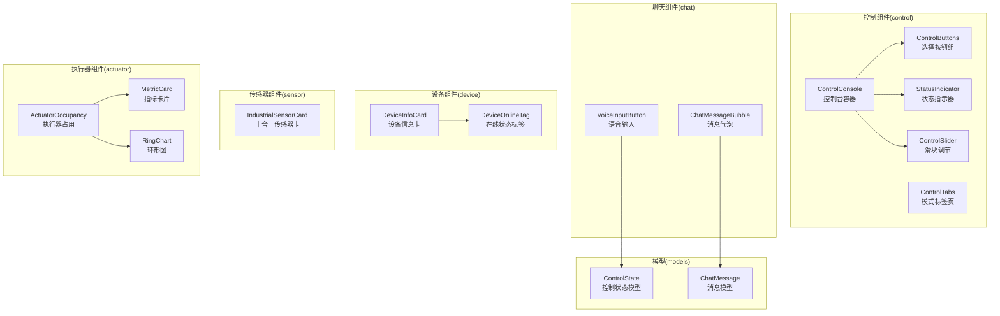
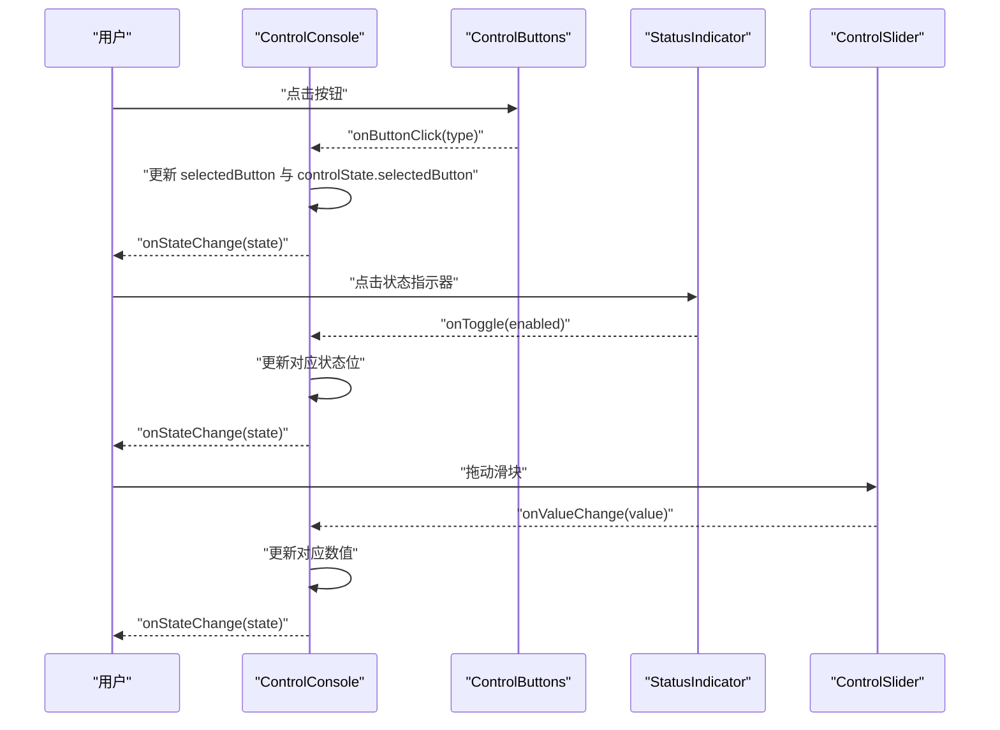
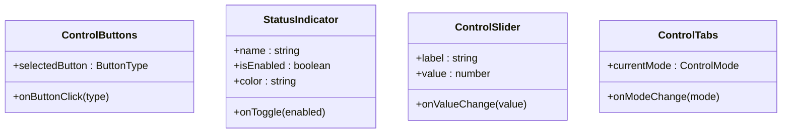
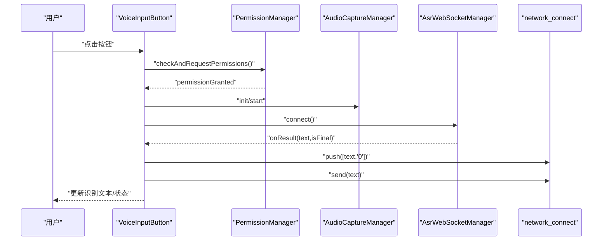
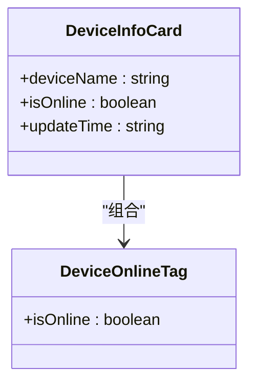
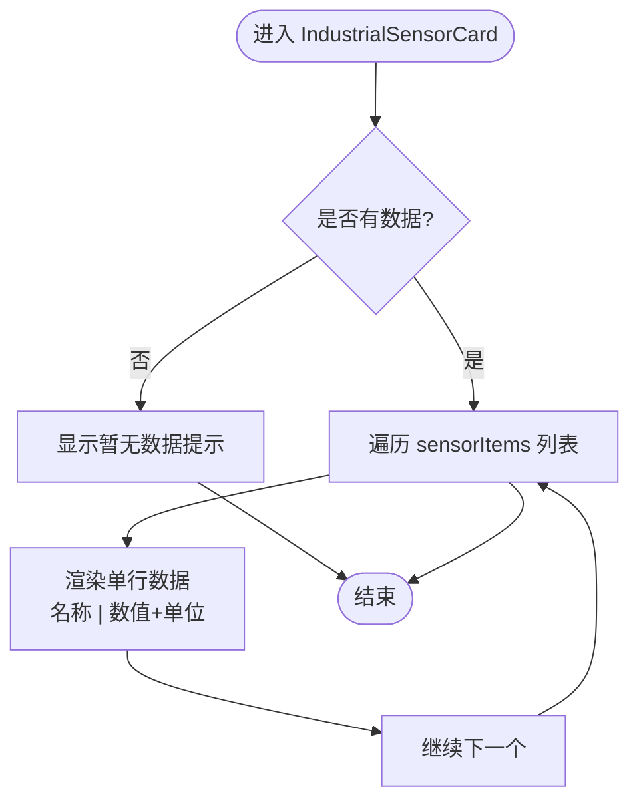
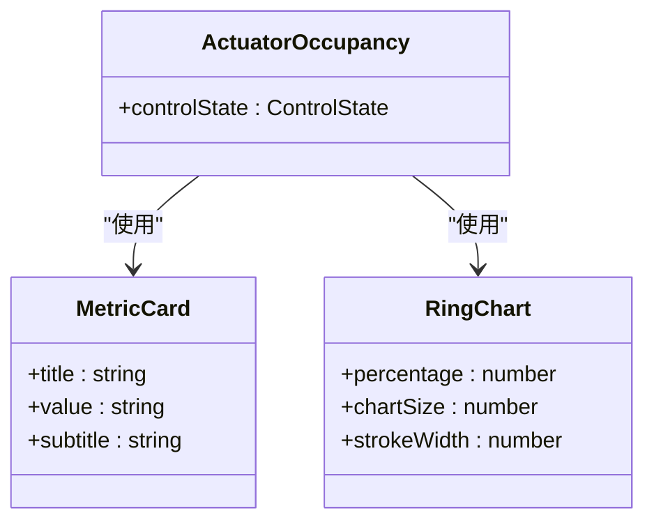
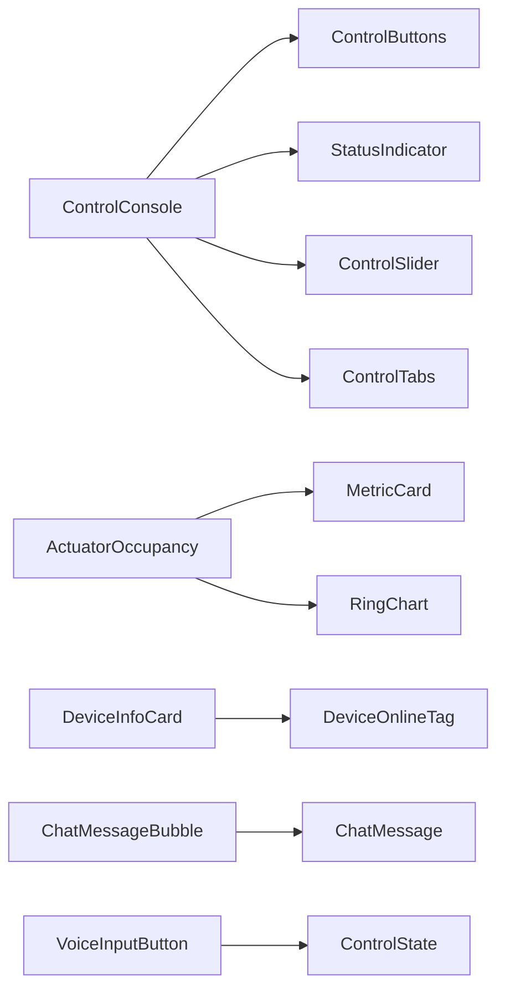

# 组件化架构设计

<cite>
**本文引用的文件**
- [ControlButtons.ets](file://entry/src/main/ets/components/control/ControlButtons.ets)
- [ControlConsole.ets](file://entry/src/main/ets/components/control/ControlConsole.ets)
- [ControlSlider.ets](file://entry/src/main/ets/components/control/ControlSlider.ets)
- [ControlTabs.ets](file://entry/src/main/ets/components/control/ControlTabs.ets)
- [StatusIndicator.ets](file://entry/src/main/ets/components/control/StatusIndicator.ets)
- [ChatMessageBubble.ets](file://entry/src/main/ets/components/chat/ChatMessageBubble.ets)
- [VoiceInputButton.ets](file://entry/src/main/ets/components/chat/VoiceInputButton.ets)
- [DeviceInfoCard.ets](file://entry/src/main/ets/components/device/DeviceInfoCard.ets)
- [DeviceOnlineTag.ets](file://entry/src/main/ets/components/device/DeviceOnlineTag.ets)
- [IndustrialSensorCard.ets](file://entry/src/main/ets/components/sensor/IndustrialSensorCard.ets)
- [ActuatorOccupancy.ets](file://entry/src/main/ets/components/actuator/ActuatorOccupancy.ets)
- [MetricCard.ets](file://entry/src/main/ets/components/actuator/MetricCard.ets)
- [RingChart.ets](file://entry/src/main/ets/components/actuator/RingChart.ets)
- [ControlState.ets](file://entry/src/main/ets/models/ControlState.ets)
- [ChatMessage.ets](file://entry/src/main/ets/models/ChatMessage.ets)
</cite>

## 目录
1. 引言
2. 项目结构
3. 核心组件
4. 架构总览
5. 详细组件分析
6. 依赖关系分析
7. 性能考虑
8. 故障排查指南
9. 结论
10. 附录

## 引言
本设计文档围绕 SmartController 的组件化架构展开，系统性梳理可复用 UI 组件的设计理念与实现方式，覆盖属性定义、事件处理、插槽机制与样式定制；明确组件分类体系（基础组件、业务组件、复合组件）；总结组件间通信模式（父子、兄弟、跨层级）；阐述生命周期管理与状态提升策略；给出设计规范与最佳实践，并结合仓库中现有组件提供实现路径与使用场景。

## 项目结构
SmartController 的组件主要位于 entry/src/main/ets/components 下，按功能域划分为 control（控制）、chat（聊天）、device（设备）、sensor（传感器）、actuator（执行器）等目录。各组件采用 ArkTS 结构体组件（struct Component）与可选的组件 V2（@ComponentV2）形式，统一通过 @Prop/@State/@Local 等装饰器进行数据与状态管理，配合常量模块（AppColors、AppDimensions）实现主题与尺寸的一致化。

图表来源
- [ControlConsole.ets](file://entry/src/main/ets/components/control/ControlConsole.ets)
- [ControlButtons.ets](file://entry/src/main/ets/components/control/ControlButtons.ets)
- [ControlSlider.ets](file://entry/src/main/ets/components/control/ControlSlider.ets)
- [StatusIndicator.ets](file://entry/src/main/ets/components/control/StatusIndicator.ets)
- [ActuatorOccupancy.ets](file://entry/src/main/ets/components/actuator/ActuatorOccupancy.ets)
- [MetricCard.ets](file://entry/src/main/ets/components/actuator/MetricCard.ets)
- [RingChart.ets](file://entry/src/main/ets/components/actuator/RingChart.ets)
- [DeviceInfoCard.ets](file://entry/src/main/ets/components/device/DeviceInfoCard.ets)
- [DeviceOnlineTag.ets](file://entry/src/main/ets/components/device/DeviceOnlineTag.ets)
- [IndustrialSensorCard.ets](file://entry/src/main/ets/components/sensor/IndustrialSensorCard.ets)
- [ChatMessageBubble.ets](file://entry/src/main/ets/components/chat/ChatMessageBubble.ets)
- [VoiceInputButton.ets](file://entry/src/main/ets/components/chat/VoiceInputButton.ets)
- [ControlState.ets](file://entry/src/main/ets/models/ControlState.ets)
- [ChatMessage.ets](file://entry/src/main/ets/models/ChatMessage.ets)

章节来源
- [ControlConsole.ets](file://entry/src/main/ets/components/control/ControlConsole.ets)
- [ControlButtons.ets](file://entry/src/main/ets/components/control/ControlButtons.ets)
- [ControlSlider.ets](file://entry/src/main/ets/components/control/ControlSlider.ets)
- [StatusIndicator.ets](file://entry/src/main/ets/components/control/StatusIndicator.ets)
- [ActuatorOccupancy.ets](file://entry/src/main/ets/components/actuator/ActuatorOccupancy.ets)
- [MetricCard.ets](file://entry/src/main/ets/components/actuator/MetricCard.ets)
- [RingChart.ets](file://entry/src/main/ets/components/actuator/RingChart.ets)
- [DeviceInfoCard.ets](file://entry/src/main/ets/components/device/DeviceInfoCard.ets)
- [DeviceOnlineTag.ets](file://entry/src/main/ets/components/device/DeviceOnlineTag.ets)
- [IndustrialSensorCard.ets](file://entry/src/main/ets/components/sensor/IndustrialSensorCard.ets)
- [ChatMessageBubble.ets](file://entry/src/main/ets/components/chat/ChatMessageBubble.ets)
- [VoiceInputButton.ets](file://entry/src/main/ets/components/chat/VoiceInputButton.ets)
- [ControlState.ets](file://entry/src/main/ets/models/ControlState.ets)
- [ChatMessage.ets](file://entry/src/main/ets/models/ChatMessage.ets)

## 核心组件
本节聚焦于控制台主容器 ControlConsole 及其子组件，展示组件化架构在状态管理、事件传递与布局组织方面的实践。

- ControlConsole：作为顶层容器，聚合 ControlButtons、StatusIndicator、ControlSlider 等子组件，负责状态初始化与变更广播。
- ControlButtons：单选按钮组，通过 @Prop 接收当前选中项，通过回调通知父级。
- StatusIndicator：状态指示器，支持点击切换状态并通过回调向上反馈。
- ControlSlider：滑块组件，提供标签、数值显示与值变化回调。
- ControlTabs：标签页组件，用于切换不同控制模式。

章节来源
- [ControlConsole.ets](file://entry/src/main/ets/components/control/ControlConsole.ets)
- [ControlButtons.ets](file://entry/src/main/ets/components/control/ControlButtons.ets)
- [StatusIndicator.ets](file://entry/src/main/ets/components/control/StatusIndicator.ets)
- [ControlSlider.ets](file://entry/src/main/ets/components/control/ControlSlider.ets)
- [ControlTabs.ets](file://entry/src/main/ets/components/control/ControlTabs.ets)

## 架构总览
下图展示了 ControlConsole 与其子组件之间的数据流与交互关系，体现“自上而下传入属性、自下而上触发回调”的典型父子通信模式。

图表来源
- [ControlConsole.ets](file://entry/src/main/ets/components/control/ControlConsole.ets)
- [ControlButtons.ets](file://entry/src/main/ets/components/control/ControlButtons.ets)
- [StatusIndicator.ets](file://entry/src/main/ets/components/control/StatusIndicator.ets)
- [ControlSlider.ets](file://entry/src/main/ets/components/control/ControlSlider.ets)

## 详细组件分析

### 控制类组件
- ControlButtons：单选按钮组，通过 @Prop 接收当前选中项，内部使用 @Builder 渲染按钮，点击后通过回调通知父组件。
- StatusIndicator：展示名称与状态圆点，点击切换状态并通过回调返回新状态。
- ControlSlider：提供标签、滑块与数值显示，支持 0-100 区间调节，回调返回数值。
- ControlTabs：标签页切换，回调返回新的控制模式。

图表来源
- [ControlButtons.ets](file://entry/src/main/ets/components/control/ControlButtons.ets)
- [StatusIndicator.ets](file://entry/src/main/ets/components/control/StatusIndicator.ets)
- [ControlSlider.ets](file://entry/src/main/ets/components/control/ControlSlider.ets)
- [ControlTabs.ets](file://entry/src/main/ets/components/control/ControlTabs.ets)

章节来源
- [ControlButtons.ets](file://entry/src/main/ets/components/control/ControlButtons.ets)
- [StatusIndicator.ets](file://entry/src/main/ets/components/control/StatusIndicator.ets)
- [ControlSlider.ets](file://entry/src/main/ets/components/control/ControlSlider.ets)
- [ControlTabs.ets](file://entry/src/main/ets/components/control/ControlTabs.ets)

### 聊天类组件
- ChatMessageBubble：根据消息类型渲染不同样式的气泡，支持系统消息与用户消息两种布局。
- VoiceInputButton：语音输入按钮，封装权限检查、音频采集与 ASR 连接，支持录音状态切换与识别结果展示，并通过网络通道发送指令。

图表来源
- [VoiceInputButton.ets](file://entry/src/main/ets/components/chat/VoiceInputButton.ets)

章节来源
- [ChatMessageBubble.ets](file://entry/src/main/ets/components/chat/ChatMessageBubble.ets)
- [VoiceInputButton.ets](file://entry/src/main/ets/components/chat/VoiceInputButton.ets)

### 设备类组件
- DeviceInfoCard：展示设备名称、在线状态与更新时间，右侧区域支持图片占位。
- DeviceOnlineTag：展示在线/离线状态的标签组件。

图表来源
- [DeviceInfoCard.ets](file://entry/src/main/ets/components/device/DeviceInfoCard.ets)
- [DeviceOnlineTag.ets](file://entry/src/main/ets/components/device/DeviceOnlineTag.ets)

章节来源
- [DeviceInfoCard.ets](file://entry/src/main/ets/components/device/DeviceInfoCard.ets)
- [DeviceOnlineTag.ets](file://entry/src/main/ets/components/device/DeviceOnlineTag.ets)

### 传感器类组件
- IndustrialSensorCard：展示多路传感器数据，支持空态提示与逐条渲染，每条包含名称、数值与单位。

图表来源
- [IndustrialSensorCard.ets](file://entry/src/main/ets/components/sensor/IndustrialSensorCard.ets)

章节来源
- [IndustrialSensorCard.ets](file://entry/src/main/ets/components/sensor/IndustrialSensorCard.ets)

### 执行器类组件
- ActuatorOccupancy：复合组件，三列布局展示指标卡片、环形图与统计卡片，并提供图例。
- MetricCard：指标卡片，展示标题、数值与副标题。
- RingChart：Canvas 绘制环形图，展示激活占比与中心文字。

图表来源
- [ActuatorOccupancy.ets](file://entry/src/main/ets/components/actuator/ActuatorOccupancy.ets)
- [MetricCard.ets](file://entry/src/main/ets/components/actuator/MetricCard.ets)
- [RingChart.ets](file://entry/src/main/ets/components/actuator/RingChart.ets)

章节来源
- [ActuatorOccupancy.ets](file://entry/src/main/ets/components/actuator/ActuatorOccupancy.ets)
- [MetricCard.ets](file://entry/src/main/ets/components/actuator/MetricCard.ets)
- [RingChart.ets](file://entry/src/main/ets/components/actuator/RingChart.ets)

## 依赖关系分析
- 控制台容器 ControlConsole 依赖 ControlButtons、StatusIndicator、ControlSlider、ControlTabs 等子组件，形成“容器-子组件”关系。
- ActuatorOccupancy 依赖 MetricCard 与 RingChart，形成“复合组件-基础组件”关系。
- 设备信息卡 DeviceInfoCard 组合 DeviceOnlineTag，体现“组合优于继承”的设计。
- 聊天组件 ChatMessageBubble 依赖 ChatMessage 模型，VoiceInputButton 依赖多个管理器与网络通道。
- 所有组件通过 @Prop/@State/@Local 与回调函数实现解耦，避免直接共享可变状态。

图表来源
- [ControlConsole.ets](file://entry/src/main/ets/components/control/ControlConsole.ets)
- [ControlButtons.ets](file://entry/src/main/ets/components/control/ControlButtons.ets)
- [StatusIndicator.ets](file://entry/src/main/ets/components/control/StatusIndicator.ets)
- [ControlSlider.ets](file://entry/src/main/ets/components/control/ControlSlider.ets)
- [ControlTabs.ets](file://entry/src/main/ets/components/control/ControlTabs.ets)
- [ActuatorOccupancy.ets](file://entry/src/main/ets/components/actuator/ActuatorOccupancy.ets)
- [MetricCard.ets](file://entry/src/main/ets/components/actuator/MetricCard.ets)
- [RingChart.ets](file://entry/src/main/ets/components/actuator/RingChart.ets)
- [DeviceInfoCard.ets](file://entry/src/main/ets/components/device/DeviceInfoCard.ets)
- [DeviceOnlineTag.ets](file://entry/src/main/ets/components/device/DeviceOnlineTag.ets)
- [ChatMessageBubble.ets](file://entry/src/main/ets/components/chat/ChatMessageBubble.ets)
- [VoiceInputButton.ets](file://entry/src/main/ets/components/chat/VoiceInputButton.ets)
- [ControlState.ets](file://entry/src/main/ets/models/ControlState.ets)
- [ChatMessage.ets](file://entry/src/main/ets/models/ChatMessage.ets)

章节来源
- [ControlConsole.ets](file://entry/src/main/ets/components/control/ControlConsole.ets)
- [ActuatorOccupancy.ets](file://entry/src/main/ets/components/actuator/ActuatorOccupancy.ets)
- [DeviceInfoCard.ets](file://entry/src/main/ets/components/device/DeviceInfoCard.ets)
- [ChatMessageBubble.ets](file://entry/src/main/ets/components/chat/ChatMessageBubble.ets)
- [VoiceInputButton.ets](file://entry/src/main/ets/components/chat/VoiceInputButton.ets)
- [ControlState.ets](file://entry/src/main/ets/models/ControlState.ets)
- [ChatMessage.ets](file://entry/src/main/ets/models/ChatMessage.ets)

## 性能考虑
- 响应式依赖追踪：组件内部通过直接读取 @State/@Prop 值来建立依赖，确保状态变化能正确触发重渲染。
- 子组件回调最小化：通过回调仅传递必要的数据（如类型、布尔值、数值），避免传递大对象导致不必要的重渲染。
- Canvas 绘制优化：RingChart 使用 Canvas 渲染，仅在 onReady 时绘制一次或按需重绘，减少重复计算。
- 列表渲染：IndustrialSensorCard 使用 ForEach 并提供稳定 key，降低列表重排成本。
- 生命周期：VoiceInputButton 在 aboutToDisappear 中释放资源，避免内存泄漏与后台占用。

## 故障排查指南
- 事件未触发：检查回调是否正确传入父组件，确认回调签名与调用时机一致。
- 状态不更新：确认 @State 与 @Prop 的使用是否正确，避免在子组件内直接修改父组件状态。
- 样式异常：核对 AppColors 与 AppDimensions 常量是否正确引入，检查主题色与尺寸变量。
- 语音识别失败：检查权限授予流程、音频采集初始化与 ASR 连接状态，关注错误回调与日志输出。
- 网络指令发送失败：捕获异常并记录错误信息，确保发送逻辑在最终态（如识别完成）才执行。

章节来源
- [VoiceInputButton.ets](file://entry/src/main/ets/components/chat/VoiceInputButton.ets)
- [ControlConsole.ets](file://entry/src/main/ets/components/control/ControlConsole.ets)

## 结论
SmartController 的组件化架构以“容器-子组件”和“复合-基础”双层结构实现高内聚低耦合。通过统一的属性与回调机制、清晰的生命周期管理与状态提升策略，实现了控制台、聊天、设备、传感器与执行器等多领域组件的可复用与可扩展。建议在后续迭代中进一步完善插槽机制与主题系统抽象，持续优化渲染性能与错误处理。

## 附录

### 组件分类体系
- 基础组件：StatusIndicator、ControlSlider、ControlTabs、MetricCard、RingChart、DeviceOnlineTag
- 业务组件：ControlButtons、ControlConsole、ChatMessageBubble、VoiceInputButton、DeviceInfoCard、IndustrialSensorCard
- 复合组件：ActuatorOccupancy

### 组件通信模式
- 父子通信：通过 @Prop 注入属性，通过回调（onXxx）向上反馈；典型如 ControlConsole 与子组件。
- 兄弟通信：通过共同父组件集中管理状态，再以 @Prop 分发给兄弟组件；典型如 ControlButtons 与 ControlSlider。
- 跨层级通信：通过顶层容器集中状态与回调，避免深层传递；典型如 ControlConsole。

### 生命周期与状态提升
- 生命周期：@ComponentV2 支持 aboutToAppear/aboutToDisappear 等生命周期钩子；典型如 VoiceInputButton。
- 状态提升：将共享状态置于最近公共父组件（如 ControlConsole），通过 @State 管理并在需要时通过回调广播。

### 设计规范与最佳实践
- 命名约定：组件名使用名词短语（如 ControlButtons、StatusIndicator），属性名使用语义化英文（如 isEnabled、value）。
- 属性设计原则：必填属性使用非可选类型，可选属性提供默认值；避免传递复杂对象，优先传递简单值或键。
- 事件命名规范：使用 onXxx 形式（如 onButtonClick、onToggle、onValueChange），保持一致性。
- 插槽机制：当前组件以 @Builder 渲染子节点为主；若需更灵活的插槽，可在父组件中以 @Builder 参数传入内容。
- 样式定制：统一从 AppColors 与 AppDimensions 引入，避免硬编码颜色与尺寸；必要时通过 @Prop 传入主题变量。

### 使用场景示例（路径指引）
- 控制台容器：在页面中引入 ControlConsole，并监听 onStateChange 回调以同步全局状态。
- 语音输入：在聊天页引入 VoiceInputButton，确保权限与网络通道可用。
- 设备信息：在设备详情页引入 DeviceInfoCard，传入设备名称、在线状态与更新时间。
- 传感器数据：在数据页引入 IndustrialSensorCard，传入 sensorItems 列表。
- 执行器占用：在首页引入 ActuatorOccupancy，传入 ControlState 以展示指标与环形图。