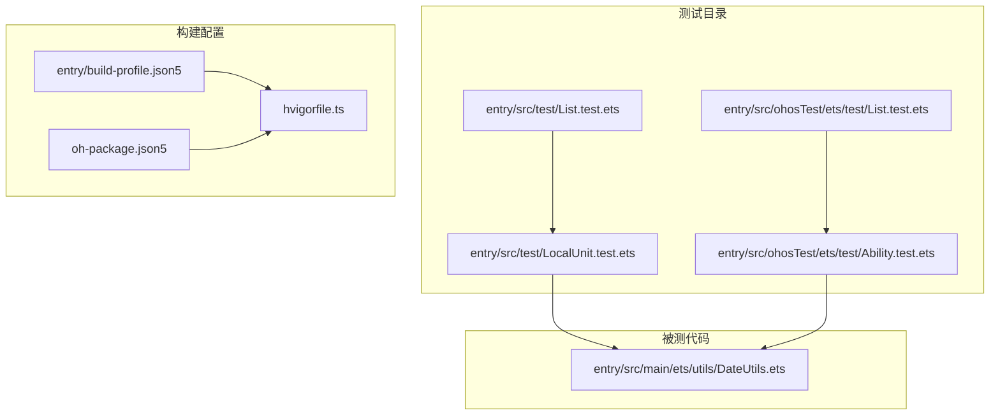
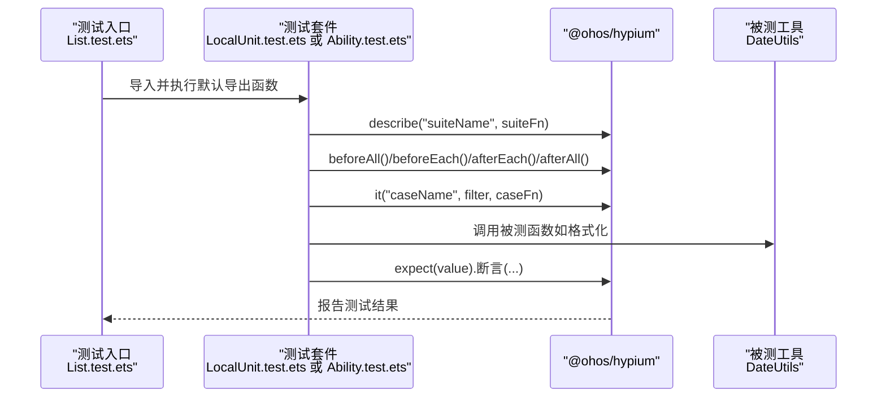
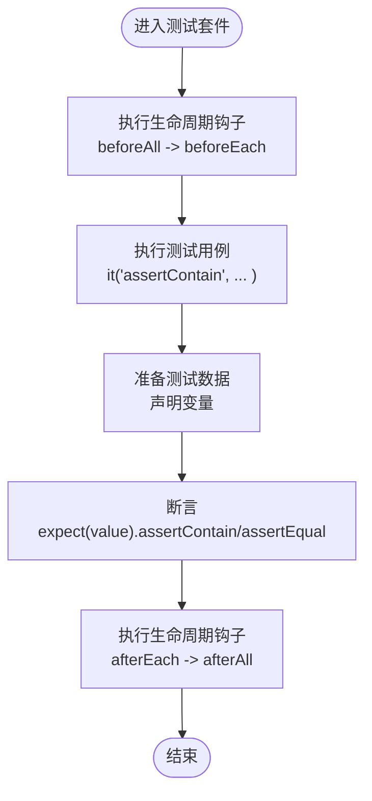
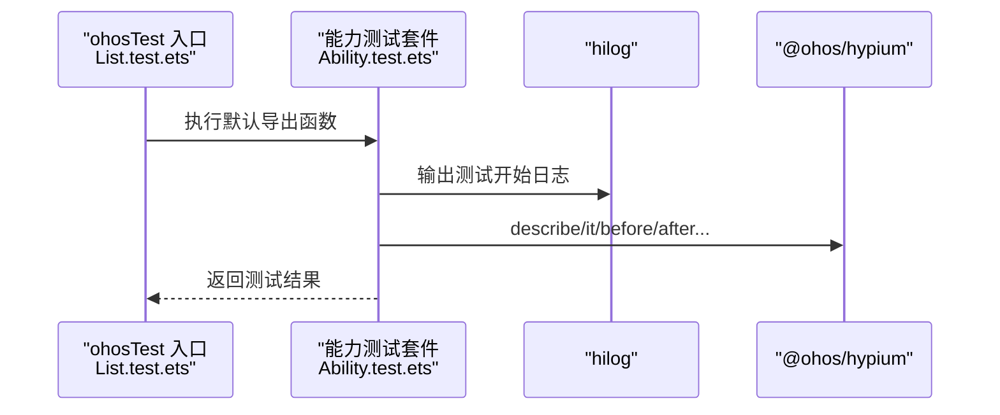
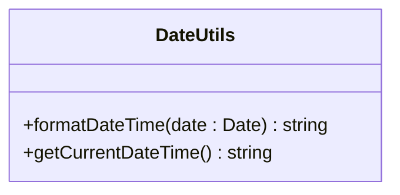
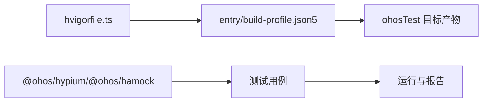

# 单元测试

<cite>
**本文引用的文件**
- [LocalUnit.test.ets](file://entry/src/test/LocalUnit.test.ets)
- [List.test.ets（测试入口）](file://entry/src/test/List.test.ets)
- [Ability.test.ets](file://entry/src/ohosTest/ets/test/Ability.test.ets)
- [List.test.ets（ohosTest 测试入口）](file://entry/src/ohosTest/ets/test/List.test.ets)
- [DateUtils.ets](file://entry/src/main/ets/utils/DateUtils.ets)
- [build-profile.json5（项目根）](file://build-profile.json5)
- [entry/build-profile.json5](file://entry/build-profile.json5)
- [oh-package.json5](file://oh-package.json5)
- [hvigorfile.ts](file://hvigorfile.ts)
</cite>

## 目录
1. [引言](#引言)
2. [项目结构](#项目结构)
3. [核心组件](#核心组件)
4. [架构总览](#架构总览)
5. [详细组件分析](#详细组件分析)
6. [依赖分析](#依赖分析)
7. [性能考虑](#性能考虑)
8. [故障排查指南](#故障排查指南)
9. [结论](#结论)
10. [附录](#附录)

## 引言
本文件面向开发者，系统性梳理本项目的单元测试体系与最佳实践，涵盖测试框架配置、测试用例编写规范、断言策略、测试数据准备、测试套件组织、测试结果验证、覆盖率统计与报告生成等主题。文档以仓库中已有的测试样例为基础，结合工程配置文件，给出可操作的实施建议与常见问题解决方案。

## 项目结构
项目采用分层模块化组织，测试相关目录位于 entry 模块下，包含两类测试入口：
- 本地单元测试入口：entry/src/test/LocalUnit.test.ets 与入口 List.test.ets
- ohosTest 能力测试入口：entry/src/ohosTest/ets/test/Ability.test.ets 与入口 List.test.ets

构建与运行通过 hvigor 构建系统驱动，entry/build-profile.json5 中定义了 ohosTest 目标产物，用于区分普通应用构建与测试构建。

**图表来源**
- [LocalUnit.test.ets:1-33](file://entry/src/test/LocalUnit.test.ets#L1-L33)
- [List.test.ets（测试入口）:1-5](file://entry/src/test/List.test.ets#L1-L5)
- [Ability.test.ets:1-35](file://entry/src/ohosTest/ets/test/Ability.test.ets#L1-L35)
- [List.test.ets（ohosTest 测试入口）:1-5](file://entry/src/ohosTest/ets/test/List.test.ets#L1-L5)
- [DateUtils.ets:1-28](file://entry/src/main/ets/utils/DateUtils.ets#L1-L28)
- [entry/build-profile.json5:25-33](file://entry/build-profile.json5#L25-L33)
- [hvigorfile.ts:1-6](file://hvigorfile.ts#L1-L6)

**章节来源**
- [LocalUnit.test.ets:1-33](file://entry/src/test/LocalUnit.test.ets#L1-L33)
- [List.test.ets（测试入口）:1-5](file://entry/src/test/List.test.ets#L1-L5)
- [Ability.test.ets:1-35](file://entry/src/ohosTest/ets/test/Ability.test.ets#L1-L35)
- [List.test.ets（ohosTest 测试入口）:1-5](file://entry/src/ohosTest/ets/test/List.test.ets#L1-L5)
- [entry/build-profile.json5:25-33](file://entry/build-profile.json5#L25-L33)
- [hvigorfile.ts:1-6](file://hvigorfile.ts#L1-L6)

## 核心组件
- 测试框架与断言
  - 使用 @ohos/hypium 提供的 describe、beforeAll、beforeEach、afterEach、afterAll、it、expect 等 API 组织测试套件与用例，并进行断言。
  - 断言示例：expect(a).assertContain(b)、expect(a).assertEqual(a)。
- 测试入口与套件组织
  - 本地测试入口：List.test.ets 导入并执行 LocalUnit.test.ets 中的测试套件。
  - ohosTest 能力测试入口：List.test.ets 导入并执行 Ability.test.ets 中的测试套件。
- 工具函数与被测对象
  - DateUtils 类提供日期格式化与当前时间获取能力，适合作为工具函数测试目标。

**章节来源**
- [LocalUnit.test.ets:1-33](file://entry/src/test/LocalUnit.test.ets#L1-L33)
- [List.test.ets（测试入口）:1-5](file://entry/src/test/List.test.ets#L1-L5)
- [Ability.test.ets:1-35](file://entry/src/ohosTest/ets/test/Ability.test.ets#L1-L35)
- [List.test.ets（ohosTest 测试入口）:1-5](file://entry/src/ohosTest/ets/test/List.test.ets#L1-L5)
- [DateUtils.ets:1-28](file://entry/src/main/ets/utils/DateUtils.ets#L1-L28)

## 架构总览
下图展示了测试从入口到具体用例的调用关系与生命周期钩子：

**图表来源**
- [LocalUnit.test.ets:3-32](file://entry/src/test/LocalUnit.test.ets#L3-L32)
- [List.test.ets（测试入口）:3-5](file://entry/src/test/List.test.ets#L3-L5)
- [Ability.test.ets:4-34](file://entry/src/ohosTest/ets/test/Ability.test.ets#L4-L34)
- [List.test.ets（ohosTest 测试入口）:3-5](file://entry/src/ohosTest/ets/test/List.test.ets#L3-L5)
- [DateUtils.ets:10-27](file://entry/src/main/ets/utils/DateUtils.ets#L10-L27)

## 详细组件分析

### 本地单元测试套件（LocalUnit.test.ets）
- 套件组织
  - 使用 describe 定义测试套件；使用 beforeAll/beforeEach/afterEach/afterAll 管理测试生命周期。
  - 使用 it 定义单个测试用例，第三个参数为用例函数体。
- 断言策略
  - 使用 expect(value) 进行断言，示例包含 assertContain 与 assertEqual。
- 数据准备
  - 在用例函数体内声明简单变量（如字符串）作为输入数据，便于快速验证逻辑分支与边界条件。
- 可扩展性
  - 可在 beforeEach/afterEach 中注入或清理更复杂的测试环境（如模拟对象、临时状态）。

**图表来源**
- [LocalUnit.test.ets:6-31](file://entry/src/test/LocalUnit.test.ets#L6-L31)

**章节来源**
- [LocalUnit.test.ets:1-33](file://entry/src/test/LocalUnit.test.ets#L1-L33)

### ohosTest 能力测试套件（Ability.test.ets）
- 能力测试定位
  - 该套件位于 ohosTest 目标下，适合进行设备级或系统级能力验证（例如日志输出、性能分析等）。
- 性能分析集成
  - 示例中引入 hilog 并在用例开始处输出日志，便于性能分析与调试。
- 生命周期与断言
  - 结构与本地套件一致，便于统一维护与迁移。

**图表来源**
- [Ability.test.ets:27-33](file://entry/src/ohosTest/ets/test/Ability.test.ets#L27-L33)
- [List.test.ets（ohosTest 测试入口）:3-5](file://entry/src/ohosTest/ets/test/List.test.ets#L3-L5)

**章节来源**
- [Ability.test.ets:1-35](file://entry/src/ohosTest/ets/test/Ability.test.ets#L1-L35)
- [List.test.ets（ohosTest 测试入口）:1-5](file://entry/src/ohosTest/ets/test/List.test.ets#L1-L5)

### 工具函数测试（DateUtils）
- 测试目标
  - DateUtils 提供日期格式化与当前时间获取两个静态方法，适合单元测试覆盖。
- 推荐测试点
  - formatDateTime：校验格式化输出是否符合预期；覆盖月份/日期/小时等两位数补零场景。
  - getCurrentDateTime：校验返回值类型与基本格式一致性。
- 测试数据准备
  - 使用固定时间戳构造 Date 对象，确保断言稳定可靠；或使用时间戳偏移构造边界场景（如月末、年末）。

**图表来源**
- [DateUtils.ets:4-27](file://entry/src/main/ets/utils/DateUtils.ets#L4-L27)

**章节来源**
- [DateUtils.ets:1-28](file://entry/src/main/ets/utils/DateUtils.ets#L1-L28)

### 测试入口与套件组织
- 本地测试入口
  - List.test.ets 导入并执行 LocalUnit.test.ets 的默认导出函数，形成统一的测试入口。
- ohosTest 入口
  - List.test.ets 导入并执行 Ability.test.ets 的默认导出函数，支持能力测试场景。
- 套件命名与过滤
  - 建议为每个套件设置清晰的名称，便于筛选与报告解析；it 的第三个参数可用于过滤（示例中传入数字）。

**章节来源**
- [List.test.ets（测试入口）:1-5](file://entry/src/test/List.test.ets#L1-L5)
- [List.test.ets（ohosTest 测试入口）:1-5](file://entry/src/ohosTest/ets/test/List.test.ets#L1-L5)

## 依赖分析
- 测试框架与工具
  - @ohos/hypium：提供测试生命周期与断言能力。
  - @ohos/hamock：提供模拟与桩能力（可在需要时引入）。
- 构建与运行
  - hvigorfile.ts 配置了系统任务与插件扩展点。
  - entry/build-profile.json5 定义了 ohosTest 目标产物，用于区分测试构建。
  - 顶层 build-profile.json5 提供产品与签名配置，间接影响测试运行环境。

**图表来源**
- [hvigorfile.ts:1-6](file://hvigorfile.ts#L1-L6)
- [entry/build-profile.json5:25-33](file://entry/build-profile.json5#L25-L33)
- [oh-package.json5:5-8](file://oh-package.json5#L5-L8)

**章节来源**
- [hvigorfile.ts:1-6](file://hvigorfile.ts#L1-L6)
- [entry/build-profile.json5:25-33](file://entry/build-profile.json5#L25-L33)
- [oh-package.json5:1-9](file://oh-package.json5#L1-L9)

## 性能考虑
- 日志与性能分析
  - 能力测试中可通过 hilog 输出关键节点日志，辅助定位性能瓶颈。
- 测试执行顺序与隔离
  - 合理使用生命周期钩子，避免跨用例共享状态导致的不确定性。
- 断言与数据准备
  - 尽量减少复杂对象构造与外部依赖，提升测试稳定性与执行速度。

## 故障排查指南
- 测试入口未执行
  - 确认入口文件正确导入并执行对应套件的默认导出函数。
- 断言失败
  - 使用更明确的断言与错误信息，必要时打印中间状态辅助定位。
- 构建目标不匹配
  - 确认构建目标为 ohosTest（若需能力测试），并检查 entry/build-profile.json5 中的 targets 配置。
- 依赖缺失
  - 确认 @ohos/hypium 与 @ohos/hamock 已安装并在 devDependencies 中声明。

**章节来源**
- [List.test.ets（测试入口）:1-5](file://entry/src/test/List.test.ets#L1-L5)
- [List.test.ets（ohosTest 测试入口）:1-5](file://entry/src/ohosTest/ets/test/List.test.ets#L1-L5)
- [Ability.test.ets:27-33](file://entry/src/ohosTest/ets/test/Ability.test.ets#L27-L33)
- [entry/build-profile.json5:25-33](file://entry/build-profile.json5#L25-L33)
- [oh-package.json5:5-8](file://oh-package.json5#L5-L8)

## 结论
本项目已具备基础的单元测试与能力测试框架，通过统一的入口与生命周期钩子管理，能够稳定地组织测试用例并进行断言验证。建议后续逐步完善工具函数与业务逻辑的覆盖度，引入更丰富的断言与模拟手段，并结合构建配置生成测试报告与覆盖率统计，持续提升测试质量与效率。

## 附录

### 测试用例编写规范
- 命名规范
  - 套件名称清晰表达测试范围；用例名称描述期望行为与前置条件。
- 断言策略
  - 使用 expect(value) 进行断言；优先选择语义明确的断言方法（如包含、相等、类型判断等）。
- 数据准备
  - 使用固定时间戳或边界值构造输入数据；避免依赖不可控的外部状态。
- 生命周期
  - 在 beforeEach/afterEach 中完成必要的初始化与清理，保证用例独立性。

### 测试数据准备示例思路
- 工具函数测试
  - 使用固定日期对象构造输入，覆盖正常路径与边界场景（如 00:00:00、12:30:45 等）。
- 业务逻辑测试
  - 准备最小化的模型对象或 DTO，仅包含必要字段，避免冗余依赖。

### 测试结果验证与报告
- 运行方式
  - 通过构建系统触发测试入口，执行对应套件中的所有用例。
- 报告生成
  - 基于测试框架输出与构建日志，汇总通过/失败用例与断言详情。
- 覆盖率统计
  - 建议在构建配置中启用覆盖率收集（如 ArkTS 编译选项），并在 CI 中生成覆盖率报告。