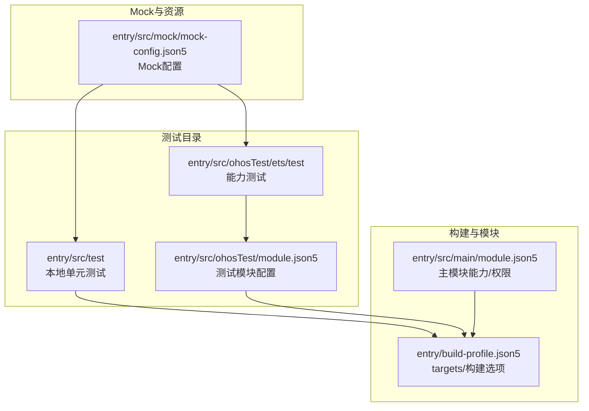
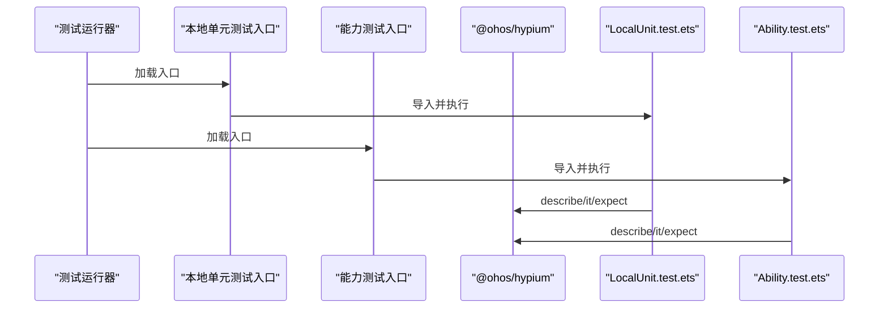
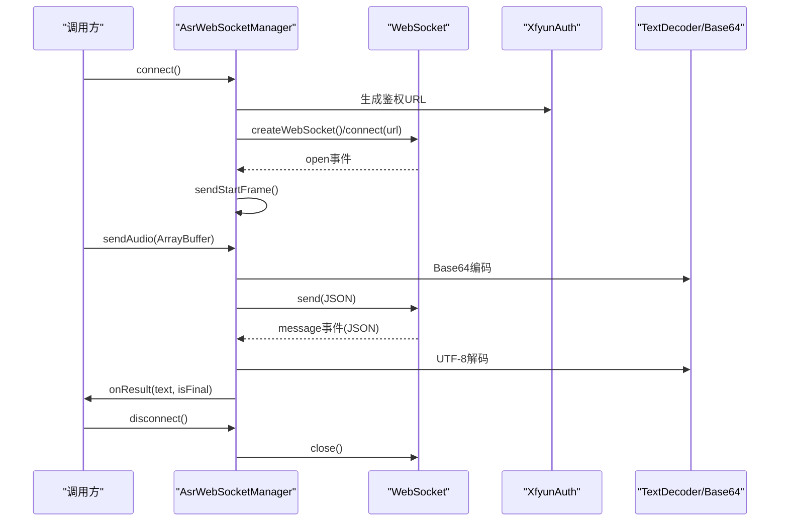
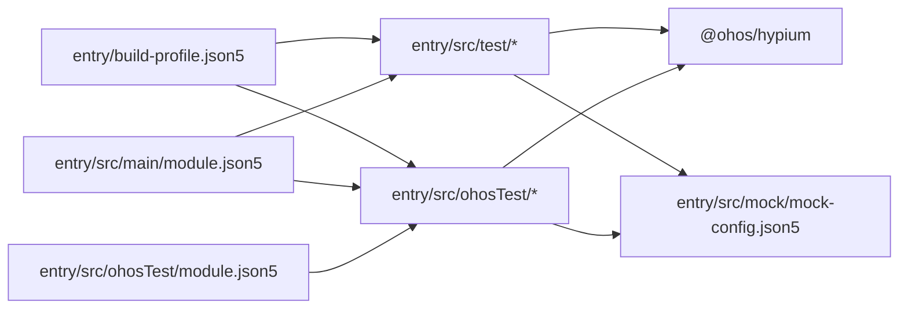

# 测试策略

<cite>
**本文引用的文件**
- [entry\src\test\List.test.ets](file://entry/src/test/List.test.ets)
- [entry\src\test\LocalUnit.test.ets](file://entry/src/test/LocalUnit.test.ets)
- [entry\src\ohosTest\ets\test\Ability.test.ets](file://entry/src/ohosTest/ets/test/Ability.test.ets)
- [entry\src\ohosTest\ets\test\List.test.ets](file://entry/src/ohosTest/ets/test/List.test.ets)
- [entry\build-profile.json5](file://entry/build-profile.json5)
- [entry\src\main\module.json5](file://entry/src/main/module.json5)
- [entry\src\ohosTest\module.json5](file://entry/src/ohosTest/module.json5)
- [entry\src\mock\mock-config.json5](file://entry/src/mock/mock-config.json5)
- [entry\src\main\ets\common\Constants.ets](file://entry/src/main/ets/common/Constants.ets)
- [entry\src\main\ets\managers\AsrWebSocketManager.ets](file://entry/src/main/ets/managers/AsrWebSocketManager.ets)
- [entry\src\main\ets\models\ChatMessage.ets](file://entry/src/main/ets/models/ChatMessage.ets)
- [entry\src\main\ets\models\ControlState.ets](file://entry/src/main/ets/models/ControlState.ets)
</cite>

## 目录
1. [简介](#简介)
2. [项目结构](#项目结构)
3. [核心组件](#核心组件)
4. [架构总览](#架构总览)
5. [详细组件分析](#详细组件分析)
6. [依赖分析](#依赖分析)
7. [性能考虑](#性能考虑)
8. [故障排查指南](#故障排查指南)
9. [结论](#结论)
10. [附录](#附录)

## 简介
本文件面向 SmartController 项目，系统化构建测试策略文档，覆盖单元测试、组件测试、集成测试与端到端测试的设计与实施要点；提供模拟数据与 Mock 设计建议；给出覆盖率统计与持续集成中的自动化测试流程建议；并补充性能与压力测试的落地指南及测试最佳实践。

## 项目结构
项目采用多模块组织方式，测试相关目录与文件如下：
- 单元测试入口与样例：entry/src/test
- 能力测试入口与样例：entry/src/ohosTest/ets/test
- 构建配置：entry/build-profile.json5（含 targets、测试目标）
- 主模块清单：entry/src/main/module.json5（主模块能力与权限）
- 测试模块清单：entry/src/ohosTest/module.json5（测试模块声明）
- Mock 配置：entry/src/mock/mock-config.json5（空配置占位）

**图表来源**
- [entry\build-profile.json5:1-33](file://entry/build-profile.json5#L1-L33)
- [entry\src\main\module.json5:1-71](file://entry/src/main/module.json5#L1-L71)
- [entry\src\ohosTest\module.json5:1-12](file://entry/src/ohosTest/module.json5#L1-L12)
- [entry\src\test\List.test.ets:1-5](file://entry/src/test/List.test.ets#L1-L5)
- [entry\src\ohosTest\ets\test\List.test.ets:1-5](file://entry/src/ohosTest/ets/test/List.test.ets#L1-L5)
- [entry\src\mock\mock-config.json5:1-2](file://entry/src/mock/mock-config.json5#L1-L2)

**章节来源**
- [entry\build-profile.json5:1-33](file://entry/build-profile.json5#L1-L33)
- [entry\src\main\module.json5:1-71](file://entry/src/main/module.json5#L1-L71)
- [entry\src\ohosTest\module.json5:1-12](file://entry/src/ohosTest/module.json5#L1-L12)
- [entry\src\test\List.test.ets:1-5](file://entry/src/test/List.test.ets#L1-L5)
- [entry\src\ohosTest\ets\test\List.test.ets:1-5](file://entry/src/ohosTest/ets/test/List.test.ets#L1-L5)
- [entry\src\mock\mock-config.json5:1-2](file://entry/src/mock/mock-config.json5#L1-L2)

## 核心组件
- 测试框架与断言
  - 使用 @ohos/hypium 提供的 describe、beforeAll、beforeEach、afterEach、afterAll、it、expect 等 API 组织测试套件与用例，并通过 expect 的断言方法进行条件验证。
  - 示例参考：[LocalUnit.test.ets:1-33](file://entry/src/test/LocalUnit.test.ets#L1-L33)、[Ability.test.ets:1-35](file://entry/src/ohosTest/ets/test/Ability.test.ets#L1-L35)

- 测试入口与组合
  - 本地单元测试入口：[List.test.ets:1-5](file://entry/src/test/List.test.ets#L1-L5)
  - 能力测试入口：[List.test.ets:1-5](file://entry/src/ohosTest/ets/test/List.test.ets#L1-L5)
  - 两者均通过导出 testsuite 函数聚合具体测试函数，便于统一运行。

- 模块与构建配置
  - 主模块声明与权限：[module.json5:1-71](file://entry/src/main/module.json5#L1-L71)
  - 测试模块声明：[module.json5:1-12](file://entry/src/ohosTest/module.json5#L1-L12)
  - 构建目标与测试目标：[build-profile.json5:25-32](file://entry/build-profile.json5#L25-L32)

**章节来源**
- [entry\src\test\LocalUnit.test.ets:1-33](file://entry/src/test/LocalUnit.test.ets#L1-L33)
- [entry\src\ohosTest\ets\test\Ability.test.ets:1-35](file://entry/src/ohosTest/ets/test/Ability.test.ets#L1-L35)
- [entry\src\test\List.test.ets:1-5](file://entry/src/test/List.test.ets#L1-L5)
- [entry\src\ohosTest\ets\test\List.test.ets:1-5](file://entry/src/ohosTest/ets/test/List.test.ets#L1-L5)
- [entry\src\main\module.json5:1-71](file://entry/src/main/module.json5#L1-L71)
- [entry\src\ohosTest\module.json5:1-12](file://entry/src/ohosTest/module.json5#L1-L12)
- [entry\build-profile.json5:25-32](file://entry/build-profile.json5#L25-L32)

## 架构总览
测试体系由“测试入口 -> 测试套件 -> 断言”构成，结合构建配置与模块声明，形成可执行的测试目标。下图展示测试入口与测试套件的关系：

**图表来源**
- [entry\src\test\List.test.ets:1-5](file://entry/src/test/List.test.ets#L1-L5)
- [entry\src\ohosTest\ets\test\List.test.ets:1-5](file://entry/src/ohosTest/ets/test/List.test.ets#L1-L5)
- [entry\src\test\LocalUnit.test.ets:1-33](file://entry/src/test/LocalUnit.test.ets#L1-L33)
- [entry\src\ohosTest\ets\test\Ability.test.ets:1-35](file://entry/src/ohosTest/ets/test/Ability.test.ets#L1-L35)

## 详细组件分析

### 单元测试实现方法
- 测试框架配置
  - 使用 @ohos/hypium 的生命周期钩子组织测试准备与清理，确保测试隔离性与可重复性。
  - 参考：[LocalUnit.test.ets:3-23](file://entry/src/test/LocalUnit.test.ets#L3-L23)

- 测试用例编写
  - 使用 describe 定义测试套件，使用 it 定义单个测试用例，命名清晰、职责单一。
  - 参考：[LocalUnit.test.ets:4-31](file://entry/src/test/LocalUnit.test.ets#L4-L31)

- 断言策略
  - 使用 expect 提供的断言方法对预期结果进行验证，如字符串包含、相等性等。
  - 参考：[LocalUnit.test.ets:24-30](file://entry/src/test/LocalUnit.test.ets#L24-L30)

- 最佳实践
  - 用例粒度小、关注点明确；前置/后置钩子仅做必要准备与清理；避免共享状态污染。

**章节来源**
- [entry\src\test\LocalUnit.test.ets:1-33](file://entry/src/test/LocalUnit.test.ets#L1-L33)

### 组件测试技术方案
- 组件渲染测试
  - 建议：针对 UI 组件（如 ActuatorOccupancy、MetricCard、RingChart 等）编写渲染断言，验证 props 输入与输出视图一致性。
  - 方法：通过 @ohos/hypium 的断言 API 对组件输出进行断言；若需 DOM/节点访问，可在能力测试中结合 hilog 辅助定位。

- 交互行为测试
  - 建议：对交互组件（如 ControlButtons、ControlSlider、VoiceInputButton）进行事件驱动测试，覆盖点击、滑动、语音输入等路径。
  - 方法：构造事件输入，断言回调触发与状态更新。

- 状态管理测试
  - 建议：围绕 ControlState、ChatMessage 等模型进行状态变更测试，验证初始值、边界值与转换规则。
  - 方法：构造不同输入场景，断言状态对象的属性变化。

- 参考模型与接口
  - 控制状态模型：[ControlState.ets:1-67](file://entry/src/main/ets/models/ControlState.ets#L1-L67)
  - 聊天消息模型：[ChatMessage.ets:1-9](file://entry/src/main/ets/models/ChatMessage.ets#L1-L9)

**章节来源**
- [entry\src\main\ets\models\ControlState.ets:1-67](file://entry/src/main/ets/models/ControlState.ets#L1-L67)
- [entry\src\main\ets\models\ChatMessage.ets:1-9](file://entry/src/main/ets/models/ChatMessage.ets#L1-L9)

### 集成测试设计思路
- 模块间协作测试
  - 建议：以 AsrWebSocketManager 为核心，验证其与 XfyunAuth、WebSocket、Base64/TextDecoder 等模块的协作。
  - 关注点：连接建立、消息收发、错误处理、关闭流程。

- API 接口测试
  - 建议：对 WebSocket 接口（open/message/error/close）进行事件驱动测试，断言回调触发顺序与参数。
  - 参考：[AsrWebSocketManager.ets:92-144](file://entry/src/main/ets/managers/AsrWebSocketManager.ets#L92-L144)

- 端到端流程测试
  - 建议：从音频采集到 ASR 结果回调的完整链路进行测试，覆盖正常路径与异常路径（网络中断、鉴权失败等）。
  - 参考：[AsrWebSocketManager.ets:197-254](file://entry/src/main/ets/managers/AsrWebSocketManager.ets#L197-L254)

**图表来源**
- [entry\src\main\ets\managers\AsrWebSocketManager.ets:92-144](file://entry/src/main/ets/managers/AsrWebSocketManager.ets#L92-L144)
- [entry\src\main\ets\managers\AsrWebSocketManager.ets:197-254](file://entry/src/main/ets/managers/AsrWebSocketManager.ets#L197-L254)

**章节来源**
- [entry\src\main\ets\managers\AsrWebSocketManager.ets:1-271](file://entry/src/main/ets/managers/AsrWebSocketManager.ets#L1-L271)

### 模拟数据与 Mock 策略
- 测试数据生成
  - 建议：为模型类（如 ControlState、ChatMessage）提供工厂函数或构造器变体，快速生成典型与边界场景数据。
  - 参考：[ControlState.ets:54-66](file://entry/src/main/ets/models/ControlState.ets#L54-L66)

- Mock 对象设计
  - 建议：对网络层（WebSocket）、工具层（Base64/TextDecoder）与外部服务（XfyunAuth）进行接口抽象与替换，使用 Mock 实现可控的输入输出。
  - 参考：[AsrWebSocketManager.ets:266-270](file://entry/src/main/ets/managers/AsrWebSocketManager.ets#L266-L270)

- 测试环境隔离
  - 建议：通过构建配置 targets 区分默认与 ohosTest 目标，确保测试模块独立运行；利用 mock-config.json5 扩展 Mock 规则。
  - 参考：[build-profile.json5:25-32](file://entry/build-profile.json5#L25-L32)、[mock-config.json5:1-2](file://entry/src/mock/mock-config.json5#L1-L2)

**章节来源**
- [entry\src\main\ets\models\ControlState.ets:54-66](file://entry/src/main/ets/models/ControlState.ets#L54-L66)
- [entry\src\main\ets\managers\AsrWebSocketManager.ets:266-270](file://entry/src/main/ets/managers/AsrWebSocketManager.ets#L266-L270)
- [entry\build-profile.json5:25-32](file://entry/build-profile.json5#L25-L32)
- [entry\src\mock\mock-config.json5:1-2](file://entry/src/mock/mock-config.json5#L1-L2)

### 测试覆盖率统计与持续集成
- 覆盖率统计
  - 建议：在构建配置中启用覆盖率收集（如 ArkTS/ESLint 配置），结合测试运行器输出报告。
  - 参考：[build-profile.json5:10-24](file://entry/build-profile.json5#L10-L24)

- 自动化测试流程
  - 建议：在 CI 中执行以下步骤：
    1) 安装依赖与构建
    2) 运行本地单元测试与能力测试
    3) 生成覆盖率报告并上传
  - 参考：测试入口与目标配置
    - [List.test.ets:1-5](file://entry/src/test/List.test.ets#L1-L5)
    - [List.test.ets:1-5](file://entry/src/ohosTest/ets/test/List.test.ets#L1-L5)
    - [build-profile.json5:25-32](file://entry/build-profile.json5#L25-L32)

**章节来源**
- [entry\build-profile.json5:10-24](file://entry/build-profile.json5#L10-L24)
- [entry\src\test\List.test.ets:1-5](file://entry/src/test/List.test.ets#L1-L5)
- [entry\src\ohosTest\ets\test\List.test.ets:1-5](file://entry/src/ohosTest/ets/test/List.test.ets#L1-L5)
- [entry\build-profile.json5:25-32](file://entry/build-profile.json5#L25-L32)

### 性能测试与压力测试
- 性能测试
  - 建议：对关键路径（如音频编码、WebSocket 消息处理）进行基准测试，记录耗时与内存占用。
  - 参考：[AsrWebSocketManager.ets:266-270](file://entry/src/main/ets/managers/AsrWebSocketManager.ets#L266-L270)

- 压力测试
  - 建议：构造高并发消息流与异常场景（大量错误事件、网络抖动），评估系统的稳定性与恢复能力。
  - 参考：[AsrWebSocketManager.ets:112-133](file://entry/src/main/ets/managers/AsrWebSocketManager.ets#L112-L133)

**章节来源**
- [entry\src\main\ets\managers\AsrWebSocketManager.ets:266-270](file://entry/src/main/ets/managers/AsrWebSocketManager.ets#L266-L270)
- [entry\src\main\ets\managers\AsrWebSocketManager.ets:112-133](file://entry/src/main/ets/managers/AsrWebSocketManager.ets#L112-L133)

### 测试最佳实践
- 用例设计
  - 单一职责：每个用例聚焦一个行为或边界条件
  - 可读性：清晰的命名与注释，便于他人理解
  - 可维护性：减少对实现细节的耦合，优先断言行为结果

- 断言策略
  - 使用语义化断言，避免对内部实现细节进行断言
  - 对异步流程使用超时与重试机制，保证稳定性

- Mock 与隔离
  - 明确 Mock 范围，避免过度 Mock 导致测试失真
  - 在能力测试中结合 hilog 输出辅助定位问题

- 持续集成
  - 将测试纳入 CI 流水线，确保每次提交都运行关键测试
  - 覆盖率阈值与失败策略应明确并可配置

## 依赖分析
测试相关模块之间的依赖关系如下：

**图表来源**
- [entry\build-profile.json5:1-33](file://entry/build-profile.json5#L1-L33)
- [entry\src\main\module.json5:1-71](file://entry/src/main/module.json5#L1-L71)
- [entry\src\ohosTest\module.json5:1-12](file://entry/src/ohosTest/module.json5#L1-L12)
- [entry\src\test\List.test.ets:1-5](file://entry/src/test/List.test.ets#L1-L5)
- [entry\src\ohosTest\ets\test\List.test.ets:1-5](file://entry/src/ohosTest/ets/test/List.test.ets#L1-L5)
- [entry\src\mock\mock-config.json5:1-2](file://entry/src/mock/mock-config.json5#L1-L2)

**章节来源**
- [entry\build-profile.json5:1-33](file://entry/build-profile.json5#L1-L33)
- [entry\src\main\module.json5:1-71](file://entry/src/main/module.json5#L1-L71)
- [entry\src\ohosTest\module.json5:1-12](file://entry/src/ohosTest/module.json5#L1-L12)
- [entry\src\test\List.test.ets:1-5](file://entry/src/test/List.test.ets#L1-L5)
- [entry\src\ohosTest\ets\test\List.test.ets:1-5](file://entry/src/ohosTest/ets/test/List.test.ets#L1-L5)
- [entry\src\mock\mock-config.json5:1-2](file://entry/src/mock/mock-config.json5#L1-L2)

## 性能考虑
- 测试执行性能
  - 合理拆分测试套件，避免长链路测试阻塞整体流水线
  - 使用 Mock 降低外部依赖带来的不确定性

- 资源与并发
  - 在能力测试中注意并发事件的顺序与竞态条件
  - 对网络与 I/O 操作设置合理超时

- 报告与回归
  - 记录关键指标（耗时、内存、错误率），建立回归基线

## 故障排查指南
- 常见问题
  - 测试无法启动：检查测试入口是否正确导出 testsuite，构建目标是否包含 ohosTest
  - 断言失败：核对期望值与实际输出，必要时增加日志输出
  - 异步流程不稳定：为异步回调添加超时与重试，确保事件顺序可控

- 定位手段
  - 使用 hilog 输出关键事件与状态
  - 在能力测试中逐步缩小问题范围，优先验证最小可复现场景

**章节来源**
- [entry\src\ohosTest\ets\test\Ability.test.ets:27-33](file://entry/src/ohosTest/ets/test/Ability.test.ets#L27-L33)

## 结论
本测试策略文档基于现有测试入口与配置，给出了单元测试、组件测试、集成测试与端到端测试的实施建议，并提供了 Mock 与覆盖率统计、CI 自动化、性能与压力测试的落地指南。建议在后续迭代中逐步完善各模块的测试覆盖，持续优化测试质量与效率。

## 附录
- 快速检查清单
  - 是否为每个关键模块提供单元测试与集成测试？
  - 是否对异步流程与错误分支进行了覆盖？
  - 是否在 CI 中启用了覆盖率统计与报告？
  - 是否对性能敏感路径进行了基准测试？