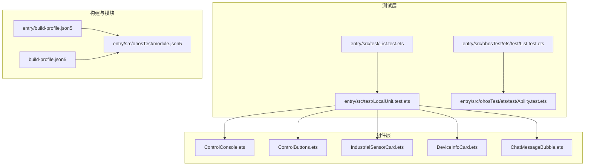
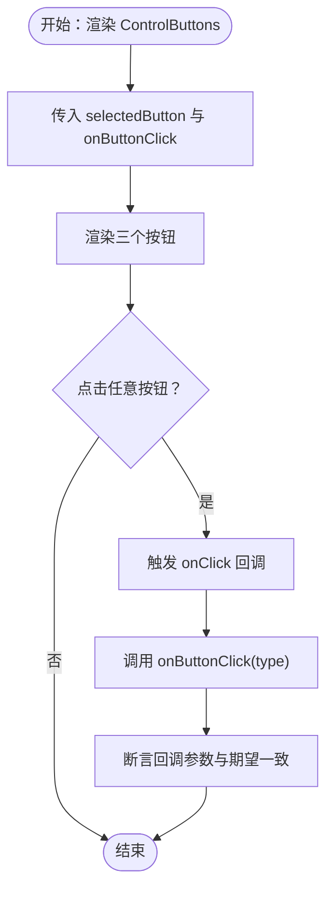
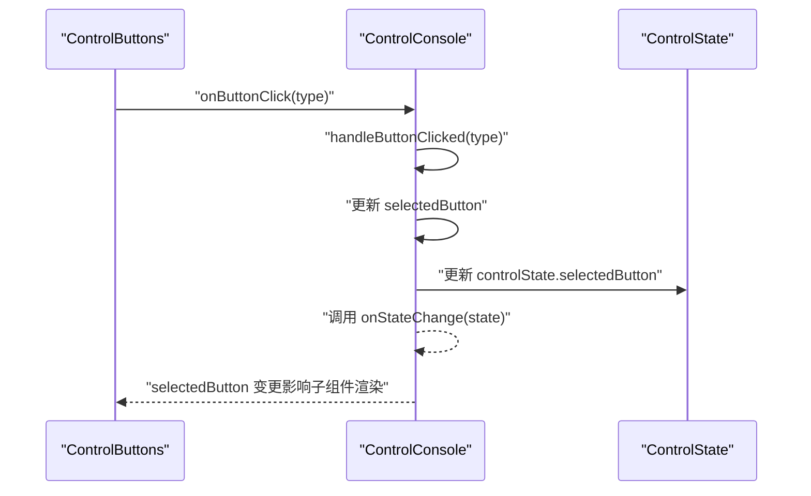
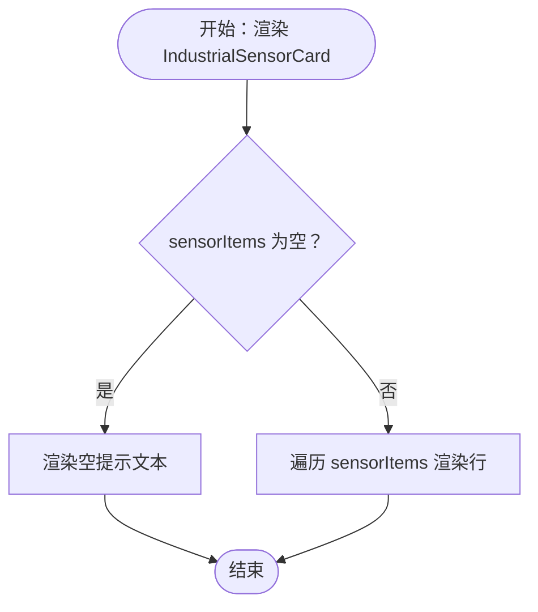
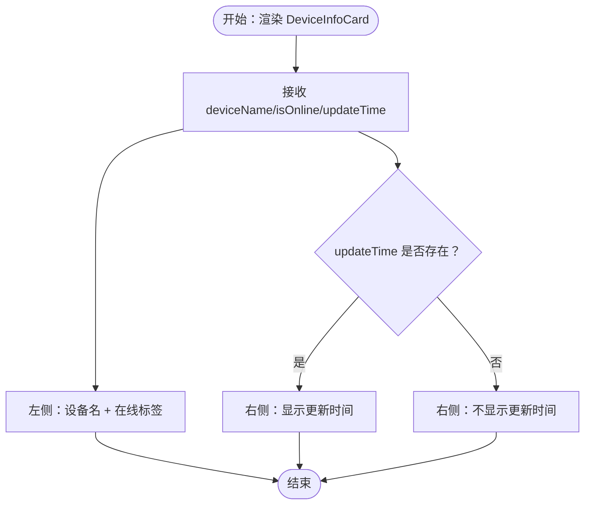
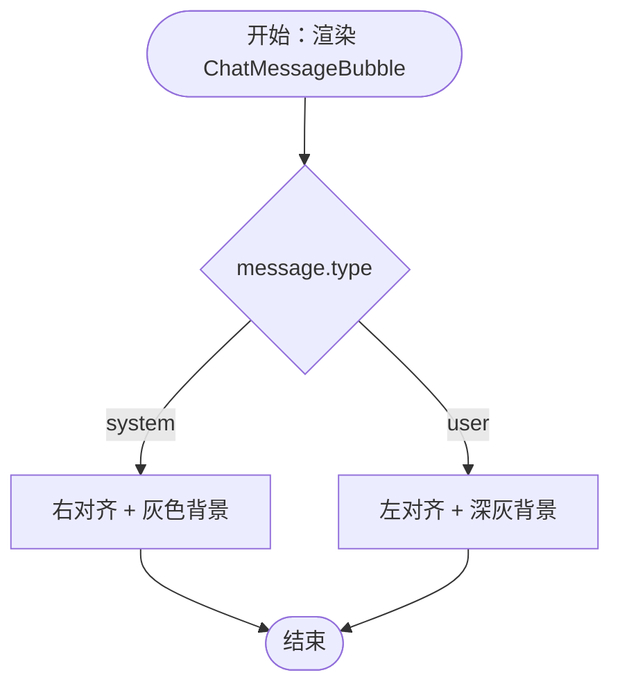
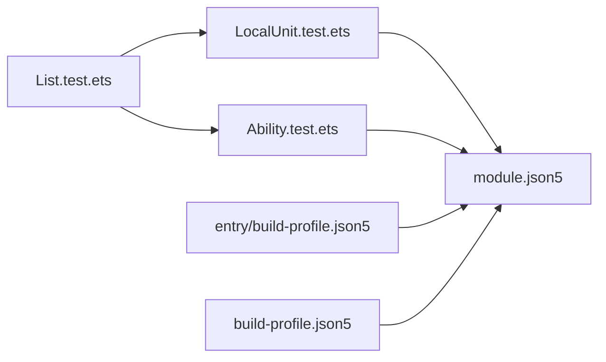

# 组件测试

<cite>
**本文引用的文件**
- [entry\src\test\List.test.ets](file://entry/src/test/List.test.ets)
- [entry\src\test\LocalUnit.test.ets](file://entry/src/test/LocalUnit.test.ets)
- [entry\src\ohosTest\ets\test\Ability.test.ets](file://entry/src/ohosTest/ets/test/Ability.test.ets)
- [entry\src\ohosTest\ets\test\List.test.ets](file://entry/src/ohosTest/ets/test/List.test.ets)
- [entry\src\ohosTest\module.json5](file://entry/src/ohosTest/module.json5)
- [build-profile.json5](file://entry/build-profile.json5)
- [build-profile.json5](file://build-profile.json5)
- [entry\src\main\ets\components\control\ControlButtons.ets](file://entry/src/main/ets/components/control/ControlButtons.ets)
- [entry\src\main\ets\components\control\ControlConsole.ets](file://entry/src/main/ets/components/control/ControlConsole.ets)
- [entry\src\main\ets\components\sensor\IndustrialSensorCard.ets](file://entry/src/main/ets/components/sensor/IndustrialSensorCard.ets)
- [entry\src\main\ets\components\device\DeviceInfoCard.ets](file://entry/src/main/ets/components/device/DeviceInfoCard.ets)
- [entry\src\main\ets\components\chat\ChatMessageBubble.ets](file://entry/src/main/ets/components/chat/ChatMessageBubble.ets)
</cite>

## 目录
1. [引言](#引言)
2. [项目结构](#项目结构)
3. [核心组件](#核心组件)
4. [架构总览](#架构总览)
5. [详细组件分析](#详细组件分析)
6. [依赖分析](#依赖分析)
7. [性能考虑](#性能考虑)
8. [故障排查指南](#故障排查指南)
9. [结论](#结论)
10. [附录](#附录)

## 引言
本文件面向开发者，系统化梳理本项目的组件测试方法论与实践，覆盖以下主题：
- UI 组件的渲染测试、用户交互测试与状态变化测试
- Mock 数据的创建与使用策略（含模拟数据生成、Mock 对象设计原则与测试环境数据隔离）
- 具体实现示例：props 传递、事件处理、生命周期方法的测试要点
- 快照测试与视觉回归测试的实施路径
- 调试技巧与性能优化建议

## 项目结构
本项目采用 ArkTS/Stage 模式开发，测试相关目录与模块如下：
- 测试入口与套件组织
  - 测试入口：entry/src/test/List.test.ets、entry/src/ohosTest/ets/test/List.test.ets
  - 套件样例：entry/src/test/LocalUnit.test.ets、entry/src/ohosTest/ets/test/Ability.test.ets
- 测试模块配置
  - 测试模块：entry/src/ohosTest/module.json5
  - 构建配置：entry/build-profile.json5、build-profile.json5
- 组件示例（用于测试目标）
  - 控制类：ControlConsole、ControlButtons
  - 传感器类：IndustrialSensorCard
  - 设备类：DeviceInfoCard
  - 聊天类：ChatMessageBubble

图表来源
- [entry\src\test\List.test.ets:1-5](file://entry/src/test/List.test.ets#L1-L5)
- [entry\src\test\LocalUnit.test.ets:1-33](file://entry/src/test/LocalUnit.test.ets#L1-L33)
- [entry\src\ohosTest\ets\test\List.test.ets:1-5](file://entry/src/ohosTest/ets/test/List.test.ets#L1-L5)
- [entry\src\ohosTest\ets\test\Ability.test.ets:1-35](file://entry/src/ohosTest/ets/test/Ability.test.ets#L1-L35)
- [entry\src\ohosTest\module.json5:1-12](file://entry/src/ohosTest/module.json5#L1-L12)
- [entry\build-profile.json5:1-33](file://entry/build-profile.json5#L1-L33)
- [build-profile.json5:1-73](file://build-profile.json5#L1-L73)

章节来源
- [entry\src\test\List.test.ets:1-5](file://entry/src/test/List.test.ets#L1-L5)
- [entry\src\test\LocalUnit.test.ets:1-33](file://entry/src/test/LocalUnit.test.ets#L1-L33)
- [entry\src\ohosTest\ets\test\Ability.test.ets:1-35](file://entry/src/ohosTest/ets/test/Ability.test.ets#L1-L35)
- [entry\src\ohosTest\ets\test\List.test.ets:1-5](file://entry/src/ohosTest/ets/test/List.test.ets#L1-L5)
- [entry\src\ohosTest\module.json5:1-12](file://entry/src/ohosTest/module.json5#L1-L12)
- [entry\build-profile.json5:1-33](file://entry/build-profile.json5#L1-L33)
- [build-profile.json5:1-73](file://build-profile.json5#L1-L73)

## 核心组件
本节聚焦可测试性高的组件，明确其 props、事件与状态，便于编写渲染、交互与状态变更测试。

- ControlButtons
  - 关键点：接收 selectedButton 与 onButtonClick；内部通过 onClick 触发父级回调；根据 selectedButton 动态切换样式。
  - 测试关注：props 传入是否生效、点击事件是否触发、样式随状态变化。
  - 参考路径：[entry\src\main\ets\components\control\ControlButtons.ets:1-48](file://entry/src/main/ets/components/control/ControlButtons.ets#L1-L48)

- ControlConsole
  - 关键点：@State 控制状态与 @State selectedButton；aboutToAppear 同步初始状态；handleButtonClicked 更新本地与全局状态并回调。
  - 测试关注：生命周期初始化、按钮点击状态同步、状态变更回调。
  - 参考路径：[entry\src\main\ets\components\control\ControlConsole.ets:1-172](file://entry/src/main/ets/components/control/ControlConsole.ets#L1-L172)

- IndustrialSensorCard
  - 关键点：接收 sensorItems 列表；空数据时显示提示；ForEach 渲染条目。
  - 测试关注：空列表渲染、列表渲染、布局与样式一致性。
  - 参考路径：[entry\src\main\ets\components\sensor\IndustrialSensorCard.ets:1-109](file://entry/src/main/ets/components/sensor/IndustrialSensorCard.ets#L1-L109)

- DeviceInfoCard
  - 关键点：@Prop 接收设备名、在线状态、更新时间；条件渲染更新时间；包含 DeviceOnlineTag 子组件。
  - 测试关注：@Prop 传入、条件渲染、子组件集成。
  - 参考路径：[entry\src\main\ets\components\device\DeviceInfoCard.ets:1-59](file://entry/src/main/ets/components/device/DeviceInfoCard.ets#L1-L59)

- ChatMessageBubble
  - 关键点：@Prop 接收 ChatMessage；根据 message.type 决定对齐与背景色。
  - 测试关注：不同消息类型的渲染差异、布局与颜色。
  - 参考路径：[entry\src\main\ets\components\chat\ChatMessageBubble.ets:1-38](file://entry/src/main/ets/components/chat/ChatMessageBubble.ets#L1-L38)

章节来源
- [entry\src\main\ets\components\control\ControlButtons.ets:1-48](file://entry/src/main/ets/components/control/ControlButtons.ets#L1-L48)
- [entry\src\main\ets\components\control\ControlConsole.ets:1-172](file://entry/src/main/ets/components/control/ControlConsole.ets#L1-L172)
- [entry\src\main\ets\components\sensor\IndustrialSensorCard.ets:1-109](file://entry/src/main/ets/components/sensor/IndustrialSensorCard.ets#L1-L109)
- [entry\src\main\ets\components\device\DeviceInfoCard.ets:1-59](file://entry/src/main/ets/components/device/DeviceInfoCard.ets#L1-L59)
- [entry\src\main\ets\components\chat\ChatMessageBubble.ets:1-38](file://entry/src/main/ets/components/chat/ChatMessageBubble.ets#L1-L38)

## 架构总览
下图展示测试入口、测试套件与被测组件之间的关系，以及测试模块与构建配置的关联。

```mermaid
graph TB
subgraph "测试入口"
L1["entry/src/test/List.test.ets"]
L2["entry/src/ohosTest/ets/test/List.test.ets"]
end
subgraph "测试套件"
U1["entry/src/test/LocalUnit.test.ets"]
A1["entry/src/ohosTest/ets/test/Ability.test.ets"]
end
subgraph "组件"
CB["ControlButtons.ets"]
CC["ControlConsole.ets"]
ISC["IndustrialSensorCard.ets"]
DIC["DeviceInfoCard.ets"]
CMB["ChatMessageBubble.ets"]
end
subgraph "模块与构建"
MOD["entry/src/ohosTest/module.json5"]
BP1["entry/build-profile.json5"]
BP2["build-profile.json5"]
end
L1 --> U1
L2 --> A1
U1 --> CB
U1 --> CC
U1 --> ISC
U1 --> DIC
U1 --> CMB
A1 --> CB
A1 --> CC
A1 --> ISC
A1 --> DIC
A1 --> CMB
BP1 --> MOD
BP2 --> MOD
```

图表来源
- [entry\src\test\List.test.ets:1-5](file://entry/src/test/List.test.ets#L1-L5)
- [entry\src\ohosTest\ets\test\List.test.ets:1-5](file://entry/src/ohosTest/ets/test/List.test.ets#L1-L5)
- [entry\src\test\LocalUnit.test.ets:1-33](file://entry/src/test/LocalUnit.test.ets#L1-L33)
- [entry\src\ohosTest\ets\test\Ability.test.ets:1-35](file://entry/src/ohosTest/ets/test/Ability.test.ets#L1-L35)
- [entry\src\ohosTest\module.json5:1-12](file://entry/src/ohosTest/module.json5#L1-L12)
- [entry\build-profile.json5:1-33](file://entry/build-profile.json5#L1-L33)
- [build-profile.json5:1-73](file://build-profile.json5#L1-L73)

## 详细组件分析

### ControlButtons 组件测试要点
- 渲染测试
  - 验证在不同 selectedButton 下，按钮文本、字体、背景、边框与圆角是否符合预期。
  - 验证按钮组水平排列、间距与权重。
- 交互测试
  - 模拟点击事件，断言 onButtonClick 回调被调用且参数正确。
- 状态变化测试
  - 通过外部改变 selectedButton，验证组件内部样式即时更新。

图表来源
- [entry\src\main\ets\components\control\ControlButtons.ets:17-47](file://entry/src/main/ets/components/control/ControlButtons.ets#L17-L47)

章节来源
- [entry\src\main\ets\components\control\ControlButtons.ets:1-48](file://entry/src/main/ets/components/control/ControlButtons.ets#L1-L48)

### ControlConsole 组件测试要点
- 生命周期测试
  - aboutToAppear 中同步 selectedButton 与 controlState，验证初始化逻辑。
- 状态变化测试
  - handleButtonClicked 更新本地 selectedButton 与全局 controlState，并触发 onStateChange。
- 事件链路测试
  - 子组件 ControlButtons 的点击事件应正确传递到父组件并更新状态。

图表来源
- [entry\src\main\ets\components\control\ControlConsole.ets:41-46](file://entry/src/main/ets/components/control/ControlConsole.ets#L41-L46)
- [entry\src\main\ets\components\control\ControlConsole.ets:156-171](file://entry/src/main/ets/components/control/ControlConsole.ets#L156-L171)

章节来源
- [entry\src\main\ets\components\control\ControlConsole.ets:1-172](file://entry/src/main/ets/components/control/ControlConsole.ets#L1-L172)

### IndustrialSensorCard 组件测试要点
- 渲染测试
  - 传入空数组：验证“暂无传感器数据”提示渲染。
  - 传入非空数组：验证 ForEach 正确渲染每一条目，布局与样式一致。
- 数据驱动测试
  - 使用不同长度与内容的 sensorItems，验证标题、数值、单位与行样式。

图表来源
- [entry\src\main\ets\components\sensor\IndustrialSensorCard.ets:42-56](file://entry/src/main/ets/components/sensor/IndustrialSensorCard.ets#L42-L56)
- [entry\src\main\ets\components\sensor\IndustrialSensorCard.ets:51-54](file://entry/src/main/ets/components/sensor/IndustrialSensorCard.ets#L51-L54)

章节来源
- [entry\src\main\ets\components\sensor\IndustrialSensorCard.ets:1-109](file://entry/src/main/ets/components/sensor/IndustrialSensorCard.ets#L1-L109)

### DeviceInfoCard 组件测试要点
- 渲染测试
  - @Prop 传入 deviceName/isOnline/updateTime，验证文本与条件渲染。
  - 验证右侧更新时间在 updateTime 存在时显示。
- 集成测试
  - 验证 DeviceOnlineTag 子组件渲染与样式。

图表来源
- [entry\src\main\ets\components\device\DeviceInfoCard.ets:18-44](file://entry/src/main/ets/components/device/DeviceInfoCard.ets#L18-L44)

章节来源
- [entry\src\main\ets\components\device\DeviceInfoCard.ets:1-59](file://entry/src/main/ets/components/device/DeviceInfoCard.ets#L1-L59)

### ChatMessageBubble 组件测试要点
- 渲染测试
  - system 类型：右对齐、特定背景色。
  - user 类型：左对齐、特定背景色。
- 数据驱动测试
  - 不同 message.type 与内容，验证文本、对齐与背景色。

图表来源
- [entry\src\main\ets\components\chat\ChatMessageBubble.ets:10-37](file://entry/src/main/ets/components/chat/ChatMessageBubble.ets#L10-L37)

章节来源
- [entry\src\main\ets\components\chat\ChatMessageBubble.ets:1-38](file://entry/src/main/ets/components/chat/ChatMessageBubble.ets#L1-L38)

## 依赖分析
- 测试入口与套件
  - entry/src/test/List.test.ets 与 entry/src/ohosTest/ets/test/List.test.ets 分别组织本地单元测试与能力测试套件。
  - 套件文件使用 @ohos/hypium 提供的 describe/before/after/it/expect API。
- 模块与构建
  - entry/src/ohosTest/module.json5 定义测试模块类型与设备类型。
  - entry/build-profile.json5 与根 build-profile.json5 提供构建模式与目标配置，支持 ohosTest 目标。

图表来源
- [entry\src\test\List.test.ets:1-5](file://entry/src/test/List.test.ets#L1-L5)
- [entry\src\ohosTest\ets\test\List.test.ets:1-5](file://entry/src/ohosTest/ets/test/List.test.ets#L1-L5)
- [entry\src\test\LocalUnit.test.ets:1-33](file://entry/src/test/LocalUnit.test.ets#L1-L33)
- [entry\src\ohosTest\ets\test\Ability.test.ets:1-35](file://entry/src/ohosTest/ets/test/Ability.test.ets#L1-L35)
- [entry\src\ohosTest\module.json5:1-12](file://entry/src/ohosTest/module.json5#L1-L12)
- [entry\build-profile.json5:1-33](file://entry/build-profile.json5#L1-L33)
- [build-profile.json5:1-73](file://build-profile.json5#L1-L73)

章节来源
- [entry\src\test\List.test.ets:1-5](file://entry/src/test/List.test.ets#L1-L5)
- [entry\src\ohosTest\ets\test\List.test.ets:1-5](file://entry/src/ohosTest/ets/test/List.test.ets#L1-L5)
- [entry\src\test\LocalUnit.test.ets:1-33](file://entry/src/test/LocalUnit.test.ets#L1-L33)
- [entry\src\ohosTest\ets\test\Ability.test.ets:1-35](file://entry/src/ohosTest/ets/test/Ability.test.ets#L1-L35)
- [entry\src\ohosTest\module.json5:1-12](file://entry/src/ohosTest/module.json5#L1-L12)
- [entry\build-profile.json5:1-33](file://entry/build-profile.json5#L1-L33)
- [build-profile.json5:1-73](file://build-profile.json5#L1-L73)

## 性能考虑
- 测试执行效率
  - 使用 beforeEach/afterEach 进行轻量级重置，避免重复昂贵的初始化。
  - 将大型或共享的 Mock 数据抽取为常量，减少重复构造。
- 渲染与交互测试
  - 针对复杂组件（如 ControlConsole）优先测试关键分支与状态转换，避免过度渲染断言。
- 构建与运行
  - 在 release 构建中禁用混淆可提升调试体验；测试阶段保持默认配置以便定位问题。

## 故障排查指南
- 测试未执行或模块未识别
  - 检查测试模块配置与构建目标是否启用 ohosTest。
  - 确认测试入口文件正确导入并导出 testsuite。
- 断言失败
  - 使用 Hypium 的 expect API 进行布尔断言；若断言失败，结合日志与断言点定位问题。
- 组件状态未更新
  - 确保 @State 与 @Prop 的使用符合响应式规则；对于父子通信，确认回调函数已正确传递。

章节来源
- [entry\src\test\LocalUnit.test.ets:1-33](file://entry/src/test/LocalUnit.test.ets#L1-L33)
- [entry\src\ohosTest\ets\test\Ability.test.ets:1-35](file://entry/src/ohosTest/ets/test/Ability.test.ets#L1-L35)

## 结论
本项目已具备基础的测试入口与套件模板，建议围绕以下方向完善组件测试体系：
- 以 ControlButtons、ControlConsole、IndustrialSensorCard、DeviceInfoCard、ChatMessageBubble 为核心，补充渲染、交互与状态变更测试。
- 建立统一的 Mock 数据与工具函数，确保测试环境隔离与可复现性。
- 引入快照与视觉回归测试流程，保障 UI 变更的稳定性。

## 附录
- 测试入口与套件参考
  - [entry\src\test\List.test.ets](file://entry/src/test/List.test.ets)
  - [entry\src\test\LocalUnit.test.ets](file://entry/src/test/LocalUnit.test.ets)
  - [entry\src\ohosTest\ets\test\Ability.test.ets](file://entry/src/ohosTest/ets/test/Ability.test.ets)
  - [entry\src\ohosTest\ets\test\List.test.ets](file://entry/src/ohosTest/ets/test/List.test.ets)
- 测试模块与构建配置
  - [entry\src\ohosTest\module.json5](file://entry/src/ohosTest/module.json5)
  - [entry\build-profile.json5](file://entry/build-profile.json5)
  - [build-profile.json5](file://build-profile.json5)
- 组件参考
  - [ControlButtons](file://entry/src/main/ets/components/control/ControlButtons.ets)
  - [ControlConsole](file://entry/src/main/ets/components/control/ControlConsole.ets)
  - [IndustrialSensorCard](file://entry/src/main/ets/components/sensor/IndustrialSensorCard.ets)
  - [DeviceInfoCard](file://entry/src/main/ets/components/device/DeviceInfoCard.ets)
  - [ChatMessageBubble](file://entry/src/main/ets/components/chat/ChatMessageBubble.ets)