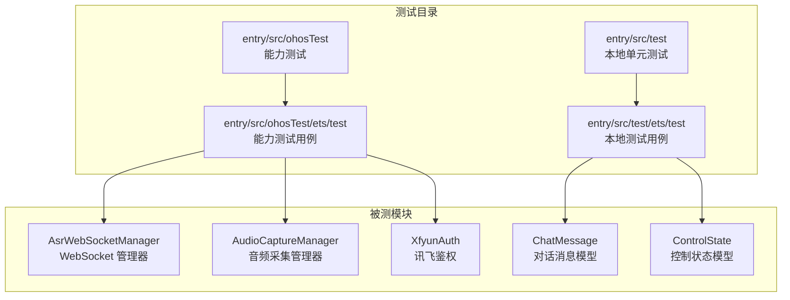
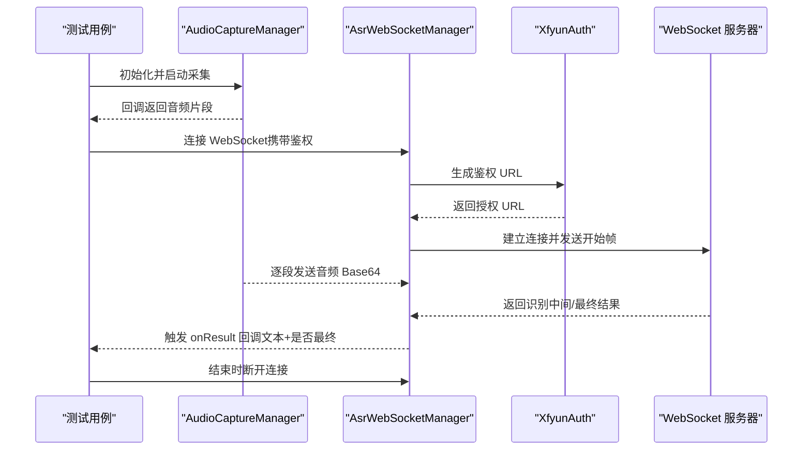
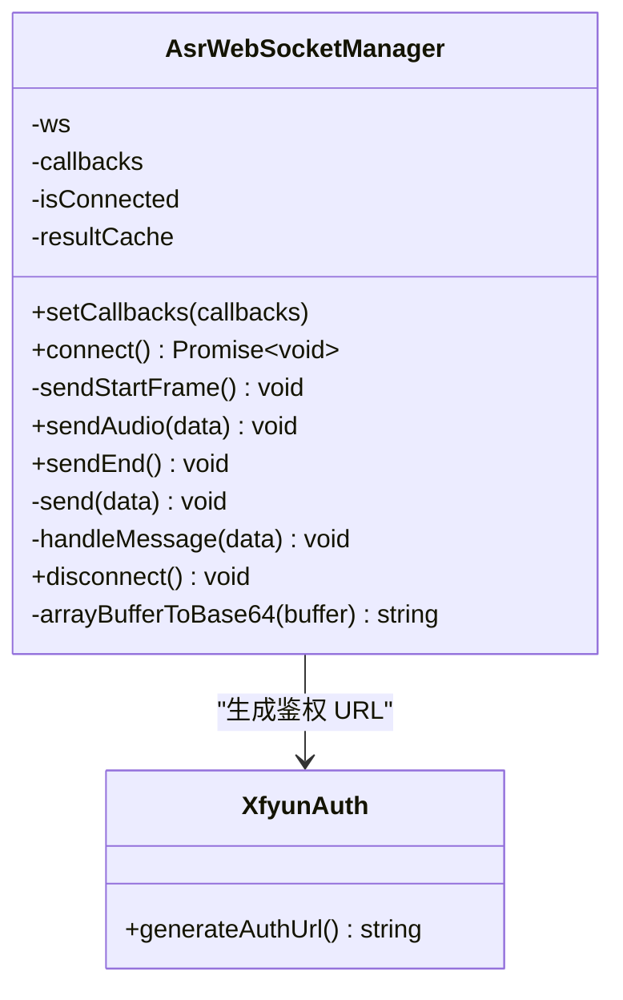
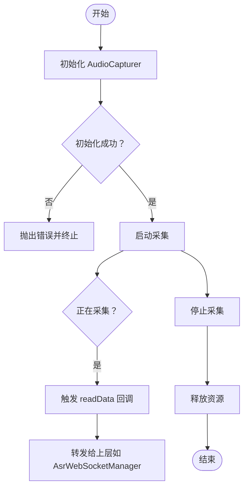
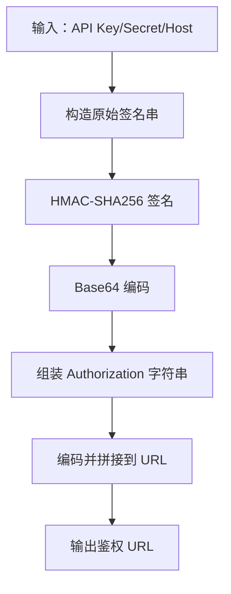
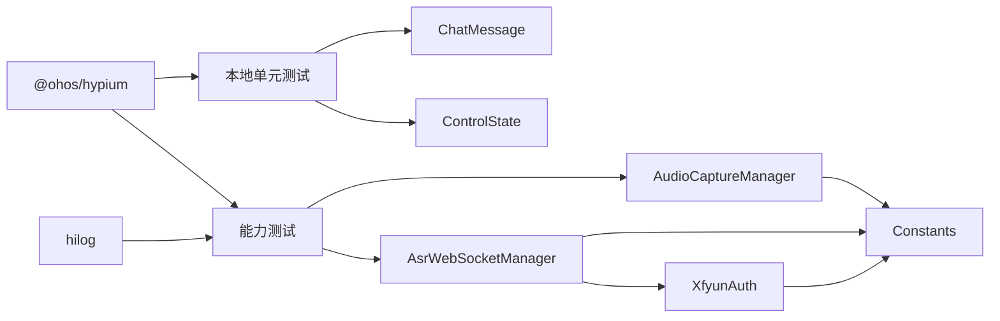

# 集成测试

<cite>
**本文引用的文件**
- [entry\src\test\List.test.ets](file://entry/src/test/List.test.ets)
- [entry\src\test\LocalUnit.test.ets](file://entry/src/test/LocalUnit.test.ets)
- [entry\src\ohosTest\ets\test\Ability.test.ets](file://entry/src/ohosTest/ets/test/Ability.test.ets)
- [entry\src\ohosTest\ets\test\List.test.ets](file://entry/src/ohosTest/ets/test/List.test.ets)
- [entry\src\ohosTest\module.json5](file://entry/src/ohosTest/module.json5)
- [entry\build-profile.json5](file://entry/build-profile.json5)
- [entry\src\main\ets\managers\AsrWebSocketManager.ets](file://entry/src/main/ets/managers/AsrWebSocketManager.ets)
- [entry\src\main\ets\managers\AudioCaptureManager.ets](file://entry/src/main/ets/managers/AudioCaptureManager.ets)
- [entry\src\main\ets\managers\XfyunAuth.ets](file://entry/src/main/ets/managers/XfyunAuth.ets)
- [entry\src\main\ets\models\ChatMessage.ets](file://entry/src/main/ets/models/ChatMessage.ets)
- [entry\src\main\ets\models\ControlState.ets](file://entry/src/main/ets/models/ControlState.ets)
</cite>

## 目录
1. [简介](#简介)
2. [项目结构](#项目结构)
3. [核心组件](#核心组件)
4. [架构总览](#架构总览)
5. [详细组件分析](#详细组件分析)
6. [依赖分析](#依赖分析)
7. [性能考虑](#性能考虑)
8. [故障排查指南](#故障排查指南)
9. [结论](#结论)
10. [附录](#附录)

## 简介
本文件面向开发者，系统化地构建该应用的集成测试方案，覆盖模块间协作测试（组件通信、数据流、状态同步）、API 接口测试（网络请求、WebSocket 连接、异步操作）、端到端流程测试（用户操作、业务场景、错误处理），并提供测试环境搭建、Mock 服务与测试数据管理建议，以及调试工具与性能监控方法。内容基于仓库中现有的本地单元测试与能力测试框架，结合语音识别（ASR）WebSocket 流程与音频采集链路进行扩展设计。

## 项目结构
测试相关目录与文件分布如下：
- 本地单元测试：entry/src/test
- 能力测试（设备端测试）：entry/src/ohosTest
- 构建配置：entry/build-profile.json5
- 能力测试模块配置：entry/src/ohosTest/module.json5

图表来源
- [entry\src\test\List.test.ets:1-5](file://entry/src/test/List.test.ets#L1-L5)
- [entry\src\test\LocalUnit.test.ets:1-33](file://entry/src/test/LocalUnit.test.ets#L1-L33)
- [entry\src\ohosTest\ets\test\Ability.test.ets:1-35](file://entry/src/ohosTest/ets/test/Ability.test.ets#L1-L35)
- [entry\src\ohosTest\ets\test\List.test.ets:1-5](file://entry/src/ohosTest/ets/test/List.test.ets#L1-L5)
- [entry\src\main\ets\managers\AsrWebSocketManager.ets:1-271](file://entry/src/main/ets/managers/AsrWebSocketManager.ets#L1-L271)
- [entry\src\main\ets\managers\AudioCaptureManager.ets:1-80](file://entry/src/main/ets/managers/AudioCaptureManager.ets#L1-L80)
- [entry\src\main\ets\managers\XfyunAuth.ets:1-34](file://entry/src/main/ets/managers/XfyunAuth.ets#L1-L34)
- [entry\src\main\ets\models\ChatMessage.ets:1-9](file://entry/src/main/ets/models/ChatMessage.ets#L1-L9)
- [entry\src\main\ets\models\ControlState.ets:1-67](file://entry/src/main/ets/models/ControlState.ets#L1-L67)

章节来源
- [entry\src\test\List.test.ets:1-5](file://entry/src/test/List.test.ets#L1-L5)
- [entry\src\test\LocalUnit.test.ets:1-33](file://entry/src/test/LocalUnit.test.ets#L1-L33)
- [entry\src\ohosTest\ets\test\Ability.test.ets:1-35](file://entry/src/ohosTest/ets/test/Ability.test.ets#L1-L35)
- [entry\src\ohosTest\ets\test\List.test.ets:1-5](file://entry/src/ohosTest/ets/test/List.test.ets#L1-L5)
- [entry\src\ohosTest\module.json5:1-12](file://entry/src/ohosTest/module.json5#L1-L12)
- [entry\build-profile.json5:1-33](file://entry/build-profile.json5#L1-L33)

## 核心组件
- 本地单元测试框架：基于 @ohos/hypium 的 describe/it/expect 断言体系，支持生命周期钩子（beforeAll/beforeEach/afterEach/afterAll）。
- 能力测试框架：同上，但通过 hilog 输出日志，便于设备端性能分析与问题定位。
- ASR 语音识别链路：XfyunAuth 生成鉴权 URL → AsrWebSocketManager 建立 WebSocket 连接 → AudioCaptureManager 采集音频并发送 → 结果解析与回调。
- 数据模型：ChatMessage、ControlState 提供稳定的数据契约，便于断言与状态验证。

章节来源
- [entry\src\test\LocalUnit.test.ets:1-33](file://entry/src/test/LocalUnit.test.ets#L1-L33)
- [entry\src\ohosTest\ets\test\Ability.test.ets:1-35](file://entry/src/ohosTest/ets/test/Ability.test.ets#L1-L35)
- [entry\src\main\ets\managers\AsrWebSocketManager.ets:82-271](file://entry/src/main/ets/managers/AsrWebSocketManager.ets#L82-L271)
- [entry\src\main\ets\managers\AudioCaptureManager.ets:6-80](file://entry/src/main/ets/managers/AudioCaptureManager.ets#L6-L80)
- [entry\src\main\ets\managers\XfyunAuth.ets:6-34](file://entry/src/main/ets/managers/XfyunAuth.ets#L6-L34)
- [entry\src\main\ets\models\ChatMessage.ets:4-9](file://entry/src/main/ets/models/ChatMessage.ets#L4-L9)
- [entry\src\main\ets\models\ControlState.ets:28-67](file://entry/src/main/ets/models/ControlState.ets#L28-L67)

## 架构总览
下图展示从“麦克风采集”到“ASR WebSocket 识别”的端到端集成测试关注点：音频采集、网络连接、消息收发、结果拼接与回调触发。

图表来源
- [entry\src\main\ets\managers\AudioCaptureManager.ets:11-53](file://entry/src/main/ets/managers/AudioCaptureManager.ets#L11-L53)
- [entry\src\main\ets\managers\AsrWebSocketManager.ets:92-144](file://entry/src/main/ets/managers/AsrWebSocketManager.ets#L92-L144)
- [entry\src\main\ets\managers\XfyunAuth.ets:7-24](file://entry/src/main/ets/managers/XfyunAuth.ets#L7-L24)

## 详细组件分析

### 组件 A：AsrWebSocketManager（WebSocket 识别管理）
- 关键职责
  - 生成鉴权 URL 并建立 WebSocket 连接
  - 发送开始帧、音频帧、结束帧
  - 解析服务端响应，按 sn 缓存并拼接文本
  - 回调通知：onOpen/onResult/onError/onClose
- 集成测试要点
  - 连接阶段：校验 URL 生成、连接回调、错误回调
  - 数据阶段：校验开始帧发送、音频帧发送、结束帧发送
  - 结果阶段：校验中间/最终文本回调、乱序结果缓存与拼接、动态替换逻辑
  - 断开阶段：校验连接关闭与资源释放
- 性能与稳定性
  - 异常分支：网络错误、消息解析异常、非 0 错误码
  - 资源管理：连接状态 isConnected、resultCache 清理

图表来源
- [entry\src\main\ets\managers\AsrWebSocketManager.ets:82-271](file://entry/src/main/ets/managers/AsrWebSocketManager.ets#L82-L271)
- [entry\src\main\ets\managers\XfyunAuth.ets:6-34](file://entry/src/main/ets/managers/XfyunAuth.ets#L6-L34)

章节来源
- [entry\src\main\ets\managers\AsrWebSocketManager.ets:82-271](file://entry/src/main/ets/managers/AsrWebSocketManager.ets#L82-L271)

### 组件 B：AudioCaptureManager（音频采集）
- 关键职责
  - 初始化 AudioCapturer，配置采样率、通道、格式
  - 启动/停止采集，注册 readData 回调推送音频数据
  - 释放资源
- 集成测试要点
  - 初始化：校验参数、回调错误处理
  - 采集：校验重复启动防护、回调触发频率与数据有效性
  - 停止/释放：校验状态复位与回调清理

图表来源
- [entry\src\main\ets\managers\AudioCaptureManager.ets:11-80](file://entry/src/main/ets/managers/AudioCaptureManager.ets#L11-L80)

章节来源
- [entry\src\main\ets\managers\AudioCaptureManager.ets:6-80](file://entry/src/main/ets/managers/AudioCaptureManager.ets#L6-L80)

### 组件 C：XfyunAuth（讯飞鉴权）
- 关键职责
  - 依据 API Key、Secret、Host 生成 Authorization 与签名
  - 返回带鉴权参数的 WebSocket URL
- 集成测试要点
  - 参数完整性：host/date/request-line 组合正确
  - 签名一致性：HMAC-SHA256 + Base64
  - URL 拼接：authorization/date/host 编码正确

图表来源
- [entry\src\main\ets\managers\XfyunAuth.ets:7-24](file://entry/src/main/ets/managers/XfyunAuth.ets#L7-L24)

章节来源
- [entry\src\main\ets\managers\XfyunAuth.ets:6-34](file://entry/src/main/ets/managers/XfyunAuth.ets#L6-L34)

### 组件 D：数据模型（ChatMessage、ControlState）
- 关键职责
  - ChatMessage：统一的消息结构（id/type/content/timestamp）
  - ControlState：控制模式、按钮选择、灯光/风扇状态、执行器占用等
- 集成测试要点
  - 构造与默认值：确保字段齐全且符合预期
  - 状态变更：断言模式切换、按钮选择变化、联动占比计算

章节来源
- [entry\src\main\ets\models\ChatMessage.ets:4-9](file://entry/src/main/ets/models/ChatMessage.ets#L4-L9)
- [entry\src\main\ets\models\ControlState.ets:28-67](file://entry/src/main/ets/models/ControlState.ets#L28-L67)

## 依赖分析
- 测试框架依赖
  - @ohos/hypium：提供 describe/it/expect 及生命周期钩子
  - hilog：能力测试中用于日志输出与性能分析
- 被测模块依赖
  - AsrWebSocketManager 依赖 webSocket、util、XfyunAuth、Constants
  - AudioCaptureManager 依赖 @ohos.multimedia.audio、Constants
  - XfyunAuth 依赖 @ohos/crypto-js、@ohos.util、Constants
- 构建与目标
  - build-profile.json5 定义了 default 与 ohosTest 两个目标，能力测试位于 ohosTest 目标下

图表来源
- [entry\src\test\LocalUnit.test.ets:1-33](file://entry/src/test/LocalUnit.test.ets#L1-L33)
- [entry\src\ohosTest\ets\test\Ability.test.ets:1-35](file://entry/src/ohosTest/ets/test/Ability.test.ets#L1-L35)
- [entry\src\main\ets\managers\AsrWebSocketManager.ets:2-5](file://entry/src/main/ets/managers/AsrWebSocketManager.ets#L2-L5)
- [entry\src\main\ets\managers\AudioCaptureManager.ets:2-4](file://entry/src/main/ets/managers/AudioCaptureManager.ets#L2-L4)
- [entry\src\main\ets\managers\XfyunAuth.ets:2-4](file://entry/src/main/ets/managers/XfyunAuth.ets#L2-L4)
- [entry\build-profile.json5:25-32](file://entry/build-profile.json5#L25-L32)

章节来源
- [entry\build-profile.json5:1-33](file://entry/build-profile.json5#L1-L33)
- [entry\src\ohosTest\module.json5:1-12](file://entry/src/ohosTest/module.json5#L1-L12)

## 性能考虑
- 日志与性能分析
  - 能力测试中使用 hilog 输出关键节点日志，便于定位耗时与异常
- 网络与 I/O
  - WebSocket 连接与消息收发存在网络抖动风险，应设置超时与重试策略
  - 音频采集回调频率高，需避免在回调中执行阻塞操作
- 资源管理
  - 连接与捕获器均需在测试结束后释放，防止资源泄漏
- 断言粒度
  - 对时间敏感的场景，可记录起止时间并断言在合理区间内

## 故障排查指南
- WebSocket 连接失败
  - 检查鉴权 URL 生成是否正确（Host、Date、签名）
  - 校验网络连通性与证书配置
  - 关注 onerror/close 回调，记录错误码与原因
- 音频采集异常
  - 确认权限与设备可用性
  - 检查采样率/通道/编码配置是否匹配
  - 观察 start/stop/release 回调是否按序触发
- 结果解析异常
  - 校验服务端返回 code 与 data 结构
  - 关注 sn 缓存与动态替换逻辑
- 日志定位
  - 使用 hilog 在关键路径输出日志，结合设备日志查看器定位问题

章节来源
- [entry\src\ohosTest\ets\test\Ability.test.ets:27-33](file://entry/src/ohosTest/ets/test/Ability.test.ets#L27-L33)
- [entry\src\main\ets\managers\AsrWebSocketManager.ets:99-139](file://entry/src/main/ets/managers/AsrWebSocketManager.ets#L99-L139)
- [entry\src\main\ets\managers\AudioCaptureManager.ets:45-65](file://entry/src/main/ets/managers/AudioCaptureManager.ets#L45-L65)

## 结论
本方案以现有测试框架为基础，围绕 ASR 语音识别与音频采集链路构建集成测试闭环，覆盖组件通信、数据流与状态同步，并提供端到端流程与错误处理测试思路。通过 Mock 服务与测试数据管理，可在不依赖真实后端的情况下完成稳定可靠的自动化测试。

## 附录

### A. 测试环境搭建与配置
- 目标与模块
  - 构建目标：default 与 ohosTest
  - 能力测试模块：entry/src/ohosTest/module.json5
- 运行方式
  - 本地单元测试：通过 @ohos/hypium 执行
  - 能力测试：通过 hilog 输出日志，配合设备端运行
- 建议
  - 在 build-profile.json5 中为 ohosTest 目标启用必要的 Ark/混淆规则
  - 为能力测试准备独立的测试配置与密钥注入机制

章节来源
- [entry\build-profile.json5:10-32](file://entry/build-profile.json5#L10-L32)
- [entry\src\ohosTest\module.json5:1-12](file://entry/src/ohosTest/module.json5#L1-L12)

### B. Mock 服务与测试数据管理
- Mock 服务
  - WebSocket 服务：Mock 讯飞 ASR 服务端，按协议返回中间/最终结果
  - 鉴权服务：Mock XfyunAuth，固定返回鉴权 URL
- 测试数据
  - 音频片段：准备不同长度与噪声水平的音频样本
  - 识别结果：准备多条中间与最终文本，覆盖动态替换场景
- 管理建议
  - 将 Mock 服务与测试数据集中管理，便于版本控制与更新
  - 为不同测试场景准备独立的 Mock 配置

### C. API 接口测试设计
- WebSocket 连接测试
  - URL 生成：断言鉴权参数完整与编码正确
  - 连接回调：断言 onOpen/onError/onClose 触发顺序与参数
- 网络请求测试（鉴权）
  - 参数校验：Host、Date、签名算法与编码
  - 响应校验：Authorization 与 URL 拼接
- 异步操作测试
  - 回调顺序：start → message × N → end → close
  - 错误分支：网络中断、解析异常、非 0 错误码

### D. 端到端流程测试实施方案
- 用户操作流程
  - 从页面触发“开始识别”，到音频采集、WebSocket 识别、结果显示与断开
- 业务场景
  - 正常场景：完整音频 → 中间结果 → 最终结果
  - 边界场景：短音频、静音、噪声、弱网
- 错误处理
  - 权限拒绝、设备不可用、网络异常、服务端错误
- 断言策略
  - 状态断言：ControlState 字段变化
  - 文本断言：ChatMessage 内容与时间戳
  - 回调断言：各阶段回调触发次数与参数

### E. 调试工具与性能监控
- 调试工具
  - hilog：输出关键日志，便于定位问题
  - 设备日志查看器：收集设备侧日志
- 性能监控
  - 记录连接耗时、首包延迟、回调间隔
  - 监控音频采集回调频率与丢帧情况
  - 分析 WebSocket 消息吞吐与错误率