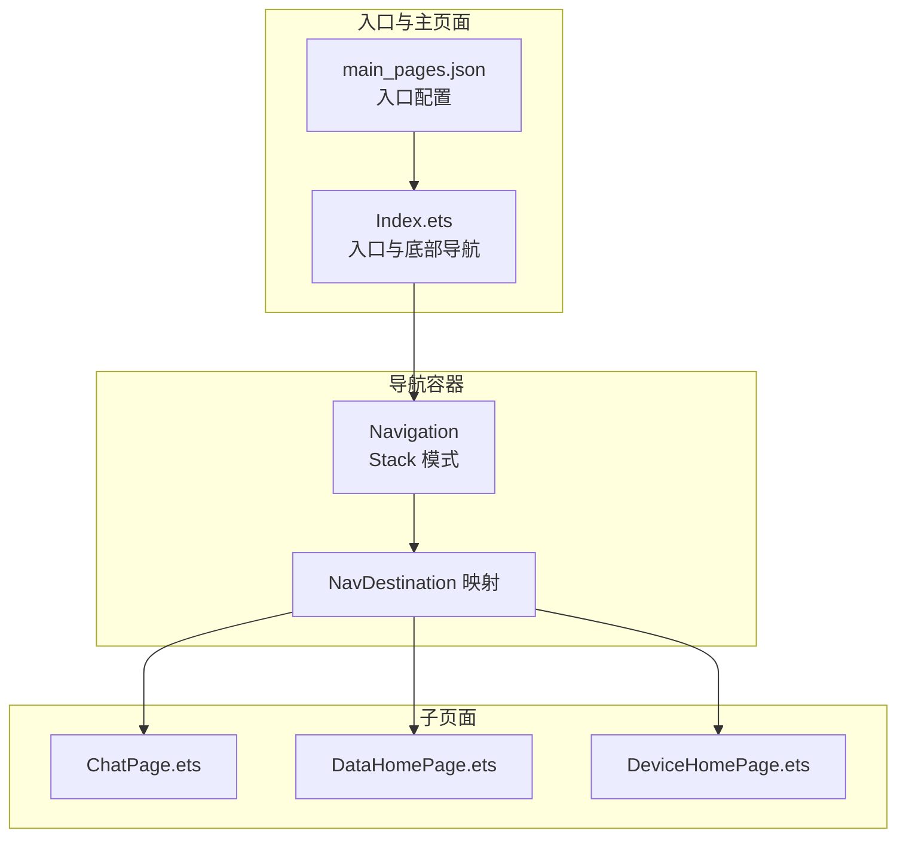
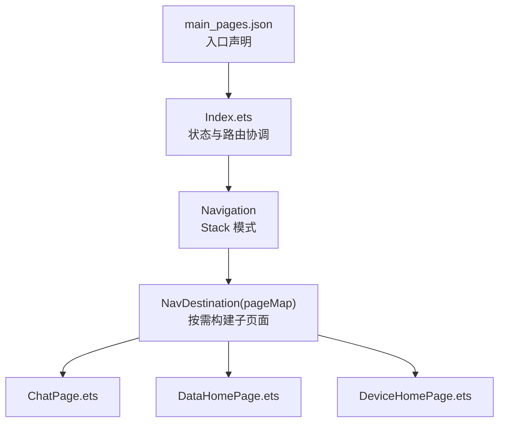
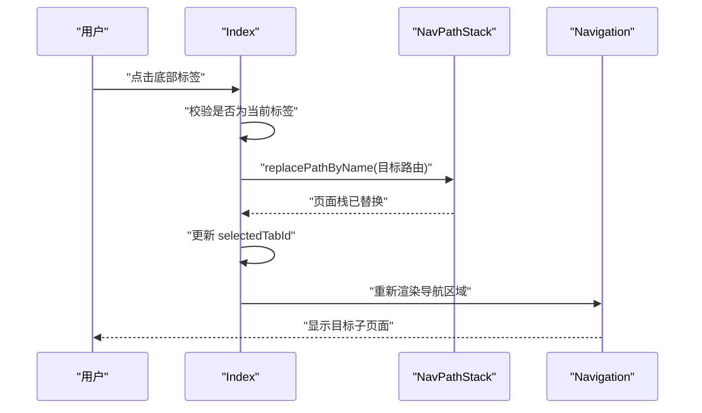
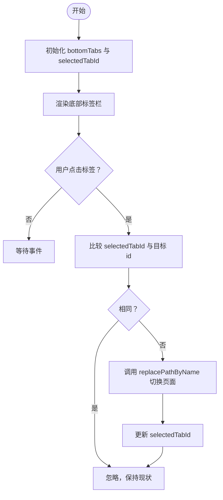
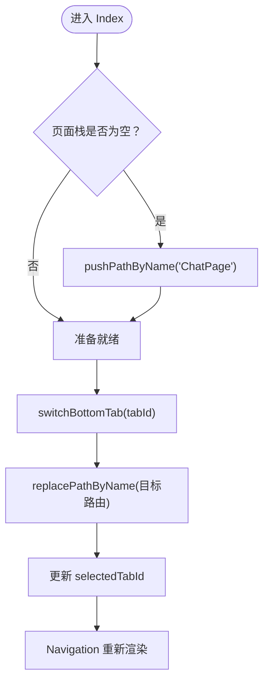
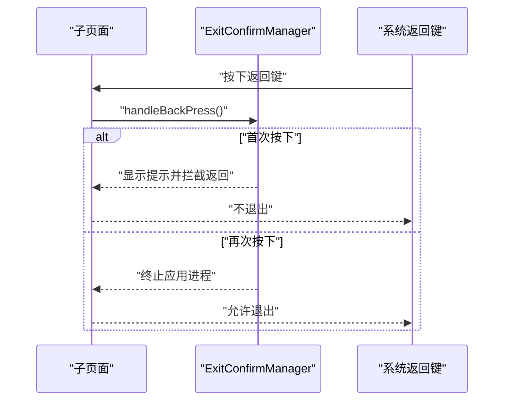
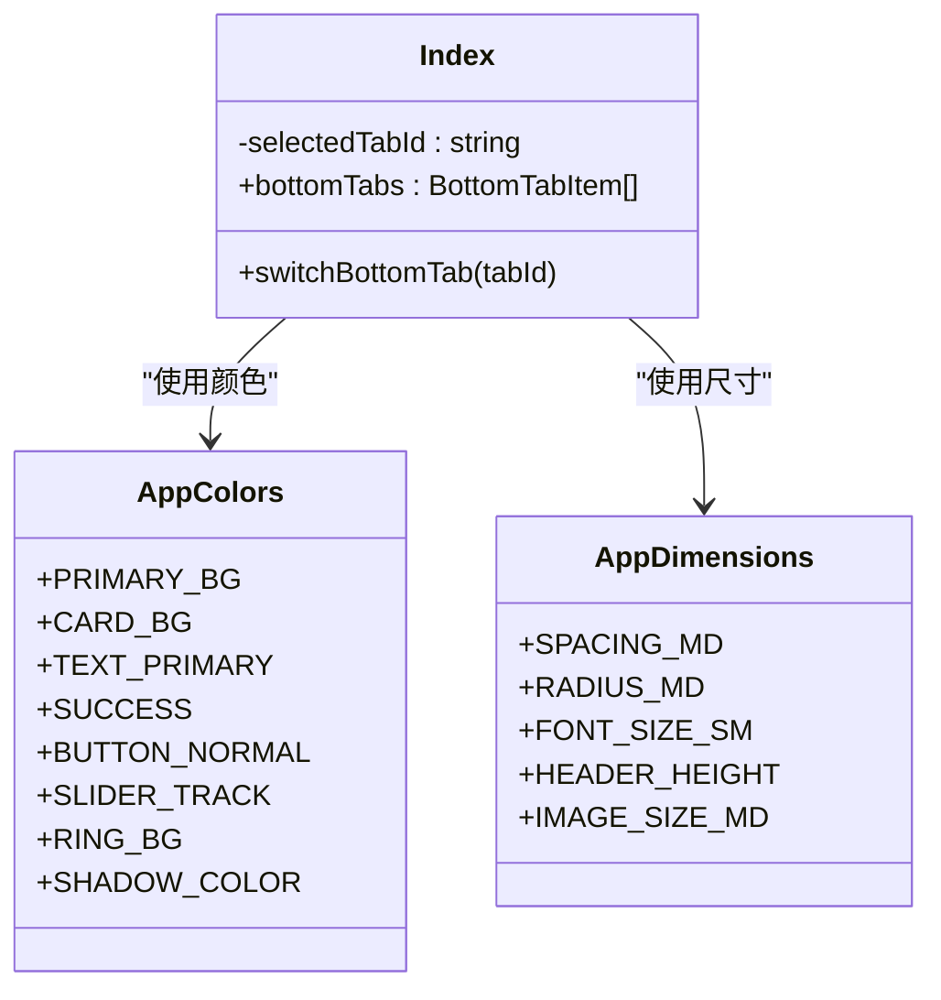
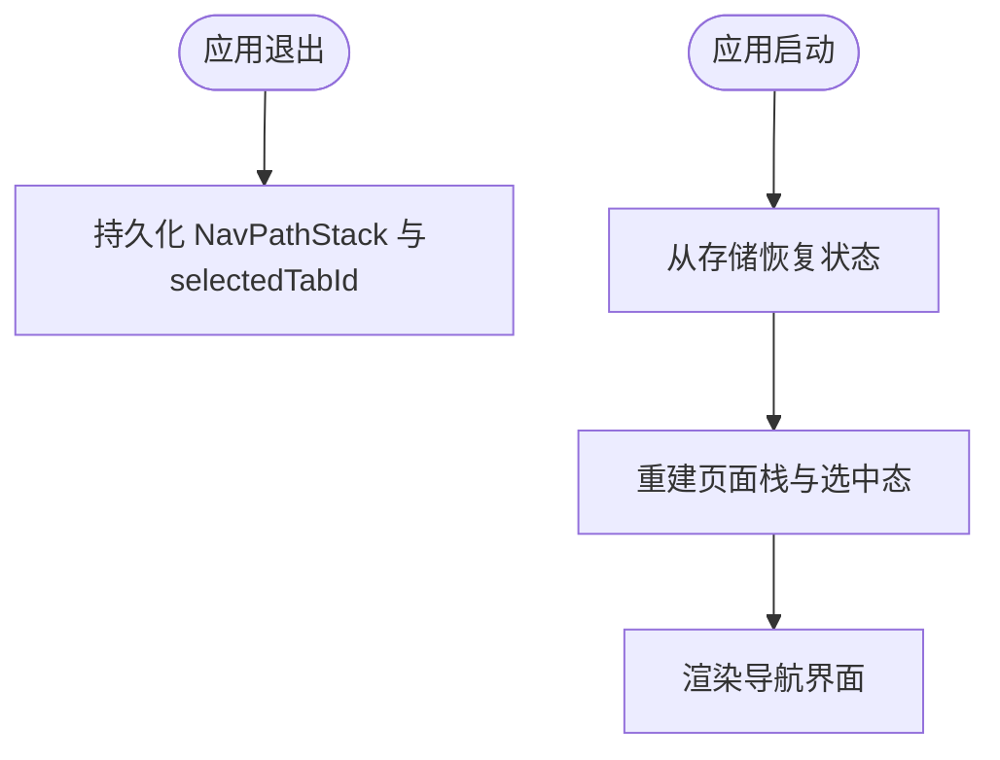
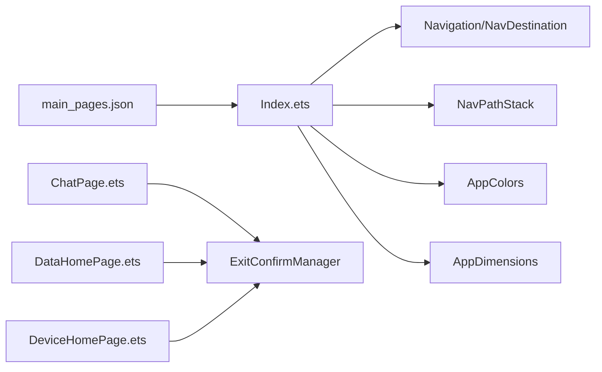

# 导航系统

<cite>
**本文引用的文件**
- [Index.ets](file://entry/src/main/ets/pages/Index.ets)
- [ChatPage.ets](file://entry/src/main/ets/pages/ChatPage.ets)
- [DataHomePage.ets](file://entry/src/main/ets/pages/DataHomePage.ets)
- [DeviceHomePage.ets](file://entry/src/main/ets/pages/DeviceHomePage.ets)
- [AppColors.ets](file://entry/src/main/ets/constants/AppColors.ets)
- [AppDimensions.ets](file://entry/src/main/ets/constants/AppDimensions.ets)
- [Constants.ets](file://entry/src/main/ets/common/Constants.ets)
- [main_pages.json](file://entry/src/main/resources/base/profile/main_pages.json)
- [string.json](file://entry/src/main/resources/base/element/string.json)
- [layered_image.json](file://entry/src/main/resources/base/media/layered_image.json)
</cite>

## 目录
1. [简介](#简介)
2. [项目结构](#项目结构)
3. [核心组件](#核心组件)
4. [架构总览](#架构总览)
5. [详细组件分析](#详细组件分析)
6. [依赖关系分析](#依赖关系分析)
7. [性能考量](#性能考量)
8. [故障排查指南](#故障排查指南)
9. [结论](#结论)
10. [附录](#附录)

## 简介
本文件面向开发者，系统性解析本项目的底部标签页导航实现，重点覆盖以下方面：
- 底部标签页导航的设计与实现：Navigation 组件的使用、页面栈管理、路由切换机制
- BottomTabItem 数据模型：图标、标签文本与状态管理
- 页面切换逻辑：replacePathByName 的使用与状态更新
- 导航组件样式定制：颜色主题、尺寸调整与交互反馈
- 导航状态持久化与恢复方案建议
- 自定义导航组件的指导与最佳实践

## 项目结构
导航系统的核心位于入口页面 Index，它通过 Navigation 组件承载子页面，并以底部栏提供快速切换。子页面分别对应“对话”、“数据”、“设备”三大功能域。

**图表来源**
- [Index.ets:62-114](file://entry/src/main/ets/pages/Index.ets#L62-L114)
- [main_pages.json:1-6](file://entry/src/main/resources/base/profile/main_pages.json#L1-L6)

**章节来源**
- [Index.ets:13-114](file://entry/src/main/ets/pages/Index.ets#L13-L114)
- [main_pages.json:1-6](file://entry/src/main/resources/base/profile/main_pages.json#L1-L6)

## 核心组件
- Index：作为应用入口与导航根组件，负责：
  - 维护底部标签项配置与当前选中态
  - 初始化页面栈并在首次进入时加载默认页面
  - 提供底部标签点击事件，驱动页面栈的替换操作
  - 将路由名映射到具体子页面组件
- 子页面：ChatPage、DataHomePage、DeviceHomePage，均以 NavDestination 包裹，确保标题栏隐藏与返回行为可控

关键职责与实现要点：
- 页面栈管理：使用 NavPathStack 与 pushPathByName/replacePathByName 实现页面切换与状态更新
- 底部标签项：BottomTabItem 定义 id、label、icon，用于渲染与选中态绑定
- 样式与主题：统一的颜色与尺寸常量，保证视觉一致性与可定制性

**章节来源**
- [Index.ets:6-114](file://entry/src/main/ets/pages/Index.ets#L6-L114)
- [ChatPage.ets:7-76](file://entry/src/main/ets/pages/ChatPage.ets#L7-L76)
- [DataHomePage.ets:7-61](file://entry/src/main/ets/pages/DataHomePage.ets#L7-L61)
- [DeviceHomePage.ets:12-73](file://entry/src/main/ets/pages/DeviceHomePage.ets#L12-L73)

## 架构总览
整体采用“入口页面 + 导航容器 + 子页面”的分层结构。Index 负责状态与路由协调，Navigation 负责页面栈与导航模式，子页面各自承担业务内容。

**图表来源**
- [Index.ets:62-114](file://entry/src/main/ets/pages/Index.ets#L62-L114)
- [main_pages.json:1-6](file://entry/src/main/resources/base/profile/main_pages.json#L1-L6)

## 详细组件分析

### Index：底部标签页导航与页面栈管理
- 底部标签项数据模型 BottomTabItem：包含 id、label、icon，用于渲染与选中态绑定
- 页面栈：NavPathStack 实例，配合 pushPathByName/replacePathByName 实现页面切换
- 首次进入：aboutToAppear 中若栈为空则默认加载 ChatPage
- 切换逻辑：switchBottomTab 根据目标 tabId 调用 replacePathByName 并更新 selectedTabId，保持页面栈深度为 1

**图表来源**
- [Index.ets:34-48](file://entry/src/main/ets/pages/Index.ets#L34-L48)
- [Index.ets:65-75](file://entry/src/main/ets/pages/Index.ets#L65-L75)

**章节来源**
- [Index.ets:6-114](file://entry/src/main/ets/pages/Index.ets#L6-L114)

### BottomTabItem 数据模型与渲染
- 结构：id（唯一标识）、label（资源字符串）、icon（资源字符串）
- 渲染：底部栏使用 ForEach 遍历 bottomTabs，结合 selectedTabId 动态设置图标与文字颜色
- 交互：点击触发 switchBottomTab，完成页面切换与状态更新

**图表来源**
- [Index.ets:19-48](file://entry/src/main/ets/pages/Index.ets#L19-L48)

**章节来源**
- [Index.ets:6-48](file://entry/src/main/ets/pages/Index.ets#L6-L48)

### 页面切换与状态更新机制
- replacePathByName：在不改变页面栈深度的前提下替换当前页面，保证底部导航稳定
- selectedTabId：驱动底部标签高亮与颜色变化，确保视觉反馈一致
- pageMap：将路由名映射到具体组件，供 Navigation.navDestination 使用

**图表来源**
- [Index.ets:27-48](file://entry/src/main/ets/pages/Index.ets#L27-L48)
- [Index.ets:50-60](file://entry/src/main/ets/pages/Index.ets#L50-L60)

**章节来源**
- [Index.ets:27-60](file://entry/src/main/ets/pages/Index.ets#L27-L60)

### 子页面：NavDestination 与返回行为
- ChatPage/DataHomePage/DeviceHomePage 均以 NavDestination 包裹，隐藏标题栏并自定义返回行为
- 返回拦截：在 onBackPressed 中调用 ExitConfirmManager.handleBackPress，实现“再按一次退出”的交互

**图表来源**
- [ChatPage.ets:68-75](file://entry/src/main/ets/pages/ChatPage.ets#L68-L75)
- [DataHomePage.ets:53-60](file://entry/src/main/ets/pages/DataHomePage.ets#L53-L60)
- [DeviceHomePage.ets:65-72](file://entry/src/main/ets/pages/DeviceHomePage.ets#L65-L72)
- [Constants.ets:29-55](file://entry/src/main/ets/common/Constants.ets#L29-L55)

**章节来源**
- [ChatPage.ets:7-76](file://entry/src/main/ets/pages/ChatPage.ets#L7-L76)
- [DataHomePage.ets:7-61](file://entry/src/main/ets/pages/DataHomePage.ets#L7-L61)
- [DeviceHomePage.ets:12-73](file://entry/src/main/ets/pages/DeviceHomePage.ets#L12-L73)
- [Constants.ets:19-82](file://entry/src/main/ets/common/Constants.ets#L19-L82)

### 样式定制与主题
- 颜色体系：AppColors 提供统一的主背景、卡片背景、文字、状态、控件、滑块、分隔线、圆环图与阴影颜色
- 尺寸规范：AppDimensions 提供间距、圆角、字体大小、高度、图片尺寸等常量
- 视觉反馈：底部标签根据 selectedTabId 动态切换图标与文字颜色，提升可读性与交互感

**图表来源**
- [AppColors.ets:5-47](file://entry/src/main/ets/constants/AppColors.ets#L5-L47)
- [AppDimensions.ets:5-40](file://entry/src/main/ets/constants/AppDimensions.ets#L5-L40)
- [Index.ets:24-25](file://entry/src/main/ets/pages/Index.ets#L24-L25)

**章节来源**
- [AppColors.ets:1-47](file://entry/src/main/ets/constants/AppColors.ets#L1-L47)
- [AppDimensions.ets:1-40](file://entry/src/main/ets/constants/AppDimensions.ets#L1-L40)
- [Index.ets:77-107](file://entry/src/main/ets/pages/Index.ets#L77-L107)

### 导航状态持久化与恢复（建议方案）
- 页面栈持久化：可在应用生命周期钩子中序列化 NavPathStack 状态，退出时保存，启动时恢复
- 选中态持久化：将 selectedTabId 写入本地存储，在应用启动时恢复
- 资源与国际化：标签文本与图标来自资源文件，确保多语言与主题切换时的一致性
- 退出确认状态：ExitConfirmManager.reset 可在切换标签时重置返回确认状态，避免跨页面状态污染

**图表来源**
- [Constants.ets:75-82](file://entry/src/main/ets/common/Constants.ets#L75-L82)

**章节来源**
- [Constants.ets:19-82](file://entry/src/main/ets/common/Constants.ets#L19-L82)

### 自定义导航组件指导与最佳实践
- 数据模型：定义清晰的标签项接口（如 BottomTabItem），包含 id、label、icon，便于扩展与复用
- 状态管理：集中管理 selectedTabId 与页面栈，避免分散更新导致的不一致
- 路由映射：通过 pageMap 将路由名与组件解耦，便于新增页面与热插拔
- 样式与主题：统一使用 AppColors 与 AppDimensions，确保视觉一致性与可维护性
- 交互与反馈：为点击、切换等交互提供即时反馈（颜色、尺寸、阴影等），提升用户体验
- 性能优化：保持页面栈深度为 1 的策略适用于底部导航，减少内存占用与渲染压力

**章节来源**
- [Index.ets:6-114](file://entry/src/main/ets/pages/Index.ets#L6-L114)
- [AppColors.ets:1-47](file://entry/src/main/ets/constants/AppColors.ets#L1-L47)
- [AppDimensions.ets:1-40](file://entry/src/main/ets/constants/AppDimensions.ets#L1-L40)

## 依赖关系分析
- Index 依赖 Navigation 与 NavDestination，通过 NavPathStack 协调页面切换
- 子页面依赖 ExitConfirmManager 控制返回行为
- 样式依赖 AppColors 与 AppDimensions，保证主题与尺寸一致性
- 入口声明依赖 main_pages.json

**图表来源**
- [Index.ets:13-114](file://entry/src/main/ets/pages/Index.ets#L13-L114)
- [ChatPage.ets:4-7](file://entry/src/main/ets/pages/ChatPage.ets#L4-L7)
- [DataHomePage.ets:3-4](file://entry/src/main/ets/pages/DataHomePage.ets#L3-L4)
- [DeviceHomePage.ets:8-10](file://entry/src/main/ets/pages/DeviceHomePage.ets#L8-L10)
- [main_pages.json:1-6](file://entry/src/main/resources/base/profile/main_pages.json#L1-L6)

**章节来源**
- [Index.ets:13-114](file://entry/src/main/ets/pages/Index.ets#L13-L114)
- [ChatPage.ets:4-7](file://entry/src/main/ets/pages/ChatPage.ets#L4-L7)
- [DataHomePage.ets:3-4](file://entry/src/main/ets/pages/DataHomePage.ets#L3-L4)
- [DeviceHomePage.ets:8-10](file://entry/src/main/ets/pages/DeviceHomePage.ets#L8-L10)
- [main_pages.json:1-6](file://entry/src/main/resources/base/profile/main_pages.json#L1-L6)

## 性能考量
- 页面栈深度控制：保持栈深为 1，降低内存占用与渲染开销
- 按需构建：NavDestination 仅在需要时构建子页面，减少初始负载
- 样式常量化：统一颜色与尺寸常量，避免重复计算与样式抖动
- 事件处理：底部标签点击事件简单直接，避免复杂计算与异步阻塞

## 故障排查指南
- 页面无法切换：检查 bottomTabs 的 id 与 replacePathByName 的路由名是否一致
- 样式异常：核对 AppColors 与 AppDimensions 的取值，确认 selectedTabId 的状态更新
- 返回行为异常：确认子页面 onBackPressed 中调用了 ExitConfirmManager.handleBackPress
- 入口未生效：检查 main_pages.json 的 src 数组是否包含 Index 路径

**章节来源**
- [Index.ets:34-48](file://entry/src/main/ets/pages/Index.ets#L34-L48)
- [Index.ets:77-107](file://entry/src/main/ets/pages/Index.ets#L77-L107)
- [ChatPage.ets:68-75](file://entry/src/main/ets/pages/ChatPage.ets#L68-L75)
- [DataHomePage.ets:53-60](file://entry/src/main/ets/pages/DataHomePage.ets#L53-L60)
- [DeviceHomePage.ets:65-72](file://entry/src/main/ets/pages/DeviceHomePage.ets#L65-L72)
- [main_pages.json:1-6](file://entry/src/main/resources/base/profile/main_pages.json#L1-L6)

## 结论
本导航系统以 Index 为核心，结合 Navigation 的 Stack 模式与 NavPathStack 的页面栈管理，实现了简洁高效的底部标签页导航。通过 BottomTabItem 数据模型、统一的颜色与尺寸常量以及明确的状态更新流程，系统具备良好的可维护性与可扩展性。建议在实际工程中进一步完善状态持久化与恢复机制，并持续遵循统一的主题与样式规范，以提升用户体验与开发效率。

## 附录
- 资源与国际化：string.json 提供标签文本资源，layered_image.json 提供图标资源结构
- 入口声明：main_pages.json 指定入口页面路径

**章节来源**
- [string.json:1-1](file://entry/src/main/resources/base/element/string.json#L1-L1)
- [layered_image.json:1-7](file://entry/src/main/resources/base/media/layered_image.json#L1-L7)
- [main_pages.json:1-6](file://entry/src/main/resources/base/profile/main_pages.json#L1-L6)