# 控制台主组件

<cite>
**本文档引用的文件**
- [ControlConsole.ets](file://entry/src/main/ets/components/control/ControlConsole.ets)
- [ControlState.ets](file://entry/src/main/ets/models/ControlState.ets)
- [ControlButtons.ets](file://entry/src/main/ets/components/control/ControlButtons.ets)
- [ControlSlider.ets](file://entry/src/main/ets/components/control/ControlSlider.ets)
- [StatusIndicator.ets](file://entry/src/main/ets/components/control/StatusIndicator.ets)
- [AppColors.ets](file://entry/src/main/ets/constants/AppColors.ets)
- [AppDimensions.ets](file://entry/src/main/ets/constants/AppDimensions.ets)
- [DeviceHomePage.ets](file://entry/src/main/ets/pages/DeviceHomePage.ets)
- [network_connect.ets](file://entry/src/main/ets/network/network_connect.ets)
- [API_risc.ets](file://entry/src/main/ets/network/API_risc.ets)
- [ControlTabs.ets](file://entry/src/main/ets/components/control/ControlTabs.ets)
</cite>

## 更新摘要
**变更内容**
- 新增硬件控制 API 系统集成，替换原有的直接网络消息传递方式
- 新增结构化的 API 调用接口，提供更安全和可控的设备控制
- 增强设备控制的安全性和可靠性，通过 API 层进行统一管理
- 完善设备状态管理和控制逻辑，支持多种控制模式的状态同步

## 目录
1. [简介](#简介)
2. [项目结构](#项目结构)
3. [核心组件](#核心组件)
4. [架构概览](#架构概览)
5. [详细组件分析](#详细组件分析)
6. [硬件控制 API 系统](#硬件控制-api-系统)
7. [设备控制模式系统](#设备控制模式系统)
8. [依赖关系分析](#依赖关系分析)
9. [性能考虑](#性能考虑)
10. [故障排除指南](#故障排除指南)
11. [结论](#结论)

## 简介

ControlConsole 是 SmartController 项目中的核心控制台主容器组件，负责整合所有设备联动控制功能。该组件采用模块化设计，通过组合多个专用子组件来提供完整的控制界面，包括按钮控制、状态指示、滑块调节等功能。

**更新** 新增了硬件控制 API 系统集成，通过结构化的 API 调用接口替代原有的直接网络消息传递方式，提供更安全、可靠和可控的设备控制能力。

该组件的主要职责是：
- 作为控制台容器，统一管理所有控制子组件
- 维护全局控制状态，确保各组件间的状态同步
- 处理用户交互事件，协调组件间的通信
- 提供响应式的用户界面，支持实时状态反馈
- 实现设备控制模式切换，提供标准化的设备控制接口
- 通过硬件控制 API 系统管理设备通信，确保控制的安全性和可靠性

## 项目结构

ControlConsole 组件位于项目的组件目录结构中，与相关的模型、常量、网络模块和页面文件共同构成完整的控制台系统。

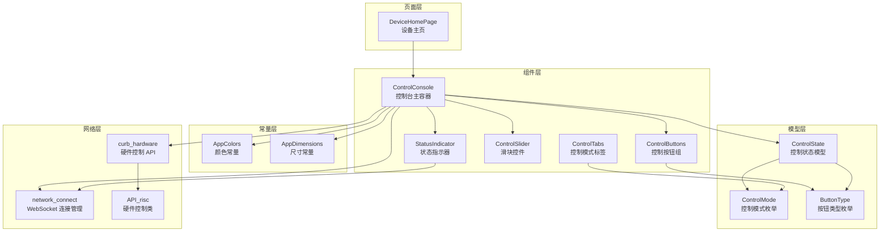

**图表来源**
- [ControlConsole.ets:1-10](file://entry/src/main/ets/components/control/ControlConsole.ets#L1-L10)
- [ControlState.ets:1-74](file://entry/src/main/ets/models/ControlState.ets#L1-L74)
- [ControlButtons.ets:1-48](file://entry/src/main/ets/components/control/ControlButtons.ets#L1-L48)
- [StatusIndicator.ets:1-39](file://entry/src/main/ets/components/control/StatusIndicator.ets#L1-L39)
- [ControlSlider.ets:1-56](file://entry/src/main/ets/components/control/ControlSlider.ets#L1-L56)
- [ControlTabs.ets:1-41](file://entry/src/main/ets/components/control/ControlTabs.ets#L1-L41)
- [network_connect.ets:1-321](file://entry/src/main/ets/network/network_connect.ets#L1-L321)
- [API_risc.ets:1-54](file://entry/src/main/ets/network/API_risc.ets#L1-L54)

**章节来源**
- [ControlConsole.ets:1-290](file://entry/src/main/ets/components/control/ControlConsole.ets#L1-L290)
- [DeviceHomePage.ets:1-75](file://entry/src/main/ets/pages/DeviceHomePage.ets#L1-L75)

## 核心组件

### ControlConsole 主容器组件

ControlConsole 是整个控制台系统的核心容器，负责协调各个子组件的工作。它采用 @ComponentV2 装饰器定义，使用 @State 和 @Prop 状态管理机制。

**更新** 新增了硬件控制 API 系统集成，通过 curb_hardware 对象提供结构化的设备控制接口，替代原有的直接网络消息传递方式。

#### 主要特性
- **状态管理**：维护 ControlState 对象和独立的 selectedButton 状态
- **生命周期管理**：通过 aboutToAppear 方法进行初始化
- **组件集成**：整合 ControlButtons、StatusIndicator、ControlSlider 等子组件
- **事件处理**：提供 onStateChange 回调机制
- **模式控制**：支持展示模式、告警模式、静音模式的切换
- **统一控制**：提供 controlDevice 方法统一设备控制接口
- **API 集成**：通过硬件控制 API 系统管理设备通信

#### 关键属性
- `controlState`: ControlState 类型，存储所有控制状态
- `selectedButton`: ButtonType 类型，当前选中的按钮
- `onStateChange`: 回调函数，状态变化时的通知机制

**章节来源**
- [ControlConsole.ets:15-27](file://entry/src/main/ets/components/control/ControlConsole.ets#L15-L27)

### ControlState 状态模型

ControlState 是控制台的状态数据模型，定义了所有控制相关的状态变量和默认值。

#### 状态分类
- **控制模式**：SCENE、SWITCH、ANALOG 三种模式
- **按钮状态**：DISPLAY、ALARM、MUTE 三种按钮类型
- **设备状态**：蜂鸣器、各种指示灯的开关状态
- **模拟量**：小灯亮度、风扇转速等可调节参数
- **执行器状态**：激活的执行器数量、总数和联动占比

#### 默认值设置
组件初始化时会设置合理的默认值，确保用户界面的可用性。

**章节来源**
- [ControlState.ets:28-74](file://entry/src/main/ets/models/ControlState.ets#L28-L74)

## 架构概览

ControlConsole 采用了分层架构设计，通过清晰的组件边界和职责分离实现高度模块化的控制台系统。

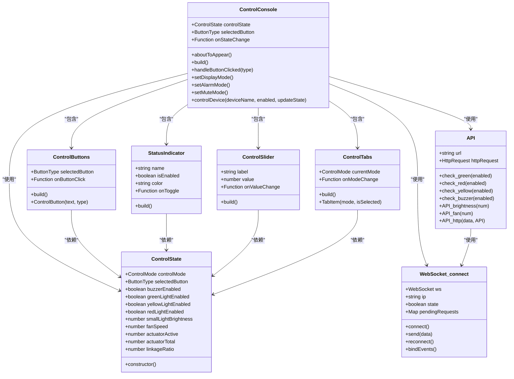

**图表来源**
- [ControlConsole.ets:15-290](file://entry/src/main/ets/components/control/ControlConsole.ets#L15-L290)
- [ControlState.ets:28-74](file://entry/src/main/ets/models/ControlState.ets#L28-L74)
- [ControlButtons.ets:10-48](file://entry/src/main/ets/components/control/ControlButtons.ets#L10-L48)
- [StatusIndicator.ets:5-39](file://entry/src/main/ets/components/control/StatusIndicator.ets#L5-L39)
- [ControlSlider.ets:8-56](file://entry/src/main/ets/components/control/ControlSlider.ets#L8-L56)
- [ControlTabs.ets:9-41](file://entry/src/main/ets/components/control/ControlTabs.ets#L9-L41)
- [API_risc.ets:7-54](file://entry/src/main/ets/network/API_risc.ets#L7-L54)
- [network_connect.ets:38-321](file://entry/src/main/ets/network/network_connect.ets#L38-L321)

## 详细组件分析

### ControlConsole 生命周期管理

ControlConsole 的生命周期管理体现了良好的组件设计原则，特别是在 aboutToAppear 方法中的状态初始化逻辑。

#### 生命周期流程

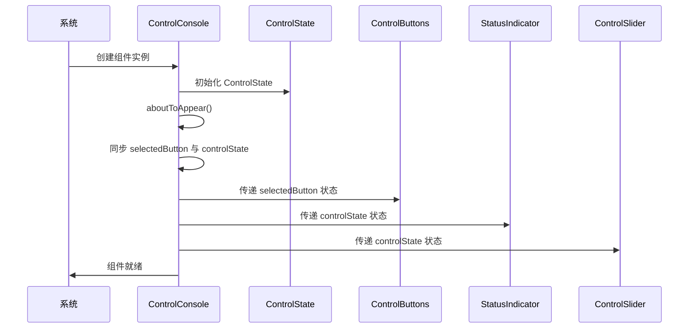

**图表来源**
- [ControlConsole.ets:24-27](file://entry/src/main/ets/components/control/ControlConsole.ets#L24-L27)
- [ControlConsole.ets:43-48](file://entry/src/main/ets/components/control/ControlConsole.ets#L43-L48)

#### 状态初始化逻辑

关于 aboutToAppear 方法中的状态同步，这是一个关键的设计决策：

1. **双重状态管理**：同时维护独立的 selectedButton 和 controlState.selectedButton
2. **状态一致性**：确保 UI 状态与业务状态保持同步
3. **响应式更新**：通过 @State 装饰器实现自动状态更新

**章节来源**
- [ControlConsole.ets:24-27](file://entry/src/main/ets/components/control/ControlConsole.ets#L24-L27)

### 组件内部布局结构

ControlConsole 采用垂直布局设计，将不同的控制功能按照逻辑分组组织。

#### 布局层次结构

```mermaid
graph TB
ControlConsole[ControlConsole 容器]
subgraph "标题区域"
Title[标题栏<br/>Text('设备联动控制台')]
end
subgraph "按钮控制区域"
Buttons[ControlButtons<br/>展示/告警/静音按钮]
end
subgraph "状态指示区域"
IndicatorRow1[Row1<br/>蜂鸣器 + 绿灯]
IndicatorRow2[Row2<br/>黄灯 + 红灯]
end
subgraph "滑块控制区域"
SliderColumn[Column<br/>小灯亮度 + 风扇转速]
end
ControlConsole --> Title
ControlConsole --> Buttons
ControlConsole --> IndicatorRow1
ControlConsole --> IndicatorRow2
ControlConsole --> SliderColumn
```

**图表来源**
- [ControlConsole.ets:29-167](file://entry/src/main/ets/components/control/ControlConsole.ets#L29-L167)

#### 布局特点

1. **垂直排列**：采用 Column 布局，符合用户的阅读习惯
2. **分组设计**：将相关的控制功能组织在一起
3. **响应式间距**：使用 AppDimensions 常量确保一致的间距
4. **卡片化设计**：整体采用圆角卡片样式，提升视觉效果

**章节来源**
- [ControlConsole.ets:29-167](file://entry/src/main/ets/components/control/ControlConsole.ets#L29-L167)

### 组件间通信机制

ControlConsole 实现了复杂的组件间通信机制，通过父子组件的数据传递和事件回调实现松耦合的架构设计。

**更新** 新增了硬件控制 API 系统的通信机制，通过 curb_hardware 对象提供结构化的设备控制接口。

#### 通信流程

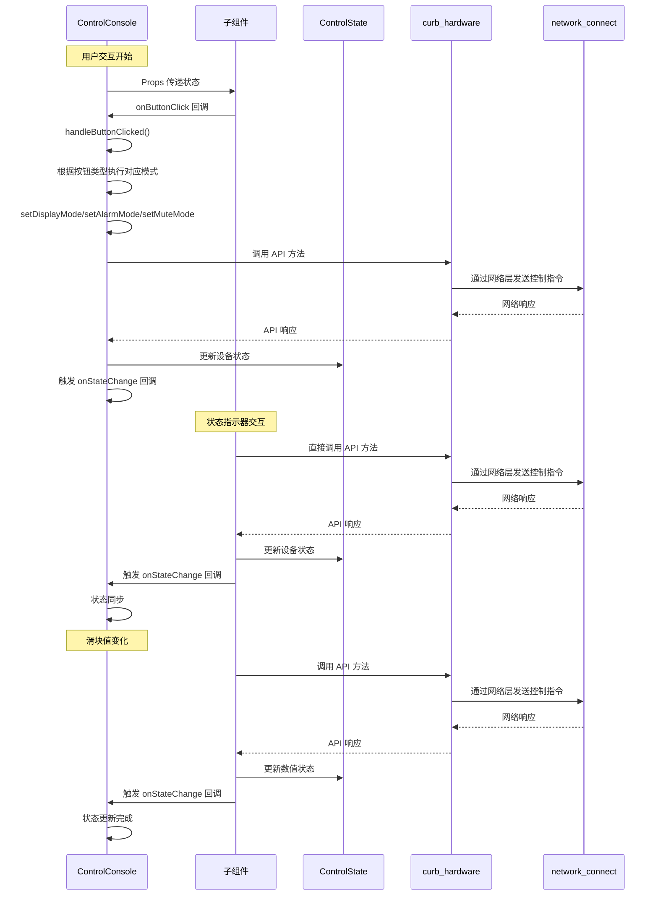

**图表来源**
- [ControlConsole.ets:43-48](file://entry/src/main/ets/components/control/ControlConsole.ets#L43-L48)
- [ControlConsole.ets:172-200](file://entry/src/main/ets/components/control/ControlConsole.ets#L172-L200)
- [ControlConsole.ets:275-290](file://entry/src/main/ets/components/control/ControlConsole.ets#L275-L290)

#### 通信模式

1. **单向数据流**：父组件向子组件传递状态，子组件向父组件传递事件
2. **双向状态同步**：通过 onStateChange 回调实现状态的双向同步
3. **事件冒泡**：子组件通过回调函数向上层组件传递用户操作
4. **API 调用**：通过硬件控制 API 系统进行设备控制
5. **网络层抽象**：硬件控制 API 通过网络层进行实际的设备通信

**章节来源**
- [ControlConsole.ets:17-22](file://entry/src/main/ets/components/control/ControlConsole.ets#L17-L22)
- [ControlConsole.ets:172-200](file://entry/src/main/ets/components/control/ControlConsole.ets#L172-L200)

### ControlButtons 按钮组组件

ControlButtons 组件实现了单选功能，确保同一时间只有一个按钮处于高亮状态。

#### 功能特性
- **单选机制**：通过 selectedButton 属性控制按钮的高亮状态
- **动态样式**：根据按钮是否被选中动态调整样式
- **响应式交互**：提供流畅的点击反馈
- **模式切换**：支持三种不同的控制模式切换

#### 样式设计
组件使用 AppColors 和 AppDimensions 常量确保一致的视觉风格：
- 高亮状态使用 AppColors.BUTTON_HOVER
- 普通状态使用 AppColors.BUTTON_NORMAL
- 边框颜色根据状态动态变化

**章节来源**
- [ControlButtons.ets:17-48](file://entry/src/main/ets/components/control/ControlButtons.ets#L17-L48)

### StatusIndicator 状态指示器

StatusIndicator 组件提供了直观的状态反馈机制，通过视觉元素展示设备的当前状态。

#### 状态可视化
- **发光效果**：启用状态时显示发光效果
- **阴影效果**：启用状态时添加阴影增强立体感
- **颜色编码**：不同状态使用不同的颜色标识

#### 交互设计
组件支持点击切换功能，用户可以直接点击状态指示器来切换设备状态。

**更新** 状态指示器现在通过硬件控制 API 系统进行设备控制，提供更安全和可控的设备操作。

**章节来源**
- [StatusIndicator.ets:12-39](file://entry/src/main/ets/components/control/StatusIndicator.ets#L12-L39)

### ControlSlider 滑块控件

ControlSlider 组件提供了精确的数值调节功能，支持 0-100 的范围调节。

#### 控件特性
- **数值显示**：右侧实时显示当前数值百分比
- **滑块交互**：提供直观的拖拽调节体验
- **样式定制**：支持自定义颜色和尺寸

#### 数值处理
组件使用 Math.round() 函数确保显示的数值为整数，提升用户体验。

**更新** 滑块控件现在通过硬件控制 API 系统进行设备控制，提供结构化的数值调节接口。

**章节来源**
- [ControlSlider.ets:17-56](file://entry/src/main/ets/components/control/ControlSlider.ets#L17-L56)

## 硬件控制 API 系统

**新增章节** ControlConsole 集成了全新的硬件控制 API 系统，通过结构化的 API 调用接口替代原有的直接网络消息传递方式，提供更安全、可靠和可控的设备控制能力。

### API 系统概述

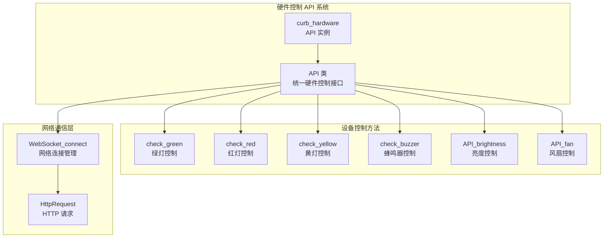

**图表来源**
- [API_risc.ets:7-54](file://entry/src/main/ets/network/API_risc.ets#L7-L54)
- [network_connect.ets:38-321](file://entry/src/main/ets/network/network_connect.ets#L38-L321)

### API 类设计

API 类提供了统一的硬件控制接口，封装了底层的网络通信细节。

#### 核心功能
- **设备控制**：提供针对不同设备的专门控制方法
- **参数验证**：确保控制参数的正确性和安全性
- **错误处理**：提供完善的异常处理和错误报告机制
- **异步支持**：支持异步操作，避免阻塞用户界面

#### 设备控制方法
- **check_green(enabled)**：控制绿灯状态
- **check_red(enabled)**：控制红灯状态  
- **check_yellow(enabled)**：控制黄灯状态
- **check_buzzer(enabled)**：控制蜂鸣器状态
- **API_brightness(num)**：控制小灯亮度
- **API_fan(num)**：控制风扇转速

### 网络通信层

**更新** 硬件控制 API 系统通过网络通信层进行实际的设备通信，提供稳定的网络连接管理和错误处理。

#### WebSocket 连接管理
- **自动重连**：在网络断开时自动尝试重新连接
- **状态监控**：实时监控网络连接状态
- **请求队列**：管理待处理的网络请求
- **超时处理**：处理网络请求超时情况

#### HTTP 请求处理
- **POST 请求**：通过 HTTP POST 方法发送控制指令
- **JSON 数据**：使用标准的 JSON 格式传输控制数据
- **超时配置**：设置合理的连接和读取超时时间
- **错误捕获**：捕获并处理网络通信异常

### API 调用流程

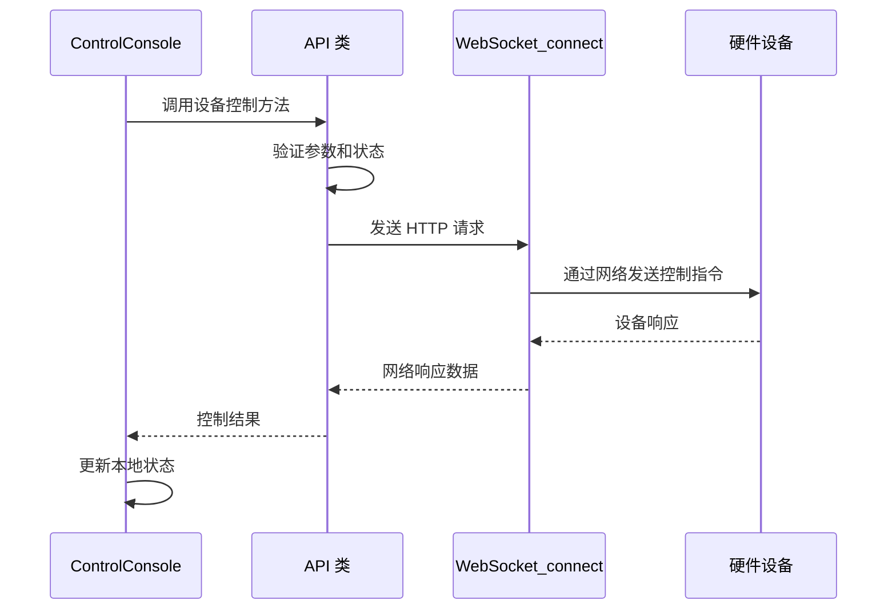

**图表来源**
- [API_risc.ets:24-50](file://entry/src/main/ets/network/API_risc.ets#L24-L50)
- [network_connect.ets:263-298](file://entry/src/main/ets/network/network_connect.ets#L263-L298)

**章节来源**
- [API_risc.ets:1-54](file://entry/src/main/ets/network/API_risc.ets#L1-L54)
- [network_connect.ets:1-321](file://entry/src/main/ets/network/network_connect.ets#L1-L321)

## 设备控制模式系统

ControlConsole 实现了完整的设备控制模式系统，支持三种不同的控制模式：展示模式、告警模式、静音模式。

### 模式概述

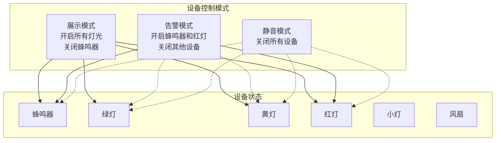

**图表来源**
- [ControlConsole.ets:205-267](file://entry/src/main/ets/components/control/ControlConsole.ets#L205-L267)

### 展示模式 (DISPLAY)

展示模式用于展示设备的所有功能，提供完整的视觉反馈。

#### 功能特性
- **开启所有灯光**：绿灯、黄灯、红灯全部开启
- **关闭蜂鸣器**：确保不会发出声音
- **全亮效果**：为用户提供完整的设备状态展示

#### 实现逻辑
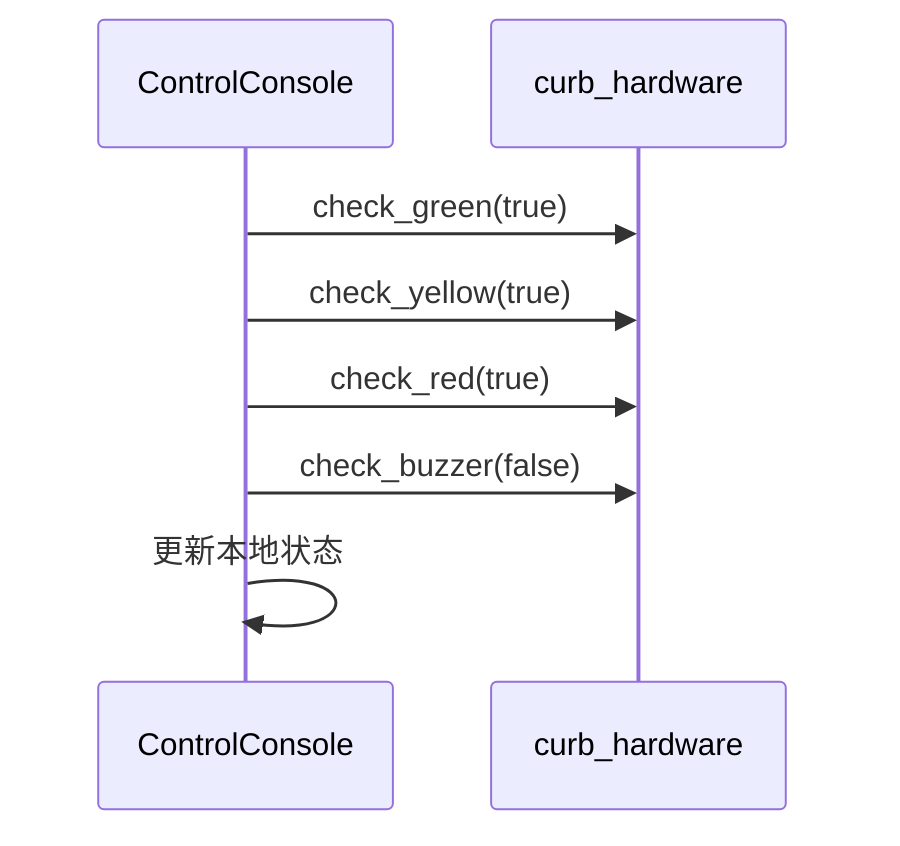

**图表来源**
- [ControlConsole.ets:207-223](file://entry/src/main/ets/components/control/ControlConsole.ets#L207-L223)

### 告警模式 (ALARM)

告警模式用于紧急情况下的设备控制，重点关注告警功能。

#### 功能特性
- **开启蜂鸣器**：提供声音告警
- **开启红灯**：提供视觉告警
- **关闭其他设备**：避免干扰告警信号

#### 实现逻辑
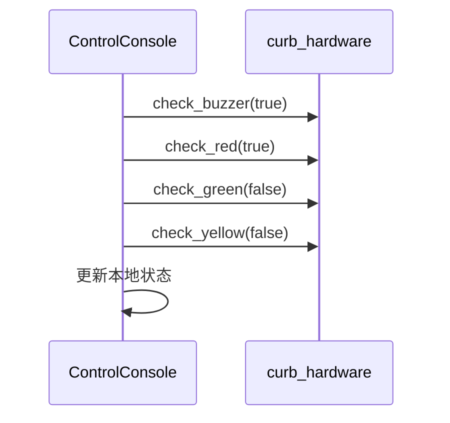

**图表来源**
- [ControlConsole.ets:230-246](file://entry/src/main/ets/components/control/ControlConsole.ets#L230-L246)

### 静音模式 (MUTE)

静音模式用于需要完全静音的环境，关闭所有设备。

#### 功能特性
- **关闭所有设备**：蜂鸣器、所有灯光、风扇等
- **完全静音**：确保不会产生任何声音或光亮
- **节能模式**：减少设备功耗

#### 实现逻辑
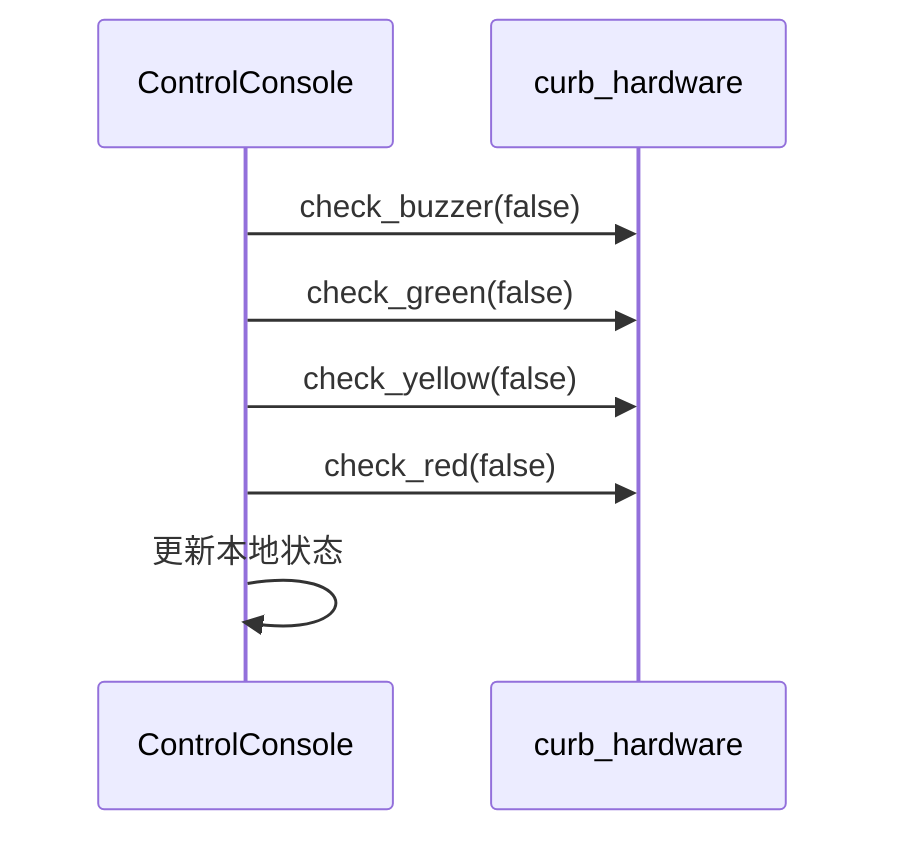

**图表来源**
- [ControlConsole.ets:253-267](file://entry/src/main/ets/components/control/ControlConsole.ets#L253-L267)

### 统一设备控制方法

**更新** controlDevice 方法现在通过硬件控制 API 系统进行设备控制，提供更安全和可控的设备操作。

#### 方法特性
- **参数化控制**：通过设备名称和目标状态控制设备
- **状态更新回调**：提供状态更新的回调机制
- **错误处理**：包含网络通信异常的处理逻辑
- **日志记录**：记录设备控制的操作日志
- **API 集成**：通过硬件控制 API 系统进行设备控制

#### 实现逻辑
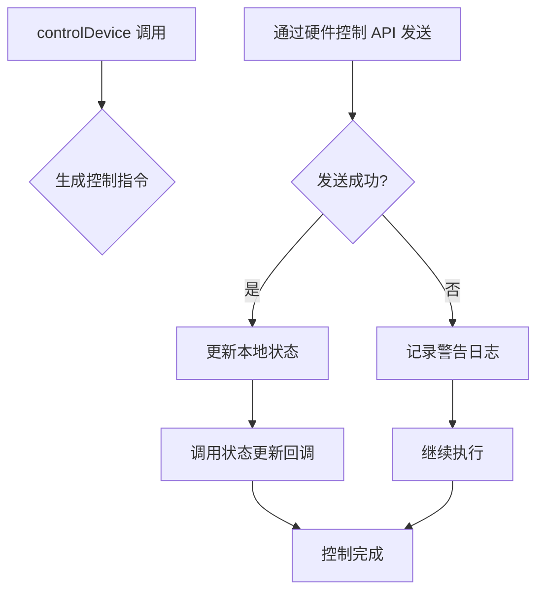

**图表来源**
- [ControlConsole.ets:275-290](file://entry/src/main/ets/components/control/ControlConsole.ets#L275-L290)

**章节来源**
- [ControlConsole.ets:172-290](file://entry/src/main/ets/components/control/ControlConsole.ets#L172-L290)

## 依赖关系分析

ControlConsole 组件的依赖关系体现了清晰的模块化设计原则，各组件之间保持低耦合高内聚的特点。

**更新** 新增了硬件控制 API 系统的依赖关系，以及网络通信层的依赖。

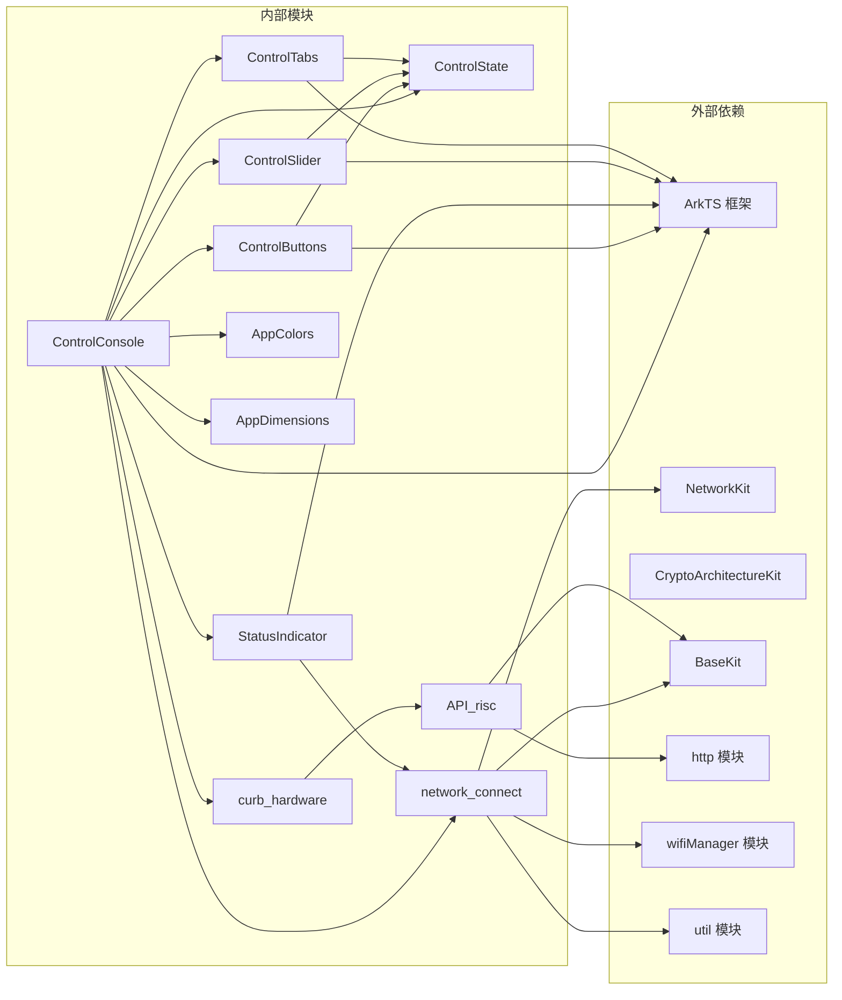

**图表来源**
- [ControlConsole.ets:1-10](file://entry/src/main/ets/components/control/ControlConsole.ets#L1-L10)
- [ControlButtons.ets:1-4](file://entry/src/main/ets/components/control/ControlButtons.ets#L1-L4)
- [StatusIndicator.ets:1-4](file://entry/src/main/ets/components/control/StatusIndicator.ets#L1-L4)
- [ControlSlider.ets:1-3](file://entry/src/main/ets/components/control/ControlSlider.ets#L1-L3)
- [ControlTabs.ets:1-4](file://entry/src/main/ets/components/control/ControlTabs.ets#L1-L4)
- [API_risc.ets:1-2](file://entry/src/main/ets/network/API_risc.ets#L1-L2)
- [network_connect.ets:1-6](file://entry/src/main/ets/network/network_connect.ets#L1-L6)

### 依赖注入模式

ControlConsole 采用了依赖注入的设计模式，通过构造函数参数和属性注入的方式管理依赖关系。

#### 依赖管理策略
- **明确的导入声明**：每个依赖都在文件顶部明确声明
- **单一职责原则**：每个模块只负责特定的功能领域
- **接口抽象**：通过枚举和接口定义抽象依赖契约
- **API 抽象**：通过硬件控制 API 系统抽象底层网络通信
- **网络层抽象**：通过网络连接管理器抽象 WebSocket 通信

**章节来源**
- [ControlConsole.ets:1-10](file://entry/src/main/ets/components/control/ControlConsole.ets#L1-L10)

## 性能考虑

ControlConsole 组件在设计时充分考虑了性能优化，通过多种技术手段确保组件的高效运行。

### 状态管理优化

1. **响应式更新**：使用 @State 装饰器实现细粒度的状态更新
2. **状态同步**：通过 aboutToAppear 方法确保状态的一致性
3. **事件节流**：onStateChange 回调避免频繁的状态更新
4. **模式切换优化**：通过统一的设备控制方法减少重复代码

### 渲染性能优化

1. **布局优化**：使用 Column 和 Row 布局减少重绘开销
2. **样式缓存**：AppColors 和 AppDimensions 常量减少样式计算
3. **条件渲染**：根据状态动态调整组件可见性
4. **API 调用缓存**：硬件控制 API 实例在组件生命周期内复用

### 内存管理

1. **对象复用**：ControlState 对象在组件生命周期内复用
2. **回调清理**：及时清理不再使用的回调函数
3. **资源释放**：组件销毁时释放相关资源
4. **网络连接管理**：通过 network_connect 单例管理 WebSocket 连接
5. **API 实例管理**：curb_hardware 实例在整个应用中共享

### 硬件控制 API 性能

1. **请求合并**：通过 API 类统一管理设备控制请求
2. **错误重试**：网络通信异常时自动重试机制
3. **连接池**：WebSocket 连接的复用和管理
4. **超时控制**：合理的超时设置避免长时间阻塞

## 故障排除指南

### 常见问题及解决方案

#### 状态不同步问题
**问题描述**：UI 状态与业务状态不一致
**解决方案**：检查 aboutToAppear 方法中的状态同步逻辑，确保 selectedButton 与 controlState.selectedButton 保持一致

#### 事件回调失效
**问题描述**：onStateChange 回调不触发
**解决方案**：验证回调函数的绑定和调用时机，确保在状态更新后正确触发回调

#### 硬件控制失败
**问题描述**：设备无法接收控制指令
**解决方案**：检查 hardware 控制 API 系统的连接状态，验证 API 方法的调用和网络通信的有效性

#### 模式切换无效
**问题描述**：按钮点击后设备状态没有变化
**解决方案**：检查 handleButtonClicked 方法中的模式切换逻辑，验证 controlDevice 方法的调用和硬件控制 API 的响应

#### 网络通信异常
**问题描述**：状态指示器无法正常切换设备状态
**解决方案**：检查 network_connect 模块的连接状态，验证 WebSocket 连接的有效性

#### API 调用错误
**问题描述**：硬件控制 API 调用失败
**解决方案**：检查 API 类的实现，验证网络请求的发送和响应处理，查看控制台的错误日志

**章节来源**
- [ControlConsole.ets:24-27](file://entry/src/main/ets/components/control/ControlConsole.ets#L24-L27)
- [ControlConsole.ets:172-200](file://entry/src/main/ets/components/control/ControlConsole.ets#L172-L200)
- [ControlConsole.ets:275-290](file://entry/src/main/ets/components/control/ControlConsole.ets#L275-L290)

### 调试技巧

1. **日志记录**：利用 console.log 输出关键状态变化和模式切换信息
2. **状态监控**：通过浏览器开发者工具监控组件状态
3. **网络调试**：使用网络面板检查 WebSocket 通信状态
4. **API 调试**：通过控制台查看硬件控制 API 的调用和响应
5. **模式验证**：通过日志输出验证不同模式下的设备控制逻辑

## 结论

ControlConsole 组件展现了优秀的软件架构设计原则，通过模块化、组件化的设计实现了高度可维护和可扩展的控制台系统。

**更新** 新集成的硬件控制 API 系统进一步增强了组件的功能性和安全性，提供了结构化、可控且可靠的设备控制解决方案。

### 设计优势

1. **清晰的架构**：分层设计确保了组件职责的明确划分
2. **灵活的扩展**：模块化设计便于添加新的控制功能
3. **良好的用户体验**：直观的界面设计和流畅的交互体验
4. **可靠的通信机制**：完善的组件间通信确保系统稳定性
5. **完整的控制模式**：支持多种设备控制模式，满足不同使用场景
6. **统一的控制接口**：通过 controlDevice 方法提供标准化的设备控制
7. **安全的硬件控制**：通过硬件控制 API 系统提供安全可控的设备操作
8. **稳定的网络通信**：通过网络连接管理器提供可靠的网络通信保障

### 最佳实践建议

1. **状态管理**：遵循单一数据源原则，确保状态的一致性
2. **组件设计**：保持组件的单一职责，避免过度复杂化
3. **错误处理**：完善错误处理机制，提升系统的健壮性
4. **性能优化**：持续关注性能指标，及时发现和解决性能问题
5. **API 使用**：优先使用硬件控制 API 系统进行设备控制，确保安全性
6. **网络管理**：合理使用网络连接管理器，避免网络资源浪费
7. **模式切换**：合理使用设备控制模式，避免不必要的模式切换
8. **日志记录**：完善日志记录机制，便于问题排查和系统监控

该组件为 SmartController 项目提供了坚实的基础，通过其优秀的架构设计和新增的硬件控制 API 系统为后续的功能扩展奠定了良好的基础。新的硬件控制 API 系统不仅提升了系统的安全性，还为未来的设备扩展和功能增强提供了更好的基础设施。