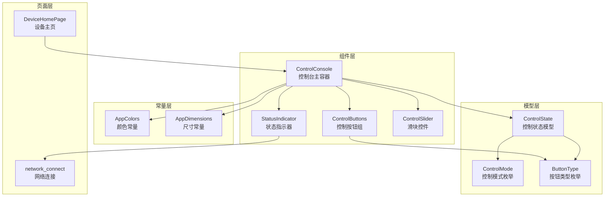
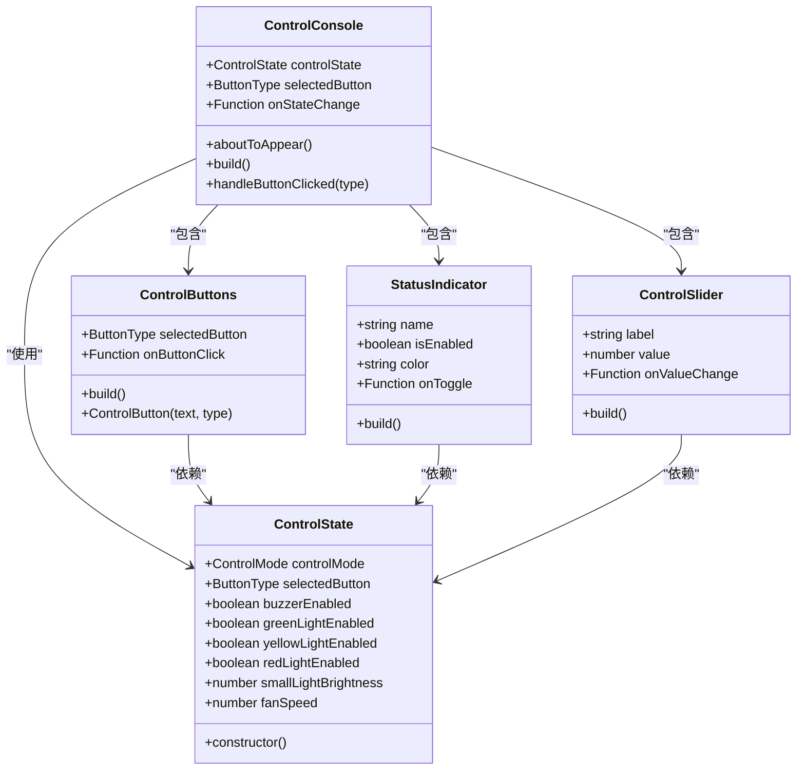
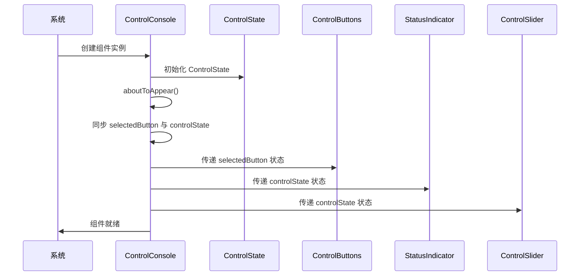
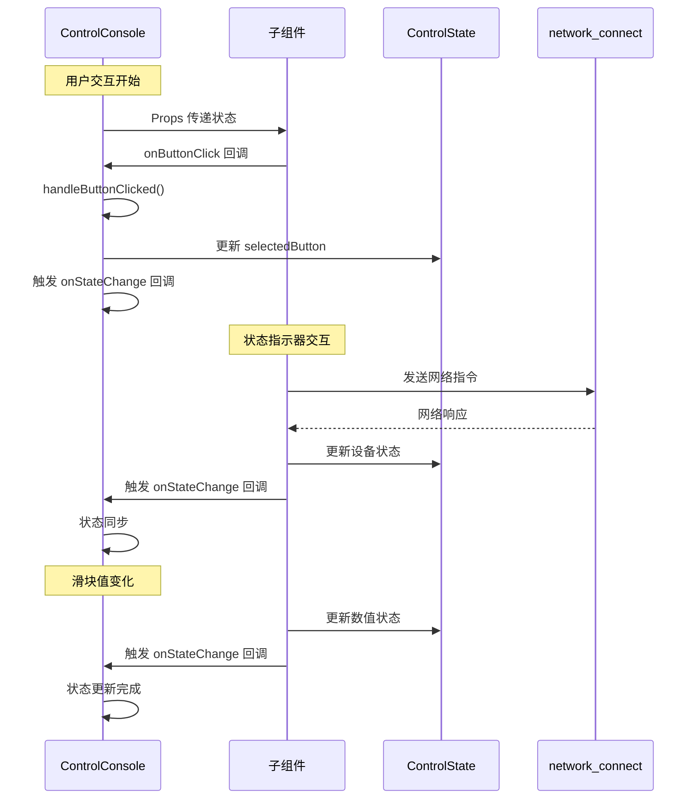
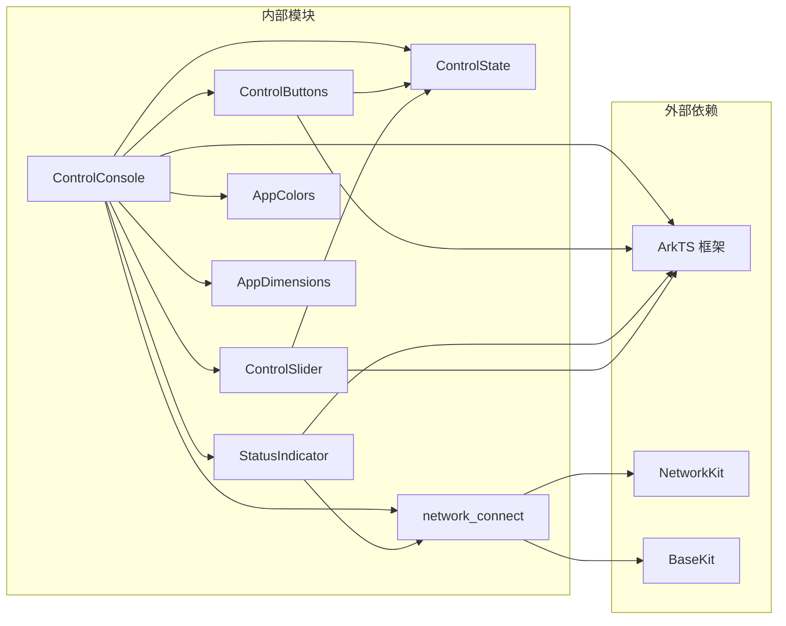

# 控制台主组件

<cite>
**本文档引用的文件**
- [ControlConsole.ets](file://entry/src/main/ets/components/control/ControlConsole.ets)
- [ControlState.ets](file://entry/src/main/ets/models/ControlState.ets)
- [ControlButtons.ets](file://entry/src/main/ets/components/control/ControlButtons.ets)
- [ControlSlider.ets](file://entry/src/main/ets/components/control/ControlSlider.ets)
- [StatusIndicator.ets](file://entry/src/main/ets/components/control/StatusIndicator.ets)
- [AppColors.ets](file://entry/src/main/ets/constants/AppColors.ets)
- [AppDimensions.ets](file://entry/src/main/ets/constants/AppDimensions.ets)
- [DeviceHomePage.ets](file://entry/src/main/ets/pages/DeviceHomePage.ets)
- [network_connect.ets](file://entry/src/main/ets/pages/network_connect.ets)
</cite>

## 目录
1. [简介](#简介)
2. [项目结构](#项目结构)
3. [核心组件](#核心组件)
4. [架构概览](#架构概览)
5. [详细组件分析](#详细组件分析)
6. [依赖关系分析](#依赖关系分析)
7. [性能考虑](#性能考虑)
8. [故障排除指南](#故障排除指南)
9. [结论](#结论)

## 简介

ControlConsole 是 SmartController 项目中的核心控制台主容器组件，负责整合所有设备联动控制功能。该组件采用模块化设计，通过组合多个专用子组件来提供完整的控制界面，包括按钮控制、状态指示、滑块调节等功能。

该组件的主要职责是：
- 作为控制台容器，统一管理所有控制子组件
- 维护全局控制状态，确保各组件间的状态同步
- 处理用户交互事件，协调组件间的通信
- 提供响应式的用户界面，支持实时状态反馈

## 项目结构

ControlConsole 组件位于项目的组件目录结构中，与相关的模型、常量和页面文件共同构成完整的控制台系统。



**图表来源**
- [ControlConsole.ets:1-172](file://entry/src/main/ets/components/control/ControlConsole.ets#L1-L172)
- [ControlState.ets:1-67](file://entry/src/main/ets/models/ControlState.ets#L1-L67)
- [ControlButtons.ets:1-48](file://entry/src/main/ets/components/control/ControlButtons.ets#L1-L48)
- [StatusIndicator.ets:1-39](file://entry/src/main/ets/components/control/StatusIndicator.ets#L1-L39)
- [ControlSlider.ets:1-56](file://entry/src/main/ets/components/control/ControlSlider.ets#L1-L56)

**章节来源**
- [ControlConsole.ets:1-172](file://entry/src/main/ets/components/control/ControlConsole.ets#L1-L172)
- [DeviceHomePage.ets:1-74](file://entry/src/main/ets/pages/DeviceHomePage.ets#L1-L74)

## 核心组件

### ControlConsole 主容器组件

ControlConsole 是整个控制台系统的核心容器，负责协调各个子组件的工作。它采用 @Component 装饰器定义，使用 @State 和 @Prop 状态管理机制。

#### 主要特性
- **状态管理**：维护 ControlState 对象和独立的 selectedButton 状态
- **生命周期管理**：通过 aboutToAppear 方法进行初始化
- **组件集成**：整合 ControlButtons、StatusIndicator、ControlSlider 等子组件
- **事件处理**：提供 onStateChange 回调机制

#### 关键属性
- `controlState`: ControlState 类型，存储所有控制状态
- `selectedButton`: ButtonType 类型，当前选中的按钮
- `onStateChange`: 回调函数，状态变化时的通知机制

**章节来源**
- [ControlConsole.ets:13-25](file://entry/src/main/ets/components/control/ControlConsole.ets#L13-L25)

### ControlState 状态模型

ControlState 是控制台的状态数据模型，定义了所有控制相关的状态变量和默认值。

#### 状态分类
- **控制模式**：SCENE、SWITCH、ANALOG 三种模式
- **按钮状态**：DISPLAY、ALARM、MUTE 三种按钮类型
- **设备状态**：蜂鸣器、各种指示灯的开关状态
- **模拟量**：小灯亮度、风扇转速等可调节参数

#### 默认值设置
组件初始化时会设置合理的默认值，确保用户界面的可用性。

**章节来源**
- [ControlState.ets:28-67](file://entry/src/main/ets/models/ControlState.ets#L28-L67)

## 架构概览

ControlConsole 采用了分层架构设计，通过清晰的组件边界和职责分离实现高度模块化的控制台系统。



**图表来源**
- [ControlConsole.ets:14-172](file://entry/src/main/ets/components/control/ControlConsole.ets#L14-L172)
- [ControlState.ets:28-67](file://entry/src/main/ets/models/ControlState.ets#L28-L67)
- [ControlButtons.ets:11-48](file://entry/src/main/ets/components/control/ControlButtons.ets#L11-L48)
- [StatusIndicator.ets:6-39](file://entry/src/main/ets/components/control/StatusIndicator.ets#L6-L39)
- [ControlSlider.ets:9-56](file://entry/src/main/ets/components/control/ControlSlider.ets#L9-L56)

## 详细组件分析

### ControlConsole 生命周期管理

ControlConsole 的生命周期管理体现了良好的组件设计原则，特别是在 aboutToAppear 方法中的状态初始化逻辑。

#### 生命周期流程



**图表来源**
- [ControlConsole.ets:22-25](file://entry/src/main/ets/components/control/ControlConsole.ets#L22-L25)
- [ControlConsole.ets:41-46](file://entry/src/main/ets/components/control/ControlConsole.ets#L41-L46)

#### 状态初始化逻辑

关于 aboutToAppear 方法中的状态同步，这是一个关键的设计决策：

1. **双重状态管理**：同时维护独立的 selectedButton 和 controlState.selectedButton
2. **状态一致性**：确保 UI 状态与业务状态保持同步
3. **响应式更新**：通过 @State 装饰器实现自动状态更新

**章节来源**
- [ControlConsole.ets:22-25](file://entry/src/main/ets/components/control/ControlConsole.ets#L22-L25)

### 组件内部布局结构

ControlConsole 采用垂直布局设计，将不同的控制功能按照逻辑分组组织。

#### 布局层次结构

```mermaid
graph TB
ControlConsole[ControlConsole 容器]
subgraph "标题区域"
Title[标题栏<br/>Text('设备联动控制台')]
end
subgraph "按钮控制区域"
Buttons[ControlButtons<br/>展示/告警/静音按钮]
end
subgraph "状态指示区域"
IndicatorRow1[Row1<br/>蜂鸣器 + 绿灯]
IndicatorRow2[Row2<br/>黄灯 + 红灯]
end
subgraph "滑块控制区域"
SliderColumn[Column<br/>小灯亮度 + 风扇转速]
end
ControlConsole --> Title
ControlConsole --> Buttons
ControlConsole --> IndicatorRow1
ControlConsole --> IndicatorRow2
ControlConsole --> SliderColumn
```

**图表来源**
- [ControlConsole.ets:27-151](file://entry/src/main/ets/components/control/ControlConsole.ets#L27-L151)

#### 布局特点

1. **垂直排列**：采用 Column 布局，符合用户的阅读习惯
2. **分组设计**：将相关的控制功能组织在一起
3. **响应式间距**：使用 AppDimensions 常量确保一致的间距
4. **卡片化设计**：整体采用圆角卡片样式，提升视觉效果

**章节来源**
- [ControlConsole.ets:27-151](file://entry/src/main/ets/components/control/ControlConsole.ets#L27-L151)

### 组件间通信机制

ControlConsole 实现了复杂的组件间通信机制，通过父子组件的数据传递和事件回调实现松耦合的架构设计。

#### 通信流程



**图表来源**
- [ControlConsole.ets:41-46](file://entry/src/main/ets/components/control/ControlConsole.ets#L41-L46)
- [ControlConsole.ets:54-65](file://entry/src/main/ets/components/control/ControlConsole.ets#L54-L65)
- [ControlConsole.ets:127-132](file://entry/src/main/ets/components/control/ControlConsole.ets#L127-L132)

#### 通信模式

1. **单向数据流**：父组件向子组件传递状态，子组件向父组件传递事件
2. **双向状态同步**：通过 onStateChange 回调实现状态的双向同步
3. **事件冒泡**：子组件通过回调函数向上层组件传递用户操作

**章节来源**
- [ControlConsole.ets:19-20](file://entry/src/main/ets/components/control/ControlConsole.ets#L19-L20)
- [ControlConsole.ets:168-170](file://entry/src/main/ets/components/control/ControlConsole.ets#L168-L170)

### ControlButtons 按钮组组件

ControlButtons 组件实现了单选功能，确保同一时间只有一个按钮处于高亮状态。

#### 功能特性
- **单选机制**：通过 selectedButton 属性控制按钮的高亮状态
- **动态样式**：根据按钮是否被选中动态调整样式
- **响应式交互**：提供流畅的点击反馈

#### 样式设计
组件使用 AppColors 和 AppDimensions 常量确保一致的视觉风格：
- 高亮状态使用 AppColors.BUTTON_HOVER
- 普通状态使用 AppColors.BUTTON_NORMAL
- 边框颜色根据状态动态变化

**章节来源**
- [ControlButtons.ets:17-47](file://entry/src/main/ets/components/control/ControlButtons.ets#L17-L47)

### StatusIndicator 状态指示器

StatusIndicator 组件提供了直观的状态反馈机制，通过视觉元素展示设备的当前状态。

#### 状态可视化
- **发光效果**：启用状态时显示发光效果
- **阴影效果**：启用状态时添加阴影增强立体感
- **颜色编码**：不同状态使用不同的颜色标识

#### 交互设计
组件支持点击切换功能，用户可以直接点击状态指示器来切换设备状态。

**章节来源**
- [StatusIndicator.ets:12-38](file://entry/src/main/ets/components/control/StatusIndicator.ets#L12-L38)

### ControlSlider 滑块控件

ControlSlider 组件提供了精确的数值调节功能，支持 0-100 的范围调节。

#### 控件特性
- **数值显示**：右侧实时显示当前数值百分比
- **滑块交互**：提供直观的拖拽调节体验
- **样式定制**：支持自定义颜色和尺寸

#### 数值处理
组件使用 Math.round() 函数确保显示的数值为整数，提升用户体验。

**章节来源**
- [ControlSlider.ets:17-55](file://entry/src/main/ets/components/control/ControlSlider.ets#L17-L55)

## 依赖关系分析

ControlConsole 组件的依赖关系体现了清晰的模块化设计原则，各组件之间保持低耦合高内聚的特点。



**图表来源**
- [ControlConsole.ets:1-7](file://entry/src/main/ets/components/control/ControlConsole.ets#L1-L7)
- [ControlButtons.ets:1-3](file://entry/src/main/ets/components/control/ControlButtons.ets#L1-L3)
- [StatusIndicator.ets:1-3](file://entry/src/main/ets/components/control/StatusIndicator.ets#L1-L3)
- [ControlSlider.ets:1-2](file://entry/src/main/ets/components/control/ControlSlider.ets#L1-L2)

### 依赖注入模式

ControlConsole 采用了依赖注入的设计模式，通过构造函数参数和属性注入的方式管理依赖关系。

#### 依赖管理策略
- **明确的导入声明**：每个依赖都在文件顶部明确声明
- **单一职责原则**：每个模块只负责特定的功能领域
- **接口抽象**：通过枚举和接口定义抽象依赖契约

**章节来源**
- [ControlConsole.ets:1-7](file://entry/src/main/ets/components/control/ControlConsole.ets#L1-L7)

## 性能考虑

ControlConsole 组件在设计时充分考虑了性能优化，通过多种技术手段确保组件的高效运行。

### 状态管理优化

1. **响应式更新**：使用 @State 装饰器实现细粒度的状态更新
2. **状态同步**：通过 aboutToAppear 方法确保状态的一致性
3. **事件节流**：onStateChange 回调避免频繁的状态更新

### 渲染性能优化

1. **布局优化**：使用 Column 和 Row 布局减少重绘开销
2. **样式缓存**：AppColors 和 AppDimensions 常量减少样式计算
3. **条件渲染**：根据状态动态调整组件可见性

### 内存管理

1. **对象复用**：ControlState 对象在组件生命周期内复用
2. **回调清理**：及时清理不再使用的回调函数
3. **资源释放**：组件销毁时释放相关资源

## 故障排除指南

### 常见问题及解决方案

#### 状态不同步问题
**问题描述**：UI 状态与业务状态不一致
**解决方案**：检查 aboutToAppear 方法中的状态同步逻辑，确保 selectedButton 与 controlState.selectedButton 保持一致

#### 事件回调失效
**问题描述**：onStateChange 回调不触发
**解决方案**：验证回调函数的绑定和调用时机，确保在状态更新后正确触发回调

#### 网络通信异常
**问题描述**：状态指示器无法正常切换设备状态
**解决方案**：检查 network_connect 模块的连接状态，验证 WebSocket 连接的有效性

**章节来源**
- [ControlConsole.ets:22-25](file://entry/src/main/ets/components/control/ControlConsole.ets#L22-L25)
- [ControlConsole.ets:168-170](file://entry/src/main/ets/components/control/ControlConsole.ets#L168-L170)

### 调试技巧

1. **日志记录**：利用 console.log 输出关键状态变化
2. **状态监控**：通过浏览器开发者工具监控组件状态
3. **网络调试**：使用网络面板检查 WebSocket 通信状态

## 结论

ControlConsole 组件展现了优秀的软件架构设计原则，通过模块化、组件化的设计实现了高度可维护和可扩展的控制台系统。

### 设计优势

1. **清晰的架构**：分层设计确保了组件职责的明确划分
2. **灵活的扩展**：模块化设计便于添加新的控制功能
3. **良好的用户体验**：直观的界面设计和流畅的交互体验
4. **可靠的通信机制**：完善的组件间通信确保系统稳定性

### 最佳实践建议

1. **状态管理**：遵循单一数据源原则，确保状态的一致性
2. **组件设计**：保持组件的单一职责，避免过度复杂化
3. **错误处理**：完善错误处理机制，提升系统的健壮性
4. **性能优化**：持续关注性能指标，及时发现和解决性能问题

该组件为 SmartController 项目提供了坚实的基础，通过其优秀的架构设计为后续的功能扩展奠定了良好的基础。