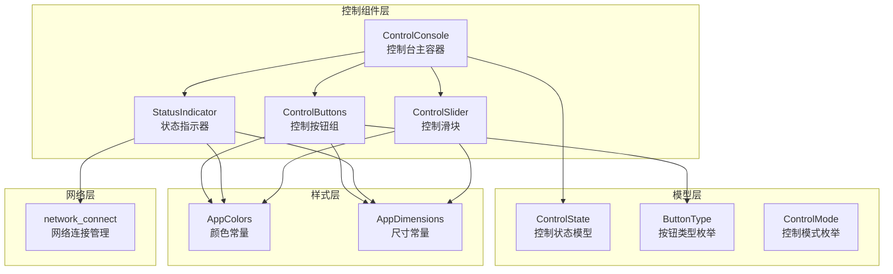
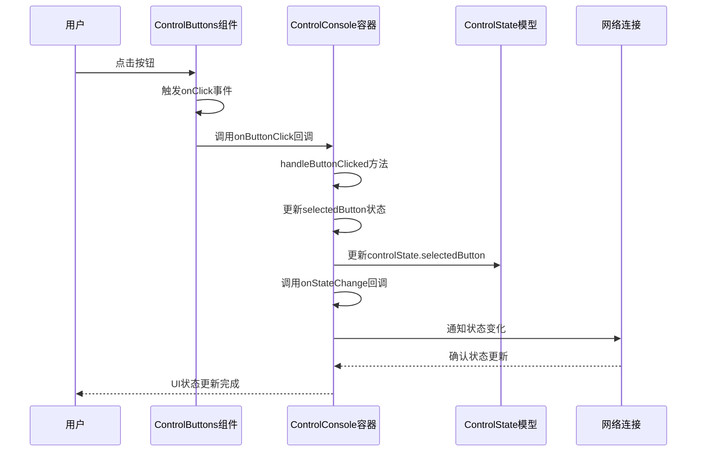
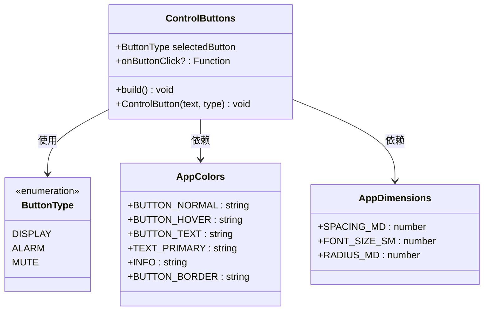
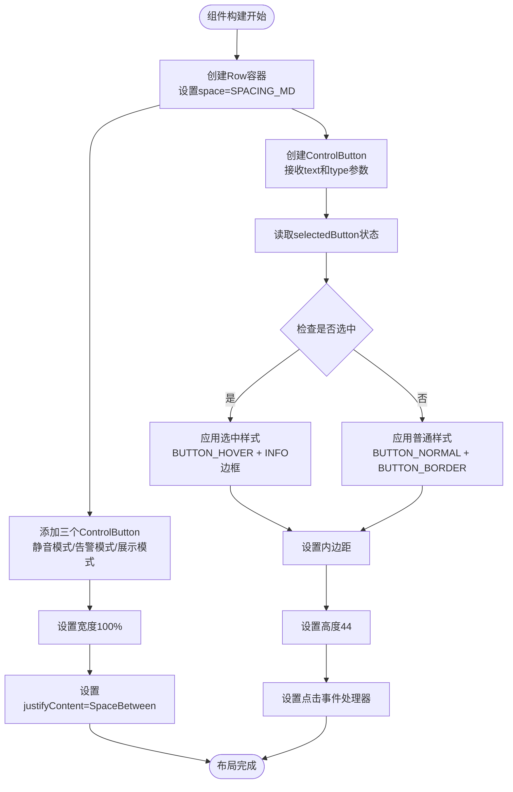
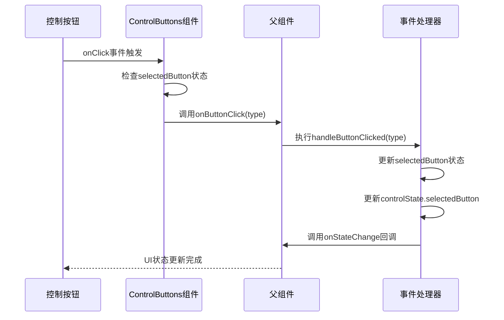
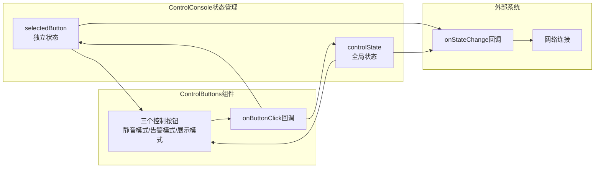
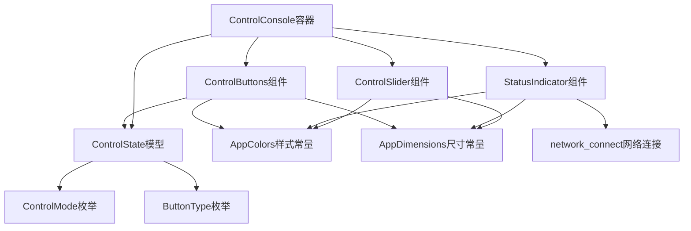

# 控制按钮组件

<cite>
**本文档引用的文件**
- [ControlButtons.ets](file://entry/src/main/ets/components/control/ControlButtons.ets)
- [ControlConsole.ets](file://entry/src/main/ets/components/control/ControlConsole.ets)
- [ControlState.ets](file://entry/src/main/ets/models/ControlState.ets)
- [AppColors.ets](file://entry/src/main/ets/constants/AppColors.ets)
- [AppDimensions.ets](file://entry/src/main/ets/constants/AppDimensions.ets)
- [StatusIndicator.ets](file://entry/src/main/ets/components/control/StatusIndicator.ets)
- [ControlSlider.ets](file://entry/src/main/ets/components/control/ControlSlider.ets)
- [network_connect.ets](file://entry/src/main/ets/pages/network_connect.ets)
</cite>

## 更新摘要
**变更内容**
- 更新了控制按钮布局顺序，从"展示模式/告警模式/静音模式"调整为"静音模式/告警模式/展示模式"
- 改善了用户体验流程，使常用功能（静音模式）更容易访问
- 更新了相关的布局算法和视觉反馈描述

## 目录
1. [简介](#简介)
2. [项目结构](#项目结构)
3. [核心组件](#核心组件)
4. [架构概览](#架构概览)
5. [详细组件分析](#详细组件分析)
6. [依赖关系分析](#依赖关系分析)
7. [性能考虑](#性能考虑)
8. [故障排除指南](#故障排除指南)
9. [结论](#结论)
10. [附录](#附录)

## 简介

控制按钮组件是SmartController项目中设备联动控制台的核心交互组件之一。该组件实现了三种控制模式的切换功能，包括静音模式、告警模式和展示模式。通过单选机制确保同一时间只有一个按钮处于高亮状态，为用户提供清晰的视觉反馈和直观的操作体验。

该组件采用ArkTS框架开发，充分利用了响应式编程的优势，实现了组件状态的自动更新和父子组件间的高效通信。组件设计遵循单一职责原则，专注于控制按钮的渲染和交互逻辑，同时通过枚举类型确保类型安全性和代码可维护性。

**更新** 控制按钮的布局顺序已重新组织，从传统的"展示模式/告警模式/静音模式"调整为"静音模式/告警模式/展示模式"，以改善用户体验流程，使常用功能更容易访问。

## 项目结构

SmartController项目采用模块化的组件架构，控制按钮组件位于`entry/src/main/ets/components/control/`目录下，与相关的状态管理和样式常量文件形成完整的组件生态系统。

**图表来源**
- [ControlConsole.ets:1-172](file://entry/src/main/ets/components/control/ControlConsole.ets#L1-L172)
- [ControlButtons.ets:1-48](file://entry/src/main/ets/components/control/ControlButtons.ets#L1-L48)
- [ControlState.ets:1-67](file://entry/src/main/ets/models/ControlState.ets#L1-L67)

**章节来源**
- [ControlButtons.ets:1-48](file://entry/src/main/ets/components/control/ControlButtons.ets#L1-L48)
- [ControlConsole.ets:1-172](file://entry/src/main/ets/components/control/ControlConsole.ets#L1-L172)
- [ControlState.ets:1-67](file://entry/src/main/ets/models/ControlState.ets#L1-L67)

## 核心组件

### 按钮类型枚举

按钮类型枚举定义了控制按钮的三种操作模式，每种模式对应不同的设备控制行为：

- **DISPLAY模式**：展示模式，用于正常显示设备状态和控制界面
- **ALARM模式**：告警模式，用于设备异常状态下的特殊控制
- **MUTE模式**：静音模式，用于暂时禁用设备的声音输出

这些枚举值不仅用于UI状态管理，还作为组件间通信的数据载体，确保状态的一致性和类型安全性。

**更新** 按钮的布局顺序已调整为静音模式优先，符合用户操作习惯，使静音功能更容易被访问。

### 状态管理机制

控制按钮组件采用了双状态管理模式：
1. **独立状态(selectedButton)**：确保UI能够正确响应用户交互
2. **全局状态(controlState)**：维护完整的设备控制状态

这种设计避免了状态不同步的问题，确保UI更新和业务逻辑的协调一致。

**章节来源**
- [ControlState.ets:13-23](file://entry/src/main/ets/models/ControlState.ets#L13-L23)
- [ControlConsole.ets:15-25](file://entry/src/main/ets/components/control/ControlConsole.ets#L15-L25)

## 架构概览

控制按钮组件在整个系统架构中扮演着关键角色，它既是用户交互的入口点，也是状态传播的枢纽。组件间的关系体现了清晰的关注点分离和职责划分。

**图表来源**
- [ControlButtons.ets:42-46](file://entry/src/main/ets/components/control/ControlButtons.ets#L42-L46)
- [ControlConsole.ets:156-171](file://entry/src/main/ets/components/control/ControlConsole.ets#L156-L171)

**章节来源**
- [ControlButtons.ets:10-48](file://entry/src/main/ets/components/control/ControlButtons.ets#L10-L48)
- [ControlConsole.ets:13-172](file://entry/src/main/ets/components/control/ControlConsole.ets#L13-L172)

## 详细组件分析

### ControlButtons组件架构

ControlButtons组件是一个结构化组件(@struct)，专门负责渲染三个控制按钮并处理用户交互。组件采用Builder模式实现内部按钮的复用，确保代码的简洁性和可维护性。

#### 类结构图

**图表来源**
- [ControlButtons.ets:10-48](file://entry/src/main/ets/components/control/ControlButtons.ets#L10-L48)
- [ControlState.ets:16-23](file://entry/src/main/ets/models/ControlState.ets#L16-L23)
- [AppColors.ets:5-47](file://entry/src/main/ets/constants/AppColors.ets#L5-L47)
- [AppDimensions.ets:5-40](file://entry/src/main/ets/constants/AppDimensions.ets#L5-L40)

#### 布局算法实现

ControlButtons组件采用Flex布局实现水平排列和间距控制：

1. **水平排列**：使用Row容器配合SpaceBetween属性实现按钮的均匀分布
2. **间距控制**：通过AppDimensions.SPACING_MD常量统一管理按钮间的间距
3. **响应式适配**：利用layoutWeight(1)属性确保按钮在容器内平均分配空间

**更新** 按钮的布局顺序已调整为：静音模式(MUTE) → 告警模式(ALARM) → 展示模式(DISPLAY)，这种顺序更符合用户的操作习惯，使静音功能更容易被访问。

**图表来源**
- [ControlButtons.ets:17-25](file://entry/src/main/ets/components/control/ControlButtons.ets#L17-L25)
- [ControlButtons.ets:27-47](file://entry/src/main/ets/components/control/ControlButtons.ets#L27-L47)

**章节来源**
- [ControlButtons.ets:17-47](file://entry/src/main/ets/components/control/ControlButtons.ets#L17-L47)

### 事件处理机制

事件处理机制采用分层设计，确保事件能够正确传递到父组件并触发相应的状态更新：

1. **按钮点击捕获**：每个按钮都绑定了onClick事件处理器
2. **类型判断**：通过比较按钮的type属性和组件的selectedButton状态进行判断
3. **回调传递**：将按钮类型作为参数传递给父组件的回调函数

**图表来源**
- [ControlButtons.ets:42-46](file://entry/src/main/ets/components/control/ControlButtons.ets#L42-L46)
- [ControlConsole.ets:156-171](file://entry/src/main/ets/components/control/ControlConsole.ets#L156-L171)

**章节来源**
- [ControlButtons.ets:42-46](file://entry/src/main/ets/components/control/ControlButtons.ets#L42-L46)
- [ControlConsole.ets:156-171](file://entry/src/main/ets/components/control/ControlConsole.ets#L156-L171)

### 按钮状态的视觉反馈

组件实现了完整的视觉反馈系统，通过CSS样式的变化直观地反映按钮的状态：

#### 选中状态样式
- **文字颜色**：使用AppColors.TEXT_PRIMARY(#FFFFFF)实现高对比度显示
- **字体粗细**：Medium权重突出选中状态
- **背景颜色**：使用AppColors.BUTTON_HOVER(#253755)营造悬浮效果
- **边框颜色**：使用AppColors.INFO(#3498DB)强调选中状态

#### 普通状态样式
- **文字颜色**：使用AppColors.BUTTON_TEXT(#C0D0E0)保持适度的视觉层次
- **字体粗细**：Normal权重维持常规状态
- **背景颜色**：使用AppColors.BUTTON_NORMAL(#1A2A42)提供统一的视觉基础
- **边框颜色**：使用AppColors.BUTTON_BORDER(#2D3E50)确保边界清晰

#### 响应式交互效果
- **悬停效果**：通过hover状态实现动态的视觉反馈
- **点击反馈**：即时的状态变化确保用户操作的确认感
- **过渡动画**：平滑的颜色和样式变化提升用户体验

**章节来源**
- [ControlButtons.ets:28-47](file://entry/src/main/ets/components/control/ControlButtons.ets#L28-L47)
- [AppColors.ets:26-31](file://entry/src/main/ets/constants/AppColors.ets#L26-L31)

### 组件与父级ControlConsole的数据交互

ControlConsole作为父组件，负责管理ControlButtons的状态同步和事件处理：

#### 状态同步机制
1. **初始化同步**：在aboutToAppear生命周期中将controlState.selectedButton同步到selectedButton
2. **双向更新**：用户点击按钮时同时更新两个状态变量
3. **回调通知**：通过onStateChange回调通知外部组件状态变化

#### 数据流图

**图表来源**
- [ControlConsole.ets:156-171](file://entry/src/main/ets/components/control/ControlConsole.ets#L156-L171)
- [ControlConsole.ets:41-46](file://entry/src/main/ets/components/control/ControlConsole.ets#L41-L46)

**章节来源**
- [ControlConsole.ets:156-171](file://entry/src/main/ets/components/control/ControlConsole.ets#L156-L171)
- [ControlConsole.ets:41-46](file://entry/src/main/ets/components/control/ControlConsole.ets#L41-L46)

## 依赖关系分析

控制按钮组件的依赖关系体现了清晰的分层架构和模块化设计：

**图表来源**
- [ControlButtons.ets:1-3](file://entry/src/main/ets/components/control/ControlButtons.ets#L1-L3)
- [ControlConsole.ets:1-7](file://entry/src/main/ets/components/control/ControlConsole.ets#L1-L7)

### 外部依赖分析

组件对外部依赖的管理体现了良好的架构设计：

1. **ArkTS框架**：充分利用响应式编程和组件化开发的优势
2. **网络连接**：通过network_connect模块实现设备控制命令的传输
3. **样式系统**：统一的颜色和尺寸常量确保视觉一致性
4. **状态管理**：基于@State和@Prop的响应式状态管理机制

**章节来源**
- [ControlButtons.ets:1-3](file://entry/src/main/ets/components/control/ControlButtons.ets#L1-L3)
- [ControlConsole.ets:1-7](file://entry/src/main/ets/components/control/ControlConsole.ets#L1-L7)

## 性能考虑

控制按钮组件在设计时充分考虑了性能优化和用户体验：

### 响应式更新优化
- **状态追踪**：直接读取selectedButton属性确保ArkTS能够正确追踪响应式依赖
- **最小化重绘**：仅在状态变化时触发UI更新，避免不必要的重绘
- **内存管理**：合理使用@Prop和@State装饰器，避免内存泄漏

### 渲染性能优化
- **布局计算**：使用Flex布局减少复杂的定位计算
- **样式缓存**：通过常量定义避免重复的样式计算
- **事件处理**：采用事件委托机制减少事件处理器的数量

### 用户体验优化
- **即时反馈**：按钮状态变化提供即时的视觉反馈
- **无障碍支持**：合理的颜色对比度和字体大小确保可访问性
- **触摸友好**：适当的按钮尺寸和间距适应移动设备操作

**更新** 新的按钮布局顺序进一步优化了用户体验，使静音模式作为第一个按钮更容易被用户发现和使用。

## 故障排除指南

### 常见问题及解决方案

#### 状态不同步问题
**症状**：按钮状态与实际控制状态不一致
**原因**：只更新了一个状态变量而忽略了另一个
**解决方案**：确保在handleButtonClicked方法中同时更新selectedButton和controlState.selectedButton

#### 事件处理失效
**症状**：按钮点击无响应
**原因**：onButtonClick回调未正确传递或处理
**解决方案**：检查父组件的回调函数绑定和参数传递

#### 样式显示异常
**症状**：按钮样式不符合预期
**原因**：颜色或尺寸常量配置错误
**解决方案**：验证AppColors和AppDimensions常量的值

#### 按钮顺序问题
**症状**：按钮显示顺序不符合预期
**原因**：布局顺序与用户期望不符
**解决方案**：检查ControlButtons组件中的按钮添加顺序，确认已按照静音模式/告警模式/展示模式的顺序排列

**章节来源**
- [ControlConsole.ets:156-171](file://entry/src/main/ets/components/control/ControlConsole.ets#L156-L171)

## 结论

控制按钮组件作为SmartController项目的核心交互组件，展现了优秀的架构设计和实现质量。组件通过清晰的职责分离、完善的事件处理机制和直观的视觉反馈，为用户提供了流畅的设备控制体验。

组件的设计充分体现了现代前端开发的最佳实践：
- **类型安全**：通过枚举类型确保代码的健壮性
- **响应式设计**：利用ArkTS的响应式特性实现高效的UI更新
- **模块化架构**：清晰的组件边界和依赖关系便于维护和扩展
- **用户体验**：注重细节的视觉设计和交互反馈

**更新** 最新的布局调整进一步提升了用户体验，通过将静音模式置于首位，使常用功能更容易被用户访问，符合现代UI设计的最佳实践。

未来可以在以下方面进一步改进：
- 添加更多的按钮类型支持
- 实现更丰富的动画效果
- 增强无障碍访问功能
- 优化移动端的触摸交互体验

## 附录

### 按钮自定义和扩展指南

#### 添加新的按钮类型

要添加新的按钮类型，需要进行以下步骤：

1. **更新枚举定义**：在ButtonType枚举中添加新的类型
2. **更新按钮渲染**：在ControlButtons组件中添加对应的按钮实例
3. **更新样式配置**：根据新按钮的功能选择合适的颜色和样式
4. **更新状态处理**：在父组件中添加相应的新状态处理逻辑

#### 修改样式主题

组件支持通过AppColors和AppDimensions常量进行主题定制：

1. **颜色主题**：修改AppColors中的颜色常量值
2. **尺寸主题**：调整AppDimensions中的尺寸常量
3. **字体主题**：通过AppDimensions.FONT_SIZE_*常量调整字体大小
4. **圆角主题**：通过AppDimensions.RADIUS_*常量调整圆角半径

#### 扩展交互功能

组件的交互功能可以通过以下方式进行扩展：
- 添加按钮的长按功能
- 实现按钮的拖拽排序
- 添加按钮的动画效果
- 增加按钮的键盘快捷键支持

**更新** 新的按钮布局顺序已经过优化，确保用户最常用的功能（静音模式）最容易被访问，这体现了以用户为中心的设计理念。