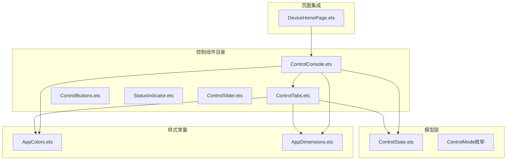
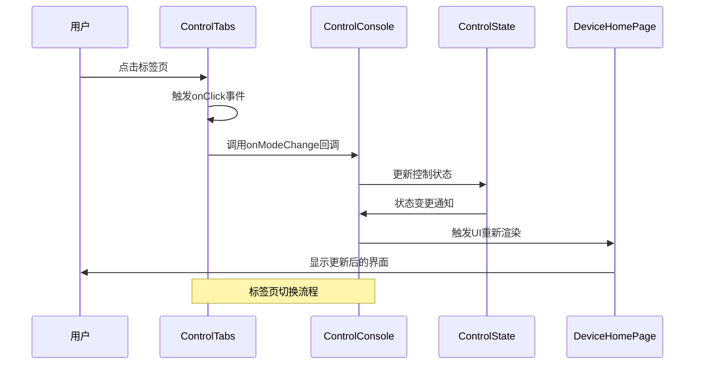
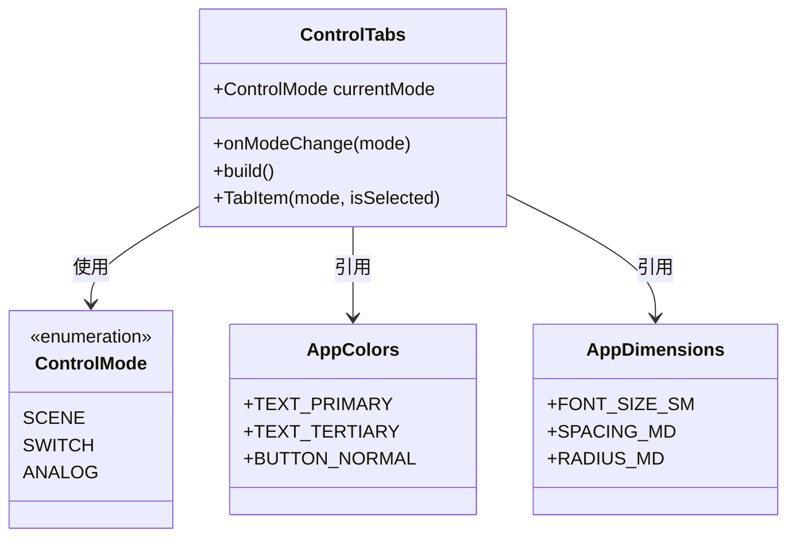
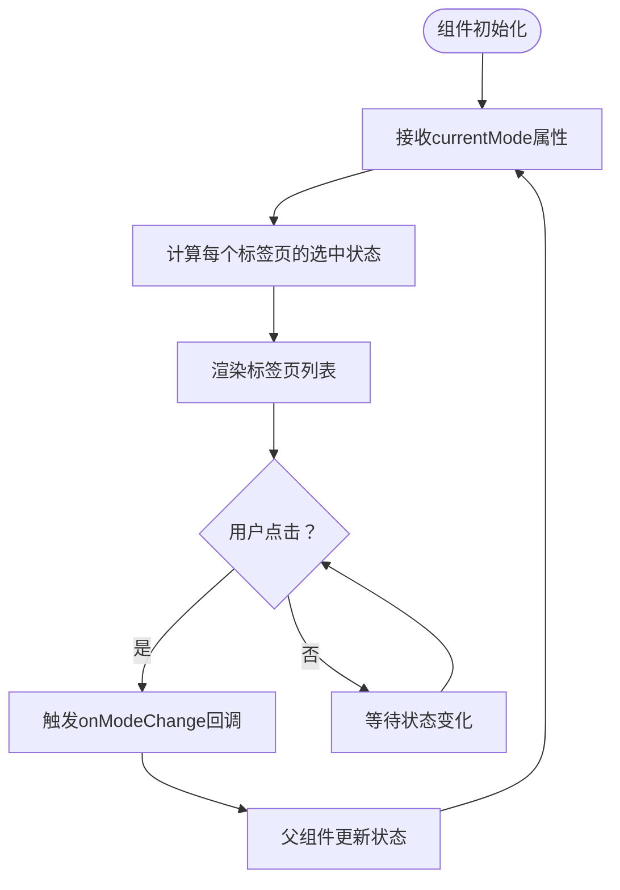
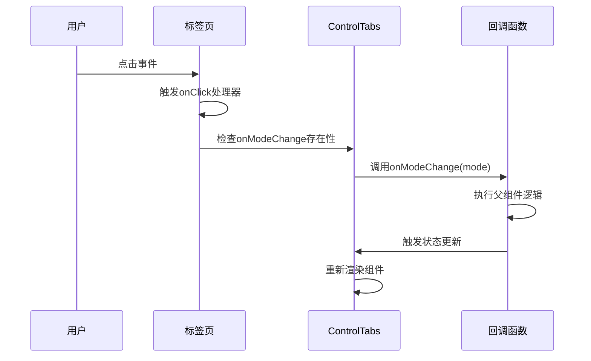
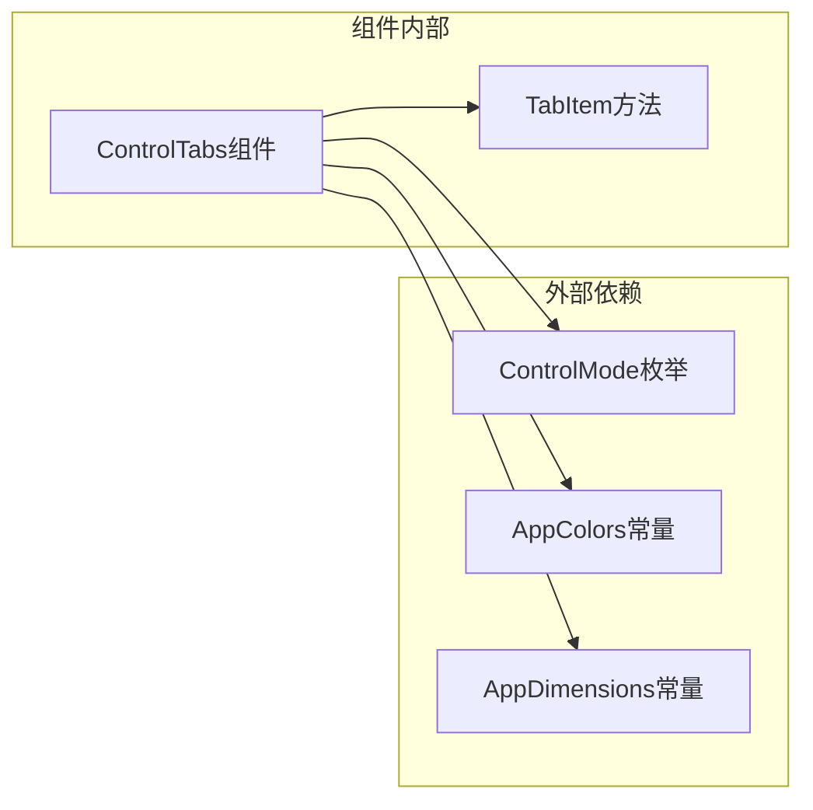

# 控制标签页组件

<cite>
**本文档引用的文件**
- [ControlTabs.ets](file://entry/src/main/ets/components/control/ControlTabs.ets)
- [ControlState.ets](file://entry/src/main/ets/models/ControlState.ets)
- [AppColors.ets](file://entry/src/main/ets/constants/AppColors.ets)
- [AppDimensions.ets](file://entry/src/main/ets/constants/AppDimensions.ets)
- [ControlConsole.ets](file://entry/src/main/ets/components/control/ControlConsole.ets)
- [DeviceHomePage.ets](file://entry/src/main/ets/pages/DeviceHomePage.ets)
</cite>

## 目录
1. [简介](#简介)
2. [项目结构](#项目结构)
3. [核心组件](#核心组件)
4. [架构概览](#架构概览)
5. [详细组件分析](#详细组件分析)
6. [依赖关系分析](#依赖关系分析)
7. [性能考虑](#性能考虑)
8. [故障排除指南](#故障排除指南)
9. [结论](#结论)

## 简介

控制标签页组件是一个用于切换不同控制模式的用户界面组件，支持场景模式、开关模式和模拟量模式之间的切换。该组件采用简洁的设计理念，通过视觉反馈清晰地指示当前选中的标签页状态。

## 项目结构

控制标签页组件位于项目的控制组件目录中，与相关的样式常量和状态管理文件共同构成了完整的控制界面生态系统。

**图表来源**
- [ControlTabs.ets:1-41](file://entry/src/main/ets/components/control/ControlTabs.ets#L1-L41)
- [ControlConsole.ets:1-172](file://entry/src/main/ets/components/control/ControlConsole.ets#L1-L172)
- [ControlState.ets:1-67](file://entry/src/main/ets/models/ControlState.ets#L1-L67)

**章节来源**
- [ControlTabs.ets:1-41](file://entry/src/main/ets/components/control/ControlTabs.ets#L1-L41)
- [ControlState.ets:1-67](file://entry/src/main/ets/models/ControlState.ets#L1-L67)

## 核心组件

### ControlTabs 组件

ControlTabs 是一个结构化组件，负责渲染三个控制模式标签页。组件采用属性驱动的方式，通过 props 接收当前模式状态和回调函数。

**主要特性：**
- 支持三种控制模式：场景模式、开关模式、模拟量模式
- 动态样式根据选中状态自动调整
- 点击事件处理和状态回调机制
- 响应式布局设计

**关键属性：**
- `currentMode`: 当前选中的控制模式（受控属性）
- `onModeChange`: 模式切换回调函数

**章节来源**
- [ControlTabs.ets:10-14](file://entry/src/main/ets/components/control/ControlTabs.ets#L10-L14)

## 架构概览

控制标签页组件在整个应用架构中扮演着重要的角色，它与控制台组件和状态管理紧密协作，形成完整的控制界面解决方案。

**图表来源**
- [ControlTabs.ets:35-39](file://entry/src/main/ets/components/control/ControlTabs.ets#L35-L39)
- [ControlConsole.ets:156-171](file://entry/src/main/ets/components/control/ControlConsole.ets#L156-L171)

## 详细组件分析

### 标签页创建机制

ControlTabs 组件通过内部方法 `TabItem` 创建每个标签页元素，采用条件渲染的方式根据当前选中状态应用不同的样式。

**图表来源**
- [ControlTabs.ets:10-41](file://entry/src/main/ets/components/control/ControlTabs.ets#L10-L41)
- [ControlState.ets:4-11](file://entry/src/main/ets/models/ControlState.ets#L4-L11)
- [AppColors.ets:5-47](file://entry/src/main/ets/constants/AppColors.ets#L5-L47)

### 标签页激活状态管理

组件通过 props 接收当前模式状态，并在构建过程中动态计算每个标签页的选中状态。激活状态的判断基于完全相等比较，确保精确的状态匹配。

**状态管理流程：**

**图表来源**
- [ControlTabs.ets:16-24](file://entry/src/main/ets/components/control/ControlTabs.ets#L16-L24)
- [ControlTabs.ets:35-39](file://entry/src/main/ets/components/control/ControlTabs.ets#L35-L39)

### 内容展示逻辑

ControlTabs 采用简单的文本显示方式，每个标签页显示对应的模式名称。组件通过样式系统实现视觉区分，包括字体颜色、粗细、背景色和圆角边框。

**样式应用机制：**
- 选中状态：使用主文字颜色和按钮背景色
- 未选中状态：使用第三级文字颜色和透明背景
- 动态样式：根据 isSelected 参数动态切换

**章节来源**
- [ControlTabs.ets:27-40](file://entry/src/main/ets/components/control/ControlTabs.ets#L27-L40)

### 布局设计分析

组件采用水平排列布局，使用 Row 容器和 Flex 布局实现标签页的水平分布。

**布局特性：**
- **水平排列**：使用 Row 容器实现水平布局
- **间距控制**：通过 space 属性控制标签页间的间距
- **起始对齐**：使用 FlexAlign.Start 实现左对齐
- **宽度适配**：整体宽度设置为 100%，适应容器宽度变化

**响应式适配：**
- 自动适应容器宽度变化
- 标签页数量固定，不进行动态调整
- 基于内容的自然宽度分配

**章节来源**
- [ControlTabs.ets:16-24](file://entry/src/main/ets/components/control/ControlTabs.ets#L16-L24)

### 事件处理机制

组件实现了完整的事件处理机制，包括点击事件的捕获、当前标签的确定和回调函数的调用。

**事件处理流程：**

**图表来源**
- [ControlTabs.ets:35-39](file://entry/src/main/ets/components/control/ControlTabs.ets#L35-L39)

### 状态管理与持久化

ControlTabs 采用受控组件模式，状态完全由父组件管理。组件本身不维护内部状态，只负责根据传入的 props 渲染相应的 UI。

**状态管理模式：**
- **单向数据流**：状态从父组件流向子组件
- **外部控制**：组件行为完全由外部 props 控制
- **无内部状态**：组件不维护任何内部状态变量

**UI状态同步：**
- 通过 props 传递当前模式状态
- 根据状态变化自动更新样式
- 保持 UI 与业务状态的一致性

**章节来源**
- [ControlTabs.ets:11-14](file://entry/src/main/ets/components/control/ControlTabs.ets#L11-L14)

### 内容渲染机制

组件采用静态内容渲染方式，每个标签页显示固定的模式名称文本。渲染机制简单高效，不需要复杂的动态加载逻辑。

**渲染特点：**
- **静态文本**：标签页内容为固定字符串
- **条件样式**：根据状态动态应用样式
- **无懒加载**：所有标签页同时渲染
- **即时响应**：状态变化立即反映在 UI 上

### 使用场景

ControlTabs 组件适用于多种控制界面场景：

**主要应用场景：**
1. **多模式控制界面**：在不同控制模式间快速切换
2. **设置面板**：在不同设置分组间导航
3. **功能分类展示**：对相似功能进行分类组织
4. **设备控制台**：作为控制台的主要导航元素

**集成示例：**
组件通常与 ControlConsole 组件配合使用，提供完整的控制界面解决方案。

**章节来源**
- [DeviceHomePage.ets:46](file://entry/src/main/ets/pages/DeviceHomePage.ets#L46)

### 样式自定义选项

组件提供了丰富的样式自定义选项，支持通过样式常量进行统一的主题控制。

**可自定义样式属性：**
- **字体样式**：字体大小、字体粗细
- **颜色方案**：文字颜色、背景颜色
- **边框样式**：圆角半径、边框样式
- **间距控制**：内边距、外边距

**样式常量引用：**
- 使用 AppDimensions 统一管理尺寸规范
- 使用 AppColors 提供一致的颜色体系
- 支持主题切换和品牌定制

**章节来源**
- [ControlTabs.ets:28-34](file://entry/src/main/ets/components/control/ControlTabs.ets#L28-L34)
- [AppColors.ets:5-47](file://entry/src/main/ets/constants/AppColors.ets#L5-L47)
- [AppDimensions.ets:5-40](file://entry/src/main/ets/constants/AppDimensions.ets#L5-L40)

## 依赖关系分析

ControlTabs 组件的依赖关系相对简单，主要依赖于样式常量和状态枚举。

**图表来源**
- [ControlTabs.ets:1-3](file://entry/src/main/ets/components/control/ControlTabs.ets#L1-L3)

**依赖分析：**
- **低耦合设计**：组件仅依赖必要的样式和状态定义
- **单一职责**：专注于标签页渲染和交互处理
- **易于测试**：依赖关系简单，便于单元测试
- **可扩展性**：支持通过 props 扩展功能

**章节来源**
- [ControlTabs.ets:1-41](file://entry/src/main/ets/components/control/ControlTabs.ets#L1-L41)

## 性能考虑

ControlTabs 组件具有良好的性能特征：

**性能优势：**
- **轻量级渲染**：仅包含少量静态元素，渲染开销极小
- **无状态管理**：避免了复杂的状态更新逻辑
- **简单事件处理**：点击事件处理逻辑简单直接
- **内存效率**：不维护额外的内部状态或缓存

**优化建议：**
- 可以考虑添加虚拟化支持以处理大量标签页
- 可以实现防抖机制避免频繁的状态切换
- 可以添加过渡动画提升用户体验

## 故障排除指南

**常见问题及解决方案：**

1. **标签页样式异常**
   - 检查 AppColors 和 AppDimensions 常量定义
   - 确认样式值的有效性和兼容性

2. **点击事件无效**
   - 验证 onModeChange 回调函数的正确性
   - 检查父组件的状态更新逻辑

3. **状态不一致**
   - 确认 currentMode 属性的正确传递
   - 验证父组件的状态管理机制

4. **布局问题**
   - 检查容器的宽度和高度设置
   - 验证 Flex 布局参数的正确性

**调试技巧：**
- 使用日志输出验证事件触发
- 检查 props 传递的正确性
- 验证样式应用的优先级

## 结论

ControlTabs 组件是一个设计精良的控制标签页组件，具有以下突出特点：

**设计优势：**
- **简洁明了**：界面设计直观易懂
- **功能完整**：涵盖标签页切换的核心需求
- **易于集成**：与现有组件生态无缝协作
- **可扩展性强**：支持进一步的功能增强

**技术特点：**
- 采用受控组件模式，状态管理清晰
- 使用现代 UI 框架的最佳实践
- 具备良好的性能表现和可维护性
- 提供完善的样式定制能力

该组件为 SmartController 项目提供了可靠的控制界面基础，能够有效支持各种控制场景的需求。通过合理的架构设计和丰富的自定义选项，组件能够在保持简洁的同时满足复杂的业务需求。