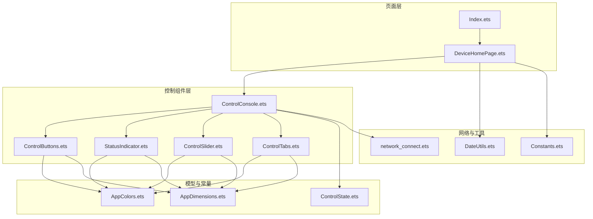
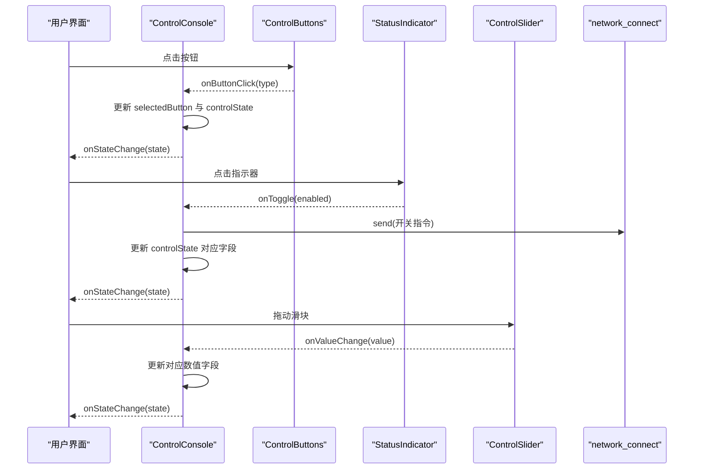
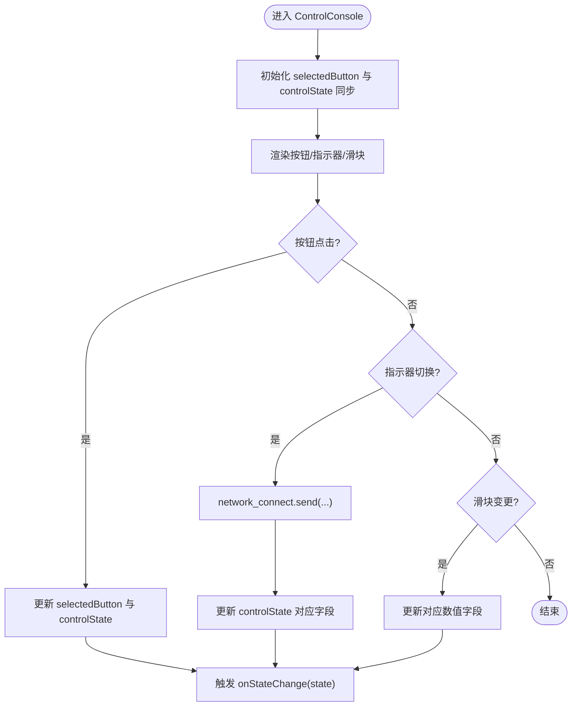
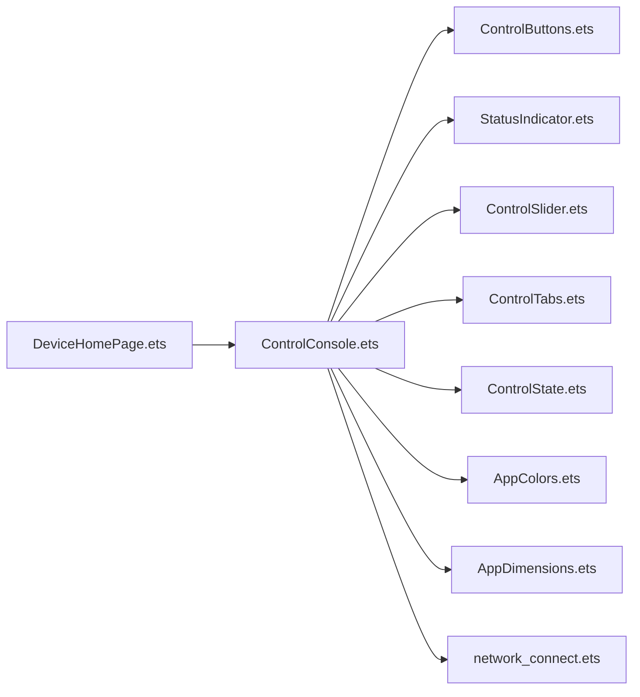

# 控制组件

<cite>
**本文引用的文件**
- [ControlConsole.ets](file://entry/src/main/ets/components/control/ControlConsole.ets)
- [ControlButtons.ets](file://entry/src/main/ets/components/control/ControlButtons.ets)
- [ControlSlider.ets](file://entry/src/main/ets/components/control/ControlSlider.ets)
- [ControlTabs.ets](file://entry/src/main/ets/components/control/ControlTabs.ets)
- [StatusIndicator.ets](file://entry/src/main/ets/components/control/StatusIndicator.ets)
- [ControlState.ets](file://entry/src/main/ets/models/ControlState.ets)
- [AppColors.ets](file://entry/src/main/ets/constants/AppColors.ets)
- [AppDimensions.ets](file://entry/src/main/ets/constants/AppDimensions.ets)
- [network_connect.ets](file://entry/src/main/ets/pages/network_connect.ets)
- [DeviceHomePage.ets](file://entry/src/main/ets/pages/DeviceHomePage.ets)
- [Index.ets](file://entry/src/main/ets/pages/Index.ets)
- [Constants.ets](file://entry/src/main/ets/common/Constants.ets)
- [DateUtils.ets](file://entry/src/main/ets/utils/DateUtils.ets)
</cite>

## 目录
1. [简介](#简介)
2. [项目结构](#项目结构)
3. [核心组件](#核心组件)
4. [架构总览](#架构总览)
5. [组件详解](#组件详解)
6. [依赖关系分析](#依赖关系分析)
7. [性能考量](#性能考量)
8. [故障排查指南](#故障排查指南)
9. [结论](#结论)
10. [附录](#附录)

## 简介
本文件系统性梳理“控制组件”的整体架构与实现，覆盖控制台主容器、按钮组、滑块、标签页与状态指示器五大组件，重点阐释：
- 多模式控制的集成与状态管理
- 控制按钮的设计模式（布局、事件与视觉反馈）
- 滑块组件的数值范围、步进与实时更新机制
- 标签页的切换逻辑与内容展示
- 状态指示器的颜色编码、视觉反馈与状态同步
- 组件间通信与数据流管理
- 响应式设计与触摸交互
- 自定义控制组件的开发指引

## 项目结构
控制组件位于 entry/src/main/ets/components/control 下，配合 models、constants、pages 等模块协同工作。控制台主容器整合按钮、状态指示器与滑块，并通过回调将状态回传给上层页面。

图表来源
- [DeviceHomePage.ets:27-73](file://entry/src/main/ets/pages/DeviceHomePage.ets#L27-L73)
- [ControlConsole.ets:13-172](file://entry/src/main/ets/components/control/ControlConsole.ets#L13-L172)
- [ControlButtons.ets:10-48](file://entry/src/main/ets/components/control/ControlButtons.ets#L10-L48)
- [StatusIndicator.ets:8-44](file://entry/src/main/ets/components/control/StatusIndicator.ets#L8-L44)
- [ControlSlider.ets:8-56](file://entry/src/main/ets/components/control/ControlSlider.ets#L8-L56)
- [ControlTabs.ets:9-41](file://entry/src/main/ets/components/control/ControlTabs.ets#L9-L41)
- [ControlState.ets:28-67](file://entry/src/main/ets/models/ControlState.ets#L28-L67)
- [AppColors.ets:5-47](file://entry/src/main/ets/constants/AppColors.ets#L5-L47)
- [AppDimensions.ets:5-40](file://entry/src/main/ets/constants/AppDimensions.ets#L5-L40)
- [network_connect.ets:39-322](file://entry/src/main/ets/pages/network_connect.ets#L39-L322)
- [DateUtils.ets:4-28](file://entry/src/main/ets/utils/DateUtils.ets#L4-L28)
- [Constants.ets:4-82](file://entry/src/main/ets/common/Constants.ets#L4-L82)

章节来源
- [DeviceHomePage.ets:27-73](file://entry/src/main/ets/pages/DeviceHomePage.ets#L27-L73)
- [Index.ets:13-115](file://entry/src/main/ets/pages/Index.ets#L13-L115)

## 核心组件
- 控制台主容器：聚合按钮、状态指示器、滑块与标签页，统一管理控制状态并通过回调向外传递
- 控制按钮组：单选按钮集合，负责模式选择
- 状态指示器：圆形指示灯 + 文本，支持点击切换与颜色编码
- 滑块：数值输入控件，支持范围与步进
- 标签页：模式切换标签，用于场景/开关/模拟量三类模式

章节来源
- [ControlConsole.ets:13-172](file://entry/src/main/ets/components/control/ControlConsole.ets#L13-L172)
- [ControlButtons.ets:10-48](file://entry/src/main/ets/components/control/ControlButtons.ets#L10-L48)
- [StatusIndicator.ets:8-44](file://entry/src/main/ets/components/control/StatusIndicator.ets#L8-L44)
- [ControlSlider.ets:8-56](file://entry/src/main/ets/components/control/ControlSlider.ets#L8-L56)
- [ControlTabs.ets:9-41](file://entry/src/main/ets/components/control/ControlTabs.ets#L9-L41)

## 架构总览
控制台采用“容器 + 子组件”模式，状态集中于 ControlState，通过 @State/@Prop 实现响应式更新。按钮与滑块通过回调将变更写回状态，状态指示器在点击时更新自身状态并触发网络发送。页面通过 onStateChange 接收最新状态，实现跨组件的数据流闭环。

图表来源
- [ControlConsole.ets:41-171](file://entry/src/main/ets/components/control/ControlConsole.ets#L41-L171)
- [ControlButtons.ets:42-46](file://entry/src/main/ets/components/control/ControlButtons.ets#L42-L46)
- [StatusIndicator.ets:38-42](file://entry/src/main/ets/components/control/StatusIndicator.ets#L38-L42)
- [ControlSlider.ets:39-43](file://entry/src/main/ets/components/control/ControlSlider.ets#L39-L43)
- [network_connect.ets:263-299](file://entry/src/main/ets/pages/network_connect.ets#L263-L299)

## 组件详解

### 控制台主容器（ControlConsole）
- 职责：整合按钮、状态指示器、滑块与标签页；维护 ControlState；向上传递状态变更
- 状态管理：@State controlState 作为单一真相源；@State selectedButton 独立维护选中态，保证 UI 即时更新
- 事件处理：按钮点击、指示器切换、滑块值变更均通过回调写回 controlState，并触发 onStateChange
- 视觉反馈：统一卡片背景、圆角与间距，标题、按钮、指示器与滑块分层布局
- 网络通信：状态指示器切换时通过 network_connect 发送指令，实现设备联动

图表来源
- [ControlConsole.ets:22-25](file://entry/src/main/ets/components/control/ControlConsole.ets#L22-L25)
- [ControlConsole.ets:156-171](file://entry/src/main/ets/components/control/ControlConsole.ets#L156-L171)
- [ControlConsole.ets:49-144](file://entry/src/main/ets/components/control/ControlConsole.ets#L49-L144)

章节来源
- [ControlConsole.ets:13-172](file://entry/src/main/ets/components/control/ControlConsole.ets#L13-L172)

### 控制按钮（ControlButtons）
- 设计模式：单选按钮组，同一时刻仅一个按钮高亮
- 布局：Row 等分布局，按钮宽度可按权重扩展
- 事件：onClick 触发 onButtonClick，父组件据此更新选中态
- 视觉反馈：根据 selectedButton 动态切换文字颜色、背景色、边框与加粗程度

章节来源
- [ControlButtons.ets:10-48](file://entry/src/main/ets/components/control/ControlButtons.ets#L10-L48)

### 状态指示器（StatusIndicator）
- 设计原理：圆形指示灯 + 文本标签，点击触发 onToggle
- 颜色编码：通过 color 参数传入状态色（成功/警告/错误/信息），启用时填充该色，禁用时半透明
- 动画效果：无内置动画，但可通过颜色与透明度变化提供即时反馈
- 状态同步：点击后更新自身状态并触发 onToggle，父组件负责持久化与下发

章节来源
- [StatusIndicator.ets:8-44](file://entry/src/main/ets/components/control/StatusIndicator.ets#L8-L44)

### 滑块（ControlSlider）
- 数值范围：0-100，步进 1
- 实时更新：onChange 回调将当前值传回父组件，父组件更新 controlState 并通过 onStateChange 传播
- 视觉反馈：左侧标签、中间滑块、右侧百分比数值，滑块主题色与轨道色可配

章节来源
- [ControlSlider.ets:8-56](file://entry/src/main/ets/components/control/ControlSlider.ets#L8-L56)

### 标签页（ControlTabs）
- 切换逻辑：点击标签触发 onModeChange，父组件据此更新当前模式
- 内容展示：当前选中项高亮显示，未选中项弱化呈现

章节来源
- [ControlTabs.ets:9-41](file://entry/src/main/ets/components/control/ControlTabs.ets#L9-L41)

### 状态模型（ControlState）
- 字段：控制模式、按钮选中态、各类执行器状态、小灯亮度、风扇转速、执行器占用与联动占比
- 默认值：构造函数统一初始化，确保组件首次渲染一致性

章节来源
- [ControlState.ets:28-67](file://entry/src/main/ets/models/ControlState.ets#L28-L67)

### 颜色与尺寸常量
- AppColors：统一管理背景、文字、状态、控件、分隔线、阴影等颜色
- AppDimensions：统一管理间距、圆角、字体、高度、滑块尺寸等

章节来源
- [AppColors.ets:5-47](file://entry/src/main/ets/constants/AppColors.ets#L5-L47)
- [AppDimensions.ets:5-40](file://entry/src/main/ets/constants/AppDimensions.ets#L5-L40)

## 依赖关系分析
- 控制台对子组件的依赖：按钮、指示器、滑块、标签页
- 控制台对模型与常量的依赖：ControlState、AppColors、AppDimensions
- 控制台对网络模块的依赖：network_connect 用于发送控制指令
- 页面对控制台的依赖：DeviceHomePage 引入 ControlConsole，并通过 onStateChange 订阅状态

图表来源
- [ControlConsole.ets:1-8](file://entry/src/main/ets/components/control/ControlConsole.ets#L1-L8)
- [DeviceHomePage.ets:3-4](file://entry/src/main/ets/pages/DeviceHomePage.ets#L3-L4)

章节来源
- [ControlConsole.ets:1-8](file://entry/src/main/ets/components/control/ControlConsole.ets#L1-L8)
- [DeviceHomePage.ets:3-4](file://entry/src/main/ets/pages/DeviceHomePage.ets#L3-L4)

## 性能考量
- 响应式更新：@State/@Prop 确保局部刷新，避免全量重绘
- 独立状态：selectedButton 独立维护，减少不必要的状态合并导致的渲染抖动
- 事件节流：滑块 onChange 为连续事件，建议在父组件进行去抖或批量更新策略（如需要）
- 网络发送：network_connect.send 已做连接状态检查与重连，避免频繁阻塞 UI 线程
- 视觉资源：AppColors/AppDimensions 统一管理，减少硬编码带来的维护成本与内存浪费

## 故障排查指南
- 指示器点击无反应
  - 检查 onToggle 回调是否正确传入父组件
  - 确认 network_connect.state 为在线状态
- 滑块值不更新
  - 检查 onValueChange 是否写回 controlState
  - 确认父组件 onStateChange 是否被调用
- 按钮选中态不同步
  - 确认 ControlConsole.aboutToAppear 中 selectedButton 与 controlState 同步逻辑
- 网络异常
  - 查看 network_connect.reconnect 流程与 WiFi 监听是否注册
  - 检查 WebSocket 事件绑定与错误处理

章节来源
- [ControlConsole.ets:22-25](file://entry/src/main/ets/components/control/ControlConsole.ets#L22-L25)
- [ControlConsole.ets:156-171](file://entry/src/main/ets/components/control/ControlConsole.ets#L156-L171)
- [network_connect.ets:77-99](file://entry/src/main/ets/pages/network_connect.ets#L77-L99)
- [network_connect.ets:105-131](file://entry/src/main/ets/pages/network_connect.ets#L105-L131)

## 结论
控制组件通过清晰的职责划分与统一的状态模型，实现了多模式控制的集成与状态管理。按钮、滑块与状态指示器在视觉与交互上保持一致的风格，结合网络模块实现设备联动。建议在复杂场景下引入更细粒度的状态拆分与事件去抖策略，以进一步提升性能与稳定性。

## 附录

### 组件间通信与数据流
- 子组件通过回调向父组件传递变更
- 父组件更新 ControlState 并通过 onStateChange 向上层广播
- 页面订阅状态变化，实现跨组件的数据同步

章节来源
- [ControlConsole.ets:41-171](file://entry/src/main/ets/components/control/ControlConsole.ets#L41-L171)
- [DeviceHomePage.ets:45](file://entry/src/main/ets/pages/DeviceHomePage.ets#L45)

### 响应式设计与触摸交互
- 响应式：@State/@Prop 提供响应式依赖追踪
- 触摸交互：按钮与指示器使用 onClick，滑块使用 onChange，满足移动端触控体验

章节来源
- [ControlButtons.ets:42-46](file://entry/src/main/ets/components/control/ControlButtons.ets#L42-L46)
- [StatusIndicator.ets:38-42](file://entry/src/main/ets/components/control/StatusIndicator.ets#L38-L42)
- [ControlSlider.ets:39-43](file://entry/src/main/ets/components/control/ControlSlider.ets#L39-L43)

### 自定义控制组件开发指引
- 明确职责边界：每个组件只负责单一功能域
- 使用 @Prop/@State 管理输入与内部状态
- 通过回调向上游传递变更，避免跨层级直接修改
- 统一使用 AppColors/AppDimensions 保证视觉一致性
- 如需网络交互，封装专用模块并在组件内仅做调用
- 为关键流程添加日志与错误处理，便于调试与排障