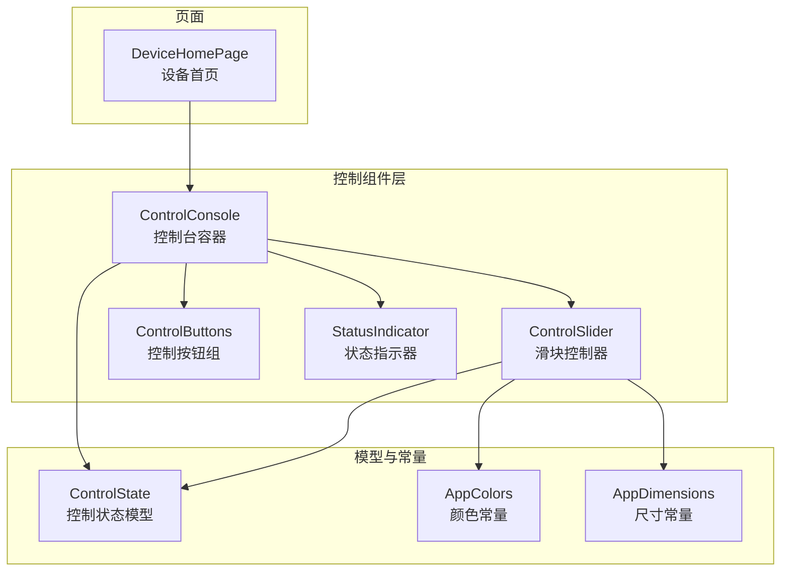
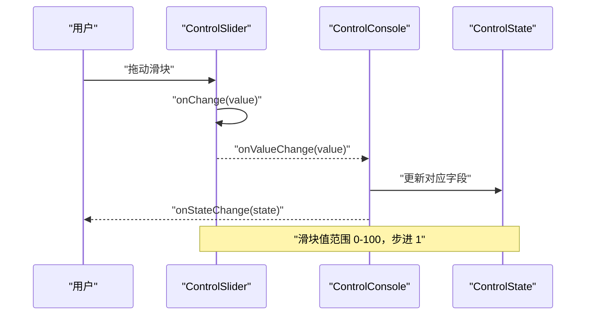
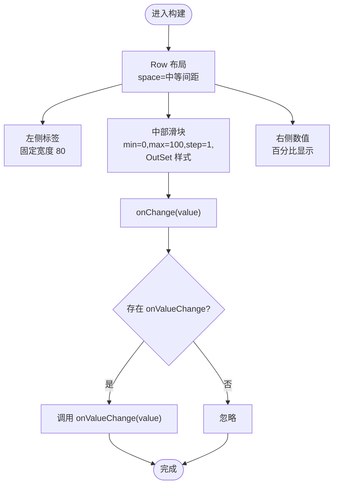
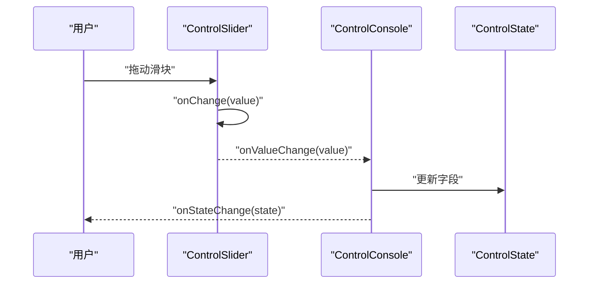
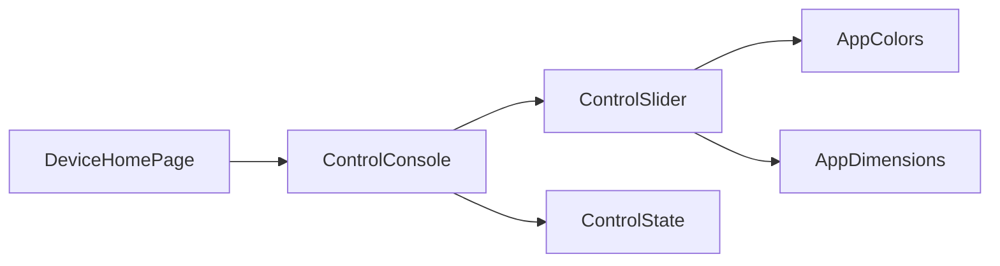

# 滑块控制器组件

<cite>
**本文引用的文件**
- [ControlSlider.ets](file://entry/src/main/ets/components/control/ControlSlider.ets)
- [ControlConsole.ets](file://entry/src/main/ets/components/control/ControlConsole.ets)
- [AppColors.ets](file://entry/src/main/ets/constants/AppColors.ets)
- [AppDimensions.ets](file://entry/src/main/ets/constants/AppDimensions.ets)
- [ControlState.ets](file://entry/src/main/ets/models/ControlState.ets)
- [DeviceHomePage.ets](file://entry/src/main/ets/pages/DeviceHomePage.ets)
- [ControlButtons.ets](file://entry/src/main/ets/components/control/ControlButtons.ets)
- [StatusIndicator.ets](file://entry/src/main/ets/components/control/StatusIndicator.ets)
</cite>

## 目录
1. [简介](#简介)
2. [项目结构](#项目结构)
3. [核心组件](#核心组件)
4. [架构总览](#架构总览)
5. [详细组件分析](#详细组件分析)
6. [依赖关系分析](#依赖关系分析)
7. [性能考虑](#性能考虑)
8. [故障排查指南](#故障排查指南)
9. [结论](#结论)
10. [附录](#附录)

## 简介
本文件围绕滑块控制器组件 ControlSlider 的实现与使用进行系统化说明，涵盖数值范围与步进、交互行为（拖拽、数值输入）、实时更新机制、配置项、回调触发时机与参数、视觉反馈（数值显示、进度条与触摸态）、在设备控制中的典型场景（亮度、转速、参数设置），以及样式定制与主题适配、与其他控制组件的协同方案。

## 项目结构
ControlSlider 位于控制类组件目录下，作为设备联动控制台的一部分被使用；其样式与尺寸通过统一常量模块管理；控制状态由 ControlState 统一持有并在 ControlConsole 中集中更新。

图表来源
- [ControlSlider.ets:1-56](file://entry/src/main/ets/components/control/ControlSlider.ets#L1-L56)
- [ControlConsole.ets:1-172](file://entry/src/main/ets/components/control/ControlConsole.ets#L1-L172)
- [AppColors.ets:1-47](file://entry/src/main/ets/constants/AppColors.ets#L1-L47)
- [AppDimensions.ets:1-40](file://entry/src/main/ets/constants/AppDimensions.ets#L1-L40)
- [ControlState.ets:1-67](file://entry/src/main/ets/models/ControlState.ets#L1-L67)
- [DeviceHomePage.ets:1-74](file://entry/src/main/ets/pages/DeviceHomePage.ets#L1-L74)

章节来源
- [ControlSlider.ets:1-56](file://entry/src/main/ets/components/control/ControlSlider.ets#L1-L56)
- [ControlConsole.ets:1-172](file://entry/src/main/ets/components/control/ControlConsole.ets#L1-L172)
- [AppColors.ets:1-47](file://entry/src/main/ets/constants/AppColors.ets#L1-L47)
- [AppDimensions.ets:1-40](file://entry/src/main/ets/constants/AppDimensions.ets#L1-L40)
- [ControlState.ets:1-67](file://entry/src/main/ets/models/ControlState.ets#L1-L67)
- [DeviceHomePage.ets:1-74](file://entry/src/main/ets/pages/DeviceHomePage.ets#L1-L74)

## 核心组件
- ControlSlider：封装标签、滑块与数值显示三段布局，内部使用系统 Slider 并绑定最小值 0、最大值 100、步进 1，支持自定义滑块样式与尺寸，并在 onChange 回调中触发外部 onValueChange。
- ControlConsole：控制台容器，聚合按钮组、状态指示器与滑块组，负责将滑块变更同步到 ControlState，并通过 onStateChange 通知上层。
- AppColors/AppDimensions：统一颜色与尺寸规范，保证主题一致性与可维护性。
- ControlState：设备控制状态的数据模型，包含小灯亮度与风扇转速等模拟量字段。

章节来源
- [ControlSlider.ets:8-56](file://entry/src/main/ets/components/control/ControlSlider.ets#L8-L56)
- [ControlConsole.ets:13-151](file://entry/src/main/ets/components/control/ControlConsole.ets#L13-L151)
- [AppColors.ets:5-47](file://entry/src/main/ets/constants/AppColors.ets#L5-L47)
- [AppDimensions.ets:5-40](file://entry/src/main/ets/constants/AppDimensions.ets#L5-L40)
- [ControlState.ets:28-67](file://entry/src/main/ets/models/ControlState.ets#L28-L67)

## 架构总览
ControlSlider 作为叶子级 UI 组件，通过属性与回调与父组件解耦；ControlConsole 作为状态与事件的中枢，负责将用户交互转化为对 ControlState 的更新，并向上抛出状态变更。

图表来源
- [ControlSlider.ets:26-43](file://entry/src/main/ets/components/control/ControlSlider.ets#L26-L43)
- [ControlConsole.ets:124-143](file://entry/src/main/ets/components/control/ControlConsole.ets#L124-L143)

## 详细组件分析

### ControlSlider 组件
- 结构组成
  - 左侧标签：固定宽度，字号与文字颜色来自 AppDimensions 与 AppColors。
  - 中部滑块：系统 Slider，最小值 0、最大值 100、步进 1、样式为 OutSet，滑块块颜色、轨道颜色、选中进度颜色、轨道厚度与滑块尺寸均通过 AppColors 与 AppDimensions 定制。
  - 右侧数值：百分比显示，四舍五入到整数，字号与颜色来自 AppDimensions 与 AppColors。
- 数值范围与步进
  - 范围：固定 0-100。
  - 步进：固定 1。
- 实时更新机制
  - onChange 回调直接将当前值传给外部 onValueChange，供父组件更新状态。
- 视觉反馈
  - 数值显示：右侧百分比文本，随滑块值实时更新。
  - 进度条效果：通过 selectedColor 与 trackColor 区分未选中与已选中轨道。
  - 触摸交互状态：通过 blockColor 与 hover 状态下的颜色差异体现。
- 配置选项
  - label：字符串，左侧显示的标签文本。
  - value：number，当前值（0-100）。
  - onValueChange：回调函数，参数为 number（当前值）。
- 边界限制
  - Slider 内部会约束输入在 [min, max] 范围内，且按 step 对齐；组件未暴露外部 props 来修改 min/max/step，因此默认行为不可变。

图表来源
- [ControlSlider.ets:17-55](file://entry/src/main/ets/components/control/ControlSlider.ets#L17-L55)

章节来源
- [ControlSlider.ets:8-56](file://entry/src/main/ets/components/control/ControlSlider.ets#L8-L56)
- [AppColors.ets:32-35](file://entry/src/main/ets/constants/AppColors.ets#L32-L35)
- [AppDimensions.ets:32-33](file://entry/src/main/ets/constants/AppDimensions.ets#L32-L33)

### ControlConsole 与滑块联动
- 使用方式
  - 在 ControlConsole 中以属性形式注入 label、value 与 onValueChange。
  - 将 ControlSlider 的 value 绑定到 ControlState 对应字段（如小灯亮度、风扇转速）。
  - 在 onValueChange 中更新 ControlState，并通过 onStateChange 通知上层。
- 交互流程
  - 用户拖动滑块 → onChange 触发 → onValueChange 更新 ControlState → ControlConsole 通过 onStateChange 上抛状态。

图表来源
- [ControlConsole.ets:124-143](file://entry/src/main/ets/components/control/ControlConsole.ets#L124-L143)
- [ControlState.ets:41-44](file://entry/src/main/ets/models/ControlState.ets#L41-L44)

章节来源
- [ControlConsole.ets:123-144](file://entry/src/main/ets/components/control/ControlConsole.ets#L123-L144)
- [ControlState.ets:41-44](file://entry/src/main/ets/models/ControlState.ets#L41-L44)

### 其他控制组件的协同
- ControlButtons：提供模式选择（展示/告警/静音），与滑块共同构成控制台的完整交互面。
- StatusIndicator：提供开关型状态指示与切换，与滑块的连续调节形成互补。

章节来源
- [ControlButtons.ets:10-48](file://entry/src/main/ets/components/control/ControlButtons.ets#L10-L48)
- [StatusIndicator.ets:5-39](file://entry/src/main/ets/components/control/StatusIndicator.ets#L5-L39)

## 依赖关系分析
- ControlSlider 依赖 AppColors 与 AppDimensions 提供的颜色与尺寸常量，保证主题一致与可配置。
- ControlConsole 依赖 ControlState 管理状态，并将滑块变更与按钮、状态指示器的变更统一纳入状态流。
- 页面 DeviceHomePage 引入 ControlConsole，形成从页面到具体控制组件的链路。

图表来源
- [ControlSlider.ets:1-2](file://entry/src/main/ets/components/control/ControlSlider.ets#L1-L2)
- [ControlConsole.ets:1-6](file://entry/src/main/ets/components/control/ControlConsole.ets#L1-L6)
- [DeviceHomePage.ets:3-6](file://entry/src/main/ets/pages/DeviceHomePage.ets#L3-L6)

章节来源
- [ControlSlider.ets:1-2](file://entry/src/main/ets/components/control/ControlSlider.ets#L1-L2)
- [ControlConsole.ets:1-6](file://entry/src/main/ets/components/control/ControlConsole.ets#L1-L6)
- [DeviceHomePage.ets:3-6](file://entry/src/main/ets/pages/DeviceHomePage.ets#L3-L6)

## 性能考虑
- 滑块更新频率：onChange 在拖动过程中高频触发，建议在 onValueChange 中避免重计算或昂贵操作，必要时进行节流/去抖。
- 状态同步：ControlConsole 通过 onStateChange 一次性上抛状态，减少中间层重复渲染。
- 样式常量化：AppColors 与 AppDimensions 统一管理，避免硬编码带来的维护成本与渲染差异。

## 故障排查指南
- 滑块无响应
  - 检查是否正确传入 onValueChange，且父组件是否更新了绑定的 value。
  - 确认 Slider 的 onChange 是否被触发（可在 onChange 内打印日志验证）。
- 数值不更新
  - 确认右侧文本使用 Math.round(value) 显示，若需要保留小数，需在父组件处理格式化。
- 样式异常
  - 检查 AppColors 与 AppDimensions 中对应键值是否正确，确认主题切换后颜色/尺寸是否生效。
- 状态未同步
  - 确保 ControlConsole 的 onValueChange 中更新了 ControlState，并触发了 onStateChange。

章节来源
- [ControlSlider.ets:39-43](file://entry/src/main/ets/components/control/ControlSlider.ets#L39-L43)
- [ControlConsole.ets:127-132](file://entry/src/main/ets/components/control/ControlConsole.ets#L127-L132)

## 结论
ControlSlider 以简洁的三段式布局与系统 Slider 的强交互能力，提供了直观、可定制的连续值调节体验。通过与 ControlConsole、ControlState 的配合，实现了从用户交互到状态更新再到上层通知的完整闭环。其默认的 0-100 范围与步进 1 适合亮度、转速等常见设备参数调节；通过 AppColors 与 AppDimensions 的统一管理，易于主题适配与样式定制。

## 附录

### 配置选项一览
- ControlSlider
  - label: string（标签文本）
  - value: number（当前值，范围 0-100）
  - onValueChange: (value: number) => void（值变更回调）
- AppColors
  - SLIDER_TRACK: 轨道颜色
  - SLIDER_PROGRESS: 已选中进度颜色
  - SLIDER_THUMB: 滑块手柄颜色
- AppDimensions
  - SLIDER_HEIGHT: 轨道厚度
  - SLIDER_THUMB_SIZE: 滑块手柄尺寸
  - FONT_SIZE_SM/MEDIUM：文本字号
  - SPACING_*：间距常量

章节来源
- [ControlSlider.ets:10-15](file://entry/src/main/ets/components/control/ControlSlider.ets#L10-L15)
- [AppColors.ets:32-35](file://entry/src/main/ets/constants/AppColors.ets#L32-L35)
- [AppDimensions.ets:32-33](file://entry/src/main/ets/constants/AppDimensions.ets#L32-L33)

### 典型应用场景
- 亮度调节：小灯亮度（0-100），通过 ControlSlider 的 value 与 onValueChange 同步到 ControlState。
- 速度控制：风扇转速（0-100），同样通过 ControlSlider 与 ControlConsole 协同。
- 参数设置：在控制台中组合多个滑块，统一由 ControlConsole 管理状态与上报。

章节来源
- [ControlConsole.ets:124-143](file://entry/src/main/ets/components/control/ControlConsole.ets#L124-L143)
- [ControlState.ets:41-44](file://entry/src/main/ets/models/ControlState.ets#L41-L44)