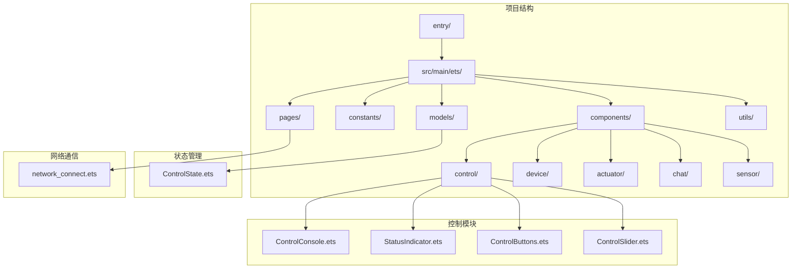
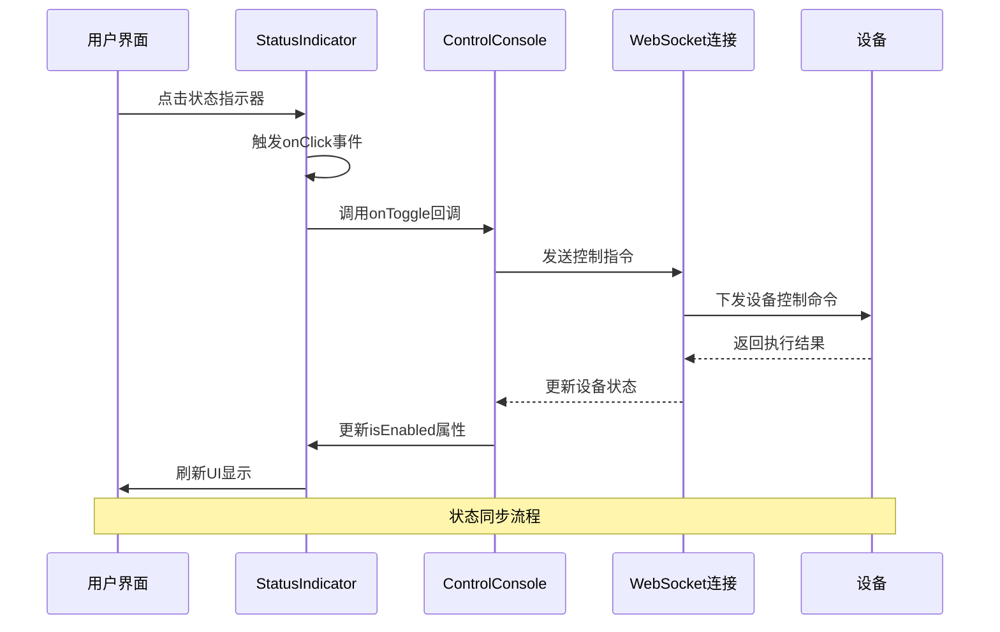
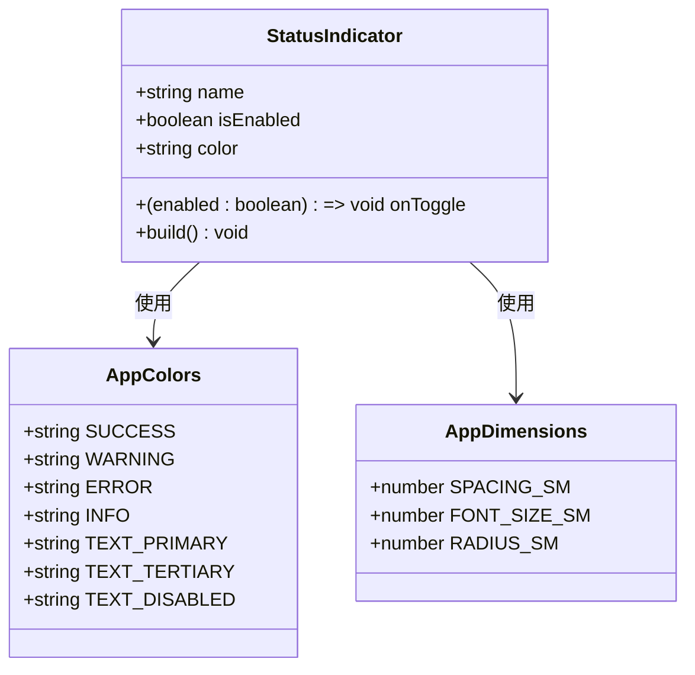
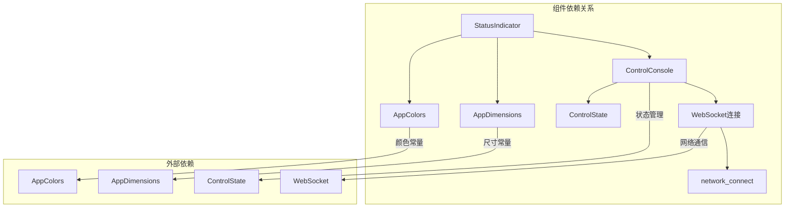

# 状态指示器组件

<cite>
**本文档引用的文件**
- [StatusIndicator.ets](file://entry/src/main/ets/components/control/StatusIndicator.ets)
- [AppColors.ets](file://entry/src/main/ets/constants/AppColors.ets)
- [AppDimensions.ets](file://entry/src/main/ets/constants/AppDimensions.ets)
- [ControlConsole.ets](file://entry/src/main/ets/components/control/ControlConsole.ets)
- [ControlState.ets](file://entry/src/main/ets/models/ControlState.ets)
- [network_connect.ets](file://entry/src/main/ets/pages/network_connect.ets)
- [DeviceOnlineTag.ets](file://entry/src/main/ets/components/device/DeviceOnlineTag.ets)
</cite>

## 目录
1. [简介](#简介)
2. [项目结构](#项目结构)
3. [核心组件](#核心组件)
4. [架构概览](#架构概览)
5. [详细组件分析](#详细组件分析)
6. [依赖关系分析](#依赖关系分析)
7. [性能考虑](#性能考虑)
8. [故障排除指南](#故障排除指南)
9. [结论](#结论)

## 简介

状态指示器组件(StatusIndicator)是SmartController项目中的一个关键UI组件，专门用于在网络控制系统中显示设备状态和允许用户进行状态切换操作。该组件采用简洁直观的设计理念，通过颜色编码和视觉反馈向用户提供清晰的状态信息，同时支持用户交互以实现设备控制。

该组件在项目中承担着重要的用户体验职责，它不仅需要准确传达设备状态信息，还要提供流畅的交互体验。通过统一的颜色系统和一致的视觉设计，StatusIndicator为整个控制界面提供了专业且易于理解的状态管理系统。

## 项目结构

SmartController项目采用模块化的架构设计，StatusIndicator组件位于控制模块下，与其他控制相关组件协同工作。项目的整体结构体现了清晰的功能分离和组件复用原则。



**图表来源**
- [ControlConsole.ets:1-172](file://entry/src/main/ets/components/control/ControlConsole.ets#L1-L172)
- [StatusIndicator.ets:1-39](file://entry/src/main/ets/components/control/StatusIndicator.ets#L1-L39)

**章节来源**
- [ControlConsole.ets:1-172](file://entry/src/main/ets/components/control/ControlConsole.ets#L1-L172)
- [StatusIndicator.ets:1-39](file://entry/src/main/ets/components/control/StatusIndicator.ets#L1-L39)

## 核心组件

StatusIndicator组件是一个轻量级但功能完整的UI组件，具有以下核心特性：

### 设计理念
组件采用"状态可视化"的设计理念，通过颜色、形状和布局的精心组合，为用户提供直观的状态信息。设计原则包括：
- **颜色编码**：使用标准化的颜色系统传达不同状态的语义含义
- **视觉层次**：通过尺寸、透明度和阴影营造视觉层次感
- **交互反馈**：提供即时的视觉反馈以确认用户操作
- **一致性**：与整体应用设计语言保持一致

### 核心功能
1. **名称显示**：显示状态的描述性名称
2. **状态切换**：支持用户点击切换状态
3. **颜色编码**：根据状态显示相应的颜色
4. **视觉反馈**：提供发光效果和状态标签

### 技术特性
- 使用ArkTS框架构建
- 支持Props属性传递
- 实现onClick事件处理
- 集成颜色和尺寸常量系统

**章节来源**
- [StatusIndicator.ets:5-39](file://entry/src/main/ets/components/control/StatusIndicator.ets#L5-L39)
- [AppColors.ets:1-47](file://entry/src/main/ets/constants/AppColors.ets#L1-L47)
- [AppDimensions.ets:1-40](file://entry/src/main/ets/constants/AppDimensions.ets#L1-L40)

## 架构概览

StatusIndicator组件在整个系统架构中扮演着重要的桥梁角色，连接用户界面和底层设备控制逻辑。



**图表来源**
- [StatusIndicator.ets:37](file://entry/src/main/ets/components/control/StatusIndicator.ets#L37)
- [ControlConsole.ets:54-65](file://entry/src/main/ets/components/control/ControlConsole.ets#L54-L65)
- [network_connect.ets:263-298](file://entry/src/main/ets/pages/network_connect.ets#L263-L298)

### 系统交互流程

组件的完整工作流程包括用户交互、状态更新和网络通信三个主要阶段：

1. **用户交互阶段**：用户点击状态指示器触发onClick事件
2. **状态更新阶段**：组件调用onToggle回调函数更新内部状态
3. **网络通信阶段**：通过WebSocket连接向设备发送控制指令
4. **状态同步阶段**：接收设备返回的状态信息并更新UI

**章节来源**
- [ControlConsole.ets:49-119](file://entry/src/main/ets/components/control/ControlConsole.ets#L49-L119)
- [network_connect.ets:149-180](file://entry/src/main/ets/pages/network_connect.ets#L149-L180)

## 详细组件分析

### 组件结构设计

StatusIndicator组件采用了简洁而高效的结构设计，通过合理的布局和样式组合实现了丰富的视觉效果。



**图表来源**
- [StatusIndicator.ets:5-10](file://entry/src/main/ets/components/control/StatusIndicator.ets#L5-L10)
- [AppColors.ets:20-24](file://entry/src/main/ets/constants/AppColors.ets#L20-L24)
- [AppDimensions.ets:7-27](file://entry/src/main/ets/constants/AppDimensions.ets#L7-L27)

### 视觉设计元素

组件的视觉设计包含了多个精心设计的元素，每个元素都有其特定的功能和意义：

#### 状态点设计
- **尺寸**：12x12像素的圆形指示点
- **颜色**：启用时显示指定颜色，禁用时显示灰色
- **透明度**：启用时完全不透明，禁用时半透明
- **阴影效果**：启用时带有发光效果，增强视觉吸引力

#### 文本标签设计
- **名称显示**：左侧显示状态描述名称
- **字体大小**：使用SM尺寸确保可读性
- **颜色变化**：根据状态动态调整文字颜色
- **字重变化**：启用时使用中等字重，禁用时使用常规字重

#### 状态标签设计
- **条件显示**：仅在启用状态下显示"已开启"标签
- **颜色对比**：白色文字确保在彩色背景下清晰可见
- **背景透明度**：使用30%透明度的彩色背景
- **圆角设计**：6像素圆角提供现代感

#### 容器设计
- **内边距**：16px左右内边距，12px上下内边距
- **背景色**：启用时使用彩色背景，禁用时使用深色背景
- **边框**：1.5像素边框，启用时使用彩色边框
- **圆角**：12像素圆角提供柔和外观

**章节来源**
- [StatusIndicator.ets:12-37](file://entry/src/main/ets/components/control/StatusIndicator.ets#L12-L37)

### 状态切换实现机制

状态切换是StatusIndicator组件的核心功能，其实现机制体现了良好的软件设计原则：

#### 回调函数机制
组件通过onToggle回调函数实现状态切换，这种设计提供了高度的灵活性：
- **参数传递**：回调函数接收布尔值参数表示新的状态
- **外部控制**：状态更新逻辑由父组件控制，保持组件的无状态特性
- **解耦设计**：组件专注于UI渲染，业务逻辑由外部处理

#### 状态更新逻辑
状态切换的完整流程包括多个步骤：
1. **事件捕获**：onClick事件触发状态切换
2. **状态反转**：内部状态从true变为false或相反
3. **回调调用**：调用onToggle回调函数传递新状态
4. **UI更新**：组件根据新状态更新视觉表现

#### 事件处理流程

```mermaid
flowchart TD
A[用户点击] --> B[onClick事件触发]
B --> C[检查onToggle回调]
C --> D{回调是否存在?}
D --> |是| E[调用onToggle(!isEnabled)]
D --> |否| F[忽略事件]
E --> G[父组件处理状态更新]
G --> H[更新controlState属性]
H --> I[触发UI重新渲染]
I --> J[组件显示新状态]
F --> J
```

**图表来源**
- [StatusIndicator.ets:37](file://entry/src/main/ets/components/control/StatusIndicator.ets#L37)
- [ControlConsole.ets:54-65](file://entry/src/main/ets/components/control/ControlConsole.ets#L54-L65)

**章节来源**
- [StatusIndicator.ets:9-10](file://entry/src/main/ets/components/control/StatusIndicator.ets#L9-L10)
- [ControlConsole.ets:54-65](file://entry/src/main/ets/components/control/ControlConsole.ets#L54-L65)

### 颜色系统设计

StatusIndicator组件采用了一套完整的颜色系统，这套系统不仅美观，更重要的是具有明确的语义含义：

#### 颜色语义设计
- **SUCCESS (#2ECC71)**：绿色，表示正常运行或成功状态
- **WARNING (#F39C12)**：橙色，表示警告或需要注意的状态
- **ERROR (#E74C3C)**：红色，表示错误或故障状态
- **INFO (#3498DB)**：蓝色，表示信息或提示状态

#### 颜色使用策略
组件通过颜色的不同使用方式传达状态信息：
- **状态点颜色**：直接使用语义颜色表示当前状态
- **文字颜色**：启用时使用主色调，禁用时使用灰色
- **背景色**：启用时使用半透明背景，禁用时使用深色背景
- **边框颜色**：启用时使用更深的边框颜色

#### 颜色常量管理
颜色系统通过AppColors类统一管理，提供了以下优势：
- **集中管理**：所有颜色定义集中在一处，便于维护
- **主题支持**：便于实现主题切换功能
- **一致性保证**：确保整个应用颜色使用的一致性

**章节来源**
- [AppColors.ets:20-24](file://entry/src/main/ets/constants/AppColors.ets#L20-L24)
- [StatusIndicator.ets:17-36](file://entry/src/main/ets/components/control/StatusIndicator.ets#L17-L36)

### 视觉设计元素详解

组件的视觉设计体现了现代UI设计的最佳实践，每个设计元素都有其特定的功能和美学价值。

#### 状态点的视觉设计
状态点是组件最重要的视觉元素，其设计考虑了多个方面：

- **尺寸比例**：12x12像素的尺寸在不同屏幕密度下都能保持良好的可读性
- **发光效果**：启用时的6像素阴影半径创造柔和的发光效果
- **透明度控制**：禁用状态下的30%透明度既保持了视觉存在感，又不会过于突兀
- **颜色适应性**：能够适应不同的主题颜色

#### 文本标签的排版设计
文本标签的设计注重可读性和信息层次：

- **字体大小**：14号字体确保在各种设备上都有良好的可读性
- **颜色对比**：启用时使用白色，禁用时使用浅灰色，确保足够的对比度
- **字重变化**：启用时使用中等字重，禁用时使用常规字重，形成自然的视觉层次
- **布局对齐**：与状态点垂直居中对齐，保持视觉平衡

#### 状态标签的交互设计
"已开启"标签作为额外的视觉反馈，设计上考虑了实用性：

- **条件显示**：只在启用状态下显示，避免界面混乱
- **颜色对比**：白色文字在彩色背景下清晰可见
- **背景透明度**：30%透明度的彩色背景既突出又不过于显眼
- **圆角设计**：6像素圆角符合现代UI设计趋势

#### 容器的整体设计
容器的设计体现了完整的视觉系统：

- **内边距设置**：提供舒适的点击区域和视觉空间
- **背景色渐变**：启用时的半透明背景与禁用时的深色背景形成对比
- **边框设计**：1.5像素边框提供清晰的边界感
- **圆角处理**：12像素圆角营造现代感和亲和力

**章节来源**
- [StatusIndicator.ets:13-37](file://entry/src/main/ets/components/control/StatusIndicator.ets#L13-L37)
- [AppDimensions.ets:7-27](file://entry/src/main/ets/constants/AppDimensions.ets#L7-L27)

### 使用场景和集成方式

StatusIndicator组件在SmartController项目中有多种使用场景，主要集中在设备控制和状态监控方面：

#### 设备控制场景
在ControlConsole组件中，StatusIndicator被广泛用于控制各种设备状态：

- **蜂鸣器控制**：使用红色(#E74C3C)表示错误状态
- **指示灯控制**：使用绿色(#2ECC71)表示正常状态，橙色(#F39C12)表示警告状态
- **多状态管理**：支持同时控制多个不同类型的设备

#### 网络通信集成
组件与网络通信系统的深度集成体现在：

- **实时状态同步**：通过WebSocket连接实现实时状态更新
- **双向通信**：既接收设备状态，也发送控制指令
- **错误处理**：在网络异常时提供适当的用户反馈

#### 状态管理模式
组件采用状态管理模式，通过ControlState类管理所有设备状态：

- **集中管理**：所有设备状态集中在一个对象中
- **状态同步**：UI状态与业务状态保持同步
- **回调通知**：状态变化时通知相关组件

**章节来源**
- [ControlConsole.ets:49-119](file://entry/src/main/ets/components/control/ControlConsole.ets#L49-L119)
- [ControlState.ets:28-67](file://entry/src/main/ets/models/ControlState.ets#L28-L67)
- [network_connect.ets:263-298](file://entry/src/main/ets/pages/network_connect.ets#L263-L298)

### 样式自定义和主题适配

StatusIndicator组件提供了灵活的样式自定义选项，支持不同的主题需求：

#### 颜色自定义
组件支持通过color属性自定义颜色：
- **属性传递**：通过Props属性接收自定义颜色
- **默认值**：使用AppColors.TEXT_DISABLED作为默认颜色
- **动态切换**：支持运行时颜色动态切换

#### 尺寸适配
组件使用AppDimensions常量确保在不同设备上的适配：
- **间距统一**：使用SPACING_SM确保合适的元素间距
- **字体适配**：使用FONT_SIZE_SM确保良好的可读性
- **圆角适配**：使用RADIUS_SM确保视觉一致性

#### 主题兼容性
组件设计考虑了主题兼容性：
- **颜色抽象**：使用AppColors常量而非硬编码颜色
- **透明度支持**：使用透明度值而非固定颜色
- **响应式设计**：适配不同屏幕尺寸

**章节来源**
- [StatusIndicator.ets:7-9](file://entry/src/main/ets/components/control/StatusIndicator.ets#L7-L9)
- [AppColors.ets:1-47](file://entry/src/main/ets/constants/AppColors.ets#L1-L47)
- [AppDimensions.ets:1-40](file://entry/src/main/ets/constants/AppDimensions.ets#L1-L40)

## 依赖关系分析

StatusIndicator组件的依赖关系相对简单但功能完整，体现了良好的模块化设计原则。



**图表来源**
- [StatusIndicator.ets:2-3](file://entry/src/main/ets/components/control/StatusIndicator.ets#L2-L3)
- [ControlConsole.ets:1-7](file://entry/src/main/ets/components/control/ControlConsole.ets#L1-L7)

### 内部依赖关系

组件的内部依赖关系体现了清晰的职责分离：

- **AppColors依赖**：用于获取标准颜色常量
- **AppDimensions依赖**：用于获取尺寸和间距常量
- **ControlConsole依赖**：作为父组件处理状态逻辑

### 外部依赖关系

组件与外部系统的依赖关系包括：

- **网络通信**：通过WebSocket连接与设备通信
- **状态管理**：依赖ControlState类管理设备状态
- **UI框架**：基于ArkTS框架的组件系统

**章节来源**
- [StatusIndicator.ets:2-3](file://entry/src/main/ets/components/control/StatusIndicator.ets#L2-L3)
- [ControlConsole.ets:1-7](file://entry/src/main/ets/components/control/ControlConsole.ets#L1-L7)

## 性能考虑

StatusIndicator组件在设计时充分考虑了性能优化，确保在各种设备上都能提供流畅的用户体验。

### 渲染性能优化
- **最小化重绘**：组件结构简单，减少了不必要的重绘
- **高效布局**：使用Row布局减少布局计算复杂度
- **条件渲染**：状态标签仅在需要时渲染，减少DOM节点

### 内存使用优化
- **轻量级组件**：组件结构简单，内存占用极低
- **无状态设计**：主要依赖Props属性，减少内部状态管理
- **常量复用**：使用AppColors和AppDimensions常量减少重复计算

### 交互性能优化
- **事件处理**：onClick事件处理简单直接，无复杂逻辑
- **状态切换**：状态切换逻辑轻量，响应迅速
- **回调机制**：通过回调机制避免组件间复杂的数据传递

### 网络性能考虑
- **连接复用**：通过network_connect单例管理WebSocket连接
- **错误处理**：完善的错误处理机制避免性能问题
- **重连机制**：智能的重连机制确保连接稳定性

## 故障排除指南

在使用StatusIndicator组件时，可能会遇到以下常见问题及解决方案：

### 状态不更新问题
**问题描述**：点击状态指示器后状态没有改变
**可能原因**：
- onToggle回调函数未正确设置
- 父组件未更新状态属性
- 网络连接异常

**解决方法**：
1. 检查onToggle回调函数的实现
2. 确认父组件正确更新状态属性
3. 验证WebSocket连接状态

### 颜色显示异常
**问题描述**：状态指示器颜色显示不符合预期
**可能原因**：
- 颜色值格式不正确
- AppColors常量未正确导入
- 主题切换导致颜色变化

**解决方法**：
1. 检查颜色值格式是否为十六进制字符串
2. 确认AppColors常量正确导入
3. 验证主题配置是否正确

### 点击无响应问题
**问题描述**：点击状态指示器没有任何反应
**可能原因**：
- onClick事件未正确绑定
- 父组件阻止了事件传播
- 组件被禁用状态影响

**解决方法**：
1. 检查onClick事件绑定代码
2. 确认父组件未阻止事件传播
3. 验证组件状态不是禁用状态

### 网络通信问题
**问题描述**：状态切换后设备无响应
**可能原因**：
- WebSocket连接断开
- 设备离线状态
- 指令格式错误

**解决方法**：
1. 检查WebSocket连接状态
2. 验证设备在线状态
3. 确认发送的指令格式正确

**章节来源**
- [ControlConsole.ets:54-65](file://entry/src/main/ets/components/control/ControlConsole.ets#L54-L65)
- [network_connect.ets:263-298](file://entry/src/main/ets/pages/network_connect.ets#L263-L298)

## 结论

StatusIndicator组件是SmartController项目中一个设计精良、功能完整的UI组件。它成功地将复杂的设备状态管理和用户交互需求简化为直观易用的界面元素。

### 设计优势总结
- **直观性**：通过颜色编码和视觉反馈提供清晰的状态信息
- **交互性**：支持用户直接控制设备状态
- **可扩展性**：灵活的样式定制和主题适配能力
- **可靠性**：完善的错误处理和状态管理机制

### 技术实现亮点
- **模块化设计**：清晰的职责分离和依赖管理
- **性能优化**：轻量级实现和高效的渲染机制
- **用户体验**：流畅的交互反馈和一致的视觉设计
- **可维护性**：统一的颜色和尺寸常量系统

### 应用价值
StatusIndicator组件不仅满足了当前的设备控制需求，还为未来的功能扩展奠定了坚实基础。其设计理念和实现方式可以作为其他类似组件开发的参考模板。

通过持续的优化和完善，StatusIndicator组件将继续为SmartController项目提供可靠、美观且易用的状态管理解决方案。