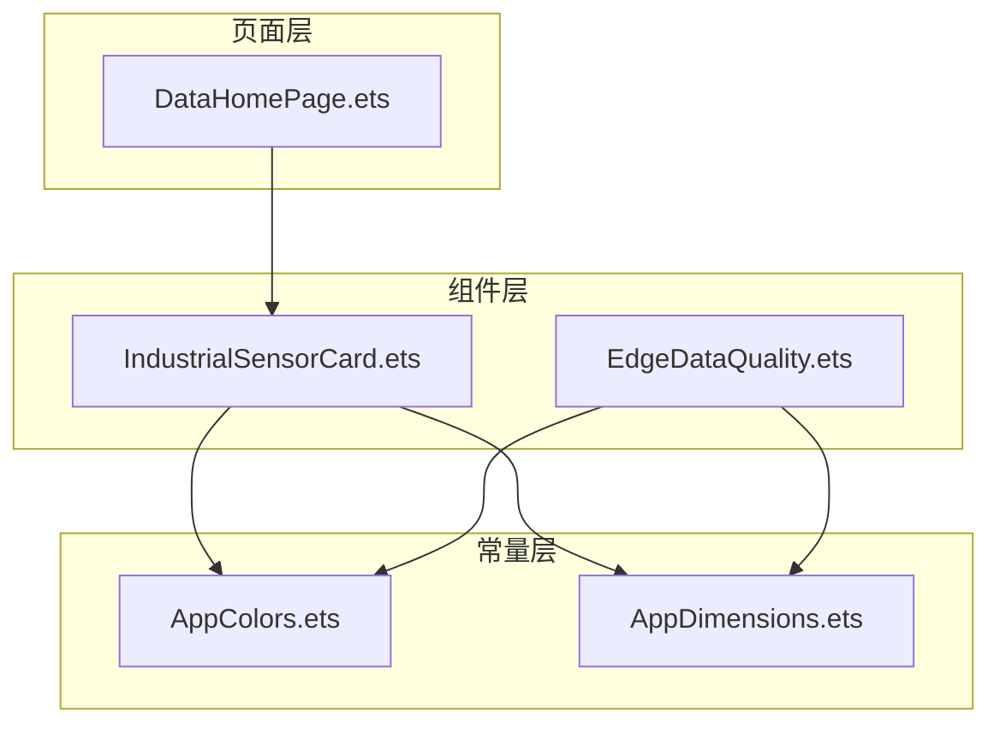
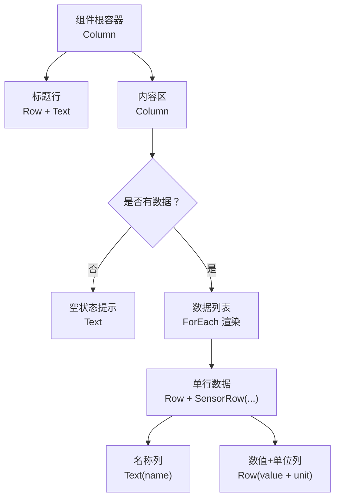
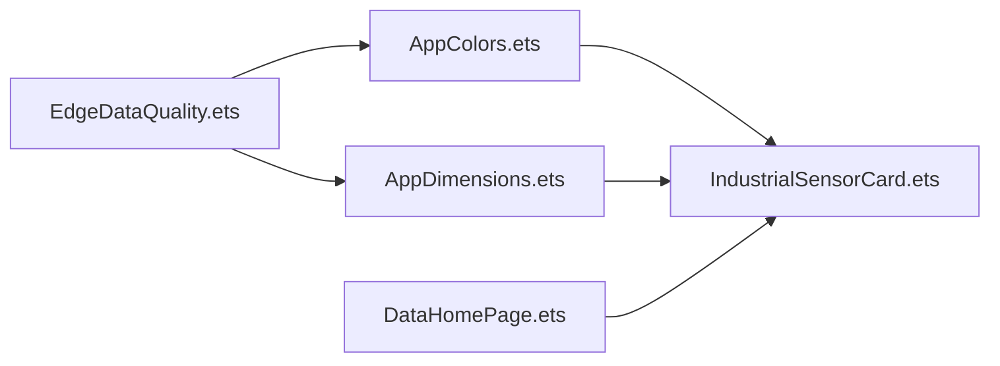

# 工业传感器卡片

<cite>
**本文引用的文件**
- [IndustrialSensorCard.ets](file://entry/src/main/ets/components/sensor/IndustrialSensorCard.ets)
- [AppColors.ets](file://entry/src/main/ets/constants/AppColors.ets)
- [AppDimensions.ets](file://entry/src/main/ets/constants/AppDimensions.ets)
- [EdgeDataQuality.ets](file://entry/src/main/ets/components/sensor/EdgeDataQuality.ets)
- [DataHomePage.ets](file://entry/src/main/ets/pages/DataHomePage.ets)
- [ControlState.ets](file://entry/src/main/ets/models/ControlState.ets)
- [Constants.ets](file://entry/src/main/ets/common/Constants.ets)
</cite>

## 目录
1. [简介](#简介)
2. [项目结构](#项目结构)
3. [核心组件](#核心组件)
4. [架构总览](#架构总览)
5. [详细组件分析](#详细组件分析)
6. [依赖关系分析](#依赖关系分析)
7. [性能考虑](#性能考虑)
8. [故障排查指南](#故障排查指南)
9. [结论](#结论)
10. [附录](#附录)

## 简介
本文件面向开发者，系统性解析“工业传感器卡片”组件的设计与实现，涵盖接口定义、数据格式化、布局结构、空状态处理、样式定制、响应式与无障碍支持、以及扩展与最佳实践。该组件用于在工业场景中以卡片形式展示多路传感器的实时数据，具备清晰的标题区、数据行列表与统一的视觉风格。

## 项目结构
组件位于 entry/src/main/ets/components/sensor 目录，配套的颜色与尺寸常量分别位于 constants 目录；页面层通过 DataHomePage 使用该组件进行展示。整体采用分层组织：组件层（组件）、常量层（颜色与尺寸）、页面层（使用与编排）。

图表来源
- [IndustrialSensorCard.ets:1-109](file://entry/src/main/ets/components/sensor/IndustrialSensorCard.ets#L1-L109)
- [AppColors.ets:1-47](file://entry/src/main/ets/constants/AppColors.ets#L1-L47)
- [AppDimensions.ets:1-40](file://entry/src/main/ets/constants/AppDimensions.ets#L1-L40)
- [EdgeDataQuality.ets:1-64](file://entry/src/main/ets/components/sensor/EdgeDataQuality.ets#L1-L64)
- [DataHomePage.ets:1-61](file://entry/src/main/ets/pages/DataHomePage.ets#L1-L61)

章节来源
- [IndustrialSensorCard.ets:1-109](file://entry/src/main/ets/components/sensor/IndustrialSensorCard.ets#L1-L109)
- [AppColors.ets:1-47](file://entry/src/main/ets/constants/AppColors.ets#L1-L47)
- [AppDimensions.ets:1-40](file://entry/src/main/ets/constants/AppDimensions.ets#L1-L40)
- [EdgeDataQuality.ets:1-64](file://entry/src/main/ets/components/sensor/EdgeDataQuality.ets#L1-L64)
- [DataHomePage.ets:1-61](file://entry/src/main/ets/pages/DataHomePage.ets#L1-L61)

## 核心组件
- 组件名称：工业传感器卡片
- 组件类型：结构体组件（struct）
- 关键职责：
  - 渲染标题区（带装饰感的标题文本）
  - 渲染传感器数据列表（名称、数值、单位）
  - 处理空状态（无数据时显示提示）
  - 提供单行数据的 Builder 方法，便于复用与组合

章节来源
- [IndustrialSensorCard.ets:20-62](file://entry/src/main/ets/components/sensor/IndustrialSensorCard.ets#L20-L62)

## 架构总览
组件采用“标题区 + 列表区”的双段式布局。标题区固定高度与对齐方式；列表区根据数据是否存在动态切换为空状态或数据行渲染。每条数据行由名称列与数值+单位列组成，采用两端对齐与居中对齐的组合，确保信息密度与可读性。

图表来源
- [IndustrialSensorCard.ets:25-62](file://entry/src/main/ets/components/sensor/IndustrialSensorCard.ets#L25-L62)
- [IndustrialSensorCard.ets:68-107](file://entry/src/main/ets/components/sensor/IndustrialSensorCard.ets#L68-L107)

## 详细组件分析

### 接口定义：SensorItem
- 字段说明
  - name：字符串，表示传感器名称（如“二氧化碳”）
  - value：字符串，表示数值（如“1055.55”）
  - unit：字符串，表示单位（如“ppm”）
- 设计要点
  - 采用字符串型 value，便于保留原始格式（含小数点、千分位等），交由渲染层统一格式化
  - 与组件的数值+单位展示结构天然契合

章节来源
- [IndustrialSensorCard.ets:7-14](file://entry/src/main/ets/components/sensor/IndustrialSensorCard.ets#L7-L14)

### 标题区域
- 内容：固定标题文本
- 样式：字号、字重、文字颜色、最大行数与省略策略
- 对齐：左对齐，权重分配给标题文本，使其占满整行
- 容器：Row 包裹，配合父级 Column 的间距

章节来源
- [IndustrialSensorCard.ets:25-39](file://entry/src/main/ets/components/sensor/IndustrialSensorCard.ets#L25-L39)

### 数据列表渲染与空状态
- 空状态判断：当 sensorItems 长度为 0 时，渲染居中提示文本
- 数据状态：当存在数据时，使用 ForEach 遍历渲染，键值使用索引字符串
- 列表容器：内部 Column 设置紧凑间距，保证行间留白一致

章节来源
- [IndustrialSensorCard.ets:42-56](file://entry/src/main/ets/components/sensor/IndustrialSensorCard.ets#L42-L56)

### 单个传感器数据行：SensorRow
- 结构组成
  - 名称列：左侧文本，使用较小字号与次级文字色，支持省略
  - 数值+单位列：右侧文本，数值使用较大字号与强调字重，单位使用更小字号与禁用色
- 布局策略
  - 外层 Row 两端对齐（名称权重分配给名称列），垂直居中
  - 数值+单位列内部使用紧凑间距，底部对齐以提升视觉平衡
- 视觉细节
  - 行内容器设置内边距，圆角背景，营造卡片化触感

章节来源
- [IndustrialSensorCard.ets:68-107](file://entry/src/main/ets/components/sensor/IndustrialSensorCard.ets#L68-L107)

### 样式定制与常量体系
- 颜色体系：通过 AppColors 统一管理主背景、卡片背景、文字色、状态色等
- 尺寸体系：通过 AppDimensions 统一管理间距、圆角、字号、高度等
- 组件内使用
  - 标题：中等字号、粗体、二级文字色
  - 名称：小字号、三级文字色
  - 数值：大字号、粗体、一级文字色
  - 单位：超小字号、禁用文字色
  - 行内背景：深色背景，突出数据行层次
  - 卡片背景：卡片背景色，圆角与内边距统一

章节来源
- [AppColors.ets:5-47](file://entry/src/main/ets/constants/AppColors.ets#L5-L47)
- [AppDimensions.ets:5-40](file://entry/src/main/ets/constants/AppDimensions.ets#L5-L40)
- [IndustrialSensorCard.ets:25-62](file://entry/src/main/ets/components/sensor/IndustrialSensorCard.ets#L25-L62)
- [IndustrialSensorCard.ets:68-107](file://entry/src/main/ets/components/sensor/IndustrialSensorCard.ets#L68-L107)

### 响应式与无障碍支持
- 响应式
  - 使用百分比宽度与 Flex 布局，适配不同屏幕宽度
  - 文本溢出采用省略策略，避免换行导致的布局破坏
- 无障碍
  - 文本具有明确的层级与对比度，利于阅读
  - 建议在业务侧补充语义标签与焦点顺序（当前实现未直接暴露可聚焦元素）

章节来源
- [IndustrialSensorCard.ets:25-62](file://entry/src/main/ets/components/sensor/IndustrialSensorCard.ets#L25-L62)
- [IndustrialSensorCard.ets:68-107](file://entry/src/main/ets/components/sensor/IndustrialSensorCard.ets#L68-L107)

### 数据绑定与状态管理最佳实践
- 数据来源建议
  - 使用外部页面或服务层准备 SensorItem[]，通过属性注入到组件
  - 对于实时数据，建议在页面层维护状态并在数据更新时触发重渲染
- 状态管理
  - 可参考 ControlState 的模式，将组件状态与业务状态解耦
  - 对于复杂交互（如排序、筛选、刷新），可在页面层集中处理
- 性能优化
  - ForEach 的键值使用稳定标识（如索引字符串）以减少重排
  - 对长列表可考虑虚拟化策略（当前实现未涉及）

章节来源
- [ControlState.ets:28-67](file://entry/src/main/ets/models/ControlState.ets#L28-L67)
- [IndustrialSensorCard.ets:49-54](file://entry/src/main/ets/components/sensor/IndustrialSensorCard.ets#L49-L54)

### 与其他组件的关系
- 与 EdgeDataQuality 的对比
  - 同属卡片组件，均采用标题区 + 内容区 + 卡片背景的结构
  - 工业传感器卡片侧重“多路数据行”，EdgeDataQuality 侧重“单一指标统计”
- 页面使用示例
  - DataHomePage 中展示了如何在滚动容器中引入卡片组件，并与其它内容组合

章节来源
- [EdgeDataQuality.ets:8-63](file://entry/src/main/ets/components/sensor/EdgeDataQuality.ets#L8-L63)
- [DataHomePage.ets:41-43](file://entry/src/main/ets/pages/DataHomePage.ets#L41-L43)

## 依赖关系分析
组件与常量层之间存在强依赖关系，通过导入 AppColors 与 AppDimensions 实现样式与布局的集中管理；页面层通过实例化组件并传入数据完成集成。

图表来源
- [IndustrialSensorCard.ets:1-2](file://entry/src/main/ets/components/sensor/IndustrialSensorCard.ets#L1-L2)
- [AppColors.ets:1-47](file://entry/src/main/ets/constants/AppColors.ets#L1-L47)
- [AppDimensions.ets:1-40](file://entry/src/main/ets/constants/AppDimensions.ets#L1-L40)
- [DataHomePage.ets:1-61](file://entry/src/main/ets/pages/DataHomePage.ets#L1-L61)
- [EdgeDataQuality.ets:1-2](file://entry/src/main/ets/components/sensor/EdgeDataQuality.ets#L1-L2)

章节来源
- [IndustrialSensorCard.ets:1-2](file://entry/src/main/ets/components/sensor/IndustrialSensorCard.ets#L1-L2)
- [AppColors.ets:1-47](file://entry/src/main/ets/constants/AppColors.ets#L1-L47)
- [AppDimensions.ets:1-40](file://entry/src/main/ets/constants/AppDimensions.ets#L1-L40)
- [DataHomePage.ets:1-61](file://entry/src/main/ets/pages/DataHomePage.ets#L1-L61)
- [EdgeDataQuality.ets:1-2](file://entry/src/main/ets/components/sensor/EdgeDataQuality.ets#L1-L2)

## 性能考虑
- 渲染路径
  - 使用 ForEach 渲染列表，键值稳定可降低重排成本
  - 文本省略与固定字号有助于减少测量开销
- 数据规模
  - 对于大量数据，建议在页面层做分页或虚拟化处理
- 样式计算
  - 通过常量统一管理字号与间距，避免重复计算与不一致

## 故障排查指南
- 空状态不显示
  - 检查传入的 sensorItems 是否为空数组，或是否被意外覆盖
- 文本截断异常
  - 确认 maxLines 与省略策略设置是否符合预期
- 颜色对比度不足
  - 检查 AppColors 中对应文字色与背景色的搭配
- 布局错位
  - 检查 Row 的两端对齐与 layoutWeight 设置，确保名称列正确占满

章节来源
- [IndustrialSensorCard.ets:42-56](file://entry/src/main/ets/components/sensor/IndustrialSensorCard.ets#L42-L56)
- [IndustrialSensorCard.ets:68-107](file://entry/src/main/ets/components/sensor/IndustrialSensorCard.ets#L68-L107)

## 结论
工业传感器卡片组件以简洁的双段式布局与统一的常量体系，实现了高可读性的多路传感器数据展示。通过清晰的接口定义、空状态处理与可复用的行组件，开发者可以快速集成并扩展。建议在实际项目中结合页面层的状态管理与无障碍需求，持续优化渲染性能与用户体验。

## 附录

### 扩展传感器类型与自定义样式指南
- 新增传感器类型
  - 在业务侧扩展数据模型，保持与 SensorItem 的兼容性
  - 如需特殊展示（如图标、趋势箭头），可在页面层或行组件中扩展
- 自定义样式
  - 通过 AppDimensions 与 AppColors 的常量替换，实现主题切换
  - 对于局部样式差异，可在组件内部新增属性以支持可选定制

章节来源
- [IndustrialSensorCard.ets:7-14](file://entry/src/main/ets/components/sensor/IndustrialSensorCard.ets#L7-L14)
- [AppColors.ets:5-47](file://entry/src/main/ets/constants/AppColors.ets#L5-L47)
- [AppDimensions.ets:5-40](file://entry/src/main/ets/constants/AppDimensions.ets#L5-L40)