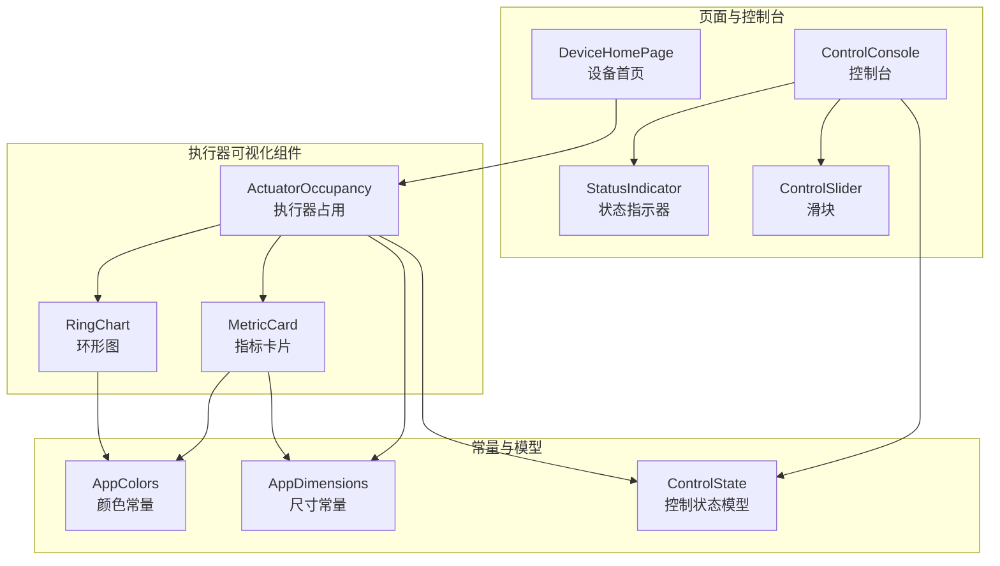
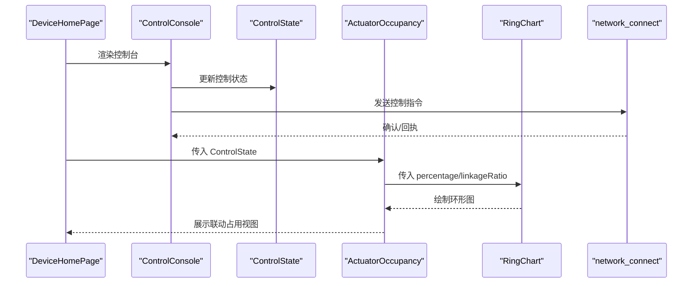
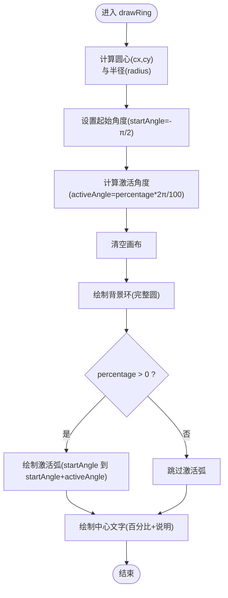
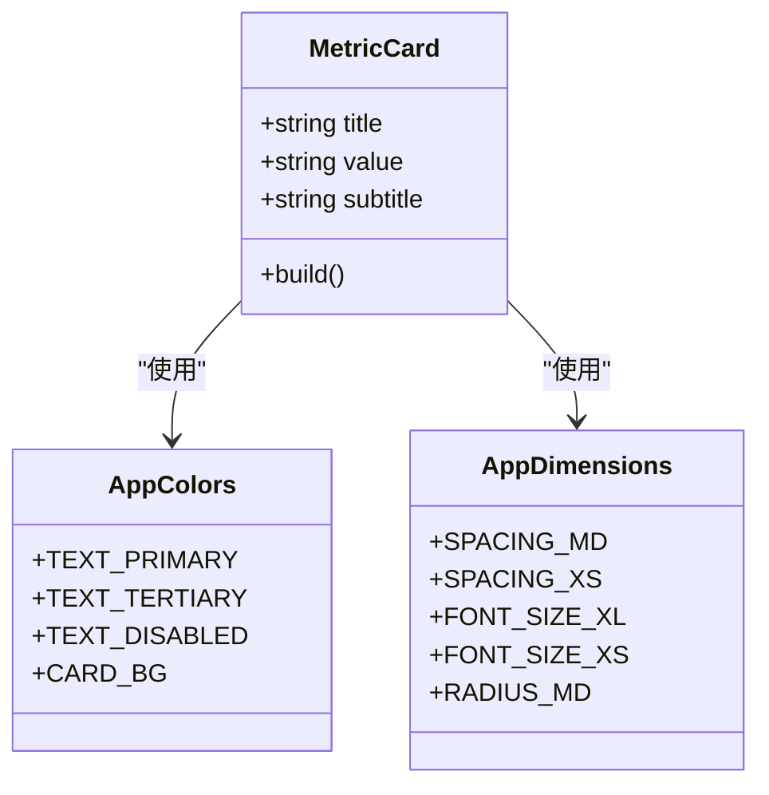
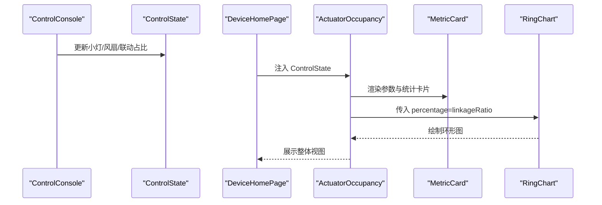
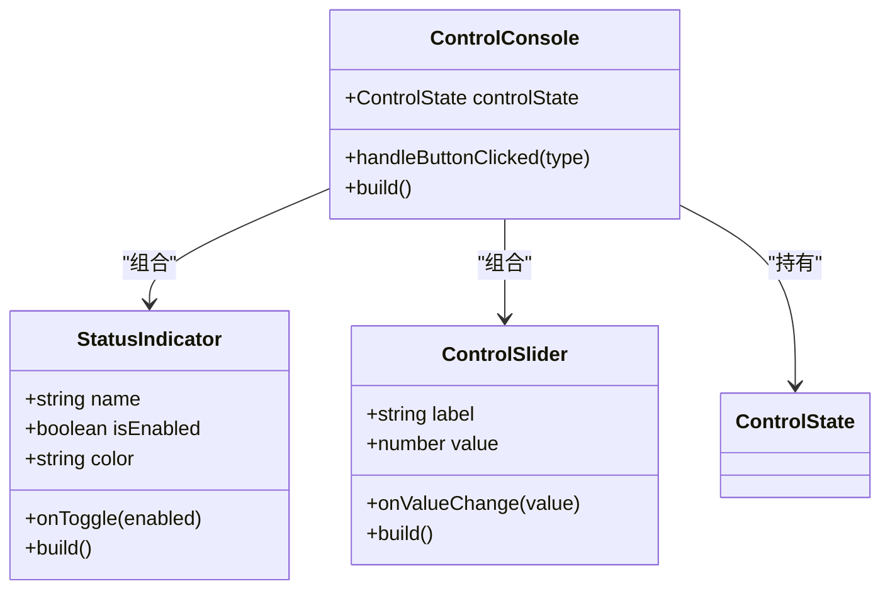
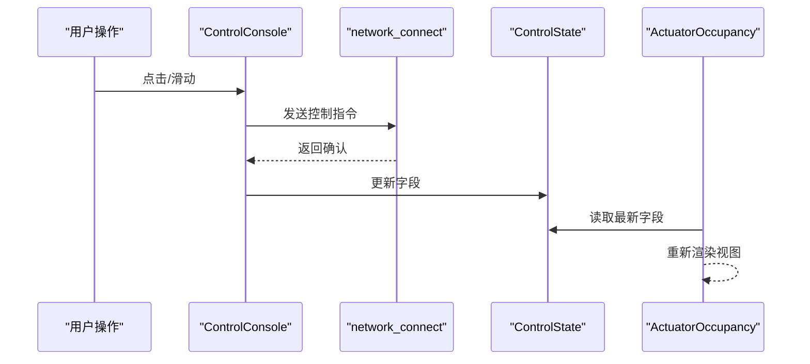
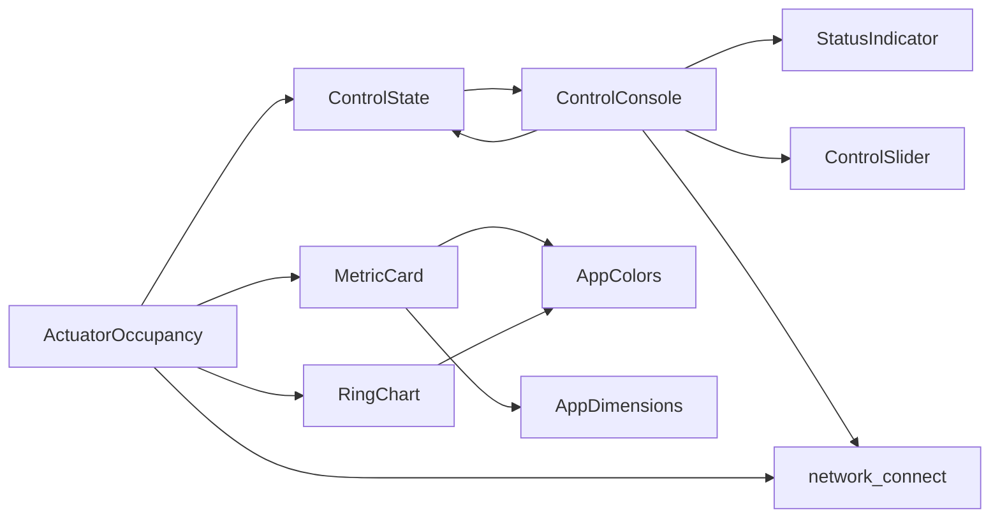

# 执行器可视化

<cite>
**本文引用的文件**
- [RingChart.ets](file://entry/src/main/ets/components/actuator/RingChart.ets)
- [MetricCard.ets](file://entry/src/main/ets/components/actuator/MetricCard.ets)
- [ActuatorOccupancy.ets](file://entry/src/main/ets/components/actuator/ActuatorOccupancy.ets)
- [AppColors.ets](file://entry/src/main/ets/constants/AppColors.ets)
- [AppDimensions.ets](file://entry/src/main/ets/constants/AppDimensions.ets)
- [ControlState.ets](file://entry/src/main/ets/models/ControlState.ets)
- [ControlConsole.ets](file://entry/src/main/ets/components/control/ControlConsole.ets)
- [StatusIndicator.ets](file://entry/src/main/ets/components/control/StatusIndicator.ets)
- [ControlSlider.ets](file://entry/src/main/ets/components/control/ControlSlider.ets)
- [DeviceHomePage.ets](file://entry/src/main/ets/pages/DeviceHomePage.ets)
- [get_data.ets](file://entry/src/main/ets/pages/get_data.ets)
- [network_connect.ets](file://entry/src/main/ets/pages/network_connect.ets)
</cite>

## 目录
1. [简介](#简介)
2. [项目结构](#项目结构)
3. [核心组件](#核心组件)
4. [架构总览](#架构总览)
5. [详细组件分析](#详细组件分析)
6. [依赖关系分析](#依赖关系分析)
7. [性能考量](#性能考量)
8. [故障排查指南](#故障排查指南)
9. [结论](#结论)
10. [附录](#附录)

## 简介
本文件面向开发者，系统性梳理“执行器可视化”组件体系，重点覆盖：
- 环形图表的实现逻辑（数据映射、角度计算、路径绘制）
- 指标卡片的设计模式（布局结构、内容组织、视觉层次）
- 执行器状态的可视化展示（运行状态指示、功率消耗显示、效率评估）
- 动画效果与交互反馈（加载动画、状态切换、数据更新）
- 多执行器类型适配（电机、阀门、传感器）与扩展建议
- 与控制台、网络层的数据联动与实时更新机制

## 项目结构
该可视化模块位于 entry/src/main/ets/components/actuator 下，围绕三个核心组件展开：环形图、指标卡片、执行器占用面板。它们通过统一的颜色与尺寸常量进行风格统一，并由页面组件组合使用。

**图表来源**
- [ActuatorOccupancy.ets:1-107](file://entry/src/main/ets/components/actuator/ActuatorOccupancy.ets#L1-L107)
- [RingChart.ets:1-70](file://entry/src/main/ets/components/actuator/RingChart.ets#L1-L70)
- [MetricCard.ets:1-41](file://entry/src/main/ets/components/actuator/MetricCard.ets#L1-L41)
- [AppColors.ets:1-47](file://entry/src/main/ets/constants/AppColors.ets#L1-L47)
- [AppDimensions.ets:1-40](file://entry/src/main/ets/constants/AppDimensions.ets#L1-L40)
- [ControlState.ets:1-67](file://entry/src/main/ets/models/ControlState.ets#L1-L67)
- [DeviceHomePage.ets:1-74](file://entry/src/main/ets/pages/DeviceHomePage.ets#L1-L74)
- [ControlConsole.ets:1-172](file://entry/src/main/ets/components/control/ControlConsole.ets#L1-L172)
- [StatusIndicator.ets:1-39](file://entry/src/main/ets/components/control/StatusIndicator.ets#L1-L39)
- [ControlSlider.ets:1-56](file://entry/src/main/ets/components/control/ControlSlider.ets#L1-L56)

**章节来源**
- [ActuatorOccupancy.ets:1-107](file://entry/src/main/ets/components/actuator/ActuatorOccupancy.ets#L1-L107)
- [RingChart.ets:1-70](file://entry/src/main/ets/components/actuator/RingChart.ets#L1-L70)
- [MetricCard.ets:1-41](file://entry/src/main/ets/components/actuator/MetricCard.ets#L1-L41)
- [AppColors.ets:1-47](file://entry/src/main/ets/constants/AppColors.ets#L1-L47)
- [AppDimensions.ets:1-40](file://entry/src/main/ets/constants/AppDimensions.ets#L1-L40)
- [ControlState.ets:1-67](file://entry/src/main/ets/models/ControlState.ets#L1-L67)
- [DeviceHomePage.ets:1-74](file://entry/src/main/ets/pages/DeviceHomePage.ets#L1-L74)
- [ControlConsole.ets:1-172](file://entry/src/main/ets/components/control/ControlConsole.ets#L1-L172)
- [StatusIndicator.ets:1-39](file://entry/src/main/ets/components/control/StatusIndicator.ets#L1-L39)
- [ControlSlider.ets:1-56](file://entry/src/main/ets/components/control/ControlSlider.ets#L1-L56)

## 核心组件
- 环形图 RingChart：基于 Canvas 的自绘环形进度图，支持激活占比、尺寸与线宽配置，中心显示百分比与说明文字。
- 指标卡片 MetricCard：三段式布局（标题、数值、副标题），统一的内边距、圆角与字体颜色，用于展示单一指标。
- 执行器占用 ActuatorOccupancy：三列布局（左侧参数指标、中央环形图、右侧统计卡片），并提供图例说明，承载联动占用的整体视图。

上述组件均通过 AppColors 与 AppDimensions 统一风格，保证主题一致性与可维护性。

**章节来源**
- [RingChart.ets:1-70](file://entry/src/main/ets/components/actuator/RingChart.ets#L1-L70)
- [MetricCard.ets:1-41](file://entry/src/main/ets/components/actuator/MetricCard.ets#L1-L41)
- [ActuatorOccupancy.ets:1-107](file://entry/src/main/ets/components/actuator/ActuatorOccupancy.ets#L1-L107)
- [AppColors.ets:1-47](file://entry/src/main/ets/constants/AppColors.ets#L1-L47)
- [AppDimensions.ets:1-40](file://entry/src/main/ets/constants/AppDimensions.ets#L1-L40)

## 架构总览
执行器可视化在页面层被组合使用，控制台负责产生或接收控制状态数据，页面通过 ActuatorOccupancy 展示执行器联动占用情况；网络层负责与后端通信，驱动数据更新。

**图表来源**
- [DeviceHomePage.ets:50-50](file://entry/src/main/ets/pages/DeviceHomePage.ets#L50-L50)
- [ControlConsole.ets:41-172](file://entry/src/main/ets/components/control/ControlConsole.ets#L41-L172)
- [ControlState.ets:28-67](file://entry/src/main/ets/models/ControlState.ets#L28-L67)
- [ActuatorOccupancy.ets:14-51](file://entry/src/main/ets/components/actuator/ActuatorOccupancy.ets#L14-L51)
- [RingChart.ets:10-26](file://entry/src/main/ets/components/actuator/RingChart.ets#L10-L26)
- [network_connect.ets:43-45](file://entry/src/main/ets/pages/network_connect.ets#L43-L45)

## 详细组件分析

### 环形图 RingChart 实现详解
- 数据映射算法
  - 输入 percentage ∈ [0,100]，映射到弧长比例，激活角度 activeAngle = percentage / 100 × 2π。
  - 起始角度固定为 −π/2（从顶部开始绘制）。
- 角度计算
  - 背景环：完整圆周 0 到 2π。
  - 激活环：从起始角到起始角 + 激活角。
- 路径绘制
  - 计算圆心 (cx, cy) 与半径 radius（考虑线宽）。
  - 使用 Canvas 的 arc 绘制背景环与激活环，lineCap 设置为 round 以获得圆头效果。
  - 在中心绘制百分比文本与“占用率”说明文字，颜色与字号来自 AppColors 与 AppDimensions。
- 性能与复杂度
  - 单次绘制 O(1)，Canvas 渲染高效；仅在 onReady 或属性变更时重绘。
- 可扩展性
  - 支持自定义 chartSize 与 strokeWidth，便于在不同布局中复用。
  - 可增加渐变色、阴影、描边动画等扩展。

**图表来源**
- [RingChart.ets:31-68](file://entry/src/main/ets/components/actuator/RingChart.ets#L31-L68)

**章节来源**
- [RingChart.ets:1-70](file://entry/src/main/ets/components/actuator/RingChart.ets#L1-L70)
- [AppColors.ets:41-43](file://entry/src/main/ets/constants/AppColors.ets#L41-L43)
- [AppDimensions.ets:22-27](file://entry/src/main/ets/constants/AppDimensions.ets#L22-L27)

### 指标卡片 MetricCard 设计模式
- 布局结构
  - Column 容器，内部三段式：标题（小号、次级文字色）、数值（大号、主文字色、加粗）、副标题（小号、禁用色）。
  - 统一内边距、圆角、背景色与对齐方式，形成卡片化视觉。
- 内容组织
  - 通过 props 接收 title/value/subtitle，保持组件职责单一。
- 视觉层次
  - 字号与颜色分层明确，突出数值信息，弱化副标题，增强可读性。
- 可扩展性
  - 可增加图标、单位、趋势箭头、状态徽标等扩展点。

**图表来源**
- [MetricCard.ets:8-39](file://entry/src/main/ets/components/actuator/MetricCard.ets#L8-L39)
- [AppColors.ets:13-18](file://entry/src/main/ets/constants/AppColors.ets#L13-L18)
- [AppDimensions.ets:6-12](file://entry/src/main/ets/constants/AppDimensions.ets#L6-L12)

**章节来源**
- [MetricCard.ets:1-41](file://entry/src/main/ets/components/actuator/MetricCard.ets#L1-L41)
- [AppColors.ets:1-47](file://entry/src/main/ets/constants/AppColors.ets#L1-L47)
- [AppDimensions.ets:1-40](file://entry/src/main/ets/constants/AppDimensions.ets#L1-L40)

### 执行器占用 ActuatorOccupancy 可视化
- 布局设计
  - 三列布局：左侧参数指标卡片（小灯亮度、风扇转速）、中央环形图、右侧统计卡片（激活执行器/联动占比）。
  - 底部图例说明“已激活/未激活”的颜色含义。
- 数据绑定
  - 通过 ControlState 提供的字段渲染：smallLightBrightness、fanSpeed、actuatorActive、actuatorTotal、linkageRatio。
- 视觉与交互
  - 统一卡片背景与圆角，三列等权重布局，顶部标题与底部图例增强可读性。
  - 与 ControlConsole 协同，控制台的状态变化会驱动联动占用视图的更新。

**图表来源**
- [ControlConsole.ets:122-144](file://entry/src/main/ets/components/control/ControlConsole.ets#L122-L144)
- [ControlState.ets:41-52](file://entry/src/main/ets/models/ControlState.ets#L41-L52)
- [DeviceHomePage.ets:50-50](file://entry/src/main/ets/pages/DeviceHomePage.ets#L50-L50)
- [ActuatorOccupancy.ets:29-72](file://entry/src/main/ets/components/actuator/ActuatorOccupancy.ets#L29-L72)
- [MetricCard.ets:17-39](file://entry/src/main/ets/components/actuator/MetricCard.ets#L17-L39)
- [RingChart.ets:19-26](file://entry/src/main/ets/components/actuator/RingChart.ets#L19-L26)

**章节来源**
- [ActuatorOccupancy.ets:1-107](file://entry/src/main/ets/components/actuator/ActuatorOccupancy.ets#L1-L107)
- [ControlState.ets:28-67](file://entry/src/main/ets/models/ControlState.ets#L28-L67)
- [DeviceHomePage.ets:50-50](file://entry/src/main/ets/pages/DeviceHomePage.ets#L50-L50)

### 执行器状态可视化与交互反馈
- 运行状态指示
  - StatusIndicator 提供开关式状态点，启用时带发光阴影与状态提示，支持点击切换并触发回调。
- 功率消耗与效率评估
  - 通过 ControlSlider 调节小灯亮度与风扇转速，结合 ActuatorOccupancy 的联动占比，形成“效率=有效占用/总资源”的直观评估。
- 交互响应
  - ControlConsole 中各组件的 onClick/onValueChange 回调，将状态变更传递给 ControlState，并通过 onStateChange 通知上层页面。
  - ActuatorOccupancy 作为纯展示组件，接收 ControlState 并自动刷新视图。

**图表来源**
- [StatusIndicator.ets:6-38](file://entry/src/main/ets/components/control/StatusIndicator.ets#L6-L38)
- [ControlSlider.ets:8-55](file://entry/src/main/ets/components/control/ControlSlider.ets#L8-L55)
- [ControlConsole.ets:13-172](file://entry/src/main/ets/components/control/ControlConsole.ets#L13-L172)

**章节来源**
- [StatusIndicator.ets:1-39](file://entry/src/main/ets/components/control/StatusIndicator.ets#L1-L39)
- [ControlSlider.ets:1-56](file://entry/src/main/ets/components/control/ControlSlider.ets#L1-L56)
- [ControlConsole.ets:1-172](file://entry/src/main/ets/components/control/ControlConsole.ets#L1-L172)

### 动画效果与数据更新
- 加载动画
  - 页面中存在圆形进度组件（Progress Ring），可用于加载态展示，但执行器可视化组件本身未内置 Canvas 动画。
- 状态切换与数据更新
  - ControlConsole 的按钮与滑块触发状态变更，ActuatorOccupancy 通过 props 接收最新 ControlState 并重新渲染。
  - 网络层通过 network_connect 发送指令并接收回执，驱动 ControlState 的联动占比等字段更新。

**图表来源**
- [ControlConsole.ets:49-144](file://entry/src/main/ets/components/control/ControlConsole.ets#L49-L144)
- [network_connect.ets:43-45](file://entry/src/main/ets/pages/network_connect.ets#L43-L45)
- [ControlState.ets:41-52](file://entry/src/main/ets/models/ControlState.ets#L41-L52)
- [ActuatorOccupancy.ets:47-51](file://entry/src/main/ets/components/actuator/ActuatorOccupancy.ets#L47-L51)

**章节来源**
- [ControlConsole.ets:1-172](file://entry/src/main/ets/components/control/ControlConsole.ets#L1-L172)
- [network_connect.ets:43-45](file://entry/src/main/ets/pages/network_connect.ets#L43-L45)
- [ControlState.ets:1-67](file://entry/src/main/ets/models/ControlState.ets#L1-L67)
- [ActuatorOccupancy.ets:1-107](file://entry/src/main/ets/components/actuator/ActuatorOccupancy.ets#L1-L107)

### 多执行器类型适配方案
- 电机
  - 关注转速、功率、温度等指标，可在 MetricCard 中新增“功率(kW)”、“温度(℃)”等卡片，并在 ActuatorOccupancy 中扩展为四列布局。
- 阀门
  - 关注开度、压差、流量等，可在 MetricCard 中新增“开度(%)”、“压差(kPa)”、“流量(m³/h)”等卡片。
- 传感器
  - 关注测量值与阈值比较，可在 MetricCard 中新增“阈值(%)”、“偏差(%)”，并在 RingChart 上方叠加阈值线或颜色分级。
- 通用策略
  - 通过 ControlState 扩展字段，ActuatorOccupancy 以相同模式渲染；RingChart 可抽象为“多指标环形图”组件，支持多段激活角度叠加。

[本节为概念性扩展说明，不直接分析具体文件，故无“章节来源”]

## 依赖关系分析
- 组件耦合
  - ActuatorOccupancy 依赖 MetricCard 与 RingChart，二者均依赖 AppColors 与 AppDimensions，形成清晰的低耦合高内聚结构。
- 数据流
  - ControlState 作为单一数据源，被 ControlConsole 修改并通过 ActuatorOccupancy 展示，避免多处状态分散。
- 外部集成
  - network_connect 提供网络通信能力，驱动 ControlState 的联动占比等字段更新。

**图表来源**
- [ControlState.ets:28-67](file://entry/src/main/ets/models/ControlState.ets#L28-L67)
- [ControlConsole.ets:1-172](file://entry/src/main/ets/components/control/ControlConsole.ets#L1-L172)
- [StatusIndicator.ets:1-39](file://entry/src/main/ets/components/control/StatusIndicator.ets#L1-L39)
- [ControlSlider.ets:1-56](file://entry/src/main/ets/components/control/ControlSlider.ets#L1-L56)
- [ActuatorOccupancy.ets:1-107](file://entry/src/main/ets/components/actuator/ActuatorOccupancy.ets#L1-L107)
- [MetricCard.ets:1-41](file://entry/src/main/ets/components/actuator/MetricCard.ets#L1-L41)
- [RingChart.ets:1-70](file://entry/src/main/ets/components/actuator/RingChart.ets#L1-L70)
- [AppColors.ets:1-47](file://entry/src/main/ets/constants/AppColors.ets#L1-L47)
- [AppDimensions.ets:1-40](file://entry/src/main/ets/constants/AppDimensions.ets#L1-L40)
- [network_connect.ets:43-45](file://entry/src/main/ets/pages/network_connect.ets#L43-L45)

**章节来源**
- [ControlState.ets:1-67](file://entry/src/main/ets/models/ControlState.ets#L1-L67)
- [ControlConsole.ets:1-172](file://entry/src/main/ets/components/control/ControlConsole.ets#L1-L172)
- [ActuatorOccupancy.ets:1-107](file://entry/src/main/ets/components/actuator/ActuatorOccupancy.ets#L1-L107)
- [RingChart.ets:1-70](file://entry/src/main/ets/components/actuator/RingChart.ets#L1-L70)
- [MetricCard.ets:1-41](file://entry/src/main/ets/components/actuator/MetricCard.ets#L1-L41)
- [AppColors.ets:1-47](file://entry/src/main/ets/constants/AppColors.ets#L1-L47)
- [AppDimensions.ets:1-40](file://entry/src/main/ets/constants/AppDimensions.ets#L1-L40)
- [network_connect.ets:43-45](file://entry/src/main/ets/pages/network_connect.ets#L43-L45)

## 性能考量
- Canvas 渲染
  - 环形图采用 Canvas 自绘，绘制逻辑简单，适合高频刷新；建议在 percentage 变化时才重绘，避免不必要的重复绘制。
- 布局与样式
  - 统一使用 AppDimensions 与 AppColors，减少样式计算与主题切换成本。
- 数据更新
  - 通过 ControlState 集中式管理，ActuatorOccupancy 以 props 方式接收，避免多处状态同步导致的重渲染风暴。

[本节为通用性能建议，不直接分析具体文件，故无“章节来源”]

## 故障排查指南
- 环形图不显示或显示异常
  - 检查 percentage 是否在 [0,100] 区间；确认 chartSize 与 strokeWidth 合理；检查 AppColors.RING_BG 与 RING_ACTIVE 是否正确。
- 指标卡片排版错位
  - 检查 AppDimensions 的 SPACING、FONT_SIZE 与圆角设置；确认容器对齐与 layoutWeight 是否正确。
- 状态切换无效
  - 检查 ControlConsole 的 onToggle/onValueChange 回调是否触发；确认 ControlState 的字段更新与 onStateChange 的回调链路。
- 网络通信失败
  - 检查 network_connect 的连接状态与指令发送；确认 ActuatorOccupancy 读取的 linkageRatio 是否随网络回执更新。

**章节来源**
- [RingChart.ets:31-68](file://entry/src/main/ets/components/actuator/RingChart.ets#L31-L68)
- [MetricCard.ets:17-39](file://entry/src/main/ets/components/actuator/MetricCard.ets#L17-L39)
- [ControlConsole.ets:49-144](file://entry/src/main/ets/components/control/ControlConsole.ets#L49-L144)
- [network_connect.ets:43-45](file://entry/src/main/ets/pages/network_connect.ets#L43-L45)

## 结论
执行器可视化组件以简洁高效的 Canvas 环形图为核心，配合卡片化指标与三列布局，实现了对执行器占用、参数与统计的清晰展示。通过 ControlState 驱动与 ControlConsole 协同，系统具备良好的交互反馈与数据联动能力。未来可在此基础上扩展多执行器类型、引入动画与颜色分级，进一步提升可视化表达力与可维护性。

[本节为总结性内容，不直接分析具体文件，故无“章节来源”]

## 附录
- 扩展建议
  - 新增“多段环形图”组件，支持多指标叠加显示。
  - 引入过渡动画（如百分比数字渐变、环形图描边动画）提升用户体验。
  - 增加“阈值线/颜色分级”在环形图上，直观反映效率与能耗。
- 最佳实践
  - 保持 ControlState 单一数据源，避免多处状态分散。
  - 使用 AppColors/AppDimensions 统一风格，便于主题切换与维护。
  - 对高频更新的 Canvas 绘制进行节流或条件重绘。

[本节为概念性建议，不直接分析具体文件，故无“章节来源”]