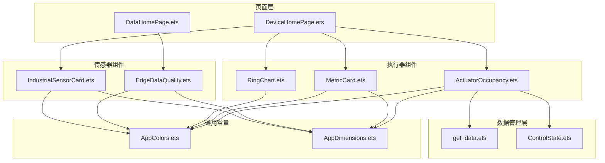
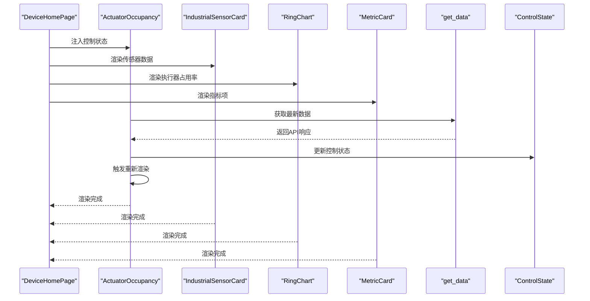
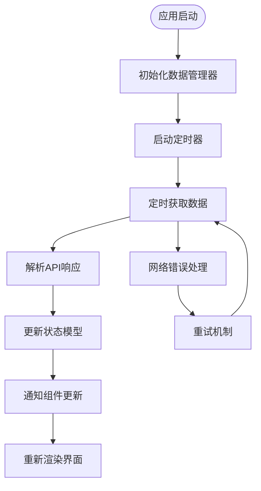
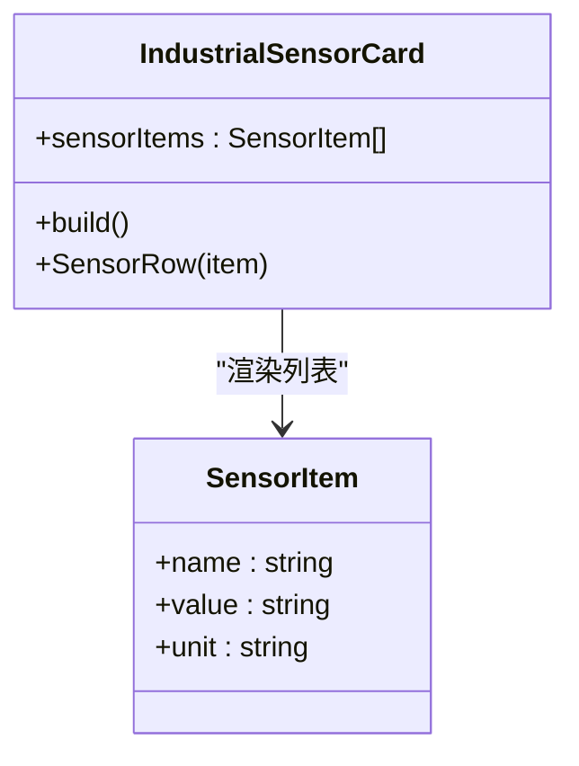
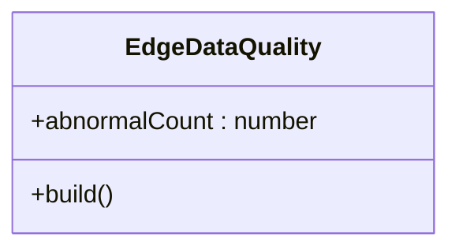
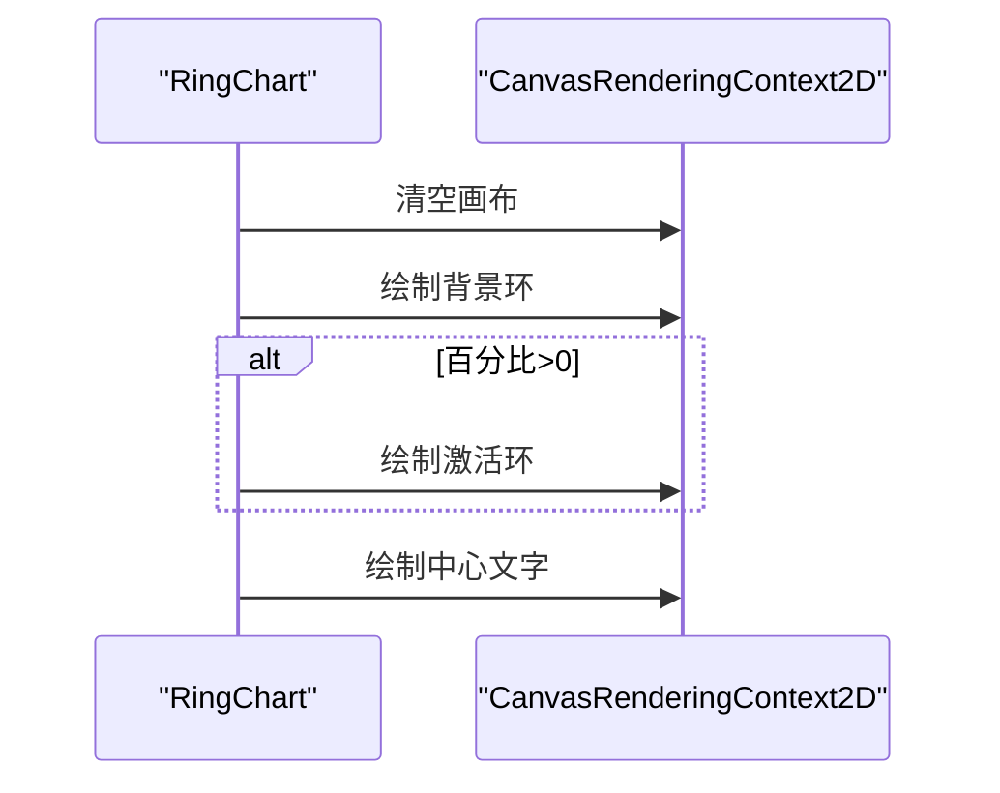
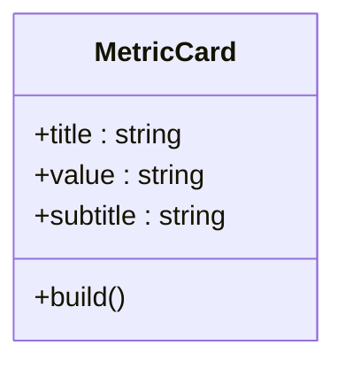
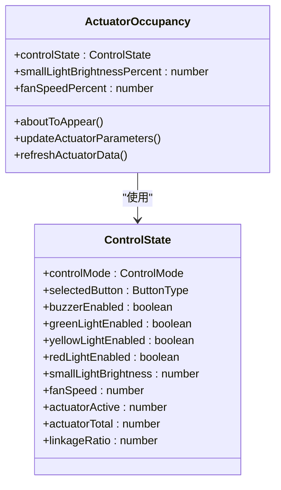
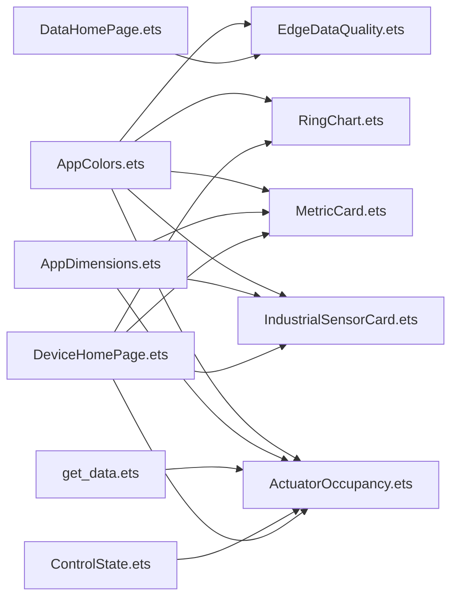

# 数据展示组件

<cite>
**本文引用的文件**
- [IndustrialSensorCard.ets](file://entry/src/main/ets/components/sensor/IndustrialSensorCard.ets)
- [EdgeDataQuality.ets](file://entry/src/main/ets/components/sensor/EdgeDataQuality.ets)
- [TrendChartCard.ets](file://entry/src/main/ets/pages/TrendChartCard.ets)
- [RingChart.ets](file://entry/src/main/ets/components/actuator/RingChart.ets)
- [MetricCard.ets](file://entry/src/main/ets/components/actuator/MetricCard.ets)
- [ActuatorOccupancy.ets](file://entry/src/main/ets/components/actuator/ActuatorOccupancy.ets)
- [AppColors.ets](file://entry/src/main/ets/constants/AppColors.ets)
- [AppDimensions.ets](file://entry/src/main/ets/constants/AppDimensions.ets)
- [DataHomePage.ets](file://entry/src/main/ets/pages/DataHomePage.ets)
- [DeviceHomePage.ets](file://entry/src/main/ets/pages/DeviceHomePage.ets)
- [ControlState.ets](file://entry/src/main/ets/models/ControlState.ets)
- [get_data.ets](file://entry/src/main/ets/network/get_data.ets)
- [DateUtils.ets](file://entry/src/main/ets/utils/DateUtils.ets)
</cite>

## 更新摘要
**所做更改**
- 新增数据管理架构章节，详细介绍统一数据访问模式
- 更新 ActuatorOccupancy 组件分析，反映新的数据管理模式
- 新增数据绑定与状态管理最佳实践章节
- 更新依赖关系分析，体现新的数据流架构
- 新增数据一致性保障机制说明

## 目录
1. [简介](#简介)
2. [项目结构](#项目结构)
3. [核心组件](#核心组件)
4. [架构总览](#架构总览)
5. [数据管理架构](#数据管理架构)
6. [详细组件分析](#详细组件分析)
7. [依赖关系分析](#依赖关系分析)
8. [性能考虑](#性能考虑)
9. [故障排查指南](#故障排查指南)
10. [结论](#结论)
11. [附录](#附录)

## 简介
本文件系统性梳理了工业数据展示组件的设计与实现，覆盖以下方面：
- 工业传感器卡片：数据格式化、实时更新策略与异常状态处理建议
- 边缘数据质量组件：质量评估指标与可视化呈现
- 趋势图表组件：时间序列渲染、缩放与交互思路
- 执行器环形图表：数据映射、颜色配置与动画效果
- 指标卡片组件：布局结构、内容组织与样式定制
- **新增** 数据管理架构：统一数据访问模式与跨组件一致性保障
- 数据绑定与状态管理最佳实践
- 图表性能优化与内存管理方案
- 自定义数据展示组件开发指导

## 项目结构
本项目采用按功能域分层的目录组织方式，数据展示相关组件主要位于 entry/src/main/ets/components 与 entry/src/main/ets/pages 下，并通过统一的颜色与尺寸常量进行视觉一致性管理。**新增**数据管理架构通过网络层统一管理数据获取与状态同步。

**图表来源**
- [DataHomePage.ets](file://entry/src/main/ets/pages/DataHomePage.ets)
- [DeviceHomePage.ets](file://entry/src/main/ets/pages/DeviceHomePage.ets)
- [IndustrialSensorCard.ets](file://entry/src/main/ets/components/sensor/IndustrialSensorCard.ets)
- [EdgeDataQuality.ets](file://entry/src/main/ets/components/sensor/EdgeDataQuality.ets)
- [TrendChartCard.ets](file://entry/src/main/ets/pages/TrendChartCard.ets)
- [RingChart.ets](file://entry/src/main/ets/components/actuator/RingChart.ets)
- [MetricCard.ets](file://entry/src/main/ets/components/actuator/MetricCard.ets)
- [ActuatorOccupancy.ets](file://entry/src/main/ets/components/actuator/ActuatorOccupancy.ets)
- [get_data.ets](file://entry/src/main/ets/network/get_data.ets)
- [ControlState.ets](file://entry/src/main/ets/models/ControlState.ets)
- [AppColors.ets](file://entry/src/main/ets/constants/AppColors.ets)
- [AppDimensions.ets](file://entry/src/main/ets/constants/AppDimensions.ets)

**章节来源**
- [DataHomePage.ets](file://entry/src/main/ets/pages/DataHomePage.ets)
- [DeviceHomePage.ets](file://entry/src/main/ets/pages/DeviceHomePage.ets)
- [AppColors.ets](file://entry/src/main/ets/constants/AppColors.ets)
- [AppDimensions.ets](file://entry/src/main/ets/constants/AppDimensions.ets)

## 核心组件
- 工业传感器卡片：以结构体组件形式展示多路传感器的名称、数值与单位，支持空态提示与统一卡片样式。
- 边缘数据质量：以结构体组件展示异常指标数量，突出关键数值与辅助文本。
- 趋势图表：基于 Canvas 的折线图，内置多系列、双轴刻度与网格背景。
- 执行器环形图表：基于 Canvas 的环形进度图，支持占比绘制与中心文字标注。
- 指标卡片：简洁的指标展示卡片，包含标题、数值与副标题。
- **新增** 执行器占用组件：整合执行器状态监控、参数指标与可视化展示，实现统一数据管理模式。

**章节来源**
- [IndustrialSensorCard.ets](file://entry/src/main/ets/components/sensor/IndustrialSensorCard.ets)
- [EdgeDataQuality.ets](file://entry/src/main/ets/components/sensor/EdgeDataQuality.ets)
- [TrendChartCard.ets](file://entry/src/main/ets/pages/TrendChartCard.ets)
- [RingChart.ets](file://entry/src/main/ets/components/actuator/RingChart.ets)
- [MetricCard.ets](file://entry/src/main/ets/components/actuator/MetricCard.ets)
- [ActuatorOccupancy.ets](file://entry/src/main/ets/components/actuator/ActuatorOccupancy.ets)

## 架构总览
数据展示组件在页面中通过组合使用，形成统一的仪表盘视图。页面负责布局与状态注入，组件负责具体渲染与交互。**新增**数据管理架构通过统一的数据源为所有组件提供一致的数据访问模式。

**图表来源**
- [DeviceHomePage.ets](file://entry/src/main/ets/pages/DeviceHomePage.ets)
- [ActuatorOccupancy.ets](file://entry/src/main/ets/components/actuator/ActuatorOccupancy.ets)
- [IndustrialSensorCard.ets](file://entry/src/main/ets/components/sensor/IndustrialSensorCard.ets)
- [RingChart.ets](file://entry/src/main/ets/components/actuator/RingChart.ets)
- [MetricCard.ets](file://entry/src/main/ets/components/actuator/MetricCard.ets)
- [get_data.ets](file://entry/src/main/ets/network/get_data.ets)
- [ControlState.ets](file://entry/src/main/ets/models/ControlState.ets)

## 数据管理架构
**新增** 项目集成了统一的数据管理架构，确保跨组件的一致性数据访问模式：

### 数据源统一管理
- **get_data 模块**：集中管理 HTTP 请求、定时器管理和数据缓存
- **ApiResponse 接口**：标准化 API 响应格式，包含传感器数据、执行器状态和元数据
- **@ObservedV2 装饰器**：实现响应式数据更新，自动触发组件重新渲染

### 状态管理模式
- **ControlState 模型**：封装执行器控制状态，支持联动占比计算
- **响应式属性**：通过 @Trace 装饰器实现双向数据绑定
- **生命周期管理**：组件在 aboutToAppear 生命周期自动更新数据

### 数据流架构

**图表来源**
- [get_data.ets](file://entry/src/main/ets/network/get_data.ets)
- [ControlState.ets](file://entry/src/main/ets/models/ControlState.ets)
- [ActuatorOccupancy.ets](file://entry/src/main/ets/components/actuator/ActuatorOccupancy.ets)

**章节来源**
- [get_data.ets](file://entry/src/main/ets/network/get_data.ets)
- [ControlState.ets](file://entry/src/main/ets/models/ControlState.ets)
- [ActuatorOccupancy.ets](file://entry/src/main/ets/components/actuator/ActuatorOccupancy.ets)

## 详细组件分析

### 工业传感器卡片（IndustrialSensorCard）
- 设计要点
  - 使用结构体组件，通过属性传入传感器数据数组，支持动态渲染。
  - 标题区采用统一字体与颜色，内容区以行布局展示名称与数值+单位。
  - 提供空态占位文本，提升用户体验。
  - 统一卡片背景与圆角，保证视觉一致性。
- 数据格式化
  - 传感器项接口包含名称、数值字符串与单位，便于直接渲染。
  - 数值与单位分别设置字号与颜色，突出主次信息。
- 实时更新与异常处理
  - 建议：通过外部状态驱动属性更新；当数据为空或异常时显示占位文本。
  - 可扩展：增加状态颜色（如警告/错误）与闪烁提示。
- 样式定制
  - 通过 AppColors 与 AppDimensions 常量统一管理颜色与间距。

**图表来源**
- [IndustrialSensorCard.ets](file://entry/src/main/ets/components/sensor/IndustrialSensorCard.ets)

**章节来源**
- [IndustrialSensorCard.ets](file://entry/src/main/ets/components/sensor/IndustrialSensorCard.ets)
- [AppColors.ets](file://entry/src/main/ets/constants/AppColors.ets)
- [AppDimensions.ets](file://entry/src/main/ets/constants/AppDimensions.ets)

### 边缘数据质量（EdgeDataQuality）
- 设计要点
  - 结构体组件，接收异常指标数量属性。
  - 标题区与数值区分离，数值区强调主标题与单位说明。
  - 统一卡片背景与圆角，保持与整体风格一致。
- 可视化建议
  - 可扩展：根据异常数量阈值切换颜色（如绿色/黄色/红色）。
  - 可扩展：增加趋势箭头或百分比变化。
- 性能与内存
  - 作为纯展示组件，无需复杂状态，渲染开销极低。

**图表来源**
- [EdgeDataQuality.ets](file://entry/src/main/ets/components/sensor/EdgeDataQuality.ets)

**章节来源**
- [EdgeDataQuality.ets](file://entry/src/main/ets/components/sensor/EdgeDataQuality.ets)
- [AppColors.ets](file://entry/src/main/ets/constants/AppColors.ets)
- [AppDimensions.ets](file://entry/src/main/ets/constants/AppDimensions.ets)

### 趋势图表（TrendChartCard）
- 设计要点
  - 基于 Canvas 的折线图，内置画布尺寸与渲染上下文。
  - 支持多系列数据，左侧与右侧双轴，分别设置最大值与刻度标签。
  - 绘制背景网格、边框与多条折线，统一配色。
- 数据渲染逻辑
  - 计算每个点的像素坐标，依据系列所在轴进行映射。
  - 使用路径绘制折线，支持不同颜色与线宽。
- 缩放与交互
  - 可扩展：添加触摸缩放与平移手势，结合裁剪区域实现局部放大。
  - 可扩展：添加点击高亮与悬浮提示框。
- 性能优化
  - 使用固定画布尺寸，避免频繁重绘。
  - 合理缓存计算结果，仅在数据变更时重绘。

**图表来源**
- [TrendChartCard.ets](file://entry/src/main/ets/pages/TrendChartCard.ets)

**章节来源**
- [TrendChartCard.ets](file://entry/src/main/ets/pages/TrendChartCard.ets)

### 执行器环形图表（RingChart）
- 设计要点
  - 接收占比、尺寸与环宽等参数，使用 Canvas 绘制背景环与激活环。
  - 中心绘制百分比与说明文字，颜色来自 AppColors。
- 数据映射与颜色配置
  - 角度映射：激活角度 = 百分比 × 2π。
  - 颜色：背景环与激活环分别使用统一配色。
- 动画效果
  - 可扩展：通过帧动画逐步增加激活角度，实现从 0 到目标值的过渡。
  - 可扩展：在属性变更时触发重绘，配合动画库实现平滑过渡。
- 性能与内存
  - Canvas 上下文与设置在组件内复用，减少重复创建。
  - 仅在 onReady 或属性变化时重绘。

**图表来源**
- [RingChart.ets](file://entry/src/main/ets/components/actuator/RingChart.ets)
- [AppColors.ets](file://entry/src/main/ets/constants/AppColors.ets)

**章节来源**
- [RingChart.ets](file://entry/src/main/ets/components/actuator/RingChart.ets)
- [AppColors.ets](file://entry/src/main/ets/constants/AppColors.ets)

### 指标卡片（MetricCard）
- 设计要点
  - 接收标题、数值与副标题，统一卡片背景与圆角。
  - 文字层级清晰，主次分明，适合在仪表盘中快速浏览。
- 布局与样式
  - 使用 Column 垂直布局，文本对齐与颜色均来自常量。
- 定制化
  - 可扩展：支持图标、状态徽标、趋势指示等。

**图表来源**
- [MetricCard.ets](file://entry/src/main/ets/components/actuator/MetricCard.ets)
- [AppColors.ets](file://entry/src/main/ets/constants/AppColors.ets)
- [AppDimensions.ets](file://entry/src/main/ets/constants/AppDimensions.ets)

**章节来源**
- [MetricCard.ets](file://entry/src/main/ets/components/actuator/MetricCard.ets)
- [AppColors.ets](file://entry/src/main/ets/constants/AppColors.ets)
- [AppDimensions.ets](file://entry/src/main/ets/constants/AppDimensions.ets)

### 执行器占用组件（ActuatorOccupancy）
**更新** 新增统一数据管理模式的执行器占用组件：

- 设计要点
  - 采用 ComponentV2 架构，支持响应式数据绑定。
  - 三列布局：左侧参数指标、中央环形图、右侧状态统计。
  - 集成 ControlState 模型，实现执行器状态统一管理。
- 数据管理流程
  - 通过 @Prop 接收 ControlState 实例，实现父子组件数据共享。
  - 使用 @Trace 装饰器实现响应式属性更新。
  - 在 aboutToAppear 生命周期自动更新数据。
- 统一数据源集成
  - 通过 data_setting.get_data 获取最新传感器数据。
  - 自动计算执行器激活数量与联动占比。
  - 实时更新小灯亮度与风扇转速百分比。
- 性能优化
  - 使用 @ObservedV2 装饰器实现响应式更新，避免手动订阅。
  - 合理的数据缓存与更新策略，减少不必要的重渲染。

**图表来源**
- [ActuatorOccupancy.ets](file://entry/src/main/ets/components/actuator/ActuatorOccupancy.ets)
- [ControlState.ets](file://entry/src/main/ets/models/ControlState.ets)

**章节来源**
- [ActuatorOccupancy.ets](file://entry/src/main/ets/components/actuator/ActuatorOccupancy.ets)
- [ControlState.ets](file://entry/src/main/ets/models/ControlState.ets)
- [get_data.ets](file://entry/src/main/ets/network/get_data.ets)

## 依赖关系分析
**更新** 依赖关系分析反映新的数据管理架构：

- 组件间耦合
  - 页面 DeviceHomePage 组合 ActuatorOccupancy 组件，实现统一数据管理模式。
  - ActuatorOccupancy 通过 data_setting 与 get_data 模块解耦，实现数据访问抽象。
  - 执行器环形图表与指标卡片依赖颜色常量，确保视觉一致性。
- 数据层依赖
  - get_data 模块提供统一的 API 访问接口与数据缓存机制。
  - ControlState 模型作为单一数据源，避免多处状态管理导致的数据不一致。
  - 响应式装饰器实现自动数据同步，减少手动状态管理。
- 外部依赖
  - Canvas 渲染上下文用于趋势图与环形图绘制。
  - 时间格式化工具可辅助时间序列数据的展示。

**图表来源**
- [AppColors.ets](file://entry/src/main/ets/constants/AppColors.ets)
- [AppDimensions.ets](file://entry/src/main/ets/constants/AppDimensions.ets)
- [IndustrialSensorCard.ets](file://entry/src/main/ets/components/sensor/IndustrialSensorCard.ets)
- [EdgeDataQuality.ets](file://entry/src/main/ets/components/sensor/EdgeDataQuality.ets)
- [TrendChartCard.ets](file://entry/src/main/ets/pages/TrendChartCard.ets)
- [RingChart.ets](file://entry/src/main/ets/components/actuator/RingChart.ets)
- [MetricCard.ets](file://entry/src/main/ets/components/actuator/MetricCard.ets)
- [ActuatorOccupancy.ets](file://entry/src/main/ets/components/actuator/ActuatorOccupancy.ets)
- [get_data.ets](file://entry/src/main/ets/network/get_data.ets)
- [ControlState.ets](file://entry/src/main/ets/models/ControlState.ets)
- [DataHomePage.ets](file://entry/src/main/ets/pages/DataHomePage.ets)
- [DeviceHomePage.ets](file://entry/src/main/ets/pages/DeviceHomePage.ets)

**章节来源**
- [AppColors.ets](file://entry/src/main/ets/constants/AppColors.ets)
- [AppDimensions.ets](file://entry/src/main/ets/constants/AppDimensions.ets)
- [DeviceHomePage.ets](file://entry/src/main/ets/pages/DeviceHomePage.ets)
- [get_data.ets](file://entry/src/main/ets/network/get_data.ets)
- [ControlState.ets](file://entry/src/main/ets/models/ControlState.ets)

## 性能考虑
**更新** 性能考虑反映新的数据管理架构：

- Canvas 绘制
  - 固定画布尺寸，避免频繁重排与重绘。
  - 合理使用路径与线段，减少不必要的绘制调用。
- 内存管理
  - 复用 Canvas 渲染上下文与设置对象，避免重复创建。
  - 在组件销毁或不再需要时及时释放资源。
- 数据更新策略
  - 工业传感器卡片与趋势图应采用节流/防抖更新，避免高频刷新导致卡顿。
  - 环形图表在属性变化时才重绘，避免无意义的重绘。
  - **新增** 响应式数据更新通过装饰器自动管理，减少手动状态同步开销。
- **新增** 数据管理优化
  - 定时器统一管理，避免重复启动导致的内存泄漏。
  - API 响应数据缓存，减少重复网络请求。
  - 组件级数据更新粒度控制，避免全页面重渲染。
- 可访问性与可维护性
  - 使用统一常量管理颜色与尺寸，便于主题切换与维护。
  - 对外暴露必要的属性与事件，便于上层业务接入。
  - **新增** 统一数据访问接口，简化组件间数据共享。

## 故障排查指南
**更新** 故障排查指南反映新的数据管理架构：

- 工业传感器卡片
  - 症状：空白或显示"暂无传感器数据"
  - 排查：确认传入的传感器数据数组非空；检查属性绑定是否正确。
- 边缘数据质量
  - 症状：数值不显示或显示异常
  - 排查：确认异常指标数量属性为有效数字；检查组件容器宽度与对齐。
- 趋势图表
  - 症状：线条不显示或显示异常
  - 排查：确认数据数组长度大于等于 2；检查画布尺寸与坐标计算。
  - 症状：渲染卡顿
  - 排查：减少数据点数量或启用节流；避免在 onReady 外频繁重绘。
- 环形图表
  - 症状：环形不显示或显示异常
  - 排查：确认百分比在 0-100 区间；检查画布尺寸与半径计算。
  - 症状：文字错位
  - 排查：调整字体大小与基线对齐；确保文本居中。
- 指标卡片
  - 症状：文字溢出或截断
  - 排查：设置最大行数与省略号；调整字体大小与容器宽度。
- **新增** 执行器占用组件
  - 症状：执行器状态不更新
  - 排查：确认 data_setting.get_data 是否正确获取；检查定时器是否正常运行。
  - 症状：联动占比计算错误
  - 排查：确认 ControlState.actuatorTotal 设置正确；检查激活执行器统计逻辑。
  - 症状：响应式更新失效
  - 排查：确认 @Trace 装饰器使用正确；检查组件生命周期钩子。

**章节来源**
- [IndustrialSensorCard.ets](file://entry/src/main/ets/components/sensor/IndustrialSensorCard.ets)
- [EdgeDataQuality.ets](file://entry/src/main/ets/components/sensor/EdgeDataQuality.ets)
- [TrendChartCard.ets](file://entry/src/main/ets/pages/TrendChartCard.ets)
- [RingChart.ets](file://entry/src/main/ets/components/actuator/RingChart.ets)
- [MetricCard.ets](file://entry/src/main/ets/components/actuator/MetricCard.ets)
- [ActuatorOccupancy.ets](file://entry/src/main/ets/components/actuator/ActuatorOccupancy.ets)
- [get_data.ets](file://entry/src/main/ets/network/get_data.ets)

## 结论
**更新** 本项目的数据展示组件体系通过集成统一的数据管理架构，实现了跨组件的一致性数据访问模式。以结构体组件为核心，结合统一的颜色与尺寸常量，以及响应式数据管理模式，形成了高内聚、低耦合的可视化模块。新的数据管理架构通过统一的数据源、响应式更新和生命周期管理，显著提升了系统的可维护性和扩展性。通过 Canvas 的高效渲染能力与合理的数据更新策略，能够满足工业场景下的实时数据展示需求。建议在实际工程中进一步完善异常状态处理、交互体验与性能优化，以提升系统的稳定性与可维护性。

## 附录

### 数据绑定与状态管理最佳实践
**更新** 新增统一数据管理模式的最佳实践：

- **统一数据源**
  - 使用 get_data 模块作为单一数据入口，避免多处网络请求。
  - 通过 ApiResponse 接口标准化数据格式，确保组件间数据一致性。
- **响应式数据绑定**
  - 使用 @ObservedV2 装饰器实现响应式数据更新。
  - 通过 @Trace 装饰器实现双向数据绑定，减少手动状态管理。
  - 在组件生命周期中合理使用 aboutToAppear 和 onDestroy 钩子。
- **状态模型设计**
  - ControlState 模型集中管理执行器状态，避免分散的状态管理。
  - 使用枚举类型定义控制模式和按钮类型，提升代码可读性。
  - 合理的数据验证与边界检查，防止异常状态传播。
- **组件间通信**
  - 通过 @Prop 传递只读数据，避免直接修改父组件状态。
  - 使用回调函数向上抛出用户交互结果，保持组件职责单一。
- **数据一致性保障**
  - 定时器统一管理，避免重复启动导致的内存泄漏。
  - API 响应数据缓存，减少重复网络请求。
  - 组件级数据更新粒度控制，避免全页面重渲染。

**章节来源**
- [get_data.ets](file://entry/src/main/ets/network/get_data.ets)
- [ControlState.ets](file://entry/src/main/ets/models/ControlState.ets)
- [ActuatorOccupancy.ets](file://entry/src/main/ets/components/actuator/ActuatorOccupancy.ets)

### 时间序列与格式化
- 时间格式化工具可用于时间轴标签或日志展示，便于与趋势图结合。
- 建议：在趋势图中使用时间戳数组作为横轴，配合格式化工具生成标签。

**章节来源**
- [DateUtils.ets](file://entry/src/main/ets/utils/DateUtils.ets)

### 自定义数据展示组件开发指导
**更新** 新增统一数据管理模式的开发指导：

- **组件设计**
  - 明确职责边界，优先使用结构体组件与属性传参。
  - 抽象通用样式与行为，通过常量与工具函数统一管理。
  - **新增** 集成统一数据管理模式，实现响应式数据绑定。
- **渲染实现**
  - Canvas 组件适合复杂图形与高性能渲染；纯 UI 组件适合简单布局与高可读性。
  - **新增** 使用响应式装饰器简化数据更新逻辑。
- **性能优化**
  - 合理使用缓存与节流；避免在渲染路径中进行昂贵计算。
  - 在组件生命周期中进行资源初始化与清理。
  - **新增** 利用统一数据管理器的缓存机制，减少重复计算。
- **可扩展性**
  - 为未来交互（缩放、高亮、动画）预留接口与参数。
  - **新增** 支持响应式数据更新，自动适配数据变化。
- **数据管理集成**
  - 通过 get_data 模块获取统一数据源，避免直接网络请求。
  - 使用 ApiResponse 接口标准化数据格式，确保组件兼容性。
  - 实现响应式更新机制，自动触发组件重新渲染。

**章节来源**
- [get_data.ets](file://entry/src/main/ets/network/get_data.ets)
- [ActuatorOccupancy.ets](file://entry/src/main/ets/components/actuator/ActuatorOccupancy.ets)