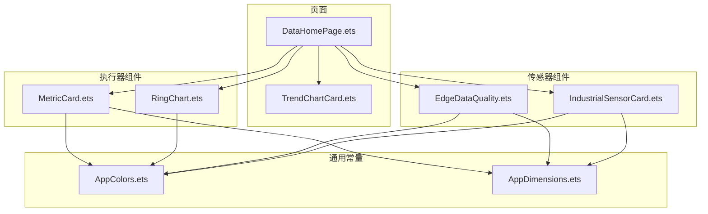
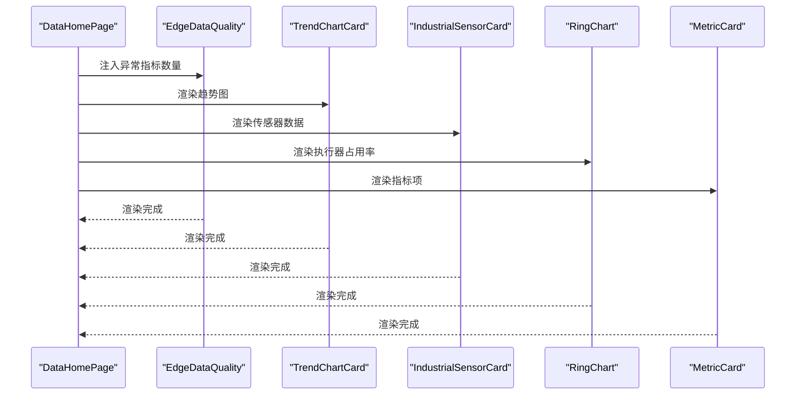
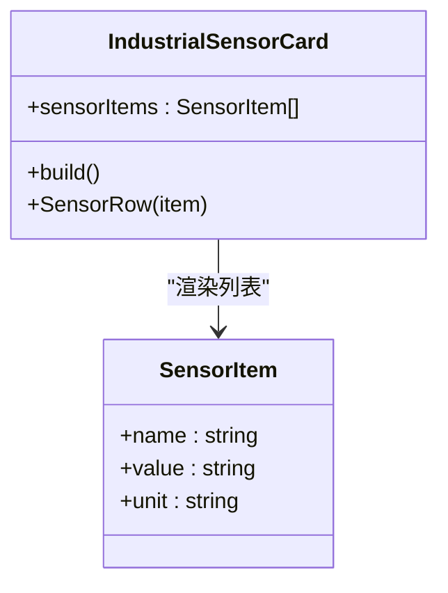
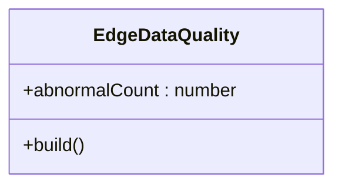
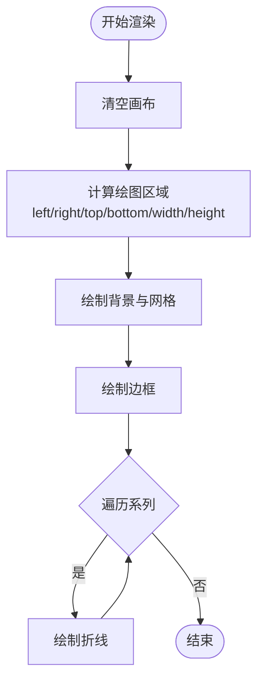
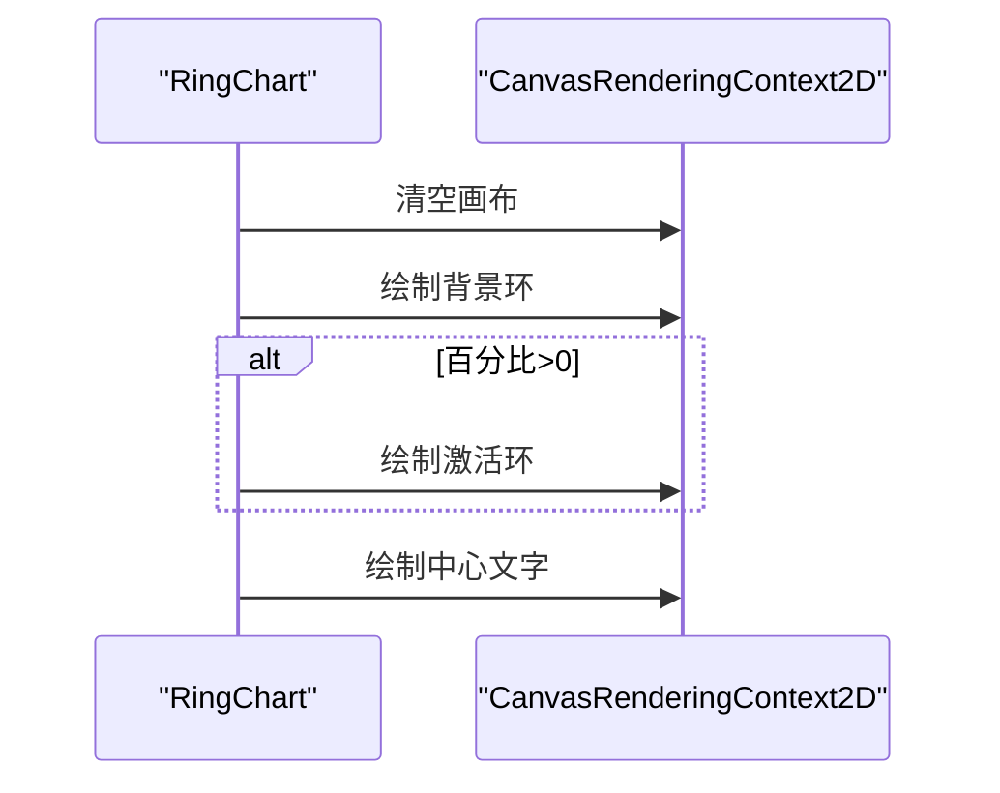
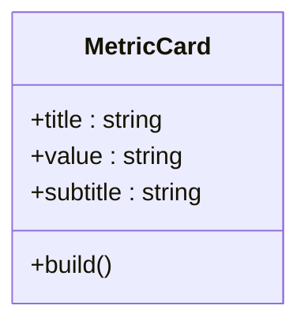
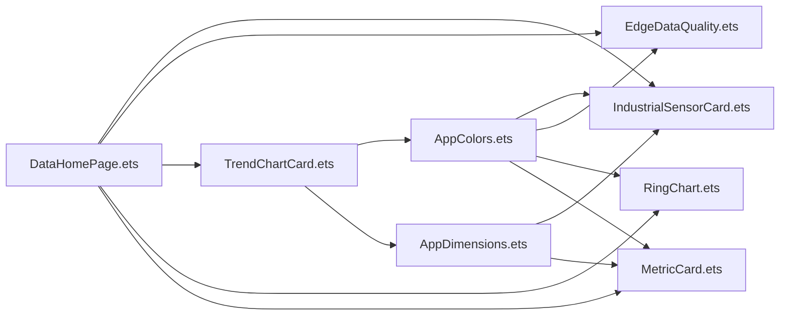

# 数据展示组件

<cite>
**本文引用的文件**
- [IndustrialSensorCard.ets](file://entry/src/main/ets/components/sensor/IndustrialSensorCard.ets)
- [EdgeDataQuality.ets](file://entry/src/main/ets/components/sensor/EdgeDataQuality.ets)
- [TrendChartCard.ets](file://entry/src/main/ets/pages/TrendChartCard.ets)
- [RingChart.ets](file://entry/src/main/ets/components/actuator/RingChart.ets)
- [MetricCard.ets](file://entry/src/main/ets/components/actuator/MetricCard.ets)
- [AppColors.ets](file://entry/src/main/ets/constants/AppColors.ets)
- [AppDimensions.ets](file://entry/src/main/ets/constants/AppDimensions.ets)
- [DataHomePage.ets](file://entry/src/main/ets/pages/DataHomePage.ets)
- [ControlState.ets](file://entry/src/main/ets/models/ControlState.ets)
- [DateUtils.ets](file://entry/src/main/ets/utils/DateUtils.ets)
</cite>

## 目录
1. [简介](#简介)
2. [项目结构](#项目结构)
3. [核心组件](#核心组件)
4. [架构总览](#架构总览)
5. [详细组件分析](#详细组件分析)
6. [依赖关系分析](#依赖关系分析)
7. [性能考虑](#性能考虑)
8. [故障排查指南](#故障排查指南)
9. [结论](#结论)
10. [附录](#附录)

## 简介
本文件系统性梳理了工业数据展示组件的设计与实现，覆盖以下方面：
- 工业传感器卡片：数据格式化、实时更新策略与异常状态处理建议
- 边缘数据质量组件：质量评估指标与可视化呈现
- 趋势图表组件：时间序列渲染、缩放与交互思路
- 执行器环形图表：数据映射、颜色配置与动画效果
- 指标卡片组件：布局结构、内容组织与样式定制
- 数据绑定与状态管理最佳实践
- 图表性能优化与内存管理方案
- 自定义数据展示组件开发指导

## 项目结构
本项目采用按功能域分层的目录组织方式，数据展示相关组件主要位于 entry/src/main/ets/components 与 entry/src/main/ets/pages 下，并通过统一的颜色与尺寸常量进行视觉一致性管理。

**图表来源**
- [DataHomePage.ets](file://entry/src/main/ets/pages/DataHomePage.ets)
- [IndustrialSensorCard.ets](file://entry/src/main/ets/components/sensor/IndustrialSensorCard.ets)
- [EdgeDataQuality.ets](file://entry/src/main/ets/components/sensor/EdgeDataQuality.ets)
- [TrendChartCard.ets](file://entry/src/main/ets/pages/TrendChartCard.ets)
- [RingChart.ets](file://entry/src/main/ets/components/actuator/RingChart.ets)
- [MetricCard.ets](file://entry/src/main/ets/components/actuator/MetricCard.ets)
- [AppColors.ets](file://entry/src/main/ets/constants/AppColors.ets)
- [AppDimensions.ets](file://entry/src/main/ets/constants/AppDimensions.ets)

**章节来源**
- [DataHomePage.ets](file://entry/src/main/ets/pages/DataHomePage.ets)
- [AppColors.ets](file://entry/src/main/ets/constants/AppColors.ets)
- [AppDimensions.ets](file://entry/src/main/ets/constants/AppDimensions.ets)

## 核心组件
- 工业传感器卡片：以结构体组件形式展示多路传感器的名称、数值与单位，支持空态提示与统一卡片样式。
- 边缘数据质量：以结构体组件展示异常指标数量，突出关键数值与辅助文本。
- 趋势图表：基于 Canvas 的折线图，内置多系列、双轴刻度与网格背景。
- 执行器环形图表：基于 Canvas 的环形进度图，支持占比绘制与中心文字标注。
- 指标卡片：简洁的指标展示卡片，包含标题、数值与副标题。

**章节来源**
- [IndustrialSensorCard.ets](file://entry/src/main/ets/components/sensor/IndustrialSensorCard.ets)
- [EdgeDataQuality.ets](file://entry/src/main/ets/components/sensor/EdgeDataQuality.ets)
- [TrendChartCard.ets](file://entry/src/main/ets/pages/TrendChartCard.ets)
- [RingChart.ets](file://entry/src/main/ets/components/actuator/RingChart.ets)
- [MetricCard.ets](file://entry/src/main/ets/components/actuator/MetricCard.ets)

## 架构总览
数据展示组件在页面中通过组合使用，形成统一的仪表盘视图。页面负责布局与状态注入，组件负责具体渲染与交互。

**图表来源**
- [DataHomePage.ets](file://entry/src/main/ets/pages/DataHomePage.ets)
- [EdgeDataQuality.ets](file://entry/src/main/ets/components/sensor/EdgeDataQuality.ets)
- [TrendChartCard.ets](file://entry/src/main/ets/pages/TrendChartCard.ets)
- [IndustrialSensorCard.ets](file://entry/src/main/ets/components/sensor/IndustrialSensorCard.ets)
- [RingChart.ets](file://entry/src/main/ets/components/actuator/RingChart.ets)
- [MetricCard.ets](file://entry/src/main/ets/components/actuator/MetricCard.ets)

## 详细组件分析

### 工业传感器卡片（IndustrialSensorCard）
- 设计要点
  - 使用结构体组件，通过属性传入传感器数据数组，支持动态渲染。
  - 标题区采用统一字体与颜色，内容区以行布局展示名称与数值+单位。
  - 提供空态占位文本，提升用户体验。
  - 统一卡片背景与圆角，保证视觉一致性。
- 数据格式化
  - 传感器项接口包含名称、数值字符串与单位，便于直接渲染。
  - 数值与单位分别设置字号与颜色，突出主次信息。
- 实时更新与异常处理
  - 建议：通过外部状态驱动属性更新；当数据为空或异常时显示占位文本。
  - 可扩展：增加状态颜色（如警告/错误）与闪烁提示。
- 样式定制
  - 通过 AppColors 与 AppDimensions 常量统一管理颜色与间距。

**图表来源**
- [IndustrialSensorCard.ets](file://entry/src/main/ets/components/sensor/IndustrialSensorCard.ets)

**章节来源**
- [IndustrialSensorCard.ets](file://entry/src/main/ets/components/sensor/IndustrialSensorCard.ets)
- [AppColors.ets](file://entry/src/main/ets/constants/AppColors.ets)
- [AppDimensions.ets](file://entry/src/main/ets/constants/AppDimensions.ets)

### 边缘数据质量（EdgeDataQuality）
- 设计要点
  - 结构体组件，接收异常指标数量属性。
  - 标题区与数值区分离，数值区强调主标题与单位说明。
  - 统一卡片背景与圆角，保持与整体风格一致。
- 可视化建议
  - 可扩展：根据异常数量阈值切换颜色（如绿色/黄色/红色）。
  - 可扩展：增加趋势箭头或百分比变化。
- 性能与内存
  - 作为纯展示组件，无需复杂状态，渲染开销极低。

**图表来源**
- [EdgeDataQuality.ets](file://entry/src/main/ets/components/sensor/EdgeDataQuality.ets)

**章节来源**
- [EdgeDataQuality.ets](file://entry/src/main/ets/components/sensor/EdgeDataQuality.ets)
- [AppColors.ets](file://entry/src/main/ets/constants/AppColors.ets)
- [AppDimensions.ets](file://entry/src/main/ets/constants/AppDimensions.ets)

### 趋势图表（TrendChartCard）
- 设计要点
  - 基于 Canvas 的折线图，内置画布尺寸与渲染上下文。
  - 支持多系列数据，左侧与右侧双轴，分别设置最大值与刻度标签。
  - 绘制背景网格、边框与多条折线，统一配色。
- 数据渲染逻辑
  - 计算每个点的像素坐标，依据系列所在轴进行映射。
  - 使用路径绘制折线，支持不同颜色与线宽。
- 缩放与交互
  - 可扩展：添加触摸缩放与平移手势，结合裁剪区域实现局部放大。
  - 可扩展：添加点击高亮与悬浮提示框。
- 性能优化
  - 使用固定画布尺寸，避免频繁重绘。
  - 合理缓存计算结果，仅在数据变更时重绘。

**图表来源**
- [TrendChartCard.ets](file://entry/src/main/ets/pages/TrendChartCard.ets)

**章节来源**
- [TrendChartCard.ets](file://entry/src/main/ets/pages/TrendChartCard.ets)

### 执行器环形图表（RingChart）
- 设计要点
  - 接收占比、尺寸与环宽等参数，使用 Canvas 绘制背景环与激活环。
  - 中心绘制百分比与说明文字，颜色来自 AppColors。
- 数据映射与颜色配置
  - 角度映射：激活角度 = 百分比 × 2π。
  - 颜色：背景环与激活环分别使用统一配色。
- 动画效果
  - 可扩展：通过帧动画逐步增加激活角度，实现从 0 到目标值的过渡。
  - 可扩展：在属性变更时触发重绘，配合动画库实现平滑过渡。
- 性能与内存
  - Canvas 上下文与设置在组件内复用，减少重复创建。
  - 仅在 onReady 或属性变化时重绘。

**图表来源**
- [RingChart.ets](file://entry/src/main/ets/components/actuator/RingChart.ets)
- [AppColors.ets](file://entry/src/main/ets/constants/AppColors.ets)

**章节来源**
- [RingChart.ets](file://entry/src/main/ets/components/actuator/RingChart.ets)
- [AppColors.ets](file://entry/src/main/ets/constants/AppColors.ets)

### 指标卡片（MetricCard）
- 设计要点
  - 接收标题、数值与副标题，统一卡片背景与圆角。
  - 文字层级清晰，主次分明，适合在仪表盘中快速浏览。
- 布局与样式
  - 使用 Column 垂直布局，文本对齐与颜色均来自常量。
- 定制化
  - 可扩展：支持图标、状态徽标、趋势指示等。

**图表来源**
- [MetricCard.ets](file://entry/src/main/ets/components/actuator/MetricCard.ets)
- [AppColors.ets](file://entry/src/main/ets/constants/AppColors.ets)
- [AppDimensions.ets](file://entry/src/main/ets/constants/AppDimensions.ets)

**章节来源**
- [MetricCard.ets](file://entry/src/main/ets/components/actuator/MetricCard.ets)
- [AppColors.ets](file://entry/src/main/ets/constants/AppColors.ets)
- [AppDimensions.ets](file://entry/src/main/ets/constants/AppDimensions.ets)

## 依赖关系分析
- 组件间耦合
  - 页面 DataHomePage 组合多个展示组件，组件之间无直接耦合，通过属性传递数据。
  - 执行器环形图表与指标卡片依赖颜色常量，确保视觉一致性。
- 外部依赖
  - Canvas 渲染上下文用于趋势图与环形图绘制。
  - 时间格式化工具可辅助时间序列数据的展示。

**图表来源**
- [AppColors.ets](file://entry/src/main/ets/constants/AppColors.ets)
- [AppDimensions.ets](file://entry/src/main/ets/constants/AppDimensions.ets)
- [IndustrialSensorCard.ets](file://entry/src/main/ets/components/sensor/IndustrialSensorCard.ets)
- [EdgeDataQuality.ets](file://entry/src/main/ets/components/sensor/EdgeDataQuality.ets)
- [TrendChartCard.ets](file://entry/src/main/ets/pages/TrendChartCard.ets)
- [RingChart.ets](file://entry/src/main/ets/components/actuator/RingChart.ets)
- [MetricCard.ets](file://entry/src/main/ets/components/actuator/MetricCard.ets)
- [DataHomePage.ets](file://entry/src/main/ets/pages/DataHomePage.ets)

**章节来源**
- [AppColors.ets](file://entry/src/main/ets/constants/AppColors.ets)
- [AppDimensions.ets](file://entry/src/main/ets/constants/AppDimensions.ets)
- [DataHomePage.ets](file://entry/src/main/ets/pages/DataHomePage.ets)

## 性能考虑
- Canvas 绘制
  - 固定画布尺寸，避免频繁重排与重绘。
  - 合理使用路径与线段，减少不必要的绘制调用。
- 内存管理
  - 复用 Canvas 渲染上下文与设置对象，避免重复创建。
  - 在组件销毁或不再需要时及时释放资源。
- 数据更新策略
  - 工业传感器卡片与趋势图应采用节流/防抖更新，避免高频刷新导致卡顿。
  - 环形图表在属性变化时才重绘，避免无意义的重绘。
- 可访问性与可维护性
  - 使用统一常量管理颜色与尺寸，便于主题切换与维护。
  - 对外暴露必要的属性与事件，便于上层业务接入。

[本节为通用性能建议，不直接分析特定文件，故无“章节来源”]

## 故障排查指南
- 工业传感器卡片
  - 症状：空白或显示“暂无传感器数据”
  - 排查：确认传入的传感器数据数组非空；检查属性绑定是否正确。
- 边缘数据质量
  - 症状：数值不显示或显示异常
  - 排查：确认异常指标数量属性为有效数字；检查组件容器宽度与对齐。
- 趋势图表
  - 症状：线条不显示或显示异常
  - 排查：确认数据数组长度大于等于 2；检查画布尺寸与坐标计算。
  - 症状：渲染卡顿
  - 排查：减少数据点数量或启用节流；避免在 onReady 外频繁重绘。
- 环形图表
  - 症状：环形不显示或显示异常
  - 排查：确认百分比在 0-100 区间；检查画布尺寸与半径计算。
  - 症状：文字错位
  - 排查：调整字体大小与基线对齐；确保文本居中。
- 指标卡片
  - 症状：文字溢出或截断
  - 排查：设置最大行数与省略号；调整字体大小与容器宽度。

**章节来源**
- [IndustrialSensorCard.ets](file://entry/src/main/ets/components/sensor/IndustrialSensorCard.ets)
- [EdgeDataQuality.ets](file://entry/src/main/ets/components/sensor/EdgeDataQuality.ets)
- [TrendChartCard.ets](file://entry/src/main/ets/pages/TrendChartCard.ets)
- [RingChart.ets](file://entry/src/main/ets/components/actuator/RingChart.ets)
- [MetricCard.ets](file://entry/src/main/ets/components/actuator/MetricCard.ets)

## 结论
本项目的数据展示组件体系以结构体组件为核心，结合统一的颜色与尺寸常量，实现了高内聚、低耦合的可视化模块。通过 Canvas 的高效渲染能力与合理的数据更新策略，能够满足工业场景下的实时数据展示需求。建议在实际工程中进一步完善异常状态处理、交互体验与性能优化，以提升系统的稳定性与可维护性。

[本节为总结性内容，不直接分析特定文件，故无“章节来源”]

## 附录

### 数据绑定与状态管理最佳实践
- 页面到组件
  - 使用属性注入数据，避免在组件内部直接访问全局状态。
  - 对于复杂状态，可通过状态对象（如控制状态模型）统一管理。
- 组件到页面
  - 通过回调或事件向上抛出用户交互结果，保持组件职责单一。
- 状态模型参考
  - 控制状态模型包含多种设备状态与执行器联动占比，可作为数据源之一。

**章节来源**
- [ControlState.ets](file://entry/src/main/ets/models/ControlState.ets)

### 时间序列与格式化
- 时间格式化工具可用于时间轴标签或日志展示，便于与趋势图结合。
- 建议：在趋势图中使用时间戳数组作为横轴，配合格式化工具生成标签。

**章节来源**
- [DateUtils.ets](file://entry/src/main/ets/utils/DateUtils.ets)

### 自定义数据展示组件开发指导
- 组件设计
  - 明确职责边界，优先使用结构体组件与属性传参。
  - 抽象通用样式与行为，通过常量与工具函数统一管理。
- 渲染实现
  - Canvas 组件适合复杂图形与高性能渲染；纯 UI 组件适合简单布局与高可读性。
- 性能优化
  - 合理使用缓存与节流；避免在渲染路径中进行昂贵计算。
  - 在组件生命周期中进行资源初始化与清理。
- 可扩展性
  - 为未来交互（缩放、高亮、动画）预留接口与参数。

[本节为通用指导，不直接分析特定文件，故无“章节来源”]