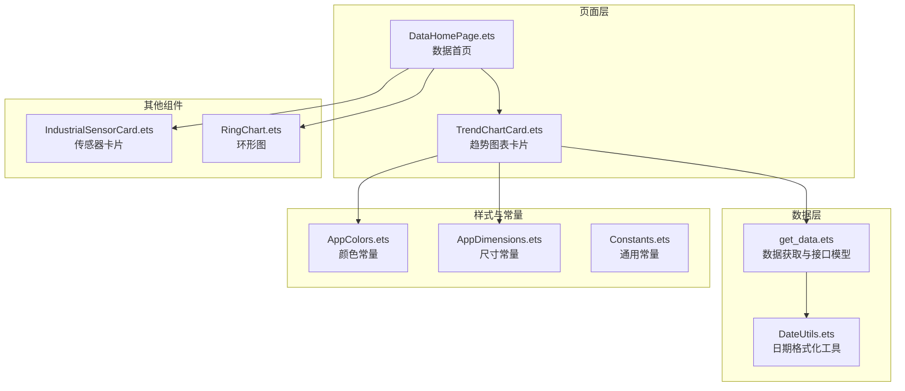
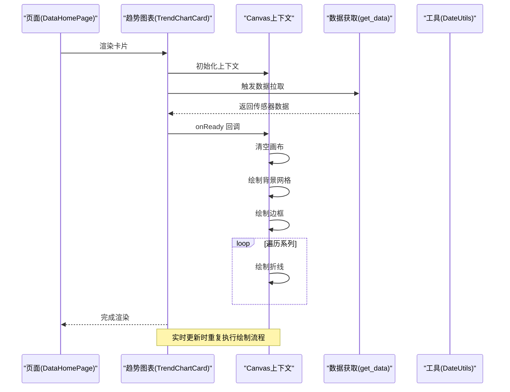
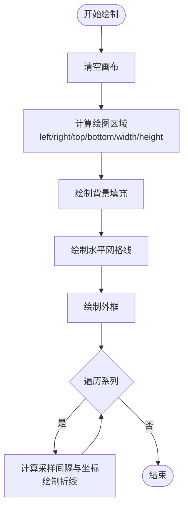
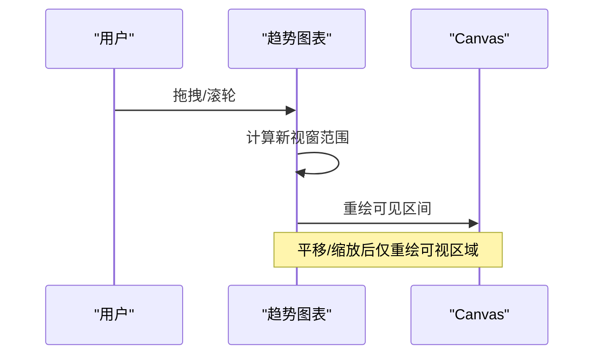
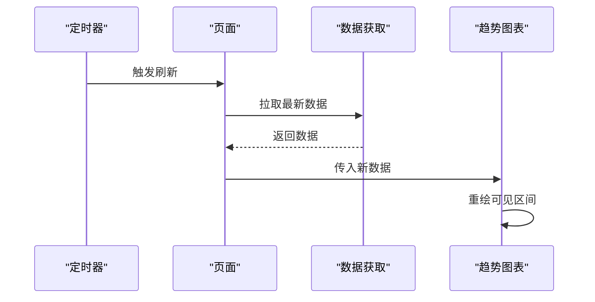
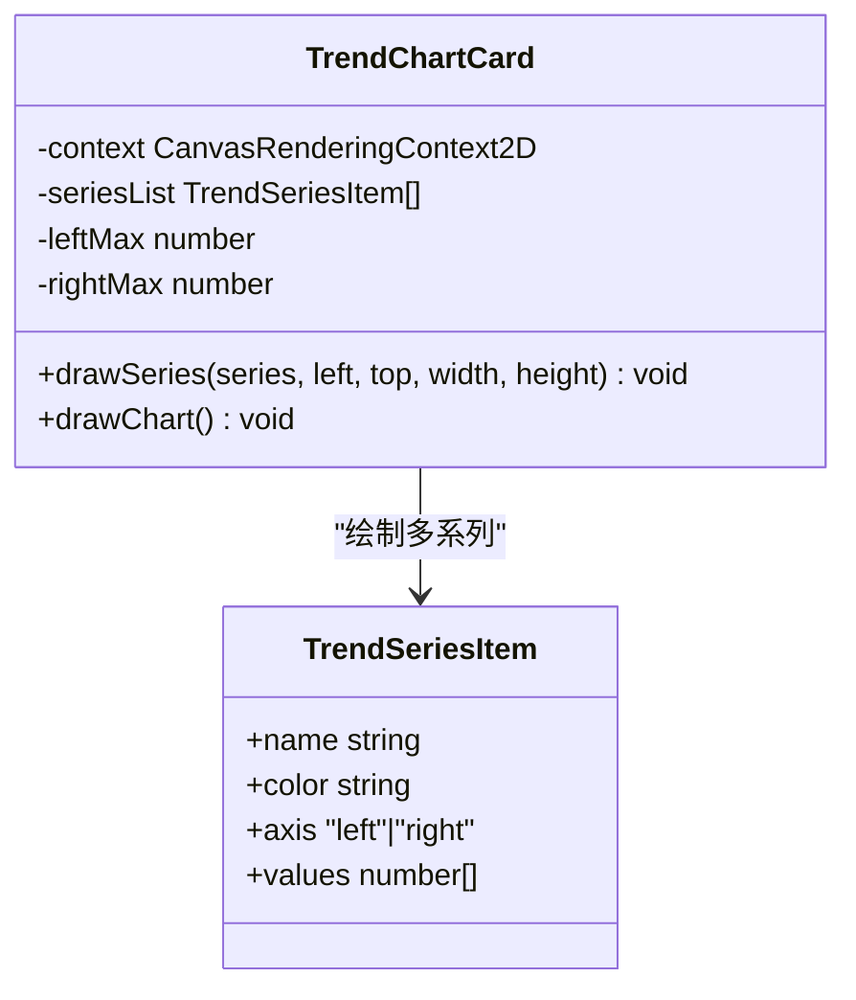
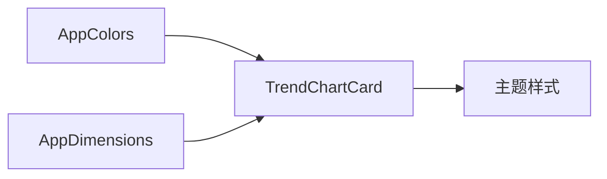
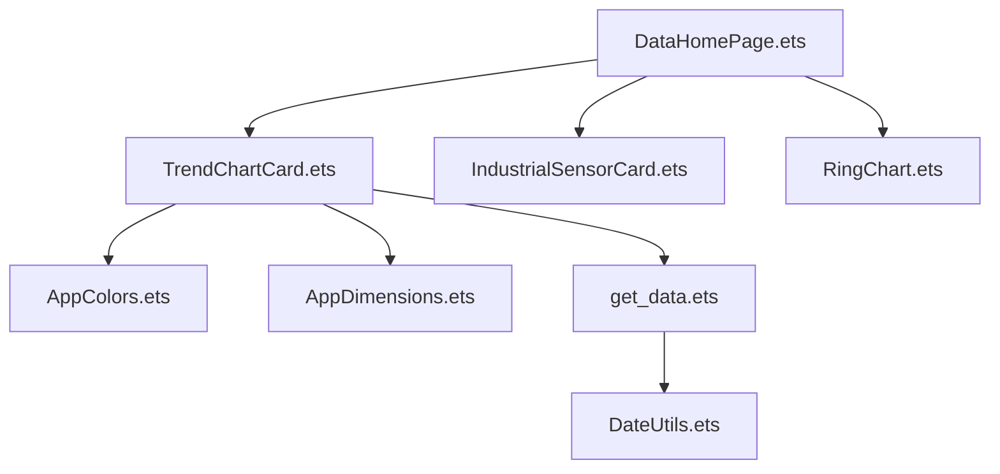

# 趋势图表卡片

<cite>
**本文引用的文件**
- [TrendChartCard.ets](file://entry/src/main/ets/pages/TrendChartCard.ets)
- [get_data.ets](file://entry/src/main/ets/pages/get_data.ets)
- [DateUtils.ets](file://entry/src/main/ets/utils/DateUtils.ets)
- [AppColors.ets](file://entry/src/main/ets/constants/AppColors.ets)
- [AppDimensions.ets](file://entry/src/main/ets/constants/AppDimensions.ets)
- [Constants.ets](file://entry/src/main/ets/common/Constants.ets)
- [DataHomePage.ets](file://entry/src/main/ets/pages/DataHomePage.ets)
- [IndustrialSensorCard.ets](file://entry/src/main/ets/components/sensor/IndustrialSensorCard.ets)
- [RingChart.ets](file://entry/src/main/ets/components/actuator/RingChart.ets)
</cite>

## 目录
1. [简介](#简介)
2. [项目结构](#项目结构)
3. [核心组件](#核心组件)
4. [架构概览](#架构概览)
5. [详细组件分析](#详细组件分析)
6. [依赖关系分析](#依赖关系分析)
7. [性能考虑](#性能考虑)
8. [故障排查指南](#故障排查指南)
9. [结论](#结论)
10. [附录](#附录)

## 简介
本文件面向开发者，系统性说明趋势图表卡片组件的设计与实现，涵盖时间序列数据处理（数据聚合、采样间隔、缺失值处理）、图表渲染（坐标轴、数据点绘制、线条样式）、交互能力（缩放、平移、悬停提示）、实时数据更新（动态刷新、动画过渡、性能优化），以及扩展支持（折线图、面积图、柱状图）与主题定制。文档以仓库中现有实现为基础，结合可扩展设计建议，帮助读者快速理解并定制该组件。

## 项目结构
趋势图表卡片位于页面层，采用自绘 Canvas 的方式渲染折线图。数据来源通过网络接口获取，并在页面中进行展示。整体结构如下：

**图表来源**
- [TrendChartCard.ets:1-106](file://entry/src/main/ets/pages/TrendChartCard.ets#L1-L106)
- [DataHomePage.ets:1-61](file://entry/src/main/ets/pages/DataHomePage.ets#L1-L61)
- [get_data.ets:1-105](file://entry/src/main/ets/pages/get_data.ets#L1-L105)
- [DateUtils.ets:1-28](file://entry/src/main/ets/utils/DateUtils.ets#L1-L28)
- [AppColors.ets:1-47](file://entry/src/main/ets/constants/AppColors.ets#L1-L47)
- [AppDimensions.ets:1-40](file://entry/src/main/ets/constants/AppDimensions.ets#L1-L40)
- [Constants.ets:1-82](file://entry/src/main/ets/common/Constants.ets#L1-L82)
- [IndustrialSensorCard.ets:1-109](file://entry/src/main/ets/components/sensor/IndustrialSensorCard.ets#L1-L109)
- [RingChart.ets:1-69](file://entry/src/main/ets/components/actuator/RingChart.ets#L1-L69)

**章节来源**
- [TrendChartCard.ets:1-106](file://entry/src/main/ets/pages/TrendChartCard.ets#L1-L106)
- [DataHomePage.ets:1-61](file://entry/src/main/ets/pages/DataHomePage.ets#L1-L61)

## 核心组件
- 趋势图表卡片：基于 Canvas 的折线图组件，负责绘制背景网格、坐标轴、多条曲线及容器样式。
- 数据获取模块：封装 HTTP 请求与响应模型，提供传感器数据拉取方法。
- 工具与常量：统一的颜色与尺寸规范，便于主题定制与布局一致性。
- 页面集成：数据首页作为容器页面，组合趋势图表与其他业务组件。

**章节来源**
- [TrendChartCard.ets:1-106](file://entry/src/main/ets/pages/TrendChartCard.ets#L1-L106)
- [get_data.ets:1-105](file://entry/src/main/ets/pages/get_data.ets#L1-L105)
- [AppColors.ets:1-47](file://entry/src/main/ets/constants/AppColors.ets#L1-L47)
- [AppDimensions.ets:1-40](file://entry/src/main/ets/constants/AppDimensions.ets#L1-L40)

## 架构概览
趋势图表卡片采用“页面组件 + 自绘 Canvas”的架构。页面组件负责生命周期与布局，Canvas 负责像素级绘制；数据通过页面层的数据模块拉取并注入到组件内部。

**图表来源**
- [DataHomePage.ets:1-61](file://entry/src/main/ets/pages/DataHomePage.ets#L1-L61)
- [TrendChartCard.ets:82-104](file://entry/src/main/ets/pages/TrendChartCard.ets#L82-L104)
- [get_data.ets:67-105](file://entry/src/main/ets/pages/get_data.ets#L67-L105)
- [DateUtils.ets:1-28](file://entry/src/main/ets/utils/DateUtils.ets#L1-L28)

## 详细组件分析

### 时间序列数据处理
- 数据聚合与采样间隔
  - 折线段长度由 series.values.length 决定，采样间隔为 plotWidth / (values.length - 1)，确保等距采样。
  - 当前实现固定使用 series.values，未见外部聚合或降采样逻辑。
- 缺失值处理
  - 当前实现直接遍历 values，未显式处理 NaN 或 null 值。若存在缺失值，可能导致折线断点或异常跳变。
- 时间戳与更新频率
  - 接口返回包含 updated_at 字段，可用于记录最新更新时间；当前页面未直接展示时间戳。

建议改进：
- 在绘制前对 values 进行校验与插值/截断处理，避免 NaN 导致的渲染异常。
- 支持动态采样窗口（如最近 N 个点），并提供聚合策略（均值、最大、最小）。
- 将 updated_at 与本地时间对比，实现“最后更新”提示。

**章节来源**
- [TrendChartCard.ets:17-22](file://entry/src/main/ets/pages/TrendChartCard.ets#L17-L22)
- [TrendChartCard.ets:24-42](file://entry/src/main/ets/pages/TrendChartCard.ets#L24-L42)
- [get_data.ets:12-36](file://entry/src/main/ets/pages/get_data.ets#L12-L36)
- [get_data.ets:71-100](file://entry/src/main/ets/pages/get_data.ets#L71-L100)

### 图表渲染实现
- 坐标轴与网格
  - 绘制矩形区域背景与水平网格线，网格线数量与刻度数组一致。
  - 左右双轴：左轴（CO2）与右轴（温度、湿度、噪声）分别映射不同最大值，实现多量纲共存。
- 数据点绘制与线条样式
  - 使用 Canvas Path 绘制折线，lineWidth 与 strokeStyle 由 series.color 控制。
  - Y 坐标计算采用归一化公式，区分左右轴的最大值。
- 容器与主题
  - 外层容器设置圆角、边框与渐变背景，颜色来自 AppColors 与 AppDimensions。

**图表来源**
- [TrendChartCard.ets:44-80](file://entry/src/main/ets/pages/TrendChartCard.ets#L44-L80)

**章节来源**
- [TrendChartCard.ets:10-16](file://entry/src/main/ets/pages/TrendChartCard.ets#L10-L16)
- [TrendChartCard.ets:44-80](file://entry/src/main/ets/pages/TrendChartCard.ets#L44-L80)
- [AppColors.ets:1-47](file://entry/src/main/ets/constants/AppColors.ets#L1-L47)
- [AppDimensions.ets:1-40](file://entry/src/main/ets/constants/AppDimensions.ets#L1-L40)

### 交互功能实现
- 缩放与平移
  - 当前实现未提供触摸/鼠标交互，不支持缩放与平移。
- 数据点悬停提示
  - 当前实现未提供悬停提示或高亮。
- 建议扩展
  - 引入手势识别与事件监听，维护当前视窗范围（minX/maxX），在 onReady 中仅绘制可见区间。
  - 添加鼠标移动事件，计算最近点并绘制提示框与十字线。

[此图为概念性交互流程，不对应具体源码，故不附“图表来源”]

**章节来源**
- [TrendChartCard.ets:82-104](file://entry/src/main/ets/pages/TrendChartCard.ets#L82-L104)

### 实时数据更新机制
- 动态刷新
  - 页面层通过数据模块定时拉取接口，更新 @ObservedV2 对象后触发重新渲染。
- 动画过渡
  - 当前实现未引入过渡动画，直接重绘。
- 性能优化
  - 仅重绘可见区间与必要路径，避免全量重绘。
  - 合理设置采样点数量，减少每帧绘制成本。

**图表来源**
- [get_data.ets:67-105](file://entry/src/main/ets/pages/get_data.ets#L67-L105)
- [DataHomePage.ets:1-61](file://entry/src/main/ets/pages/DataHomePage.ets#L1-L61)

**章节来源**
- [get_data.ets:67-105](file://entry/src/main/ets/pages/get_data.ets#L67-L105)
- [DataHomePage.ets:1-61](file://entry/src/main/ets/pages/DataHomePage.ets#L1-L61)

### 多图表类型扩展支持
- 折线图
  - 已实现，支持多系列、双轴、不同颜色与线宽。
- 面积图
  - 建议：在绘制折线后，使用 moveTo/lineTo 形成闭合路径并填充 fillStyle，实现面积覆盖。
- 柱状图
  - 建议：根据采样间隔计算柱宽与间距，使用 rect 绘制竖直柱，支持分组与堆叠。

**图表来源**
- [TrendChartCard.ets:1-22](file://entry/src/main/ets/pages/TrendChartCard.ets#L1-L22)

**章节来源**
- [TrendChartCard.ets:1-22](file://entry/src/main/ets/pages/TrendChartCard.ets#L1-L22)

### 主题定制与样式配置
- 颜色体系
  - 使用 AppColors 统一管理主背景、文字、控件与状态色，便于主题切换。
- 尺寸规范
  - 使用 AppDimensions 统一间距、圆角、字体大小与组件高度，保证视觉一致性。
- 渐变与边框
  - 外层容器使用 linearGradient 与 border，提升卡片质感。

**图表来源**
- [AppColors.ets:1-47](file://entry/src/main/ets/constants/AppColors.ets#L1-L47)
- [AppDimensions.ets:1-40](file://entry/src/main/ets/constants/AppDimensions.ets#L1-L40)
- [TrendChartCard.ets:96-104](file://entry/src/main/ets/pages/TrendChartCard.ets#L96-L104)

**章节来源**
- [AppColors.ets:1-47](file://entry/src/main/ets/constants/AppColors.ets#L1-L47)
- [AppDimensions.ets:1-40](file://entry/src/main/ets/constants/AppDimensions.ets#L1-L40)
- [TrendChartCard.ets:96-104](file://entry/src/main/ets/pages/TrendChartCard.ets#L96-L104)

## 依赖关系分析
- 组件耦合
  - TrendChartCard 依赖 AppColors 与 AppDimensions 提供样式；依赖 get_data 提供数据；依赖 Canvas 上下文完成绘制。
- 外部依赖
  - 网络请求模块用于数据拉取；日期工具用于时间格式化。
- 循环依赖
  - 当前文件间无循环依赖，结构清晰。

**图表来源**
- [TrendChartCard.ets:1-106](file://entry/src/main/ets/pages/TrendChartCard.ets#L1-L106)
- [get_data.ets:1-105](file://entry/src/main/ets/pages/get_data.ets#L1-L105)
- [DateUtils.ets:1-28](file://entry/src/main/ets/utils/DateUtils.ets#L1-L28)
- [AppColors.ets:1-47](file://entry/src/main/ets/constants/AppColors.ets#L1-L47)
- [AppDimensions.ets:1-40](file://entry/src/main/ets/constants/AppDimensions.ets#L1-L40)
- [DataHomePage.ets:1-61](file://entry/src/main/ets/pages/DataHomePage.ets#L1-L61)
- [IndustrialSensorCard.ets:1-109](file://entry/src/main/ets/components/sensor/IndustrialSensorCard.ets#L1-L109)
- [RingChart.ets:1-69](file://entry/src/main/ets/components/actuator/RingChart.ets#L1-L69)

**章节来源**
- [TrendChartCard.ets:1-106](file://entry/src/main/ets/pages/TrendChartCard.ets#L1-L106)
- [get_data.ets:1-105](file://entry/src/main/ets/pages/get_data.ets#L1-L105)
- [DataHomePage.ets:1-61](file://entry/src/main/ets/pages/DataHomePage.ets#L1-L61)

## 性能考虑
- 绘制范围优化
  - 仅绘制可见区间，减少路径点数与重绘面积。
- 采样点控制
  - 根据屏幕宽度与可用内存调整采样点数量，避免过度密集导致卡顿。
- 批处理与防抖
  - 多次数据更新合并为一次重绘，避免频繁 onReady 回调。
- 线条与填充
  - 合理设置 lineWidth 与抗锯齿，平衡清晰度与性能。

[本节为通用性能建议，不直接分析具体文件，故不附“章节来源”]

## 故障排查指南
- 无法渲染或显示空白
  - 检查 Canvas 初始化与 onReady 回调是否正确触发。
  - 确认 series.values 非空且为有效数字数组。
- 坐标错位或比例异常
  - 检查 leftMax/rightMax 与 values 的范围匹配关系。
  - 确认绘图区域 left/right/top/bottom 计算正确。
- 数据拉取失败
  - 检查接口地址与超时设置，确认返回码与 JSON 结构符合预期。
- 时间显示问题
  - 使用 DateUtils.formatDateTime 格式化 updated_at，确保时区与格式一致。

**章节来源**
- [TrendChartCard.ets:82-104](file://entry/src/main/ets/pages/TrendChartCard.ets#L82-L104)
- [get_data.ets:71-100](file://entry/src/main/ets/pages/get_data.ets#L71-L100)
- [DateUtils.ets:10-27](file://entry/src/main/ets/utils/DateUtils.ets#L10-L27)

## 结论
趋势图表卡片以 Canvas 自绘为核心，具备多系列双轴折线图的基础能力。当前实现简洁高效，适合静态或低频更新场景。若需支持缩放平移、悬停提示、面积图/柱状图与实时动画，可在现有基础上扩展交互与绘制逻辑，并引入可见区间裁剪与性能优化策略。

## 附录
- 开发者实践建议
  - 将 series.values 与 updated_at 解耦，分别用于渲染与提示。
  - 为不同图表类型抽象统一的绘制接口，降低扩展成本。
  - 引入缓动与过渡效果，提升用户体验。

[本节为总结性内容，不直接分析具体文件，故不附“章节来源”]