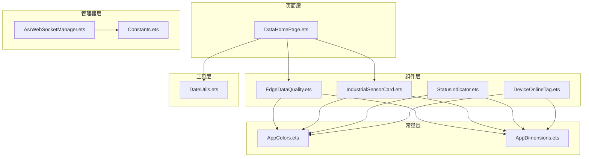
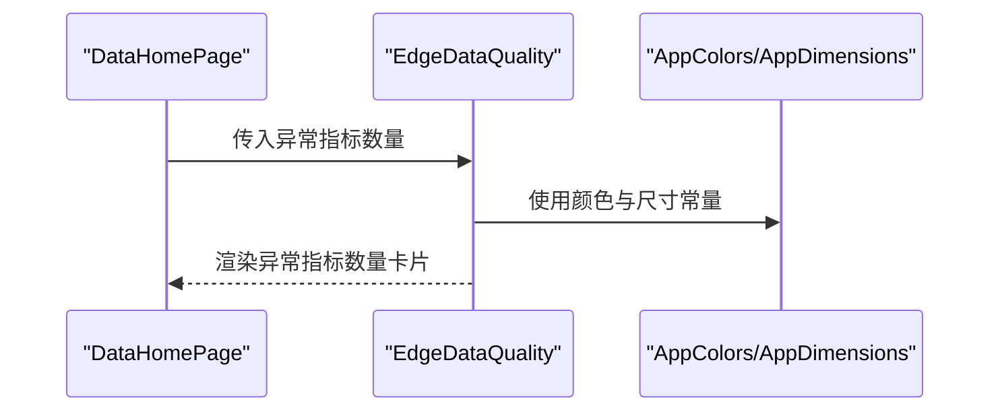
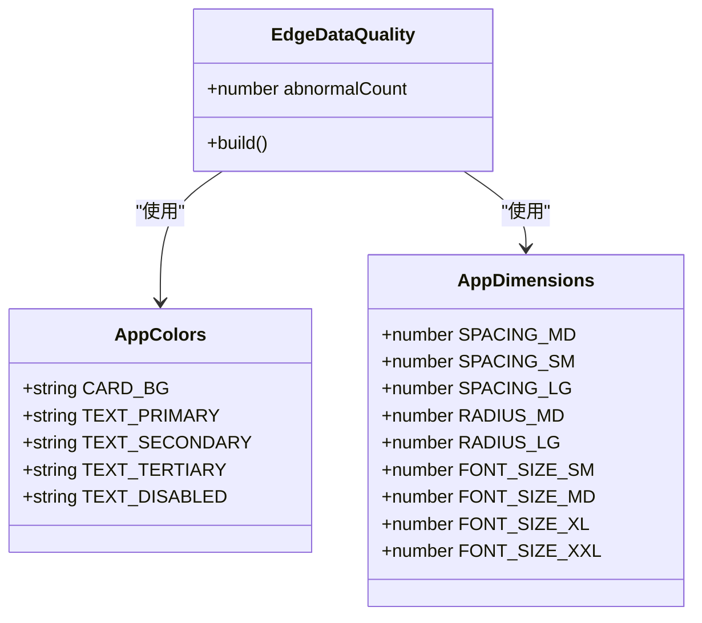
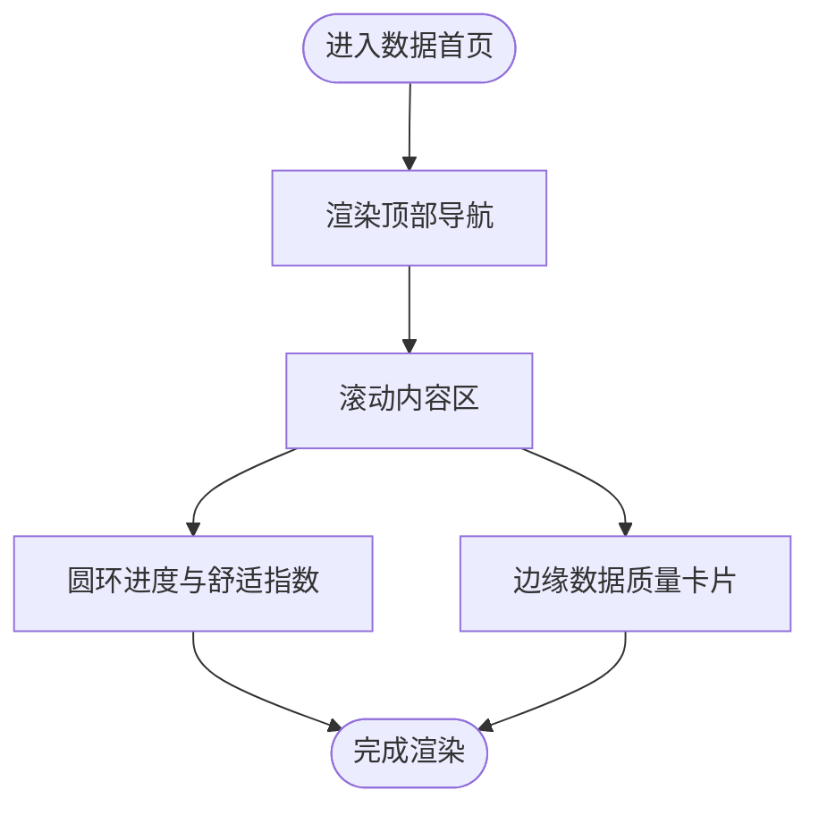
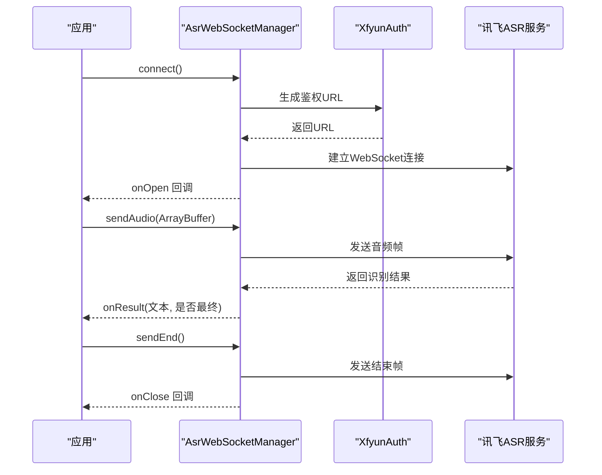
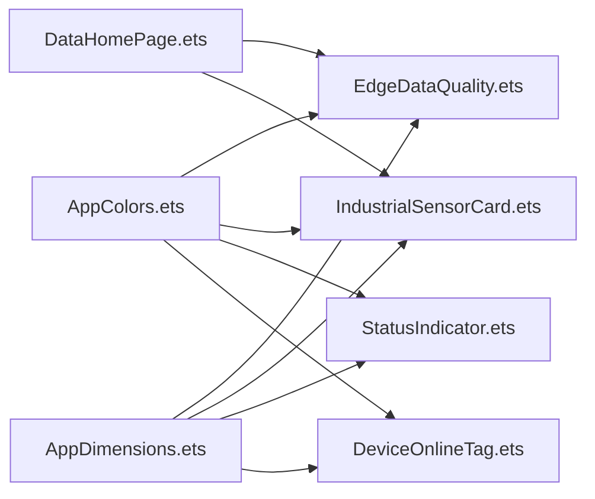

# 边缘数据质量

<cite>
**本文引用的文件**
- [EdgeDataQuality.ets](file://entry/src/main/ets/components/sensor/EdgeDataQuality.ets)
- [DataHomePage.ets](file://entry/src/main/ets/pages/DataHomePage.ets)
- [AppColors.ets](file://entry/src/main/ets/constants/AppColors.ets)
- [AppDimensions.ets](file://entry/src/main/ets/constants/AppDimensions.ets)
- [IndustrialSensorCard.ets](file://entry/src/main/ets/components/sensor/IndustrialSensorCard.ets)
- [StatusIndicator.ets](file://entry/src/main/ets/components/control/StatusIndicator.ets)
- [DeviceOnlineTag.ets](file://entry/src/main/ets/components/device/DeviceOnlineTag.ets)
- [DateUtils.ets](file://entry/src/main/ets/utils/DateUtils.ets)
- [AsrWebSocketManager.ets](file://entry/src/main/ets/managers/AsrWebSocketManager.ets)
- [Constants.ets](file://entry/src/main/ets/common/Constants.ets)
</cite>

## 目录
1. [简介](#简介)
2. [项目结构](#项目结构)
3. [核心组件](#核心组件)
4. [架构总览](#架构总览)
5. [详细组件分析](#详细组件分析)
6. [依赖关系分析](#依赖关系分析)
7. [性能考虑](#性能考虑)
8. [故障排查指南](#故障排查指南)
9. [结论](#结论)
10. [附录](#附录)

## 简介
本文件围绕“边缘数据质量”组件进行系统化技术文档整理，目标是帮助开发者快速理解并扩展该组件的数据质量评估、可视化展示、质量等级划分、实时监控与统计报表能力。当前仓库中“边缘数据质量”组件以异常指标数量为核心指标，采用简洁的卡片式界面进行展示；页面层通过圆环进度与舒适指数等元素进行综合可视化。本文将基于现有源码进行逐层解析，并给出可扩展的设计建议与最佳实践。

## 项目结构
本项目采用基于模块化的前端架构，页面、组件、常量与工具分层清晰。与“边缘数据质量”直接相关的结构如下：
- 页面层：数据首页负责承载“边缘数据质量”卡片与其他可视化元素
- 组件层：边缘数据质量卡片、工业传感器卡片、状态指示器、设备在线标签等
- 常量层：颜色与尺寸常量统一管理，保证视觉一致性
- 工具层：日期格式化工具，便于生成时间戳或报表头信息
- 管理器层：语音识别 WebSocket 管理器，体现边缘侧实时数据采集与传输能力

图表来源
- [DataHomePage.ets:11-61](file://entry/src/main/ets/pages/DataHomePage.ets#L11-L61)
- [EdgeDataQuality.ets:1-64](file://entry/src/main/ets/components/sensor/EdgeDataQuality.ets#L1-L64)
- [IndustrialSensorCard.ets:1-109](file://entry/src/main/ets/components/sensor/IndustrialSensorCard.ets#L1-L109)
- [StatusIndicator.ets:1-39](file://entry/src/main/ets/components/control/StatusIndicator.ets#L1-L39)
- [DeviceOnlineTag.ets:1-31](file://entry/src/main/ets/components/device/DeviceOnlineTag.ets#L1-L31)
- [AppColors.ets:1-47](file://entry/src/main/ets/constants/AppColors.ets#L1-L47)
- [AppDimensions.ets:1-40](file://entry/src/main/ets/constants/AppDimensions.ets#L1-L40)
- [DateUtils.ets:1-28](file://entry/src/main/ets/utils/DateUtils.ets#L1-L28)
- [AsrWebSocketManager.ets:1-271](file://entry/src/main/ets/managers/AsrWebSocketManager.ets#L1-L271)
- [Constants.ets:1-82](file://entry/src/main/ets/common/Constants.ets#L1-L82)

章节来源
- [DataHomePage.ets:1-61](file://entry/src/main/ets/pages/DataHomePage.ets#L1-L61)
- [EdgeDataQuality.ets:1-64](file://entry/src/main/ets/components/sensor/EdgeDataQuality.ets#L1-L64)

## 核心组件
- 边缘数据质量卡片：展示异常指标数量，采用深色卡片与对比色文字，突出关键数值
- 工业传感器卡片：展示多路传感器的实时数据，支持单位与数值分离显示
- 状态指示器：以圆点与文字组合展示开关状态，支持点击切换
- 设备在线标签：以圆点与文字展示设备在线/离线状态
- 页面容器：数据首页整合圆环进度、舒适指数与边缘数据质量卡片

章节来源
- [EdgeDataQuality.ets:10-62](file://entry/src/main/ets/components/sensor/EdgeDataQuality.ets#L10-L62)
- [IndustrialSensorCard.ets:20-109](file://entry/src/main/ets/components/sensor/IndustrialSensorCard.ets#L20-L109)
- [StatusIndicator.ets:5-39](file://entry/src/main/ets/components/control/StatusIndicator.ets#L5-L39)
- [DeviceOnlineTag.ets:8-31](file://entry/src/main/ets/components/device/DeviceOnlineTag.ets#L8-L31)
- [DataHomePage.ets:7-61](file://entry/src/main/ets/pages/DataHomePage.ets#L7-L61)

## 架构总览
边缘数据质量组件在页面层被组合使用，页面通过属性传递异常指标数量给卡片组件；卡片组件内部通过布局与样式常量实现统一的视觉风格。实时数据采集与传输由语音识别 WebSocket 管理器承担，体现边缘侧的实时性与网络交互能力。

图表来源
- [DataHomePage.ets:41-43](file://entry/src/main/ets/pages/DataHomePage.ets#L41-L43)
- [EdgeDataQuality.ets:13-62](file://entry/src/main/ets/components/sensor/EdgeDataQuality.ets#L13-L62)
- [AppColors.ets:5-47](file://entry/src/main/ets/constants/AppColors.ets#L5-L47)
- [AppDimensions.ets:5-40](file://entry/src/main/ets/constants/AppDimensions.ets#L5-L40)

## 详细组件分析

### 边缘数据质量卡片
- 功能定位：展示异常指标数量，作为边缘数据质量的单一指标
- 视觉设计：深色卡片背景、主次文字颜色、统一圆角与内边距
- 数据绑定：通过属性接收异常指标数量并在文本中渲染
- 可扩展性：当前仅展示数量，后续可扩展为“异常指标列表”“趋势图”“质量等级”等

图表来源
- [EdgeDataQuality.ets:8-62](file://entry/src/main/ets/components/sensor/EdgeDataQuality.ets#L8-L62)
- [AppColors.ets:5-47](file://entry/src/main/ets/constants/AppColors.ets#L5-L47)
- [AppDimensions.ets:5-40](file://entry/src/main/ets/constants/AppDimensions.ets#L5-L40)

章节来源
- [EdgeDataQuality.ets:1-64](file://entry/src/main/ets/components/sensor/EdgeDataQuality.ets#L1-L64)

### 数据首页集成
- 页面布局：顶部导航、滚动内容区、底部安全区域适配
- 圆环进度与舒适指数：以环形进度叠加中心数字与标签的方式展示综合指标
- 边缘数据质量卡片：通过属性传入异常指标数量，实现多指标并列展示

图表来源
- [DataHomePage.ets:11-61](file://entry/src/main/ets/pages/DataHomePage.ets#L11-L61)

章节来源
- [DataHomePage.ets:1-61](file://entry/src/main/ets/pages/DataHomePage.ets#L1-L61)

### 工业传感器卡片
- 数据结构：传感器名称、数值、单位三元组
- 列表渲染：支持空态提示与循环渲染
- 视觉风格：深色背景、浅色数值、单位弱化显示

章节来源
- [IndustrialSensorCard.ets:1-109](file://entry/src/main/ets/components/sensor/IndustrialSensorCard.ets#L1-L109)

### 状态指示器
- 交互行为：点击切换启用状态，圆点发光与阴影增强可读性
- 颜色策略：启用时使用彩色填充与阴影，禁用时使用灰色与低透明度

章节来源
- [StatusIndicator.ets:1-39](file://entry/src/main/ets/components/control/StatusIndicator.ets#L1-L39)

### 设备在线标签
- 状态表达：圆点颜色与文字颜色随在线状态变化
- 背景色：根据状态使用不同透明度背景

章节来源
- [DeviceOnlineTag.ets:1-31](file://entry/src/main/ets/components/device/DeviceOnlineTag.ets#L1-L31)

### 实时数据采集与传输（语音识别）
- WebSocket 连接：鉴权 URL 生成、连接建立、事件监听
- 帧协议：开始帧、音频帧、结束帧，遵循讯飞语音识别协议
- 结果处理：消息解析、乱序缓存、动态替换、最终结果触发断开

图表来源
- [AsrWebSocketManager.ets:92-144](file://entry/src/main/ets/managers/AsrWebSocketManager.ets#L92-L144)
- [AsrWebSocketManager.ets:146-195](file://entry/src/main/ets/managers/AsrWebSocketManager.ets#L146-L195)
- [AsrWebSocketManager.ets:197-254](file://entry/src/main/ets/managers/AsrWebSocketManager.ets#L197-L254)

章节来源
- [AsrWebSocketManager.ets:1-271](file://entry/src/main/ets/managers/AsrWebSocketManager.ets#L1-L271)
- [Constants.ets:4-14](file://entry/src/main/ets/common/Constants.ets#L4-L14)

## 依赖关系分析
- 组件依赖：边缘数据质量卡片依赖颜色与尺寸常量；页面依赖卡片组件
- 视觉一致性：通过统一常量管理颜色与尺寸，避免硬编码
- 业务耦合：页面与组件通过属性解耦，便于复用与测试

图表来源
- [AppColors.ets:5-47](file://entry/src/main/ets/constants/AppColors.ets#L5-L47)
- [AppDimensions.ets:5-40](file://entry/src/main/ets/constants/AppDimensions.ets#L5-L40)
- [EdgeDataQuality.ets:1-64](file://entry/src/main/ets/components/sensor/EdgeDataQuality.ets#L1-L64)
- [IndustrialSensorCard.ets:1-109](file://entry/src/main/ets/components/sensor/IndustrialSensorCard.ets#L1-L109)
- [StatusIndicator.ets:1-39](file://entry/src/main/ets/components/control/StatusIndicator.ets#L1-L39)
- [DeviceOnlineTag.ets:1-31](file://entry/src/main/ets/components/device/DeviceOnlineTag.ets#L1-L31)
- [DataHomePage.ets:1-61](file://entry/src/main/ets/pages/DataHomePage.ets#L1-L61)

章节来源
- [EdgeDataQuality.ets:1-64](file://entry/src/main/ets/components/sensor/EdgeDataQuality.ets#L1-L64)
- [DataHomePage.ets:1-61](file://entry/src/main/ets/pages/DataHomePage.ets#L1-L61)

## 性能考虑
- 渲染优化：组件内部使用统一尺寸与颜色常量，减少重复计算与样式切换
- 事件处理：WebSocket 管理器对消息解析与回调进行异步处理，避免阻塞主线程
- 内存管理：结果缓存数组按序列号索引，动态替换时清理无效索引，降低内存占用

章节来源
- [AsrWebSocketManager.ets:84-86](file://entry/src/main/ets/managers/AsrWebSocketManager.ets#L84-L86)
- [AsrWebSocketManager.ets:219-227](file://entry/src/main/ets/managers/AsrWebSocketManager.ets#L219-L227)

## 故障排查指南
- WebSocket 连接失败：检查鉴权 URL 生成与网络连通性，查看错误回调日志
- 消息解析异常：确认返回数据结构与协议版本，关注异常分支与日志输出
- 结果乱序：依赖缓存与序列号机制，确认缓存清理与拼接逻辑
- 页面返回行为：退出确认管理器用于处理返回键逻辑，避免误操作

章节来源
- [AsrWebSocketManager.ets:92-144](file://entry/src/main/ets/managers/AsrWebSocketManager.ets#L92-L144)
- [AsrWebSocketManager.ets:197-254](file://entry/src/main/ets/managers/AsrWebSocketManager.ets#L197-L254)
- [Constants.ets:19-82](file://entry/src/main/ets/common/Constants.ets#L19-L82)

## 结论
当前“边缘数据质量”组件以异常指标数量为核心指标，结合页面层的圆环进度与舒适指数，形成多维度的可视化展示。组件间通过常量与属性解耦，具备良好的可维护性与扩展性。建议后续在以下方面进行增强：引入更丰富的质量指标、完善质量等级划分与阈值配置、增加实时采样与异常检测机制、提供统计报表与质量改进建议功能。

## 附录

### 质量指标与阈值建议（扩展设计）
- 指标体系
  - 异常指标数量：当前实现
  - 数据完整性率：缺失值比例
  - 数据时效性：最大延迟与超时比例
  - 数据一致性：跨通道/跨设备一致性校验
  - 传输可靠性：丢包率、抖动、重传次数
- 阈值与等级
  - 优秀：异常指标数量为 0，完整性≥99%，延迟≤1s，一致性≥99%
  - 良好：异常指标数量≤1，完整性≥95%，延迟≤3s，一致性≥95%
  - 一般：异常指标数量≤3，完整性≥90%，延迟≤5s，一致性≥90%
  - 较差：异常指标数量>3 或 完整性<90% 或 延迟>5s 或 一致性<90%

### 可视化扩展建议
- 颜色编码：基于等级使用绿色/蓝色/橙色/红色渐变
- 进度条：以环形或条形进度展示综合质量得分
- 状态图标：异常类型分类图标（如网络、设备、协议）
- 实时更新：定时刷新与事件驱动更新相结合

### 实时监控与异常检测
- 采样频率：建议每 1–10 秒采样一次，依据业务需求调整
- 更新机制：采用增量更新与全量刷新结合，降低卡顿
- 异常检测：滑动窗口统计、阈值报警、趋势预测

### 统计与报表
- 报表维度：按天/周/月汇总异常指标数量与类型分布
- 导出能力：支持 CSV/Excel 导出，便于归档与分析
- 告警通知：阈值越界时推送通知与邮件

### 自定义评估与可视化指南
- 评估算法：在页面层或管理器层新增质量评估函数，输入原始数据与阈值，输出质量等级与指标明细
- 可视化：在卡片组件中新增等级徽章、趋势折线图、异常类型饼图等
- 配置化：将阈值与颜色映射放入配置文件，支持运行时调整