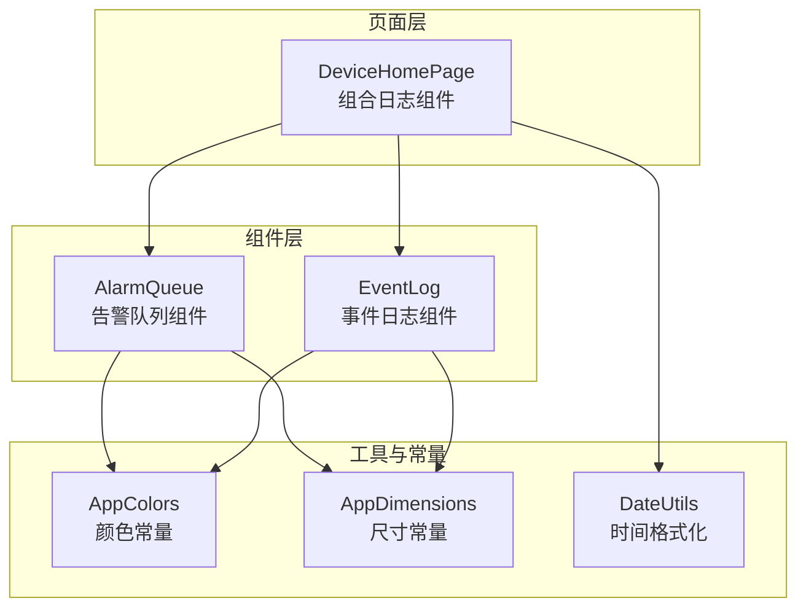
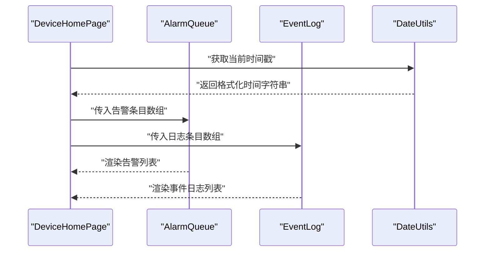
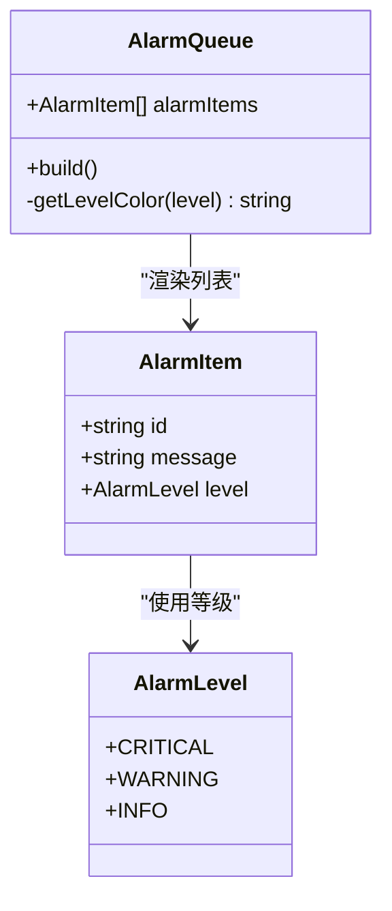
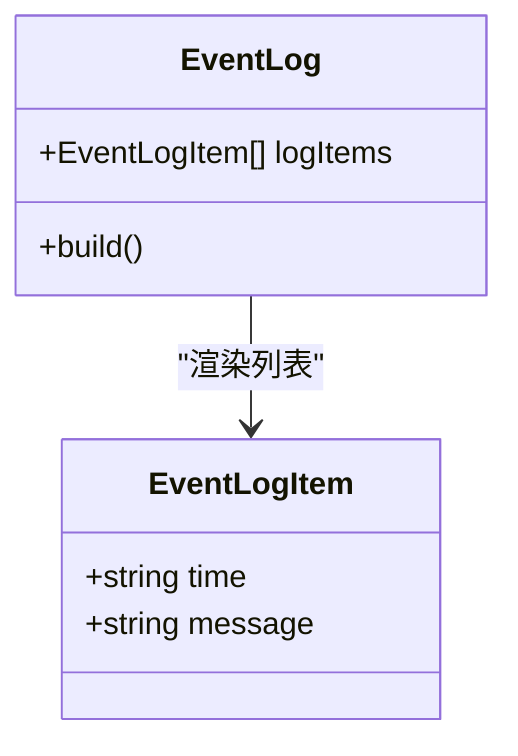
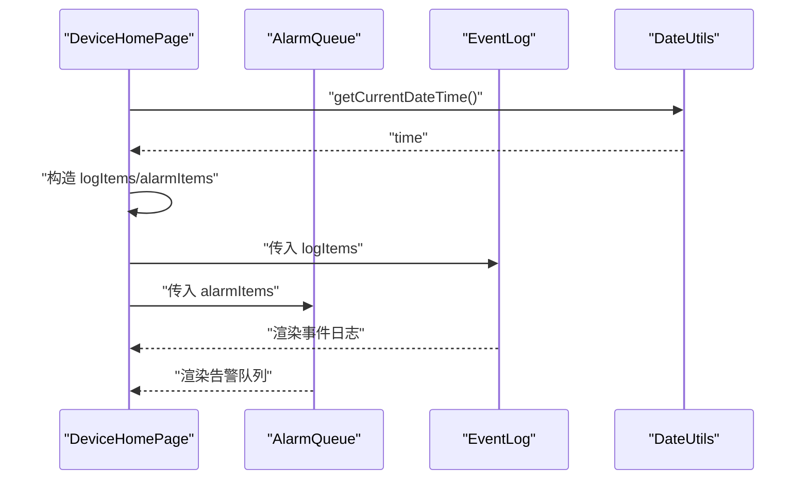
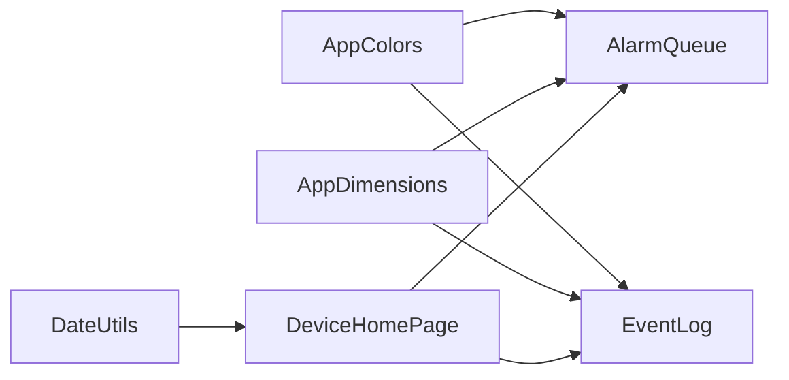

# 日志组件

<cite>
**本文引用的文件**
- [AlarmQueue.ets](file://entry/src/main/ets/components/log/AlarmQueue.ets)
- [EventLog.ets](file://entry/src/main/ets/components/log/EventLog.ets)
- [AppColors.ets](file://entry/src/main/ets/constants/AppColors.ets)
- [AppDimensions.ets](file://entry/src/main/ets/constants/AppDimensions.ets)
- [DateUtils.ets](file://entry/src/main/ets/utils/DateUtils.ets)
- [DeviceHomePage.ets](file://entry/src/main/ets/pages/DeviceHomePage.ets)
- [network_connect.ets](file://entry/src/main/ets/pages/network_connect.ets)
- [string.json](file://AppScope/resources/base/element/string.json)
</cite>

## 目录
1. [简介](#简介)
2. [项目结构](#项目结构)
3. [核心组件](#核心组件)
4. [架构总览](#架构总览)
5. [详细组件分析](#详细组件分析)
6. [依赖关系分析](#依赖关系分析)
7. [性能考量](#性能考量)
8. [故障排查指南](#故障排查指南)
9. [结论](#结论)
10. [附录](#附录)

## 简介
本文件面向开发者与产品人员，系统化梳理日志组件的设计与实现，重点覆盖以下方面：
- 告警队列组件：告警消息的数据结构、展示样式与优先级边界（颜色）映射。
- 事件日志组件：日志条目的格式、渲染与空态处理。
- 数据持久化策略：当前实现采用内存数组，建议的本地存储与清理方案。
- 用户交互设计：列表滚动、空态提示、条目样式与边框强调。
- 导出与分享：当前未实现，建议的扩展路径。
- 可访问性与国际化：当前未实现，建议的扩展路径。
- 扩展与自定义：如何在现有组件基础上扩展字段、过滤与排序。

## 项目结构
日志组件位于入口模块的组件目录下，分别提供“告警队列”和“事件日志”两个独立组件，并通过页面进行组合使用。组件样式统一使用常量文件中的颜色与尺寸，时间戳格式化使用工具类。

图表来源
- [DeviceHomePage.ets:12-73](file://entry/src/main/ets/pages/DeviceHomePage.ets#L12-L73)
- [AlarmQueue.ets:1-105](file://entry/src/main/ets/components/log/AlarmQueue.ets#L1-L105)
- [EventLog.ets:1-78](file://entry/src/main/ets/components/log/EventLog.ets#L1-L78)
- [AppColors.ets:1-47](file://entry/src/main/ets/constants/AppColors.ets#L1-L47)
- [AppDimensions.ets:1-40](file://entry/src/main/ets/constants/AppDimensions.ets#L1-L40)
- [DateUtils.ets:1-28](file://entry/src/main/ets/utils/DateUtils.ets#L1-L28)

章节来源
- [DeviceHomePage.ets:12-73](file://entry/src/main/ets/pages/DeviceHomePage.ets#L12-L73)
- [AlarmQueue.ets:1-105](file://entry/src/main/ets/components/log/AlarmQueue.ets#L1-L105)
- [EventLog.ets:1-78](file://entry/src/main/ets/components/log/EventLog.ets#L1-L78)
- [AppColors.ets:1-47](file://entry/src/main/ets/constants/AppColors.ets#L1-L47)
- [AppDimensions.ets:1-40](file://entry/src/main/ets/constants/AppDimensions.ets#L1-L40)
- [DateUtils.ets:1-28](file://entry/src/main/ets/utils/DateUtils.ets#L1-L28)

## 核心组件
- 告警队列组件（AlarmQueue）
  - 数据结构：包含唯一 ID、告警消息文本、告警等级（严重、警告、提示）。
  - 渲染：以列表形式展示，左侧按等级绘制彩色细边框，条目背景与圆角统一。
  - 空态：当列表为空时显示“暂无告警”的提示文本。
  - 样式：使用 AppColors 与 AppDimensions 中的颜色与尺寸常量。
- 事件日志组件（EventLog）
  - 数据结构：包含时间戳字符串与事件消息文本。
  - 渲染：以列表形式展示，每条目以“[时间] 内容”的格式呈现。
  - 空态：当列表为空时显示“暂无事件日志”的提示文本。
  - 样式：使用 AppColors 与 AppDimensions 中的颜色与尺寸常量。

章节来源
- [AlarmQueue.ets:7-26](file://entry/src/main/ets/components/log/AlarmQueue.ets#L7-L26)
- [AlarmQueue.ets:32-105](file://entry/src/main/ets/components/log/AlarmQueue.ets#L32-L105)
- [EventLog.ets:7-12](file://entry/src/main/ets/components/log/EventLog.ets#L7-L12)
- [EventLog.ets:18-78](file://entry/src/main/ets/components/log/EventLog.ets#L18-L78)
- [AppColors.ets:1-47](file://entry/src/main/ets/constants/AppColors.ets#L1-L47)
- [AppDimensions.ets:1-40](file://entry/src/main/ets/constants/AppDimensions.ets#L1-L40)

## 架构总览
日志组件在页面中被组合使用，页面负责提供初始数据与时间戳生成，组件仅负责展示。当前未实现持久化与搜索过滤功能，后续可通过注入服务或外部状态管理扩展。

图表来源
- [DeviceHomePage.ets:16-24](file://entry/src/main/ets/pages/DeviceHomePage.ets#L16-L24)
- [AlarmQueue.ets:32-105](file://entry/src/main/ets/components/log/AlarmQueue.ets#L32-L105)
- [EventLog.ets:18-78](file://entry/src/main/ets/components/log/EventLog.ets#L18-L78)
- [DateUtils.ets:25-27](file://entry/src/main/ets/utils/DateUtils.ets#L25-L27)

章节来源
- [DeviceHomePage.ets:12-73](file://entry/src/main/ets/pages/DeviceHomePage.ets#L12-L73)
- [DateUtils.ets:1-28](file://entry/src/main/ets/utils/DateUtils.ets#L1-L28)

## 详细组件分析

### 告警队列组件（AlarmQueue）
- 数据模型
  - 唯一 ID：用于列表渲染的稳定键。
  - 消息文本：描述具体告警内容。
  - 告警等级：严重、警告、提示三档，决定左侧边框颜色。
- 渲染逻辑
  - 列表为空时显示居中提示文本。
  - 条目采用统一背景色、圆角与内边距，左侧以固定宽度边框强调等级。
  - 标题行包含主标题与副标题，字号与颜色来自常量。
- 样式与主题
  - 使用 AppColors 的状态色（严重、警告、信息）映射等级。
  - 使用 AppDimensions 的字号、间距与圆角常量统一风格。

图表来源
- [AlarmQueue.ets:7-26](file://entry/src/main/ets/components/log/AlarmQueue.ets#L7-L26)
- [AlarmQueue.ets:32-105](file://entry/src/main/ets/components/log/AlarmQueue.ets#L32-L105)

章节来源
- [AlarmQueue.ets:1-105](file://entry/src/main/ets/components/log/AlarmQueue.ets#L1-L105)
- [AppColors.ets:20-24](file://entry/src/main/ets/constants/AppColors.ets#L20-L24)
- [AppDimensions.ets:21-27](file://entry/src/main/ets/constants/AppDimensions.ets#L21-L27)

### 事件日志组件（EventLog）
- 数据模型
  - 时间戳字符串：采用“HH:mm:ss”或更宽格式，由外部提供。
  - 消息文本：事件描述。
- 渲染逻辑
  - 列表为空时显示居中提示文本。
  - 条目以“[时间] 内容”的格式拼接展示。
  - 统一样式：背景、圆角、内边距与左侧强调色。
- 交互与可用性
  - 当前未实现滚动区域的交互细节，建议在长列表场景下启用滚动与虚拟化。

图表来源
- [EventLog.ets:7-12](file://entry/src/main/ets/components/log/EventLog.ets#L7-L12)
- [EventLog.ets:18-78](file://entry/src/main/ets/components/log/EventLog.ets#L18-L78)

章节来源
- [EventLog.ets:1-78](file://entry/src/main/ets/components/log/EventLog.ets#L1-L78)
- [AppColors.ets:13-18](file://entry/src/main/ets/constants/AppColors.ets#L13-L18)
- [AppDimensions.ets:6-12](file://entry/src/main/ets/constants/AppDimensions.ets#L6-L12)

### 页面集成与数据流
- 页面职责
  - 初始化日志数据与告警数据。
  - 通过 DateUtils 生成时间戳。
  - 将数据传递给组件进行渲染。
- 组件职责
  - 专注展示，不参与数据生成与持久化。
- 滚动与布局
  - 页面使用 Scroll 容器包裹内容，支持滚动与边缘效果。

图表来源
- [DeviceHomePage.ets:16-24](file://entry/src/main/ets/pages/DeviceHomePage.ets#L16-L24)
- [DeviceHomePage.ets:49-54](file://entry/src/main/ets/pages/DeviceHomePage.ets#L49-L54)
- [DateUtils.ets:25-27](file://entry/src/main/ets/utils/DateUtils.ets#L25-L27)

章节来源
- [DeviceHomePage.ets:12-73](file://entry/src/main/ets/pages/DeviceHomePage.ets#L12-L73)
- [DateUtils.ets:1-28](file://entry/src/main/ets/utils/DateUtils.ets#L1-L28)

## 依赖关系分析
- 组件对常量的依赖
  - AlarmQueue 与 EventLog 均依赖 AppColors 与 AppDimensions，确保视觉一致性。
- 组件对工具的依赖
  - 页面依赖 DateUtils 生成时间戳，组件本身不直接依赖。
- 组件间耦合
  - 组件彼此独立，通过页面组合使用，低耦合、高内聚。

图表来源
- [AlarmQueue.ets:1-3](file://entry/src/main/ets/components/log/AlarmQueue.ets#L1-L3)
- [EventLog.ets:1-3](file://entry/src/main/ets/components/log/EventLog.ets#L1-L3)
- [AppColors.ets:1-47](file://entry/src/main/ets/constants/AppColors.ets#L1-L47)
- [AppDimensions.ets:1-40](file://entry/src/main/ets/constants/AppDimensions.ets#L1-L40)
- [DateUtils.ets:1-28](file://entry/src/main/ets/utils/DateUtils.ets#L1-L28)
- [DeviceHomePage.ets:1-11](file://entry/src/main/ets/pages/DeviceHomePage.ets#L1-L11)

章节来源
- [AlarmQueue.ets:1-105](file://entry/src/main/ets/components/log/AlarmQueue.ets#L1-L105)
- [EventLog.ets:1-78](file://entry/src/main/ets/components/log/EventLog.ets#L1-L78)
- [AppColors.ets:1-47](file://entry/src/main/ets/constants/AppColors.ets#L1-L47)
- [AppDimensions.ets:1-40](file://entry/src/main/ets/constants/AppDimensions.ets#L1-L40)
- [DateUtils.ets:1-28](file://entry/src/main/ets/utils/DateUtils.ets#L1-L28)
- [DeviceHomePage.ets:1-11](file://entry/src/main/ets/pages/DeviceHomePage.ets#L1-L11)

## 性能考量
- 列表渲染
  - 当前使用 ForEach 渲染，建议在大量数据场景下考虑分页或虚拟列表以降低重排成本。
- 样式计算
  - 边框颜色通过 getLevelColor 计算，复杂度低；可在组件内部缓存颜色映射以减少重复计算。
- 滚动体验
  - 页面已启用滚动与边缘效果，建议在长列表场景下限制单次渲染条目数量，提升首屏与滚动流畅度。
- 时间戳生成
  - 页面侧集中生成时间戳，组件不参与计算，避免在渲染过程中产生额外开销。

章节来源
- [AlarmQueue.ets:32-105](file://entry/src/main/ets/components/log/AlarmQueue.ets#L32-L105)
- [EventLog.ets:18-78](file://entry/src/main/ets/components/log/EventLog.ets#L18-L78)
- [DeviceHomePage.ets:33-59](file://entry/src/main/ets/pages/DeviceHomePage.ets#L33-L59)

## 故障排查指南
- 列表为空
  - 确认页面是否正确初始化了 logItems 与 alarmItems。
  - 检查时间戳生成逻辑是否正常返回格式化字符串。
- 样式异常
  - 检查 AppColors 与 AppDimensions 常量是否正确导入且未被覆盖。
  - 确认组件构建时的 padding、borderRadius、backgroundColor 设置是否生效。
- 滚动问题
  - 确认 Scroll 容器的 layoutWeight 与宽度设置是否合理。
  - 若出现滚动卡顿，考虑减少一次性渲染的条目数量或引入虚拟化。

章节来源
- [DeviceHomePage.ets:16-24](file://entry/src/main/ets/pages/DeviceHomePage.ets#L16-L24)
- [AlarmQueue.ets:69-76](file://entry/src/main/ets/components/log/AlarmQueue.ets#L69-L76)
- [EventLog.ets:42-49](file://entry/src/main/ets/components/log/EventLog.ets#L42-L49)
- [AppColors.ets:1-47](file://entry/src/main/ets/constants/AppColors.ets#L1-L47)
- [AppDimensions.ets:1-40](file://entry/src/main/ets/constants/AppDimensions.ets#L1-L40)

## 结论
日志组件当前实现了清晰的数据模型与稳定的渲染流程，具备良好的可维护性与扩展性。建议下一步完善数据持久化、搜索过滤、导出分享与国际化等能力，以满足工业场景下的长期使用需求。

## 附录

### 数据持久化策略（建议）
- 本地存储
  - 使用本地数据库或文件存储历史日志与告警，结合分页加载与索引优化查询。
- 清理机制
  - 基于时间窗口（如保留最近7天）或容量上限（如最多1万条）进行定期清理。
- 性能优化
  - 引入增量写入、批量提交与压缩存储，减少 I/O 压力。
  - 对常用查询建立索引，避免全表扫描。

### 日志记录机制（建议）
- 日志格式
  - 统一包含时间戳、级别（严重/警告/提示/信息）、来源模块、消息正文与上下文 ID。
- 过滤条件
  - 支持按时间范围、级别、来源模块与关键词过滤。
- 搜索功能
  - 提供全文检索与高级筛选面板，支持结果高亮与快速定位。

### 用户交互设计（建议）
- 列表滚动
  - 长列表启用虚拟滚动，支持跳转至最新条目与一键清空。
- 详情查看
  - 点击条目展开详情面板，展示完整上下文与关联信息。
- 批量操作
  - 支持多选、批量删除、导出与标记为已读。

### 导出与分享（建议）
- 导出
  - 支持 CSV/JSON 格式导出，允许选择时间范围与字段。
- 分享
  - 提供复制链接、邮件分享与截图分享能力。

### 可访问性与国际化（建议）
- 可访问性
  - 为列表项提供语义化标签与键盘导航支持；为颜色对比度不足的场景提供替代提示。
- 国际化
  - 将静态文案抽取至资源文件，支持多语言切换；时间格式根据地区设置动态调整。

### 扩展与自定义指南
- 扩展字段
  - 在数据模型中新增字段（如来源模块、设备 ID），并在组件中渲染对应 UI。
- 自定义样式
  - 通过主题变量或样式参数化组件外观，避免硬编码颜色与尺寸。
- 自定义行为
  - 为条目添加点击回调、右键菜单与快捷操作，提升交互效率。