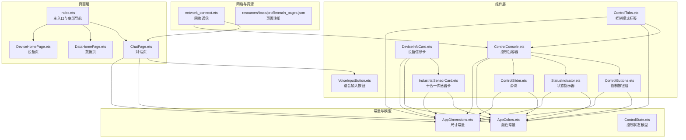
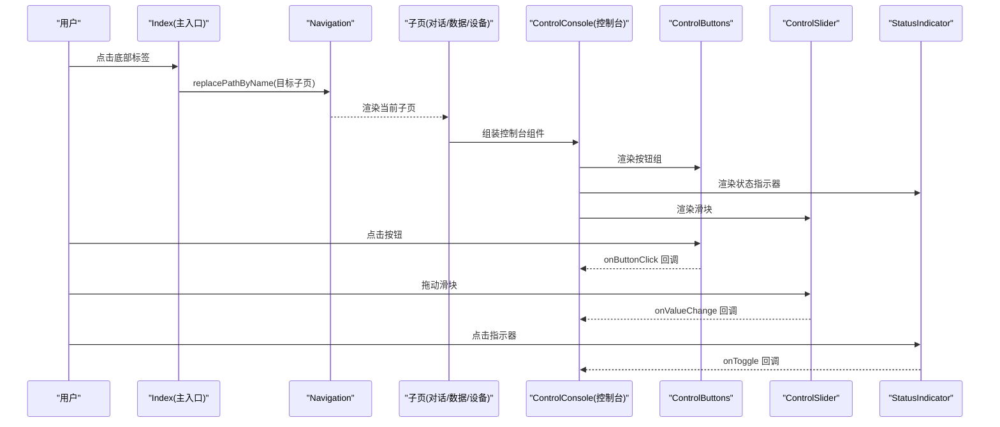
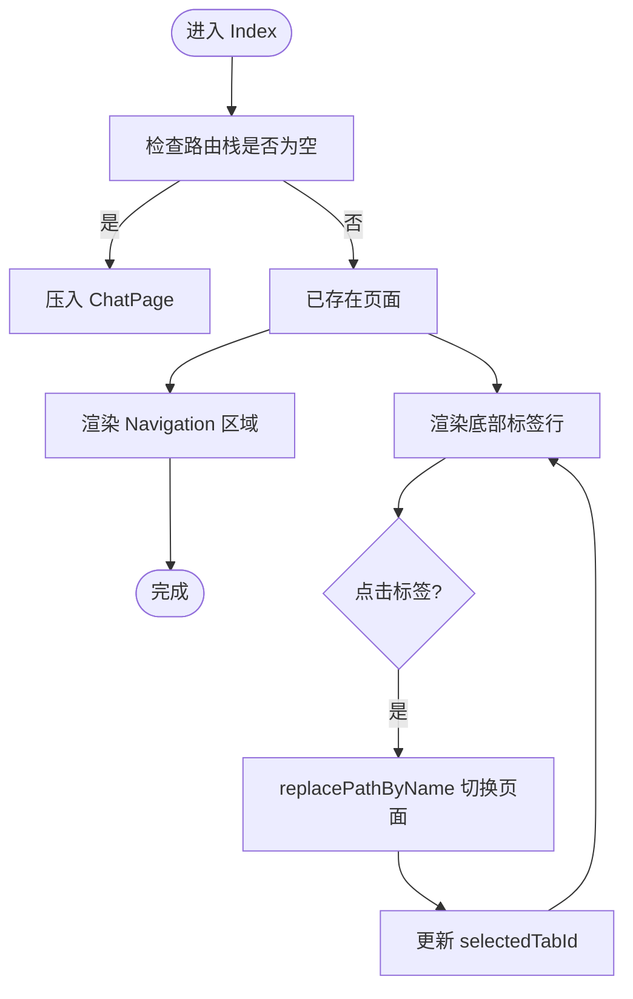
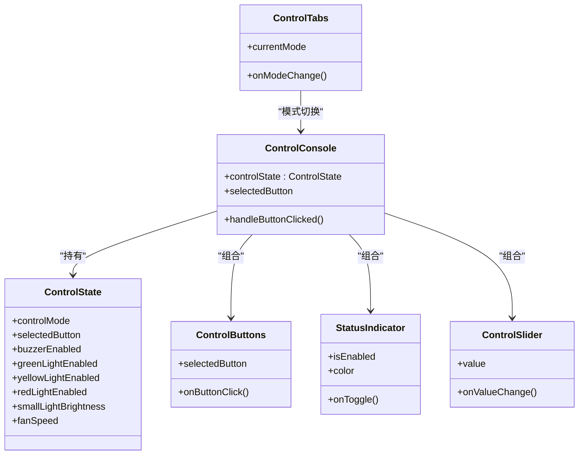
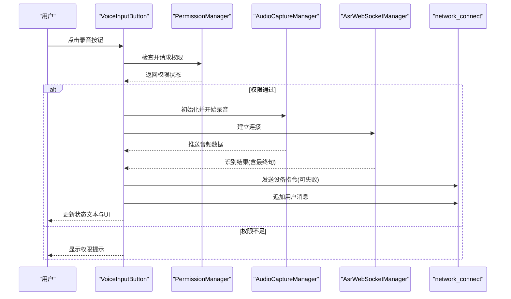
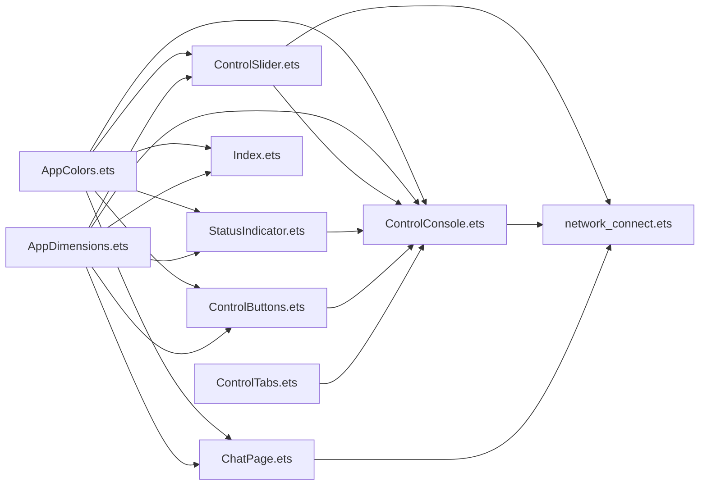

# 界面组件系统

<cite>
**本文引用的文件**
- [Index.ets](file://entry/src/main/ets/pages/Index.ets)
- [ControlTabs.ets](file://entry/src/main/ets/components/control/ControlTabs.ets)
- [ControlConsole.ets](file://entry/src/main/ets/components/control/ControlConsole.ets)
- [ControlButtons.ets](file://entry/src/main/ets/components/control/ControlButtons.ets)
- [ControlSlider.ets](file://entry/src/main/ets/components/control/ControlSlider.ets)
- [StatusIndicator.ets](file://entry/src/main/ets/components/control/StatusIndicator.ets)
- [AppColors.ets](file://entry/src/main/ets/constants/AppColors.ets)
- [AppDimensions.ets](file://entry/src/main/ets/constants/AppDimensions.ets)
- [ControlState.ets](file://entry/src/main/ets/models/ControlState.ets)
- [ChatPage.ets](file://entry/src/main/ets/pages/ChatPage.ets)
- [VoiceInputButton.ets](file://entry/src/main/ets/components/chat/VoiceInputButton.ets)
- [DeviceInfoCard.ets](file://entry/src/main/ets/components/device/DeviceInfoCard.ets)
- [IndustrialSensorCard.ets](file://entry/src/main/ets/components/sensor/IndustrialSensorCard.ets)
- [network_connect.ets](file://entry/src/main/ets/pages/get_data.ets)
- [app.json5](file://AppScope/app.json5)
</cite>

## 目录
1. [简介](#简介)
2. [项目结构](#项目结构)
3. [核心组件](#核心组件)
4. [架构总览](#架构总览)
5. [详细组件分析](#详细组件分析)
6. [依赖关系分析](#依赖关系分析)
7. [性能考量](#性能考量)
8. [故障排查指南](#故障排查指南)
9. [结论](#结论)
10. [附录](#附录)

## 简介
本文件系统化梳理界面组件体系，覆盖主界面导航、底部标签页布局与切换、页面动画与状态管理；阐述响应式布局原则（尺寸单位、屏幕适配、视觉一致性）；详解各 UI 组件的属性、事件与样式定制；总结组件复用与组合最佳实践（props 设计、事件传递、状态共享）；说明主题与颜色管理；给出无障碍与兼容性建议；并提供自定义组件开发指导与设计规范。

## 项目结构
项目采用按功能域分层组织：页面层（pages）、组件层（components）、常量层（constants）、模型层（models）、工具与资源（utils/resources）。主入口通过底部导航承载三大子页，子页内嵌业务组件，形成清晰的职责边界与可复用性。

图表来源
- [Index.ets:13-115](file://entry/src/main/ets/pages/Index.ets#L13-L115)
- [ControlConsole.ets:13-172](file://entry/src/main/ets/components/control/ControlConsole.ets#L13-L172)
- [ControlButtons.ets:10-48](file://entry/src/main/ets/components/control/ControlButtons.ets#L10-L48)
- [ControlSlider.ets:8-56](file://entry/src/main/ets/components/control/ControlSlider.ets#L8-L56)
- [StatusIndicator.ets:8-44](file://entry/src/main/ets/components/control/StatusIndicator.ets#L8-L44)
- [ControlTabs.ets:9-41](file://entry/src/main/ets/components/control/ControlTabs.ets#L9-L41)
- [ChatPage.ets:7-76](file://entry/src/main/ets/pages/ChatPage.ets#L7-L76)
- [VoiceInputButton.ets:8-125](file://entry/src/main/ets/components/chat/VoiceInputButton.ets#L8-L125)
- [DeviceInfoCard.ets:9-59](file://entry/src/main/ets/components/device/DeviceInfoCard.ets#L9-L59)
- [IndustrialSensorCard.ets:20-109](file://entry/src/main/ets/components/sensor/IndustrialSensorCard.ets#L20-L109)
- [AppColors.ets:5-47](file://entry/src/main/ets/constants/AppColors.ets#L5-L47)
- [AppDimensions.ets:5-40](file://entry/src/main/ets/constants/AppDimensions.ets#L5-L40)
- [ControlState.ets:28-67](file://entry/src/main/ets/models/ControlState.ets#L28-L67)
- [network_connect.ets](file://entry/src/main/ets/pages/get_data.ets)

章节来源
- [Index.ets:13-115](file://entry/src/main/ets/pages/Index.ets#L13-L115)
- [AppColors.ets:5-47](file://entry/src/main/ets/constants/AppColors.ets#L5-L47)
- [AppDimensions.ets:5-40](file://entry/src/main/ets/constants/AppDimensions.ets#L5-L40)

## 核心组件
- 主入口与底部导航：Index 提供底部三栏（对话/数据/设备），使用 Navigation 管理子页栈，支持点击切换与首屏默认打开。
- 控制台组件族：ControlConsole 作为容器整合 ControlButtons、StatusIndicator、ControlSlider，并通过 ControlTabs 切换控制模式。
- 页面级组件：ChatPage 展示消息列表与语音输入区域；设备与传感器卡片组件提供信息展示与交互。
- 常量与模型：AppColors/AppDimensions 统一颜色与尺寸；ControlState 管理控制态。

章节来源
- [Index.ets:13-115](file://entry/src/main/ets/pages/Index.ets#L13-L115)
- [ControlConsole.ets:13-172](file://entry/src/main/ets/components/control/ControlConsole.ets#L13-L172)
- [ControlTabs.ets:9-41](file://entry/src/main/ets/components/control/ControlTabs.ets#L9-L41)
- [ControlButtons.ets:10-48](file://entry/src/main/ets/components/control/ControlButtons.ets#L10-L48)
- [ControlSlider.ets:8-56](file://entry/src/main/ets/components/control/ControlSlider.ets#L8-L56)
- [StatusIndicator.ets:8-44](file://entry/src/main/ets/components/control/StatusIndicator.ets#L8-L44)
- [ChatPage.ets:7-76](file://entry/src/main/ets/pages/ChatPage.ets#L7-L76)
- [DeviceInfoCard.ets:9-59](file://entry/src/main/ets/components/device/DeviceInfoCard.ets#L9-L59)
- [IndustrialSensorCard.ets:20-109](file://entry/src/main/ets/components/sensor/IndustrialSensorCard.ets#L20-L109)
- [AppColors.ets:5-47](file://entry/src/main/ets/constants/AppColors.ets#L5-L47)
- [AppDimensions.ets:5-40](file://entry/src/main/ets/constants/AppDimensions.ets#L5-L40)
- [ControlState.ets:28-67](file://entry/src/main/ets/models/ControlState.ets#L28-L67)

## 架构总览
下图展示主入口、导航与子页的关系，以及控制台组件族在页面内的装配方式。

图表来源
- [Index.ets:35-48](file://entry/src/main/ets/pages/Index.ets#L35-L48)
- [ControlConsole.ets:41-151](file://entry/src/main/ets/components/control/ControlConsole.ets#L41-L151)
- [ControlButtons.ets:27-47](file://entry/src/main/ets/components/control/ControlButtons.ets#L27-L47)
- [ControlSlider.ets:39-43](file://entry/src/main/ets/components/control/ControlSlider.ets#L39-L43)
- [StatusIndicator.ets:38-42](file://entry/src/main/ets/components/control/StatusIndicator.ets#L38-L42)

## 详细组件分析

### 主界面导航与底部标签页
- 布局与行为
  - 使用 Column 容器，顶部为 Navigation 区域，占满剩余空间；底部为固定行，每项等宽分布。
  - 通过 NavPathStack 维护路由栈，首次进入自动压入“对话页”。
  - 底部标签点击触发 replacePathByName，保持栈深度为1，仅替换当前页。
- 样式与主题
  - 选中态高亮：图标与文字使用金色，未选中灰色；卡片背景与整体背景采用深色系。
  - 间距与圆角：统一使用 AppDimensions 的 SPACING 和 RADIUS 常量。
- 动画与过渡
  - 代码中未显式声明页面切换动画；当前为直接替换。如需动画，可在 Navigation 或页面级容器上引入过渡效果。

图表来源
- [Index.ets:28-48](file://entry/src/main/ets/pages/Index.ets#L28-L48)
- [Index.ets:78-104](file://entry/src/main/ets/pages/Index.ets#L78-L104)

章节来源
- [Index.ets:13-115](file://entry/src/main/ets/pages/Index.ets#L13-L115)
- [AppColors.ets:6-11](file://entry/src/main/ets/constants/AppColors.ets#L6-L11)
- [AppDimensions.ets:7-12](file://entry/src/main/ets/constants/AppDimensions.ets#L7-L12)

### 控制台组件族
- ControlConsole
  - 角色：控制台主容器，聚合按钮、指示器、滑块，负责状态同步与事件透传。
  - 关键点：独立 selectedButton 状态与 ControlState 同步，onStateChange 回调通知外部。
- ControlButtons
  - 单选按钮组，根据 selectedButton 决定高亮与边框颜色。
- StatusIndicator
  - 点击切换状态，支持自定义颜色与回调。
- ControlSlider
  - 数值范围 0-100，右侧显示百分比，支持 onChange 回调。
- ControlTabs
  - 切换控制模式（场景/开关/模拟量），点击回调 onModeChange。

图表来源
- [ControlState.ets:28-67](file://entry/src/main/ets/models/ControlState.ets#L28-L67)
- [ControlConsole.ets:14-25](file://entry/src/main/ets/components/control/ControlConsole.ets#L14-L25)
- [ControlButtons.ets:11-15](file://entry/src/main/ets/components/control/ControlButtons.ets#L11-L15)
- [StatusIndicator.ets:9-17](file://entry/src/main/ets/components/control/StatusIndicator.ets#L9-L17)
- [ControlSlider.ets:9-15](file://entry/src/main/ets/components/control/ControlSlider.ets#L9-L15)
- [ControlTabs.ets:10-14](file://entry/src/main/ets/components/control/ControlTabs.ets#L10-L14)

章节来源
- [ControlConsole.ets:13-172](file://entry/src/main/ets/components/control/ControlConsole.ets#L13-L172)
- [ControlButtons.ets:10-48](file://entry/src/main/ets/components/control/ControlButtons.ets#L10-L48)
- [StatusIndicator.ets:8-44](file://entry/src/main/ets/components/control/StatusIndicator.ets#L8-L44)
- [ControlSlider.ets:8-56](file://entry/src/main/ets/components/control/ControlSlider.ets#L8-L56)
- [ControlTabs.ets:9-41](file://entry/src/main/ets/components/control/ControlTabs.ets#L9-L41)

### 对话页与语音输入
- 对话页
  - 顶部标题栏，中部消息列表（List），底部语音输入区。
  - 消息气泡区分用户与服务端，分别靠右/靠左布局，支持最大宽度约束。
- 语音输入按钮
  - 权限检查与申请，初始化音频采集与 ASR 连接。
  - 录音状态切换、结果回调、错误处理与资源释放。
  - 识别完成后向网络模块发送指令并追加用户消息。

图表来源
- [VoiceInputButton.ets:18-89](file://entry/src/main/ets/components/chat/VoiceInputButton.ets#L18-L89)
- [VoiceInputButton.ets:91-124](file://entry/src/main/ets/components/chat/VoiceInputButton.ets#L91-L124)
- [ChatPage.ets:11-76](file://entry/src/main/ets/pages/ChatPage.ets#L11-L76)

章节来源
- [ChatPage.ets:7-76](file://entry/src/main/ets/pages/ChatPage.ets#L7-L76)
- [VoiceInputButton.ets:8-125](file://entry/src/main/ets/components/chat/VoiceInputButton.ets#L8-L125)

### 设备与传感器卡片
- 设备信息卡片
  - 左侧设备名与在线标签，右侧更新时间；支持设备图片占位。
- 十合一传感器卡片
  - 标题行 + 数据行列表；每行展示名称、数值与单位，采用对比色与圆角背景提升可读性。

章节来源
- [DeviceInfoCard.ets:9-59](file://entry/src/main/ets/components/device/DeviceInfoCard.ets#L9-L59)
- [IndustrialSensorCard.ets:20-109](file://entry/src/main/ets/components/sensor/IndustrialSensorCard.ets#L20-L109)

## 依赖关系分析
- 组件耦合
  - ControlConsole 与 ControlState 强关联，负责状态同步与回调。
  - ControlButtons/StatusIndicator/ControlSlider 通过 props 与回调与父组件解耦。
  - Index 与子页通过 Navigation 与 NavPathStack 解耦。
- 外部依赖
  - 网络通信：network_connect 提供消息队列与发送接口，被对话页与控制台使用。
  - 资源与国际化：$r('app.*') 用于字符串与媒体资源引用。
- 潜在循环依赖
  - 未发现直接循环导入；组件间通过 props 与回调传递数据，避免循环引用。

图表来源
- [AppColors.ets:5-47](file://entry/src/main/ets/constants/AppColors.ets#L5-L47)
- [AppDimensions.ets:5-40](file://entry/src/main/ets/constants/AppDimensions.ets#L5-L40)
- [ControlButtons.ets:10-48](file://entry/src/main/ets/components/control/ControlButtons.ets#L10-L48)
- [ControlSlider.ets:8-56](file://entry/src/main/ets/components/control/ControlSlider.ets#L8-L56)
- [StatusIndicator.ets:8-44](file://entry/src/main/ets/components/control/StatusIndicator.ets#L8-L44)
- [ControlConsole.ets:13-172](file://entry/src/main/ets/components/control/ControlConsole.ets#L13-L172)
- [ControlTabs.ets:9-41](file://entry/src/main/ets/components/control/ControlTabs.ets#L9-L41)
- [Index.ets:13-115](file://entry/src/main/ets/pages/Index.ets#L13-L115)
- [ChatPage.ets:7-76](file://entry/src/main/ets/pages/ChatPage.ets#L7-L76)
- [network_connect.ets](file://entry/src/main/ets/pages/get_data.ets)

章节来源
- [ControlConsole.ets:13-172](file://entry/src/main/ets/components/control/ControlConsole.ets#L13-L172)
- [Index.ets:13-115](file://entry/src/main/ets/pages/Index.ets#L13-L115)

## 性能考量
- 响应式更新
  - 通过 @State/@Prop 管理状态，确保局部重绘；避免在回调中进行重型计算。
- 列表渲染
  - 使用 ForEach 并提供稳定 key，减少不必要的重建。
- 图像与阴影
  - 合理使用 objectFit 与阴影半径，避免过度阴影导致绘制开销增加。
- 网络与录音
  - 录音与 ASR 连接需在组件生命周期内正确释放，防止资源泄漏。

## 故障排查指南
- 底部标签点击无效
  - 检查 selectedTabId 与 replacePathByName 的调用路径；确认 NavPathStack 非空。
- 控制台状态不同步
  - 确认 ControlConsole 中 selectedButton 与 ControlState 同步逻辑；检查 onStateChange 回调链路。
- 语音识别失败
  - 核对权限状态、ASR 连接状态与音频采集回调；查看 onError 回调日志。
- 消息列表不刷新
  - 确认 network_connect.str_arr 的变更能触发视图更新；避免直接修改索引而未更新长度。

章节来源
- [Index.ets:35-48](file://entry/src/main/ets/pages/Index.ets#L35-L48)
- [ControlConsole.ets:156-171](file://entry/src/main/ets/components/control/ControlConsole.ets#L156-L171)
- [VoiceInputButton.ets:30-60](file://entry/src/main/ets/components/chat/VoiceInputButton.ets#L30-L60)
- [ChatPage.ets:22-56](file://entry/src/main/ets/pages/ChatPage.ets#L22-L56)

## 结论
该界面组件系统以统一的颜色与尺寸常量为基础，采用结构化的页面与组件分层，实现了清晰的状态管理与事件传递。底部导航与控制台组件族提供了良好的扩展性与复用性。后续可在页面切换动画、主题切换与无障碍增强方面进一步完善。

## 附录

### 响应式布局与视觉一致性
- 尺寸单位
  - 使用 AppDimensions 的 SPACING、RADIUS、FONT_SIZE、高度常量，保证全局一致。
- 屏幕适配
  - Flex/Column/Row 布局配合 layoutWeight 与 width/height 百分比，适配不同设备尺寸。
- 视觉一致性
  - AppColors 提供主色、文字、状态、控件、滑块、分隔线等色板，组件内统一引用。

章节来源
- [AppDimensions.ets:5-40](file://entry/src/main/ets/constants/AppDimensions.ets#L5-L40)
- [AppColors.ets:5-47](file://entry/src/main/ets/constants/AppColors.ets#L5-L47)

### 主题系统与颜色管理
- 颜色常量集中管理，便于主题切换与品牌统一。
- 组件内部通过 props 接收颜色，支持局部覆盖与动态切换。

章节来源
- [AppColors.ets:5-47](file://entry/src/main/ets/constants/AppColors.ets#L5-L47)

### 无障碍与兼容性
- 无障碍
  - 为可点击元素提供明确的焦点与反馈；为图标补充描述文本。
- 兼容性
  - 使用 $r 资源引用，确保多语言与多分辨率适配；注意安全区域与刘海屏适配。

章节来源
- [Index.ets:112-113](file://entry/src/main/ets/pages/Index.ets#L112-L113)
- [ChatPage.ets:65-66](file://entry/src/main/ets/pages/ChatPage.ets#L65-L66)

### 自定义组件开发指导
- Props 设计
  - 明确必填与可选属性；提供默认值；避免在 props 中存储复杂状态。
- 事件传递
  - 使用回调函数向上游传递事件；避免跨层级直接修改状态。
- 状态共享
  - 将共享状态置于最近公共父组件；通过 props 下发与回调上送。
- 样式定制
  - 优先使用 AppDimensions/AppColors；允许通过 props 接收主题色或尺寸微调。
- 组合与复用
  - 将通用交互封装为子组件；通过组合实现复杂 UI；保持单一职责。

章节来源
- [ControlConsole.ets:14-25](file://entry/src/main/ets/components/control/ControlConsole.ets#L14-L25)
- [ControlButtons.ets:11-15](file://entry/src/main/ets/components/control/ControlButtons.ets#L11-L15)
- [StatusIndicator.ets:9-17](file://entry/src/main/ets/components/control/StatusIndicator.ets#L9-L17)
- [ControlSlider.ets:9-15](file://entry/src/main/ets/components/control/ControlSlider.ets#L9-L15)