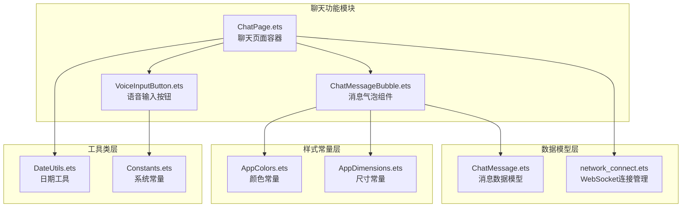
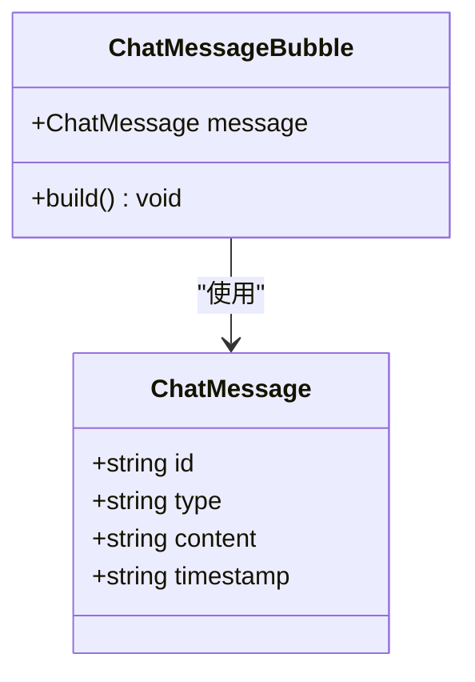
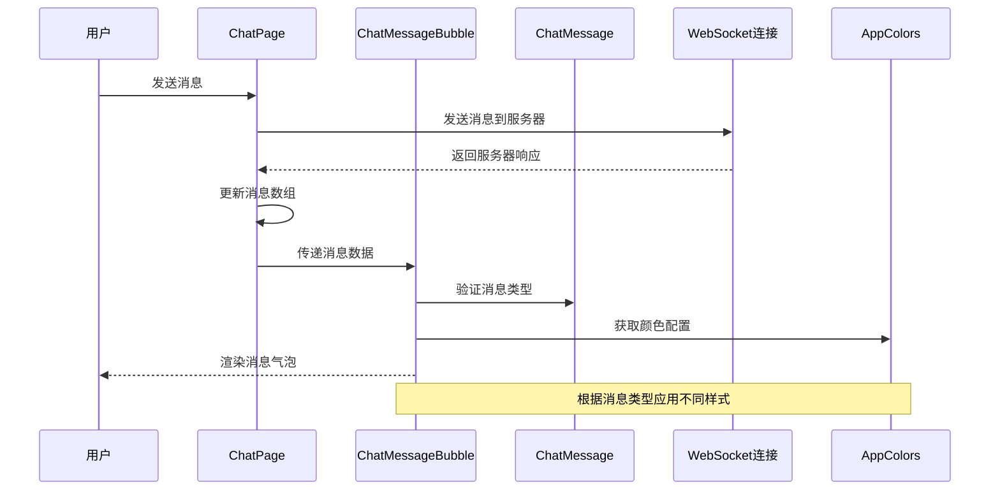
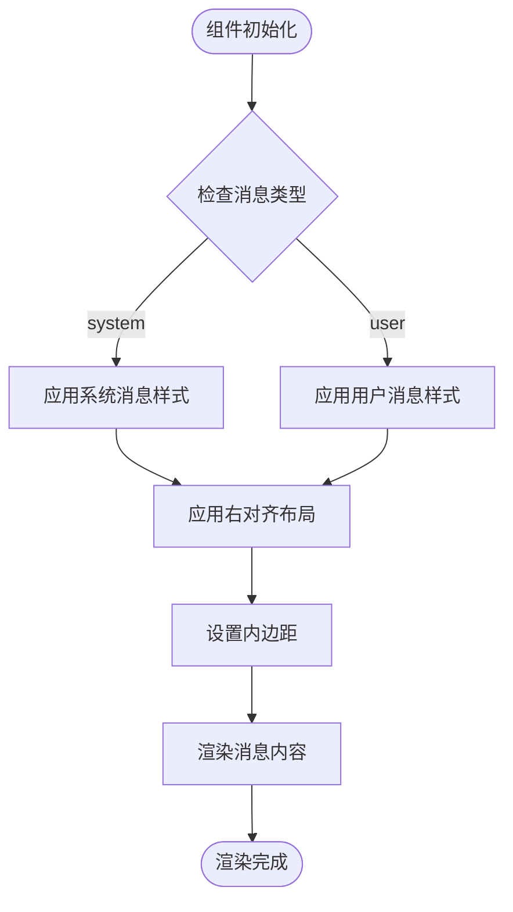
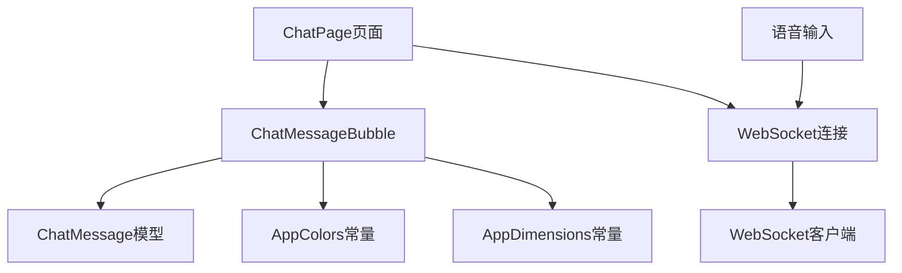

# 聊天消息气泡组件

<cite>
**本文档引用的文件**
- [ChatMessageBubble.ets](file://entry/src/main/ets/components/chat/ChatMessageBubble.ets)
- [ChatMessage.ets](file://entry/src/main/ets/models/ChatMessage.ets)
- [ChatPage.ets](file://entry/src/main/ets/pages/ChatPage.ets)
- [network_connect.ets](file://entry/src/main/ets/pages/network_connect.ets)
- [VoiceInputButton.ets](file://entry/src/main/ets/components/chat/VoiceInputButton.ets)
- [AppColors.ets](file://entry/src/main/ets/constants/AppColors.ets)
- [AppDimensions.ets](file://entry/src/main/ets/constants/AppDimensions.ets)
- [DateUtils.ets](file://entry/src/main/ets/utils/DateUtils.ets)
- [Constants.ets](file://entry/src/main/ets/common/Constants.ets)
</cite>

## 目录
1. [简介](#简介)
2. [项目结构](#项目结构)
3. [核心组件](#核心组件)
4. [架构概览](#架构概览)
5. [详细组件分析](#详细组件分析)
6. [依赖关系分析](#依赖关系分析)
7. [性能考虑](#性能考虑)
8. [故障排除指南](#故障排除指南)
9. [结论](#结论)

## 简介

聊天消息气泡组件是智能控制器应用中的核心UI组件之一，负责展示用户与系统之间的对话交互。该组件实现了消息类型区分、响应式布局、颜色编码和状态指示等关键功能，为用户提供直观的聊天体验。

本组件采用ArkTS框架开发，基于类型安全的编程模型，支持系统消息和用户消息的差异化展示，并通过统一的颜色和尺寸常量确保视觉一致性。

## 项目结构

聊天消息气泡组件位于应用的聊天功能模块中，与相关的数据模型、页面组件和工具类共同构成完整的聊天系统架构。



**图表来源**
- [ChatMessageBubble.ets:1-38](file://entry/src/main/ets/components/chat/ChatMessageBubble.ets#L1-L38)
- [ChatPage.ets:1-83](file://entry/src/main/ets/pages/ChatPage.ets#L1-L83)
- [network_connect.ets:1-321](file://entry/src/main/ets/pages/network_connect.ets#L1-L321)

**章节来源**
- [ChatMessageBubble.ets:1-38](file://entry/src/main/ets/components/chat/ChatMessageBubble.ets#L1-L38)
- [ChatPage.ets:1-83](file://entry/src/main/ets/pages/ChatPage.ets#L1-L83)

## 核心组件

### ChatMessageBubble 组件

ChatMessageBubble 是聊天消息气泡的核心组件，负责根据消息类型渲染不同的视觉样式。

#### 组件属性设计

组件通过 `@Prop` 装饰器接收消息数据，使用 ChatMessage 接口定义消息结构：



**图表来源**
- [ChatMessage.ets:4-9](file://entry/src/main/ets/models/ChatMessage.ets#L4-L9)
- [ChatMessageBubble.ets:7-8](file://entry/src/main/ets/components/chat/ChatMessageBubble.ets#L7-L8)

#### 消息类型区分机制

组件通过消息类型字段实现系统消息和用户消息的差异化渲染：

| 消息类型 | 对齐方式 | 背景色 | 字体色 | 圆角设计 |
|---------|---------|--------|--------|----------|
| system | 右对齐 | #CCCCCC | #FFFFFF | 圆角20px |
| user | 左对齐 | #666666 | #FFFFFF | 圆角20px |

**章节来源**
- [ChatMessageBubble.ets:12-36](file://entry/src/main/ets/components/chat/ChatMessageBubble.ets#L12-L36)

## 架构概览

聊天消息气泡组件在整个应用架构中扮演着重要的UI呈现角色，与数据层、业务逻辑层和样式层紧密协作。



**图表来源**
- [ChatPage.ets:24-62](file://entry/src/main/ets/pages/ChatPage.ets#L24-L62)
- [ChatMessageBubble.ets:10-37](file://entry/src/main/ets/components/chat/ChatMessageBubble.ets#L10-L37)
- [network_connect.ets:263-298](file://entry/src/main/ets/pages/network_connect.ets#L263-L298)

**章节来源**
- [ChatPage.ets:1-83](file://entry/src/main/ets/pages/ChatPage.ets#L1-L83)
- [network_connect.ets:1-321](file://entry/src/main/ets/pages/network_connect.ets#L1-L321)

## 详细组件分析

### 消息气泡渲染流程

组件的渲染过程遵循以下步骤：

1. **消息类型判断**：检查 `message.type` 字段确定消息类型
2. **布局适配**：根据消息类型设置对齐方式和外边距
3. **样式应用**：应用相应的颜色和圆角样式
4. **内容渲染**：显示消息内容文本



**图表来源**
- [ChatMessageBubble.ets:10-37](file://entry/src/main/ets/components/chat/ChatMessageBubble.ets#L10-L37)

### 响应式布局实现

组件采用Flex布局实现响应式设计：

#### 消息对齐方式
- **系统消息**：使用 `FlexAlign.End` 实现右对齐
- **用户消息**：使用 `FlexAlign.Start` 实现左对齐

#### 边距设置
- **外边距**：上下8px，左右16px
- **内边距**：气泡内部12px左、12px右、8px上、8px下

#### 圆角设计
- **统一圆角**：所有气泡使用20px圆角半径
- **边框半径**：使用 `borderRadius(20)` 属性

**章节来源**
- [ChatMessageBubble.ets:34-36](file://entry/src/main/ets/components/chat/ChatMessageBubble.ets#L34-L36)

### 颜色编码系统

组件使用统一的颜色编码系统确保视觉一致性：

#### 颜色常量使用
- **系统消息**：灰色系背景色 `#CCCCCC`
- **用户消息**：深灰系背景色 `#666666`
- **字体颜色**：白色 `#FFFFFF`

#### 配色策略
颜色选择遵循以下原则：
1. **对比度要求**：确保文字与背景有足够的对比度
2. **语义化**：通过颜色传达消息类型信息
3. **品牌一致性**：与整体应用主题保持一致

**章节来源**
- [AppColors.ets:1-47](file://entry/src/main/ets/constants/AppColors.ets#L1-L47)
- [ChatMessageBubble.ets:20-31](file://entry/src/main/ets/components/chat/ChatMessageBubble.ets#L20-L31)

### 消息状态指示

虽然当前版本的消息气泡组件主要关注基础渲染，但可以扩展实现更丰富的状态指示：

#### 现有状态支持
- **正常状态**：标准颜色和样式
- **加载状态**：可通过外部属性控制

#### 扩展建议
```typescript
// 可选的状态属性
@Prop status: 'normal' | 'loading' | 'error' | 'success' = 'normal'
@Prop timestamp: string = ''
```

**章节来源**
- [ChatMessage.ets:4-9](file://entry/src/main/ets/models/ChatMessage.ets#L4-L9)

## 依赖关系分析

### 组件间依赖关系



**图表来源**
- [ChatMessageBubble.ets:1-2](file://entry/src/main/ets/components/chat/ChatMessageBubble.ets#L1-L2)
- [ChatPage.ets:24-62](file://entry/src/main/ets/pages/ChatPage.ets#L24-L62)
- [network_connect.ets:38-321](file://entry/src/main/ets/pages/network_connect.ets#L38-L321)

### 外部依赖

组件依赖于以下外部库和框架：
- **ArkTS框架**：提供组件生命周期和状态管理
- **NetworkKit**：WebSocket通信支持
- **Base模块**：系统错误处理
- **WifiManager**：网络状态监控

**章节来源**
- [network_connect.ets:1-6](file://entry/src/main/ets/pages/network_connect.ets#L1-L6)

## 性能考虑

### 渲染优化

1. **最小化重绘**：使用 `@Prop` 和 `@State` 装饰器确保只有数据变化时才重新渲染
2. **样式复用**：通过常量定义避免重复的颜色和尺寸计算
3. **布局优化**：使用Flex布局减少复杂的定位计算

### 内存管理

1. **组件销毁**：确保WebSocket连接在组件销毁时正确关闭
2. **事件清理**：及时移除网络监听器和定时器
3. **资源释放**：音频资源在录音停止时及时释放

## 故障排除指南

### 常见问题及解决方案

#### 消息显示异常
**问题描述**：消息内容不显示或显示乱码
**可能原因**：
- 消息数据格式不正确
- 字符编码问题
- 网络传输错误

**解决方法**：
1. 检查消息数据模型的完整性
2. 验证WebSocket连接状态
3. 添加数据验证和错误处理

#### 样式渲染问题
**问题描述**：消息气泡样式不符合预期
**可能原因**：
- 颜色常量未正确导入
- 尺寸常量使用不当
- 响应式布局计算错误

**解决方法**：
1. 确认AppColors和AppDimensions的正确导入
2. 验证Flex布局属性设置
3. 检查屏幕尺寸适配

**章节来源**
- [network_connect.ets:204-234](file://entry/src/main/ets/pages/network_connect.ets#L204-L234)

## 结论

聊天消息气泡组件作为智能控制器应用的重要UI组件，展现了良好的设计原则和实现质量。组件通过清晰的消息类型区分、优雅的响应式布局和统一的视觉风格，为用户提供了直观的聊天体验。

### 设计亮点

1. **类型安全**：使用TypeScript接口确保消息数据的完整性
2. **样式一致性**：通过颜色和尺寸常量保证视觉统一性
3. **响应式设计**：灵活的布局适配不同屏幕尺寸
4. **可扩展性**：模块化的组件设计便于功能扩展

### 改进建议

1. **增强状态指示**：添加更多消息状态的视觉反馈
2. **国际化支持**：考虑多语言环境下的文本适配
3. **无障碍访问**：增加屏幕阅读器支持
4. **性能监控**：添加渲染性能指标和监控

该组件为整个聊天系统的UI基础，其设计理念和实现方式为类似应用场景提供了优秀的参考模板。