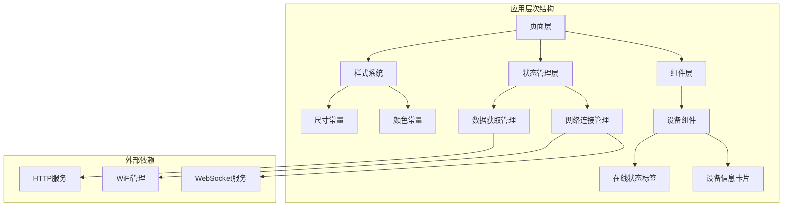
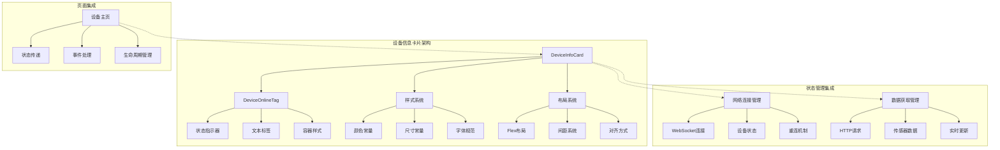
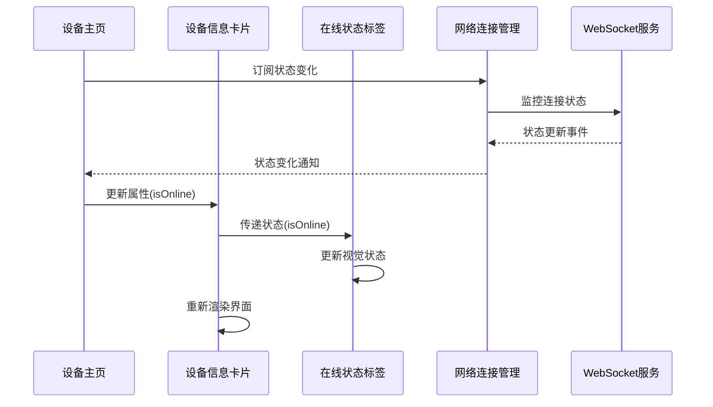
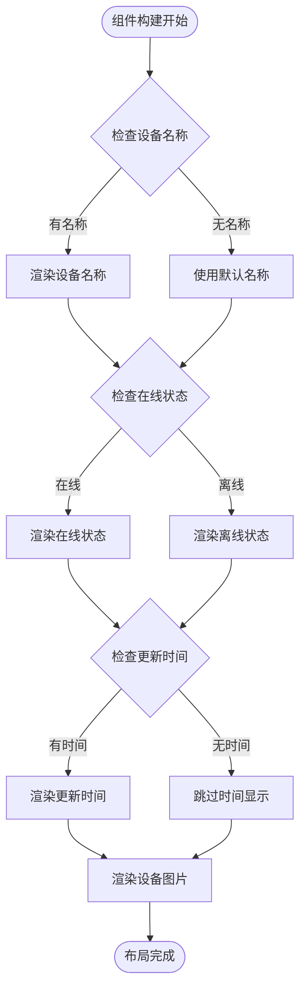
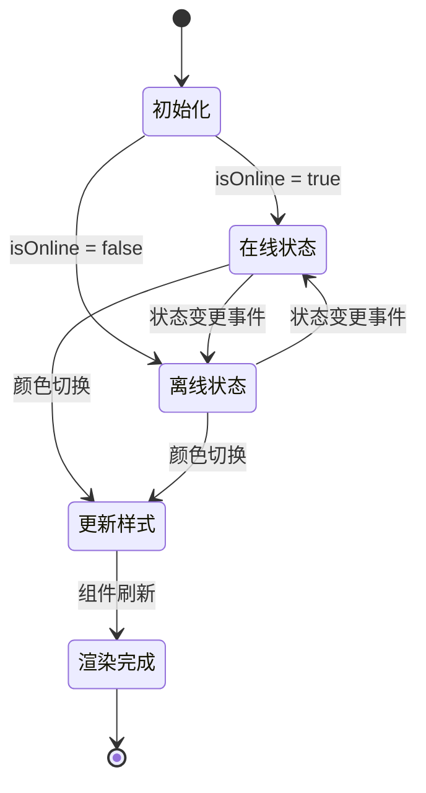
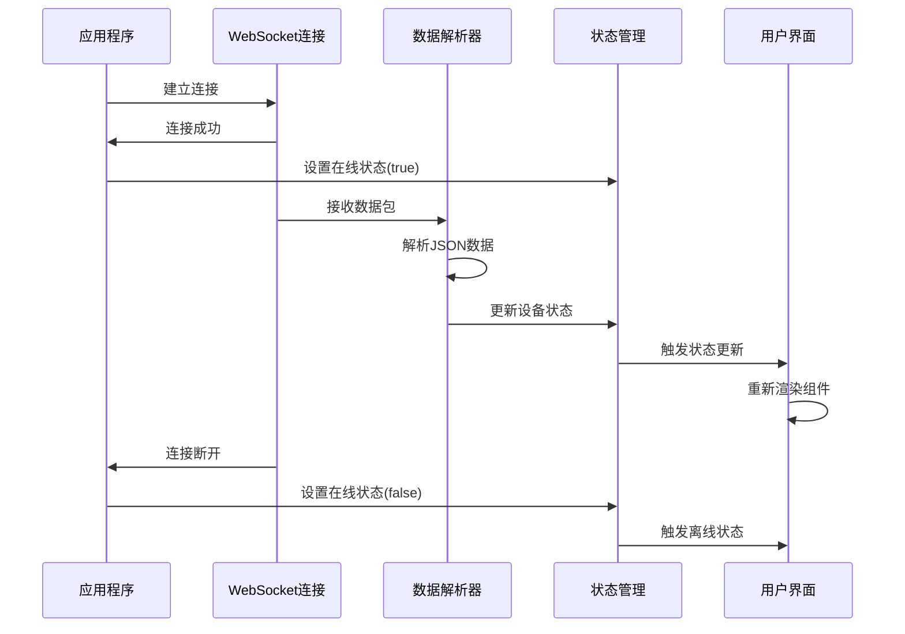
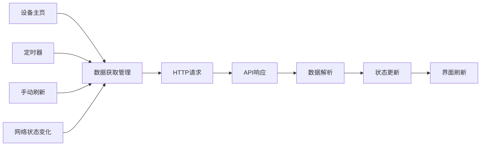
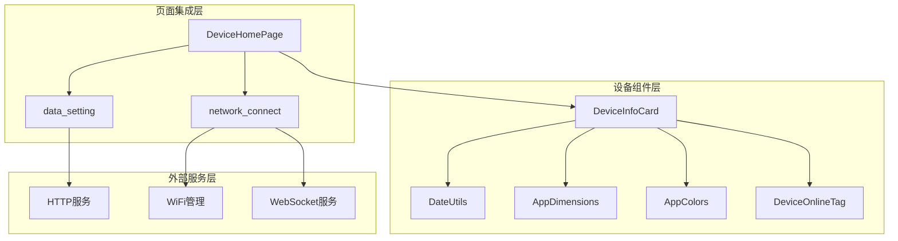

# 设备信息卡片组件

<cite>
**本文档引用的文件**
- [DeviceInfoCard.ets](file://entry/src/main/ets/components/device/DeviceInfoCard.ets)
- [DeviceOnlineTag.ets](file://entry/src/main/ets/components/device/DeviceOnlineTag.ets)
- [network_connect.ets](file://entry/src/main/ets/pages/network_connect.ets)
- [DeviceHomePage.ets](file://entry/src/main/ets/pages/DeviceHomePage.ets)
- [get_data.ets](file://entry/src/main/ets/pages/get_data.ets)
- [AppColors.ets](file://entry/src/main/ets/constants/AppColors.ets)
- [AppDimensions.ets](file://entry/src/main/ets/constants/AppDimensions.ets)
- [DateUtils.ets](file://entry/src/main/ets/utils/DateUtils.ets)
</cite>

## 目录
1. [简介](#简介)
2. [项目结构](#项目结构)
3. [核心组件](#核心组件)
4. [架构概览](#架构概览)
5. [详细组件分析](#详细组件分析)
6. [依赖关系分析](#依赖关系分析)
7. [性能考虑](#性能考虑)
8. [故障排除指南](#故障排除指南)
9. [结论](#结论)

## 简介

设备信息卡片组件是智能控制器应用中的核心展示组件，负责向用户提供设备的基本信息和实时状态。该组件采用ArkTS框架开发，实现了响应式的设备状态展示和用户交互功能。

本组件的主要功能包括：
- 展示设备名称、在线状态和更新时间
- 提供直观的设备状态可视化
- 实现实时状态更新和同步机制
- 支持设备状态变化的响应式更新
- 提供友好的用户交互反馈

## 项目结构

设备信息卡片组件位于应用的组件层中，与设备状态管理、网络连接管理和样式系统紧密集成。

**图表来源**
- [DeviceInfoCard.ets:1-59](file://entry/src/main/ets/components/device/DeviceInfoCard.ets#L1-L59)
- [DeviceOnlineTag.ets:1-31](file://entry/src/main/ets/components/device/DeviceOnlineTag.ets#L1-L31)
- [network_connect.ets:38-321](file://entry/src/main/ets/pages/network_connect.ets#L38-L321)

**章节来源**
- [DeviceInfoCard.ets:1-59](file://entry/src/main/ets/components/device/DeviceInfoCard.ets#L1-L59)
- [DeviceHomePage.ets:1-74](file://entry/src/main/ets/pages/DeviceHomePage.ets#L1-L74)

## 核心组件

### 设备信息卡片组件

设备信息卡片组件是整个设备状态展示的核心组件，采用结构化组件设计模式，支持响应式状态更新和属性传递。

#### 组件属性设计

| 属性名 | 类型 | 默认值 | 描述 |
|--------|------|--------|------|
| deviceName | string | '设备名称' | 设备显示名称 |
| isOnline | boolean | true | 设备在线状态 |
| updateTime | string | '' | 数据更新时间 |

#### 布局结构

组件采用两层嵌套布局设计：

1. **顶部信息行**：包含设备名称和在线状态标签
2. **底部媒体区**：设备图片展示区域

#### 样式系统集成

组件通过统一的样式常量系统实现视觉一致性：

- **颜色系统**：基于AppColors常量定义
- **尺寸系统**：基于AppDimensions常量定义
- **字体系统**：支持多级字体大小和字重

**章节来源**
- [DeviceInfoCard.ets:10-59](file://entry/src/main/ets/components/device/DeviceInfoCard.ets#L10-L59)
- [AppColors.ets:1-47](file://entry/src/main/ets/constants/AppColors.ets#L1-L47)
- [AppDimensions.ets:1-40](file://entry/src/main/ets/constants/AppDimensions.ets#L1-L40)

### 在线状态标签组件

在线状态标签组件专门负责设备连接状态的可视化展示，提供简洁明了的状态指示。

#### 状态指示设计

| 状态 | 视觉元素 | 颜色方案 |
|------|----------|----------|
| 在线 | 绿色圆形指示点 + '在线'文字 | 成功绿色主题 |
| 离线 | 灰色圆形指示点 + '离线'文字 | 禁用灰色主题 |

#### 响应式设计

组件支持动态颜色切换和透明度效果，确保在不同主题下都有良好的可读性。

**章节来源**
- [DeviceOnlineTag.ets:8-31](file://entry/src/main/ets/components/device/DeviceOnlineTag.ets#L8-L31)

## 架构概览

设备信息卡片组件的架构设计体现了清晰的关注点分离和模块化原则。

**图表来源**
- [DeviceInfoCard.ets:18-59](file://entry/src/main/ets/components/device/DeviceInfoCard.ets#L18-L59)
- [DeviceOnlineTag.ets:13-31](file://entry/src/main/ets/components/device/DeviceOnlineTag.ets#L13-L31)
- [network_connect.ets:38-321](file://entry/src/main/ets/pages/network_connect.ets#L38-L321)

## 详细组件分析

### 设备信息卡片组件实现

#### 数据流设计

**图表来源**
- [DeviceHomePage.ets:23-26](file://entry/src/main/ets/pages/DeviceHomePage.ets#L23-L26)
- [network_connect.ets:182-261](file://entry/src/main/ets/pages/network_connect.ets#L182-L261)

#### 布局算法分析

组件采用自适应布局算法，支持不同屏幕尺寸和内容长度的灵活适配。

**图表来源**
- [DeviceInfoCard.ets:18-59](file://entry/src/main/ets/components/device/DeviceInfoCard.ets#L18-L59)

**章节来源**
- [DeviceInfoCard.ets:18-59](file://entry/src/main/ets/components/device/DeviceInfoCard.ets#L18-L59)

### 在线状态标签组件实现

#### 状态同步机制

**图表来源**
- [DeviceOnlineTag.ets:14-30](file://entry/src/main/ets/components/device/DeviceOnlineTag.ets#L14-L30)

#### 视觉设计规范

组件遵循统一的视觉设计规范，确保状态指示的一致性和可识别性。

**章节来源**
- [DeviceOnlineTag.ets:13-31](file://entry/src/main/ets/components/device/DeviceOnlineTag.ets#L13-L31)

### 状态管理集成

#### WebSocket数据接收流程

**图表来源**
- [network_connect.ets:149-180](file://entry/src/main/ets/pages/network_connect.ets#L149-L180)
- [network_connect.ets:204-234](file://entry/src/main/ets/pages/network_connect.ets#L204-L234)

#### 实时更新机制

组件通过观察者模式实现状态的实时更新，确保用户界面与设备状态保持同步。

**章节来源**
- [network_connect.ets:182-261](file://entry/src/main/ets/pages/network_connect.ets#L182-L261)

### 数据获取和更新流程

#### HTTP数据获取集成

**图表来源**
- [get_data.ets:67-105](file://entry/src/main/ets/pages/get_data.ets#L67-L105)

#### 时间戳管理

组件集成了统一的时间戳管理系统，确保显示的时间信息准确可靠。

**章节来源**
- [DateUtils.ets:1-28](file://entry/src/main/ets/utils/DateUtils.ets#L1-L28)

## 依赖关系分析

### 组件间依赖关系

**图表来源**
- [DeviceInfoCard.ets:1-3](file://entry/src/main/ets/components/device/DeviceInfoCard.ets#L1-L3)
- [DeviceHomePage.ets:2-11](file://entry/src/main/ets/pages/DeviceHomePage.ets#L2-L11)

### 样式系统依赖

组件通过依赖注入的方式使用全局样式常量，确保视觉设计的一致性。

| 依赖项 | 使用位置 | 功能描述 |
|--------|----------|----------|
| AppColors | 颜色定义 | 统一的颜色规范管理 |
| AppDimensions | 尺寸规范 | 响应式布局的基础尺寸 |
| FontSizes | 字体规格 | 多级字体大小支持 |

**章节来源**
- [AppColors.ets:5-47](file://entry/src/main/ets/constants/AppColors.ets#L5-L47)
- [AppDimensions.ets:5-40](file://entry/src/main/ets/constants/AppDimensions.ets#L5-L40)

## 性能考虑

### 渲染优化策略

1. **组件复用**：通过属性传递实现组件复用，减少实例创建开销
2. **状态最小化**：仅在必要时触发重新渲染
3. **样式缓存**：利用常量系统避免重复计算样式值

### 内存管理

- 使用@Prop装饰器进行属性传递，避免不必要的数据拷贝
- 通过@Local状态管理实现局部状态隔离
- 合理使用@ObservedV2装饰器确保响应式更新

### 网络性能

- 实现连接池管理，避免频繁创建WebSocket连接
- 添加重连机制，提高网络稳定性
- 使用背压控制，防止消息队列溢出

## 故障排除指南

### 常见问题诊断

#### 状态显示异常

**问题症状**：在线状态标签显示不正确
**可能原因**：
- 网络连接状态获取失败
- WebSocket连接异常
- 状态更新事件丢失

**解决方案**：
1. 检查网络连接管理器的日志输出
2. 验证WebSocket连接状态
3. 确认状态更新事件的正确传递

#### 数据更新延迟

**问题症状**：设备信息更新存在明显延迟
**可能原因**：
- HTTP请求超时设置过短
- WebSocket消息处理阻塞
- UI渲染性能瓶颈

**解决方案**：
1. 调整HTTP请求的超时参数
2. 优化WebSocket消息处理逻辑
3. 实施UI渲染性能监控

#### 样式显示问题

**问题症状**：组件样式不符合预期
**可能原因**：
- 样式常量定义错误
- 响应式布局计算异常
- 主题切换时机不当

**解决方案**：
1. 验证AppColors和AppDimensions的定义
2. 检查Flex布局的计算逻辑
3. 确保主题切换的正确时机

**章节来源**
- [network_connect.ets:253-261](file://entry/src/main/ets/pages/network_connect.ets#L253-L261)

## 结论

设备信息卡片组件通过精心设计的架构和实现，成功地将设备状态信息以直观、易懂的方式呈现给用户。组件具有以下突出特点：

### 技术优势

1. **模块化设计**：清晰的组件边界和职责分离
2. **响应式更新**：基于观察者模式的状态管理
3. **样式统一**：完整的样式系统集成
4. **性能优化**：合理的渲染和内存管理策略

### 扩展性设计

组件具备良好的可扩展性，支持：
- 新的设备状态类型的添加
- 自定义样式的扩展
- 额外信息字段的集成
- 多种展示模式的支持

### 最佳实践建议

1. **状态管理**：保持状态的单一事实源
2. **错误处理**：实现完善的异常处理机制
3. **性能监控**：持续关注组件的性能表现
4. **用户体验**：注重交互反馈和加载状态的处理

该组件为智能控制器应用提供了可靠的设备状态展示基础，为后续的功能扩展和优化奠定了坚实的技术基础。