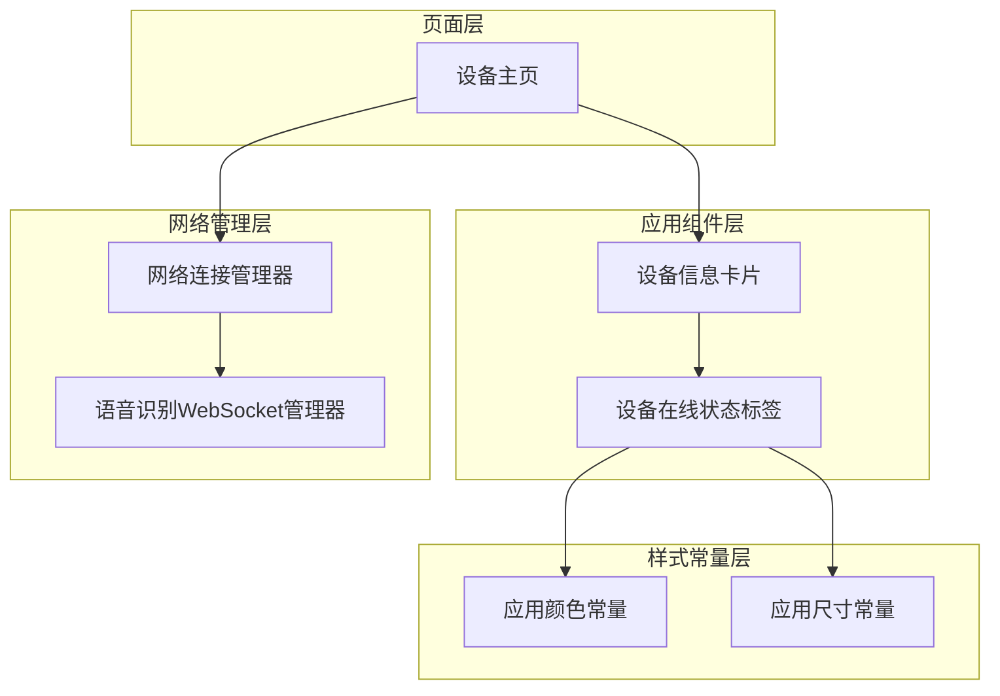
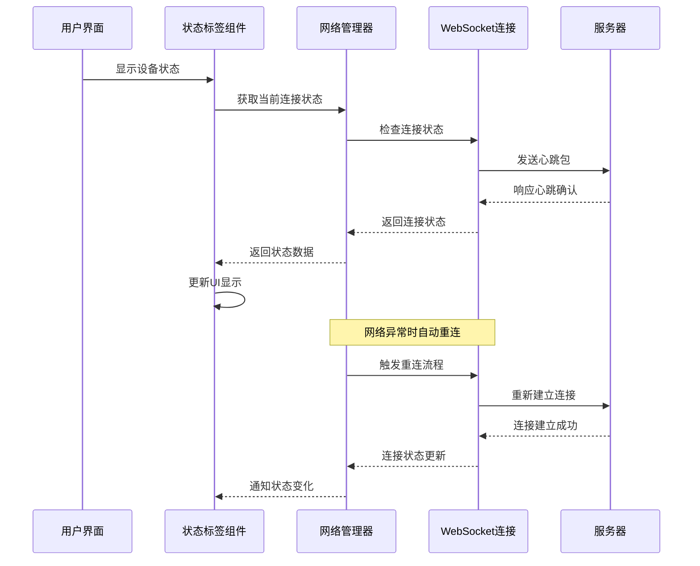
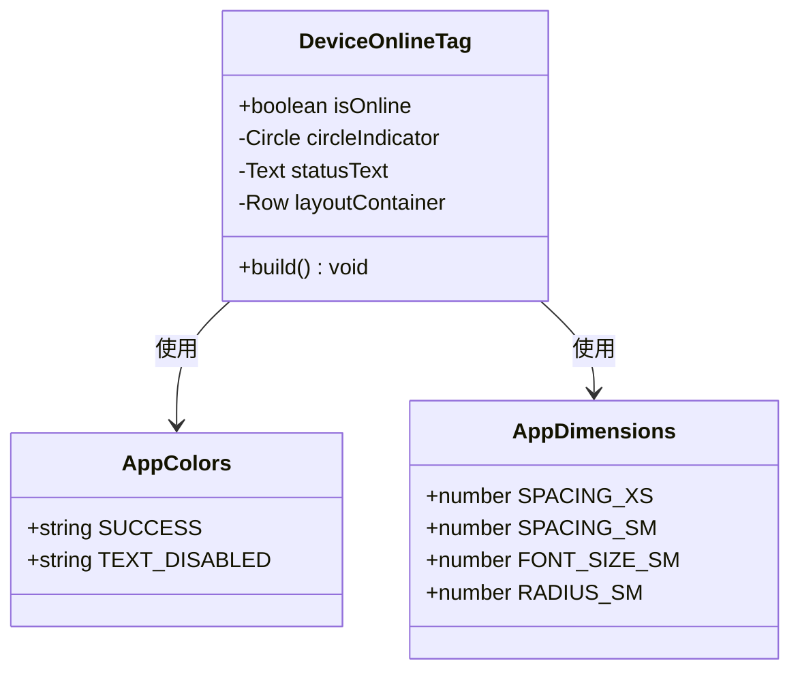
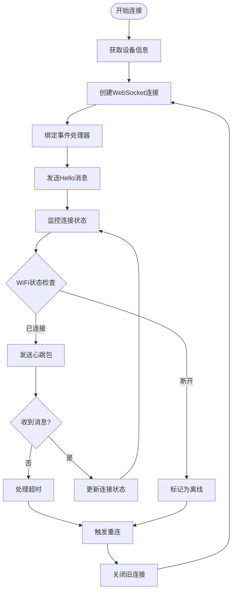
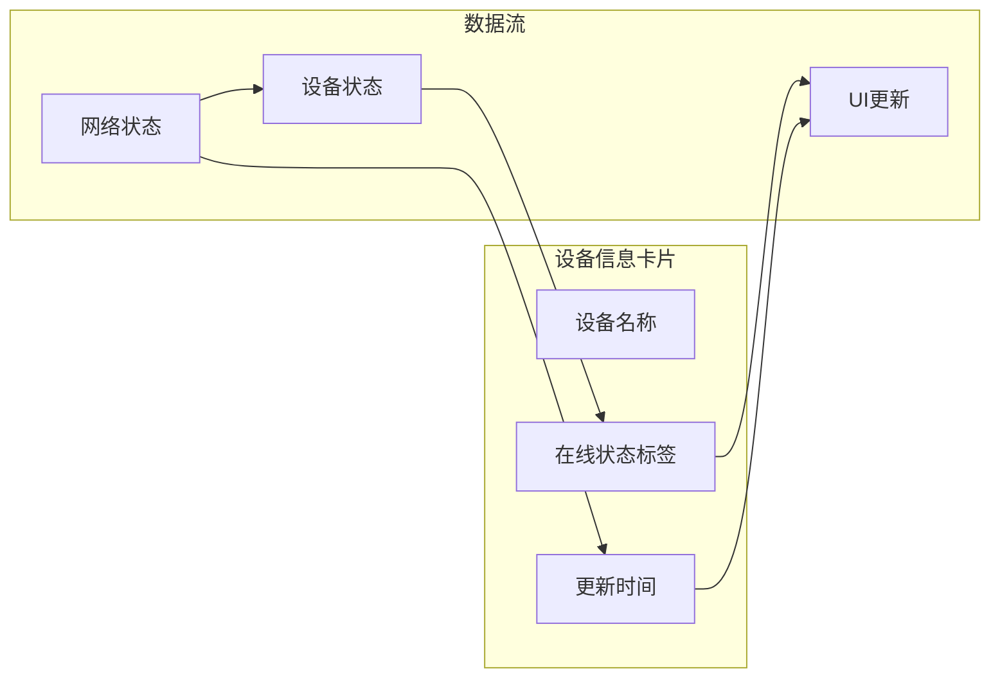
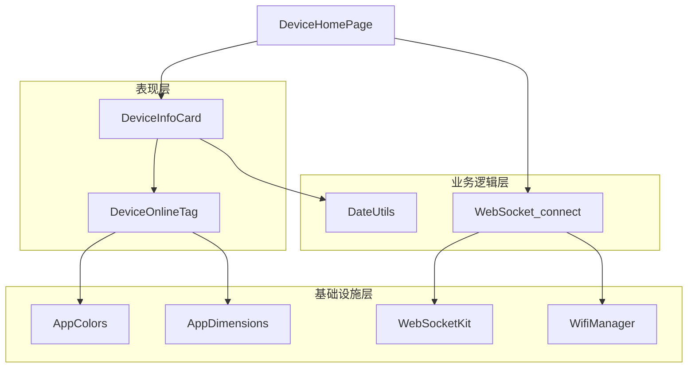

# 设备在线状态标签

<cite>
**本文档引用的文件**
- [DeviceOnlineTag.ets](file://entry/src/main/ets/components/device/DeviceOnlineTag.ets)
- [network_connect.ets](file://entry/src/main/ets/pages/network_connect.ets)
- [DeviceInfoCard.ets](file://entry/src/main/ets/components/device/DeviceInfoCard.ets)
- [DeviceHomePage.ets](file://entry/src/main/ets/pages/DeviceHomePage.ets)
- [AppColors.ets](file://entry/src/main/ets/constants/AppColors.ets)
- [AppDimensions.ets](file://entry/src/main/ets/constants/AppDimensions.ets)
- [DateUtils.ets](file://entry/src/main/ets/utils/DateUtils.ets)
- [AsrWebSocketManager.ets](file://entry/src/main/ets/managers/AsrWebSocketManager.ets)
</cite>

## 目录
1. [简介](#简介)
2. [项目结构](#项目结构)
3. [核心组件](#核心组件)
4. [架构概览](#架构概览)
5. [详细组件分析](#详细组件分析)
6. [依赖关系分析](#依赖关系分析)
7. [性能考虑](#性能考虑)
8. [故障排除指南](#故障排除指南)
9. [结论](#结论)

## 简介

设备在线状态标签是智能控制器应用中的关键组件，用于实时显示设备的连接状态。该组件实现了完整的网络连接状态监控、心跳机制和超时处理功能，为用户提供直观的状态可视化。

本组件采用现代化的设计理念，结合了ArkTS框架的最佳实践，提供了高度可配置的状态显示方案。通过统一的颜色编码系统，用户可以快速识别设备的各种状态，包括在线、离线、异常等不同场景。

## 项目结构

设备在线状态标签位于应用的组件层中，与网络连接管理和设备信息展示紧密集成：

**图表来源**
- [DeviceOnlineTag.ets:1-31](file://entry/src/main/ets/components/device/DeviceOnlineTag.ets#L1-L31)
- [network_connect.ets:38-321](file://entry/src/main/ets/pages/network_connect.ets#L38-L321)
- [DeviceInfoCard.ets:1-59](file://entry/src/main/ets/components/device/DeviceInfoCard.ets#L1-L59)

**章节来源**
- [DeviceOnlineTag.ets:1-31](file://entry/src/main/ets/components/device/DeviceOnlineTag.ets#L1-L31)
- [network_connect.ets:38-321](file://entry/src/main/ets/pages/network_connect.ets#L38-L321)
- [DeviceInfoCard.ets:1-59](file://entry/src/main/ets/components/device/DeviceInfoCard.ets#L1-L59)

## 核心组件

### 设备在线状态标签组件

设备在线状态标签是一个轻量级的UI组件，专门负责显示设备的连接状态。该组件采用简洁的设计，通过圆形指示点和文字标签的组合，提供清晰的状态指示。

组件的核心特性包括：
- **实时状态显示**：根据网络连接状态动态更新UI
- **颜色编码系统**：使用绿色表示在线，灰色表示离线
- **响应式设计**：适配不同的屏幕尺寸和布局需求
- **可配置样式**：支持主题颜色和尺寸的自定义

**章节来源**
- [DeviceOnlineTag.ets:8-31](file://entry/src/main/ets/components/device/DeviceOnlineTag.ets#L8-L31)

### 网络连接管理器

网络连接管理器负责维护WebSocket连接，实现设备状态的实时监控。该管理器具备完整的连接生命周期管理，包括连接建立、状态监控、异常处理和自动重连机制。

主要功能模块：
- **WiFi状态监听**：实时监控WiFi连接状态变化
- **WebSocket连接管理**：维护稳定的双向通信通道
- **自动重连机制**：在网络中断后自动恢复连接
- **状态同步**：确保UI状态与网络状态保持一致

**章节来源**
- [network_connect.ets:38-321](file://entry/src/main/ets/pages/network_connect.ets#L38-L321)

## 架构概览

设备在线状态标签的实现采用了分层架构设计，确保各组件职责明确、耦合度低：

**图表来源**
- [network_connect.ets:105-131](file://entry/src/main/ets/pages/network_connect.ets#L105-L131)
- [network_connect.ets:236-261](file://entry/src/main/ets/pages/network_connect.ets#L236-L261)

## 详细组件分析

### 设备在线状态标签组件

#### 组件结构设计

设备在线状态标签组件采用简洁而高效的结构设计，通过组合多个UI元素实现完整的状态显示功能：

**图表来源**
- [DeviceOnlineTag.ets:9-31](file://entry/src/main/ets/components/device/DeviceOnlineTag.ets#L9-L31)
- [AppColors.ets:5-47](file://entry/src/main/ets/constants/AppColors.ets#L5-L47)
- [AppDimensions.ets:5-40](file://entry/src/main/ets/constants/AppDimensions.ets#L5-L40)

#### 颜色编码系统

组件实现了标准化的颜色编码系统，通过视觉化的方式传达设备状态信息：

| 状态类型 | 颜色值 | 颜色描述 | 使用场景 |
|---------|--------|----------|----------|
| 在线状态 | `#2ECC71` | 绿色 - 成功/在线 | 设备正常连接 |
| 离线状态 | `#5D6D7E` | 灰色 - 禁用/离线 | 设备断开连接 |
| 背景色 - 在线 | `rgba(46, 204, 113, 0.1)` | 浅绿色半透明 | 在线状态背景 |
| 背景色 - 离线 | `rgba(93, 109, 126, 0.1)` | 浅灰色半透明 | 离线状态背景 |

#### 状态更新机制

组件通过属性绑定实现状态的实时更新，当网络状态发生变化时，UI会自动刷新以反映最新的连接状态。

**章节来源**
- [DeviceOnlineTag.ets:10-31](file://entry/src/main/ets/components/device/DeviceOnlineTag.ets#L10-L31)
- [AppColors.ets:20-24](file://entry/src/main/ets/constants/AppColors.ets#L20-L24)

### 网络连接管理器

#### 连接状态监控

网络连接管理器实现了多层次的连接状态监控机制，确保能够准确反映设备的网络连接状况：

**图表来源**
- [network_connect.ets:149-180](file://entry/src/main/ets/pages/network_connect.ets#L149-L180)
- [network_connect.ets:204-261](file://entry/src/main/ets/pages/network_connect.ets#L204-L261)

#### 心跳机制实现

系统实现了可靠的心跳机制，通过定期发送和接收消息来验证连接的有效性：

| 机制类型 | 实现方式 | 时间间隔 | 异常处理 |
|---------|----------|----------|----------|
| 定时心跳 | 周期性发送ping消息 | 30秒 | 自动重连 |
| 响应确认 | 服务器回显确认消息 | 实时 | 状态同步 |
| 超时检测 | 未响应时标记连接异常 | 60秒 | 断线处理 |
| 自动恢复 | 网络恢复后自动重连 | 即时 | 状态更新 |

#### 超时处理策略

系统采用多层超时处理策略，确保在网络不稳定的情况下仍能提供可靠的用户体验：

**章节来源**
- [network_connect.ets:77-99](file://entry/src/main/ets/pages/network_connect.ets#L77-L99)
- [network_connect.ets:253-260](file://entry/src/main/ets/pages/network_connect.ets#L253-L260)

### 设备信息卡片集成

设备信息卡片作为状态标签的容器，提供了完整的设备信息展示环境：

**图表来源**
- [DeviceInfoCard.ets:18-59](file://entry/src/main/ets/components/device/DeviceInfoCard.ets#L18-L59)
- [DeviceHomePage.ets:36-36](file://entry/src/main/ets/pages/DeviceHomePage.ets#L36-L36)

**章节来源**
- [DeviceInfoCard.ets:9-59](file://entry/src/main/ets/components/device/DeviceInfoCard.ets#L9-L59)
- [DeviceHomePage.ets:23-26](file://entry/src/main/ets/pages/DeviceHomePage.ets#L23-L26)

## 依赖关系分析

设备在线状态标签的实现涉及多个层次的依赖关系，形成了清晰的架构分层：

**图表来源**
- [DeviceOnlineTag.ets:1-3](file://entry/src/main/ets/components/device/DeviceOnlineTag.ets#L1-L3)
- [network_connect.ets:1-6](file://entry/src/main/ets/pages/network_connect.ets#L1-L6)

### 组件耦合度分析

系统采用了松耦合的设计原则，各组件之间的依赖关系清晰且可控：

- **DeviceOnlineTag** 仅依赖于颜色和尺寸常量，耦合度极低
- **DeviceInfoCard** 通过属性传递实现解耦
- **network_connect** 独立封装网络逻辑，对外提供简单接口
- **AppColors/AppDimensions** 提供全局样式配置，便于主题切换

**章节来源**
- [DeviceOnlineTag.ets:1-31](file://entry/src/main/ets/components/device/DeviceOnlineTag.ets#L1-L31)
- [network_connect.ets:38-321](file://entry/src/main/ets/pages/network_connect.ets#L38-L321)

## 性能考虑

### 内存管理优化

系统在内存管理方面采用了多项优化策略：

- **组件复用**：状态标签组件设计为无状态组件，支持重复使用
- **事件监听清理**：网络管理器在销毁时自动清理所有事件监听器
- **连接池管理**：WebSocket连接采用单例模式，避免重复创建
- **定时器清理**：及时清理超时和重连相关的定时器

### 网络性能优化

为了提升网络通信效率，系统实现了以下优化措施：

- **连接复用**：单个WebSocket实例处理所有消息类型
- **批量处理**：网络状态变化采用批量更新策略
- **背压处理**：在网络拥塞时自动降级处理频率
- **缓存策略**：设备信息采用本地缓存减少网络请求

## 故障排除指南

### 常见问题诊断

#### 状态标签不更新

**症状**：设备状态标签显示固定状态，不随网络变化而更新

**可能原因**：
1. 网络管理器未正确初始化
2. 事件监听器未注册
3. 状态属性未正确绑定

**解决方案**：
1. 检查网络管理器的构造函数调用
2. 验证事件监听器的注册状态
3. 确认属性绑定语法正确

#### 连接频繁断开

**症状**：WebSocket连接频繁建立和断开

**可能原因**：
1. 心跳包发送间隔设置不当
2. 服务器端超时设置过短
3. 网络环境不稳定

**解决方案**：
1. 调整心跳包发送间隔至合理范围
2. 检查服务器端配置
3. 优化网络环境或增加重连延迟

#### 颜色显示异常

**症状**：状态标签颜色不符合预期

**可能原因**：
1. 颜色常量定义错误
2. 样式覆盖冲突
3. 主题切换导致的颜色变化

**解决方案**：
1. 检查AppColors中的颜色定义
2. 验证CSS样式的优先级
3. 确认主题切换逻辑的正确性

**章节来源**
- [network_connect.ets:253-260](file://entry/src/main/ets/pages/network_connect.ets#L253-L260)
- [AppColors.ets:20-24](file://entry/src/main/ets/constants/AppColors.ets#L20-L24)

## 结论

设备在线状态标签组件展现了现代移动应用开发的最佳实践，通过精心设计的架构和实现方案，为用户提供了可靠的设备状态监控体验。

该组件的主要优势包括：

1. **架构清晰**：采用分层设计，职责分离明确
2. **扩展性强**：支持主题定制和功能扩展
3. **性能优异**：优化的内存管理和网络通信
4. **可靠性高**：完善的错误处理和自动恢复机制

未来可以考虑的功能增强方向：
- 添加更多状态类型的可视化表示
- 实现状态历史记录和趋势分析
- 增强离线状态下的本地数据同步
- 提供更丰富的用户交互反馈

通过持续的优化和完善，设备在线状态标签将成为智能控制器应用中不可或缺的重要组成部分。