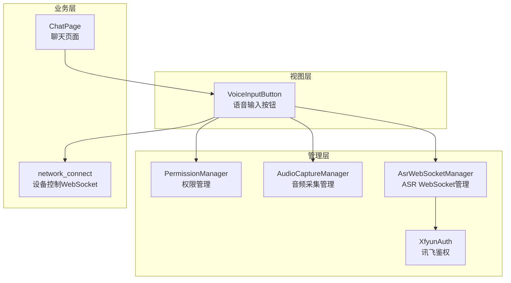
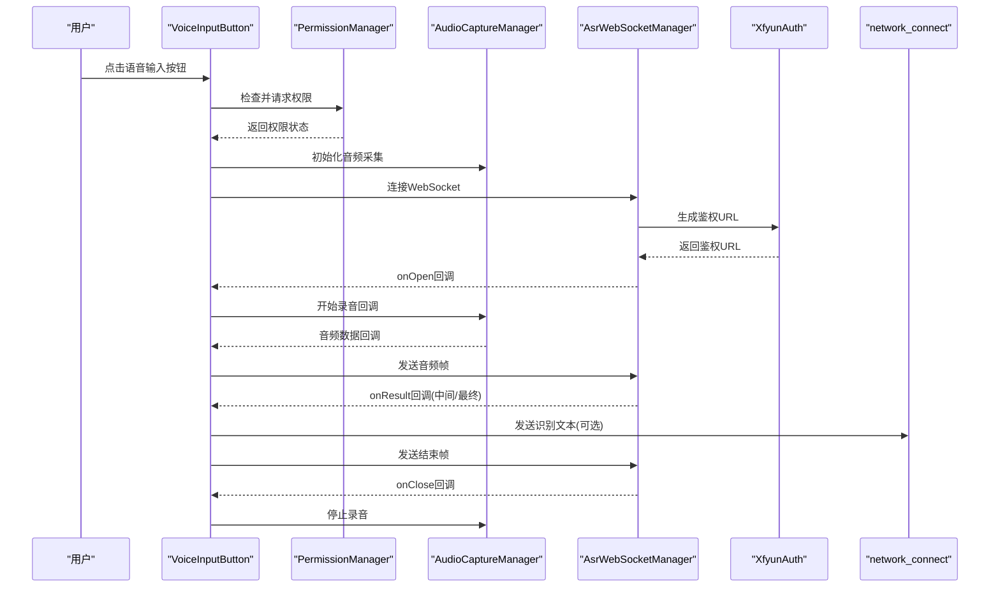
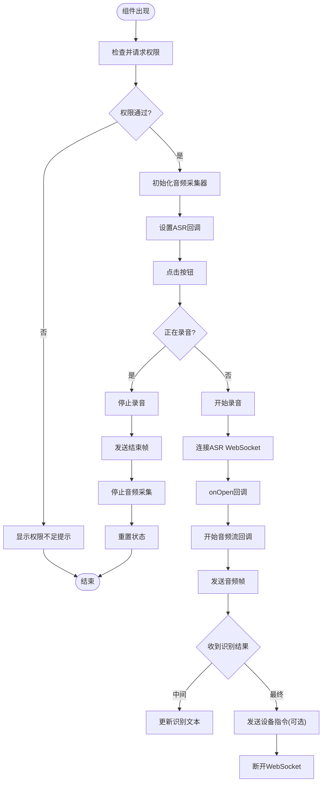
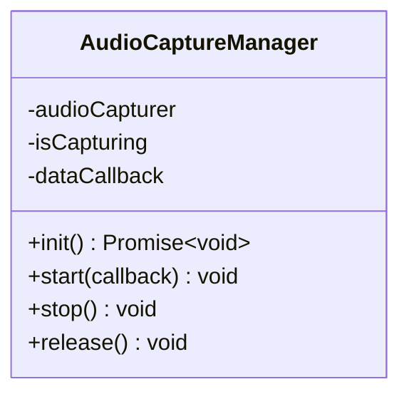
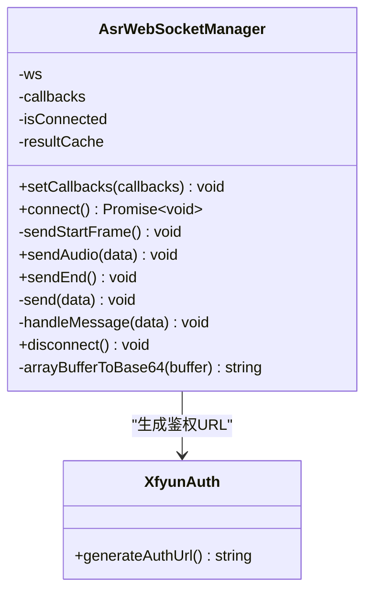
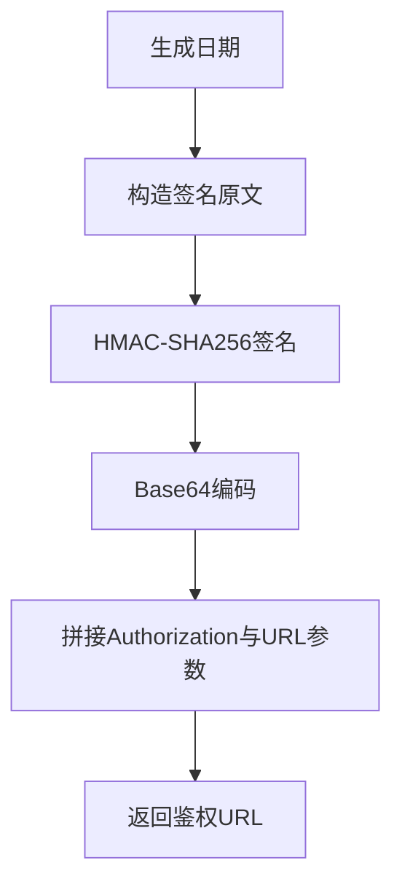
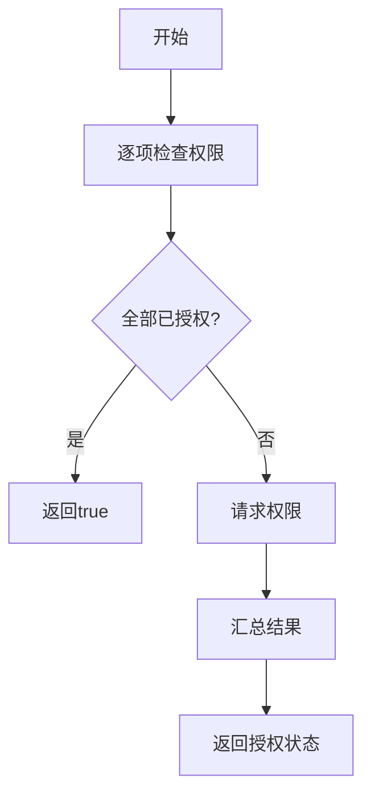
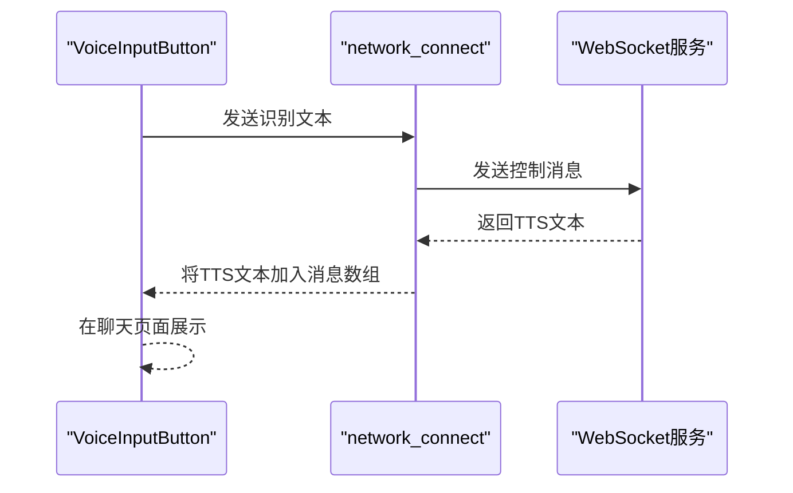
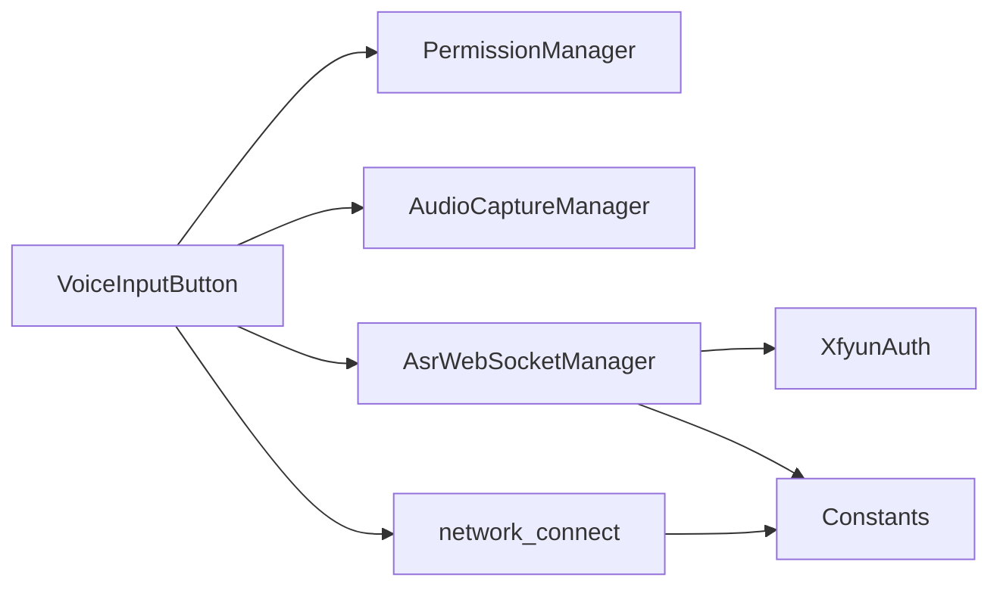

# 语音输入按钮组件

<cite>
**本文引用的文件**
- [VoiceInputButton.ets](file://entry/src/main/ets/components/chat/VoiceInputButton.ets)
- [AudioCaptureManager.ets](file://entry/src/main/ets/managers/AudioCaptureManager.ets)
- [AsrWebSocketManager.ets](file://entry/src/main/ets/managers/AsrWebSocketManager.ets)
- [XfyunAuth.ets](file://entry/src/main/ets/managers/XfyunAuth.ets)
- [PermissionManager.ets](file://entry/src/main/ets/managers/PermissionManager.ets)
- [Constants.ets](file://entry/src/main/ets/common/Constants.ets)
- [network_connect.ets](file://entry/src/main/ets/pages/network_connect.ets)
- [ChatPage.ets](file://entry/src/main/ets/pages/ChatPage.ets)
</cite>

## 目录
1. [简介](#简介)
2. [项目结构](#项目结构)
3. [核心组件](#核心组件)
4. [架构总览](#架构总览)
5. [详细组件分析](#详细组件分析)
6. [依赖关系分析](#依赖关系分析)
7. [性能考量](#性能考量)
8. [故障排查指南](#故障排查指南)
9. [结论](#结论)

## 简介
本文件面向“语音输入按钮组件”的完整实现与使用，涵盖以下关键主题：
- 语音识别完整流程：从权限检查、音频采集、WebSocket连接、讯飞ASR服务交互，到识别结果回传与展示。
- 组件状态管理：录音状态、识别状态、错误状态的生命周期与UI反馈。
- 与音频管理器、WebSocket管理器、权限管理器的协作机制：事件传递、数据同步与资源释放。
- 讯飞语音服务认证流程与API调用细节：鉴权URL生成、握手帧、音频帧、结束帧与结果解析。
- 识别结果处理与展示：将ASR结果通过WebSocket发送至设备控制服务，并在聊天界面中呈现。
- 错误处理与异常恢复：连接失败、权限缺失、网络波动、识别错误等场景的处理策略与用户体验优化。

## 项目结构
该功能位于聊天模块，主要由以下层次构成：
- 视图层：VoiceInputButton 组件负责UI与用户交互。
- 管理层：权限管理、音频采集、ASR WebSocket、讯飞鉴权。
- 业务层：设备控制WebSocket通信与聊天消息展示。

图表来源
- [VoiceInputButton.ets:1-125](file://entry/src/main/ets/components/chat/VoiceInputButton.ets#L1-L125)
- [PermissionManager.ets:1-28](file://entry/src/main/ets/managers/PermissionManager.ets#L1-L28)
- [AudioCaptureManager.ets:1-80](file://entry/src/main/ets/managers/AudioCaptureManager.ets#L1-L80)
- [AsrWebSocketManager.ets:1-271](file://entry/src/main/ets/managers/AsrWebSocketManager.ets#L1-L271)
- [XfyunAuth.ets:1-34](file://entry/src/main/ets/managers/XfyunAuth.ets#L1-L34)
- [network_connect.ets:1-321](file://entry/src/main/ets/pages/network_connect.ets#L1-L321)
- [ChatPage.ets:1-83](file://entry/src/main/ets/pages/ChatPage.ets#L1-L83)

章节来源
- [VoiceInputButton.ets:1-125](file://entry/src/main/ets/components/chat/VoiceInputButton.ets#L1-L125)
- [ChatPage.ets:1-83](file://entry/src/main/ets/pages/ChatPage.ets#L1-L83)

## 核心组件
- 语音输入按钮组件：负责权限检查、启动/停止录音、连接ASR WebSocket、接收识别结果并展示、向设备控制服务发送指令。
- 音频采集管理器：封装音频捕获器的创建、启动、停止与释放，提供实时音频数据回调。
- ASR WebSocket管理器：封装WebSocket连接、鉴权URL生成、握手帧发送、音频帧发送、结束帧发送、结果解析与回调分发。
- 讯飞鉴权：生成符合官方规范的Authorization与Base64编码的鉴权URL。
- 权限管理器：检查并请求麦克风与网络权限。
- 设备控制WebSocket：负责与本地设备控制服务通信，接收TTS播报并展示。

章节来源
- [VoiceInputButton.ets:1-125](file://entry/src/main/ets/components/chat/VoiceInputButton.ets#L1-L125)
- [AudioCaptureManager.ets:1-80](file://entry/src/main/ets/managers/AudioCaptureManager.ets#L1-L80)
- [AsrWebSocketManager.ets:1-271](file://entry/src/main/ets/managers/AsrWebSocketManager.ets#L1-L271)
- [XfyunAuth.ets:1-34](file://entry/src/main/ets/managers/XfyunAuth.ets#L1-L34)
- [PermissionManager.ets:1-28](file://entry/src/main/ets/managers/PermissionManager.ets#L1-L28)
- [network_connect.ets:1-321](file://entry/src/main/ets/pages/network_connect.ets#L1-L321)

## 架构总览
语音输入按钮的端到端工作流如下：
- 启动阶段：组件加载时检查并请求权限；初始化音频采集器；设置ASR回调。
- 录音阶段：发起ASR WebSocket连接；开始音频采集；将音频数据以Base64帧形式发送；根据识别结果更新UI与状态。
- 结束阶段：发送结束帧；停止音频采集；断开WebSocket；将最终识别文本发送给设备控制服务。
- 展示阶段：识别文本在聊天界面中以消息形式呈现。

图表来源
- [VoiceInputButton.ets:18-89](file://entry/src/main/ets/components/chat/VoiceInputButton.ets#L18-L89)
- [AsrWebSocketManager.ets:92-144](file://entry/src/main/ets/managers/AsrWebSocketManager.ets#L92-L144)
- [XfyunAuth.ets:7-24](file://entry/src/main/ets/managers/XfyunAuth.ets#L7-L24)
- [AudioCaptureManager.ets:36-53](file://entry/src/main/ets/managers/AudioCaptureManager.ets#L36-L53)
- [network_connect.ets:263-298](file://entry/src/main/ets/pages/network_connect.ets#L263-L298)

## 详细组件分析

### 语音输入按钮组件（VoiceInputButton）
职责与行为：
- 生命周期：进入页面时检查权限、初始化音频采集器、设置ASR回调；离开页面时释放资源。
- 状态管理：维护录音状态、识别状态、错误状态与提示文本，驱动UI渲染。
- 交互流程：点击按钮切换录音状态；录音时向ASR发送音频帧；识别完成后尝试发送设备控制指令；异常时更新状态并停止录音。
- 结果展示：将识别文本显示在组件上方，聊天页面中也展示对话历史。

关键实现要点：
- 权限检查与请求：在组件出现时调用权限管理器，若无权限则提示“缺少必要权限”。
- 音频采集与回调：启动音频采集器后，将音频数据以回调方式传给ASR管理器。
- ASR回调分发：onOpen/onResult/onError/onClose分别更新状态文本、UI与资源释放。
- 设备控制指令发送：仅在最终识别结果且文本非空时尝试发送，失败不阻断流程。
- 资源释放：组件消失时释放音频采集器与WebSocket连接。

图表来源
- [VoiceInputButton.ets:18-89](file://entry/src/main/ets/components/chat/VoiceInputButton.ets#L18-L89)

章节来源
- [VoiceInputButton.ets:1-125](file://entry/src/main/ets/components/chat/VoiceInputButton.ets#L1-L125)

### 音频采集管理器（AudioCaptureManager）
职责与行为：
- 初始化：根据采样率、通道数、采样格式与编码类型创建音频捕获器。
- 启动：注册读取事件回调，开始捕获；失败时记录错误。
- 停止与释放：停止捕获并清理回调；释放捕获器资源。

复杂度与性能：
- 事件驱动的回调模式，避免阻塞主线程。
- 采样率与缓冲区大小在常量中统一配置，确保与ASR服务匹配。

图表来源
- [AudioCaptureManager.ets:6-80](file://entry/src/main/ets/managers/AudioCaptureManager.ets#L6-L80)

章节来源
- [AudioCaptureManager.ets:1-80](file://entry/src/main/ets/managers/AudioCaptureManager.ets#L1-L80)
- [Constants.ets:4-14](file://entry/src/main/ets/common/Constants.ets#L4-L14)

### ASR WebSocket管理器（AsrWebSocketManager）
职责与行为：
- 连接：生成鉴权URL并建立WebSocket连接；连接成功后发送开始帧。
- 数据传输：将音频数据编码为Base64，按帧发送；结束时发送结束帧。
- 结果解析：解析服务端返回的JSON，处理乱序结果缓存、动态修正（rpl）、拼接文本；区分中间与最终结果。
- 回调分发：onOpen/onResult/onError/onClose回调通知上层组件。
- 断开：最终结果后主动断开连接，释放资源。

鉴权与协议：
- 遵循讯飞官方示例的数据结构与字段命名，确保兼容性。
- 使用HMAC-SHA256签名与Base64编码生成Authorization头。

图表来源
- [AsrWebSocketManager.ets:82-271](file://entry/src/main/ets/managers/AsrWebSocketManager.ets#L82-L271)
- [XfyunAuth.ets:6-34](file://entry/src/main/ets/managers/XfyunAuth.ets#L6-L34)

章节来源
- [AsrWebSocketManager.ets:1-271](file://entry/src/main/ets/managers/AsrWebSocketManager.ets#L1-L271)
- [XfyunAuth.ets:1-34](file://entry/src/main/ets/managers/XfyunAuth.ets#L1-L34)
- [Constants.ets:4-14](file://entry/src/main/ets/common/Constants.ets#L4-L14)

### 讯飞鉴权（XfyunAuth）
职责与行为：
- 生成鉴权URL：构造签名字符串，计算HMAC-SHA256，进行Base64编码，拼接Authorization与日期、Host参数。
- 与ASR WebSocket管理器配合，作为连接参数的一部分。

图表来源
- [XfyunAuth.ets:7-24](file://entry/src/main/ets/managers/XfyunAuth.ets#L7-L24)
- [Constants.ets:9-13](file://entry/src/main/ets/common/Constants.ets#L9-L13)

章节来源
- [XfyunAuth.ets:1-34](file://entry/src/main/ets/managers/XfyunAuth.ets#L1-L34)
- [Constants.ets:1-82](file://entry/src/main/ets/common/Constants.ets#L1-L82)

### 权限管理器（PermissionManager）
职责与行为：
- 检查与请求：检查麦克风与网络权限；若未授予则弹窗请求；返回最终授权状态。
- 异常处理：捕获权限检查/请求过程中的异常并返回失败。

图表来源
- [PermissionManager.ets:8-27](file://entry/src/main/ets/managers/PermissionManager.ets#L8-L27)

章节来源
- [PermissionManager.ets:1-28](file://entry/src/main/ets/managers/PermissionManager.ets#L1-L28)

### 设备控制WebSocket（network_connect）
职责与行为：
- 连接与事件：创建WebSocket，绑定open/message/close/error事件；维护连接状态与会话ID。
- 发送消息：将识别文本包装为设备控制消息并发送；支持重连与WiFi状态监听。
- 聊天展示：将用户与服务器消息保存到数组，供聊天页面渲染。

图表来源
- [network_connect.ets:263-298](file://entry/src/main/ets/pages/network_connect.ets#L263-L298)
- [ChatPage.ets:24-62](file://entry/src/main/ets/pages/ChatPage.ets#L24-L62)

章节来源
- [network_connect.ets:1-321](file://entry/src/main/ets/pages/network_connect.ets#L1-L321)
- [ChatPage.ets:1-83](file://entry/src/main/ets/pages/ChatPage.ets#L1-L83)

## 依赖关系分析
- 组件耦合：
  - VoiceInputButton 依赖 PermissionManager、AudioCaptureManager、AsrWebSocketManager、network_connect。
  - AsrWebSocketManager 依赖 XfyunAuth 与 Constants。
  - network_connect 独立于ASR，但与VoiceInputButton存在调用关系。
- 外部依赖：
  - 音频采集：@ohos.multimedia.audio
  - WebSocket：@ohos.net.webSocket
  - 加密与工具：@ohos/crypto-js、@ohos.util
  - 权限：@ohos.abilityAccessCtrl
  - Wi-Fi：@ohos.wifiManager

图表来源
- [VoiceInputButton.ets:2-6](file://entry/src/main/ets/components/chat/VoiceInputButton.ets#L2-L6)
- [AsrWebSocketManager.ets:2-5](file://entry/src/main/ets/managers/AsrWebSocketManager.ets#L2-L5)
- [XfyunAuth.ets:2-4](file://entry/src/main/ets/managers/XfyunAuth.ets#L2-L4)
- [Constants.ets:2-14](file://entry/src/main/ets/common/Constants.ets#L2-L14)
- [network_connect.ets:1-6](file://entry/src/main/ets/pages/network_connect.ets#L1-L6)

章节来源
- [VoiceInputButton.ets:1-125](file://entry/src/main/ets/components/chat/VoiceInputButton.ets#L1-L125)
- [AsrWebSocketManager.ets:1-271](file://entry/src/main/ets/managers/AsrWebSocketManager.ets#L1-L271)
- [XfyunAuth.ets:1-34](file://entry/src/main/ets/managers/XfyunAuth.ets#L1-L34)
- [PermissionManager.ets:1-28](file://entry/src/main/ets/managers/PermissionManager.ets#L1-L28)
- [network_connect.ets:1-321](file://entry/src/main/ets/pages/network_connect.ets#L1-L321)

## 性能考量
- 音频帧大小与采样率：采样率与缓冲区大小在常量中统一配置，确保与ASR服务一致，减少丢帧与延迟。
- 事件驱动：音频采集与WebSocket消息均采用事件回调，避免阻塞UI线程。
- 结果缓存：ASR管理器对乱序结果进行缓存与拼接，提升识别稳定性。
- 资源释放：组件生命周期内正确释放音频捕获器与WebSocket连接，避免内存泄漏。
- 网络重连：设备控制WebSocket具备WiFi状态监听与自动重连机制，提升鲁棒性。

## 故障排查指南
常见问题与处理建议：
- 权限不足
  - 现象：提示“缺少必要权限”，无法开始录音。
  - 处理：引导用户在系统设置中开启麦克风与网络权限；组件会在再次点击时重新请求。
- 音频采集失败
  - 现象：初始化或启动音频捕获器报错。
  - 处理：检查设备麦克风可用性与权限；查看日志输出；重试初始化。
- WebSocket连接失败
  - 现象：连接超时或鉴权失败。
  - 处理：确认网络连通性；检查鉴权参数（APP ID、API Key、API Secret、Host）；查看错误回调与日志。
- 识别结果为空或异常
  - 现象：识别文本为空或报错。
  - 处理：检查音频质量与环境噪音；确认ASR服务可用；查看结果解析逻辑与缓存状态。
- 设备控制指令发送失败
  - 现象：识别完成后未收到设备响应或报错。
  - 处理：检查设备控制WebSocket连接状态；查看消息格式与会话ID；在网络稳定后重试。
- UI状态不同步
  - 现象：录音状态与按钮颜色不一致。
  - 处理：确保回调中正确更新状态变量；检查组件渲染逻辑。

章节来源
- [VoiceInputButton.ets:40-58](file://entry/src/main/ets/components/chat/VoiceInputButton.ets#L40-L58)
- [AsrWebSocketManager.ets:112-134](file://entry/src/main/ets/managers/AsrWebSocketManager.ets#L112-L134)
- [network_connect.ets:253-261](file://entry/src/main/ets/pages/network_connect.ets#L253-L261)

## 结论
语音输入按钮组件通过清晰的状态管理与模块化设计，实现了从权限检查、音频采集、WebSocket连接、讯飞ASR识别到结果展示与设备控制的完整闭环。其事件驱动与资源管理策略保证了良好的性能与稳定性；同时，完善的错误处理与异常恢复机制提升了用户体验。建议在后续迭代中进一步增强网络状态感知与识别结果的二次确认能力，以适配更复杂的工业场景。