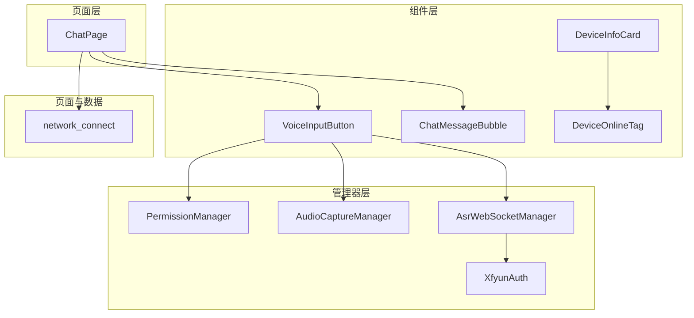
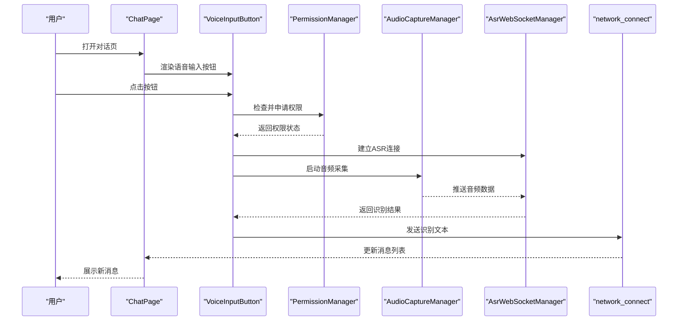
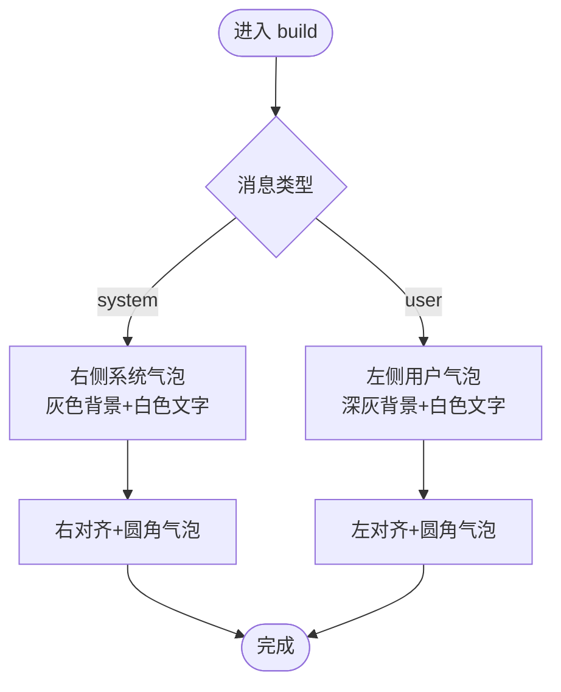
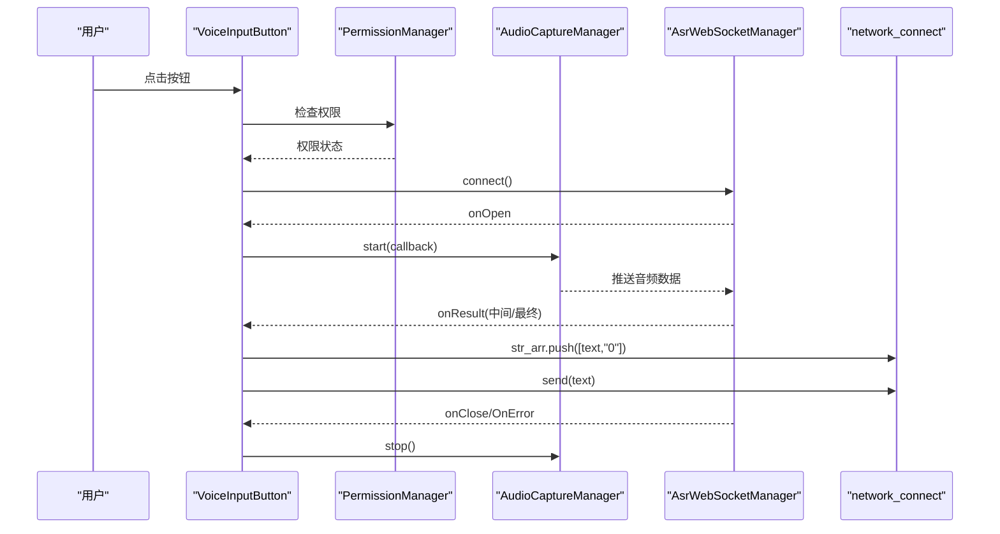
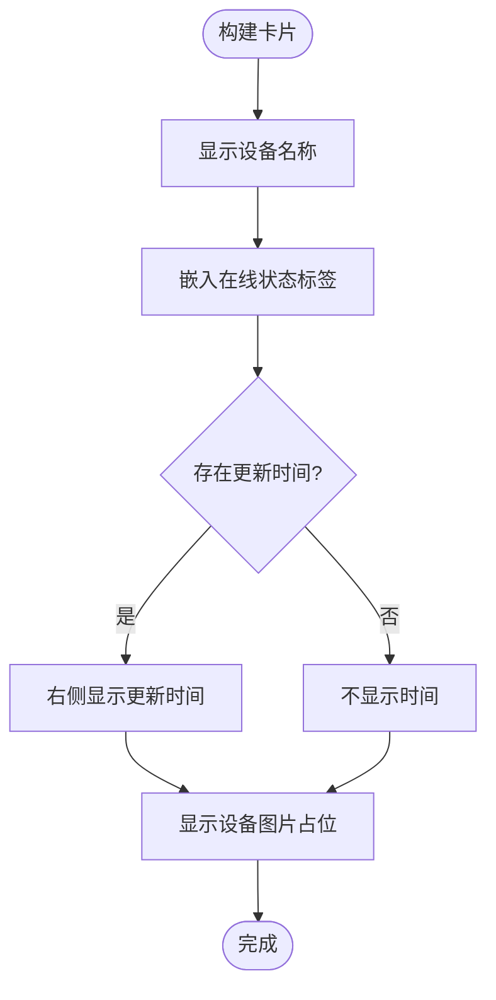
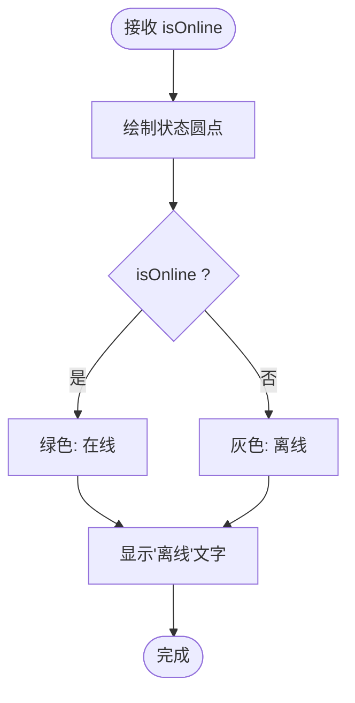
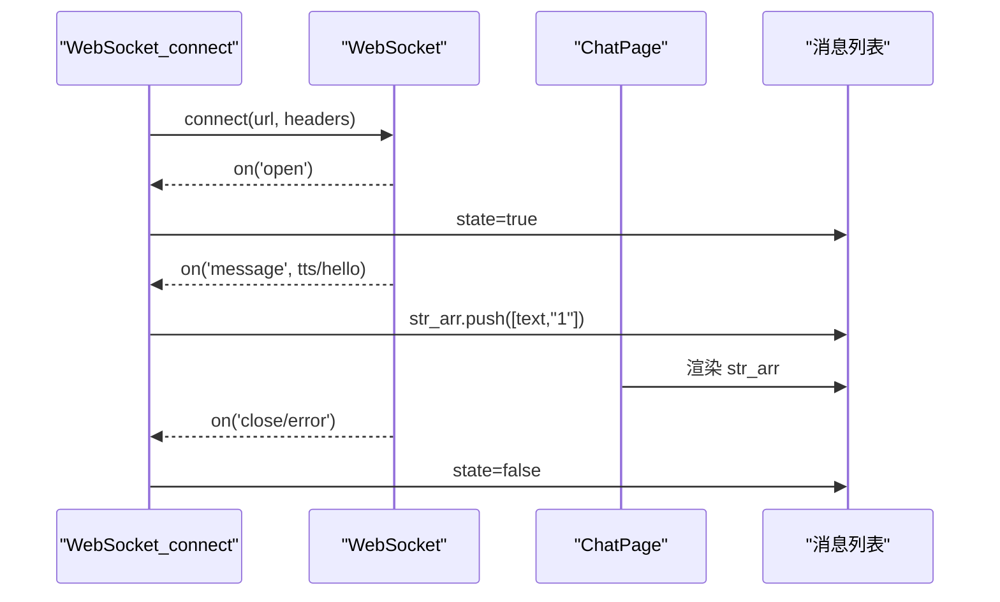
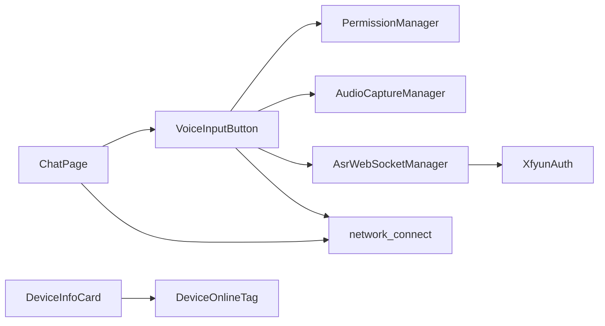
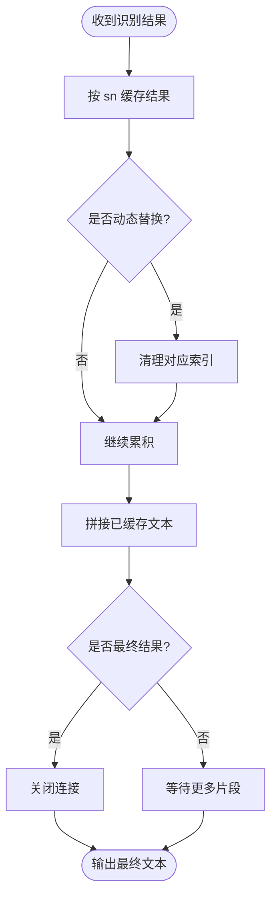

# 通信组件

<cite>
**本文引用的文件**
- [ChatMessageBubble.ets](file://entry/src/main/ets/components/chat/ChatMessageBubble.ets)
- [VoiceInputButton.ets](file://entry/src/main/ets/components/chat/VoiceInputButton.ets)
- [DeviceInfoCard.ets](file://entry/src/main/ets/components/device/DeviceInfoCard.ets)
- [DeviceOnlineTag.ets](file://entry/src/main/ets/components/device/DeviceOnlineTag.ets)
- [AudioCaptureManager.ets](file://entry/src/main/ets/managers/AudioCaptureManager.ets)
- [PermissionManager.ets](file://entry/src/main/ets/managers/PermissionManager.ets)
- [AsrWebSocketManager.ets](file://entry/src/main/ets/managers/AsrWebSocketManager.ets)
- [network_connect.ets](file://entry/src/main/ets/pages/network_connect.ets)
- [ChatPage.ets](file://entry/src/main/ets/pages/ChatPage.ets)
- [AppColors.ets](file://entry/src/main/ets/constants/AppColors.ets)
- [AppDimensions.ets](file://entry/src/main/ets/constants/AppDimensions.ets)
- [XfyunAuth.ets](file://entry/src/main/ets/managers/XfyunAuth.ets)
- [Constants.ets](file://entry/src/main/ets/common/Constants.ets)
- [ChatMessage.ets](file://entry/src/main/ets/models/ChatMessage.ets)
- [string.json](file://entry/src/main/resources/base/element/string.json)
- [layered_image.json](file://entry/src/main/resources/base/media/layered_image.json)
</cite>

## 目录
1. [简介](#简介)
2. [项目结构](#项目结构)
3. [核心组件](#核心组件)
4. [架构总览](#架构总览)
5. [详细组件分析](#详细组件分析)
6. [依赖关系分析](#依赖关系分析)
7. [性能考量](#性能考量)
8. [故障排查指南](#故障排查指南)
9. [结论](#结论)
10. [附录](#附录)

## 简介
本文件面向开发者，系统性梳理通信组件的设计与实现，覆盖以下主题：
- 聊天消息气泡：消息布局、时间戳显示与消息状态指示
- 语音输入按钮：音频采集、权限管理、语音识别集成与交互反馈
- 设备信息卡片：设备状态、参数展示与交互功能
- 设备在线状态标签：状态检测、颜色编码与实时更新
- 组件间通信：事件传递、状态同步与数据绑定
- 网络状态处理与错误恢复机制
- 自定义通信组件的创建指导与设计规范

## 项目结构
通信组件主要位于 entry/src/main/ets/components 下，配合 managers、constants、models、pages 等模块协同工作。核心文件分布如下：
- 组件层：chat、device、control、sensor、log 等目录下的组件
- 管理器层：权限、音频采集、ASR WebSocket、讯飞鉴权等
- 页面层：ChatPage、DeviceHomePage、DataHomePage 等
- 常量与模型：AppColors、AppDimensions、ChatMessage、Constants
- 资源：字符串与媒体资源

图表来源
- [ChatPage.ets](file://entry/src/main/ets/pages/ChatPage.ets)
- [VoiceInputButton.ets](file://entry/src/main/ets/components/chat/VoiceInputButton.ets)
- [ChatMessageBubble.ets](file://entry/src/main/ets/components/chat/ChatMessageBubble.ets)
- [DeviceInfoCard.ets](file://entry/src/main/ets/components/device/DeviceInfoCard.ets)
- [DeviceOnlineTag.ets](file://entry/src/main/ets/components/device/DeviceOnlineTag.ets)
- [PermissionManager.ets](file://entry/src/main/ets/managers/PermissionManager.ets)
- [AudioCaptureManager.ets](file://entry/src/main/ets/managers/AudioCaptureManager.ets)
- [AsrWebSocketManager.ets](file://entry/src/main/ets/managers/AsrWebSocketManager.ets)
- [XfyunAuth.ets](file://entry/src/main/ets/managers/XfyunAuth.ets)
- [network_connect.ets](file://entry/src/main/ets/pages/network_connect.ets)

章节来源
- [ChatPage.ets](file://entry/src/main/ets/pages/ChatPage.ets)
- [network_connect.ets](file://entry/src/main/ets/pages/network_connect.ets)

## 核心组件
- 聊天消息气泡：根据消息类型渲染不同对齐与样式，支持系统消息与用户消息的视觉区分
- 语音输入按钮：封装权限检查、音频采集、ASR WebSocket 连接、识别结果回显与设备指令下发
- 设备信息卡片：展示设备名称、在线状态与更新时间，并提供占位图片
- 设备在线状态标签：以圆点与文字呈现在线/离线状态，采用语义化颜色与背景
- 网络连接管理：负责 WebSocket 连接、消息收发、WiFi 监听与自动重连

章节来源
- [ChatMessageBubble.ets](file://entry/src/main/ets/components/chat/ChatMessageBubble.ets)
- [VoiceInputButton.ets](file://entry/src/main/ets/components/chat/VoiceInputButton.ets)
- [DeviceInfoCard.ets](file://entry/src/main/ets/components/device/DeviceInfoCard.ets)
- [DeviceOnlineTag.ets](file://entry/src/main/ets/components/device/DeviceOnlineTag.ets)
- [network_connect.ets](file://entry/src/main/ets/pages/network_connect.ets)

## 架构总览
通信组件围绕“页面-组件-管理器-网络”的分层设计展开。页面负责组织布局与状态，组件负责 UI 展示与交互，管理器负责具体能力（权限、音频、ASR、鉴权），网络层负责与服务端通信。

图表来源
- [ChatPage.ets](file://entry/src/main/ets/pages/ChatPage.ets)
- [VoiceInputButton.ets](file://entry/src/main/ets/components/chat/VoiceInputButton.ets)
- [PermissionManager.ets](file://entry/src/main/ets/managers/PermissionManager.ets)
- [AudioCaptureManager.ets](file://entry/src/main/ets/managers/AudioCaptureManager.ets)
- [AsrWebSocketManager.ets](file://entry/src/main/ets/managers/AsrWebSocketManager.ets)
- [network_connect.ets](file://entry/src/main/ets/pages/network_connect.ets)

## 详细组件分析

### 聊天消息气泡（ChatMessageBubble）
- 设计要点
  - 根据消息类型（系统/用户）选择对齐方式与背景色，形成左右气泡布局
  - 使用统一的圆角与内边距，保证视觉一致性
- 数据模型
  - ChatMessage 包含 id、type、content、timestamp，用于驱动渲染
- 布局与样式
  - 通过 Row/Column/FlexAlign 实现对齐与间距
  - 使用 AppColors 与 AppDimensions 统一样式常量

图表来源
- [ChatMessageBubble.ets](file://entry/src/main/ets/components/chat/ChatMessageBubble.ets)
- [ChatMessage.ets](file://entry/src/main/ets/models/ChatMessage.ets)
- [AppColors.ets](file://entry/src/main/ets/constants/AppColors.ets)
- [AppDimensions.ets](file://entry/src/main/ets/constants/AppDimensions.ets)

章节来源
- [ChatMessageBubble.ets](file://entry/src/main/ets/components/chat/ChatMessageBubble.ets)
- [ChatMessage.ets](file://entry/src/main/ets/models/ChatMessage.ets)
- [AppColors.ets](file://entry/src/main/ets/constants/AppColors.ets)
- [AppDimensions.ets](file://entry/src/main/ets/constants/AppDimensions.ets)

### 语音输入按钮（VoiceInputButton）
- 功能概览
  - 生命周期：初始化时检查权限、初始化音频采集、设置 ASR 回调
  - 录音控制：开始/停止录音，发送音频帧，结束识别
  - 结果处理：显示中间/最终识别文本，向网络层推送指令并尝试发送设备控制命令
  - 状态反馈：根据录音状态切换按钮颜色与提示文案
- 权限管理
  - 使用 PermissionManager 检查并申请麦克风与网络权限
- 音频采集
  - AudioCaptureManager 提供初始化、启动、停止与释放
- 语音识别
  - AsrWebSocketManager 负责连接、发送开始帧、音频帧、结束帧与解析识别结果
  - XfyunAuth 生成鉴权 URL
- 与网络层集成
  - 识别完成后将用户消息加入网络层的消息数组，并尝试发送设备指令
  - 识别结果也作为服务端消息被网络层接收并展示

图表来源
- [VoiceInputButton.ets](file://entry/src/main/ets/components/chat/VoiceInputButton.ets)
- [PermissionManager.ets](file://entry/src/main/ets/managers/PermissionManager.ets)
- [AudioCaptureManager.ets](file://entry/src/main/ets/managers/AudioCaptureManager.ets)
- [AsrWebSocketManager.ets](file://entry/src/main/ets/managers/AsrWebSocketManager.ets)
- [network_connect.ets](file://entry/src/main/ets/pages/network_connect.ets)

章节来源
- [VoiceInputButton.ets](file://entry/src/main/ets/components/chat/VoiceInputButton.ets)
- [PermissionManager.ets](file://entry/src/main/ets/managers/PermissionManager.ets)
- [AudioCaptureManager.ets](file://entry/src/main/ets/managers/AudioCaptureManager.ets)
- [AsrWebSocketManager.ets](file://entry/src/main/ets/managers/AsrWebSocketManager.ets)
- [XfyunAuth.ets](file://entry/src/main/ets/managers/XfyunAuth.ets)
- [network_connect.ets](file://entry/src/main/ets/pages/network_connect.ets)

### 设备信息卡片（DeviceInfoCard）
- 展示内容
  - 设备名称、在线状态标签、更新时间与设备图片占位
- 布局策略
  - 左侧设备名与在线标签，右侧更新时间，居中对齐
  - 使用 AppDimensions 的间距与字号常量
- 与在线标签组合
  - 通过 DeviceOnlineTag 统一在线/离线状态展示

图表来源
- [DeviceInfoCard.ets](file://entry/src/main/ets/components/device/DeviceInfoCard.ets)
- [DeviceOnlineTag.ets](file://entry/src/main/ets/components/device/DeviceOnlineTag.ets)
- [AppDimensions.ets](file://entry/src/main/ets/constants/AppDimensions.ets)
- [AppColors.ets](file://entry/src/main/ets/constants/AppColors.ets)

章节来源
- [DeviceInfoCard.ets](file://entry/src/main/ets/components/device/DeviceInfoCard.ets)
- [DeviceOnlineTag.ets](file://entry/src/main/ets/components/device/DeviceOnlineTag.ets)
- [AppDimensions.ets](file://entry/src/main/ets/constants/AppDimensions.ets)
- [AppColors.ets](file://entry/src/main/ets/constants/AppColors.ets)

### 设备在线状态标签（DeviceOnlineTag）
- 设计原则
  - 圆点表示状态，文字说明在线/离线
  - 使用 AppColors 的 SUCCESS 与 TEXT_DISABLED 实现语义化颜色
  - 轻量背景与圆角提升可读性
- 实时更新
  - 由父组件传入 isOnline，随设备状态变化而刷新

图表来源
- [DeviceOnlineTag.ets](file://entry/src/main/ets/components/device/DeviceOnlineTag.ets)
- [AppColors.ets](file://entry/src/main/ets/constants/AppColors.ets)
- [AppDimensions.ets](file://entry/src/main/ets/constants/AppDimensions.ets)

章节来源
- [DeviceOnlineTag.ets](file://entry/src/main/ets/components/device/DeviceOnlineTag.ets)
- [AppColors.ets](file://entry/src/main/ets/constants/AppColors.ets)
- [AppDimensions.ets](file://entry/src/main/ets/constants/AppDimensions.ets)

### 网络连接与消息展示（network_connect 与 ChatPage）
- 网络连接
  - WebSocket_connect 负责连接、事件绑定、消息收发、自动重连与 WiFi 监听
  - 支持状态标记（在线/离线）、会话 ID 管理与请求去重
- 消息展示
  - ChatPage 通过遍历 network_connect.str_arr 渲染消息列表
  - 用户消息与服务端消息分别使用不同气泡样式与对齐

图表来源
- [network_connect.ets](file://entry/src/main/ets/pages/network_connect.ets)
- [ChatPage.ets](file://entry/src/main/ets/pages/ChatPage.ets)

章节来源
- [network_connect.ets](file://entry/src/main/ets/pages/network_connect.ets)
- [ChatPage.ets](file://entry/src/main/ets/pages/ChatPage.ets)

## 依赖关系分析
- 组件耦合
  - VoiceInputButton 依赖 PermissionManager、AudioCaptureManager、AsrWebSocketManager、network_connect
  - DeviceInfoCard 依赖 DeviceOnlineTag
  - ChatPage 依赖 network_connect 与组件
- 外部依赖
  - 音频采集与 WebSocket 由系统能力提供
  - 讯飞 ASR 需要鉴权 URL 与特定帧格式
- 潜在风险
  - 权限未授予导致无法录音
  - 网络波动引发连接中断与重连风暴
  - ASR 结果乱序需缓存与拼接

图表来源
- [VoiceInputButton.ets](file://entry/src/main/ets/components/chat/VoiceInputButton.ets)
- [PermissionManager.ets](file://entry/src/main/ets/managers/PermissionManager.ets)
- [AudioCaptureManager.ets](file://entry/src/main/ets/managers/AudioCaptureManager.ets)
- [AsrWebSocketManager.ets](file://entry/src/main/ets/managers/AsrWebSocketManager.ets)
- [XfyunAuth.ets](file://entry/src/main/ets/managers/XfyunAuth.ets)
- [network_connect.ets](file://entry/src/main/ets/pages/network_connect.ets)
- [ChatPage.ets](file://entry/src/main/ets/pages/ChatPage.ets)
- [DeviceInfoCard.ets](file://entry/src/main/ets/components/device/DeviceInfoCard.ets)
- [DeviceOnlineTag.ets](file://entry/src/main/ets/components/device/DeviceOnlineTag.ets)

章节来源
- [VoiceInputButton.ets](file://entry/src/main/ets/components/chat/VoiceInputButton.ets)
- [network_connect.ets](file://entry/src/main/ets/pages/network_connect.ets)
- [ChatPage.ets](file://entry/src/main/ets/pages/ChatPage.ets)

## 性能考量
- 音频采集
  - 使用固定采样率与单声道，降低传输与识别成本
  - 事件驱动推送音频数据，避免轮询
- ASR 识别
  - 采用 WebSocket 流式传输，减少延迟
  - 结果缓存与乱序处理，确保最终文本正确拼接
- 网络连接
  - WiFi 状态监听与延迟重连，避免频繁抖动
  - 请求去重与超时控制，提升稳定性
- UI 渲染
  - 列表使用虚拟化与滚动优化，减少重绘

## 故障排查指南
- 无声音/无法录音
  - 检查权限是否授予；若未授予，引导用户授权
  - 确认 AudioCaptureManager 初始化与启动流程
- 识别失败/无结果
  - 查看 ASR WebSocket 连接日志与错误回调
  - 确认鉴权 URL 生成与网络可达性
- 网络断开/消息不显示
  - 检查 WebSocket 状态与自动重连逻辑
  - 确认消息数组更新与页面渲染绑定
- 状态不同步
  - 确保 @ObservedV2/@Local 状态正确响应
  - 检查父子组件 props 传递与默认值

章节来源
- [PermissionManager.ets](file://entry/src/main/ets/managers/PermissionManager.ets)
- [AudioCaptureManager.ets](file://entry/src/main/ets/managers/AudioCaptureManager.ets)
- [AsrWebSocketManager.ets](file://entry/src/main/ets/managers/AsrWebSocketManager.ets)
- [network_connect.ets](file://entry/src/main/ets/pages/network_connect.ets)

## 结论
通信组件通过清晰的分层与职责划分，实现了从语音输入到消息展示的完整闭环。权限管理、音频采集、ASR 集成与网络连接均具备完善的错误处理与状态反馈，适合在多设备场景下扩展与复用。

## 附录

### 设计规范与最佳实践
- 组件设计
  - 单一职责：每个组件专注一个功能域
  - Props 明确：对外暴露必要的只读属性
  - 状态本地化：仅在组件内部维护与 UI 相关的状态
- 数据流
  - 自上而下传递：页面持有全局状态，组件通过 props 获取
  - 事件向上冒泡：组件通过回调通知页面更新
- 样式与主题
  - 使用 AppColors 与 AppDimensions 统一风格
  - 语义化颜色：成功/警告/错误/信息明确区分
- 权限与安全
  - 在首次使用前检查并申请权限
  - 对敏感操作提供用户确认与降级路径
- 网络与错误处理
  - 连接失败时提供重试与提示
  - 对不可恢复错误进行降级展示与日志记录
- 可扩展性
  - 将平台能力抽象为管理器类，便于替换与测试
  - 保持接口稳定，新增功能以组合为主

### 关键流程图（算法实现）
- ASR 结果拼接与乱序处理

图表来源
- [AsrWebSocketManager.ets](file://entry/src/main/ets/managers/AsrWebSocketManager.ets)