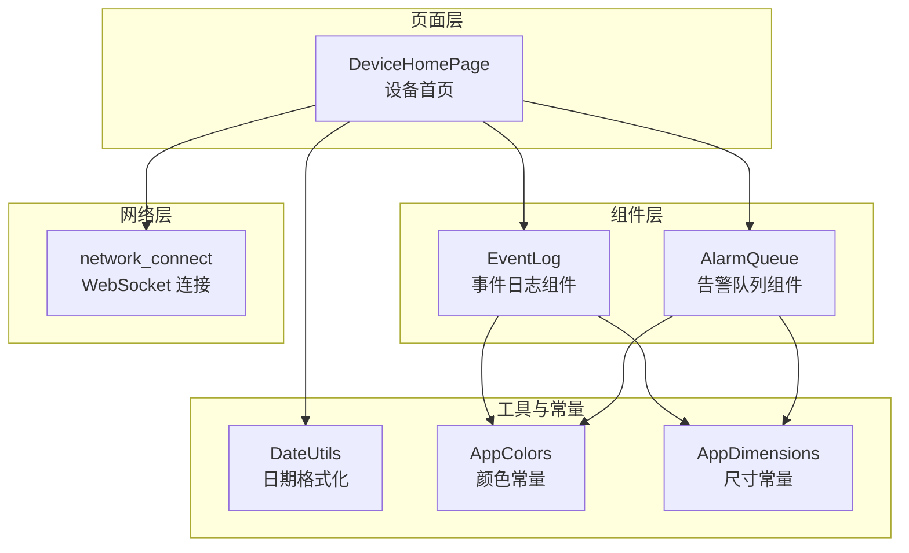
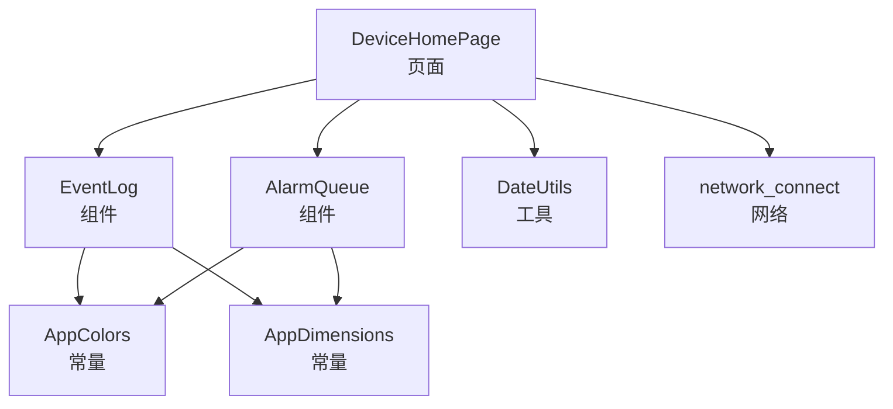
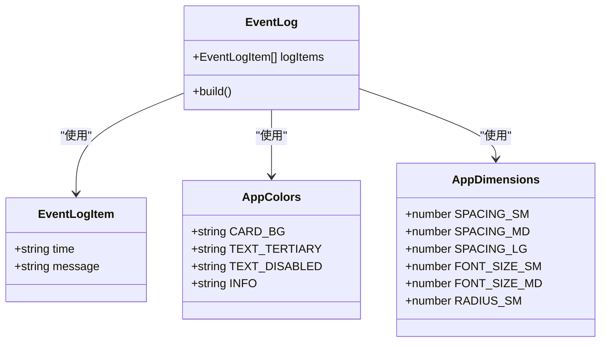
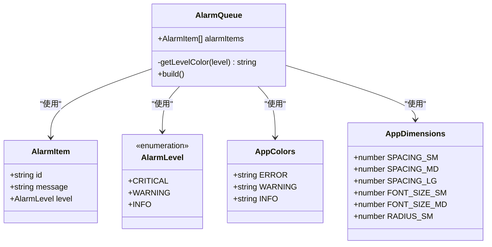
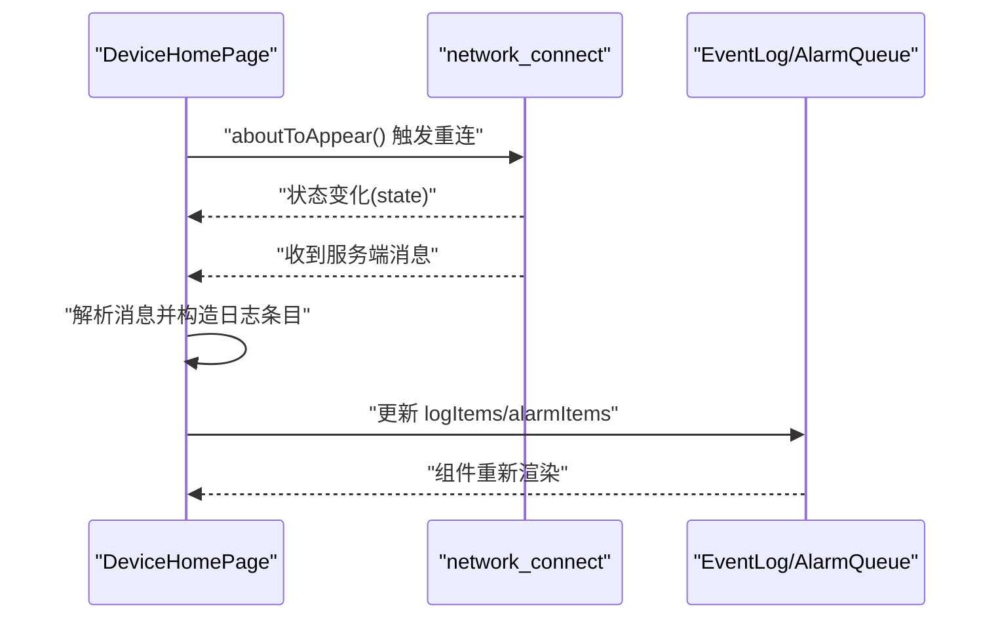
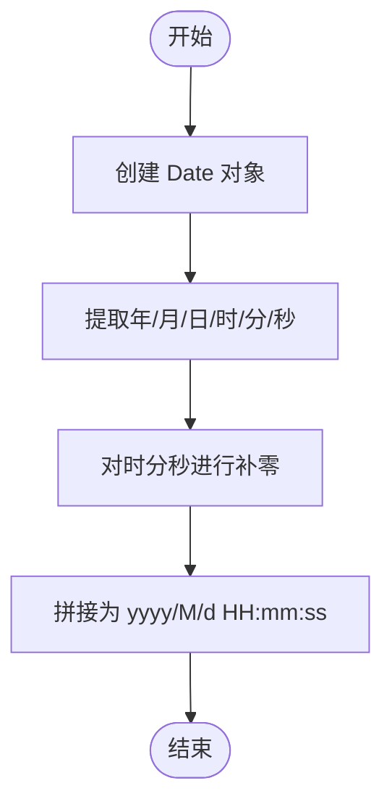
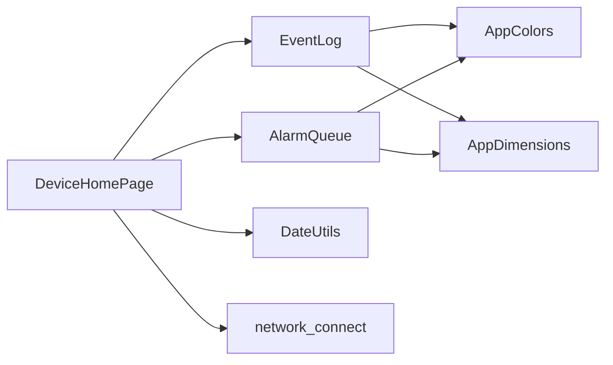

# 事件日志管理

<cite>
**本文引用的文件**
- [EventLog.ets](file://entry/src/main/ets/components/log/EventLog.ets)
- [AlarmQueue.ets](file://entry/src/main/ets/components/log/AlarmQueue.ets)
- [DeviceHomePage.ets](file://entry/src/main/ets/pages/DeviceHomePage.ets)
- [DateUtils.ets](file://entry/src/main/ets/utils/DateUtils.ets)
- [AppColors.ets](file://entry/src/main/ets/constants/AppColors.ets)
- [AppDimensions.ets](file://entry/src/main/ets/constants/AppDimensions.ets)
- [network_connect.ets](file://entry/src/main/ets/pages/network_connect.ets)
</cite>

## 目录
1. [简介](#简介)
2. [项目结构](#项目结构)
3. [核心组件](#核心组件)
4. [架构概览](#架构概览)
5. [详细组件分析](#详细组件分析)
6. [依赖关系分析](#依赖关系分析)
7. [性能考虑](#性能考虑)
8. [故障排查指南](#故障排查指南)
9. [结论](#结论)
10. [附录](#附录)

## 简介
本文件面向“事件日志管理系统”的设计与实现，聚焦于日志组件的数据结构、显示格式与布局、分类与过滤机制、实时更新与滚动机制、持久化存储方案以及查询与搜索能力。通过对仓库中现有组件的深入分析，结合页面集成与网络层交互，给出可操作的架构说明与最佳实践建议。

## 项目结构
事件日志相关代码主要分布在以下位置：
- 组件层：事件日志与告警队列组件位于 components/log 目录
- 页面层：设备首页页面集成日志组件并展示初始数据
- 工具与常量：颜色与尺寸常量、日期格式化工具
- 网络层：WebSocket 连接与消息处理，为日志的实时更新提供基础

**图表来源**
- [DeviceHomePage.ets:12-73](file://entry/src/main/ets/pages/DeviceHomePage.ets#L12-L73)
- [EventLog.ets:18-78](file://entry/src/main/ets/components/log/EventLog.ets#L18-L78)
- [AlarmQueue.ets:32-105](file://entry/src/main/ets/components/log/AlarmQueue.ets#L32-L105)
- [DateUtils.ets:4-28](file://entry/src/main/ets/utils/DateUtils.ets#L4-L28)
- [AppColors.ets:5-47](file://entry/src/main/ets/constants/AppColors.ets#L5-L47)
- [AppDimensions.ets:5-40](file://entry/src/main/ets/constants/AppDimensions.ets#L5-L40)
- [network_connect.ets:38-322](file://entry/src/main/ets/pages/network_connect.ets#L38-L322)

**章节来源**
- [DeviceHomePage.ets:12-73](file://entry/src/main/ets/pages/DeviceHomePage.ets#L12-L73)
- [EventLog.ets:18-78](file://entry/src/main/ets/components/log/EventLog.ets#L18-L78)
- [AlarmQueue.ets:32-105](file://entry/src/main/ets/components/log/AlarmQueue.ets#L32-L105)
- [DateUtils.ets:4-28](file://entry/src/main/ets/utils/DateUtils.ets#L4-L28)
- [AppColors.ets:5-47](file://entry/src/main/ets/constants/AppColors.ets#L5-L47)
- [AppDimensions.ets:5-40](file://entry/src/main/ets/constants/AppDimensions.ets#L5-L40)
- [network_connect.ets:38-322](file://entry/src/main/ets/pages/network_connect.ets#L38-L322)

## 核心组件
- 事件日志组件：负责渲染控制回执与系统事件追踪日志列表，支持空态提示与基础样式。
- 告警队列组件：负责渲染数值触发与联动事件的告警列表，按告警等级设置不同边框颜色。
- 页面集成：设备首页页面引入两个组件并提供初始数据，同时提供滚动容器承载内容。
- 工具与常量：统一的颜色与尺寸常量，日期格式化工具用于生成时间戳字符串。
- 网络层：WebSocket 连接与消息处理，为日志的实时更新提供基础。

**章节来源**
- [EventLog.ets:7-12](file://entry/src/main/ets/components/log/EventLog.ets#L7-L12)
- [AlarmQueue.ets:19-26](file://entry/src/main/ets/components/log/AlarmQueue.ets#L19-L26)
- [DeviceHomePage.ets:14-20](file://entry/src/main/ets/pages/DeviceHomePage.ets#L14-L20)
- [DateUtils.ets:10-27](file://entry/src/main/ets/utils/DateUtils.ets#L10-L27)
- [network_connect.ets:149-322](file://entry/src/main/ets/pages/network_connect.ets#L149-L322)

## 架构概览
事件日志管理由“页面层 -> 组件层 -> 工具与常量 -> 网络层”构成。页面层负责组织布局与数据初始化；组件层负责渲染与样式；工具与常量提供一致的视觉与行为规范；网络层负责实时数据接入。

**图表来源**
- [DeviceHomePage.ets:27-64](file://entry/src/main/ets/pages/DeviceHomePage.ets#L27-L64)
- [EventLog.ets:18-78](file://entry/src/main/ets/components/log/EventLog.ets#L18-L78)
- [AlarmQueue.ets:32-105](file://entry/src/main/ets/components/log/AlarmQueue.ets#L32-L105)
- [DateUtils.ets:4-28](file://entry/src/main/ets/utils/DateUtils.ets#L4-L28)
- [AppColors.ets:5-47](file://entry/src/main/ets/constants/AppColors.ets#L5-L47)
- [AppDimensions.ets:5-40](file://entry/src/main/ets/constants/AppDimensions.ets#L5-L40)
- [network_connect.ets:38-322](file://entry/src/main/ets/pages/network_connect.ets#L38-L322)

## 详细组件分析

### 事件日志组件（EventLog）
- 数据结构
  - 事件日志条目包含时间戳与消息文本两个字段，时间戳采用字符串格式，便于直接展示。
- 显示格式与布局
  - 标题行包含主标题与副标题，使用字号与颜色区分层级。
  - 内容区为空时显示“暂无事件日志”，有数据时逐条渲染，每条日志采用带左侧彩色边框的卡片样式，文字颜色与圆角、内边距统一由常量控制。
- 实时更新与滚动
  - 页面层通过滚动容器承载日志区域，组件本身不包含自动滚动逻辑，需在上层页面或业务逻辑中实现滚动至底部的行为。
- 查询与搜索
  - 组件当前未实现关键词匹配与时间范围筛选等查询功能，可在上层页面扩展输入控件与过滤逻辑后传递给组件。

**图表来源**
- [EventLog.ets:7-12](file://entry/src/main/ets/components/log/EventLog.ets#L7-L12)
- [EventLog.ets:18-78](file://entry/src/main/ets/components/log/EventLog.ets#L18-L78)
- [AppColors.ets:5-47](file://entry/src/main/ets/constants/AppColors.ets#L5-L47)
- [AppDimensions.ets:5-40](file://entry/src/main/ets/constants/AppDimensions.ets#L5-L40)

**章节来源**
- [EventLog.ets:7-12](file://entry/src/main/ets/components/log/EventLog.ets#L7-L12)
- [EventLog.ets:18-78](file://entry/src/main/ets/components/log/EventLog.ets#L18-L78)
- [AppColors.ets:5-47](file://entry/src/main/ets/constants/AppColors.ets#L5-L47)
- [AppDimensions.ets:5-40](file://entry/src/main/ets/constants/AppDimensions.ets#L5-L40)

### 告警队列组件（AlarmQueue）
- 数据结构
  - 告警条目包含唯一 ID、消息文本与告警等级三部分；告警等级使用枚举类型，分别映射到不同颜色。
- 显示格式与布局
  - 标题行与内容区布局与事件日志类似，但内容区每条日志使用左侧彩色边框表示等级，颜色通过方法根据等级动态计算。
- 实时更新与滚动
  - 同样由页面层提供滚动容器，组件自身不包含自动滚动逻辑。
- 查询与搜索
  - 组件当前未实现筛选与排序功能，可在上层页面扩展筛选器后传递给组件。

**图表来源**
- [AlarmQueue.ets:7-14](file://entry/src/main/ets/components/log/AlarmQueue.ets#L7-L14)
- [AlarmQueue.ets:19-26](file://entry/src/main/ets/components/log/AlarmQueue.ets#L19-L26)
- [AlarmQueue.ets:32-105](file://entry/src/main/ets/components/log/AlarmQueue.ets#L32-L105)
- [AppColors.ets:5-47](file://entry/src/main/ets/constants/AppColors.ets#L5-L47)
- [AppDimensions.ets:5-40](file://entry/src/main/ets/constants/AppDimensions.ets#L5-L40)

**章节来源**
- [AlarmQueue.ets:7-14](file://entry/src/main/ets/components/log/AlarmQueue.ets#L7-L14)
- [AlarmQueue.ets:19-26](file://entry/src/main/ets/components/log/AlarmQueue.ets#L19-L26)
- [AlarmQueue.ets:32-105](file://entry/src/main/ets/components/log/AlarmQueue.ets#L32-L105)
- [AppColors.ets:5-47](file://entry/src/main/ets/constants/AppColors.ets#L5-L47)
- [AppDimensions.ets:5-40](file://entry/src/main/ets/constants/AppDimensions.ets#L5-L40)

### 页面集成与实时更新流程
- 页面初始化
  - 设备首页页面在生命周期钩子中更新时间戳，并触发网络重连。
  - 页面中包含事件日志与告警队列组件，并提供初始数据。
- 实时更新
  - 网络层通过 WebSocket 接收服务端消息，当前用于语音识别与会话管理，尚未直接驱动日志组件更新。
  - 可在消息到达时，将新事件封装为日志条目并推送到页面的 logItems 列表，从而触发组件刷新。

**图表来源**
- [DeviceHomePage.ets:22-25](file://entry/src/main/ets/pages/DeviceHomePage.ets#L22-L25)
- [network_connect.ets:182-261](file://entry/src/main/ets/pages/network_connect.ets#L182-L261)
- [EventLog.ets:18-78](file://entry/src/main/ets/components/log/EventLog.ets#L18-L78)
- [AlarmQueue.ets:32-105](file://entry/src/main/ets/components/log/AlarmQueue.ets#L32-L105)

**章节来源**
- [DeviceHomePage.ets:22-25](file://entry/src/main/ets/pages/DeviceHomePage.ets#L22-L25)
- [network_connect.ets:182-261](file://entry/src/main/ets/pages/network_connect.ets#L182-L261)
- [EventLog.ets:18-78](file://entry/src/main/ets/components/log/EventLog.ets#L18-L78)
- [AlarmQueue.ets:32-105](file://entry/src/main/ets/components/log/AlarmQueue.ets#L32-L105)

### 日期格式化与时间戳
- 日期格式化工具提供将 Date 对象格式化为字符串的方法，返回格式包含年月日与时分秒，适合直接作为事件时间戳使用。
- 页面在进入时调用该工具生成当前时间字符串，组件内部亦可复用相同格式。

**图表来源**
- [DateUtils.ets:10-27](file://entry/src/main/ets/utils/DateUtils.ets#L10-L27)

**章节来源**
- [DateUtils.ets:10-27](file://entry/src/main/ets/utils/DateUtils.ets#L10-L27)
- [DeviceHomePage.ets:22-24](file://entry/src/main/ets/pages/DeviceHomePage.ets#L22-L24)

## 依赖关系分析
- 组件依赖
  - 事件日志与告警队列均依赖颜色与尺寸常量，保证视觉一致性。
  - 页面依赖日期格式化工具生成时间戳，并依赖网络层提供在线状态与消息。
- 耦合与内聚
  - 组件职责清晰，内聚性良好；页面承担数据聚合与状态管理，组件仅负责展示。
- 外部依赖
  - 网络层基于 WebSocket，当前用于语音识别场景，尚未直接与日志组件耦合。

**图表来源**
- [EventLog.ets:1-3](file://entry/src/main/ets/components/log/EventLog.ets#L1-L3)
- [AlarmQueue.ets:1-2](file://entry/src/main/ets/components/log/AlarmQueue.ets#L1-L2)
- [DeviceHomePage.ets:4-7](file://entry/src/main/ets/pages/DeviceHomePage.ets#L4-L7)
- [DateUtils.ets:4-28](file://entry/src/main/ets/utils/DateUtils.ets#L4-L28)
- [network_connect.ets:38-322](file://entry/src/main/ets/pages/network_connect.ets#L38-L322)

**章节来源**
- [EventLog.ets:1-3](file://entry/src/main/ets/components/log/EventLog.ets#L1-L3)
- [AlarmQueue.ets:1-2](file://entry/src/main/ets/components/log/AlarmQueue.ets#L1-L2)
- [DeviceHomePage.ets:4-7](file://entry/src/main/ets/pages/DeviceHomePage.ets#L4-L7)
- [DateUtils.ets:4-28](file://entry/src/main/ets/utils/DateUtils.ets#L4-L28)
- [network_connect.ets:38-322](file://entry/src/main/ets/pages/network_connect.ets#L38-L322)

## 性能考虑
- 渲染性能
  - 使用虚拟列表或分页加载大量日志，避免一次性渲染过多节点导致卡顿。
  - 对频繁更新的日志列表，采用浅比较与不可变更新策略，减少不必要的重渲染。
- 滚动性能
  - 在页面层启用滚动容器并合理设置滚动条与边缘效果，避免过度绘制。
  - 自动滚动至底部时，优先使用滚动容器的定位 API，避免强制刷新。
- 网络与内存
  - WebSocket 连接应具备断线重连与背压控制，避免消息堆积造成内存压力。
  - 对历史日志进行上限控制与定期清理，防止无限增长。

## 故障排查指南
- 日志不显示
  - 检查页面是否正确初始化了日志数组，组件在空数组时会显示“暂无事件日志”。
- 告警颜色不正确
  - 确认告警等级枚举值与颜色映射方法一致，避免传入未知等级导致默认颜色。
- 时间戳格式异常
  - 确保使用日期格式化工具生成时间戳，避免手动拼接导致格式不一致。
- 网络连接问题
  - 查看网络层日志输出，确认 WebSocket 是否正常打开与接收消息；若异常，检查 IP、头部参数与权限配置。
- 滚动异常
  - 确认页面层的滚动容器已启用且内容高度足够；在自动滚动时避免频繁触发导致性能问题。

**章节来源**
- [DeviceHomePage.ets:14-20](file://entry/src/main/ets/pages/DeviceHomePage.ets#L14-L20)
- [AlarmQueue.ets:40-48](file://entry/src/main/ets/components/log/AlarmQueue.ets#L40-L48)
- [DateUtils.ets:10-27](file://entry/src/main/ets/utils/DateUtils.ets#L10-L27)
- [network_connect.ets:182-261](file://entry/src/main/ets/pages/network_connect.ets#L182-L261)

## 结论
事件日志管理系统的组件层已具备清晰的数据结构与稳定的渲染逻辑，页面层提供了统一的布局与初始数据。网络层为实时更新提供了基础，但尚未直接驱动日志组件。建议在现有基础上扩展：
- 实时更新：在网络层消息到达时，将事件封装为日志条目并推送至页面状态。
- 查询与搜索：在页面层增加输入控件与过滤逻辑，支持关键词匹配与时间范围筛选。
- 持久化与清理：结合本地缓存与数据库存储，设定容量上限与清理策略。
- 性能优化：采用虚拟列表、分页加载与自动滚动优化，确保大规模日志场景下的流畅体验。

## 附录
- 数据结构参考路径
  - [事件日志条目定义:7-12](file://entry/src/main/ets/components/log/EventLog.ets#L7-L12)
  - [告警条目与等级定义:7-26](file://entry/src/main/ets/components/log/AlarmQueue.ets#L7-L26)
- 组件实现参考路径
  - [事件日志组件:18-78](file://entry/src/main/ets/components/log/EventLog.ets#L18-L78)
  - [告警队列组件:32-105](file://entry/src/main/ets/components/log/AlarmQueue.ets#L32-L105)
- 页面集成参考路径
  - [设备首页页面:12-73](file://entry/src/main/ets/pages/DeviceHomePage.ets#L12-L73)
- 工具与常量参考路径
  - [日期格式化工具:4-28](file://entry/src/main/ets/utils/DateUtils.ets#L4-L28)
  - [颜色常量:5-47](file://entry/src/main/ets/constants/AppColors.ets#L5-L47)
  - [尺寸常量:5-40](file://entry/src/main/ets/constants/AppDimensions.ets#L5-L40)
- 网络层参考路径
  - [WebSocket 连接与消息处理:38-322](file://entry/src/main/ets/pages/network_connect.ets#L38-L322)