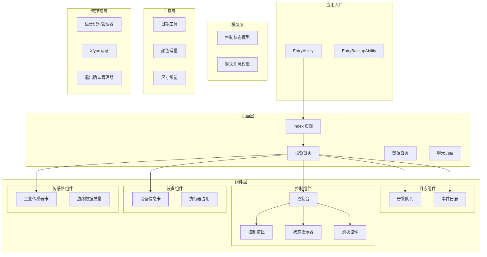
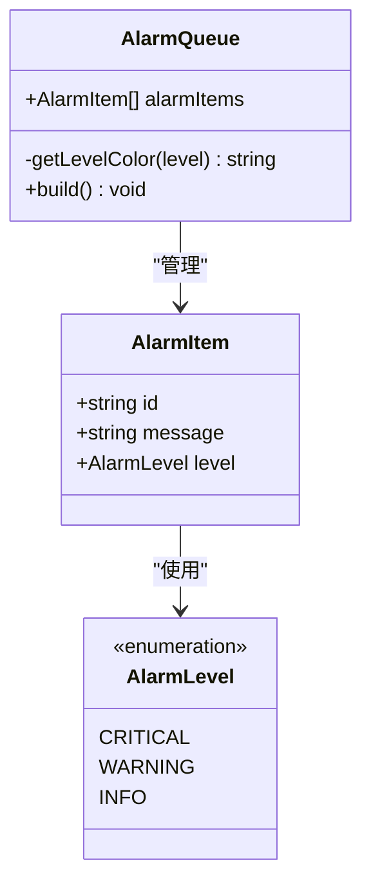
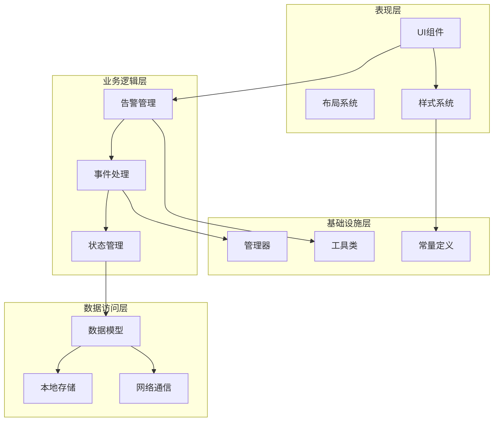
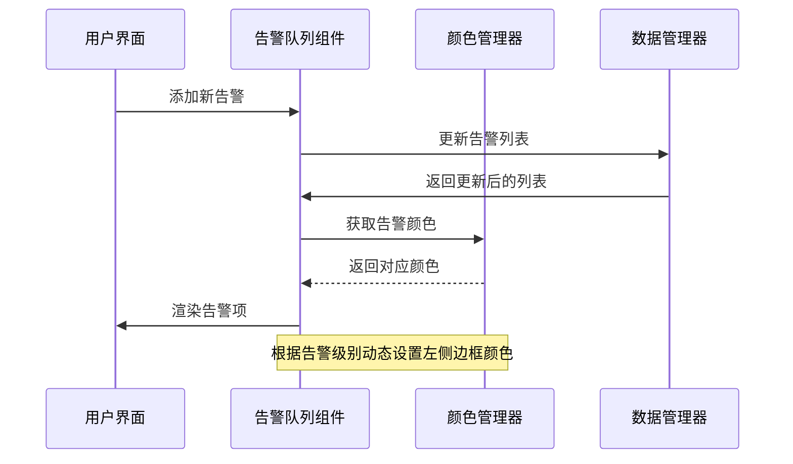
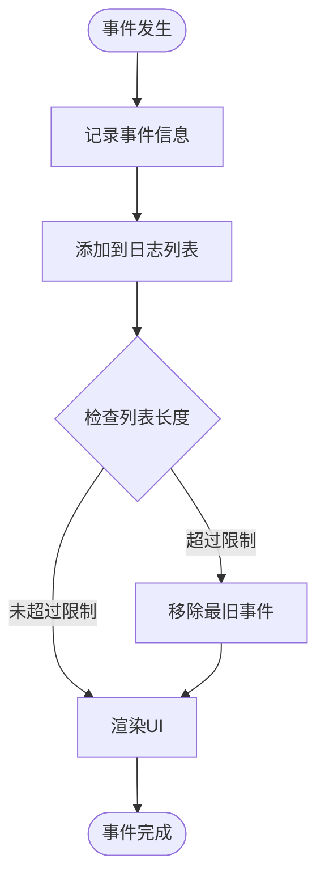
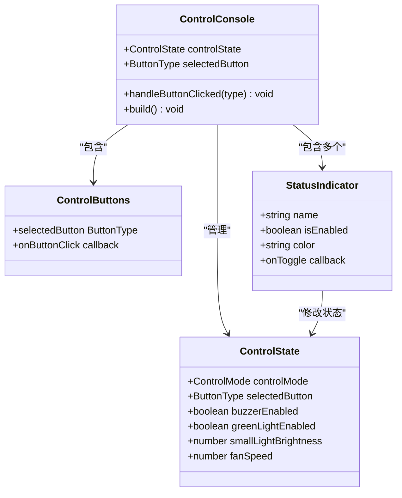
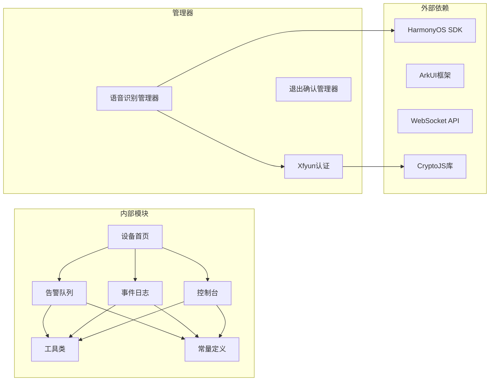

# 告警队列管理系统

<cite>
**本文档引用的文件**
- [AlarmQueue.ets](file://entry/src/main/ets/components/log/AlarmQueue.ets)
- [EventLog.ets](file://entry/src/main/ets/components/log/EventLog.ets)
- [DeviceHomePage.ets](file://entry/src/main/ets/pages/DeviceHomePage.ets)
- [AppColors.ets](file://entry/src/main/ets/constants/AppColors.ets)
- [AppDimensions.ets](file://entry/src/main/ets/constants/AppDimensions.ets)
- [DateUtils.ets](file://entry/src/main/ets/utils/DateUtils.ets)
- [ControlState.ets](file://entry/src/main/ets/models/ControlState.ets)
- [ControlConsole.ets](file://entry/src/main/ets/components/control/ControlConsole.ets)
- [IndustrialSensorCard.ets](file://entry/src/main/ets/components/sensor/IndustrialSensorCard.ets)
- [DeviceInfoCard.ets](file://entry/src/main/ets/components/device/DeviceInfoCard.ets)
- [Constants.ets](file://entry/src/main/ets/common/Constants.ets)
- [AsrWebSocketManager.ets](file://entry/src/main/ets/managers/AsrWebSocketManager.ets)
- [XfyunAuth.ets](file://entry/src/main/ets/managers/XfyunAuth.ets)
- [Index.ets](file://entry/src/main/ets/pages/Index.ets)
</cite>

## 目录
1. [简介](#简介)
2. [项目结构](#项目结构)
3. [核心组件](#核心组件)
4. [架构概览](#架构概览)
5. [详细组件分析](#详细组件分析)
6. [依赖关系分析](#依赖关系分析)
7. [性能考虑](#性能考虑)
8. [故障排除指南](#故障排除指南)
9. [结论](#结论)

## 简介

告警队列管理系统是一个基于HarmonyOS ArkTS框架开发的工业监控应用，专注于实时告警管理和可视化展示。该系统提供了完整的告警生命周期管理，包括告警生成、队列管理、优先级分类和多维度通知机制。

系统采用模块化架构设计，通过组件化的UI架构实现告警信息的实时展示和交互。核心功能涵盖告警级别定义、队列管理策略、历史记录追踪以及设备状态控制等多个方面。

## 项目结构

该项目采用基于功能域的组织方式，主要目录结构如下：

**图表来源**
- [Index.ets:13-115](file://entry/src/main/ets/pages/Index.ets#L13-L115)
- [DeviceHomePage.ets:12-73](file://entry/src/main/ets/pages/DeviceHomePage.ets#L12-L73)

**章节来源**
- [Index.ets:1-115](file://entry/src/main/ets/pages/Index.ets#L1-L115)
- [DeviceHomePage.ets:1-73](file://entry/src/main/ets/pages/DeviceHomePage.ets#L1-L73)

## 核心组件

### 告警级别定义

系统定义了三个层次的告警级别，每个级别都有明确的颜色标识和视觉表现：

| 告警级别 | 枚举值 | 颜色标识 | 视觉特征 | 用途场景 |
|---------|--------|----------|----------|----------|
| 严重告警 | `critical` | 红色 (#E74C3C) | 左侧红色边框 | 系统故障、安全威胁 |
| 警告 | `warning` | 橙色 (#F39C12) | 左侧橙色边框 | 参数越限、性能下降 |
| 提示 | `info` | 蓝色 (#3498DB) | 左侧蓝色边框 | 系统状态、正常提醒 |

### 告警数据模型

告警系统的核心数据结构采用简洁而实用的设计：

**图表来源**
- [AlarmQueue.ets:19-26](file://entry/src/main/ets/components/log/AlarmQueue.ets#L19-L26)
- [AlarmQueue.ets:7-14](file://entry/src/main/ets/components/log/AlarmQueue.ets#L7-L14)

### 颜色和尺寸管理

系统通过统一的常量管理器实现视觉风格的一致性：

- **颜色体系**：采用深色主题设计，支持主背景、次背景、文字、状态色等多层次配色
- **尺寸规范**：统一管理间距、圆角、字体大小、组件尺寸等设计规范
- **响应式布局**：支持不同屏幕尺寸的自适应布局

**章节来源**
- [AlarmQueue.ets:1-105](file://entry/src/main/ets/components/log/AlarmQueue.ets#L1-L105)
- [AppColors.ets:1-47](file://entry/src/main/ets/constants/AppColors.ets#L1-L47)
- [AppDimensions.ets:1-40](file://entry/src/main/ets/constants/AppDimensions.ets#L1-L40)

## 架构概览

系统采用分层架构设计，各层职责清晰分离：

**图表来源**
- [AlarmQueue.ets:32-103](file://entry/src/main/ets/components/log/AlarmQueue.ets#L32-L103)
- [DeviceHomePage.ets:12-54](file://entry/src/main/ets/pages/DeviceHomePage.ets#L12-L54)

系统的核心优势在于其模块化设计，使得各个组件可以独立开发、测试和维护，同时通过清晰的接口进行协作。

## 详细组件分析

### 告警队列组件

告警队列是系统的核心展示组件，负责实时显示和管理告警信息：

**图表来源**
- [AlarmQueue.ets:40-48](file://entry/src/main/ets/components/log/AlarmQueue.ets#L40-L48)
- [AlarmQueue.ets:77-94](file://entry/src/main/ets/components/log/AlarmQueue.ets#L77-L94)

#### 组件特性

1. **实时更新**：支持动态添加和移除告警项
2. **视觉反馈**：根据告警级别提供不同的颜色标识
3. **响应式设计**：适配不同屏幕尺寸
4. **无障碍支持**：提供适当的对比度和可读性

### 事件日志组件

事件日志组件提供系统事件的完整追踪能力：

**图表来源**
- [EventLog.ets:40-68](file://entry/src/main/ets/components/log/EventLog.ets#L40-L68)

#### 功能特点

- **时间戳记录**：精确记录事件发生时间
- **历史追踪**：完整保存事件历史
- **格式化显示**：统一的时间格式和消息格式
- **列表管理**：支持动态添加和清理

### 控制台组件

控制台组件提供设备状态的集中管理：

**图表来源**
- [ControlConsole.ets:14-172](file://entry/src/main/ets/components/control/ControlConsole.ets#L14-L172)
- [ControlState.ets:28-67](file://entry/src/main/ets/models/ControlState.ets#L28-L67)

**章节来源**
- [ControlConsole.ets:1-172](file://entry/src/main/ets/components/control/ControlConsole.ets#L1-L172)
- [ControlState.ets:1-67](file://entry/src/main/ets/models/ControlState.ets#L1-L67)

## 依赖关系分析

系统采用松耦合的设计原则，通过清晰的接口定义实现组件间的解耦：

**图表来源**
- [AlarmQueue.ets:1-3](file://entry/src/main/ets/components/log/AlarmQueue.ets#L1-L3)
- [AsrWebSocketManager.ets:1-6](file://entry/src/main/ets/managers/AsrWebSocketManager.ets#L1-L6)

### 关键依赖关系

1. **UI框架依赖**：基于ArkTS和ArkUI框架构建
2. **网络通信依赖**：使用WebSocket实现实时数据传输
3. **加密依赖**：使用CryptoJS进行安全认证
4. **系统API依赖**：依赖HarmonyOS的原生API

**章节来源**
- [AsrWebSocketManager.ets:1-271](file://entry/src/main/ets/managers/AsrWebSocketManager.ets#L1-L271)
- [XfyunAuth.ets:1-34](file://entry/src/main/ets/managers/XfyunAuth.ets#L1-L34)

## 性能考虑

### 内存管理

系统采用高效的内存管理模式：

- **组件复用**：通过ForEach实现列表项的高效渲染
- **状态管理**：使用@State和@Prop实现响应式更新
- **资源释放**：及时清理定时器和网络连接

### 渲染优化

- **虚拟DOM**：利用ArkTS的声明式UI减少不必要的重绘
- **懒加载**：仅在需要时渲染组件内容
- **批量更新**：合并状态变更以提高渲染效率

### 网络性能

- **连接池管理**：复用WebSocket连接避免频繁建立连接
- **数据压缩**：使用Base64编码减少传输数据量
- **错误重试**：实现智能的连接重试机制

## 故障排除指南

### 常见问题及解决方案

#### 告警显示异常

**问题症状**：告警项不显示或颜色错误

**可能原因**：
1. 告警级别枚举值错误
2. 颜色常量定义缺失
3. 组件状态未正确更新

**解决步骤**：
1. 检查AlarmLevel枚举定义
2. 验证AppColors中颜色常量
3. 确认@State装饰器使用正确

#### 网络连接问题

**问题症状**：WebSocket连接失败或断开

**可能原因**：
1. 认证信息过期
2. 网络环境不稳定
3. 服务器地址配置错误

**解决步骤**：
1. 重新生成认证URL
2. 检查网络连接状态
3. 验证服务器地址和端口

#### 性能问题

**问题症状**：界面卡顿或响应缓慢

**可能原因**：
1. 列表项过多导致渲染压力
2. 频繁的状态更新
3. 内存泄漏

**解决步骤**：
1. 实现列表虚拟化
2. 减少不必要的状态更新
3. 检查定时器和监听器的清理

**章节来源**
- [Constants.ets:19-82](file://entry/src/main/ets/common/Constants.ets#L19-L82)
- [AsrWebSocketManager.ets:92-144](file://entry/src/main/ets/managers/AsrWebSocketManager.ets#L92-L144)

## 结论

告警队列管理系统展现了现代工业监控应用的最佳实践，通过模块化设计、清晰的架构分层和完善的组件体系，实现了高效、可靠的告警管理功能。

### 主要成就

1. **架构完整性**：从UI组件到业务逻辑的完整实现
2. **用户体验**：直观的告警展示和及时的通知机制
3. **扩展性**：模块化设计支持功能扩展和定制
4. **可靠性**：完善的错误处理和性能优化

### 技术亮点

- 基于HarmonyOS生态的原生开发
- 响应式设计支持多设备适配
- 实时数据处理和展示
- 完善的错误处理和恢复机制

该系统为工业监控场景提供了坚实的技术基础，能够满足复杂环境下的告警管理需求，为后续的功能扩展和性能优化奠定了良好的基础。