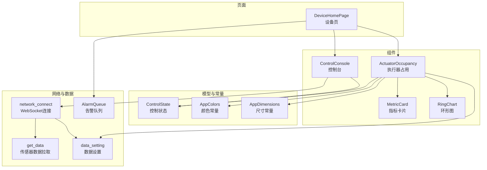
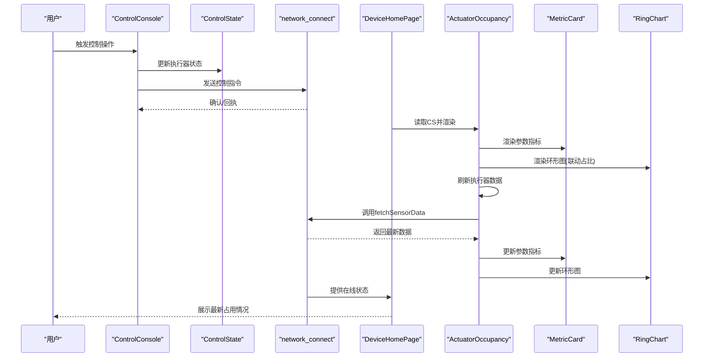
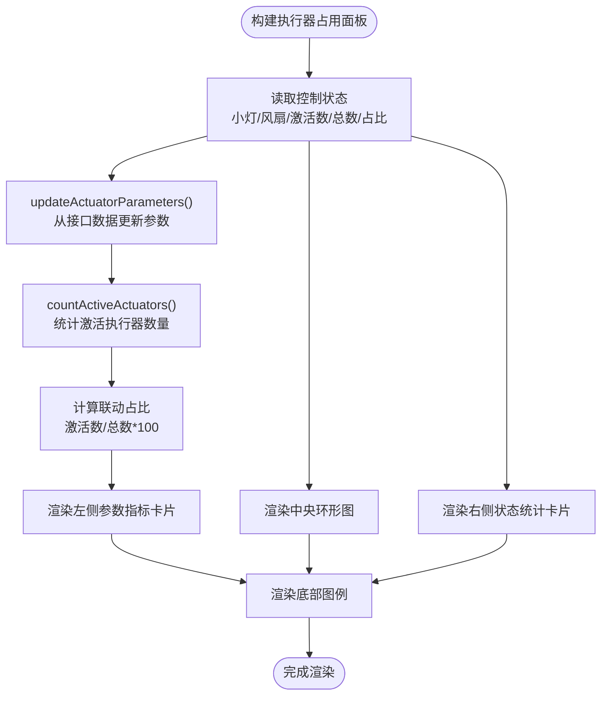
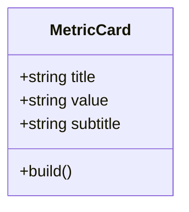
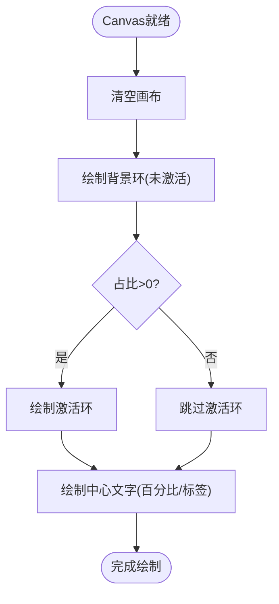
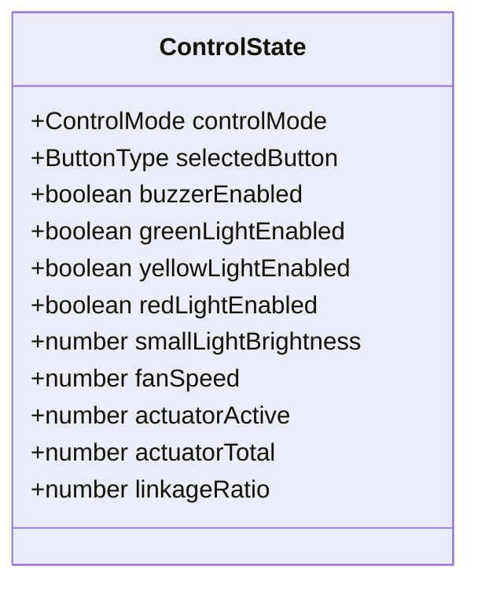
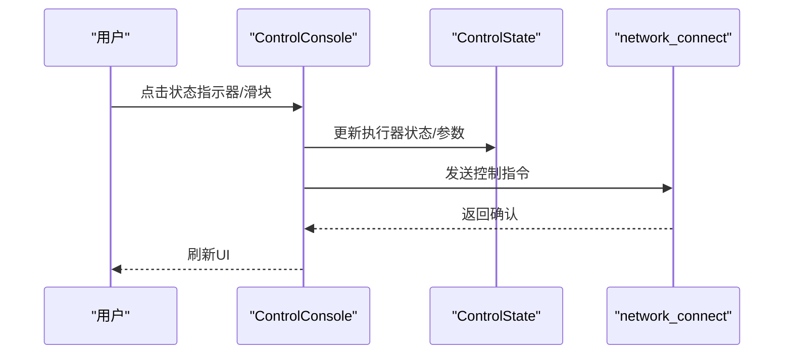
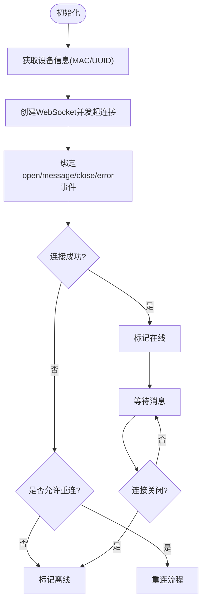
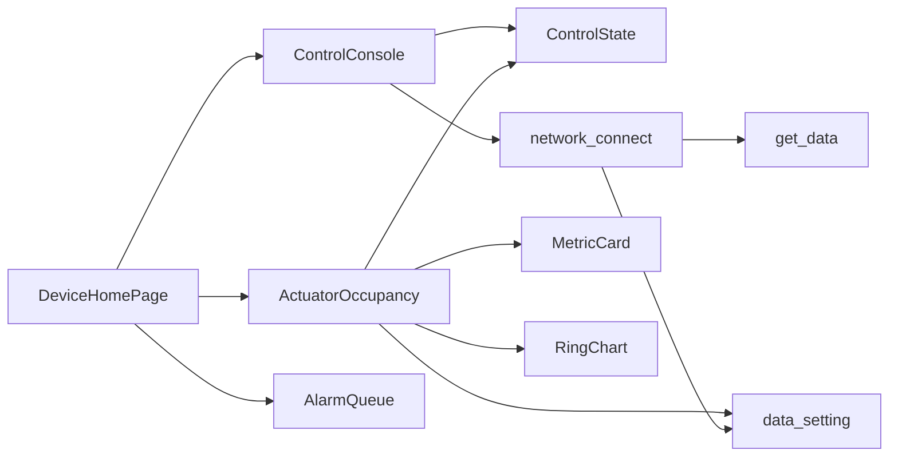

# 执行器监控

<cite>
**本文引用的文件**
- [ActuatorOccupancy.ets](file://entry/src/main/ets/components/actuator/ActuatorOccupancy.ets)
- [MetricCard.ets](file://entry/src/main/ets/components/actuator/MetricCard.ets)
- [RingChart.ets](file://entry/src/main/ets/components/actuator/RingChart.ets)
- [ControlState.ets](file://entry/src/main/ets/models/ControlState.ets)
- [AppColors.ets](file://entry/src/main/ets/constants/AppColors.ets)
- [AppDimensions.ets](file://entry/src/main/ets/constants/AppDimensions.ets)
- [DeviceHomePage.ets](file://entry/src/main/ets/pages/DeviceHomePage.ets)
- [ControlConsole.ets](file://entry/src/main/ets/components/control/ControlConsole.ets)
- [network_connect.ets](file://entry/src/main/ets/pages/network_connect.ets)
- [get_data.ets](file://entry/src/main/ets/pages/get_data.ets)
- [AlarmQueue.ets](file://entry/src/main/ets/components/log/AlarmQueue.ets)
</cite>

## 更新摘要
**变更内容**
- 新增实时数据管理功能：执行器占用面板集成了数据同步机制
- 增强数据更新策略：支持手动刷新和自动数据同步
- 完善执行器状态统计：新增激活执行器数量统计功能
- 优化数据流架构：实现组件间的数据双向同步

## 目录
1. [简介](#简介)
2. [项目结构](#项目结构)
3. [核心组件](#核心组件)
4. [架构总览](#架构总览)
5. [详细组件分析](#详细组件分析)
6. [依赖关系分析](#依赖关系分析)
7. [性能考量](#性能考量)
8. [故障排查指南](#故障排查指南)
9. [结论](#结论)
10. [附录](#附录)

## 简介
本文件面向"执行器监控"主题，围绕执行器占用情况的实时检测、占用率计算与可视化展示展开，系统性阐述以下内容：
- 实时检测：通过控制台与网络层驱动，结合传感器数据拉取，形成执行器状态的实时视图。
- 占用率计算：基于激活执行器数量与总数，计算联动占比，作为核心指标。
- 可视化展示：采用指标卡片与环形图表组合，直观呈现执行器参数、激活数量与占用率。
- 异常检测与预警：结合告警队列与网络连接状态，提供阈值触发与状态恢复机制建议。
- 最佳实践：数据采样、存储优化与报表生成策略。

**更新** 新增实时数据管理功能，支持执行器状态的实时监控和数据同步机制。

## 项目结构
执行器监控相关代码主要位于 entry/src/main/ets 下的组件、页面与模型目录中，采用按功能域分层组织：
- components/actuator：执行器相关UI组件（指标卡、环形图、占用面板）
- components/control：控制台与状态指示器
- pages：页面入口与数据页（设备页集成执行器占用面板）
- models：状态数据模型（控制状态）
- constants：颜色与尺寸常量
- pages：网络连接与传感器数据拉取

**图表来源**
- [DeviceHomePage.ets:49-49](file://entry/src/main/ets/pages/DeviceHomePage.ets#L49-L49)
- [ActuatorOccupancy.ets:1-191](file://entry/src/main/ets/components/actuator/ActuatorOccupancy.ets#L1-L191)
- [MetricCard.ets:1-41](file://entry/src/main/ets/components/actuator/MetricCard.ets#L1-L41)
- [RingChart.ets:1-70](file://entry/src/main/ets/components/actuator/RingChart.ets#L1-L70)
- [ControlConsole.ets:1-276](file://entry/src/main/ets/components/control/ControlConsole.ets#L1-L276)
- [ControlState.ets:1-67](file://entry/src/main/ets/models/ControlState.ets#L1-L67)
- [AppColors.ets:1-47](file://entry/src/main/ets/constants/AppColors.ets#L1-L47)
- [AppDimensions.ets:1-40](file://entry/src/main/ets/constants/AppDimensions.ets#L1-L40)
- [network_connect.ets:1-321](file://entry/src/main/ets/pages/network_connect.ets#L1-L321)
- [get_data.ets:1-105](file://entry/src/main/ets/pages/get_data.ets#L1-L105)
- [AlarmQueue.ets:1-105](file://entry/src/main/ets/components/log/AlarmQueue.ets#L1-L105)

**章节来源**
- [DeviceHomePage.ets:1-75](file://entry/src/main/ets/pages/DeviceHomePage.ets#L1-L75)
- [ActuatorOccupancy.ets:1-191](file://entry/src/main/ets/components/actuator/ActuatorOccupancy.ets#L1-L191)
- [ControlConsole.ets:1-276](file://entry/src/main/ets/components/control/ControlConsole.ets#L1-L276)
- [network_connect.ets:1-321](file://entry/src/main/ets/pages/network_connect.ets#L1-L321)
- [get_data.ets:1-105](file://entry/src/main/ets/pages/get_data.ets#L1-L105)

## 核心组件
- 执行器占用面板（ActuatorOccupancy）：整合参数指标、环形图与状态统计，统一展示执行器联动占用情况。**新增**支持实时数据同步和手动刷新功能。
- 指标卡片（MetricCard）：标准化展示单个指标的标题、数值与副标题，支持统一风格与排版。
- 环形图（RingChart）：绘制执行器激活占比的环形进度图，包含背景环与激活环、中心文字与图例。
- 控制状态（ControlState）：承载执行器相关状态与指标，如激活数量、总数与联动占比。
- 控制台（ControlConsole）：提供按钮与滑块等交互控件，驱动执行器状态变化并通过网络发送指令。
- 网络连接（network_connect）：负责WebSocket连接、消息收发与重连逻辑，保障数据链路可用。
- 传感器数据（get_data）：封装HTTP请求，拉取传感器与执行器状态数据，作为占用率计算的数据源之一。**新增**支持ObservedV2装饰器实现响应式数据更新。
- 告警队列（AlarmQueue）：展示与管理异常事件，作为异常检测与预警的前端载体。

**章节来源**
- [ActuatorOccupancy.ets:1-191](file://entry/src/main/ets/components/actuator/ActuatorOccupancy.ets#L1-L191)
- [MetricCard.ets:1-41](file://entry/src/main/ets/components/actuator/MetricCard.ets#L1-L41)
- [RingChart.ets:1-70](file://entry/src/main/ets/components/actuator/RingChart.ets#L1-L70)
- [ControlState.ets:1-67](file://entry/src/main/ets/models/ControlState.ets#L1-L67)
- [ControlConsole.ets:1-276](file://entry/src/main/ets/components/control/ControlConsole.ets#L1-L276)
- [network_connect.ets:1-321](file://entry/src/main/ets/pages/network_connect.ets#L1-L321)
- [get_data.ets:1-105](file://entry/src/main/ets/pages/get_data.ets#L1-L105)
- [AlarmQueue.ets:1-105](file://entry/src/main/ets/components/log/AlarmQueue.ets#L1-L105)

## 架构总览
执行器监控的运行时流程如下：
- 用户在控制台调整执行器状态（如开关灯、调节亮度/转速），控制台将状态写入控制状态对象，并通过网络发送指令。
- 页面定期或按需拉取传感器与执行器状态数据，更新控制状态中的执行器指标。
- 执行器占用面板读取控制状态，计算联动占比并渲染指标卡片与环形图。**新增**支持手动刷新和自动数据同步。
- 网络层负责连接稳定性与消息收发，异常时触发重连与状态标记。
- 告警队列接收并展示异常事件，作为异常检测与预警的前端界面。

**图表来源**
- [ControlConsole.ets:41-276](file://entry/src/main/ets/components/control/ControlConsole.ets#L41-L276)
- [ControlState.ets:28-67](file://entry/src/main/ets/models/ControlState.ets#L28-L67)
- [network_connect.ets:149-321](file://entry/src/main/ets/pages/network_connect.ets#L149-L321)
- [DeviceHomePage.ets:49-49](file://entry/src/main/ets/pages/DeviceHomePage.ets#L49-L49)
- [ActuatorOccupancy.ets:16-191](file://entry/src/main/ets/components/actuator/ActuatorOccupancy.ets#L16-L191)
- [MetricCard.ets:17-41](file://entry/src/main/ets/components/actuator/MetricCard.ets#L17-L41)
- [RingChart.ets:19-70](file://entry/src/main/ets/components/actuator/RingChart.ets#L19-L70)

## 详细组件分析

### 执行器占用面板（ActuatorOccupancy）
- 功能定位：集中展示执行器参数指标、环形图与状态统计，形成"参数-可视化-统计"的三段式布局。
- 数据来源：读取控制状态对象中的小灯亮度、风扇转速、激活执行器数量、总数与联动占比。**新增**支持从接口数据实时更新执行器参数。
- 布局设计：左侧参数指标卡片、中央环形图、右侧状态统计卡片，底部图例说明颜色含义。
- 更新策略：当控制状态变化时，面板自动刷新显示最新指标。**新增**提供手动刷新方法和自动数据同步机制。
- **新增功能**：
  - `updateActuatorParameters()`：从接口数据更新执行器参数，包括小灯亮度和风扇转速百分比
  - `countActiveActuators()`：统计激活的执行器数量（蜂鸣器、绿灯、黄灯、红灯）
  - `refreshActuatorData()`：提供手动刷新执行器数据的方法

**图表来源**
- [ActuatorOccupancy.ets:16-191](file://entry/src/main/ets/components/actuator/ActuatorOccupancy.ets#L16-L191)
- [ControlState.ets:46-52](file://entry/src/main/ets/models/ControlState.ets#L46-L52)

**章节来源**
- [ActuatorOccupancy.ets:1-191](file://entry/src/main/ets/components/actuator/ActuatorOccupancy.ets#L1-L191)

### 指标卡片（MetricCard）
- 设计理念：统一的标题-数值-副标题三段式结构，支持自定义标题、数值与副标题。
- 视觉规范：通过颜色与字号常量统一风格，圆角背景与左对齐提升可读性。
- 数据更新：由父组件传入，无需内部状态管理，保证轻量与高效。

**图表来源**
- [MetricCard.ets:8-41](file://entry/src/main/ets/components/actuator/MetricCard.ets#L8-L41)

**章节来源**
- [MetricCard.ets:1-41](file://entry/src/main/ets/components/actuator/MetricCard.ets#L1-L41)

### 环形图（RingChart）
- 数据渲染：根据百分比绘制背景环与激活环，中心显示百分比与标签文字。
- 动画效果：当前实现为一次性绘制，未包含过渡动画；可在onReady后增加过渡绘制以增强体验。
- 交互响应：组件本身无交互，但可通过props传入新的百分比触发布局更新。
- 颜色与尺寸：使用颜色常量与尺寸常量，确保与整体主题一致。

**图表来源**
- [RingChart.ets:19-70](file://entry/src/main/ets/components/actuator/RingChart.ets#L19-L70)
- [AppColors.ets:41-43](file://entry/src/main/ets/constants/AppColors.ets#L41-L43)
- [AppDimensions.ets:35-40](file://entry/src/main/ets/constants/AppDimensions.ets#L35-L40)

**章节来源**
- [RingChart.ets:1-70](file://entry/src/main/ets/components/actuator/RingChart.ets#L1-L70)

### 控制状态（ControlState）
- 字段构成：包含控制模式、按钮类型、执行器状态、小灯亮度、风扇转速、激活执行器数量、总数与联动占比。
- 默认值：构造函数中设定初始值，确保组件首次渲染有合理数据。
- 用途：作为执行器占用面板与控制台的数据源，驱动UI更新。

**图表来源**
- [ControlState.ets:28-67](file://entry/src/main/ets/models/ControlState.ets#L28-L67)

**章节来源**
- [ControlState.ets:1-67](file://entry/src/main/ets/models/ControlState.ets#L1-L67)

### 控制台（ControlConsole）
- 功能整合：按钮组、状态指示器与滑块控件，统一管理执行器控制。
- 状态同步：独立selectedButton与ControlState.selectedButton保持一致，确保UI正确更新。
- 网络交互：通过网络连接模块发送控制指令，实现远程联动。

**图表来源**
- [ControlConsole.ets:41-276](file://entry/src/main/ets/components/control/ControlConsole.ets#L41-L276)
- [network_connect.ets:263-299](file://entry/src/main/ets/pages/network_connect.ets#L263-L299)

**章节来源**
- [ControlConsole.ets:1-276](file://entry/src/main/ets/components/control/ControlConsole.ets#L1-L276)

### 网络连接（network_connect）
- 连接管理：创建WebSocket、绑定事件、处理消息、异常与关闭。
- 自动重连：WiFi重连后延迟重连，防止频繁触发；错误时尝试有限次重连。
- 状态标记：通过布尔状态标记在线/离线，供页面与组件使用。
- 请求管理：维护未完成请求集合，避免连接关闭导致的悬挂请求。
- **新增功能**：在发送指令时自动触发传感器数据拉取，确保数据实时性。

**图表来源**
- [network_connect.ets:149-321](file://entry/src/main/ets/pages/network_connect.ets#L149-L321)

**章节来源**
- [network_connect.ets:1-321](file://entry/src/main/ets/pages/network_connect.ets#L1-L321)

### 传感器数据拉取（get_data）
- 数据结构：定义接口类型，包含元数据、传感器数据与执行器状态。
- 拉取逻辑：通过HTTP请求获取实时状态，解析为强类型对象，供页面使用。
- 更新策略：在设备页出现时触发，或在控制台操作后触发，确保数据新鲜度。
- **新增功能**：使用@ObservedV2装饰器实现响应式数据更新，支持实时状态监控。

**章节来源**
- [get_data.ets:1-105](file://entry/src/main/ets/pages/get_data.ets#L1-L105)

### 告警队列（AlarmQueue）
- 展示逻辑：根据告警级别设置边框颜色，支持空状态提示。
- 交互：作为只读展示组件，不参与状态计算，但可与异常检测联动。

**章节来源**
- [AlarmQueue.ets:53-105](file://entry/src/main/ets/components/log/AlarmQueue.ets#L53-L105)

## 依赖关系分析
- 组件耦合：
  - ActuatorOccupancy 依赖 ControlState、MetricCard、RingChart、主题常量和数据设置模块。
  - ControlConsole 依赖 ControlState 与网络连接模块。
  - DeviceHomePage 组装 ControlConsole、ActuatorOccupancy 与告警队列。
- 数据流：
  - 控制台修改 ControlState → ActuatorOccupancy 读取并渲染 → 网络层发送指令。
  - get_data 定期拉取传感器/执行器状态 → 更新 ControlState → 触发布局刷新。
  - **新增** ActuatorOccupancy 自动更新接口数据 → 计算执行器参数 → 更新UI显示。
- 外部依赖：
  - WebSocket 与 HTTP 网络能力，以及系统WiFi状态监听。

**图表来源**
- [ControlConsole.ets:1-276](file://entry/src/main/ets/components/control/ControlConsole.ets#L1-L276)
- [ControlState.ets:1-67](file://entry/src/main/ets/models/ControlState.ets#L1-L67)
- [network_connect.ets:1-321](file://entry/src/main/ets/pages/network_connect.ets#L1-L321)
- [DeviceHomePage.ets:1-75](file://entry/src/main/ets/pages/DeviceHomePage.ets#L1-L75)
- [ActuatorOccupancy.ets:1-191](file://entry/src/main/ets/components/actuator/ActuatorOccupancy.ets#L1-L191)
- [MetricCard.ets:1-41](file://entry/src/main/ets/components/actuator/MetricCard.ets#L1-L41)
- [RingChart.ets:1-70](file://entry/src/main/ets/components/actuator/RingChart.ets#L1-L70)
- [get_data.ets:1-105](file://entry/src/main/ets/pages/get_data.ets#L1-L105)
- [AlarmQueue.ets:1-105](file://entry/src/main/ets/components/log/AlarmQueue.ets#L1-L105)

**章节来源**
- [DeviceHomePage.ets:1-75](file://entry/src/main/ets/pages/DeviceHomePage.ets#L1-L75)
- [ActuatorOccupancy.ets:1-191](file://entry/src/main/ets/components/actuator/ActuatorOccupancy.ets#L1-L191)
- [ControlConsole.ets:1-276](file://entry/src/main/ets/components/control/ControlConsole.ets#L1-L276)
- [network_connect.ets:1-321](file://entry/src/main/ets/pages/network_connect.ets#L1-L321)
- [get_data.ets:1-105](file://entry/src/main/ets/pages/get_data.ets#L1-L105)

## 性能考量
- 数据采样与更新频率
  - 建议：控制台参数变更与网络指令发送即时生效；占用率与传感器数据按需或定时拉取，避免高频轮询。**新增** ActuatorOccupancy提供手动刷新方法，支持用户主动更新数据。
  - 依据：控制台与网络连接模块已具备事件驱动与状态标记能力。
- 存储优化
  - 建议：仅缓存必要的最近状态与告警，定期清理历史记录；对联动占比等计算结果进行本地缓存，减少重复计算。**新增** get_data使用@ObservedV2装饰器实现响应式更新，提高数据同步效率。
  - 依据：ControlState 与网络连接模块均支持状态持久化与请求管理。
- 可视化渲染
  - 建议：环形图绘制在Canvas上，避免复杂动画；指标卡片采用纯静态渲染，降低重绘成本。**新增** ActuatorOccupancy的updateActuatorParameters方法包含边界值检查，确保数据有效性。
  - 依据：RingChart 与 MetricCard 均为轻量组件。
- 网络稳定性
  - 建议：WiFi状态监听与自动重连配合，确保在网络波动时尽快恢复；对未完成请求进行超时与清理。**新增** network_connect在发送指令时自动触发数据拉取，确保网络操作的完整性。
  - 依据：network_connect 已实现WiFi监听与重连逻辑。

## 故障排查指南
- 网络连接异常
  - 现象：设备离线、告警提示、控制指令无响应。
  - 排查：检查WiFi状态监听是否注册、重连次数上限、连接URL与头部信息。
  - 参考：[network_connect.ets:77-131](file://entry/src/main/ets/pages/network_connect.ets#L77-L131)
- 占用率不更新
  - 现象：环形图与统计卡片数值不变。
  - 排查：确认传感器数据拉取是否成功、ControlState 是否被更新、ActuatorOccupancy 是否读取最新值。**新增**检查updateActuatorParameters方法是否正常执行，确认接口数据格式正确。
  - 参考：[get_data.ets:71-105](file://entry/src/main/ets/pages/get_data.ets#L71-L105)、[ControlState.ets:46-52](file://entry/src/main/ets/models/ControlState.ets#L46-L52)
- 控制指令未下发
  - 现象：点击状态指示器/滑块无反应。
  - 排查：检查网络连接状态、发送逻辑与返回确认；确认 ControlConsole 与 network_connect 的绑定关系。**新增**检查network_connect的send方法是否正确触发数据拉取。
  - 参考：[ControlConsole.ets:41-276](file://entry/src/main/ets/components/control/ControlConsole.ets#L41-L276)、[network_connect.ets:263-299](file://entry/src/main/ets/pages/network_connect.ets#L263-L299)
- 告警未显示
  - 现象：异常事件未在告警队列中展示。
  - 排查：确认告警数据源与 AlarmQueue 的数据绑定；检查空状态渲染逻辑。
  - 参考：[AlarmQueue.ets:53-105](file://entry/src/main/ets/components/log/AlarmQueue.ets#L53-L105)
- **新增** 数据同步问题
  - 现象：执行器参数显示异常或计算错误。
  - 排查：检查ActuatorOccupancy的updateActuatorParameters方法，确认接口数据格式正确；验证countActiveActuators方法的执行器状态判断逻辑；检查边界值处理（0-100范围）。
  - 参考：[ActuatorOccupancy.ets:121-173](file://entry/src/main/ets/components/actuator/ActuatorOccupancy.ets#L121-L173)

**章节来源**
- [network_connect.ets:77-131](file://entry/src/main/ets/pages/network_connect.ets#L77-L131)
- [get_data.ets:71-105](file://entry/src/main/ets/pages/get_data.ets#L71-L105)
- [ControlState.ets:46-52](file://entry/src/main/ets/models/ControlState.ets#L46-L52)
- [ControlConsole.ets:41-276](file://entry/src/main/ets/components/control/ControlConsole.ets#L41-L276)
- [AlarmQueue.ets:53-105](file://entry/src/main/ets/components/log/AlarmQueue.ets#L53-L105)
- [ActuatorOccupancy.ets:121-173](file://entry/src/main/ets/components/actuator/ActuatorOccupancy.ets#L121-L173)

## 结论
本执行器监控系统通过"控制台-状态-可视化-网络-数据-告警"的闭环设计，实现了对执行器占用情况的实时监测与直观展示。核心优势在于：
- 指标卡片与环形图的组合，清晰表达执行器参数与占用率；
- 控制台与网络层的解耦，便于扩展与维护；
- 告警队列与网络重连机制，提升了系统的鲁棒性。
- **新增**实时数据管理功能，支持执行器状态的实时监控和数据同步。

**更新** 建议后续在可视化层面引入过渡动画与交互反馈，在数据层面完善采样策略与缓存机制，并在异常检测方面增加阈值配置与恢复策略，以进一步提升用户体验与系统可靠性。

## 附录
- 关键指标说明
  - 小灯亮度/风扇转速：百分比目标值，来源于控制台与传感器数据。**新增**支持从接口数据实时更新。
  - 激活执行器/总数：用于计算联动占比。**新增**支持动态统计蜂鸣器、绿灯、黄灯、红灯的激活状态。
  - 联动占比：激活执行器数量与总数的百分比，作为核心占用指标。
- 颜色与尺寸规范
  - 颜色：参考 AppColors 中的主题色与环形图专用色。
  - 尺寸：参考 AppDimensions 中的字体、间距与组件尺寸规范。
- 页面集成点
  - 设备页 DeviceHomePage 集成控制台、执行器占用面板与告警队列，形成完整的监控界面。
- **新增** 数据管理规范
  - 使用@ObservedV2装饰器实现响应式数据更新
  - 提供手动刷新方法refreshActuatorData()支持用户主动更新
  - 实现边界值检查确保数据有效性（0-100范围）

**章节来源**
- [AppColors.ets:1-47](file://entry/src/main/ets/constants/AppColors.ets#L1-L47)
- [AppDimensions.ets:1-40](file://entry/src/main/ets/constants/AppDimensions.ets#L1-L40)
- [DeviceHomePage.ets:1-75](file://entry/src/main/ets/pages/DeviceHomePage.ets#L1-L75)
- [ActuatorOccupancy.ets:178-189](file://entry/src/main/ets/components/actuator/ActuatorOccupancy.ets#L178-L189)
- [get_data.ets:67-105](file://entry/src/main/ets/pages/get_data.ets#L67-L105)