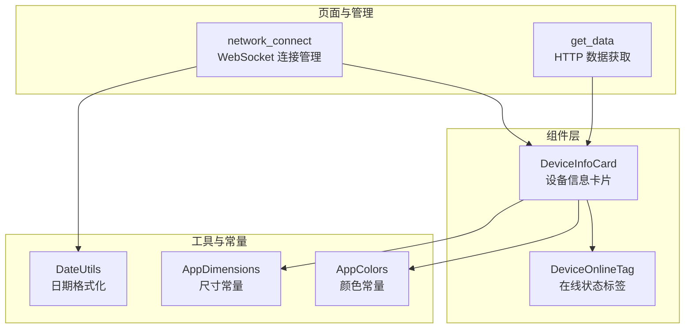
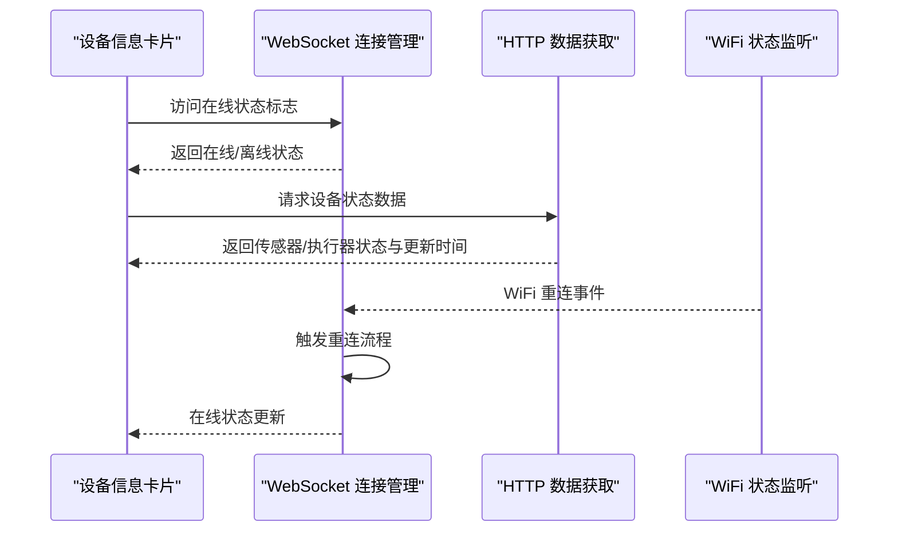
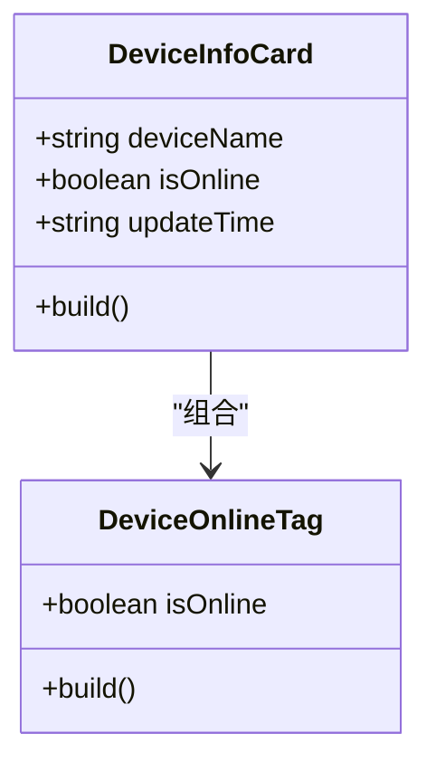
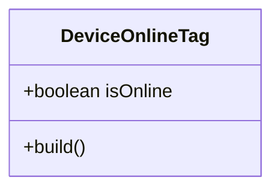
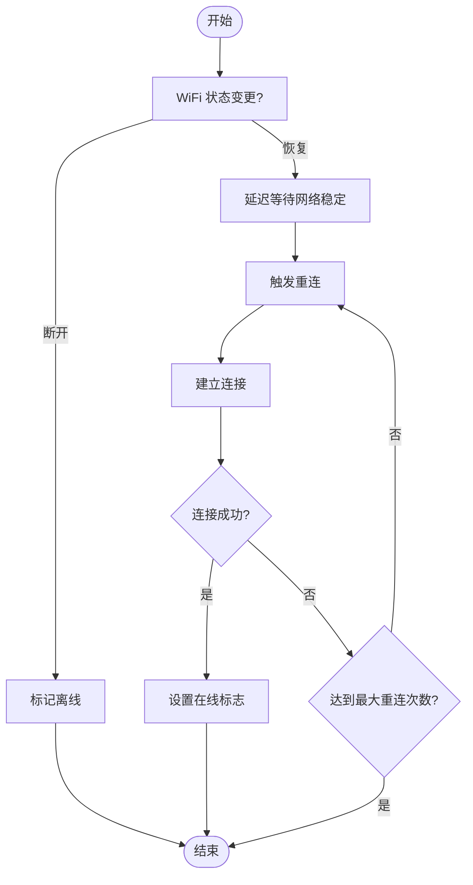
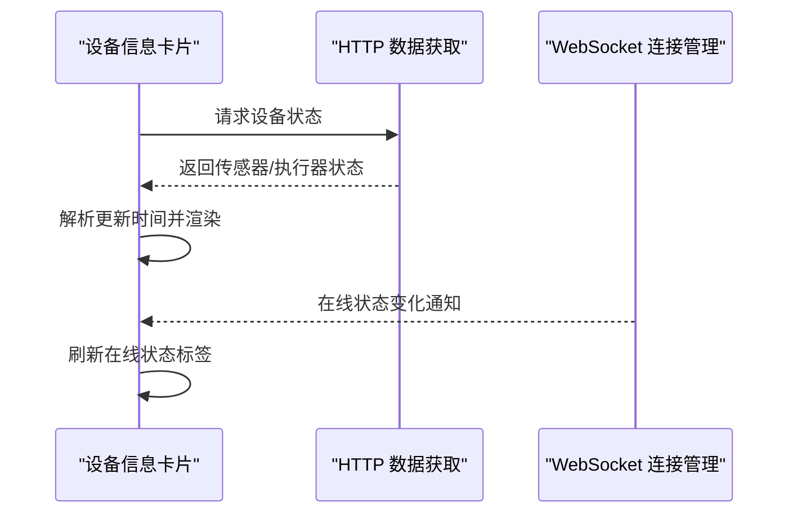
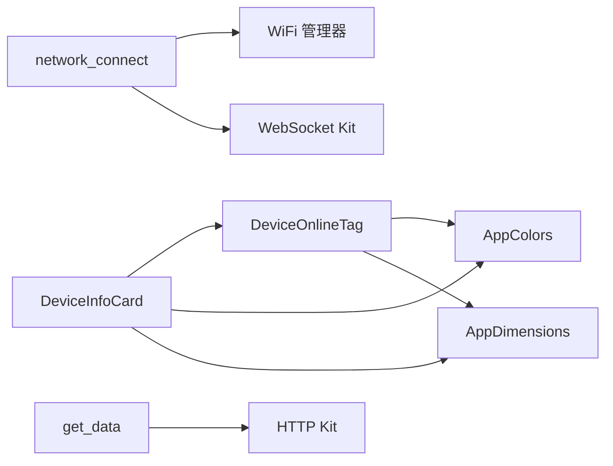

# 设备信息管理

<cite>
**本文引用的文件**
- [DeviceInfoCard.ets](file://entry/src/main/ets/components/device/DeviceInfoCard.ets)
- [DeviceOnlineTag.ets](file://entry/src/main/ets/components/device/DeviceOnlineTag.ets)
- [network_connect.ets](file://entry/src/main/ets/pages/network_connect.ets)
- [get_data.ets](file://entry/src/main/ets/pages/get_data.ets)
- [DateUtils.ets](file://entry/src/main/ets/utils/DateUtils.ets)
- [AppColors.ets](file://entry/src/main/ets/constants/AppColors.ets)
- [AppDimensions.ets](file://entry/src/main/ets/constants/AppDimensions.ets)
</cite>

## 目录
1. [简介](#简介)
2. [项目结构](#项目结构)
3. [核心组件](#核心组件)
4. [架构总览](#架构总览)
5. [详细组件分析](#详细组件分析)
6. [依赖关系分析](#依赖关系分析)
7. [性能考虑](#性能考虑)
8. [故障排查指南](#故障排查指南)
9. [结论](#结论)
10. [附录](#附录)

## 简介
本文件围绕设备信息管理进行系统化技术文档整理，重点覆盖以下方面：
- 设备信息卡片组件的设计与实现：设备名称显示、在线状态标识、最后更新时间展示逻辑
- 设备在线状态检测机制：网络连接状态实时监控、心跳/保活策略、离线检测策略
- 设备属性动态更新流程：数据获取、状态同步、界面刷新
- 设备信息格式化最佳实践：数据验证、错误处理、用户体验优化
- 设备信息缓存策略与性能优化方案

## 项目结构
本项目采用按功能域分层的组织方式，设备信息管理相关代码主要分布在以下模块：
- 组件层：设备信息卡片与在线状态标签组件
- 页面与管理：网络连接管理、HTTP 数据获取
- 工具与常量：日期格式化、颜色与尺寸常量

图表来源
- [DeviceInfoCard.ets:1-59](file://entry/src/main/ets/components/device/DeviceInfoCard.ets#L1-L59)
- [DeviceOnlineTag.ets:1-31](file://entry/src/main/ets/components/device/DeviceOnlineTag.ets#L1-L31)
- [network_connect.ets:1-322](file://entry/src/main/ets/pages/network_connect.ets#L1-L322)
- [get_data.ets:1-105](file://entry/src/main/ets/pages/get_data.ets#L1-L105)
- [DateUtils.ets:1-28](file://entry/src/main/ets/utils/DateUtils.ets#L1-L28)
- [AppColors.ets:1-47](file://entry/src/main/ets/constants/AppColors.ets#L1-L47)
- [AppDimensions.ets:1-40](file://entry/src/main/ets/constants/AppDimensions.ets#L1-L40)

章节来源
- [DeviceInfoCard.ets:1-59](file://entry/src/main/ets/components/device/DeviceInfoCard.ets#L1-L59)
- [DeviceOnlineTag.ets:1-31](file://entry/src/main/ets/components/device/DeviceOnlineTag.ets#L1-L31)
- [network_connect.ets:1-322](file://entry/src/main/ets/pages/network_connect.ets#L1-L322)
- [get_data.ets:1-105](file://entry/src/main/ets/pages/get_data.ets#L1-L105)
- [DateUtils.ets:1-28](file://entry/src/main/ets/utils/DateUtils.ets#L1-L28)
- [AppColors.ets:1-47](file://entry/src/main/ets/constants/AppColors.ets#L1-L47)
- [AppDimensions.ets:1-40](file://entry/src/main/ets/constants/AppDimensions.ets#L1-L40)

## 核心组件
- 设备信息卡片组件：负责渲染设备名称、在线状态标签、最后更新时间以及设备图片占位符，并通过统一的颜色与尺寸常量保证视觉一致性。
- 在线状态标签组件：以圆点与文字组合的方式直观展示设备在线/离线状态，支持根据状态切换颜色与背景。
- 网络连接管理：封装 WebSocket 连接、事件绑定、自动重连、WiFi 状态监听等能力，维护设备在线状态标志。
- HTTP 数据获取：定义设备状态接口的数据结构，提供异步获取设备传感器与执行器状态的能力。

章节来源
- [DeviceInfoCard.ets:5-59](file://entry/src/main/ets/components/device/DeviceInfoCard.ets#L5-L59)
- [DeviceOnlineTag.ets:4-31](file://entry/src/main/ets/components/device/DeviceOnlineTag.ets#L4-L31)
- [network_connect.ets:38-322](file://entry/src/main/ets/pages/network_connect.ets#L38-L322)
- [get_data.ets:67-105](file://entry/src/main/ets/pages/get_data.ets#L67-L105)

## 架构总览
设备信息管理的整体架构由“数据源 -> 状态管理 -> 视图渲染”三层构成：
- 数据源：HTTP 接口提供设备状态元数据；WebSocket 提供实时连接状态与会话标识
- 状态管理：通过观察者模型维护设备在线状态与数据缓存；在 WiFi 状态变化时触发重连
- 视图渲染：设备信息卡片组件消费状态并渲染 UI；在线状态标签组件独立展示状态

图表来源
- [DeviceInfoCard.ets:18-59](file://entry/src/main/ets/components/device/DeviceInfoCard.ets#L18-L59)
- [network_connect.ets:77-131](file://entry/src/main/ets/pages/network_connect.ets#L77-L131)
- [get_data.ets:71-100](file://entry/src/main/ets/pages/get_data.ets#L71-L100)

## 详细组件分析

### 设备信息卡片组件（DeviceInfoCard）
- 功能职责
  - 展示设备名称、在线状态标签与最后更新时间
  - 使用统一的颜色与尺寸常量，确保视觉一致性
  - 提供设备图片占位符区域
- 关键实现要点
  - 名称渲染：设置字号、字重、颜色与溢出省略策略
  - 在线状态：通过嵌套组件传递在线状态布尔值
  - 更新时间：条件渲染，避免空字符串导致的布局问题
  - 图片占位符：固定尺寸与圆角，适配卡片整体风格

图表来源
- [DeviceInfoCard.ets:9-59](file://entry/src/main/ets/components/device/DeviceInfoCard.ets#L9-L59)
- [DeviceOnlineTag.ets:8-31](file://entry/src/main/ets/components/device/DeviceOnlineTag.ets#L8-L31)

章节来源
- [DeviceInfoCard.ets:5-59](file://entry/src/main/ets/components/device/DeviceInfoCard.ets#L5-L59)
- [AppColors.ets:13-25](file://entry/src/main/ets/constants/AppColors.ets#L13-L25)
- [AppDimensions.ets:6-28](file://entry/src/main/ets/constants/AppDimensions.ets#L6-L28)

### 在线状态标签组件（DeviceOnlineTag）
- 功能职责
  - 以圆点与文字组合展示在线/离线状态
  - 根据状态切换颜色与背景透明度
- 关键实现要点
  - 圆点填充：根据在线状态选择成功色或禁用色
  - 文字颜色：与圆点保持一致
  - 容器背景：使用半透明色提升可读性
  - 内边距与圆角：统一尺寸常量，保证与卡片风格一致

图表来源
- [DeviceOnlineTag.ets:8-31](file://entry/src/main/ets/components/device/DeviceOnlineTag.ets#L8-L31)
- [AppColors.ets:20-25](file://entry/src/main/ets/constants/AppColors.ets#L20-L25)
- [AppDimensions.ets:14-19](file://entry/src/main/ets/constants/AppDimensions.ets#L14-L19)

章节来源
- [DeviceOnlineTag.ets:4-31](file://entry/src/main/ets/components/device/DeviceOnlineTag.ets#L4-L31)
- [AppColors.ets:20-25](file://entry/src/main/ets/constants/AppColors.ets#L20-L25)
- [AppDimensions.ets:14-19](file://entry/src/main/ets/constants/AppDimensions.ets#L14-L19)

### 设备在线状态检测机制
- 网络连接状态实时监控
  - WiFi 状态监听：当 WiFi 从断开恢复为已连接时，延迟一段时间后触发重连，避免网络尚未稳定
  - 连接状态标志：WebSocket 打开事件设置在线标志；关闭/错误事件清零在线标志
- 心跳/保活策略
  - 通过发送握手消息维持会话；若消息发送失败或连接异常，进入重连流程
- 离线检测策略
  - 连接关闭或错误时标记离线
  - 重连失败时清理未完成请求并重置状态

图表来源
- [network_connect.ets:77-131](file://entry/src/main/ets/pages/network_connect.ets#L77-L131)
- [network_connect.ets:182-261](file://entry/src/main/ets/pages/network_connect.ets#L182-L261)

章节来源
- [network_connect.ets:77-131](file://entry/src/main/ets/pages/network_connect.ets#L77-L131)
- [network_connect.ets:182-261](file://entry/src/main/ets/pages/network_connect.ets#L182-L261)

### 设备属性动态更新流程
- 数据获取
  - HTTP 接口：定时或按需拉取设备状态，解析为强类型数据模型
  - WebSocket：接收实时消息，更新会话 ID 与状态标志
- 状态同步
  - 观察者模型：状态变更后自动触发视图更新
  - 会话与请求映射：发送消息时生成唯一请求 ID，收到响应后匹配并清理
- 界面刷新
  - 设备信息卡片消费最新状态并重新渲染
  - 在线状态标签随状态布尔值变化而更新

图表来源
- [get_data.ets:71-100](file://entry/src/main/ets/pages/get_data.ets#L71-L100)
- [network_connect.ets:182-261](file://entry/src/main/ets/pages/network_connect.ets#L182-L261)
- [DeviceInfoCard.ets:18-59](file://entry/src/main/ets/components/device/DeviceInfoCard.ets#L18-L59)

章节来源
- [get_data.ets:67-105](file://entry/src/main/ets/pages/get_data.ets#L67-L105)
- [network_connect.ets:263-299](file://entry/src/main/ets/pages/network_connect.ets#L263-L299)
- [DeviceInfoCard.ets:18-59](file://entry/src/main/ets/components/device/DeviceInfoCard.ets#L18-L59)

### 设备信息格式化最佳实践
- 数据验证
  - 对 HTTP 响应的状态码与 JSON 结构进行校验，失败时返回空值并记录日志
  - 对 WebSocket 消息进行类型判断与 JSON 解析，异常时忽略并记录
- 错误处理
  - 连接失败与发送失败均进行错误捕获与日志输出，必要时触发重连
  - 关闭连接时清理未完成请求，避免悬挂回调
- 用户体验优化
  - 在线状态标签使用高对比度颜色与半透明背景，提升可读性
  - 设备名称支持溢出省略，避免长名称影响布局
  - 更新时间条件渲染，避免空字符串造成的 UI 占位

章节来源
- [get_data.ets:75-99](file://entry/src/main/ets/pages/get_data.ets#L75-L99)
- [network_connect.ets:204-234](file://entry/src/main/ets/pages/network_connect.ets#L204-L234)
- [DeviceOnlineTag.ets:13-30](file://entry/src/main/ets/components/device/DeviceOnlineTag.ets#L13-L30)
- [DeviceInfoCard.ets:24-43](file://entry/src/main/ets/components/device/DeviceInfoCard.ets#L24-L43)

### 设备信息缓存策略与性能优化
- 缓存策略
  - WebSocket 会话 ID 缓存：首次握手成功后保存 session_id，后续消息处理可直接使用
  - 未完成请求映射：以请求 ID 为键缓存 Promise 回调，消息到达后匹配并清理
  - 设备标识缓存：WiFi MAC 与客户端 UUID 在连接初始化阶段获取并缓存
- 性能优化
  - 防抖重连：使用重连锁避免短时间内并发触发多次重连
  - 延迟重连：WiFi 恢复后延迟等待网络稳定再重连，减少无效尝试
  - 二进制消息处理：对非字符串消息进行快速分支，避免无谓解析
  - 视图渲染优化：条件渲染与最小化布局计算，避免频繁重排

章节来源
- [network_connect.ets:53-58](file://entry/src/main/ets/pages/network_connect.ets#L53-L58)
- [network_connect.ets:105-131](file://entry/src/main/ets/pages/network_connect.ets#L105-L131)
- [network_connect.ets:204-234](file://entry/src/main/ets/pages/network_connect.ets#L204-L234)
- [DeviceInfoCard.ets:39-43](file://entry/src/main/ets/components/device/DeviceInfoCard.ets#L39-L43)

## 依赖关系分析
- 组件依赖
  - 设备信息卡片依赖在线状态标签组件与其颜色/尺寸常量
  - 在线状态标签组件依赖颜色与尺寸常量
- 页面与管理依赖
  - 网络连接管理依赖 WiFi 管理器与 WebSocket Kit
  - HTTP 数据获取依赖 HTTP Kit 与强类型接口定义
- 工具与常量
  - 日期格式化工具为 UI 提供时间字符串格式化能力
  - 颜色与尺寸常量统一了视觉设计规范

图表来源
- [DeviceInfoCard.ets:1-3](file://entry/src/main/ets/components/device/DeviceInfoCard.ets#L1-L3)
- [DeviceOnlineTag.ets:1-2](file://entry/src/main/ets/components/device/DeviceOnlineTag.ets#L1-L2)
- [network_connect.ets:1-5](file://entry/src/main/ets/pages/network_connect.ets#L1-L5)
- [get_data.ets:1](file://entry/src/main/ets/pages/get_data.ets#L1)

章节来源
- [DeviceInfoCard.ets:1-3](file://entry/src/main/ets/components/device/DeviceInfoCard.ets#L1-L3)
- [DeviceOnlineTag.ets:1-2](file://entry/src/main/ets/components/device/DeviceOnlineTag.ets#L1-L2)
- [network_connect.ets:1-5](file://entry/src/main/ets/pages/network_connect.ets#L1-L5)
- [get_data.ets:1](file://entry/src/main/ets/pages/get_data.ets#L1)

## 性能考虑
- 网络层
  - 合理设置连接与读取超时，避免长时间阻塞
  - 使用重连锁与延迟策略降低无效重连频率
- 视图层
  - 条件渲染与最小化布局计算，避免不必要的重绘
  - 使用统一尺寸与颜色常量，减少样式计算开销
- 数据层
  - 对消息进行快速类型判断与分支处理，减少解析成本
  - 缓存会话 ID 与设备标识，减少重复查询

## 故障排查指南
- WebSocket 连接异常
  - 检查 WiFi 状态监听是否注册成功
  - 查看连接与错误事件日志，确认是否触发重连
  - 验证握手消息发送与响应
- HTTP 请求失败
  - 检查状态码与返回内容，确认接口可达性
  - 查看异常日志，定位网络或解析错误
- UI 不更新
  - 确认状态标志是否正确更新
  - 检查组件属性传递与渲染逻辑

章节来源
- [network_connect.ets:77-99](file://entry/src/main/ets/pages/network_connect.ets#L77-L99)
- [network_connect.ets:236-261](file://entry/src/main/ets/pages/network_connect.ets#L236-L261)
- [get_data.ets:75-99](file://entry/src/main/ets/pages/get_data.ets#L75-L99)

## 结论
本文件系统梳理了设备信息管理的组件设计、在线状态检测机制、动态更新流程与格式化最佳实践，并给出了缓存策略与性能优化建议。通过统一的常量体系、清晰的组件职责与健壮的错误处理，实现了稳定的设备信息展示与状态同步。

## 附录
- 日期格式化工具：提供统一的时间字符串格式化能力
- 颜色与尺寸常量：统一视觉设计，便于主题切换与维护

章节来源
- [DateUtils.ets:4-28](file://entry/src/main/ets/utils/DateUtils.ets#L4-L28)
- [AppColors.ets:5-47](file://entry/src/main/ets/constants/AppColors.ets#L5-L47)
- [AppDimensions.ets:5-40](file://entry/src/main/ets/constants/AppDimensions.ets#L5-L40)