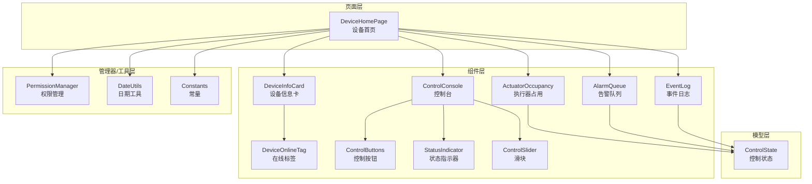
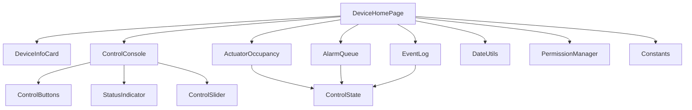
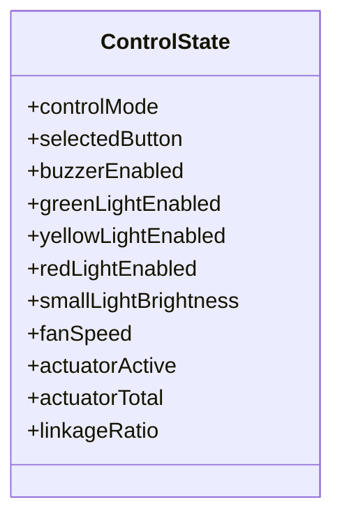
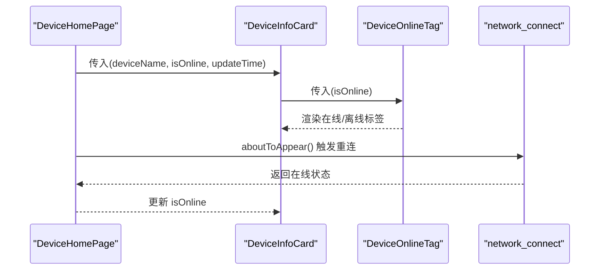
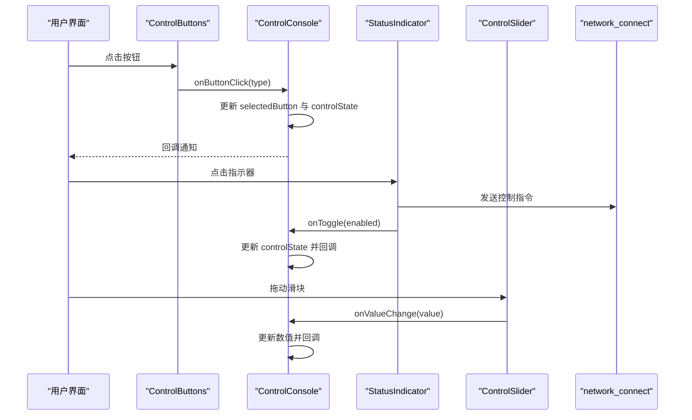
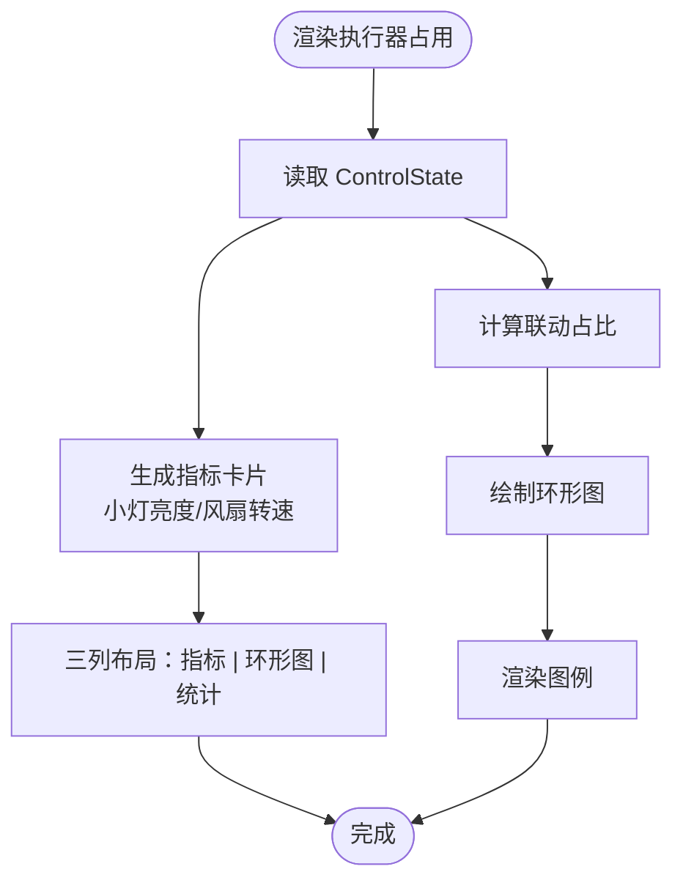
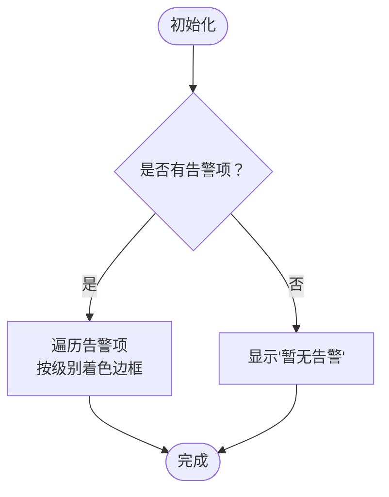
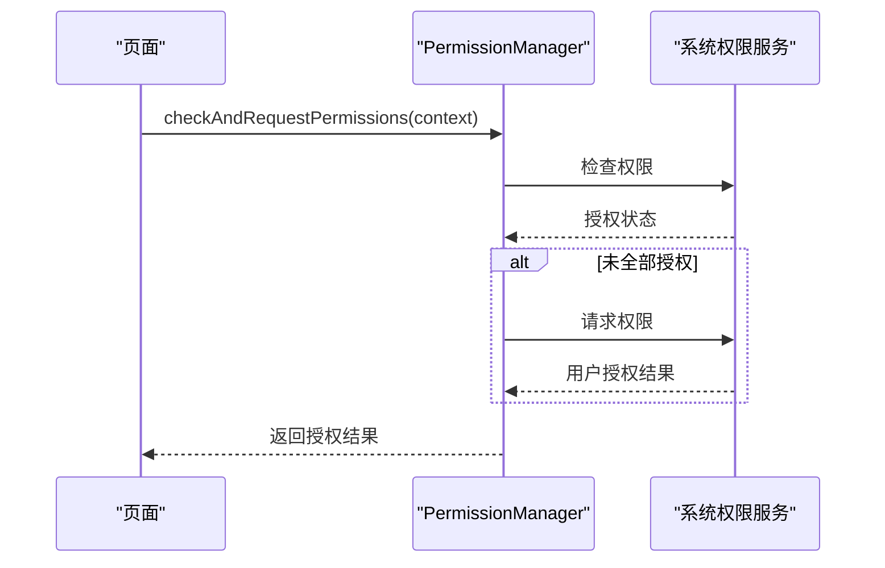
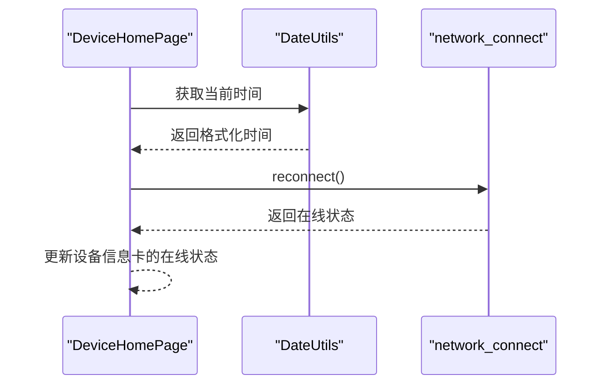
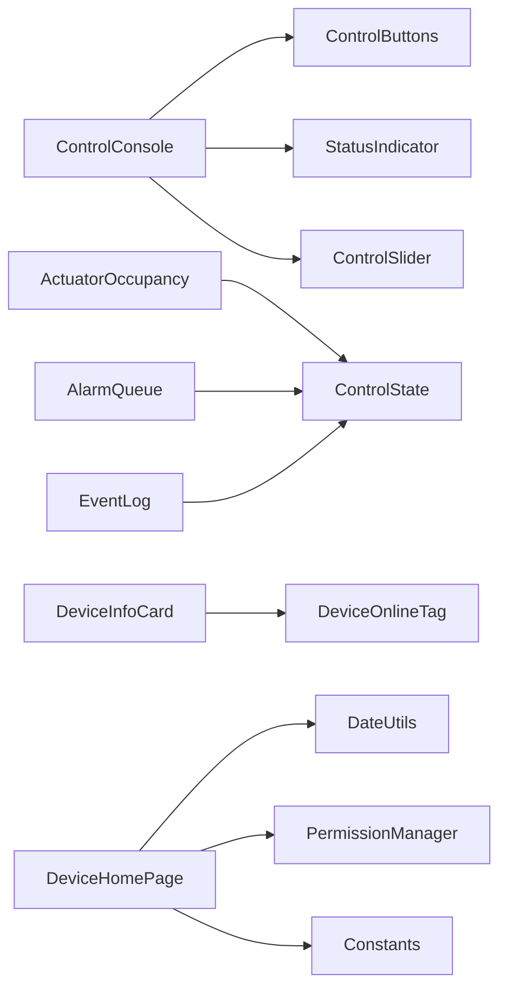

# 设备管理系统

<cite>
**本文引用的文件**
- [entry\src\main\ets\models\ControlState.ets](file://entry\src\main\ets\models\ControlState.ets)
- [entry\src\main\ets\managers\PermissionManager.ets](file://entry\src\main\ets\managers\PermissionManager.ets)
- [entry\src\main\ets\components\device\DeviceInfoCard.ets](file://entry\src\main\ets\components\device\DeviceInfoCard.ets)
- [entry\src\main\ets\components\device\DeviceOnlineTag.ets](file://entry\src\main\ets\components\device\DeviceOnlineTag.ets)
- [entry\src\main\ets\components\log\AlarmQueue.ets](file://entry\src\main\ets\components\log\AlarmQueue.ets)
- [entry\src\main\ets\components\log\EventLog.ets](file://entry\src\main\ets\components\log\EventLog.ets)
- [entry\src\main\ets\components\control\ControlConsole.ets](file://entry\src\main\ets\components\control\ControlConsole.ets)
- [entry\src\main\ets\components\control\ControlButtons.ets](file://entry\src\main\ets\components\control\ControlButtons.ets)
- [entry\src\main\ets\components\control\StatusIndicator.ets](file://entry\src\main\ets\components\control\StatusIndicator.ets)
- [entry\src\main\ets\components\control\ControlSlider.ets](file://entry\src\main\ets\components\control\ControlSlider.ets)
- [entry\src\main\ets\components\actuator\ActuatorOccupancy.ets](file://entry\src\main\ets\components\actuator\ActuatorOccupancy.ets)
- [entry\src\main\ets\pages\DeviceHomePage.ets](file://entry\src\main\ets\pages\DeviceHomePage.ets)
- [entry\src\main\ets\utils\DateUtils.ets](file://entry\src\main\ets\utils\DateUtils.ets)
- [entry\src\main\ets\common\Constants.ets](file://entry\src\main\ets\common\Constants.ets)
</cite>

## 目录
1. [简介](#简介)
2. [项目结构](#项目结构)
3. [核心组件](#核心组件)
4. [架构总览](#架构总览)
5. [详细组件分析](#详细组件分析)
6. [依赖关系分析](#依赖关系分析)
7. [性能考虑](#性能考虑)
8. [故障排查指南](#故障排查指南)
9. [结论](#结论)
10. [附录](#附录)

## 简介
本文件为设备管理系统的综合技术文档，面向开发者与产品人员，系统性阐述设备信息展示与管理、执行器状态监控、告警队列管理、在线状态检测、权限与安全控制、以及设备配置导入导出与批量管理的实现思路与扩展指引。文档基于现有代码结构进行深入分析，并提供可视化图表帮助理解。

## 项目结构
系统采用分层与功能域结合的组织方式：
- 页面层：负责页面编排与交互入口（如设备首页）
- 组件层：可复用的 UI 组件（设备信息卡、在线标签、控制台、告警队列、事件日志、执行器占用等）
- 模型层：状态与数据模型（控制状态、告警项、事件日志项）
- 管理器层：业务与平台能力封装（权限管理、常量定义）
- 工具层：通用工具（日期格式化）

**图表来源**
- [entry\src\main\ets\pages\DeviceHomePage.ets](file://entry\src\main\ets\pages\DeviceHomePage.ets)
- [entry\src\main\ets\components\device\DeviceInfoCard.ets](file://entry\src\main\ets\components\device\DeviceInfoCard.ets)
- [entry\src\main\ets\components\device\DeviceOnlineTag.ets](file://entry\src\main\ets\components\device\DeviceOnlineTag.ets)
- [entry\src\main\ets\components\control\ControlConsole.ets](file://entry\src\main\ets\components\control\ControlConsole.ets)
- [entry\src\main\ets\components\control\ControlButtons.ets](file://entry\src\main\ets\components\control\ControlButtons.ets)
- [entry\src\main\ets\components\control\StatusIndicator.ets](file://entry\src\main\ets\components\control\StatusIndicator.ets)
- [entry\src\main\ets\components\control\ControlSlider.ets](file://entry\src\main\ets\components\control\ControlSlider.ets)
- [entry\src\main\ets\components\actuator\ActuatorOccupancy.ets](file://entry\src\main\ets\components\actuator\ActuatorOccupancy.ets)
- [entry\src\main\ets\components\log\AlarmQueue.ets](file://entry\src\main\ets\components\log\AlarmQueue.ets)
- [entry\src\main\ets\components\log\EventLog.ets](file://entry\src\main\ets\components\log\EventLog.ets)
- [entry\src\main\ets\models\ControlState.ets](file://entry\src\main\ets\models\ControlState.ets)
- [entry\src\main\ets\utils\DateUtils.ets](file://entry\src\main\ets\utils\DateUtils.ets)
- [entry\src\main\ets\managers\PermissionManager.ets](file://entry\src\main\ets\managers\PermissionManager.ets)
- [entry\src\main\ets\common\Constants.ets](file://entry\src\main\ets\common\Constants.ets)

**章节来源**
- [entry\src\main\ets\pages\DeviceHomePage.ets](file://entry\src\main\ets\pages\DeviceHomePage.ets)
- [entry\src\main\ets\components\device\DeviceInfoCard.ets](file://entry\src\main\ets\components\device\DeviceInfoCard.ets)
- [entry\src\main\ets\components\device\DeviceOnlineTag.ets](file://entry\src\main\ets\components\device\DeviceOnlineTag.ets)
- [entry\src\main\ets\components\control\ControlConsole.ets](file://entry\src\main\ets\components\control\ControlConsole.ets)
- [entry\src\main\ets\components\control\ControlButtons.ets](file://entry\src\main\ets\components\control\ControlButtons.ets)
- [entry\src\main\ets\components\control\StatusIndicator.ets](file://entry\src\main\ets\components\control\StatusIndicator.ets)
- [entry\src\main\ets\components\control\ControlSlider.ets](file://entry\src\main\ets\components\control\ControlSlider.ets)
- [entry\src\main\ets\components\actuator\ActuatorOccupancy.ets](file://entry\src\main\ets\components\actuator\ActuatorOccupancy.ets)
- [entry\src\main\ets\components\log\AlarmQueue.ets](file://entry\src\main\ets\components\log\AlarmQueue.ets)
- [entry\src\main\ets\components\log\EventLog.ets](file://entry\src\main\ets\components\log\EventLog.ets)
- [entry\src\main\ets\models\ControlState.ets](file://entry\src\main\ets\models\ControlState.ets)
- [entry\src\main\ets\utils\DateUtils.ets](file://entry\src\main\ets\utils\DateUtils.ets)
- [entry\src\main\ets\managers\PermissionManager.ets](file://entry\src\main\ets\managers\PermissionManager.ets)
- [entry\src\main\ets\common\Constants.ets](file://entry\src\main\ets\common\Constants.ets)

## 核心组件
- 控制状态模型：统一管理控制模式、按钮选择、执行器占用与灯光/风扇等状态，作为控制台与执行器占用组件的数据源。
- 设备信息卡与在线标签：展示设备名称、在线状态与更新时间，支持通过网络连接状态驱动在线标识。
- 控制台：整合按钮、状态指示器与滑块，提供场景/开关/模拟量控制入口，并通过网络连接发送控制指令。
- 执行器占用：展示执行器激活数、总数与联动占比，配合环形图与指标卡直观呈现。
- 告警队列与事件日志：分别承载工业告警与事件追踪，支持不同等级与样式展示。
- 权限管理：封装权限检查与请求流程，保障麦克风与网络访问等能力的合规使用。
- 日期工具：提供格式化与当前时间获取，用于更新时间与日志时间戳。

**章节来源**
- [entry\src\main\ets\models\ControlState.ets](file://entry\src\main\ets\models\ControlState.ets)
- [entry\src\main\ets\components\device\DeviceInfoCard.ets](file://entry\src\main\ets\components\device\DeviceInfoCard.ets)
- [entry\src\main\ets\components\device\DeviceOnlineTag.ets](file://entry\src\main\ets\components\device\DeviceOnlineTag.ets)
- [entry\src\main\ets\components\control\ControlConsole.ets](file://entry\src\main\ets\components\control\ControlConsole.ets)
- [entry\src\main\ets\components\actuator\ActuatorOccupancy.ets](file://entry\src\main\ets\components\actuator\ActuatorOccupancy.ets)
- [entry\src\main\ets\components\log\AlarmQueue.ets](file://entry\src\main\ets\components\log\AlarmQueue.ets)
- [entry\src\main\ets\components\log\EventLog.ets](file://entry\src\main\ets\components\log\EventLog.ets)
- [entry\src\main\ets\managers\PermissionManager.ets](file://entry\src\main\ets\managers\PermissionManager.ets)
- [entry\src\main\ets\utils\DateUtils.ets](file://entry\src\main\ets\utils\DateUtils.ets)

## 架构总览
系统采用“页面-组件-模型-管理器/工具”的分层架构，页面负责编排，组件负责展示与交互，模型提供状态数据，管理器与工具提供平台能力与通用方法。控制台通过网络连接发送控制指令，设备信息卡与在线标签反映网络状态，执行器占用组件消费控制状态并计算联动指标，告警与事件日志提供运维可观测性。

**图表来源**
- [entry\src\main\ets\pages\DeviceHomePage.ets](file://entry\src\main\ets\pages\DeviceHomePage.ets)
- [entry\src\main\ets\components\control\ControlConsole.ets](file://entry\src\main\ets\components\control\ControlConsole.ets)
- [entry\src\main\ets\components\control\ControlButtons.ets](file://entry\src\main\ets\components\control\ControlButtons.ets)
- [entry\src\main\ets\components\control\StatusIndicator.ets](file://entry\src\main\ets\components\control\StatusIndicator.ets)
- [entry\src\main\ets\components\control\ControlSlider.ets](file://entry\src\main\ets\components\control\ControlSlider.ets)
- [entry\src\main\ets\components\actuator\ActuatorOccupancy.ets](file://entry\src\main\ets\components\actuator\ActuatorOccupancy.ets)
- [entry\src\main\ets\components\log\AlarmQueue.ets](file://entry\src\main\ets\components\log\AlarmQueue.ets)
- [entry\src\main\ets\components\log\EventLog.ets](file://entry\src\main\ets\components\log\EventLog.ets)
- [entry\src\main\ets\models\ControlState.ets](file://entry\src\main\ets\models\ControlState.ets)
- [entry\src\main\ets\utils\DateUtils.ets](file://entry\src\main\ets\utils\DateUtils.ets)
- [entry\src\main\ets\managers\PermissionManager.ets](file://entry\src\main\ets\managers\PermissionManager.ets)
- [entry\src\main\ets\common\Constants.ets](file://entry\src\main\ets\common\Constants.ets)

## 详细组件分析

### 控制状态模型（ControlState）
- 角色定位：集中管理控制模式、按钮选择、执行器占用与灯光/风扇等状态。
- 关键字段与含义：
  - 控制模式：场景/开关/模拟量
  - 按钮类型：展示/告警/静音
  - 灯光与蜂鸣器状态：布尔值
  - 小灯亮度与风扇转速：0-100 的数值
  - 执行器占用：激活数、总数与联动占比
- 复杂度与性能：纯数据结构，读写操作 O(1)，适合频繁响应式更新。

**图表来源**
- [entry\src\main\ets\models\ControlState.ets](file://entry\src\main\ets\models\ControlState.ets)

**章节来源**
- [entry\src\main\ets\models\ControlState.ets](file://entry\src\main\ets\models\ControlState.ets)

### 设备信息卡与在线标签
- 设备信息卡：展示设备名称、在线标签与更新时间；设备图片区域预留。
- 在线标签：根据在线状态显示不同颜色与文案，背景带透明色块。
- 数据来源：页面传入设备名与更新时间；在线状态由网络连接模块提供。

**图表来源**
- [entry\src\main\ets\pages\DeviceHomePage.ets](file://entry\src\main\ets\pages\DeviceHomePage.ets)
- [entry\src\main\ets\components\device\DeviceInfoCard.ets](file://entry\src\main\ets\components\device\DeviceInfoCard.ets)
- [entry\src\main\ets\components\device\DeviceOnlineTag.ets](file://entry\src\main\ets\components\device\DeviceOnlineTag.ets)

**章节来源**
- [entry\src\main\ets\components\device\DeviceInfoCard.ets](file://entry\src\main\ets\components\device\DeviceInfoCard.ets)
- [entry\src\main\ets\components\device\DeviceOnlineTag.ets](file://entry\src\main\ets\components\device\DeviceOnlineTag.ets)
- [entry\src\main\ets\pages\DeviceHomePage.ets](file://entry\src\main\ets\pages\DeviceHomePage.ets)

### 控制台与子组件
- 控制台：整合按钮组、状态指示器与滑块，维护统一的控制状态，支持回调通知。
- 按钮组：单选模式，仅一个按钮高亮；点击触发状态变更。
- 状态指示器：点击切换状态，同时通过网络连接发送指令。
- 滑块：0-100 数值调节，实时更新控制状态。

**图表来源**
- [entry\src\main\ets\components\control\ControlConsole.ets](file://entry\src\main\ets\components\control\ControlConsole.ets)
- [entry\src\main\ets\components\control\ControlButtons.ets](file://entry\src\main\ets\components\control\ControlButtons.ets)
- [entry\src\main\ets\components\control\StatusIndicator.ets](file://entry\src\main\ets\components\control\StatusIndicator.ets)
- [entry\src\main\ets\components\control\ControlSlider.ets](file://entry\src\main\ets\components\control\ControlSlider.ets)

**章节来源**
- [entry\src\main\ets\components\control\ControlConsole.ets](file://entry\src\main\ets\components\control\ControlConsole.ets)
- [entry\src\main\ets\components\control\ControlButtons.ets](file://entry\src\main\ets\components\control\ControlButtons.ets)
- [entry\src\main\ets\components\control\StatusIndicator.ets](file://entry\src\main\ets\components\control\StatusIndicator.ets)
- [entry\src\main\ets\components\control\ControlSlider.ets](file://entry\src\main\ets\components\control\ControlSlider.ets)

### 执行器占用组件
- 功能：展示小灯亮度、风扇转速的目标值，执行器激活数/总数与联动占比，并配以环形图与图例。
- 数据来源：从控制状态读取当前值，计算联动占比。

**图表来源**
- [entry\src\main\ets\components\actuator\ActuatorOccupancy.ets](file://entry\src\main\ets\components\actuator\ActuatorOccupancy.ets)
- [entry\src\main\ets\models\ControlState.ets](file://entry\src\main\ets\models\ControlState.ets)

**章节来源**
- [entry\src\main\ets\components\actuator\ActuatorOccupancy.ets](file://entry\src\main\ets\components\actuator\ActuatorOccupancy.ets)
- [entry\src\main\ets\models\ControlState.ets](file://entry\src\main\ets\models\ControlState.ets)

### 告警队列与事件日志
- 告警队列：支持严重、警告、提示三级别，按级别设置边框颜色；空队列显示提示文本。
- 事件日志：展示时间戳与消息，支持空状态提示。
- 用途：前者用于异常与越界告警，后者用于控制回执与系统事件追踪。

**图表来源**
- [entry\src\main\ets\components\log\AlarmQueue.ets](file://entry\src\main\ets\components\log\AlarmQueue.ets)
- [entry\src\main\ets\components\log\EventLog.ets](file://entry\src\main\ets\components\log\EventLog.ets)

**章节来源**
- [entry\src\main\ets\components\log\AlarmQueue.ets](file://entry\src\main\ets\components\log\AlarmQueue.ets)
- [entry\src\main\ets\components\log\EventLog.ets](file://entry\src\main\ets\components\log\EventLog.ets)

### 权限管理与安全控制
- 权限检查：对麦克风与网络权限进行检查与请求，返回授权结果。
- 安全建议：在需要网络或录音能力时，先调用权限管理器，失败则引导用户手动授权或降级功能。

**图表来源**
- [entry\src\main\ets\managers\PermissionManager.ets](file://entry\src\main\ets\managers\PermissionManager.ets)

**章节来源**
- [entry\src\main\ets\managers\PermissionManager.ets](file://entry\src\main\ets\managers\PermissionManager.ets)

### 在线状态检测与更新
- 设备首页在出现时更新时间并触发网络重连；设备信息卡与在线标签根据网络状态渲染。
- 建议：在网络连接模块中实现心跳与离线检测，结合恢复通知完善状态闭环。

**图表来源**
- [entry\src\main\ets\pages\DeviceHomePage.ets](file://entry\src\main\ets\pages\DeviceHomePage.ets)
- [entry\src\main\ets\utils\DateUtils.ets](file://entry\src\main\ets\utils\DateUtils.ets)

**章节来源**
- [entry\src\main\ets\pages\DeviceHomePage.ets](file://entry\src\main\ets\pages\DeviceHomePage.ets)
- [entry\src\main\ets\utils\DateUtils.ets](file://entry\src\main\ets\utils\DateUtils.ets)

### 设备配置导入导出与批量管理
- 现状：代码中未发现导入导出与批量管理的具体实现。
- 建议：
  - 导入：解析配置文件（如 JSON），映射到控制状态与设备属性，批量更新 UI。
  - 导出：序列化当前控制状态与设备属性为配置文件。
  - 批量：提供模板与校验规则，支持多设备统一下发控制参数。

[本节为概念性建议，不直接分析具体文件]

## 依赖关系分析
- 组件耦合：控制台与子组件松耦合，通过属性与回调通信；执行器占用依赖控制状态模型；设备信息卡依赖在线标签与网络连接状态。
- 外部依赖：权限管理依赖系统权限服务；日期工具提供时间格式化；常量集中管理第三方服务参数。
- 循环依赖：当前结构未见循环依赖风险。

**图表来源**
- [entry\src\main\ets\components\control\ControlConsole.ets](file://entry\src\main\ets\components\control\ControlConsole.ets)
- [entry\src\main\ets\components\control\ControlButtons.ets](file://entry\src\main\ets\components\control\ControlButtons.ets)
- [entry\src\main\ets\components\control\StatusIndicator.ets](file://entry\src\main\ets\components\control\StatusIndicator.ets)
- [entry\src\main\ets\components\control\ControlSlider.ets](file://entry\src\main\ets\components\control\ControlSlider.ets)
- [entry\src\main\ets\components\actuator\ActuatorOccupancy.ets](file://entry\src\main\ets\components\actuator\ActuatorOccupancy.ets)
- [entry\src\main\ets\components\log\AlarmQueue.ets](file://entry\src\main\ets\components\log\AlarmQueue.ets)
- [entry\src\main\ets\components\log\EventLog.ets](file://entry\src\main\ets\components\log\EventLog.ets)
- [entry\src\main\ets\components\device\DeviceInfoCard.ets](file://entry\src\main\ets\components\device\DeviceInfoCard.ets)
- [entry\src\main\ets\components\device\DeviceOnlineTag.ets](file://entry\src\main\ets\components\device\DeviceOnlineTag.ets)
- [entry\src\main\ets\pages\DeviceHomePage.ets](file://entry\src\main\ets\pages\DeviceHomePage.ets)
- [entry\src\main\ets\utils\DateUtils.ets](file://entry\src\main\ets\utils\DateUtils.ets)
- [entry\src\main\ets\managers\PermissionManager.ets](file://entry\src\main\ets\managers\PermissionManager.ets)
- [entry\src\main\ets\common\Constants.ets](file://entry\src\main\ets\common\Constants.ets)

**章节来源**
- [entry\src\main\ets\components\control\ControlConsole.ets](file://entry\src\main\ets\components\control\ControlConsole.ets)
- [entry\src\main\ets\components\actuator\ActuatorOccupancy.ets](file://entry\src\main\ets\components\actuator\ActuatorOccupancy.ets)
- [entry\src\main\ets\components\log\AlarmQueue.ets](file://entry\src\main\ets\components\log\AlarmQueue.ets)
- [entry\src\main\ets\components\log\EventLog.ets](file://entry\src\main\ets\components\log\EventLog.ets)
- [entry\src\main\ets\components\device\DeviceInfoCard.ets](file://entry\src\main\ets\components\device\DeviceInfoCard.ets)
- [entry\src\main\ets\components\device\DeviceOnlineTag.ets](file://entry\src\main\ets\components\device\DeviceOnlineTag.ets)
- [entry\src\main\ets\pages\DeviceHomePage.ets](file://entry\src\main\ets\pages\DeviceHomePage.ets)
- [entry\src\main\ets\utils\DateUtils.ets](file://entry\src\main\ets\utils\DateUtils.ets)
- [entry\src\main\ets\managers\PermissionManager.ets](file://entry\src\main\ets\managers\PermissionManager.ets)
- [entry\src\main\ets\common\Constants.ets](file://entry\src\main\ets\common\Constants.ets)

## 性能考虑
- 响应式更新：控制状态为轻量数据结构，频繁更新不会造成明显开销；建议避免在回调中进行重型计算。
- 组件渲染：告警与事件日志在空集合时快速渲染提示文本，减少不必要的虚拟节点。
- 网络交互：控制台通过网络连接发送指令，建议在 UI 层增加防抖与去重，避免重复命令。
- 图表渲染：环形图与滑块为轻量组件，保持默认尺寸与步长可降低重绘成本。

[本节提供一般性建议，不直接分析具体文件]

## 故障排查指南
- 在线状态异常
  - 现象：设备信息卡显示离线但实际在线。
  - 排查：确认网络连接模块的重连逻辑与状态回传；检查设备首页的 aboutToAppear 生命周期是否正确触发。
- 控制指令无效
  - 现象：点击状态指示器或滑块无响应。
  - 排查：检查网络连接模块的 send 方法是否被调用；确认权限管理器已授予必要权限。
- 告警与事件日志为空
  - 现象：告警队列与事件日志均显示“暂无”。
  - 排查：确认页面初始化时是否注入了初始数据；检查组件 props 传入是否正确。
- 权限拒绝
  - 现象：录音或网络功能不可用。
  - 排查：调用权限管理器检查与请求流程，确保用户授权成功。

**章节来源**
- [entry\src\main\ets\pages\DeviceHomePage.ets](file://entry\src\main\ets\pages\DeviceHomePage.ets)
- [entry\src\main\ets\components\control\ControlConsole.ets](file://entry\src\main\ets\components\control\ControlConsole.ets)
- [entry\src\main\ets\components\log\AlarmQueue.ets](file://entry\src\main\ets\components\log\AlarmQueue.ets)
- [entry\src\main\ets\components\log\EventLog.ets](file://entry\src\main\ets\components\log\EventLog.ets)
- [entry\src\main\ets\managers\PermissionManager.ets](file://entry\src\main\ets\managers\PermissionManager.ets)

## 结论
本系统以清晰的分层架构实现了设备信息展示、控制与监控功能，具备良好的可扩展性。建议后续完善在线状态检测、告警分类与优先级策略、权限与安全控制、以及配置导入导出与批量管理能力，以满足更复杂的工业场景需求。

[本节为总结性内容，不直接分析具体文件]

## 附录

### 扩展设备类型与集成新设备指导
- 新增设备类型
  - 在控制状态模型中扩展新的控制参数与模式。
  - 在控制台新增对应的按钮或滑块组件，并绑定到控制状态。
  - 在设备信息卡中扩展属性展示，必要时新增组件。
- 集成新设备
  - 通过网络连接模块抽象设备协议，统一发送与接收格式。
  - 在告警队列中新增该设备相关的告警类型与级别。
  - 在事件日志中记录设备控制回执与系统事件。
  - 在权限管理中评估所需权限并进行检查与请求。

[本节为概念性指导，不直接分析具体文件]