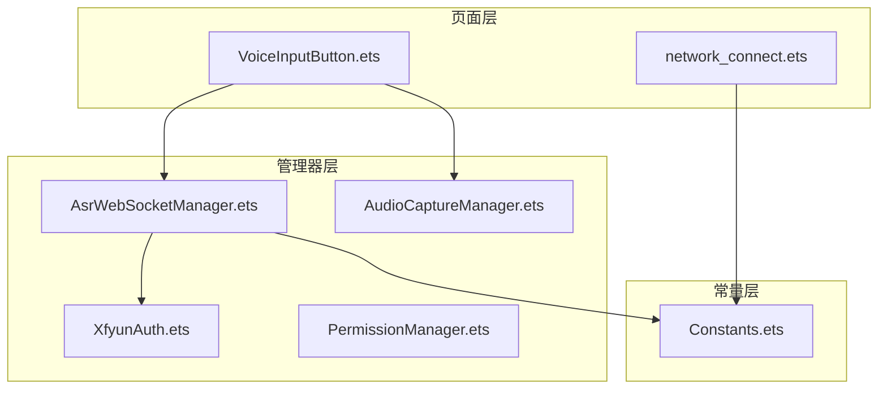
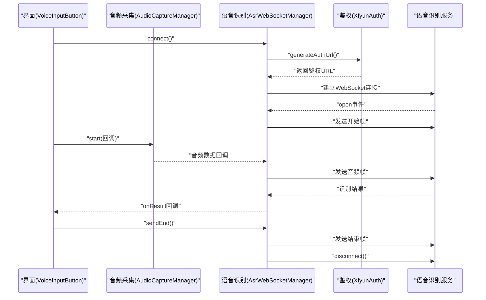
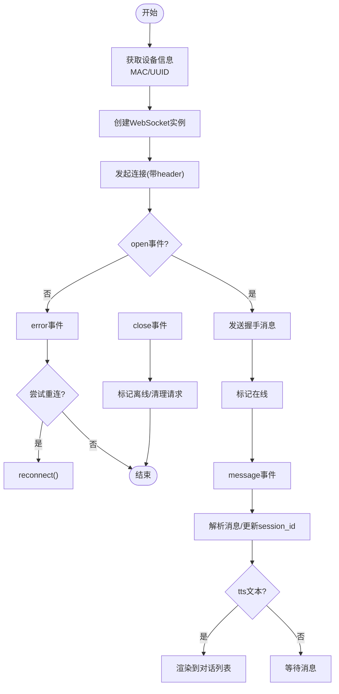
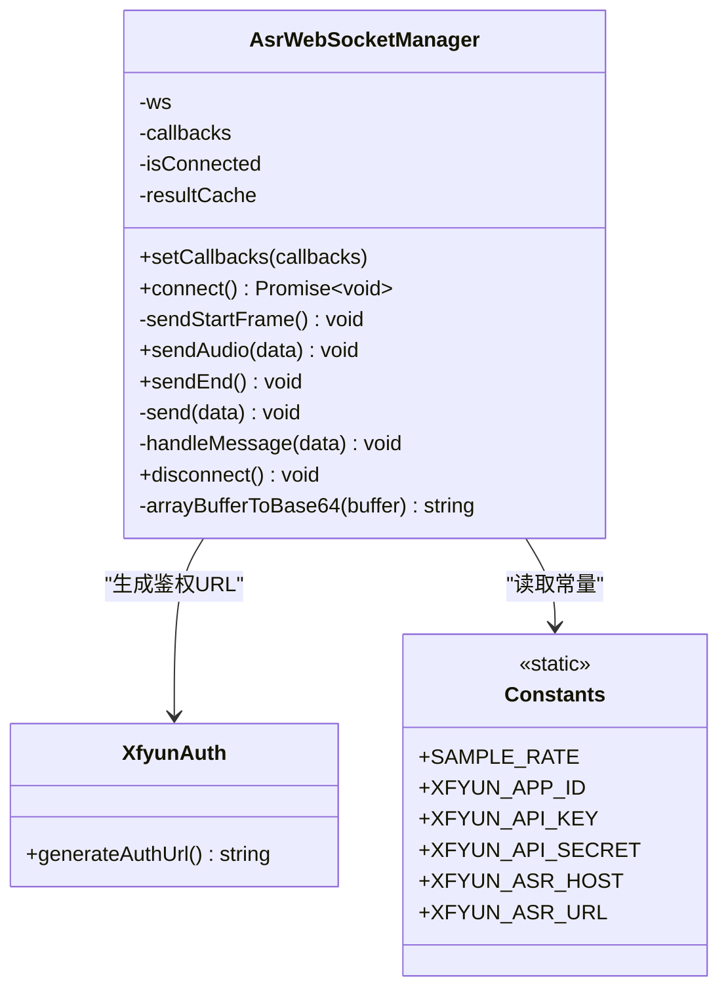
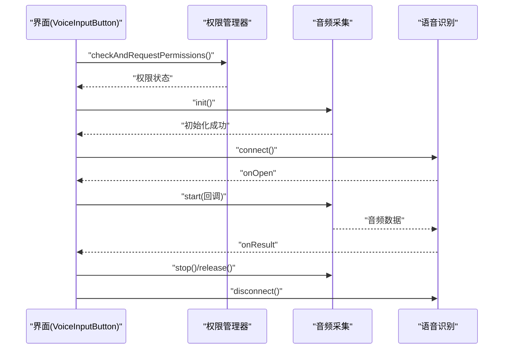
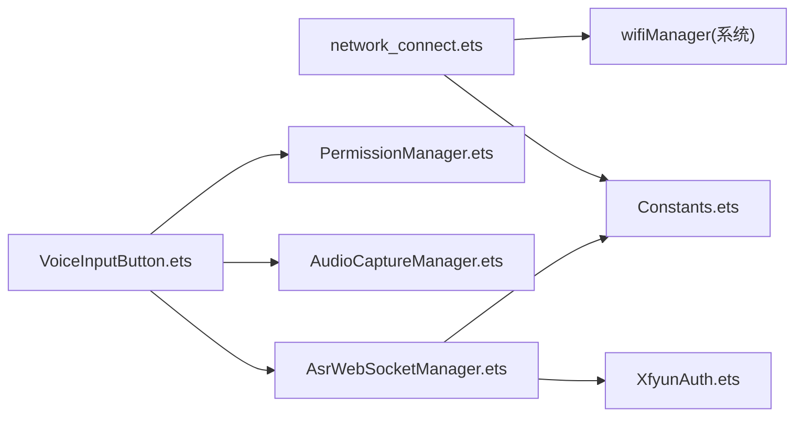
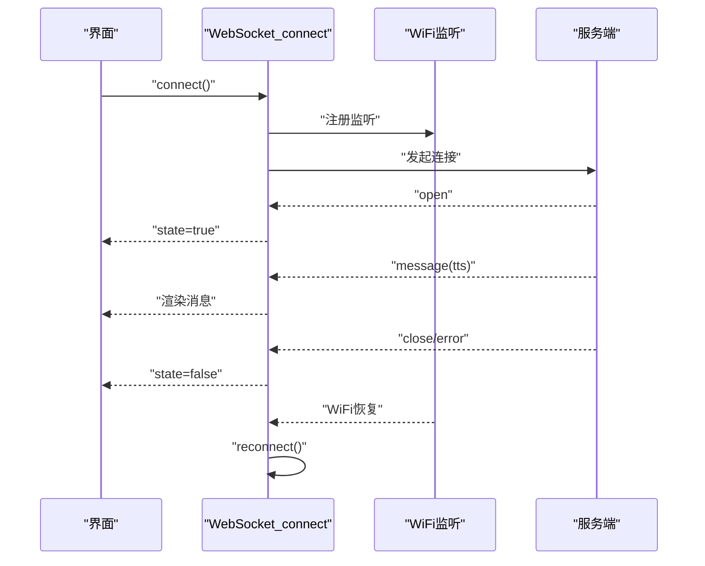

# WebSocket 连接管理

<cite>
**本文引用的文件**
- [AsrWebSocketManager.ets](file://entry/src/main/ets/managers/AsrWebSocketManager.ets)
- [AudioCaptureManager.ets](file://entry/src/main/ets/managers/AudioCaptureManager.ets)
- [XfyunAuth.ets](file://entry/src/main/ets/managers/XfyunAuth.ets)
- [Constants.ets](file://entry/src/main/ets/common/Constants.ets)
- [network_connect.ets](file://entry/src/main/ets/pages/network_connect.ets)
- [VoiceInputButton.ets](file://entry/src/main/ets/components/chat/VoiceInputButton.ets)
- [PermissionManager.ets](file://entry/src/main/ets/managers/PermissionManager.ets)
</cite>

## 目录
1. [简介](#简介)
2. [项目结构](#项目结构)
3. [核心组件](#核心组件)
4. [架构总览](#架构总览)
5. [详细组件分析](#详细组件分析)
6. [依赖关系分析](#依赖关系分析)
7. [性能考量](#性能考量)
8. [故障排查指南](#故障排查指南)
9. [结论](#结论)
10. [附录](#附录)

## 简介
本技术文档围绕项目中的两类 WebSocket 连接管理进行系统性梳理与说明：
- 设备侧 WebSocket 连接管理：负责与本地或远端服务建立长连接，维持在线状态、处理消息、断线检测与自动重连。
- 语音识别 WebSocket 连接管理：基于讯飞语音识别服务，负责鉴权、连接、音频帧发送、识别结果解析与连接关闭。

文档将从连接生命周期、参数配置、事件处理、状态管理、连接池与并发控制、资源清理、调试与性能优化等方面展开，帮助开发者快速理解与扩展。

## 项目结构
项目采用以页面与功能模块分层的组织方式，WebSocket 相关代码主要分布在以下位置：
- 页面层：network_connect.ets 提供设备侧 WebSocket 的完整生命周期与事件处理。
- 管理器层：AsrWebSocketManager.ets、AudioCaptureManager.ets、XfyunAuth.ets、PermissionManager.ets 提供语音识别链路的连接、鉴权、音频采集与权限检查。
- 常量层：Constants.ets 定义采样率、鉴权参数等全局常量。

图表来源
- [network_connect.ets:36-315](file://entry/src/main/ets/pages/network_connect.ets#L36-L315)
- [VoiceInputButton.ets:14-28](file://entry/src/main/ets/components/chat/VoiceInputButton.ets#L14-L28)
- [AsrWebSocketManager.ets:82-271](file://entry/src/main/ets/managers/AsrWebSocketManager.ets#L82-L271)
- [AudioCaptureManager.ets:6-80](file://entry/src/main/ets/managers/AudioCaptureManager.ets#L6-L80)
- [XfyunAuth.ets:6-34](file://entry/src/main/ets/managers/XfyunAuth.ets#L6-L34)
- [Constants.ets:4-14](file://entry/src/main/ets/common/Constants.ets#L4-L14)

章节来源
- [network_connect.ets:36-315](file://entry/src/main/ets/pages/network_connect.ets#L36-L315)
- [AsrWebSocketManager.ets:82-271](file://entry/src/main/ets/managers/AsrWebSocketManager.ets#L82-L271)
- [AudioCaptureManager.ets:6-80](file://entry/src/main/ets/managers/AudioCaptureManager.ets#L6-L80)
- [XfyunAuth.ets:6-34](file://entry/src/main/ets/managers/XfyunAuth.ets#L6-L34)
- [Constants.ets:4-14](file://entry/src/main/ets/common/Constants.ets#L4-L14)

## 核心组件
- 设备侧 WebSocket 管理器：负责连接建立、事件绑定、消息收发、断线检测与自动重连。
- 语音识别 WebSocket 管理器：负责讯飞鉴权 URL 生成、连接建立、开始帧发送、音频帧发送、结果解析与连接关闭。
- 音频采集管理器：负责麦克风初始化、音频流读取回调、停止与释放。
- 权限管理器：负责麦克风与网络权限检查与申请。
- 常量定义：统一采样率、鉴权参数与服务地址。

章节来源
- [network_connect.ets:36-315](file://entry/src/main/ets/pages/network_connect.ets#L36-L315)
- [AsrWebSocketManager.ets:82-271](file://entry/src/main/ets/managers/AsrWebSocketManager.ets#L82-L271)
- [AudioCaptureManager.ets:6-80](file://entry/src/main/ets/managers/AudioCaptureManager.ets#L6-L80)
- [PermissionManager.ets:5-28](file://entry/src/main/ets/managers/PermissionManager.ets#L5-L28)
- [Constants.ets:4-14](file://entry/src/main/ets/common/Constants.ets#L4-L14)

## 架构总览
设备侧与语音识别两条 WebSocket 流程并行存在，分别服务于不同业务场景。设备侧连接负责与本地/远端服务通信，语音识别连接负责与讯飞服务通信。

图表来源
- [VoiceInputButton.ets:71-89](file://entry/src/main/ets/components/chat/VoiceInputButton.ets#L71-L89)
- [AsrWebSocketManager.ets:92-144](file://entry/src/main/ets/managers/AsrWebSocketManager.ets#L92-L144)
- [AsrWebSocketManager.ets:146-189](file://entry/src/main/ets/managers/AsrWebSocketManager.ets#L146-L189)
- [AsrWebSocketManager.ets:197-254](file://entry/src/main/ets/managers/AsrWebSocketManager.ets#L197-L254)
- [XfyunAuth.ets:7-24](file://entry/src/main/ets/managers/XfyunAuth.ets#L7-L24)

## 详细组件分析

### 设备侧 WebSocket 连接管理
- 连接建立
  - 初始化 WebSocket 实例，构造 URL，并通过自定义 header 注入设备标识与客户端标识。
  - header 包含协议版本、设备 ID、客户端 ID。
- 事件处理
  - open：标记在线状态，发送握手消息。
  - message：解析服务端消息，更新会话 ID，处理 TTS 文本并渲染到对话列表。
  - close：标记离线，清理未完成请求。
  - error：标记离线，尝试有限次数的自动重连。
- 断线检测与自动重连
  - 使用 WiFi 状态监听，当网络恢复时延迟触发重连。
  - 重连过程带锁避免并发重连，清理旧连接并重建。
- 参数配置
  - 设备标识：来自 Wi-Fi MAC 地址。
  - 客户端标识：随机 UUID。
  - 协议版本：固定字符串。
- 状态管理
  - 在线状态：布尔值，受 open/close/error 影响。
  - 会话 ID：首次收到消息时缓存。
  - 请求队列：使用 Map 存储未完成请求，连接关闭时统一拒绝。
- 资源清理
  - 关闭连接时注销 WiFi 监听，释放 WebSocket 引用。

图表来源
- [network_connect.ets:146-177](file://entry/src/main/ets/pages/network_connect.ets#L146-L177)
- [network_connect.ets:179-258](file://entry/src/main/ets/pages/network_connect.ets#L179-L258)
- [network_connect.ets:102-128](file://entry/src/main/ets/pages/network_connect.ets#L102-L128)
- [network_connect.ets:130-144](file://entry/src/main/ets/pages/network_connect.ets#L130-L144)

章节来源
- [network_connect.ets:36-315](file://entry/src/main/ets/pages/network_connect.ets#L36-L315)

### 语音识别 WebSocket 连接管理
- 连接建立
  - 通过鉴权类生成带签名的 URL，创建 WebSocket 并绑定 open/message/error/close 事件。
- 事件处理
  - open：清空结果缓存，发送开始帧。
  - message：解析 JSON，处理结果缓存与乱序修复，拼接文本，区分最终/中间结果。
  - error：记录错误并回调。
  - close：标记离线并回调。
- 参数配置
  - 设备标识：通过常量注入。
  - 协议版本：通过常量注入。
  - 业务参数：语言、领域、口音、VAD 等。
- 状态管理
  - 连接状态：布尔值，open/close 事件驱动。
  - 结果缓存：按序列号缓存，支持动态替换。
- 资源清理
  - disconnect() 主动关闭连接并释放引用。

图表来源
- [AsrWebSocketManager.ets:82-271](file://entry/src/main/ets/managers/AsrWebSocketManager.ets#L82-L271)
- [XfyunAuth.ets:6-34](file://entry/src/main/ets/managers/XfyunAuth.ets#L6-L34)
- [Constants.ets:4-14](file://entry/src/main/ets/common/Constants.ets#L4-L14)

章节来源
- [AsrWebSocketManager.ets:82-271](file://entry/src/main/ets/managers/AsrWebSocketManager.ets#L82-L271)
- [XfyunAuth.ets:6-34](file://entry/src/main/ets/managers/XfyunAuth.ets#L6-L34)
- [Constants.ets:4-14](file://entry/src/main/ets/common/Constants.ets#L4-L14)

### 音频采集与权限管理
- 音频采集
  - 初始化音频流参数（采样率、通道、格式、编码），启动捕获并注册 readData 回调。
  - 提供 start/stop/release 生命周期方法。
- 权限管理
  - 检查并请求麦克风与网络权限，确保录音与网络连接可用。

图表来源
- [VoiceInputButton.ets:18-28](file://entry/src/main/ets/components/chat/VoiceInputButton.ets#L18-L28)
- [PermissionManager.ets:8-27](file://entry/src/main/ets/managers/PermissionManager.ets#L8-L27)
- [AudioCaptureManager.ets:11-34](file://entry/src/main/ets/managers/AudioCaptureManager.ets#L11-L34)
- [AsrWebSocketManager.ets:92-144](file://entry/src/main/ets/managers/AsrWebSocketManager.ets#L92-L144)

章节来源
- [AudioCaptureManager.ets:6-80](file://entry/src/main/ets/managers/AudioCaptureManager.ets#L6-L80)
- [PermissionManager.ets:5-28](file://entry/src/main/ets/managers/PermissionManager.ets#L5-L28)
- [VoiceInputButton.ets:18-89](file://entry/src/main/ets/components/chat/VoiceInputButton.ets#L18-L89)

## 依赖关系分析
- 设备侧连接依赖常量层提供的服务地址与协议版本，依赖 Wi-Fi 管理器进行网络状态监听。
- 语音识别连接依赖鉴权类生成 URL，依赖常量层提供 APP_ID 等参数。
- 语音识别组件依赖权限管理器与音频采集管理器。

图表来源
- [network_connect.ets:36-315](file://entry/src/main/ets/pages/network_connect.ets#L36-L315)
- [AsrWebSocketManager.ets:82-271](file://entry/src/main/ets/managers/AsrWebSocketManager.ets#L82-L271)
- [XfyunAuth.ets:6-34](file://entry/src/main/ets/managers/XfyunAuth.ets#L6-L34)
- [Constants.ets:4-14](file://entry/src/main/ets/common/Constants.ets#L4-L14)
- [VoiceInputButton.ets:14-28](file://entry/src/main/ets/components/chat/VoiceInputButton.ets#L14-L28)

章节来源
- [network_connect.ets:36-315](file://entry/src/main/ets/pages/network_connect.ets#L36-L315)
- [AsrWebSocketManager.ets:82-271](file://entry/src/main/ets/managers/AsrWebSocketManager.ets#L82-L271)
- [VoiceInputButton.ets:14-28](file://entry/src/main/ets/components/chat/VoiceInputButton.ets#L14-L28)

## 性能考量
- 连接池与并发控制
  - 设备侧连接：当前实现为单一连接，无显式连接池；通过重连锁避免并发重连。
  - 语音识别连接：当前实现为单一连接，无并发发送；建议在多路并发识别场景下引入连接池与队列调度。
- 资源清理
  - 设备侧：关闭时注销 WiFi 监听，释放 WebSocket。
  - 语音识别：disconnect() 主动关闭并释放引用，避免内存泄漏。
- 事件处理
  - 设备侧：message 仅处理字符串文本，二进制数据直接忽略；建议根据业务需要扩展二进制处理。
  - 语音识别：结果缓存按序列号排序，支持动态替换；注意缓存容量与清理策略。
- 网络稳定性
  - 设备侧：WiFi 状态监听与延迟重连可提升稳定性；建议增加指数退避与最大重试次数上限。
- 音频传输
  - 采样率与帧时长：常量层定义采样率与帧时长，建议与服务端协商一致，避免丢包或延迟。

章节来源
- [network_connect.ets:102-128](file://entry/src/main/ets/pages/network_connect.ets#L102-L128)
- [network_connect.ets:298-313](file://entry/src/main/ets/pages/network_connect.ets#L298-L313)
- [AsrWebSocketManager.ets:256-264](file://entry/src/main/ets/managers/AsrWebSocketManager.ets#L256-L264)
- [Constants.ets:4-14](file://entry/src/main/ets/common/Constants.ets#L4-L14)

## 故障排查指南
- 常见问题定位
  - 连接失败：检查鉴权 URL 生成、网络权限、Wi-Fi 状态与服务端可达性。
  - 识别失败：检查音频数据格式、Base64 编码、开始帧与结束帧发送时机。
  - 结果乱序：检查结果缓存与序列号处理逻辑。
- 日志与调试
  - 设备侧：open/message/error/close 均输出详细日志，便于定位阶段。
  - 语音识别：消息接收与解析均输出日志，错误码与消息体可辅助诊断。
- 重连策略
  - 设备侧：WiFi 恢复后延迟重连，避免频繁抖动；可增加退避与上限。
- 资源释放
  - 界面销毁时确保调用 release()/disconnect()，避免后台残留。

章节来源
- [network_connect.ets:179-258](file://entry/src/main/ets/pages/network_connect.ets#L179-L258)
- [AsrWebSocketManager.ets:99-134](file://entry/src/main/ets/managers/AsrWebSocketManager.ets#L99-L134)
- [VoiceInputButton.ets:25-28](file://entry/src/main/ets/components/chat/VoiceInputButton.ets#L25-L28)

## 结论
本项目在设备侧与语音识别两条 WebSocket 路径上提供了完整的生命周期管理与事件处理机制。设备侧连接具备断线检测与自动重连能力，语音识别连接具备鉴权、音频帧发送与结果解析能力。建议在多并发场景下引入连接池与队列调度，并完善二进制消息处理与缓存清理策略，以进一步提升稳定性与性能。

## 附录
- 关键流程时序图（设备侧）

图表来源
- [network_connect.ets:146-177](file://entry/src/main/ets/pages/network_connect.ets#L146-L177)
- [network_connect.ets:74-96](file://entry/src/main/ets/pages/network_connect.ets#L74-L96)
- [network_connect.ets:233-258](file://entry/src/main/ets/pages/network_connect.ets#L233-L258)