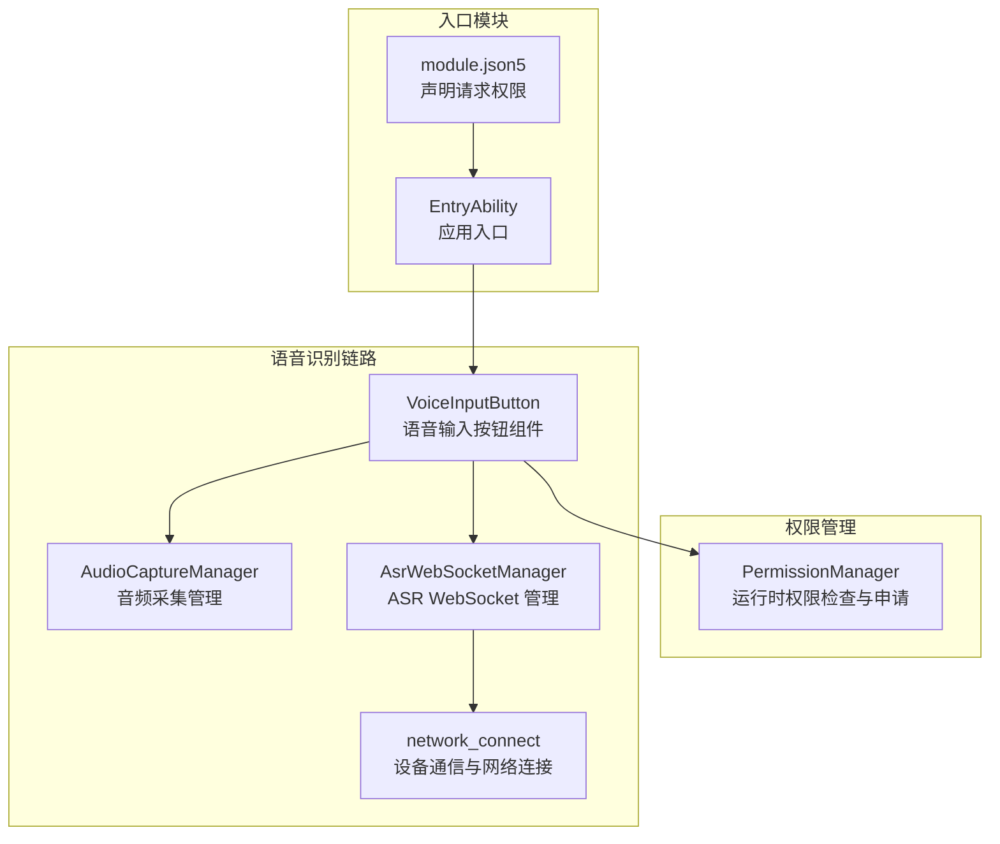
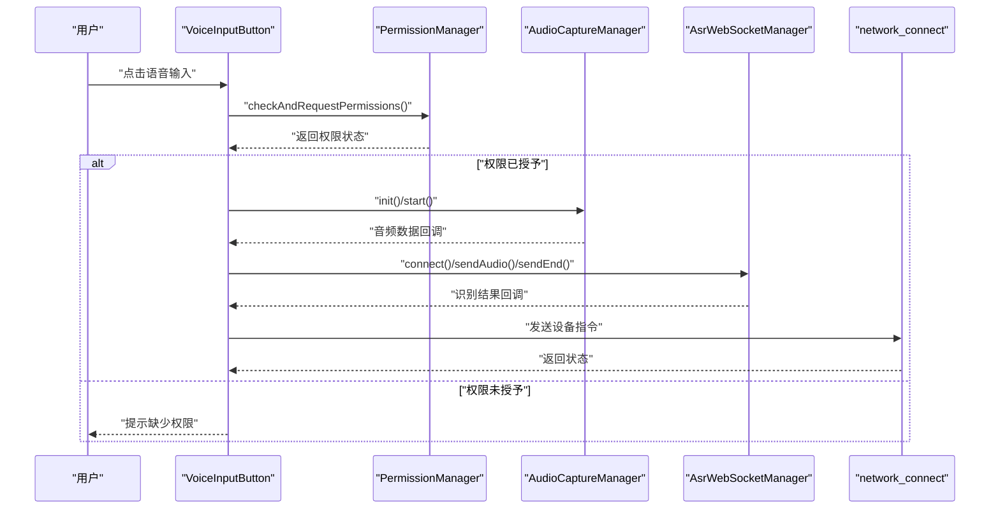
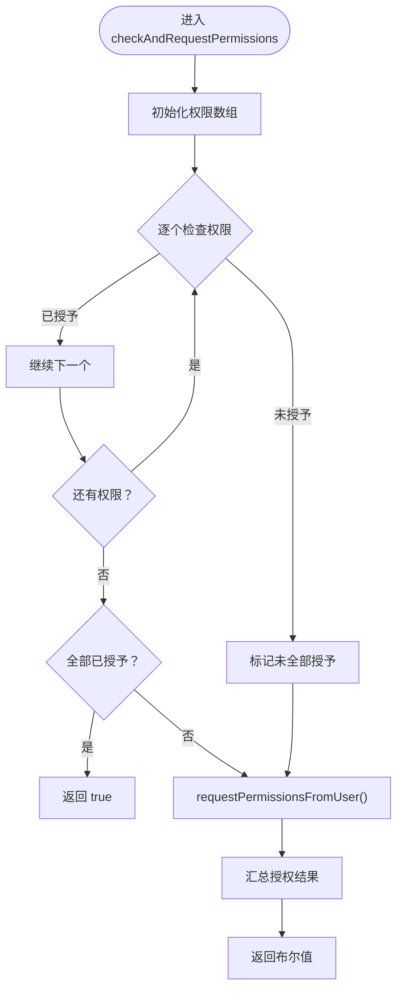
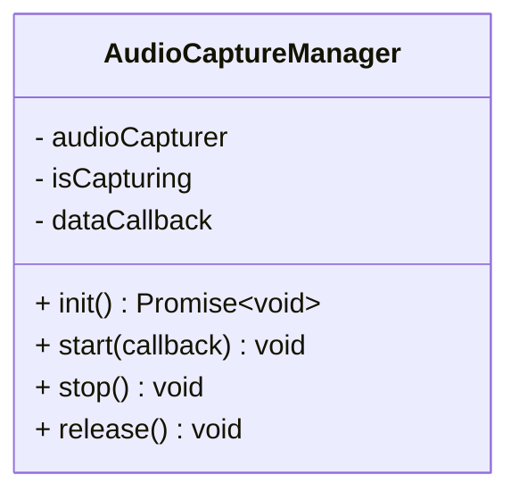
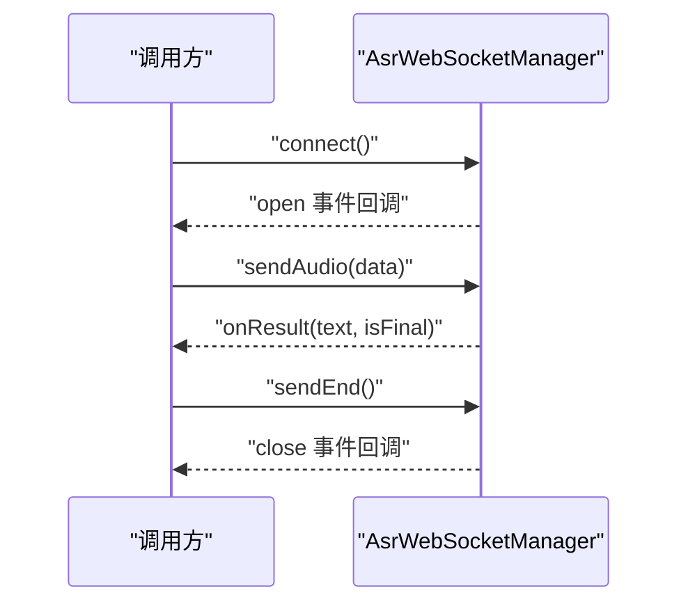
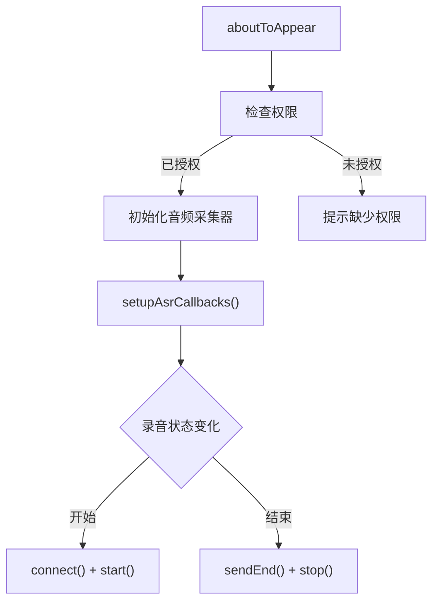
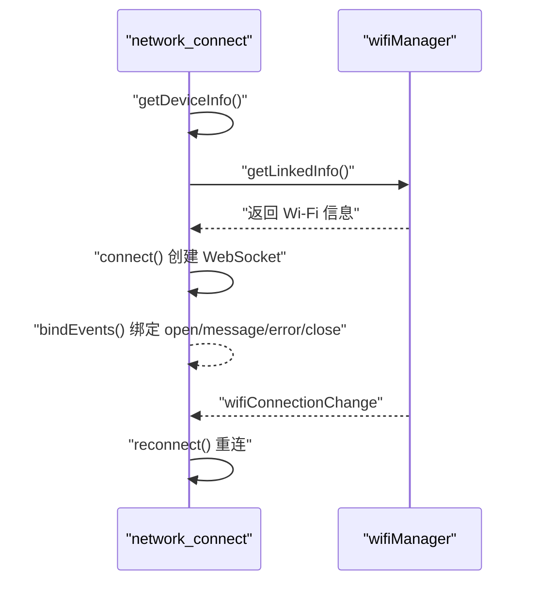
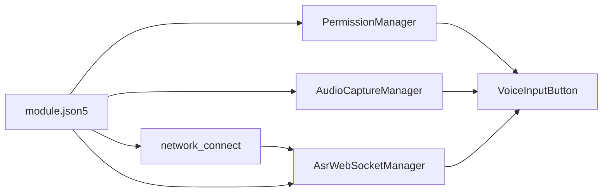

# 权限管理系统

<cite>
**本文引用的文件**
- [PermissionManager.ets](file://entry/src/main/ets/managers/PermissionManager.ets)
- [AudioCaptureManager.ets](file://entry/src/main/ets/managers/AudioCaptureManager.ets)
- [AsrWebSocketManager.ets](file://entry/src/main/ets/managers/AsrWebSocketManager.ets)
- [VoiceInputButton.ets](file://entry/src/main/ets/components/chat/VoiceInputButton.ets)
- [network_connect.ets](file://entry/src/main/ets/pages/network_connect.ets)
- [module.json5](file://entry/src/main/module.json5)
- [Constants.ets](file://entry/src/main/ets/common/Constants.ets)
- [ChatPage.ets](file://entry/src/main/ets/pages/ChatPage.ets)
</cite>

## 目录
1. [简介](#简介)
2. [项目结构](#项目结构)
3. [核心组件](#核心组件)
4. [架构总览](#架构总览)
5. [详细组件分析](#详细组件分析)
6. [依赖关系分析](#依赖关系分析)
7. [性能考量](#性能考量)
8. [故障排查指南](#故障排查指南)
9. [结论](#结论)
10. [附录](#附录)

## 简介
本技术文档围绕 OpenHarmony 平台的权限管理体系进行系统性说明，重点覆盖运行时权限申请、权限状态检查与变更处理机制。文档以项目中的语音识别与网络通信功能为切入点，详细阐述以下内容：
- 权限申请流程：网络访问权限、音频录制权限、设备信息权限的获取方法与交互顺序
- 权限状态持久化与用户授权选择：如何在应用生命周期内维护权限状态与历史记录
- 权限异常处理策略：权限拒绝、权限过期与权限失效的应对方案
- 权限安全考虑：敏感信息保护、权限最小化原则与用户隐私保护
- 开发者最佳实践与常见问题解决方案

## 项目结构
本项目采用基于能力（ability）与模块（module）的组织方式，入口模块声明了应用所需权限并在页面组件中进行权限校验与资源管理。

图表来源
- [module.json5:37-55](file://entry/src/main/module.json5#L37-L55)
- [PermissionManager.ets:8-27](file://entry/src/main/ets/managers/PermissionManager.ets#L8-L27)
- [VoiceInputButton.ets:18-28](file://entry/src/main/ets/components/chat/VoiceInputButton.ets#L18-L28)
- [AudioCaptureManager.ets:11-34](file://entry/src/main/ets/managers/AudioCaptureManager.ets#L11-L34)
- [AsrWebSocketManager.ets:92-144](file://entry/src/main/ets/managers/AsrWebSocketManager.ets#L92-L144)
- [network_connect.ets:149-180](file://entry/src/main/ets/pages/network_connect.ets#L149-L180)

章节来源
- [module.json5:1-71](file://entry/src/main/module.json5#L1-L71)

## 核心组件
- 权限管理器（PermissionManager）
  - 负责检查与申请运行时权限，支持批量权限校验与用户授权弹窗触发
  - 提供统一的权限状态判断与异常捕获
- 音频采集管理器（AudioCaptureManager）
  - 负责音频流配置、启动/停止与释放，封装底层多媒体接口
  - 提供回调机制将采集到的数据传递给上层处理
- ASR WebSocket 管理器（AsrWebSocketManager）
  - 负责与云端 ASR 服务建立 WebSocket 连接，发送起始帧、音频数据与结束帧
  - 实现消息解析、结果拼接与连接生命周期管理
- 语音输入按钮组件（VoiceInputButton）
  - 在组件生命周期中触发权限检查与初始化
  - 控制录音状态、错误处理与 UI 更新
- 设备通信与网络连接（network_connect）
  - 负责 WebSocket 连接、消息收发与 WiFi 状态监听
  - 提供设备信息（MAC、UUID）与会话管理

章节来源
- [PermissionManager.ets:5-28](file://entry/src/main/ets/managers/PermissionManager.ets#L5-L28)
- [AudioCaptureManager.ets:6-80](file://entry/src/main/ets/managers/AudioCaptureManager.ets#L6-L80)
- [AsrWebSocketManager.ets:82-271](file://entry/src/main/ets/managers/AsrWebSocketManager.ets#L82-L271)
- [VoiceInputButton.ets:8-125](file://entry/src/main/ets/components/chat/VoiceInputButton.ets#L8-L125)
- [network_connect.ets:38-321](file://entry/src/main/ets/pages/network_connect.ets#L38-L321)

## 架构总览
下图展示了从用户触发语音输入到云端识别再到设备控制的整体流程，以及权限在其中的关键作用。

图表来源
- [VoiceInputButton.ets:18-89](file://entry/src/main/ets/components/chat/VoiceInputButton.ets#L18-L89)
- [PermissionManager.ets:8-27](file://entry/src/main/ets/managers/PermissionManager.ets#L8-L27)
- [AudioCaptureManager.ets:11-53](file://entry/src/main/ets/managers/AudioCaptureManager.ets#L11-L53)
- [AsrWebSocketManager.ets:92-195](file://entry/src/main/ets/managers/AsrWebSocketManager.ets#L92-L195)
- [network_connect.ets:263-298](file://entry/src/main/ets/pages/network_connect.ets#L263-L298)

## 详细组件分析

### 权限管理器（PermissionManager）
- 功能职责
  - 批量检查权限状态：遍历所需权限并通过令牌 ID 查询授权状态
  - 触发用户授权弹窗：当任一权限未授予时，调用请求接口并汇总结果
  - 异常处理：捕获异常并返回失败状态，避免阻断主流程
- 关键点
  - 使用统一的上下文对象与令牌 ID 进行权限查询
  - 返回值为布尔值，便于上层组件快速判断是否继续后续操作
- 与模块配置的关系
  - 模块清单中声明了麦克风与网络等权限，确保系统层面具备申请条件

图表来源
- [PermissionManager.ets:8-27](file://entry/src/main/ets/managers/PermissionManager.ets#L8-L27)

章节来源
- [PermissionManager.ets:5-28](file://entry/src/main/ets/managers/PermissionManager.ets#L5-L28)
- [module.json5:37-55](file://entry/src/main/module.json5#L37-L55)

### 音频采集管理器（AudioCaptureManager）
- 功能职责
  - 初始化音频采集器：根据采样率、通道数、采样格式与编码类型配置
  - 启动/停止/释放：提供生命周期管理与错误回调
  - 数据回调：通过事件监听将原始音频数据传递给上层
- 关键点
  - 使用异步初始化与事件驱动回调，避免阻塞主线程
  - 对外暴露简单易用的 start/stop/release 接口

图表来源
- [AudioCaptureManager.ets:6-80](file://entry/src/main/ets/managers/AudioCaptureManager.ets#L6-L80)

章节来源
- [AudioCaptureManager.ets:6-80](file://entry/src/main/ets/managers/AudioCaptureManager.ets#L6-L80)

### ASR WebSocket 管理器（AsrWebSocketManager）
- 功能职责
  - 连接管理：生成鉴权 URL、创建 WebSocket、绑定 open/message/error/close 事件
  - 数据传输：发送起始帧、音频帧与结束帧；将二进制音频转 Base64 后发送
  - 结果解析：解析云端返回的识别结果，处理乱序与动态修正，拼接最终文本
  - 生命周期：提供断开连接与资源清理
- 关键点
  - 严格遵循讯飞 ASR 协议的数据结构与帧序列
  - 使用缓存与索引机制保证结果拼接的正确性

图表来源
- [AsrWebSocketManager.ets:92-195](file://entry/src/main/ets/managers/AsrWebSocketManager.ets#L92-L195)
- [AsrWebSocketManager.ets:197-254](file://entry/src/main/ets/managers/AsrWebSocketManager.ets#L197-L254)

章节来源
- [AsrWebSocketManager.ets:82-271](file://entry/src/main/ets/managers/AsrWebSocketManager.ets#L82-L271)

### 语音输入按钮组件（VoiceInputButton）
- 功能职责
  - 生命周期内执行权限检查与初始化
  - 控制录音状态与 UI 反馈
  - 将识别结果写入对话列表并尝试发送设备指令
- 关键点
  - 在开始录音前再次检查权限，确保用户授权始终有效
  - 将音频数据回调与 ASR 管理器对接，形成完整的语音识别链路

图表来源
- [VoiceInputButton.ets:18-89](file://entry/src/main/ets/components/chat/VoiceInputButton.ets#L18-L89)

章节来源
- [VoiceInputButton.ets:8-125](file://entry/src/main/ets/components/chat/VoiceInputButton.ets#L8-L125)

### 设备通信与网络连接（network_connect）
- 功能职责
  - 获取设备信息（Wi-Fi MAC、客户端 UUID），用于 WebSocket 连接鉴权
  - 建立与服务端的 WebSocket 连接，绑定事件并处理消息
  - 监听 WiFi 状态变化，实现断网重连与状态同步
- 关键点
  - 使用 Wi-Fi 管理器获取设备标识，增强连接安全性
  - 通过 Map 缓存未完成请求，保证消息可靠性

图表来源
- [network_connect.ets:133-147](file://entry/src/main/ets/pages/network_connect.ets#L133-L147)
- [network_connect.ets:149-180](file://entry/src/main/ets/pages/network_connect.ets#L149-L180)
- [network_connect.ets:77-99](file://entry/src/main/ets/pages/network_connect.ets#L77-L99)
- [network_connect.ets:105-131](file://entry/src/main/ets/pages/network_connect.ets#L105-L131)

章节来源
- [network_connect.ets:38-321](file://entry/src/main/ets/pages/network_connect.ets#L38-L321)

## 依赖关系分析
- 权限依赖
  - 模块清单声明了麦克风、网络、Wi-Fi 信息与本地 MAC 等权限
  - 运行时权限由 PermissionManager 统一检查与申请
- 组件耦合
  - VoiceInputButton 依赖 PermissionManager、AudioCaptureManager 与 AsrWebSocketManager
  - AsrWebSocketManager 依赖网络通信能力与鉴权服务
  - network_connect 依赖 Wi-Fi 管理器与 WebSocket 能力

图表来源
- [module.json5:37-55](file://entry/src/main/module.json5#L37-L55)
- [PermissionManager.ets:8-27](file://entry/src/main/ets/managers/PermissionManager.ets#L8-L27)
- [VoiceInputButton.ets:14-16](file://entry/src/main/ets/components/chat/VoiceInputButton.ets#L14-L16)
- [AsrWebSocketManager.ets:92-144](file://entry/src/main/ets/managers/AsrWebSocketManager.ets#L92-L144)
- [network_connect.ets:149-180](file://entry/src/main/ets/pages/network_connect.ets#L149-L180)

章节来源
- [module.json5:1-71](file://entry/src/main/module.json5#L1-L71)

## 性能考量
- 权限检查与申请
  - 批量权限检查应避免频繁触发用户授权弹窗，建议在组件首次出现或关键功能入口集中处理
  - 对于网络类权限，优先在后台任务或空闲时段检查，减少前台卡顿
- 音频采集
  - 合理设置采样率与缓冲区大小，平衡音质与内存占用
  - 在录音停止后及时释放资源，避免内存泄漏
- WebSocket 连接
  - 利用 WiFi 状态监听实现断网自动重连，降低人工干预成本
  - 对消息队列与缓存进行容量控制，避免长时间高负载

## 故障排查指南
- 权限相关
  - 权限被拒绝：检查模块清单中权限声明与运行时申请流程是否匹配；在 UI 层提示用户前往设置页手动授权
  - 权限过期或失效：在关键操作前重新触发权限检查；对返回结果进行显式判断并降级处理
- 音频采集
  - 初始化失败：确认采样参数与设备兼容性；捕获异常并提示用户检查设备权限
  - 录音无声音：检查音频通道与采样格式配置；验证事件回调是否正常触发
- WebSocket 连接
  - 连接失败：检查鉴权 URL 生成逻辑与网络状态；增加重试与超时控制
  - 识别结果异常：核对协议帧结构与 Base64 编解码；关注乱序与动态修正逻辑
- 网络通信
  - 断网重连：确认 WiFi 监听注册与状态回调；避免并发重连导致资源竞争

章节来源
- [PermissionManager.ets:23-26](file://entry/src/main/ets/managers/PermissionManager.ets#L23-L26)
- [AudioCaptureManager.ets:30-34](file://entry/src/main/ets/managers/AudioCaptureManager.ets#L30-L34)
- [AsrWebSocketManager.ets:112-127](file://entry/src/main/ets/managers/AsrWebSocketManager.ets#L112-L127)
- [network_connect.ets:253-260](file://entry/src/main/ets/pages/network_connect.ets#L253-L260)

## 结论
本权限管理系统以模块清单与运行时权限检查为核心，结合音频采集与 WebSocket 通信链路，实现了从权限申请到业务功能的完整闭环。通过统一的权限管理器与清晰的组件职责划分，系统在保障用户体验的同时兼顾了安全性与可维护性。建议在后续迭代中进一步完善权限状态持久化与异常恢复策略，提升复杂场景下的稳定性。

## 附录
- 权限清单与用途
  - 麦克风权限：用于语音输入与音频采集
  - 网络权限：用于 WebSocket 连接与设备通信
  - Wi-Fi 信息权限：用于获取设备标识与网络状态
  - Wi-Fi 本地 MAC 权限：用于设备唯一标识的获取
- 最佳实践
  - 权限最小化：仅申请业务必需的权限
  - 明示理由：在模块清单中为权限提供合理用途说明
  - 用户可控：提供权限状态查看与设置入口
  - 安全存储：避免在日志中输出敏感信息；对设备标识进行脱敏处理
  - 错误分级：区分可恢复与不可恢复错误，采取差异化处理策略

章节来源
- [module.json5:37-55](file://entry/src/main/module.json5#L37-L55)
- [Constants.ets:4-14](file://entry/src/main/ets/common/Constants.ets#L4-L14)
- [ChatPage.ets:75-81](file://entry/src/main/ets/pages/ChatPage.ets#L75-L81)