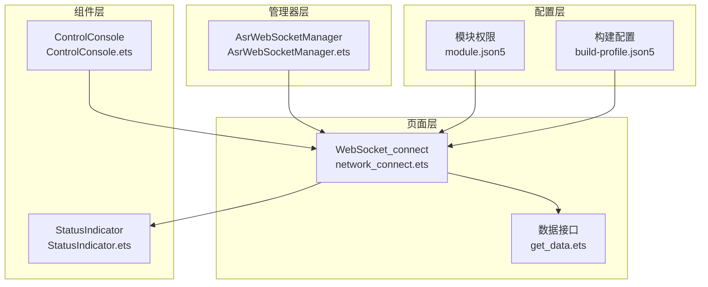
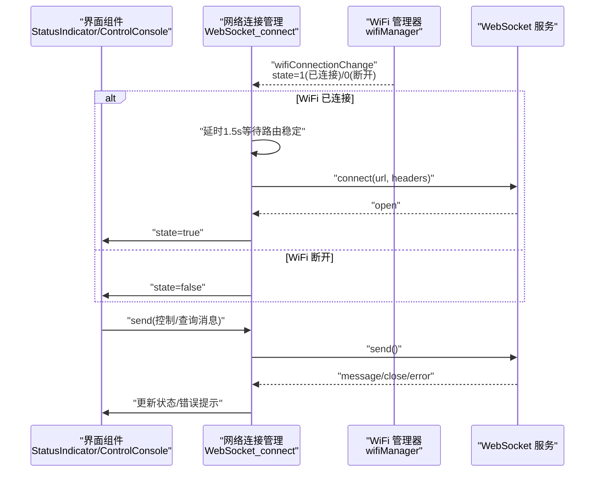
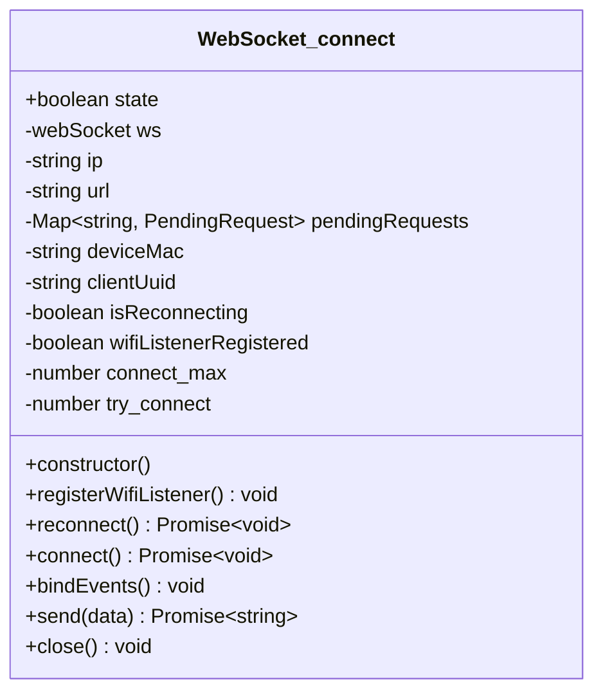
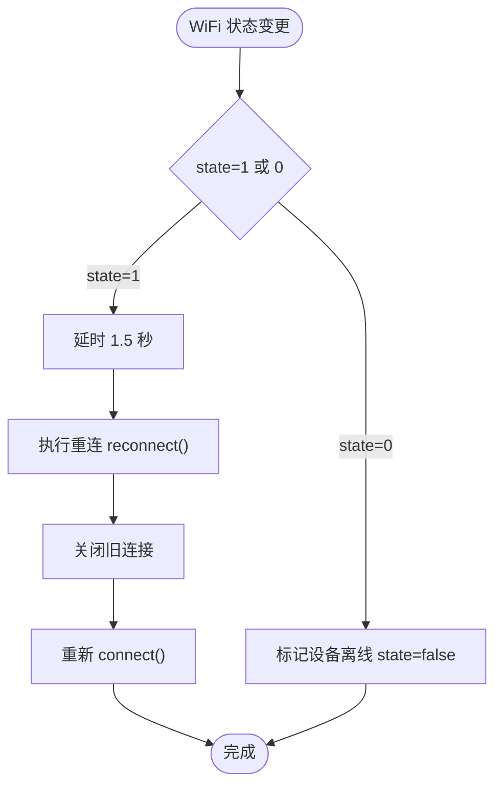
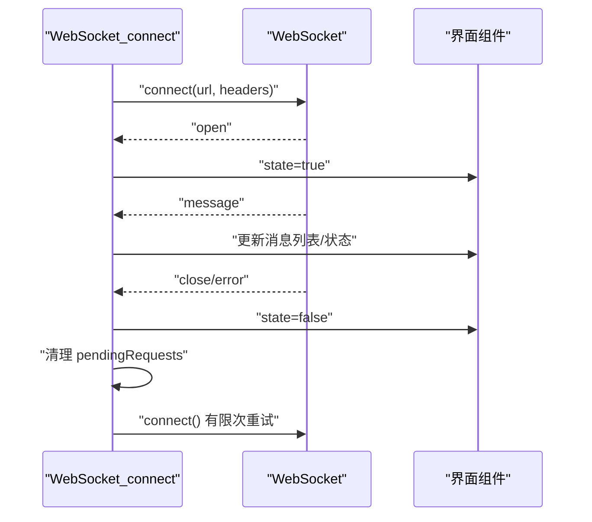
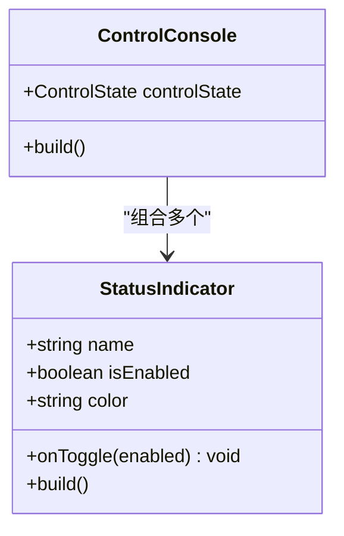
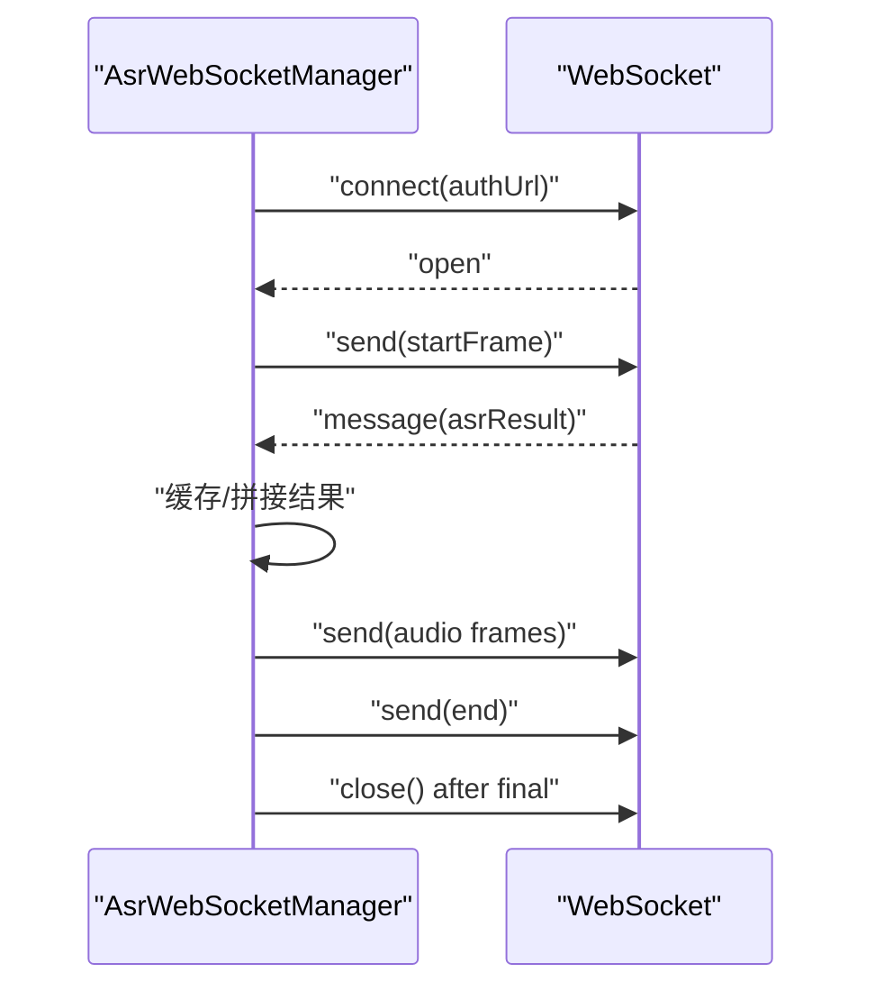
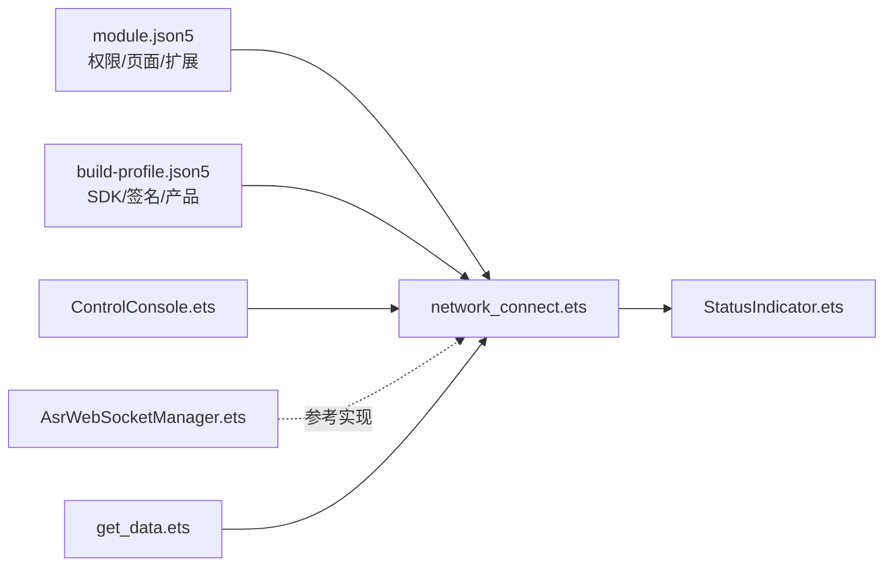

# 网络状态监控

<cite>
**本文引用的文件**
- [network_connect.ets](file://entry/src/main/ets/pages/network_connect.ets)
- [StatusIndicator.ets](file://entry/src/main/ets/components/control/StatusIndicator.ets)
- [ControlConsole.ets](file://entry/src/main/ets/components/control/ControlConsole.ets)
- [AsrWebSocketManager.ets](file://entry/src/main/ets/managers/AsrWebSocketManager.ets)
- [Constants.ets](file://entry/src/main/ets/common/Constants.ets)
- [ControlState.ets](file://entry/src/main/ets/models/ControlState.ets)
- [module.json5](file://entry/src/main/module.json5)
- [build-profile.json5](file://build-profile.json5)
- [get_data.ets](file://entry/src/main/ets/pages/get_data.ets)
</cite>

## 目录
1. [简介](#简介)
2. [项目结构](#项目结构)
3. [核心组件](#核心组件)
4. [架构总览](#架构总览)
5. [详细组件分析](#详细组件分析)
6. [依赖关系分析](#依赖关系分析)
7. [性能考量](#性能考量)
8. [故障排查指南](#故障排查指南)
9. [结论](#结论)
10. [附录](#附录)

## 简介
本技术文档围绕网络状态监控展开，重点覆盖以下方面：
- 实时监测 WiFi 连接状态与网络可用性
- WebSocket 连接质量评估与异常处理
- WiFi 断开检测、重连触发与状态同步机制
- 网络异常诊断与恢复策略（超时、抖动、断网）
- 网络状态可视化展示（状态图标、连接质量指示、错误提示）
- 网络性能监控指标（延迟、吞吐量、稳定性）
- 开发者调试工具与故障排查流程

该系统基于 OpenHarmony 的 ArkTS/HarmonyOS 技术栈，通过 WiFi 状态监听与 WebSocket 连接管理实现网络状态的闭环监控。

## 项目结构
项目采用模块化的页面与组件组织方式，网络状态监控主要集中在页面层与组件层：
- 页面层：网络连接管理类负责 WiFi 监听、WebSocket 建连与消息收发
- 组件层：状态指示器组件用于可视化网络状态
- 管理器层：语音识别 WebSocket 管理器作为另一个网络通信示例
- 配置层：模块权限与构建配置确保网络能力可用

图表来源
- [network_connect.ets:39-321](file://entry/src/main/ets/pages/network_connect.ets#L39-L321)
- [StatusIndicator.ets:8-44](file://entry/src/main/ets/components/control/StatusIndicator.ets#L8-L44)
- [ControlConsole.ets:73-113](file://entry/src/main/ets/components/control/ControlConsole.ets#L73-L113)
- [AsrWebSocketManager.ets:82-271](file://entry/src/main/ets/managers/AsrWebSocketManager.ets#L82-L271)
- [module.json5:37-55](file://entry/src/main/module.json5#L37-L55)
- [build-profile.json5:26-57](file://build-profile.json5#L26-L57)
- [get_data.ets:1-37](file://entry/src/main/ets/pages/get_data.ets#L1-L37)

章节来源
- [module.json5:37-55](file://entry/src/main/module.json5#L37-L55)
- [build-profile.json5:26-57](file://build-profile.json5#L26-L57)

## 核心组件
- WebSocket 连接管理器：负责 WiFi 状态监听、WebSocket 建连、事件绑定、消息收发与重连控制
- 状态指示器组件：以视觉方式展示网络状态与设备状态
- 控制台组件：承载多个状态指示器，并通过网络连接发送控制指令
- 语音识别 WebSocket 管理器：作为网络通信的参考实现，展示事件处理与错误处理
- 数据接口：提供传感器数据获取能力，配合网络状态进行数据刷新

章节来源
- [network_connect.ets:39-321](file://entry/src/main/ets/pages/network_connect.ets#L39-L321)
- [StatusIndicator.ets:8-44](file://entry/src/main/ets/components/control/StatusIndicator.ets#L8-L44)
- [ControlConsole.ets:73-113](file://entry/src/main/ets/components/control/ControlConsole.ets#L73-L113)
- [AsrWebSocketManager.ets:82-271](file://entry/src/main/ets/managers/AsrWebSocketManager.ets#L82-L271)
- [get_data.ets:1-37](file://entry/src/main/ets/pages/get_data.ets#L1-L37)

## 架构总览
系统通过 WiFi 状态监听感知网络可用性，结合 WebSocket 事件驱动的消息收发与重连策略，形成“感知—建连—通信—恢复”的闭环。

图表来源
- [network_connect.ets:77-99](file://entry/src/main/ets/pages/network_connect.ets#L77-L99)
- [network_connect.ets:149-180](file://entry/src/main/ets/pages/network_connect.ets#L149-L180)
- [network_connect.ets:182-261](file://entry/src/main/ets/pages/network_connect.ets#L182-L261)
- [StatusIndicator.ets:19-43](file://entry/src/main/ets/components/control/StatusIndicator.ets#L19-L43)
- [ControlConsole.ets:73-113](file://entry/src/main/ets/components/control/ControlConsole.ets#L73-L113)

## 详细组件分析

### WebSocket 连接管理器（网络状态监控核心）
职责与特性：
- WiFi 状态监听：注册 wifiConnectionChange 事件，区分断开与连接两种状态
- 自动重连：WiFi 连接恢复后延迟 1.5 秒重建 WebSocket，避免路由不稳定导致的连接失败
- 连接生命周期：创建 WebSocket、绑定 open/message/close/error 事件、发送 hello 消息
- 发送控制：封装消息发送，支持请求 ID 与回调管理，便于后续扩展
- 资源清理：提供关闭方法，注销 WiFi 监听并优雅关闭 WebSocket

图表来源
- [network_connect.ets:39-63](file://entry/src/main/ets/pages/network_connect.ets#L39-L63)
- [network_connect.ets:67-71](file://entry/src/main/ets/pages/network_connect.ets#L67-L71)
- [network_connect.ets:77-99](file://entry/src/main/ets/pages/network_connect.ets#L77-L99)
- [network_connect.ets:105-131](file://entry/src/main/ets/pages/network_connect.ets#L105-L131)
- [network_connect.ets:149-180](file://entry/src/main/ets/pages/network_connect.ets#L149-L180)
- [network_connect.ets:182-261](file://entry/src/main/ets/pages/network_connect.ets#L182-L261)
- [network_connect.ets:263-299](file://entry/src/main/ets/pages/network_connect.ets#L263-L299)
- [network_connect.ets:302-317](file://entry/src/main/ets/pages/network_connect.ets#L302-L317)

章节来源
- [network_connect.ets:39-321](file://entry/src/main/ets/pages/network_connect.ets#L39-L321)

### WiFi 断开检测与重连触发流程
- 断开检测：WiFi 状态为 0 时，立即标记设备离线
- 重连触发：WiFi 状态为 1 时，延迟 1.5 秒后执行重连，避免路由尚未稳定
- 重连锁：isReconnecting 防止并发多次重连
- 重连清理：关闭旧连接，清空状态，重新发起连接

图表来源
- [network_connect.ets:77-99](file://entry/src/main/ets/pages/network_connect.ets#L77-L99)
- [network_connect.ets:105-131](file://entry/src/main/ets/pages/network_connect.ets#L105-L131)
- [network_connect.ets:149-180](file://entry/src/main/ets/pages/network_connect.ets#L149-L180)

章节来源
- [network_connect.ets:77-131](file://entry/src/main/ets/pages/network_connect.ets#L77-L131)

### WebSocket 事件处理与异常恢复
- open：连接成功，设置在线状态并发送 hello 消息
- message：解析服务端消息，提取会话 ID 与文本内容
- close/error：统一标记离线，清理未完成请求，触发有限次自动重连

图表来源
- [network_connect.ets:182-261](file://entry/src/main/ets/pages/network_connect.ets#L182-L261)
- [network_connect.ets:256-260](file://entry/src/main/ets/pages/network_connect.ets#L256-L260)

章节来源
- [network_connect.ets:182-261](file://entry/src/main/ets/pages/network_connect.ets#L182-L261)

### 状态指示器与控制台（可视化与交互）
- 状态指示器：以圆点颜色与文字展示状态，点击触发回调
- 控制台：组合多个状态指示器，将用户操作转换为网络消息发送

图表来源
- [StatusIndicator.ets:8-44](file://entry/src/main/ets/components/control/StatusIndicator.ets#L8-L44)
- [ControlConsole.ets:73-113](file://entry/src/main/ets/components/control/ControlConsole.ets#L73-L113)
- [ControlState.ets:28-67](file://entry/src/main/ets/models/ControlState.ets#L28-L67)

章节来源
- [StatusIndicator.ets:8-44](file://entry/src/main/ets/components/control/StatusIndicator.ets#L8-L44)
- [ControlConsole.ets:73-113](file://entry/src/main/ets/components/control/ControlConsole.ets#L73-L113)
- [ControlState.ets:28-67](file://entry/src/main/ets/models/ControlState.ets#L28-L67)

### 语音识别 WebSocket 管理器（网络通信参考实现）
- 事件驱动：open/message/error/close 完整生命周期
- 结果缓存：处理乱序结果，拼接中间与最终识别文本
- 错误处理：统一记录错误码与数据，便于诊断
- 自动断开：最终结果后主动关闭连接

图表来源
- [AsrWebSocketManager.ets:92-144](file://entry/src/main/ets/managers/AsrWebSocketManager.ets#L92-L144)
- [AsrWebSocketManager.ets:197-254](file://entry/src/main/ets/managers/AsrWebSocketManager.ets#L197-L254)
- [AsrWebSocketManager.ets:256-264](file://entry/src/main/ets/managers/AsrWebSocketManager.ets#L256-L264)

章节来源
- [AsrWebSocketManager.ets:82-271](file://entry/src/main/ets/managers/AsrWebSocketManager.ets#L82-L271)
- [Constants.ets:9-14](file://entry/src/main/ets/common/Constants.ets#L9-L14)

## 依赖关系分析
- 权限依赖：模块声明了网络、麦克风、WiFi 信息等权限，确保 WiFi 监听与网络访问可用
- 构建依赖：产品与 SDK 版本配置保证运行环境兼容
- 组件耦合：控制台组件依赖网络连接管理器；状态指示器组件独立但受网络状态影响

图表来源
- [module.json5:37-55](file://entry/src/main/module.json5#L37-L55)
- [build-profile.json5:26-57](file://build-profile.json5#L26-L57)
- [network_connect.ets:39-321](file://entry/src/main/ets/pages/network_connect.ets#L39-L321)
- [StatusIndicator.ets:8-44](file://entry/src/main/ets/components/control/StatusIndicator.ets#L8-L44)
- [ControlConsole.ets:73-113](file://entry/src/main/ets/components/control/ControlConsole.ets#L73-L113)
- [AsrWebSocketManager.ets:82-271](file://entry/src/main/ets/managers/AsrWebSocketManager.ets#L82-L271)
- [get_data.ets:1-37](file://entry/src/main/ets/pages/get_data.ets#L1-L37)

章节来源
- [module.json5:37-55](file://entry/src/main/module.json5#L37-L55)
- [build-profile.json5:26-57](file://build-profile.json5#L26-L57)

## 性能考量
- 连接稳定性
  - WiFi 重连延迟：1.5 秒等待路由稳定，降低瞬时抖动影响
  - 重连锁：isReconnecting 防止并发重连导致资源争用
  - 最大重连次数：connect_max 限制无限重试，避免资源耗尽
- 事件处理效率
  - 事件解绑：close 时注销 WiFi 监听，避免内存泄漏
  - 请求去重：pendingRequests 映射管理未完成请求，减少重复发送
- 可视化反馈
  - 状态指示器即时反映在线/离线状态，提升用户体验
  - 控制台聚合多个状态，减少频繁网络交互

章节来源
- [network_connect.ets:61-62](file://entry/src/main/ets/pages/network_connect.ets#L61-L62)
- [network_connect.ets:58-59](file://entry/src/main/ets/pages/network_connect.ets#L58-L59)
- [network_connect.ets:105-131](file://entry/src/main/ets/pages/network_connect.ets#L105-L131)
- [network_connect.ets:302-317](file://entry/src/main/ets/pages/network_connect.ets#L302-L317)
- [StatusIndicator.ets:19-43](file://entry/src/main/ets/components/control/StatusIndicator.ets#L19-L43)

## 故障排查指南
- 常见问题与定位
  - WiFi 不可用：检查 module.json5 权限声明与设备 WiFi 状态
  - 连接失败：查看 connect 回调错误日志，确认 URL 与头部参数
  - 消息发送失败：检查 pendingRequests 映射与发送回调错误
  - 异常断开：关注 close/error 事件，结合 try_connect 计数判断是否触发重连
- 诊断步骤
  - 启用详细日志：观察 WiFi 状态变更、连接生命周期与消息收发
  - 触发重连：模拟 WiFi 断开与恢复，验证 1.5 秒延迟与重连锁机制
  - 资源清理：调用 close 方法，确认 WiFi 监听注销与 WebSocket 关闭
- 参考实现对照
  - 对照 AsrWebSocketManager 的事件处理与错误记录方式，复用其错误上报与结果缓存思路

章节来源
- [module.json5:37-55](file://entry/src/main/module.json5#L37-L55)
- [network_connect.ets:166-174](file://entry/src/main/ets/pages/network_connect.ets#L166-L174)
- [network_connect.ets:289-297](file://entry/src/main/ets/pages/network_connect.ets#L289-L297)
- [network_connect.ets:236-260](file://entry/src/main/ets/pages/network_connect.ets#L236-L260)
- [AsrWebSocketManager.ets:99-139](file://entry/src/main/ets/managers/AsrWebSocketManager.ets#L99-L139)
- [AsrWebSocketManager.ets:209-254](file://entry/src/main/ets/managers/AsrWebSocketManager.ets#L209-L254)

## 结论
本系统通过 WiFi 状态监听与 WebSocket 事件驱动实现了可靠的网络状态监控与自动恢复机制。结合状态指示器与控制台组件，提供了直观的可视化反馈。建议在生产环境中进一步引入：
- 延迟与吞吐量统计（可基于消息往返时间与字节计数）
- 连接稳定性分析（丢包率、重连频率、平均连接时长）
- 更细粒度的错误分类与上报
- 可配置的重连策略（指数退避、最大重连间隔）

## 附录
- 网络状态可视化建议
  - 在状态指示器基础上增加连接质量等级（如信号强度、丢包率）
  - 提供错误信息弹窗或 Toast，指导用户进行网络设置调整
- 网络性能指标采集
  - 延迟：记录消息发送时间与收到时间差
  - 吞吐量：统计单位时间内传输字节数
  - 稳定性：计算重连次数与持续在线时长比
- 调试工具
  - 使用日志输出 WiFi 状态、连接事件与消息详情
  - 提供手动重连按钮与网络诊断入口