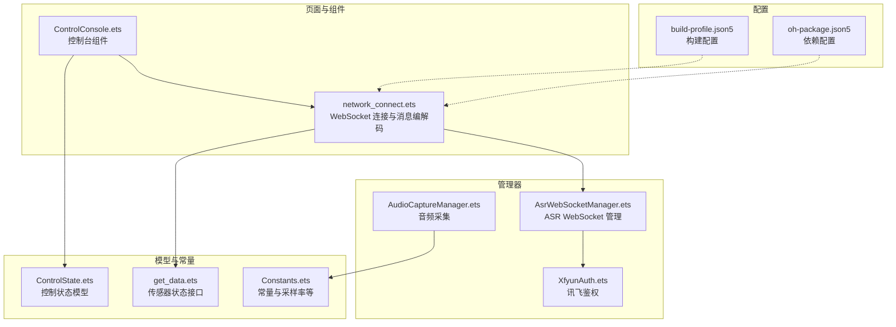
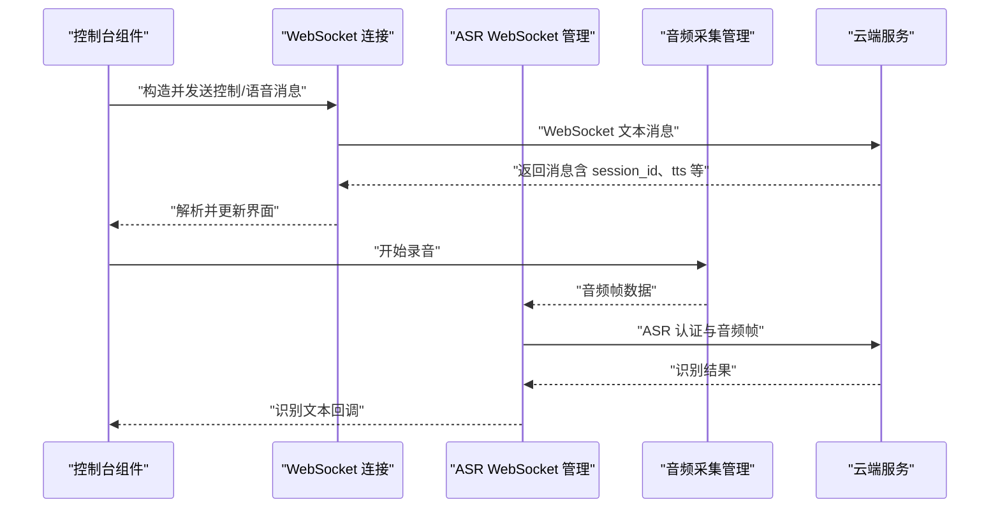
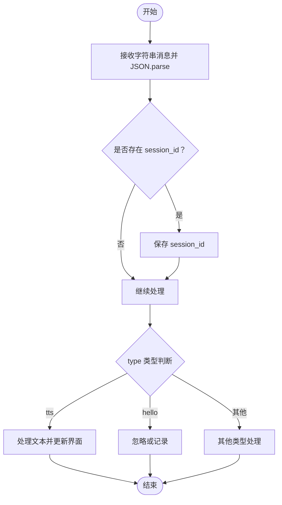
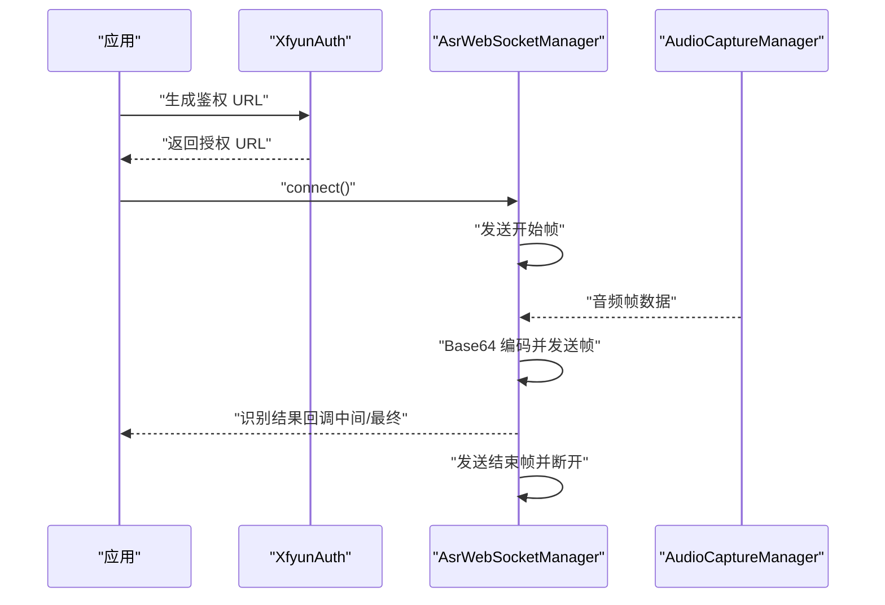
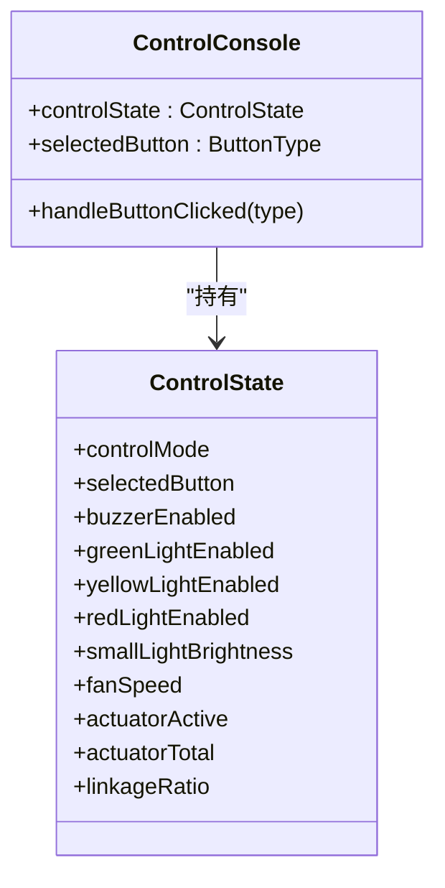
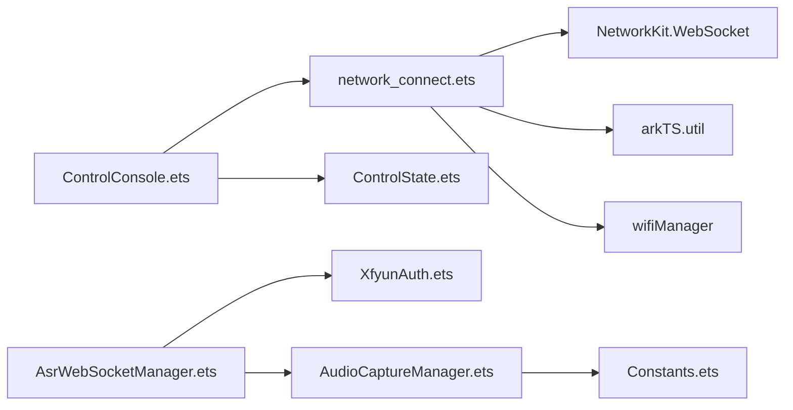

# 设备控制协议

<cite>
**本文引用的文件**
- [network_connect.ets](file://entry/src/main/ets/pages/network_connect.ets)
- [AsrWebSocketManager.ets](file://entry/src/main/ets/managers/AsrWebSocketManager.ets)
- [AudioCaptureManager.ets](file://entry/src/main/ets/managers/AudioCaptureManager.ets)
- [Constants.ets](file://entry/src/main/ets/common/Constants.ets)
- [XfyunAuth.ets](file://entry/src/main/ets/managers/XfyunAuth.ets)
- [ControlConsole.ets](file://entry/src/main/ets/components/control/ControlConsole.ets)
- [ControlState.ets](file://entry/src/main/ets/models/ControlState.ets)
- [get_data.ets](file://entry/src/main/ets/pages/get_data.ets)
- [build-profile.json5](file://build-profile.json5)
- [oh-package.json5](file://oh-package.json5)
</cite>

## 目录
1. [简介](#简介)
2. [项目结构](#项目结构)
3. [核心组件](#核心组件)
4. [架构总览](#架构总览)
5. [详细组件分析](#详细组件分析)
6. [依赖关系分析](#依赖关系分析)
7. [性能考虑](#性能考虑)
8. [故障排查指南](#故障排查指南)
9. [结论](#结论)
10. [附录](#附录)

## 简介
本文件面向设备控制协议的技术文档，聚焦于设备与云端之间的通信协议设计与实现。内容涵盖：
- 消息格式定义、字段规范与数据编码标准
- 控制命令的数据结构（如 type、version、transport、audio_params 等）
- 会话管理机制（session_id 的生成、维护与使用规则）
- 消息序列化与反序列化（JSON 规范与数据验证）
- 协议版本兼容性与升级路径
- 协议扩展指南与自定义消息类型实现方法

该仓库以 OpenHarmony ArkTS 为基础，通过 WebSocket 与云端进行语音与控制指令交互，并结合讯飞 ASR WebSocket 实现语音识别能力。

## 项目结构
项目采用模块化组织方式，前端页面与业务逻辑分层清晰：
- 页面与组件：负责用户交互与控制台展示
- 管理器：封装网络、音频采集与鉴权等通用能力
- 模型：定义控制状态与数据结构
- 配置：构建与依赖配置

图表来源
- [network_connect.ets:1-322](file://entry/src/main/ets/pages/network_connect.ets#L1-L322)
- [AsrWebSocketManager.ets:1-271](file://entry/src/main/ets/managers/AsrWebSocketManager.ets#L1-L271)
- [AudioCaptureManager.ets:1-80](file://entry/src/main/ets/managers/AudioCaptureManager.ets#L1-L80)
- [Constants.ets:1-82](file://entry/src/main/ets/common/Constants.ets#L1-L82)
- [XfyunAuth.ets:1-34](file://entry/src/main/ets/managers/XfyunAuth.ets#L1-L34)
- [ControlConsole.ets:1-172](file://entry/src/main/ets/components/control/ControlConsole.ets#L1-L172)
- [ControlState.ets:1-67](file://entry/src/main/ets/models/ControlState.ets#L1-L67)
- [get_data.ets:1-105](file://entry/src/main/ets/pages/get_data.ets#L1-L105)
- [build-profile.json5:1-73](file://build-profile.json5#L1-L73)
- [oh-package.json5:1-10](file://oh-package.json5#L1-L10)

章节来源
- [network_connect.ets:1-322](file://entry/src/main/ets/pages/network_connect.ets#L1-L322)
- [build-profile.json5:1-73](file://build-profile.json5#L1-L73)
- [oh-package.json5:1-10](file://oh-package.json5#L1-L10)

## 核心组件
- WebSocket 连接与消息编解码：负责与云端建立连接、发送/接收消息、解析 session_id、维护连接状态与重连机制
- ASR WebSocket 管理：封装讯飞 ASR WebSocket 的连接、鉴权、音频帧发送与识别结果解析
- 音频采集管理：负责麦克风音频采集、回调与生命周期管理
- 控制台组件与状态模型：负责 UI 控件与控制状态的联动，将用户操作转化为协议消息
- 常量与工具：统一采样率、通道数、鉴权参数等
- 传感器状态接口：提供设备侧传感器状态查询接口

章节来源
- [network_connect.ets:1-322](file://entry/src/main/ets/pages/network_connect.ets#L1-L322)
- [AsrWebSocketManager.ets:1-271](file://entry/src/main/ets/managers/AsrWebSocketManager.ets#L1-L271)
- [AudioCaptureManager.ets:1-80](file://entry/src/main/ets/managers/AudioCaptureManager.ets#L1-L80)
- [ControlConsole.ets:1-172](file://entry/src/main/ets/components/control/ControlConsole.ets#L1-L172)
- [ControlState.ets:1-67](file://entry/src/main/ets/models/ControlState.ets#L1-L67)
- [Constants.ets:1-82](file://entry/src/main/ets/common/Constants.ets#L1-L82)
- [get_data.ets:1-105](file://entry/src/main/ets/pages/get_data.ets#L1-L105)

## 架构总览
系统由“前端控制台”、“协议编解码层”、“ASR 识别层”、“音频采集层”、“云端服务”构成。控制台组件驱动协议消息的构造与发送；协议层负责消息的 JSON 序列化/反序列化与字段校验；ASR 层负责语音识别；音频采集层负责麦克风数据采集；云端服务负责业务处理与回传。

图表来源
- [ControlConsole.ets:1-172](file://entry/src/main/ets/components/control/ControlConsole.ets#L1-L172)
- [network_connect.ets:1-322](file://entry/src/main/ets/pages/network_connect.ets#L1-L322)
- [AsrWebSocketManager.ets:1-271](file://entry/src/main/ets/managers/AsrWebSocketManager.ets#L1-L271)
- [AudioCaptureManager.ets:1-80](file://entry/src/main/ets/managers/AudioCaptureManager.ets#L1-L80)

## 详细组件分析

### WebSocket 协议与消息编解码
- 消息结构与字段
  - type：消息类型，如 hello、listen、tts 等
  - version：协议版本号
  - transport：传输方式，如 websocket
  - features：特性开关，如 mcp
  - audio_params：音频参数对象，包含 format、sample_rate、channels、frame_duration
  - session_id：会话标识，由服务端下发并在后续消息中复用
  - text：文本内容，用于语音或控制指令
- 序列化与反序列化
  - 发送：将消息对象 JSON.stringify 后通过 WebSocket 发送
  - 接收：收到字符串后 JSON.parse，提取 session_id 并根据 type 分发处理
- 会话管理
  - 在 open 事件中发送 hello 消息，携带 features 与 audio_params
  - 保存服务端返回的 session_id，用于后续消息关联
  - 连接断开时清理 pendingRequests，避免悬挂回调

图表来源
- [network_connect.ets:204-234](file://entry/src/main/ets/pages/network_connect.ets#L204-L234)

章节来源
- [network_connect.ets:9-35](file://entry/src/main/ets/pages/network_connect.ets#L9-L35)
- [network_connect.ets:188-201](file://entry/src/main/ets/pages/network_connect.ets#L188-L201)
- [network_connect.ets:204-234](file://entry/src/main/ets/pages/network_connect.ets#L204-L234)

### ASR WebSocket 识别流程
- 鉴权与连接
  - 使用 XfyunAuth 生成带签名的授权 URL
  - 建立 WebSocket 连接并发送开始帧
- 音频帧发送
  - 将采集到的音频数据 Base64 编码后按帧发送
  - 结束时发送结束帧
- 结果解析
  - 解析服务端返回的 JSON，按 sn 缓存结果并拼接文本
  - 支持动态替换（rpl）与最终结果标志（status）

图表来源
- [AsrWebSocketManager.ets:92-144](file://entry/src/main/ets/managers/AsrWebSocketManager.ets#L92-L144)
- [AsrWebSocketManager.ets:146-195](file://entry/src/main/ets/managers/AsrWebSocketManager.ets#L146-L195)
- [AsrWebSocketManager.ets:197-254](file://entry/src/main/ets/managers/AsrWebSocketManager.ets#L197-L254)
- [XfyunAuth.ets:7-24](file://entry/src/main/ets/managers/XfyunAuth.ets#L7-L24)
- [AudioCaptureManager.ets:36-66](file://entry/src/main/ets/managers/AudioCaptureManager.ets#L36-L66)

章节来源
- [AsrWebSocketManager.ets:1-271](file://entry/src/main/ets/managers/AsrWebSocketManager.ets#L1-L271)
- [XfyunAuth.ets:1-34](file://entry/src/main/ets/managers/XfyunAuth.ets#L1-L34)
- [AudioCaptureManager.ets:1-80](file://entry/src/main/ets/managers/AudioCaptureManager.ets#L1-L80)

### 控制台与控制状态模型
- 控制模式与按钮类型
  - ControlMode：场景、开关、模拟量
  - ButtonType：展示、告警、静音
- 状态字段
  - 执行器状态（蜂鸣器、绿灯、黄灯、红灯）
  - 小灯亮度、风扇转速
  - 执行器占用与联动比例
- 与协议的交互
  - 控制台组件根据状态变化调用 network_connect.send 发送控制指令
  - 指令格式为 listen 类型，包含 text 字段

图表来源
- [ControlState.ets:28-67](file://entry/src/main/ets/models/ControlState.ets#L28-L67)
- [ControlConsole.ets:14-25](file://entry/src/main/ets/components/control/ControlConsole.ets#L14-L25)

章节来源
- [ControlConsole.ets:1-172](file://entry/src/main/ets/components/control/ControlConsole.ets#L1-L172)
- [ControlState.ets:1-67](file://entry/src/main/ets/models/ControlState.ets#L1-L67)

### 音频采集与编码
- 采样参数
  - 采样率：16000 Hz
  - 通道数：单声道
  - 格式：S16LE RAW
- 生命周期
  - init：创建 AudioCapturer
  - start：注册 readData 回调并启动
  - stop/release：停止并释放资源
- 与 ASR 的配合
  - 采集到的音频数据经 Base64 编码后通过 ASR WebSocket 发送

章节来源
- [Constants.ets:5-14](file://entry/src/main/ets/common/Constants.ets#L5-L14)
- [AudioCaptureManager.ets:11-80](file://entry/src/main/ets/managers/AudioCaptureManager.ets#L11-L80)
- [AsrWebSocketManager.ets:167-189](file://entry/src/main/ets/managers/AsrWebSocketManager.ets#L167-L189)

### 传感器状态接口
- 提供设备传感器状态查询接口，返回结构化数据，包含在线状态、数值数组、标签与单位等
- 控制台可调用该接口获取实时状态

章节来源
- [get_data.ets:1-105](file://entry/src/main/ets/pages/get_data.ets#L1-L105)

## 依赖关系分析
- 组件耦合
  - ControlConsole 依赖 ControlState 与 network_connect
  - network_connect 依赖 WebSocket、util、wifiManager
  - AsrWebSocketManager 依赖 XfyunAuth、util、AudioCaptureManager
  - AudioCaptureManager 依赖 Constants
- 外部依赖
  - NetworkKit（WebSocket）、arkTS util、wifiManager
  - 构建与依赖配置位于 build-profile.json5 与 oh-package.json5

图表来源
- [ControlConsole.ets:7-8](file://entry/src/main/ets/components/control/ControlConsole.ets#L7-L8)
- [network_connect.ets:1-5](file://entry/src/main/ets/pages/network_connect.ets#L1-L5)
- [AsrWebSocketManager.ets:2-5](file://entry/src/main/ets/managers/AsrWebSocketManager.ets#L2-L5)
- [AudioCaptureManager.ets:2-4](file://entry/src/main/ets/managers/AudioCaptureManager.ets#L2-L4)

章节来源
- [build-profile.json5:59-72](file://build-profile.json5#L59-L72)
- [oh-package.json5:1-10](file://oh-package.json5#L1-L10)

## 性能考虑
- 音频帧大小与延迟
  - frame_duration 影响端到端延迟与识别准确率，需在 60ms 左右取得平衡
- 连接稳定性
  - WiFi 状态监听与自动重连减少断线影响
- 资源释放
  - 正确释放 AudioCapturer 与 WebSocket，避免内存泄漏
- JSON 解析与验证
  - 对收到的消息进行字段存在性与类型检查，降低异常分支

## 故障排查指南
- WebSocket 连接失败
  - 检查 Protocol-Version、device-id、client-id 头部是否正确设置
  - 查看 open/error/close 事件日志，定位网络或鉴权问题
- 识别结果为空或异常
  - 确认鉴权 URL 生成正确，时间戳与签名一致
  - 检查音频帧编码与采样参数是否匹配
- session_id 未生效
  - 确保在 open 事件后发送 hello 消息并正确保存 session_id
  - 检查服务端是否返回 session_id
- 音频采集无输出
  - 确认权限与麦克风可用性
  - 检查 start 回调是否注册成功

章节来源
- [network_connect.ets:159-174](file://entry/src/main/ets/pages/network_connect.ets#L159-L174)
- [AsrWebSocketManager.ets:99-133](file://entry/src/main/ets/managers/AsrWebSocketManager.ets#L99-L133)
- [AudioCaptureManager.ets:36-66](file://entry/src/main/ets/managers/AudioCaptureManager.ets#L36-L66)

## 结论
本协议以 WebSocket 为核心承载，结合 ASR 能力实现语音控制与反馈；通过明确的消息字段与严格的序列化/反序列化流程，保证了跨端一致性与可维护性。建议在后续版本中进一步完善字段校验、错误码标准化与版本升级策略，以提升协议的健壮性与扩展性。

## 附录

### 协议字段规范与数据编码
- 必填字段
  - type：字符串，如 hello、listen、tts
  - version：数字，协议版本
  - transport：字符串，传输方式
  - audio_params：对象，包含 format、sample_rate、channels、frame_duration
  - session_id：字符串，会话标识（服务端下发）
- 可选字段
  - features：对象，特性开关
  - text：字符串，文本内容
- 编码标准
  - JSON 字符串传输
  - 音频数据 Base64 编码（ASR 流程）

章节来源
- [network_connect.ets:9-35](file://entry/src/main/ets/pages/network_connect.ets#L9-L35)
- [AsrWebSocketManager.ets:146-195](file://entry/src/main/ets/managers/AsrWebSocketManager.ets#L146-L195)

### 会话管理机制
- 生成与维护
  - 在 open 事件后发送 hello 消息，携带 features 与 audio_params
  - 保存服务端返回的 session_id
  - 在后续消息中复用 session_id
- 使用规则
  - 仅在连接建立后使用
  - 断线重连后需重新获取新的 session_id

章节来源
- [network_connect.ets:188-201](file://entry/src/main/ets/pages/network_connect.ets#L188-L201)
- [network_connect.ets:217-222](file://entry/src/main/ets/pages/network_connect.ets#L217-L222)

### 版本兼容性与升级路径
- 版本字段
  - version 用于标识协议版本，便于服务端与客户端协商
- 升级策略
  - 新增字段建议保持向后兼容，旧字段不删除
  - 对新增字段提供默认值，避免解析失败
  - 通过 features 字段声明新能力，逐步启用

章节来源
- [network_connect.ets:189-194](file://entry/src/main/ets/pages/network_connect.ets#L189-L194)

### 协议扩展指南
- 自定义消息类型
  - 在消息结构中添加 type 字段，如 mycmd
  - 定义对应的字段集合（如 payload），并在发送/接收处分别序列化/反序列化
  - 在 UI 或业务逻辑中新增对新 type 的处理分支
- 字段扩展
  - 在现有消息对象上新增字段，确保服务端与客户端同时升级
  - 通过 features 字段声明能力，避免强制升级

章节来源
- [network_connect.ets:263-299](file://entry/src/main/ets/pages/network_connect.ets#L263-L299)