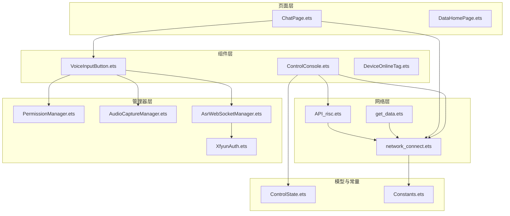
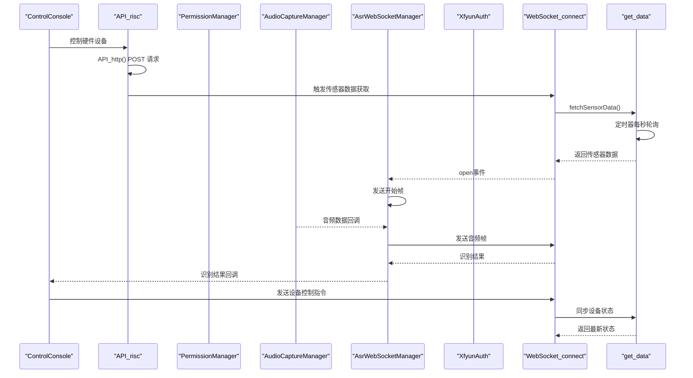
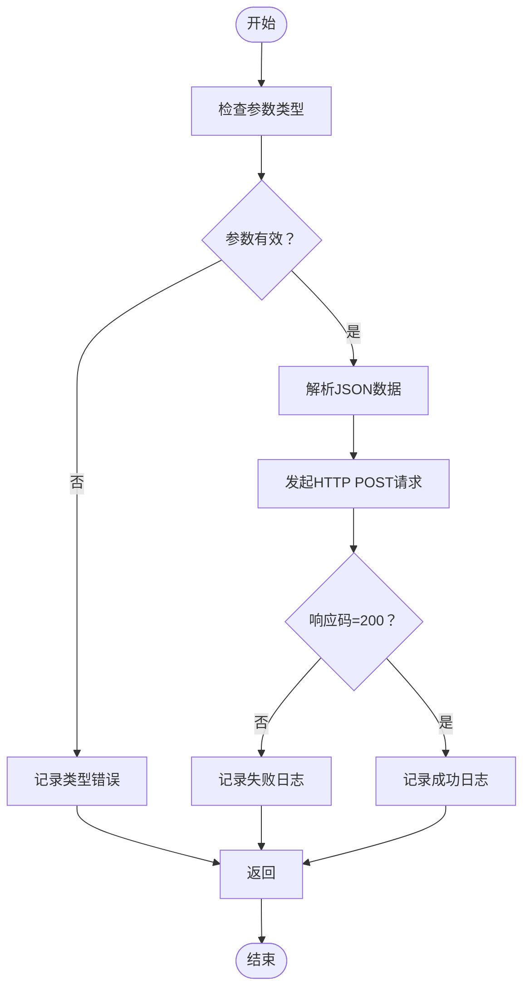
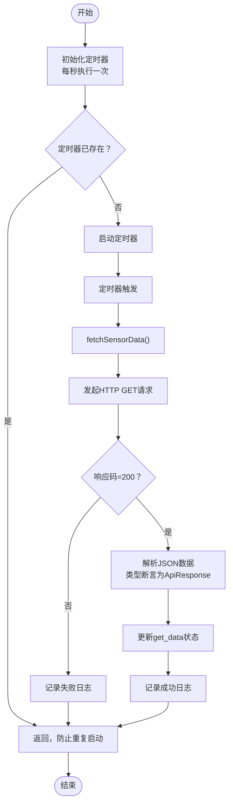
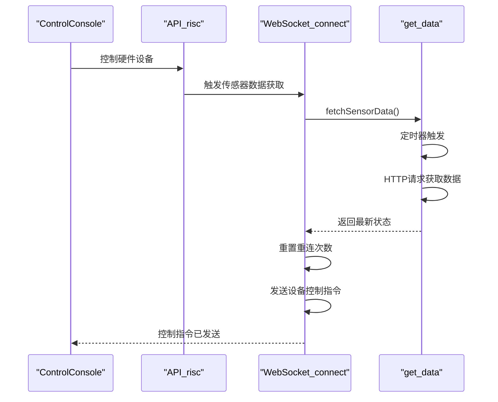
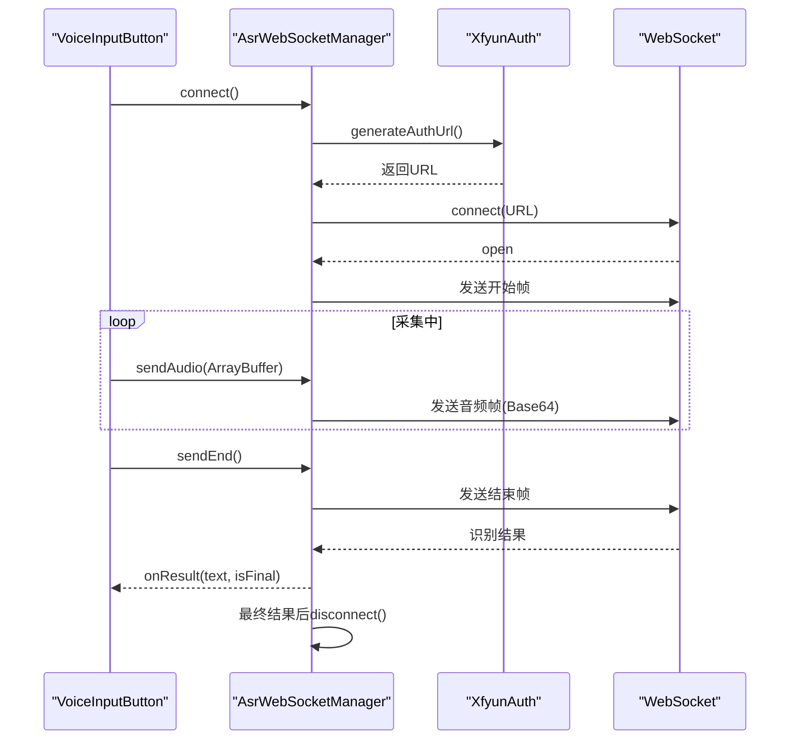
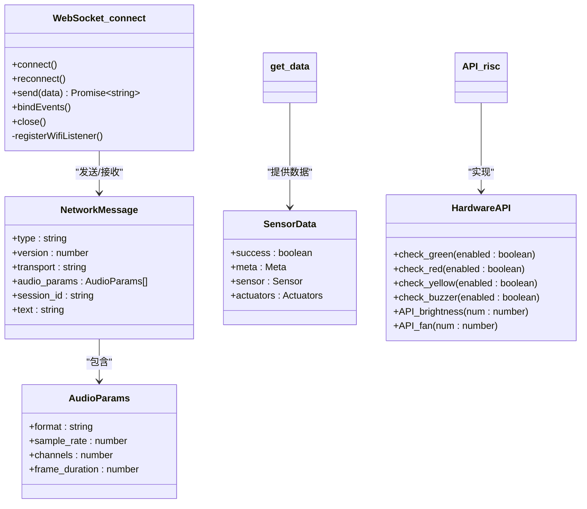
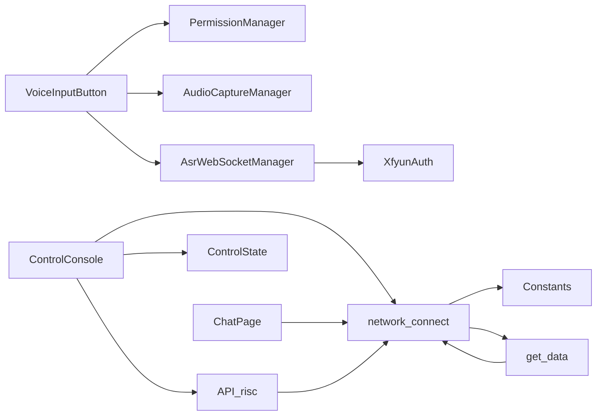

# 设备通信系统

<cite>
**本文引用的文件**
- [AsrWebSocketManager.ets](file://entry/src/main/ets/managers/AsrWebSocketManager.ets)
- [PermissionManager.ets](file://entry/src/main/ets/managers/PermissionManager.ets)
- [XfyunAuth.ets](file://entry/src/main/ets/managers/XfyunAuth.ets)
- [Constants.ets](file://entry/src/main/ets/common/Constants.ets)
- [AudioCaptureManager.ets](file://entry/src/main/ets/managers/AudioCaptureManager.ets)
- [network_connect.ets](file://entry/src/main/ets/network/network_connect.ets)
- [get_data.ets](file://entry/src/main/ets/network/get_data.ets)
- [API_risc.ets](file://entry/src/main/ets/network/API_risc.ets)
- [VoiceInputButton.ets](file://entry/src/main/ets/components/chat/VoiceInputButton.ets)
- [ControlConsole.ets](file://entry/src/main/ets/components/control/ControlConsole.ets)
- [ControlState.ets](file://entry/src/main/ets/models/ControlState.ets)
- [DeviceOnlineTag.ets](file://entry/src/main/ets/components/device/DeviceOnlineTag.ets)
</cite>

## 更新摘要
**所做更改**
- 新增硬件控制 API 系统，通过 API_risc.ets 提供设备硬件控制能力
- get_data.ets 进行类型安全改进，使用 TypeScript 接口定义数据结构
- ControlConsole.ets 集成新的硬件控制 API，支持蜂鸣器、灯光和风扇控制
- 文件组织结构优化，网络模块重构为更清晰的目录结构
- 增强了设备控制协议的类型安全性和错误处理机制

## 目录
1. [简介](#简介)
2. [项目结构](#项目结构)
3. [核心组件](#核心组件)
4. [架构总览](#架构总览)
5. [详细组件分析](#详细组件分析)
6. [依赖关系分析](#依赖关系分析)
7. [性能考量](#性能考量)
8. [故障排查指南](#故障排查指南)
9. [结论](#结论)
10. [附录](#附录)

## 简介
本技术文档面向设备通信系统，聚焦以下目标：
- WebSocket 连接管理：连接建立、事件绑定、断线重连与异常处理
- 设备控制协议：命令格式、数据编码与响应处理
- 硬件控制 API：类型安全的设备硬件控制接口
- 网络状态监控：连接状态检测、WiFi 状态监听与故障诊断
- 权限管理：运行时权限申请、状态检查与变更处理
- 网络安全：鉴权与加密思路（基于讯飞 ASR 的鉴权流程）
- 调试与监控：日志、状态可视化与问题定位
- 扩展指南：如何扩展通信协议与接入新设备类型

## 项目结构
系统采用分层组织：
- network：网络通信与数据获取模块（包含 API_risc.ets、get_data.ets 和 network_connect.ets）
- managers：通信与权限管理模块
- components：UI 组件
- models：数据模型
- utils：通用工具
- common：常量与公共能力

**更新** 文件组织结构已调整，network 目录现在包含专门的硬件控制 API、传感器数据获取和 WebSocket 连接管理三个核心模块。

**图表来源**
- [API_risc.ets:1-54](file://entry/src/main/ets/network/API_risc.ets#L1-L54)
- [network_connect.ets:1-321](file://entry/src/main/ets/network/network_connect.ets#L1-L321)
- [get_data.ets:1-130](file://entry/src/main/ets/network/get_data.ets#L1-L130)
- [VoiceInputButton.ets:1-125](file://entry/src/main/ets/components/chat/VoiceInputButton.ets#L1-L125)
- [PermissionManager.ets:1-28](file://entry/src/main/ets/managers/PermissionManager.ets#L1-L28)
- [AudioCaptureManager.ets:1-80](file://entry/src/main/ets/managers/AudioCaptureManager.ets#L1-L80)
- [AsrWebSocketManager.ets:1-271](file://entry/src/main/ets/managers/AsrWebSocketManager.ets#L1-L271)
- [XfyunAuth.ets:1-34](file://entry/src/main/ets/managers/XfyunAuth.ets#L1-L34)
- [ControlConsole.ets:1-290](file://entry/src/main/ets/components/control/ControlConsole.ets#L1-L290)
- [ControlState.ets:1-73](file://entry/src/main/ets/models/ControlState.ets#L1-L73)
- [Constants.ets:1-82](file://entry/src/main/ets/common/Constants.ets#L1-L82)

**章节来源**
- [API_risc.ets:1-54](file://entry/src/main/ets/network/API_risc.ets#L1-L54)
- [network_connect.ets:1-321](file://entry/src/main/ets/network/network_connect.ets#L1-L321)
- [get_data.ets:1-130](file://entry/src/main/ets/network/get_data.ets#L1-L130)
- [VoiceInputButton.ets:1-125](file://entry/src/main/ets/components/chat/VoiceInputButton.ets#L1-L125)
- [ControlConsole.ets:1-290](file://entry/src/main/ets/components/control/ControlConsole.ets#L1-L290)

## 核心组件
- **硬件控制 API 系统**：提供类型安全的设备硬件控制接口，支持蜂鸣器、灯光和风扇控制
- **网络数据获取器**：负责定时自动获取传感器数据，包含 HTTP 请求、数据解析和状态管理
- **WebSocket 连接管理器**：负责 WebSocket 建连、事件绑定、消息解析、断线重连与清理
- **讯飞语音鉴权**：生成 WebSocket 鉴权 URL，支持 HMAC-SHA256 签名与 Base64 编码
- **语音识别 WebSocket 管理器**：ASR 流式音频传输、开始/结束帧、结果拼接与回调
- **音频采集管理器**：麦克风音频采集、RAW PCM 格式、流事件回调
- **权限管理器**：运行时权限检查与申请（麦克风、网络）
- **控制台组件**：设备控制 UI 与状态同步，通过 WebSocket 发送控制指令
- **在线状态标签**：设备在线/离线状态可视化

**更新** 新增了硬件控制 API 系统，通过 API_risc.ets 提供类型安全的设备硬件控制能力，与原有的网络数据获取器和 WebSocket 连接管理器形成完整的设备通信闭环。

**章节来源**
- [API_risc.ets:7-54](file://entry/src/main/ets/network/API_risc.ets#L7-L54)
- [get_data.ets:67-130](file://entry/src/main/ets/network/get_data.ets#L67-L130)
- [network_connect.ets:38-321](file://entry/src/main/ets/network/network_connect.ets#L38-L321)
- [XfyunAuth.ets:6-34](file://entry/src/main/ets/managers/XfyunAuth.ets#L6-L34)
- [AsrWebSocketManager.ets:82-271](file://entry/src/main/ets/managers/AsrWebSocketManager.ets#L82-L271)
- [AudioCaptureManager.ets:6-80](file://entry/src/main/ets/managers/AudioCaptureManager.ets#L6-L80)
- [PermissionManager.ets:5-28](file://entry/src/main/ets/managers/PermissionManager.ets#L5-L28)
- [ControlConsole.ets:13-290](file://entry/src/main/ets/components/control/ControlConsole.ets#L13-L290)
- [DeviceOnlineTag.ets:8-31](file://entry/src/main/ets/components/device/DeviceOnlineTag.ets#L8-L31)

## 架构总览
系统由"网络层-页面层-组件层-管理器层-模型层-常量层"构成，网络层包含硬件控制 API、数据获取和连接管理三个核心模块，页面通过组件与管理器交互，管理器封装底层网络与多媒体能力。

**更新** 架构图反映了新的文件组织结构，网络层现在包含 API_risc.ets、get_data.ets 和 network_connect.ets 三个核心组件，形成了完整的设备控制和数据获取体系。

**图表来源**
- [ControlConsole.ets:58-154](file://entry/src/main/ets/components/control/ControlConsole.ets#L58-L154)
- [API_risc.ets:24-50](file://entry/src/main/ets/network/API_risc.ets#L24-L50)
- [VoiceInputButton.ets:18-82](file://entry/src/main/ets/components/chat/VoiceInputButton.ets#L18-L82)
- [AsrWebSocketManager.ets:92-144](file://entry/src/main/ets/managers/AsrWebSocketManager.ets#L92-L144)
- [XfyunAuth.ets:7-23](file://entry/src/main/ets/managers/XfyunAuth.ets#L7-L23)
- [network_connect.ets:179-258](file://entry/src/main/ets/network/network_connect.ets#L179-L258)
- [get_data.ets:79-127](file://entry/src/main/ets/network/get_data.ets#L79-L127)

## 详细组件分析

### 硬件控制 API 系统
- **类型安全设计**：使用 TypeScript 接口定义 coils 和 brightness 数据结构，确保编译时类型检查
- **硬件控制方法**：提供 check_green、check_red、check_yellow、check_buzzer 等灯光控制方法
- **设备控制方法**：提供 API_brightness 和 API_fan 方法控制亮度和风扇转速
- **HTTP 请求封装**：使用 @ohos.net.http 发起 POST 请求，设置连接和读取超时
- **错误处理**：捕获 BusinessError 异常，记录详细的错误信息
- **日志输出**：每个控制操作都会输出调试日志，便于问题追踪

**图表来源**
- [API_risc.ets:36-50](file://entry/src/main/ets/network/API_risc.ets#L36-L50)
- [API_risc.ets:39-49](file://entry/src/main/ets/network/API_risc.ets#L39-L49)

**章节来源**
- [API_risc.ets:7-54](file://entry/src/main/ets/network/API_risc.ets#L7-L54)

### 自动传感器数据获取器
- **定时轮询机制**：使用 setInterval 实现每秒自动获取传感器数据，防止重复启动
- **HTTP 请求处理**：通过 @ohos.net.http 发起 GET 请求，设置连接和读取超时
- **类型安全改进**：使用 TypeScript 接口定义 ApiResponse、meta、sensor、actuators 等完整数据结构
- **状态管理**：维护 get_data 状态，包含传感器值、执行器状态和元数据
- **生命周期管理**：提供 destroy 方法清理定时器，避免内存泄漏

**图表来源**
- [get_data.ets:79-127](file://entry/src/main/ets/network/get_data.ets#L79-L127)
- [get_data.ets:90-119](file://entry/src/main/ets/network/get_data.ets#L90-L119)
- [get_data.ets:105](file://entry/src/main/ets/network/get_data.ets#L105)

**章节来源**
- [get_data.ets:67-130](file://entry/src/main/ets/network/get_data.ets#L67-L130)

### WebSocket 连接管理器（设备控制）
- **连接建立**：构造 URL，设置自定义 Header（设备 ID、客户端 ID），绑定 open/message/close/error 事件
- **断线重连**：防并发重连锁，清理旧连接，延迟重连（等待路由稳定），失败记录
- **网络状态监控**：注册 WiFi 状态监听，断开时标记离线，恢复时延时重连
- **消息处理**：解析服务端消息，区分会话 ID、TTS 文本等；错误时标记离线并清理未完成请求
- **发送流程**：生成 requestId，缓存回调，发送后记录日志；发送失败从缓存移除并 reject
- **集成机制**：在发送设备控制指令时自动触发传感器数据获取

**图表来源**
- [ControlConsole.ets:281](file://entry/src/main/ets/components/control/ControlConsole.ets#L281)
- [API_risc.ets:24-26](file://entry/src/main/ets/network/API_risc.ets#L24-L26)
- [network_connect.ets:263-298](file://entry/src/main/ets/network/network_connect.ets#L263-L298)
- [get_data.ets:79-89](file://entry/src/main/ets/network/get_data.ets#L79-L89)

**章节来源**
- [network_connect.ets:38-321](file://entry/src/main/ets/network/network_connect.ets#L38-L321)

### 讯飞语音识别 WebSocket 管理器
- **鉴权与连接**：生成 Authorization、Date、Host 参数，构建 wss URL，建立连接
- **帧格式**：开始帧、音频帧、结束帧，音频编码为 Base64 RAW PCM
- **结果处理**：乱序结果缓存与拼接，动态替换（rpl）处理，最终结果触发关闭连接
- **错误处理**：消息解析失败、业务错误码、发送/关闭异常均记录日志

**图表来源**
- [AsrWebSocketManager.ets:92-144](file://entry/src/main/ets/managers/AsrWebSocketManager.ets#L92-L144)
- [AsrWebSocketManager.ets:146-195](file://entry/src/main/ets/managers/AsrWebSocketManager.ets#L146-L195)
- [AsrWebSocketManager.ets:197-254](file://entry/src/main/ets/managers/AsrWebSocketManager.ets#L197-L254)
- [XfyunAuth.ets:7-23](file://entry/src/main/ets/managers/XfyunAuth.ets#L7-L23)

**章节来源**
- [AsrWebSocketManager.ets:82-271](file://entry/src/main/ets/managers/AsrWebSocketManager.ets#L82-L271)
- [XfyunAuth.ets:6-34](file://entry/src/main/ets/managers/XfyunAuth.ets#L6-L34)
- [Constants.ets:4-14](file://entry/src/main/ets/common/Constants.ets#L4-L14)

### 音频采集管理器
- **初始化**：配置采样率、通道、采样格式、编码类型，选择麦克风源
- **采集**：注册 readData 回调，start 成功后进入采集状态
- **停止与释放**：stop 与 release 均带错误处理，避免资源泄漏

**章节来源**
- [AudioCaptureManager.ets:6-80](file://entry/src/main/ets/managers/AudioCaptureManager.ets#L6-L80)
- [Constants.ets:4-8](file://entry/src/main/ets/common/Constants.ets#L4-L8)

### 权限管理器
- **检查与申请**：遍历所需权限，若未全部授予则弹窗申请，返回统一授权结果
- **错误兜底**：捕获异常并返回 false，保证 UI 可用性

**章节来源**
- [PermissionManager.ets:5-28](file://entry/src/main/ets/managers/PermissionManager.ets#L5-L28)

### 设备控制协议设计
- **协议版本**：通过 hello 消息携带版本号与特性标志
- **音频参数**：格式、采样率、通道、帧时长
- **命令格式**：listen 类型，state 字段（如 detect），text 字段承载自然语言指令
- **响应处理**：服务端返回 tts 文本，客户端将其加入对话列表

**图表来源**
- [network_connect.ets:38-321](file://entry/src/main/ets/network/network_connect.ets#L38-L321)
- [network_connect.ets:6-27](file://entry/src/main/ets/network/network_connect.ets#L6-L27)
- [get_data.ets:4-66](file://entry/src/main/ets/network/get_data.ets#L4-L66)
- [API_risc.ets:8-35](file://entry/src/main/ets/network/API_risc.ets#L8-L35)

**章节来源**
- [network_connect.ets:179-258](file://entry/src/main/ets/network/network_connect.ets#L179-L258)
- [network_connect.ets:260-295](file://entry/src/main/ets/network/network_connect.ets#L260-L295)

### 设备控制台与状态模型
- **控制模式**：场景、开关、模拟量
- **按钮类型**：展示、告警、静音
- **状态字段**：蜂鸣器、多色灯、小灯亮度、风扇转速、执行器占用与占比
- **UI 同步**：组件内维护 selectedButton 与 controlState 同步，状态变更回调上抛
- **指令发送**：通过 WebSocket 发送控制指令，自动触发传感器数据获取
- **硬件控制集成**：通过 API_risc 提供的硬件控制方法直接控制设备

**更新** ControlConsole 现在集成了 API_risc 硬件控制 API，支持蜂鸣器、灯光和风扇的直接控制。

**章节来源**
- [ControlState.ets:1-73](file://entry/src/main/ets/models/ControlState.ets#L1-L73)
- [ControlConsole.ets:13-290](file://entry/src/main/ets/components/control/ControlConsole.ets#L13-L290)

### 在线状态标签
- **根据 isOnline 渲染圆点与文字**，颜色与背景随状态变化

**章节来源**
- [DeviceOnlineTag.ets:8-31](file://entry/src/main/ets/components/device/DeviceOnlineTag.ets#L8-L31)

## 依赖关系分析
- **组件依赖**：VoiceInputButton 依赖 PermissionManager、AudioCaptureManager、AsrWebSocketManager；ControlConsole 依赖 ControlState、network_connect 和 API_risc；ChatPage 依赖 network_connect
- **管理器依赖**：AsrWebSocketManager 依赖 XfyunAuth；WebSocket_connect 依赖 Constants 和 get_data
- **网络层依赖**：API_risc、get_data 与 network_connect 彼此协作，API_risc 提供硬件控制，get_data 提供数据，network_connect 使用数据
- **页面依赖**：ChatPage 与 DataHomePage 使用退出确认管理器 ExitConfirmManager

**更新** 依赖关系图反映了新的文件组织结构，network 目录现在包含 API_risc、get_data 和 network_connect 三个核心组件，形成紧密的协作关系。

**图表来源**
- [VoiceInputButton.ets:2-16](file://entry/src/main/ets/components/chat/VoiceInputButton.ets#L2-L16)
- [AsrWebSocketManager.ets:2-5](file://entry/src/main/ets/managers/AsrWebSocketManager.ets#L2-L5)
- [ControlConsole.ets:7-8](file://entry/src/main/ets/components/control/ControlConsole.ets#L7-L8)
- [network_connect.ets:40](file://entry/src/main/ets/network/network_connect.ets#L40)
- [API_risc.ets:53](file://entry/src/main/ets/network/API_risc.ets#L53)
- [get_data.ets:5](file://entry/src/main/ets/network/get_data.ets#L5)

**章节来源**
- [VoiceInputButton.ets:1-125](file://entry/src/main/ets/components/chat/VoiceInputButton.ets#L1-L125)
- [ControlConsole.ets:1-290](file://entry/src/main/ets/components/control/ControlConsole.ets#L1-L290)
- [network_connect.ets:1-321](file://entry/src/main/ets/network/network_connect.ets#L1-L321)

## 性能考量
- **音频采集**：使用 RAW PCM 与固定采样率，减少编解码开销；按需启动/停止，避免后台持续占用
- **WebSocket**：使用事件驱动与请求缓存，避免阻塞 UI；重连时加锁与延迟，降低抖动
- **网络监听**：WiFi 状态变更后延迟重连，等待路由稳定，提升成功率
- **定时轮询**：get_data 使用定时器每秒轮询，平衡数据实时性与系统负载
- **HTTP 请求**：设置合理的连接和读取超时，避免长时间阻塞
- **类型安全**：API_risc 使用 TypeScript 接口进行编译时类型检查，减少运行时错误
- **日志输出**：关键路径打印日志，便于定位问题但避免高频 IO

**更新** 新增了类型安全机制的性能考量，包括编译时类型检查、接口定义和错误处理策略。

## 故障排查指南
- **权限问题**：若识别按钮显示"缺少必要权限"，检查麦克风与网络权限是否授予
- **连接失败**：查看控制台日志中"连接失败/异常/重连"等信息；确认 IP 与端口、鉴权参数
- **识别异常**：确认鉴权 URL 生成是否成功；检查音频帧发送与结束帧是否到达
- **状态不同步**：检查 ControlConsole 中 selectedButton 与 controlState 的同步逻辑
- **网络波动**：关注 WiFi 状态监听与重连策略，确认断网后离线标记与恢复后的重连
- **数据获取失败**：检查 get_data 定时器是否正常运行，HTTP 请求是否返回 200 状态码
- **硬件控制失败**：检查 API_risc 的 HTTP 请求是否成功，设备地址是否正确
- **类型安全错误**：检查 TypeScript 接口定义，确认数据结构匹配

**更新** 新增了硬件控制和类型安全相关的故障排查指南，包括 API_risc 控制失败和 TypeScript 类型错误的诊断方法。

**章节来源**
- [PermissionManager.ets:8-28](file://entry/src/main/ets/managers/PermissionManager.ets#L8-L28)
- [network_connect.ets:250-258](file://entry/src/main/ets/network/network_connect.ets#L250-L258)
- [AsrWebSocketManager.ets:112-133](file://entry/src/main/ets/managers/AsrWebSocketManager.ets#L112-L133)
- [ControlConsole.ets:156-171](file://entry/src/main/ets/components/control/ControlConsole.ets#L156-L171)
- [get_data.ets:115-119](file://entry/src/main/ets/network/get_data.ets#L115-L119)
- [API_risc.ets:47-49](file://entry/src/main/ets/network/API_risc.ets#L47-L49)

## 结论
该系统通过清晰的分层与职责划分，实现了从权限申请、音频采集、语音识别到设备控制的完整链路。新增的硬件控制 API 系统通过 API_risc.ets 提供了类型安全的设备硬件控制能力，支持蜂鸣器、灯光和风扇的精确控制。get_data.ets 的类型安全改进确保了传感器数据的可靠获取，而 WebSocket 连接管理器提供了稳健的连接生命周期与重连策略。网络模块的重构使得文件组织更加清晰，增强了系统的可维护性和扩展性。建议后续在协议扩展、安全加固与监控埋点方面持续演进。

**更新** 结论部分强调了新架构的优势，特别是硬件控制 API 系统、类型安全改进和网络模块重构带来的维护性提升。

## 附录

### 硬件控制 API 系统详解
- **接口定义**：coils 接口定义设备线圈状态，brightness 接口定义亮度百分比
- **控制方法**：check_* 方法用于灯光控制，API_brightness 和 API_fan 方法用于亮度和风扇控制
- **HTTP 通信**：使用 POST 请求向硬件控制器发送控制指令
- **错误处理**：捕获并记录 BusinessError 异常，提供详细的错误信息
- **日志记录**：每个控制操作都会输出调试日志，便于问题追踪

**更新** 新增了硬件控制 API 系统的详细说明，包括接口定义、控制方法和通信机制。

**章节来源**
- [API_risc.ets:4-35](file://entry/src/main/ets/network/API_risc.ets#L4-L35)
- [API_risc.ets:12-35](file://entry/src/main/ets/network/API_risc.ets#L12-L35)

### 网络状态监控与故障诊断
- **WiFi 监听**：注册 wifiConnectionChange 事件，断开时标记离线，恢复后延时重连
- **连接状态**：open/close/error 事件驱动 state 标志位，供 UI 组件渲染
- **重连策略**：防并发重连锁、最大尝试次数、清理未完成请求
- **数据获取监控**：定时器状态检查、HTTP 请求日志、数据解析验证
- **硬件控制监控**：API_risc 的 HTTP 请求状态检查、设备响应验证

**更新** 新增了硬件控制监控相关内容，包括 API_risc 的 HTTP 请求状态和设备响应验证。

**章节来源**
- [network_connect.ets:74-96](file://entry/src/main/ets/network/network_connect.ets#L74-L96)
- [network_connect.ets:102-128](file://entry/src/main/ets/network/network_connect.ets#L102-L128)
- [network_connect.ets:233-258](file://entry/src/main/ets/network/network_connect.ets#L233-L258)
- [get_data.ets:79-89](file://entry/src/main/ets/network/get_data.ets#L79-L89)
- [API_risc.ets:36-50](file://entry/src/main/ets/network/API_risc.ets#L36-L50)

### 权限管理最佳实践
- **在组件首次出现时检查并请求权限**，失败时提示用户
- **释放资源**：组件消失时释放音频与关闭 WebSocket，避免内存泄漏
- **统一错误处理**：捕获异常并降级 UI，保证可用性

**章节来源**
- [PermissionManager.ets:8-28](file://entry/src/main/ets/managers/PermissionManager.ets#L8-L28)
- [VoiceInputButton.ets:25-28](file://entry/src/main/ets/components/chat/VoiceInputButton.ets#L25-L28)

### 网络安全与数据加密
- **讯飞 ASR 鉴权**：HMAC-SHA256 签名 + Base64 编码 Authorization，使用 UTC 时间与 Host 头
- **传输安全**：使用 wss（WebSocket Secure）加密通道
- **建议**：在设备控制协议中引入设备指纹与签名校验，结合 TLS 证书校验

**章节来源**
- [XfyunAuth.ets:7-23](file://entry/src/main/ets/managers/XfyunAuth.ets#L7-L23)
- [AsrWebSocketManager.ets:95](file://entry/src/main/ets/managers/AsrWebSocketManager.ets#L95)

### 调试工具与监控方法
- **日志**：连接、消息、错误、重连、鉴权、数据获取、硬件控制等关键节点均有日志输出
- **UI 状态**：DeviceOnlineTag、ControlConsole 等组件直观反映状态
- **时间戳**：DateUtils 提供格式化时间，便于日志关联与问题复盘
- **数据监控**：get_data 提供传感器数据的实时状态和更新时间
- **硬件监控**：API_risc 提供硬件控制的响应状态和错误信息

**更新** 新增了硬件监控相关内容，包括 API_risc 的响应状态和错误信息监控。

**章节来源**
- [DateUtils.ets:4-27](file://entry/src/main/ets/utils/DateUtils.ets#L4-L27)
- [network_connect.ets:182-229](file://entry/src/main/ets/network/network_connect.ets#L182-L229)
- [AsrWebSocketManager.ets:197-254](file://entry/src/main/ets/managers/AsrWebSocketManager.ets#L197-L254)
- [get_data.ets:103-109](file://entry/src/main/ets/network/get_data.ets#L103-L109)
- [API_risc.ets:24-35](file://entry/src/main/ets/network/API_risc.ets#L24-L35)

### 扩展通信协议与集成新设备类型
- **新协议扩展**：在 network_connect 中新增消息类型分支与处理逻辑，保持与服务端约定一致
- **新设备接入**：在 ControlState 中增加设备特有状态字段，ControlConsole 中添加对应 UI 控件并通过 send 方法下发指令
- **音频协议**：若需其他音频格式，调整 AudioCaptureManager 的 streamInfo 与 AsrWebSocketManager 的帧格式
- **数据获取扩展**：在 get_data 中添加新的传感器类型和数据结构定义，扩展定时轮询逻辑
- **硬件控制扩展**：在 API_risc 中添加新的硬件控制方法，扩展设备控制能力
- **类型安全扩展**：在 TypeScript 接口中添加新的数据结构定义，确保类型安全

**更新** 新增了硬件控制和类型安全扩展的相关内容，包括新的硬件控制方法和接口定义。

**章节来源**
- [network_connect.ets:214-229](file://entry/src/main/ets/network/network_connect.ets#L214-L229)
- [ControlState.ets:28-73](file://entry/src/main/ets/models/ControlState.ets#L28-L73)
- [ControlConsole.ets:49-144](file://entry/src/main/ets/components/control/ControlConsole.ets#L49-L144)
- [get_data.ets:4-66](file://entry/src/main/ets/network/get_data.ets#L4-L66)
- [API_risc.ets:12-35](file://entry/src/main/ets/network/API_risc.ets#L12-L35)