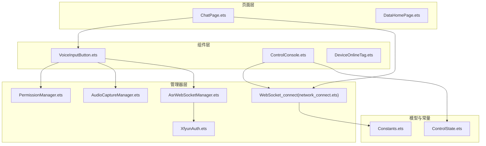
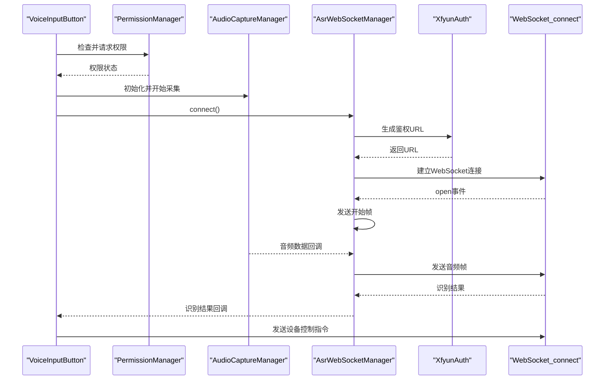
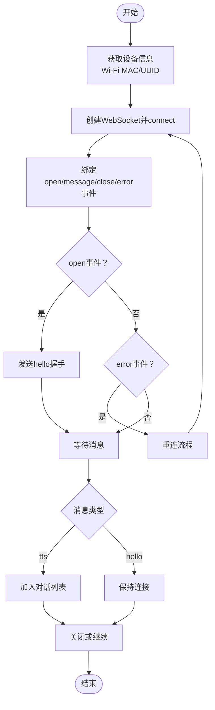
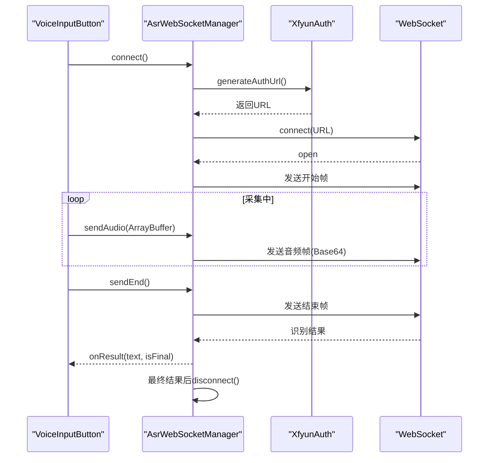
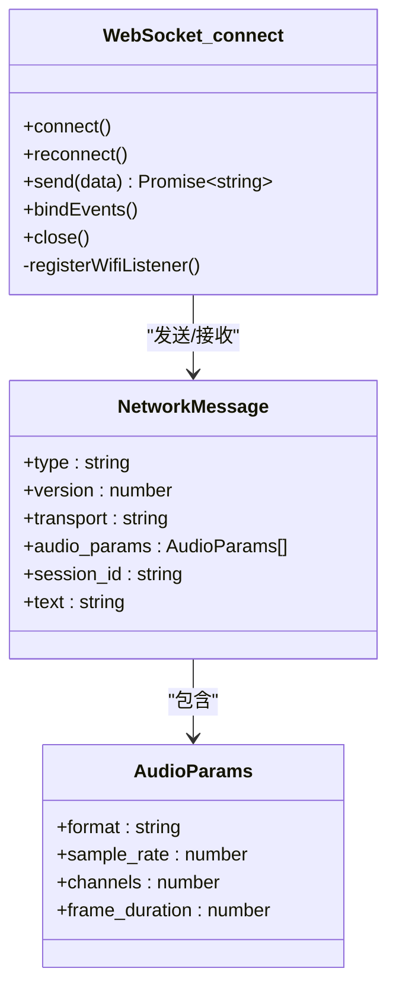
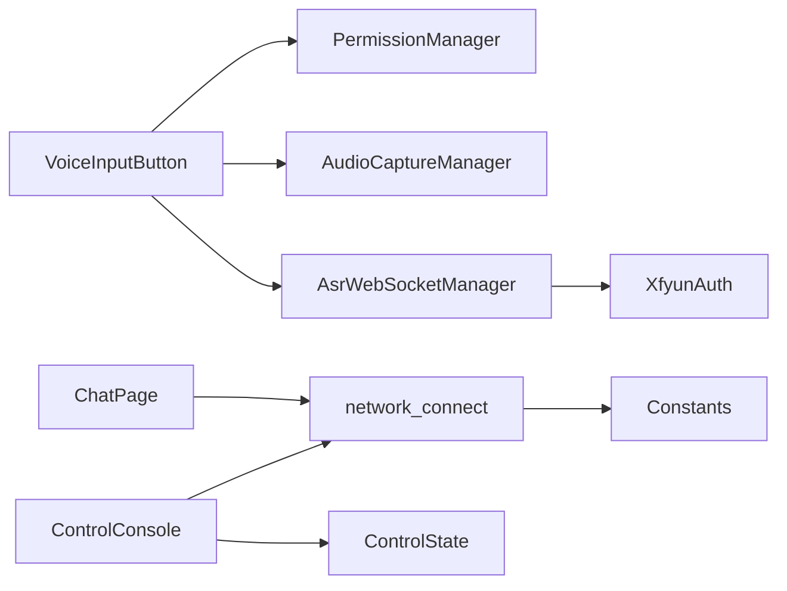

# 设备通信系统

<cite>
**本文引用的文件**
- [AsrWebSocketManager.ets](file://entry/src/main/ets/managers/AsrWebSocketManager.ets)
- [PermissionManager.ets](file://entry/src/main/ets/managers/PermissionManager.ets)
- [XfyunAuth.ets](file://entry/src/main/ets/managers/XfyunAuth.ets)
- [Constants.ets](file://entry/src/main/ets/common/Constants.ets)
- [AudioCaptureManager.ets](file://entry/src/main/ets/managers/AudioCaptureManager.ets)
- [network_connect.ets](file://entry/src/main/ets/pages/network_connect.ets)
- [VoiceInputButton.ets](file://entry/src/main/ets/components/chat/VoiceInputButton.ets)
- [ChatPage.ets](file://entry/src/main/ets/pages/ChatPage.ets)
- [ControlConsole.ets](file://entry/src/main/ets/components/control/ControlConsole.ets)
- [ControlState.ets](file://entry/src/main/ets/models/ControlState.ets)
- [DeviceOnlineTag.ets](file://entry/src/main/ets/components/device/DeviceOnlineTag.ets)
- [get_data.ets](file://entry/src/main/ets/pages/get_data.ets)
- [TrendChartCard.ets](file://entry/src/main/ets/pages/TrendChartCard.ets)
- [DateUtils.ets](file://entry/src/main/ets/utils/DateUtils.ets)
</cite>

## 目录
1. [简介](#简介)
2. [项目结构](#项目结构)
3. [核心组件](#核心组件)
4. [架构总览](#架构总览)
5. [详细组件分析](#详细组件分析)
6. [依赖关系分析](#依赖关系分析)
7. [性能考量](#性能考量)
8. [故障排查指南](#故障排查指南)
9. [结论](#结论)
10. [附录](#附录)

## 简介
本技术文档面向设备通信系统，聚焦以下目标：
- WebSocket 连接管理：连接建立、事件绑定、断线重连与异常处理
- 设备控制协议：命令格式、数据编码与响应处理
- 网络状态监控：连接状态检测、WiFi 状态监听与故障诊断
- 权限管理：运行时权限申请、状态检查与变更处理
- 网络安全：鉴权与加密思路（基于讯飞 ASR 的鉴权流程）
- 调试与监控：日志、状态可视化与问题定位
- 扩展指南：如何扩展通信协议与接入新设备类型

## 项目结构
系统采用分层组织：
- managers：通信与权限管理模块
- pages：页面与全局状态
- components：UI 组件
- models：数据模型
- utils：通用工具
- common：常量与公共能力

图表来源
- [network_connect.ets:1-318](file://entry/src/main/ets/pages/network_connect.ets#L1-L318)
- [VoiceInputButton.ets:1-125](file://entry/src/main/ets/components/chat/VoiceInputButton.ets#L1-L125)
- [PermissionManager.ets:1-28](file://entry/src/main/ets/managers/PermissionManager.ets#L1-L28)
- [AudioCaptureManager.ets:1-80](file://entry/src/main/ets/managers/AudioCaptureManager.ets#L1-L80)
- [AsrWebSocketManager.ets:1-271](file://entry/src/main/ets/managers/AsrWebSocketManager.ets#L1-L271)
- [XfyunAuth.ets:1-34](file://entry/src/main/ets/managers/XfyunAuth.ets#L1-L34)
- [ControlConsole.ets:1-172](file://entry/src/main/ets/components/control/ControlConsole.ets#L1-L172)
- [ControlState.ets:1-67](file://entry/src/main/ets/models/ControlState.ets#L1-L67)
- [Constants.ets:1-82](file://entry/src/main/ets/common/Constants.ets#L1-L82)

章节来源
- [network_connect.ets:1-318](file://entry/src/main/ets/pages/network_connect.ets#L1-L318)
- [VoiceInputButton.ets:1-125](file://entry/src/main/ets/components/chat/VoiceInputButton.ets#L1-L125)
- [ControlConsole.ets:1-172](file://entry/src/main/ets/components/control/ControlConsole.ets#L1-L172)

## 核心组件
- WebSocket 连接管理器：负责 WebSocket 建连、事件绑定、消息解析、断线重连与清理
- 讯飞语音鉴权：生成 WebSocket 鉴权 URL，支持 HMAC-SHA256 签名与 Base64 编码
- 语音识别 WebSocket 管理器：ASR 流式音频传输、开始/结束帧、结果拼接与回调
- 音频采集管理器：麦克风音频采集、RAW PCM 格式、流事件回调
- 权限管理器：运行时权限检查与申请（麦克风、网络）
- 控制台组件：设备控制 UI 与状态同步，通过 WebSocket 发送控制指令
- 在线状态标签：设备在线/离线状态可视化

章节来源
- [network_connect.ets:146-177](file://entry/src/main/ets/pages/network_connect.ets#L146-L177)
- [XfyunAuth.ets:6-24](file://entry/src/main/ets/managers/XfyunAuth.ets#L6-L24)
- [AsrWebSocketManager.ets:82-144](file://entry/src/main/ets/managers/AsrWebSocketManager.ets#L82-L144)
- [AudioCaptureManager.ets:6-34](file://entry/src/main/ets/managers/AudioCaptureManager.ets#L6-L34)
- [PermissionManager.ets:5-27](file://entry/src/main/ets/managers/PermissionManager.ets#L5-L27)
- [ControlConsole.ets:13-172](file://entry/src/main/ets/components/control/ControlConsole.ets#L13-L172)
- [DeviceOnlineTag.ets:8-31](file://entry/src/main/ets/components/device/DeviceOnlineTag.ets#L8-L31)

## 架构总览
系统由“页面-组件-管理器-模型-常量”构成，页面通过组件与管理器交互，管理器封装底层网络与多媒体能力。

图表来源
- [VoiceInputButton.ets:18-82](file://entry/src/main/ets/components/chat/VoiceInputButton.ets#L18-L82)
- [AsrWebSocketManager.ets:92-144](file://entry/src/main/ets/managers/AsrWebSocketManager.ets#L92-L144)
- [XfyunAuth.ets:7-23](file://entry/src/main/ets/managers/XfyunAuth.ets#L7-L23)
- [network_connect.ets:179-258](file://entry/src/main/ets/pages/network_connect.ets#L179-L258)

## 详细组件分析

### WebSocket 连接管理器（设备控制）
- 连接建立：构造 URL，设置自定义 Header（设备 ID、客户端 ID），绑定 open/message/close/error 事件
- 断线重连：防并发重连锁，清理旧连接，延迟重连（等待路由稳定），失败记录
- 网络状态监控：注册 WiFi 状态监听，断开时标记离线，恢复时延时重连
- 消息处理：解析服务端消息，区分会话 ID、TTS 文本等；错误时标记离线并清理未完成请求
- 发送流程：生成 requestId，缓存回调，发送后记录日志；发送失败从缓存移除并 reject

图表来源
- [network_connect.ets:146-177](file://entry/src/main/ets/pages/network_connect.ets#L146-L177)
- [network_connect.ets:179-258](file://entry/src/main/ets/pages/network_connect.ets#L179-L258)
- [network_connect.ets:74-96](file://entry/src/main/ets/pages/network_connect.ets#L74-L96)

章节来源
- [network_connect.ets:36-315](file://entry/src/main/ets/pages/network_connect.ets#L36-L315)

### 讯飞语音识别 WebSocket 管理器
- 鉴权与连接：生成 Authorization、Date、Host 参数，构建 wss URL，建立连接
- 帧格式：开始帧、音频帧、结束帧，音频编码为 Base64 RAW PCM
- 结果处理：乱序结果缓存与拼接，动态替换（rpl）处理，最终结果触发关闭连接
- 错误处理：消息解析失败、业务错误码、发送/关闭异常均记录日志

图表来源
- [AsrWebSocketManager.ets:92-144](file://entry/src/main/ets/managers/AsrWebSocketManager.ets#L92-L144)
- [AsrWebSocketManager.ets:146-195](file://entry/src/main/ets/managers/AsrWebSocketManager.ets#L146-L195)
- [AsrWebSocketManager.ets:197-254](file://entry/src/main/ets/managers/AsrWebSocketManager.ets#L197-L254)
- [XfyunAuth.ets:7-23](file://entry/src/main/ets/managers/XfyunAuth.ets#L7-L23)

章节来源
- [AsrWebSocketManager.ets:82-271](file://entry/src/main/ets/managers/AsrWebSocketManager.ets#L82-L271)
- [XfyunAuth.ets:6-34](file://entry/src/main/ets/managers/XfyunAuth.ets#L6-L34)
- [Constants.ets:4-14](file://entry/src/main/ets/common/Constants.ets#L4-L14)

### 音频采集管理器
- 初始化：配置采样率、通道、采样格式、编码类型，选择麦克风源
- 采集：注册 readData 回调，start 成功后进入采集状态
- 停止与释放：stop 与 release 均带错误处理，避免资源泄漏

章节来源
- [AudioCaptureManager.ets:6-80](file://entry/src/main/ets/managers/AudioCaptureManager.ets#L6-L80)
- [Constants.ets:4-8](file://entry/src/main/ets/common/Constants.ets#L4-L8)

### 权限管理器
- 检查与申请：遍历所需权限，若未全部授予则弹窗申请，返回统一授权结果
- 错误兜底：捕获异常并返回 false，保证 UI 可用性

章节来源
- [PermissionManager.ets:5-27](file://entry/src/main/ets/managers/PermissionManager.ets#L5-L27)

### 设备控制协议设计
- 协议版本：通过 hello 消息携带版本号与特性标志
- 音频参数：格式、采样率、通道、帧时长
- 命令格式：listen 类型，state 字段（如 detect），text 字段承载自然语言指令
- 响应处理：服务端返回 tts 文本，客户端将其加入对话列表

图表来源
- [network_connect.ets:36-315](file://entry/src/main/ets/pages/network_connect.ets#L36-L315)
- [network_connect.ets:6-27](file://entry/src/main/ets/pages/network_connect.ets#L6-L27)

章节来源
- [network_connect.ets:179-258](file://entry/src/main/ets/pages/network_connect.ets#L179-L258)
- [network_connect.ets:260-295](file://entry/src/main/ets/pages/network_connect.ets#L260-L295)

### 设备控制台与状态模型
- 控制模式：场景、开关、模拟量
- 按钮类型：展示、告警、静音
- 状态字段：蜂鸣器、多色灯、小灯亮度、风扇转速、执行器占用与占比
- UI 同步：组件内维护 selectedButton 与 controlState 同步，状态变更回调上抛

章节来源
- [ControlState.ets:1-67](file://entry/src/main/ets/models/ControlState.ets#L1-L67)
- [ControlConsole.ets:13-172](file://entry/src/main/ets/components/control/ControlConsole.ets#L13-L172)

### 在线状态标签
- 根据 isOnline 渲染圆点与文字，颜色与背景随状态变化

章节来源
- [DeviceOnlineTag.ets:8-31](file://entry/src/main/ets/components/device/DeviceOnlineTag.ets#L8-L31)

## 依赖关系分析
- 组件依赖：VoiceInputButton 依赖 PermissionManager、AudioCaptureManager、AsrWebSocketManager；ControlConsole 依赖 ControlState 与 network_connect；ChatPage 依赖 network_connect
- 管理器依赖：AsrWebSocketManager 依赖 XfyunAuth；WebSocket_connect 依赖 Constants
- 页面依赖：ChatPage 与 DataHomePage 使用退出确认管理器 ExitConfirmManager

图表来源
- [VoiceInputButton.ets:2-16](file://entry/src/main/ets/components/chat/VoiceInputButton.ets#L2-L16)
- [AsrWebSocketManager.ets:2-5](file://entry/src/main/ets/managers/AsrWebSocketManager.ets#L2-L5)
- [ControlConsole.ets:7](file://entry/src/main/ets/components/control/ControlConsole.ets#L7)
- [network_connect.ets:40](file://entry/src/main/ets/pages/network_connect.ets#L40)

章节来源
- [VoiceInputButton.ets:1-125](file://entry/src/main/ets/components/chat/VoiceInputButton.ets#L1-L125)
- [ControlConsole.ets:1-172](file://entry/src/main/ets/components/control/ControlConsole.ets#L1-L172)
- [network_connect.ets:1-318](file://entry/src/main/ets/pages/network_connect.ets#L1-L318)

## 性能考量
- 音频采集：使用 RAW PCM 与固定采样率，减少编解码开销；按需启动/停止，避免后台持续占用
- WebSocket：使用事件驱动与请求缓存，避免阻塞 UI；重连时加锁与延迟，降低抖动
- 网络监听：WiFi 状态变更后延迟重连，等待路由稳定，提升成功率
- 日志输出：关键路径打印日志，便于定位问题但避免高频 IO

## 故障排查指南
- 权限问题：若识别按钮显示“缺少必要权限”，检查麦克风与网络权限是否授予
- 连接失败：查看控制台日志中“连接失败/异常/重连”等信息；确认 IP 与端口、鉴权参数
- 识别异常：确认鉴权 URL 生成是否成功；检查音频帧发送与结束帧是否到达
- 状态不同步：检查 ControlConsole 中 selectedButton 与 controlState 的同步逻辑
- 网络波动：关注 WiFi 状态监听与重连策略，确认断网后离线标记与恢复后的重连

章节来源
- [PermissionManager.ets:8-26](file://entry/src/main/ets/managers/PermissionManager.ets#L8-L26)
- [network_connect.ets:250-257](file://entry/src/main/ets/pages/network_connect.ets#L250-L257)
- [AsrWebSocketManager.ets:112-133](file://entry/src/main/ets/managers/AsrWebSocketManager.ets#L112-L133)
- [ControlConsole.ets:156-171](file://entry/src/main/ets/components/control/ControlConsole.ets#L156-L171)

## 结论
该系统通过清晰的分层与职责划分，实现了从权限申请、音频采集、语音识别到设备控制的完整链路。WebSocket 连接管理器提供了稳健的连接生命周期与重连策略，结合 WiFi 状态监听实现网络质量感知与自动恢复。控制台组件将设备状态与 UI 同步，形成闭环。建议后续在协议扩展、安全加固与监控埋点方面持续演进。

## 附录

### 网络状态监控与故障诊断
- WiFi 监听：注册 wifiConnectionChange 事件，断开时标记离线，恢复后延时重连
- 连接状态：open/close/error 事件驱动 state 标志位，供 UI 组件渲染
- 重连策略：防并发重连锁、最大尝试次数、清理未完成请求

章节来源
- [network_connect.ets:74-96](file://entry/src/main/ets/pages/network_connect.ets#L74-L96)
- [network_connect.ets:102-128](file://entry/src/main/ets/pages/network_connect.ets#L102-L128)
- [network_connect.ets:233-258](file://entry/src/main/ets/pages/network_connect.ets#L233-L258)

### 权限管理最佳实践
- 在组件首次出现时检查并请求权限，失败时提示用户
- 释放资源：组件消失时释放音频与关闭 WebSocket，避免内存泄漏
- 统一错误处理：捕获异常并降级 UI，保证可用性

章节来源
- [PermissionManager.ets:8-26](file://entry/src/main/ets/managers/PermissionManager.ets#L8-L26)
- [VoiceInputButton.ets:25-28](file://entry/src/main/ets/components/chat/VoiceInputButton.ets#L25-L28)

### 网络安全与数据加密
- 讯飞 ASR 鉴权：HMAC-SHA256 签名 + Base64 编码 Authorization，使用 UTC 时间与 Host 头
- 传输安全：使用 wss（WebSocket Secure）加密通道
- 建议：在设备控制协议中引入设备指纹与签名校验，结合 TLS 证书校验

章节来源
- [XfyunAuth.ets:7-23](file://entry/src/main/ets/managers/XfyunAuth.ets#L7-L23)
- [AsrWebSocketManager.ets:95](file://entry/src/main/ets/managers/AsrWebSocketManager.ets#L95)

### 调试工具与监控方法
- 日志：连接、消息、错误、重连、鉴权等关键节点均有日志输出
- UI 状态：DeviceOnlineTag、ControlConsole 等组件直观反映状态
- 时间戳：DateUtils 提供格式化时间，便于日志关联与问题复盘

章节来源
- [DateUtils.ets:4-27](file://entry/src/main/ets/utils/DateUtils.ets#L4-L27)
- [network_connect.ets:182-229](file://entry/src/main/ets/pages/network_connect.ets#L182-L229)
- [AsrWebSocketManager.ets:197-254](file://entry/src/main/ets/managers/AsrWebSocketManager.ets#L197-L254)

### 扩展通信协议与集成新设备类型
- 新协议扩展：在 network_connect 中新增消息类型分支与处理逻辑，保持与服务端约定一致
- 新设备接入：在 ControlState 中增加设备特有状态字段，ControlConsole 中添加对应 UI 控件并通过 send 方法下发指令
- 音频协议：若需其他音频格式，调整 AudioCaptureManager 的 streamInfo 与 AsrWebSocketManager 的帧格式

章节来源
- [network_connect.ets:214-229](file://entry/src/main/ets/pages/network_connect.ets#L214-L229)
- [ControlState.ets:28-67](file://entry/src/main/ets/models/ControlState.ets#L28-L67)
- [ControlConsole.ets:49-144](file://entry/src/main/ets/components/control/ControlConsole.ets#L49-L144)